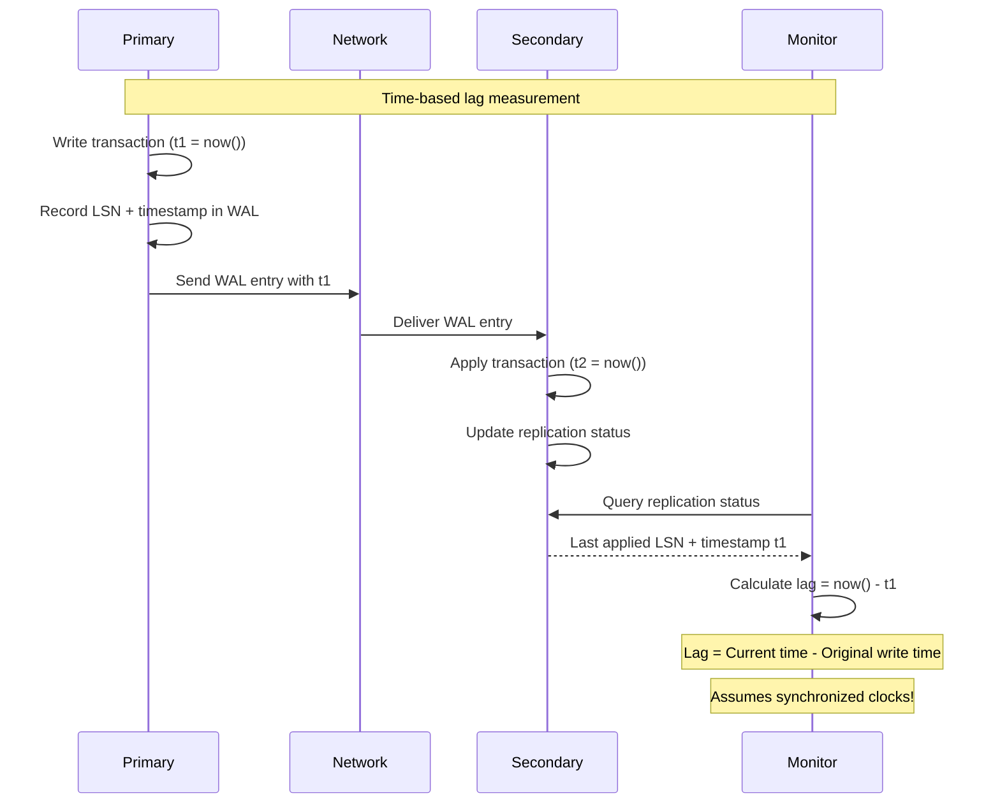
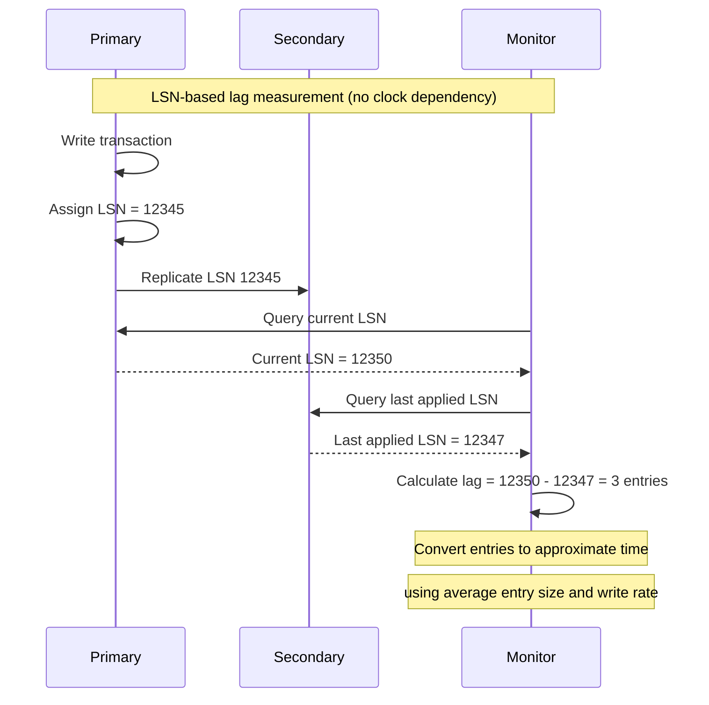

# Replication Lag Monitoring

## Understanding Replication Lag

Replication lag is the delay between a write being committed on the primary and being applied on secondaries. Monitoring and minimizing this lag is crucial for data consistency and read performance.

### Types of Replication Lag

```mermaid
graph TB
    subgraph Replication Lag Components
        subgraph Network Lag
            NET_PROP[Network Propagation<br/>- Physical distance<br/>- Bandwidth limitations<br/>- Packet loss/retransmission]
            NET_QUEUE[Network Queuing<br/>- Buffer saturation<br/>- TCP congestion<br/>- Router delays]
        end

        subgraph Processing Lag
            PROC_PARSE[Parsing Lag<br/>- WAL entry parsing<br/>- Transaction reconstruction<br/>- Validation overhead]
            PROC_APPLY[Apply Lag<br/>- Disk I/O waits<br/>- Lock contention<br/>- CPU scheduling]
        end

        subgraph Storage Lag
            STOR_WRITE[Write Lag<br/>- fsync() delays<br/>- Disk queue depth<br/>- Storage latency]
            STOR_INDEX[Index Update Lag<br/>- Index maintenance<br/>- B-tree splits<br/>- Statistics updates]
        end

        subgraph Total Lag
            TOTAL[Total Replication Lag<br/>Sum of all components<br/>Measured end-to-end]
        end
    end

    NET_PROP --> TOTAL
    NET_QUEUE --> TOTAL
    PROC_PARSE --> TOTAL
    PROC_APPLY --> TOTAL
    STOR_WRITE --> TOTAL
    STOR_INDEX --> TOTAL

    %% Apply 4-plane colors
    classDef edgeStyle fill:#3B82F6,stroke:#2563EB,color:#fff
    classDef serviceStyle fill:#10B981,stroke:#059669,color:#fff
    classDef stateStyle fill:#F59E0B,stroke:#D97706,color:#fff
    classDef controlStyle fill:#8B5CF6,stroke:#7C3AED,color:#fff

    class NET_PROP,NET_QUEUE edgeStyle
    class PROC_PARSE,PROC_APPLY serviceStyle
    class STOR_WRITE,STOR_INDEX stateStyle
    class TOTAL controlStyle
```

### Lag Measurement Techniques

#### Time-Based Lag Measurement



#### LSN-Based Lag Measurement



## Production Monitoring Implementation

### PostgreSQL Replication Lag Monitoring

```sql
-- PostgreSQL replication lag queries

-- Lag in bytes (primary perspective)
SELECT
    client_addr,
    application_name,
    state,
    pg_wal_lsn_diff(pg_current_wal_lsn(), sent_lsn) AS send_lag_bytes,
    pg_wal_lsn_diff(pg_current_wal_lsn(), flush_lsn) AS flush_lag_bytes,
    pg_wal_lsn_diff(pg_current_wal_lsn(), replay_lsn) AS replay_lag_bytes
FROM pg_stat_replication;

-- Lag in time (standby perspective)
SELECT
    CASE
        WHEN pg_last_wal_receive_lsn() = pg_last_wal_replay_lsn() THEN 0
        ELSE EXTRACT(EPOCH FROM (now() - pg_last_xact_replay_timestamp()))
    END AS lag_seconds;

-- Comprehensive lag monitoring view
CREATE VIEW replication_lag_monitor AS
SELECT
    application_name,
    client_addr,
    state,
    -- Bytes behind
    pg_wal_lsn_diff(pg_current_wal_lsn(), replay_lsn) AS bytes_lag,
    -- Estimated time lag
    CASE
        WHEN replay_lsn IS NULL THEN NULL
        WHEN pg_last_wal_receive_lsn() = pg_last_wal_replay_lsn() THEN INTERVAL '0'
        ELSE now() - pg_last_xact_replay_timestamp()
    END AS time_lag,
    -- Write rate for estimation
    CASE
        WHEN replay_lag IS NULL THEN NULL
        ELSE pg_wal_lsn_diff(pg_current_wal_lsn(), replay_lsn) /
             GREATEST(EXTRACT(EPOCH FROM replay_lag), 1)
    END AS write_rate_bytes_per_sec
FROM pg_stat_replication;
```

### MySQL Replication Lag Monitoring

```sql
-- MySQL replication lag monitoring

-- Basic lag information
SHOW SLAVE STATUS\G

-- Comprehensive lag monitoring query
SELECT
    CHANNEL_NAME,
    HOST,
    PORT,
    SERVICE_STATE,
    LAST_ERROR,
    -- Time-based lag
    SOURCE_LOG_FILE,
    READ_SOURCE_LOG_POS,
    RELAY_LOG_FILE,
    RELAY_LOG_POS,
    -- Seconds behind master (time-based)
    SECONDS_BEHIND_SOURCE as lag_seconds,
    -- Connection status
    SLAVE_IO_RUNNING,
    SLAVE_SQL_RUNNING,
    -- Performance metrics
    AVG_TRANSACTION_SIZE,
    PROCESSING_TIME,
    BUFFER_SIZE
FROM performance_schema.replication_connection_status rcs
JOIN performance_schema.replication_applier_status_by_worker rasw
ON rcs.CHANNEL_NAME = rasw.CHANNEL_NAME;

-- Custom lag measurement using heartbeat
CREATE TABLE heartbeat (
    ts TIMESTAMP(6) NOT NULL,
    server_id INT NOT NULL,
    PRIMARY KEY (server_id)
);

-- On primary (every second)
REPLACE INTO heartbeat (ts, server_id) VALUES (NOW(6), @@server_id);

-- Lag calculation on secondary
SELECT
    TIMESTAMPDIFF(MICROSECOND, h.ts, NOW(6)) / 1000000 as lag_seconds
FROM heartbeat h
WHERE h.server_id = @primary_server_id;
```

### Custom Lag Monitoring Tool

```python
#!/usr/bin/env python3
# replication_lag_monitor.py

import time
import psycopg2
import mysql.connector
import redis
import json
from datetime import datetime, timedelta
from typing import Dict, List, Optional

class ReplicationLagMonitor:
    def __init__(self, config: Dict):
        self.config = config
        self.redis_client = redis.Redis(
            host=config['redis']['host'],
            port=config['redis']['port'],
            db=config['redis']['db']
        )

    def measure_postgresql_lag(self, primary_config: Dict, secondary_configs: List[Dict]) -> Dict:
        """Measure PostgreSQL replication lag"""
        lags = {}

        # Connect to primary
        primary_conn = psycopg2.connect(**primary_config)
        primary_cur = primary_conn.cursor()

        # Get current WAL LSN from primary
        primary_cur.execute("SELECT pg_current_wal_lsn()")
        current_lsn = primary_cur.fetchone()[0]

        # Check each secondary
        for secondary_config in secondary_configs:
            try:
                secondary_conn = psycopg2.connect(**secondary_config)
                secondary_cur = secondary_conn.cursor()

                # Get last replayed LSN
                secondary_cur.execute("SELECT pg_last_wal_replay_lsn()")
                replay_lsn = secondary_cur.fetchone()[0]

                # Calculate byte lag
                primary_cur.execute(
                    "SELECT pg_wal_lsn_diff(%s, %s)",
                    (current_lsn, replay_lsn)
                )
                byte_lag = primary_cur.fetchone()[0]

                # Get time lag
                secondary_cur.execute("""
                    SELECT CASE
                        WHEN pg_last_wal_receive_lsn() = pg_last_wal_replay_lsn() THEN 0
                        ELSE EXTRACT(EPOCH FROM (now() - pg_last_xact_replay_timestamp()))
                    END
                """)
                time_lag = secondary_cur.fetchone()[0] or 0

                lags[secondary_config['host']] = {
                    'byte_lag': byte_lag,
                    'time_lag_seconds': float(time_lag),
                    'current_lsn': current_lsn,
                    'replay_lsn': replay_lsn,
                    'status': 'healthy' if time_lag < 10 else 'warning' if time_lag < 60 else 'critical'
                }

                secondary_conn.close()

            except Exception as e:
                lags[secondary_config['host']] = {
                    'error': str(e),
                    'status': 'error'
                }

        primary_conn.close()
        return lags

    def measure_mysql_lag(self, primary_config: Dict, secondary_configs: List[Dict]) -> Dict:
        """Measure MySQL replication lag"""
        lags = {}

        for secondary_config in secondary_configs:
            try:
                conn = mysql.connector.connect(**secondary_config)
                cursor = conn.cursor(dictionary=True)

                cursor.execute("SHOW SLAVE STATUS")
                status = cursor.fetchone()

                if status:
                    lag_seconds = status['Seconds_Behind_Master']
                    io_running = status['Slave_IO_Running'] == 'Yes'
                    sql_running = status['Slave_SQL_Running'] == 'Yes'

                    lags[secondary_config['host']] = {
                        'time_lag_seconds': lag_seconds if lag_seconds is not None else 0,
                        'io_thread_running': io_running,
                        'sql_thread_running': sql_running,
                        'master_log_file': status['Master_Log_File'],
                        'read_master_log_pos': status['Read_Master_Log_Pos'],
                        'relay_log_file': status['Relay_Log_File'],
                        'relay_log_pos': status['Relay_Log_Pos'],
                        'last_error': status['Last_Error'],
                        'status': self._get_mysql_status(lag_seconds, io_running, sql_running)
                    }
                else:
                    lags[secondary_config['host']] = {
                        'error': 'No replication status available',
                        'status': 'error'
                    }

                conn.close()

            except Exception as e:
                lags[secondary_config['host']] = {
                    'error': str(e),
                    'status': 'error'
                }

        return lags

    def _get_mysql_status(self, lag_seconds: Optional[int], io_running: bool, sql_running: bool) -> str:
        """Determine MySQL replication status"""
        if not io_running or not sql_running:
            return 'critical'
        elif lag_seconds is None:
            return 'warning'
        elif lag_seconds < 10:
            return 'healthy'
        elif lag_seconds < 60:
            return 'warning'
        else:
            return 'critical'

    def store_metrics(self, database_type: str, lags: Dict):
        """Store lag metrics in Redis for monitoring"""
        timestamp = datetime.now().isoformat()

        for host, lag_data in lags.items():
            key = f"replication_lag:{database_type}:{host}"

            # Store current metrics
            self.redis_client.hset(key, mapping={
                'timestamp': timestamp,
                'data': json.dumps(lag_data)
            })

            # Store time series for graphing
            if 'time_lag_seconds' in lag_data:
                ts_key = f"replication_lag_ts:{database_type}:{host}"
                self.redis_client.zadd(ts_key, {
                    json.dumps({
                        'timestamp': timestamp,
                        'lag_seconds': lag_data['time_lag_seconds']
                    }): time.time()
                })

                # Keep only last 24 hours
                cutoff = time.time() - 86400
                self.redis_client.zremrangebyscore(ts_key, 0, cutoff)

    def get_lag_summary(self, database_type: str) -> Dict:
        """Get summary of current replication lag"""
        pattern = f"replication_lag:{database_type}:*"
        keys = self.redis_client.keys(pattern)

        summary = {
            'total_replicas': len(keys),
            'healthy': 0,
            'warning': 0,
            'critical': 0,
            'error': 0,
            'max_lag_seconds': 0,
            'avg_lag_seconds': 0,
            'replicas': {}
        }

        total_lag = 0
        valid_lags = 0

        for key in keys:
            host = key.decode().split(':')[-1]
            data = self.redis_client.hget(key, 'data')

            if data:
                lag_data = json.loads(data)
                summary['replicas'][host] = lag_data

                status = lag_data.get('status', 'unknown')
                summary[status] = summary.get(status, 0) + 1

                if 'time_lag_seconds' in lag_data:
                    lag_seconds = lag_data['time_lag_seconds']
                    summary['max_lag_seconds'] = max(summary['max_lag_seconds'], lag_seconds)
                    total_lag += lag_seconds
                    valid_lags += 1

        if valid_lags > 0:
            summary['avg_lag_seconds'] = total_lag / valid_lags

        return summary

    def run_monitoring_loop(self):
        """Main monitoring loop"""
        print("Starting replication lag monitoring...")

        while True:
            try:
                # Monitor PostgreSQL
                if 'postgresql' in self.config:
                    pg_config = self.config['postgresql']
                    pg_lags = self.measure_postgresql_lag(
                        pg_config['primary'],
                        pg_config['secondaries']
                    )
                    self.store_metrics('postgresql', pg_lags)

                    summary = self.get_lag_summary('postgresql')
                    print(f"PostgreSQL - Healthy: {summary['healthy']}, "
                          f"Warning: {summary['warning']}, "
                          f"Critical: {summary['critical']}, "
                          f"Max lag: {summary['max_lag_seconds']:.2f}s")

                # Monitor MySQL
                if 'mysql' in self.config:
                    mysql_config = self.config['mysql']
                    mysql_lags = self.measure_mysql_lag(
                        mysql_config['primary'],
                        mysql_config['secondaries']
                    )
                    self.store_metrics('mysql', mysql_lags)

                    summary = self.get_lag_summary('mysql')
                    print(f"MySQL - Healthy: {summary['healthy']}, "
                          f"Warning: {summary['warning']}, "
                          f"Critical: {summary['critical']}, "
                          f"Max lag: {summary['max_lag_seconds']:.2f}s")

            except Exception as e:
                print(f"Error in monitoring loop: {e}")

            time.sleep(self.config.get('monitoring_interval', 30))

if __name__ == "__main__":
    config = {
        'postgresql': {
            'primary': {
                'host': 'pg-primary.internal',
                'port': 5432,
                'database': 'postgres',
                'user': 'monitor',
                'password': 'secret'
            },
            'secondaries': [
                {
                    'host': 'pg-standby-1.internal',
                    'port': 5432,
                    'database': 'postgres',
                    'user': 'monitor',
                    'password': 'secret'
                },
                {
                    'host': 'pg-standby-2.internal',
                    'port': 5432,
                    'database': 'postgres',
                    'user': 'monitor',
                    'password': 'secret'
                }
            ]
        },
        'mysql': {
            'primary': {
                'host': 'mysql-primary.internal',
                'port': 3306,
                'database': 'information_schema',
                'user': 'monitor',
                'password': 'secret'
            },
            'secondaries': [
                {
                    'host': 'mysql-replica-1.internal',
                    'port': 3306,
                    'database': 'information_schema',
                    'user': 'monitor',
                    'password': 'secret'
                }
            ]
        },
        'redis': {
            'host': 'redis.internal',
            'port': 6379,
            'db': 0
        },
        'monitoring_interval': 30
    }

    monitor = ReplicationLagMonitor(config)
    monitor.run_monitoring_loop()
```

## Lag Visualization and Alerting

### Grafana Dashboard Configuration

```yaml
# Grafana dashboard for replication lag
grafana_dashboard:
  title: "Database Replication Lag"
  panels:
    - title: "Replication Lag by Instance"
      type: "graph"
      targets:
        - expr: 'mysql_slave_lag_seconds'
          legendFormat: 'MySQL {{ instance }}'
        - expr: 'postgresql_replication_lag_seconds'
          legendFormat: 'PostgreSQL {{ instance }}'
      yAxes:
        - unit: "seconds"
          min: 0
      thresholds:
        - value: 10
          color: "yellow"
        - value: 60
          color: "red"

    - title: "Lag Distribution"
      type: "histogram"
      targets:
        - expr: 'histogram_quantile(0.95, rate(replication_lag_seconds_bucket[5m]))'
          legendFormat: 'p95'
        - expr: 'histogram_quantile(0.99, rate(replication_lag_seconds_bucket[5m]))'
          legendFormat: 'p99'

    - title: "Replication Health Status"
      type: "stat"
      targets:
        - expr: 'count by (status) (replication_status)'
          legendFormat: '{{ status }}'
      fieldConfig:
        mappings:
          - options:
              healthy: { color: "green", text: "Healthy" }
              warning: { color: "yellow", text: "Warning" }
              critical: { color: "red", text: "Critical" }

  alerts:
    - name: "High Replication Lag"
      condition: "avg(mysql_slave_lag_seconds) > 30"
      frequency: "1m"
      message: "Replication lag is high"
      notifications: ["slack", "pagerduty"]
```

### Prometheus Alerting Rules

```yaml
# Prometheus alerting rules for replication lag
groups:
- name: replication.rules
  rules:
  - alert: ReplicationLagHigh
    expr: mysql_slave_lag_seconds > 30
    for: 2m
    labels:
      severity: warning
    annotations:
      summary: "MySQL replication lag is high"
      description: "Replication lag on {{ $labels.instance }} is {{ $value }} seconds"

  - alert: ReplicationLagCritical
    expr: mysql_slave_lag_seconds > 300
    for: 1m
    labels:
      severity: critical
    annotations:
      summary: "MySQL replication lag is critical"
      description: "Replication lag on {{ $labels.instance }} is {{ $value }} seconds"

  - alert: ReplicationStopped
    expr: mysql_slave_running == 0
    for: 30s
    labels:
      severity: critical
    annotations:
      summary: "MySQL replication stopped"
      description: "Replication has stopped on {{ $labels.instance }}"

  - alert: PostgreSQLReplicationLag
    expr: postgresql_replication_lag_seconds > 60
    for: 2m
    labels:
      severity: warning
    annotations:
      summary: "PostgreSQL replication lag detected"
      description: "PostgreSQL replication lag on {{ $labels.instance }} is {{ $value }} seconds"
```

This comprehensive replication lag monitoring guide provides the tools and techniques needed to measure, monitor, and alert on replication delays in production database environments.