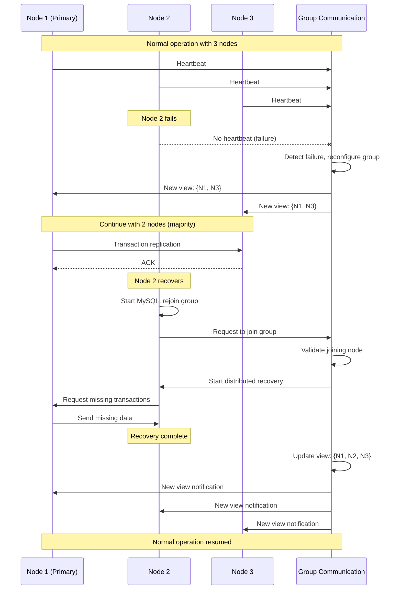

# MySQL Group Replication

## Architecture Overview

MySQL Group Replication provides virtually synchronous multi-master replication with automatic failover, conflict detection, and distributed recovery.

### Group Replication Components

```mermaid
graph TB
    subgraph MySQL_Group_Replication_Cluster[MySQL Group Replication Cluster]
        subgraph Primary_Node__Writer[Primary Node (Writer)]
            PRIMARY[MySQL Primary<br/>- Accepts writes<br/>- Conflict detection<br/>- Transaction certification]
            GCS_PRIMARY[Group Communication System<br/>- Paxos consensus<br/>- Failure detection<br/>- View changes]
        end

        subgraph Secondary_Node_1__Reader[Secondary Node 1 (Reader)]
            SECONDARY1[MySQL Secondary 1<br/>- Read-only<br/>- Applies certified txns<br/>- Standby for primary]
            GCS_SEC1[Group Communication System<br/>- Consensus participant<br/>- View member]
        end

        subgraph Secondary_Node_2__Reader[Secondary Node 2 (Reader)]
            SECONDARY2[MySQL Secondary 2<br/>- Read-only<br/>- Applies certified txns<br/>- Standby for primary]
            GCS_SEC2[Group Communication System<br/>- Consensus participant<br/>- View member]
        end

        subgraph Distributed_Components[Distributed Components]
            REPLICATION_STREAM[Replication Stream<br/>- Transaction propagation<br/>- Conflict detection<br/>- Certification process]
            CONSENSUS[Consensus Protocol<br/>- Paxos-based<br/>- View management<br/>- Failure detection]
        end

        subgraph Clients
            WRITE_CLIENTS[Write Applications]
            READ_CLIENTS[Read Applications]
        end
    end

    WRITE_CLIENTS --> PRIMARY
    READ_CLIENTS --> SECONDARY1
    READ_CLIENTS --> SECONDARY2

    PRIMARY <--> GCS_PRIMARY
    SECONDARY1 <--> GCS_SEC1
    SECONDARY2 <--> GCS_SEC2

    GCS_PRIMARY <--> CONSENSUS
    GCS_SEC1 <--> CONSENSUS
    GCS_SEC2 <--> CONSENSUS

    PRIMARY --> REPLICATION_STREAM
    SECONDARY1 --> REPLICATION_STREAM
    SECONDARY2 --> REPLICATION_STREAM

    %% Apply 4-plane colors
    classDef edgeStyle fill:#3B82F6,stroke:#2563EB,color:#fff
    classDef serviceStyle fill:#10B981,stroke:#059669,color:#fff
    classDef stateStyle fill:#F59E0B,stroke:#D97706,color:#fff
    classDef controlStyle fill:#8B5CF6,stroke:#7C3AED,color:#fff

    class WRITE_CLIENTS,READ_CLIENTS edgeStyle
    class PRIMARY,SECONDARY1,SECONDARY2 serviceStyle
    class REPLICATION_STREAM stateStyle
    class GCS_PRIMARY,GCS_SEC1,GCS_SEC2,CONSENSUS controlStyle
```

### Transaction Certification Process

```mermaid
sequenceDiagram
    participant APP as Application
    participant P as Primary
    participant S1 as Secondary 1
    participant S2 as Secondary 2
    participant GCS as Group Communication

    Note over APP,GCS: MySQL Group Replication Transaction Flow

    APP->>P: BEGIN; UPDATE users SET name='John' WHERE id=1; COMMIT;

    P->>P: Execute transaction locally
    P->>P: Generate write set (table, key, values)

    Note over P,GCS: Broadcast for certification

    P->>GCS: Broadcast transaction + write set
    GCS->>GCS: Total order using Paxos consensus
    GCS->>P: Deliver ordered transaction
    GCS->>S1: Deliver ordered transaction
    GCS->>S2: Deliver ordered transaction

    Note over P,S2: Certification phase (parallel on all nodes)

    par Certification Check
        P->>P: Check conflicts with concurrent transactions
        S1->>S1: Check conflicts with concurrent transactions
        S2->>S2: Check conflicts with concurrent transactions
    end

    par Certification Result
        P->>P: COMMIT (certified)
        S1->>S1: COMMIT (certified)
        S2->>S2: COMMIT (certified)
    end

    P->>APP: Transaction successful

    Note over P,S2: All nodes have consistent state
```

## Configuration and Setup

### Group Replication Configuration

```sql
-- MySQL configuration for Group Replication (my.cnf)
[mysqld]
# Server identification
server-id = 1
gtid_mode = ON
enforce_gtid_consistency = ON
master_info_repository = TABLE
relay_log_info_repository = TABLE
binlog_checksum = NONE
log_slave_updates = ON
log_bin = binlog
binlog_format = ROW

# Group Replication settings
plugin_load_add = 'group_replication.so'
group_replication_group_name = "aaaaaaaa-aaaa-aaaa-aaaa-aaaaaaaaaaaa"
group_replication_start_on_boot = off
group_replication_local_address = "192.168.1.10:33061"
group_replication_group_seeds = "192.168.1.10:33061,192.168.1.11:33061,192.168.1.12:33061"

# Single primary mode (default) or multi-primary
group_replication_single_primary_mode = TRUE
group_replication_enforce_update_everywhere_checks = FALSE

# Performance and reliability
group_replication_compression_threshold = 1000000
group_replication_flow_control_mode = QUOTA
group_replication_transaction_size_limit = 150000000

# SSL (recommended for production)
group_replication_ssl_mode = REQUIRED
group_replication_ssl_cert = /etc/mysql/certs/server-cert.pem
group_replication_ssl_key = /etc/mysql/certs/server-key.pem
group_replication_ssl_ca = /etc/mysql/certs/ca.pem

# Recovery
group_replication_recovery_use_ssl = ON
group_replication_recovery_ssl_cert = /etc/mysql/certs/client-cert.pem
group_replication_recovery_ssl_key = /etc/mysql/certs/client-key.pem
group_replication_recovery_ssl_ca = /etc/mysql/certs/ca.pem
```

### Bootstrap and Node Addition

```sql
-- Initialize the group (run on first node only)
-- 1. Create replication user
CREATE USER 'repl'@'%' IDENTIFIED BY 'replication_password';
GRANT REPLICATION SLAVE ON *.* TO 'repl'@'%';
GRANT BACKUP_ADMIN ON *.* TO 'repl'@'%';
FLUSH PRIVILEGES;

-- 2. Configure recovery credentials
CHANGE MASTER TO MASTER_USER='repl', MASTER_PASSWORD='replication_password'
FOR CHANNEL 'group_replication_recovery';

-- 3. Install and start Group Replication
INSTALL PLUGIN group_replication SONAME 'group_replication.so';
SET GLOBAL group_replication_bootstrap_group=ON;
START GROUP_REPLICATION;
SET GLOBAL group_replication_bootstrap_group=OFF;

-- 4. Verify group status
SELECT * FROM performance_schema.replication_group_members;
```

```sql
-- Add additional nodes to the group
-- (Run on each new node after configuring my.cnf)

-- 1. Configure recovery credentials
CHANGE MASTER TO MASTER_USER='repl', MASTER_PASSWORD='replication_password'
FOR CHANNEL 'group_replication_recovery';

-- 2. Install and start Group Replication
INSTALL PLUGIN group_replication SONAME 'group_replication.so';
START GROUP_REPLICATION;

-- 3. Verify the node joined successfully
SELECT * FROM performance_schema.replication_group_members;
```

### Multi-Primary Configuration

```sql
-- Switch to multi-primary mode (all nodes can accept writes)
SELECT group_replication_switch_to_multi_primary_mode();

-- Configuration for multi-primary mode
SET GLOBAL group_replication_single_primary_mode = FALSE;
SET GLOBAL group_replication_enforce_update_everywhere_checks = TRUE;

-- Monitor multi-primary status
SELECT
    MEMBER_ID,
    MEMBER_HOST,
    MEMBER_PORT,
    MEMBER_STATE,
    MEMBER_ROLE
FROM performance_schema.replication_group_members;
```

## Monitoring and Management

### Performance Schema Monitoring

```sql
-- Group membership and status
SELECT
    MEMBER_ID,
    MEMBER_HOST,
    MEMBER_PORT,
    MEMBER_STATE,
    MEMBER_ROLE,
    MEMBER_VERSION
FROM performance_schema.replication_group_members;

-- Replication statistics
SELECT
    CHANNEL_NAME,
    MEMBER_ID,
    COUNT_TRANSACTIONS_IN_QUEUE,
    COUNT_TRANSACTIONS_CHECKED,
    COUNT_CONFLICTS_DETECTED,
    COUNT_TRANSACTIONS_ROWS_VALIDATING,
    TRANSACTIONS_COMMITTED_ALL_MEMBERS,
    LAST_CONFLICT_FREE_TRANSACTION,
    COUNT_TRANSACTIONS_REMOTE_IN_APPLIER_QUEUE,
    COUNT_TRANSACTIONS_REMOTE_APPLIED,
    COUNT_TRANSACTIONS_LOCAL_PROPOSED,
    COUNT_TRANSACTIONS_LOCAL_ROLLBACK
FROM performance_schema.replication_group_member_stats;

-- Connection status
SELECT
    CHANNEL_NAME,
    HOST,
    PORT,
    USER,
    SERVICE_STATE,
    LAST_HEARTBEAT_TIMESTAMP,
    RECEIVED_TRANSACTION_SET,
    LAST_ERROR_NUMBER,
    LAST_ERROR_MESSAGE,
    LAST_ERROR_TIMESTAMP
FROM performance_schema.replication_connection_status
WHERE CHANNEL_NAME = 'group_replication_applier';

-- Group communication statistics
SELECT
    VIEW_ID,
    COUNT_TRANSACTIONS_LOCAL,
    COUNT_TRANSACTIONS_REMOTE,
    COUNT_TRANSACTIONS_COMMITTED,
    COUNT_TRANSACTIONS_APPLIED,
    COUNT_TRANSACTIONS_RECEIVED
FROM performance_schema.replication_group_stats;
```

### Comprehensive Monitoring Script

```python
#!/usr/bin/env python3
# mysql_group_replication_monitor.py

import mysql.connector
import time
import json
from datetime import datetime
from typing import Dict, List, Optional

class MySQLGroupReplicationMonitor:
    def __init__(self, nodes_config: List[Dict]):
        self.nodes_config = nodes_config

    def get_node_status(self, node_config: Dict) -> Dict:
        """Get detailed status from a single node"""
        try:
            conn = mysql.connector.connect(**node_config)
            cursor = conn.cursor(dictionary=True)

            # Check if Group Replication is active
            cursor.execute("SELECT * FROM performance_schema.replication_group_members")
            members = cursor.fetchall()

            cursor.execute("SELECT * FROM performance_schema.replication_group_member_stats")
            stats = cursor.fetchone()

            # Get current node's member info
            cursor.execute("SELECT @@server_uuid as server_uuid")
            server_uuid = cursor.fetchone()['server_uuid']

            current_member = None
            for member in members:
                if member['MEMBER_ID'] == server_uuid:
                    current_member = member
                    break

            # Check for conflicts and errors
            cursor.execute("""
                SELECT
                    CHANNEL_NAME,
                    LAST_ERROR_NUMBER,
                    LAST_ERROR_MESSAGE,
                    LAST_ERROR_TIMESTAMP
                FROM performance_schema.replication_connection_status
                WHERE CHANNEL_NAME LIKE 'group_replication%'
                AND LAST_ERROR_NUMBER != 0
            """)
            errors = cursor.fetchall()

            # Get view information
            cursor.execute("SELECT @@group_replication_group_name as group_name")
            group_name = cursor.fetchone()['group_name']

            conn.close()

            return {
                'timestamp': datetime.now().isoformat(),
                'host': node_config['host'],
                'port': node_config['port'],
                'server_uuid': server_uuid,
                'group_name': group_name,
                'member_info': current_member,
                'stats': stats,
                'all_members': members,
                'errors': errors,
                'group_size': len(members),
                'status': self._determine_node_status(current_member, stats, errors)
            }

        except Exception as e:
            return {
                'timestamp': datetime.now().isoformat(),
                'host': node_config['host'],
                'port': node_config['port'],
                'error': str(e),
                'status': 'error'
            }

    def _determine_node_status(self, member_info: Dict, stats: Dict, errors: List) -> str:
        """Determine the health status of a node"""
        if errors:
            return 'error'

        if not member_info:
            return 'not_in_group'

        member_state = member_info.get('MEMBER_STATE', '')

        if member_state == 'ONLINE':
            # Check for high conflict rates
            if stats and stats.get('COUNT_CONFLICTS_DETECTED', 0) > 100:
                return 'warning'
            return 'healthy'
        elif member_state == 'RECOVERING':
            return 'recovering'
        elif member_state in ['UNREACHABLE', 'ERROR']:
            return 'critical'
        else:
            return 'unknown'

    def get_cluster_summary(self) -> Dict:
        """Get overall cluster health summary"""
        summary = {
            'timestamp': datetime.now().isoformat(),
            'total_nodes': len(self.nodes_config),
            'online_nodes': 0,
            'recovering_nodes': 0,
            'error_nodes': 0,
            'unreachable_nodes': 0,
            'total_conflicts': 0,
            'group_name': None,
            'primary_node': None,
            'nodes': []
        }

        for node_config in self.nodes_config:
            node_status = self.get_node_status(node_config)
            summary['nodes'].append(node_status)

            if 'error' in node_status:
                summary['error_nodes'] += 1
                continue

            # Update group information
            if not summary['group_name'] and 'group_name' in node_status:
                summary['group_name'] = node_status['group_name']

            # Count node states
            member_info = node_status.get('member_info')
            if member_info:
                state = member_info.get('MEMBER_STATE', '')
                role = member_info.get('MEMBER_ROLE', '')

                if state == 'ONLINE':
                    summary['online_nodes'] += 1
                    if role == 'PRIMARY':
                        summary['primary_node'] = node_status['host']
                elif state == 'RECOVERING':
                    summary['recovering_nodes'] += 1
                else:
                    summary['unreachable_nodes'] += 1

            # Sum conflicts
            stats = node_status.get('stats')
            if stats:
                summary['total_conflicts'] += stats.get('COUNT_CONFLICTS_DETECTED', 0)

        # Determine overall cluster health
        if summary['online_nodes'] == summary['total_nodes']:
            summary['cluster_status'] = 'healthy'
        elif summary['online_nodes'] >= (summary['total_nodes'] // 2 + 1):
            summary['cluster_status'] = 'degraded'
        else:
            summary['cluster_status'] = 'critical'

        return summary

    def check_split_brain(self) -> Dict:
        """Check for potential split-brain scenarios"""
        results = []
        groups_seen = {}

        for node_config in self.nodes_config:
            node_status = self.get_node_status(node_config)

            if 'error' in node_status:
                continue

            group_name = node_status.get('group_name')
            all_members = node_status.get('all_members', [])

            if group_name:
                if group_name not in groups_seen:
                    groups_seen[group_name] = []

                groups_seen[group_name].append({
                    'host': node_status['host'],
                    'members_seen': len(all_members),
                    'member_list': [m['MEMBER_HOST'] for m in all_members]
                })

        # Analyze for split-brain
        split_brain_detected = False
        analysis = {
            'timestamp': datetime.now().isoformat(),
            'split_brain_detected': False,
            'groups': groups_seen,
            'analysis': []
        }

        for group_name, nodes in groups_seen.items():
            if len(set(str(node['member_list']) for node in nodes)) > 1:
                split_brain_detected = True
                analysis['analysis'].append({
                    'group': group_name,
                    'issue': 'Different membership views detected',
                    'nodes': nodes
                })

        analysis['split_brain_detected'] = split_brain_detected
        return analysis

    def monitor_performance_metrics(self) -> Dict:
        """Monitor key performance metrics across the cluster"""
        metrics = {
            'timestamp': datetime.now().isoformat(),
            'cluster_metrics': {
                'total_transactions': 0,
                'total_conflicts': 0,
                'conflict_rate': 0,
                'average_queue_size': 0,
                'certification_lag': 0
            },
            'node_metrics': []
        }

        total_queue_size = 0
        active_nodes = 0

        for node_config in self.nodes_config:
            node_status = self.get_node_status(node_config)

            if 'error' in node_status or not node_status.get('stats'):
                continue

            stats = node_status['stats']
            active_nodes += 1

            node_metrics = {
                'host': node_status['host'],
                'transactions_in_queue': stats.get('COUNT_TRANSACTIONS_IN_QUEUE', 0),
                'transactions_checked': stats.get('COUNT_TRANSACTIONS_CHECKED', 0),
                'conflicts_detected': stats.get('COUNT_CONFLICTS_DETECTED', 0),
                'local_transactions': stats.get('COUNT_TRANSACTIONS_LOCAL_PROPOSED', 0),
                'remote_transactions': stats.get('COUNT_TRANSACTIONS_REMOTE_APPLIED', 0)
            }

            metrics['node_metrics'].append(node_metrics)

            # Aggregate cluster metrics
            metrics['cluster_metrics']['total_transactions'] += (
                node_metrics['transactions_checked']
            )
            metrics['cluster_metrics']['total_conflicts'] += (
                node_metrics['conflicts_detected']
            )
            total_queue_size += node_metrics['transactions_in_queue']

        if active_nodes > 0:
            metrics['cluster_metrics']['average_queue_size'] = (
                total_queue_size / active_nodes
            )

            if metrics['cluster_metrics']['total_transactions'] > 0:
                metrics['cluster_metrics']['conflict_rate'] = (
                    metrics['cluster_metrics']['total_conflicts'] /
                    metrics['cluster_metrics']['total_transactions'] * 100
                )

        return metrics

    def monitor_continuously(self, interval_seconds: int = 30):
        """Run continuous monitoring"""
        print("Starting MySQL Group Replication monitoring...")
        print(f"Monitoring interval: {interval_seconds} seconds")

        while True:
            try:
                # Get cluster summary
                summary = self.get_cluster_summary()
                print(f"\n{datetime.now().strftime('%Y-%m-%d %H:%M:%S')} - Cluster Status:")
                print(f"  Status: {summary['cluster_status']}")
                print(f"  Nodes: {summary['online_nodes']}/{summary['total_nodes']} online")
                print(f"  Primary: {summary['primary_node'] or 'None'}")
                print(f"  Total Conflicts: {summary['total_conflicts']}")

                # Check for split-brain
                split_brain = self.check_split_brain()
                if split_brain['split_brain_detected']:
                    print("  ⚠️  SPLIT-BRAIN DETECTED!")
                    for issue in split_brain['analysis']:
                        print(f"    {issue['issue']}")

                # Performance metrics
                metrics = self.monitor_performance_metrics()
                cluster_metrics = metrics['cluster_metrics']
                print(f"  Queue avg: {cluster_metrics['average_queue_size']:.1f}")
                print(f"  Conflict rate: {cluster_metrics['conflict_rate']:.2f}%")

                time.sleep(interval_seconds)

            except KeyboardInterrupt:
                print("\nMonitoring stopped.")
                break
            except Exception as e:
                print(f"Error in monitoring loop: {e}")
                time.sleep(interval_seconds)

if __name__ == "__main__":
    # Configuration for Group Replication nodes
    nodes_config = [
        {
            'host': 'mysql-gr-1.internal',
            'port': 3306,
            'user': 'monitor',
            'password': 'secret',
            'database': 'information_schema'
        },
        {
            'host': 'mysql-gr-2.internal',
            'port': 3306,
            'user': 'monitor',
            'password': 'secret',
            'database': 'information_schema'
        },
        {
            'host': 'mysql-gr-3.internal',
            'port': 3306,
            'user': 'monitor',
            'password': 'secret',
            'database': 'information_schema'
        }
    ]

    monitor = MySQLGroupReplicationMonitor(nodes_config)

    # Generate single report
    summary = monitor.get_cluster_summary()
    print("Cluster Summary:")
    print(json.dumps(summary, indent=2, default=str))

    # Check for split-brain
    split_brain = monitor.check_split_brain()
    if split_brain['split_brain_detected']:
        print("\nSplit-Brain Analysis:")
        print(json.dumps(split_brain, indent=2))

    # Or run continuous monitoring
    # monitor.monitor_continuously(30)
```

## Failure Scenarios and Recovery

### Node Failure and Recovery



### Primary Failover Process

```sql
-- Monitor primary election process
SELECT
    MEMBER_HOST,
    MEMBER_ROLE,
    MEMBER_STATE
FROM performance_schema.replication_group_members
ORDER BY MEMBER_ROLE DESC;

-- Force primary election (if needed)
SELECT group_replication_set_as_primary('target_server_uuid');

-- Check election status
SELECT
    VARIABLE_NAME,
    VARIABLE_VALUE
FROM performance_schema.global_status
WHERE VARIABLE_NAME LIKE 'group_replication%election%';
```

### Disaster Recovery Procedures

```bash
#!/bin/bash
# mysql_gr_disaster_recovery.sh

set -e

echo "=== MySQL Group Replication Disaster Recovery ==="

SURVIVING_NODE="mysql-gr-3.internal"
MYSQL_USER="root"
MYSQL_PASS="root_password"

echo "Step 1: Identify surviving nodes"
mysql -h $SURVIVING_NODE -u $MYSQL_USER -p$MYSQL_PASS -e "
    SELECT
        MEMBER_HOST,
        MEMBER_STATE,
        MEMBER_ROLE
    FROM performance_schema.replication_group_members;"

echo "Step 2: Stop Group Replication on all nodes"
for node in mysql-gr-1.internal mysql-gr-2.internal mysql-gr-3.internal; do
    echo "Stopping GR on $node..."
    mysql -h $node -u $MYSQL_USER -p$MYSQL_PASS -e "STOP GROUP_REPLICATION;" 2>/dev/null || echo "$node unreachable"
done

echo "Step 3: Bootstrap new group from surviving node"
mysql -h $SURVIVING_NODE -u $MYSQL_USER -p$MYSQL_PASS << EOF
SET GLOBAL group_replication_bootstrap_group=ON;
START GROUP_REPLICATION;
SET GLOBAL group_replication_bootstrap_group=OFF;
EOF

echo "Step 4: Verify new group"
mysql -h $SURVIVING_NODE -u $MYSQL_USER -p$MYSQL_PASS -e "
    SELECT * FROM performance_schema.replication_group_members;"

echo "Step 5: Add recovered nodes back to group"
echo "For each recovered node, run:"
echo "  START GROUP_REPLICATION;"

echo "=== Recovery Complete ==="
echo "New group bootstrapped from: $SURVIVING_NODE"
echo "Add other nodes when they're recovered and data is consistent"
```

## Performance Tuning

### Group Replication Optimization

```sql
-- Performance tuning parameters

-- Flow control (prevents fast nodes from overwhelming slow ones)
SET GLOBAL group_replication_flow_control_mode = 'QUOTA';
SET GLOBAL group_replication_flow_control_certifier_threshold = 25000;
SET GLOBAL group_replication_flow_control_applier_threshold = 25000;

-- Transaction size limits
SET GLOBAL group_replication_transaction_size_limit = 150000000;  -- 150MB

-- Compression for large transactions
SET GLOBAL group_replication_compression_threshold = 1000000;     -- 1MB

-- Communication timeout settings
SET GLOBAL group_replication_member_expel_timeout = 5;            -- Seconds
SET GLOBAL group_replication_message_cache_size = 1073741824;     -- 1GB

-- Consistency levels
SET GLOBAL group_replication_consistency = 'EVENTUAL';           -- For performance
-- SET GLOBAL group_replication_consistency = 'BEFORE_ON_PRIMARY_FAILOVER';  -- For safety

-- Conflict detection optimization
SET GLOBAL group_replication_gtid_assignment_block_size = 1000000;

-- Performance monitoring
SHOW STATUS LIKE 'group_replication%';
```

### Monitoring and Alerting

```yaml
# Prometheus alerting rules for MySQL Group Replication
groups:
- name: mysql_group_replication.rules
  rules:
  - alert: MySQLGroupReplicationNodeDown
    expr: mysql_group_replication_member_state != 1
    for: 30s
    labels:
      severity: critical
    annotations:
      summary: "MySQL Group Replication node is down"
      description: "Node {{ $labels.instance }} is not ONLINE"

  - alert: MySQLGroupReplicationHighConflicts
    expr: rate(mysql_group_replication_conflicts_total[5m]) > 10
    for: 2m
    labels:
      severity: warning
    annotations:
      summary: "High conflict rate in MySQL Group Replication"
      description: "Conflict rate is {{ $value }} per second"

  - alert: MySQLGroupReplicationNoPrimary
    expr: count(mysql_group_replication_primary_member) == 0
    for: 1m
    labels:
      severity: critical
    annotations:
      summary: "No primary member in MySQL Group Replication"

  - alert: MySQLGroupReplicationSplitBrain
    expr: count by (group_name) (mysql_group_replication_member_state == 1) < 2
    for: 30s
    labels:
      severity: critical
    annotations:
      summary: "Potential split-brain in MySQL Group Replication"
```

This comprehensive guide covers MySQL Group Replication from setup through advanced monitoring, failure recovery, and performance optimization for production environments.