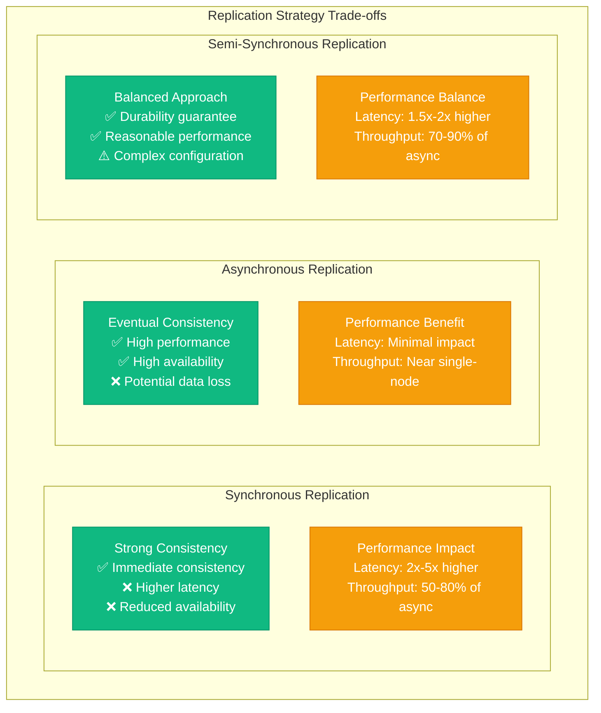
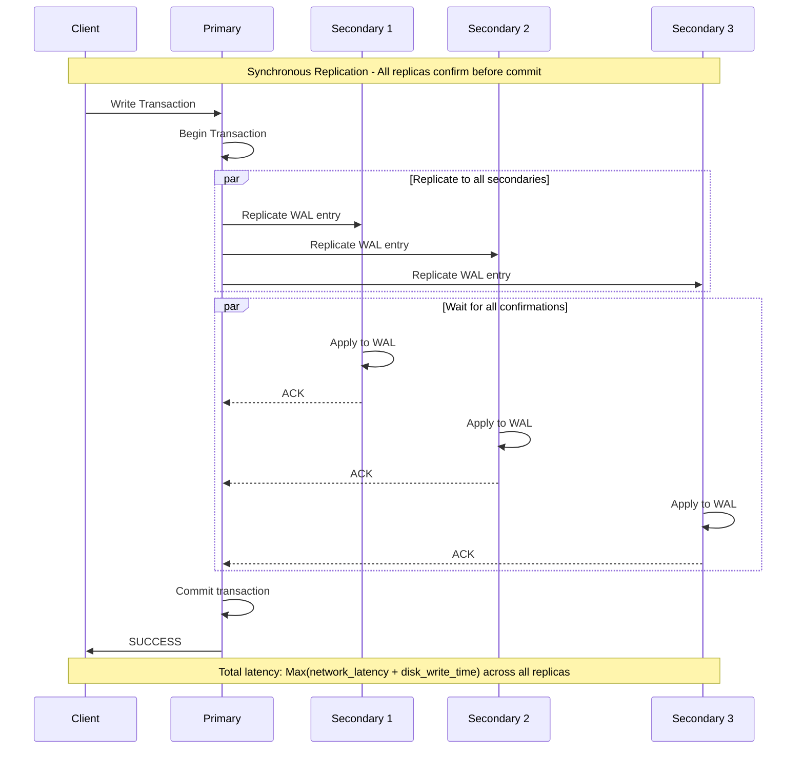
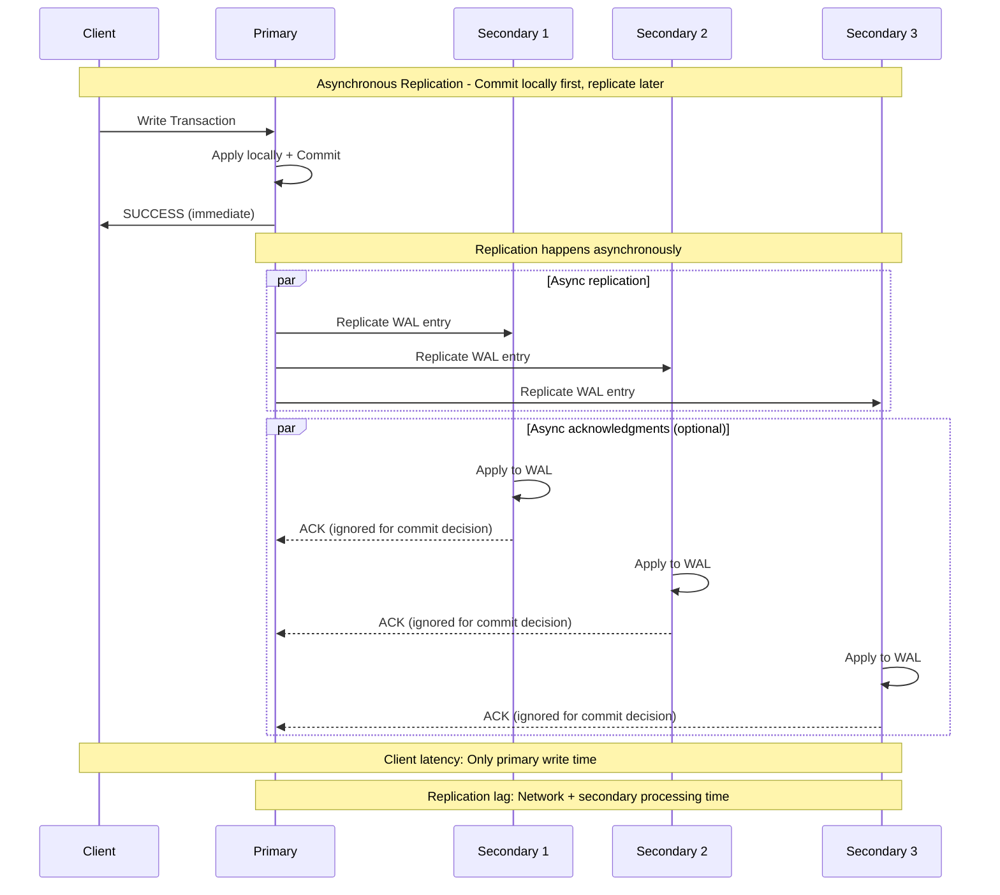
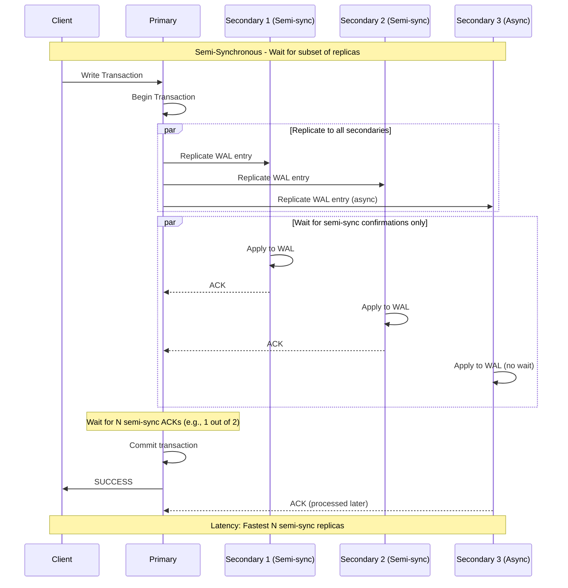
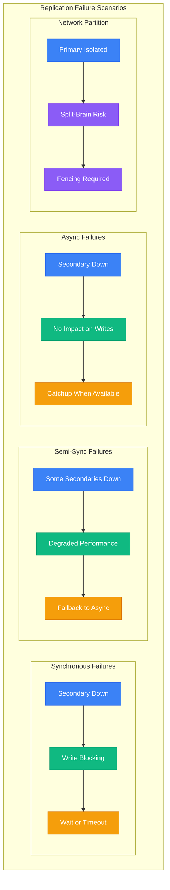
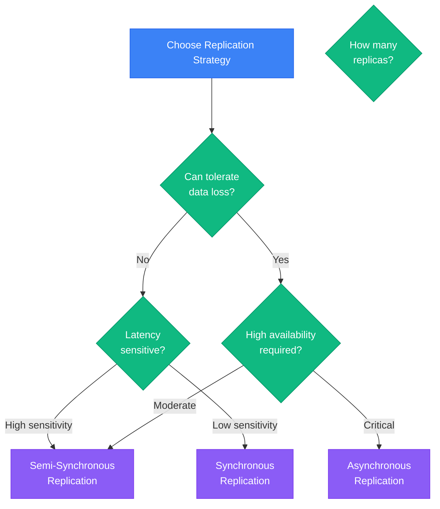

# Replication Strategies

## Overview of Replication Types

Database replication strategies determine how data consistency, availability, and performance trade-offs are handled across distributed systems.

### Strategy Comparison Matrix



### Synchronous Replication Flow



### Asynchronous Replication Flow



### Semi-Synchronous Replication Flow



### Replication Strategy Configuration

#### PostgreSQL Streaming Replication

```sql
-- Primary server configuration (postgresql.conf)
wal_level = replica
max_wal_senders = 10
wal_keep_segments = 32
synchronous_standby_names = 'standby1,standby2'

-- Synchronous replication
synchronous_commit = on  -- Wait for sync standby

-- Semi-synchronous replication
synchronous_commit = remote_write  -- Wait for WAL write on standby

-- Asynchronous replication
synchronous_commit = local  -- Don't wait for standby
```

#### MySQL Replication Modes

```sql
-- MySQL 8.0 Group Replication configuration

-- Synchronous (Group Replication)
SET GLOBAL group_replication_single_primary_mode = ON;
SET GLOBAL group_replication_consistency = 'BEFORE_ON_PRIMARY_FAILOVER';

-- Semi-synchronous replication
INSTALL PLUGIN rpl_semi_sync_master SONAME 'semisync_master.so';
SET GLOBAL rpl_semi_sync_master_enabled = 1;
SET GLOBAL rpl_semi_sync_master_wait_for_slave_count = 1;
SET GLOBAL rpl_semi_sync_master_timeout = 1000; -- 1 second

-- Asynchronous replication (default)
-- Standard master-slave replication without semi-sync plugin
```

### Performance Benchmarks

```mermaid
graph LR
    subgraph Performance Comparison (3-node cluster)
        subgraph Synchronous
            SYNC_TPS[5,000 TPS]
            SYNC_LAT[15ms p99]
            SYNC_AVAIL[99.9% (fails if any replica down)]
        end

        subgraph Semi-Synchronous
            SEMI_TPS[8,000 TPS]
            SEMI_LAT[8ms p99]
            SEMI_AVAIL[99.95% (tolerates 1 replica down)]
        end

        subgraph Asynchronous
            ASYNC_TPS[12,000 TPS]
            ASYNC_LAT[3ms p99]
            ASYNC_AVAIL[99.99% (primary only dependency)]
        end

        subgraph Trade-off Analysis
            CONSISTENCY[Data Loss Risk<br/>Sync: 0<br/>Semi-sync: Minimal<br/>Async: Up to RPO]
            PERFORMANCE[Performance Impact<br/>Sync: Highest<br/>Semi-sync: Moderate<br/>Async: Minimal]
        end
    end

    %% Apply state plane color for metrics
    classDef stateStyle fill:#F59E0B,stroke:#D97706,color:#fff
    class SYNC_TPS,SYNC_LAT,SYNC_AVAIL,SEMI_TPS,SEMI_LAT,SEMI_AVAIL,ASYNC_TPS,ASYNC_LAT,ASYNC_AVAIL,CONSISTENCY,PERFORMANCE stateStyle
```

### Real-World Use Cases

```yaml
# Production replication strategy selection
use_case_patterns:
  financial_transactions:
    strategy: "Synchronous"
    rationale: "Zero data loss requirement"
    configuration:
      replicas: 3
      sync_mode: "all"
      timeout: "5s"
      fallback: "block_writes"
    examples:
      - "Payment processing"
      - "Account balance updates"
      - "Audit trail recording"

  content_management:
    strategy: "Semi-synchronous"
    rationale: "Balance between consistency and performance"
    configuration:
      replicas: 5
      sync_replicas: 2
      timeout: "1s"
      fallback: "async_mode"
    examples:
      - "Blog posts and articles"
      - "User profile updates"
      - "Catalog management"

  analytics_data:
    strategy: "Asynchronous"
    rationale: "High throughput, eventual consistency acceptable"
    configuration:
      replicas: 6
      lag_tolerance: "5min"
      batch_size: "10MB"
      compression: "enabled"
    examples:
      - "Event logging"
      - "Metrics collection"
      - "Clickstream data"

  session_storage:
    strategy: "Semi-synchronous"
    rationale: "User experience + some durability"
    configuration:
      replicas: 3
      sync_replicas: 1
      timeout: "100ms"
      fallback: "async_mode"
    examples:
      - "User sessions"
      - "Shopping carts"
      - "Temporary data"
```

### Failure Scenarios and Handling



### Monitoring and Alerting

```yaml
# Prometheus alerts for replication health
replication_alerts:
  - alert: ReplicationLagHigh
    expr: mysql_slave_lag_seconds > 30
    for: 2m
    labels:
      severity: warning
    annotations:
      summary: "MySQL replication lag is high"
      description: "Replication lag is {{ $value }} seconds"

  - alert: SemiSyncSlaveCount
    expr: mysql_semi_sync_master_clients < 1
    for: 1m
    labels:
      severity: critical
    annotations:
      summary: "No semi-sync slaves available"

  - alert: ReplicationBroken
    expr: mysql_slave_sql_running == 0 or mysql_slave_io_running == 0
    for: 30s
    labels:
      severity: critical
    annotations:
      summary: "MySQL replication is broken"

  - alert: SynchronousCommitTimeout
    expr: increase(postgresql_sync_commit_timeouts_total[5m]) > 0
    for: 1m
    labels:
      severity: warning
    annotations:
      summary: "PostgreSQL synchronous commit timeouts detected"
```

### Best Practices

#### Synchronous Replication
- **Use for**: Financial data, critical system state
- **Monitoring**: Track commit latency and timeout rates
- **Tuning**: Minimize network latency between replicas
- **Failover**: Plan for all-or-nothing availability

#### Semi-Synchronous Replication
- **Use for**: User-facing applications requiring durability
- **Monitoring**: Track which replicas are sync vs async
- **Tuning**: Configure appropriate timeouts and fallback behavior
- **Failover**: Ensure minimum sync replica count

#### Asynchronous Replication
- **Use for**: Analytics, logging, non-critical data
- **Monitoring**: Track replication lag and catch-up speed
- **Tuning**: Optimize batch sizes and network bandwidth
- **Failover**: Plan for potential data loss during failover

### Decision Framework



This comprehensive overview of replication strategies provides the foundation for making informed architectural decisions based on consistency, performance, and availability requirements.