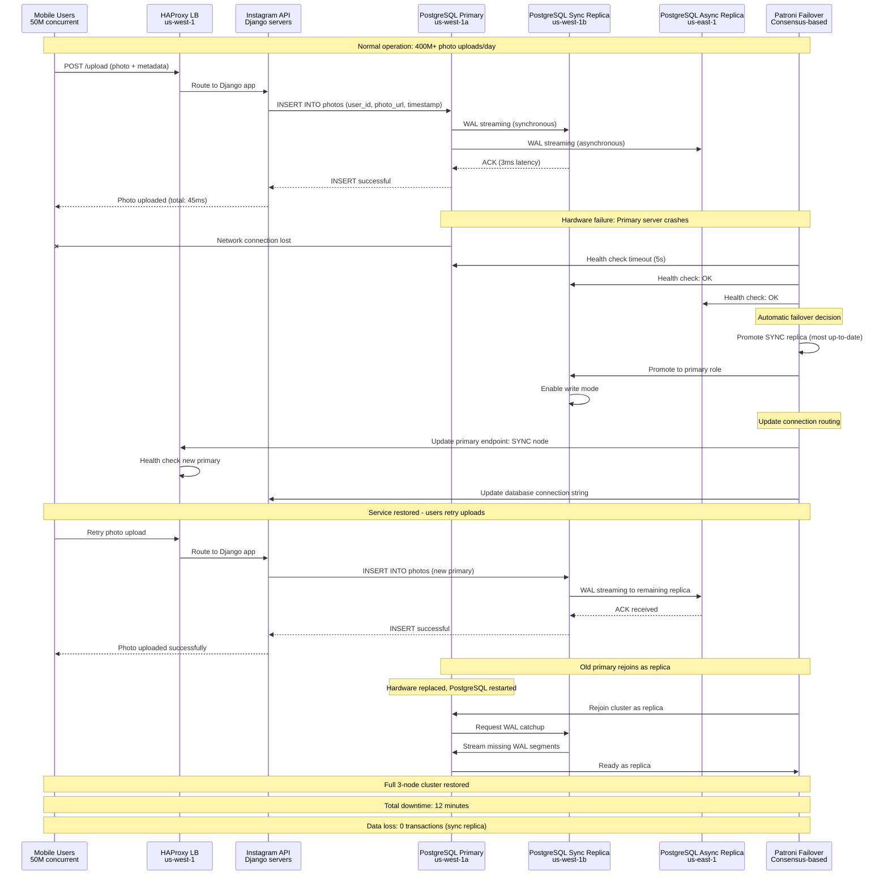
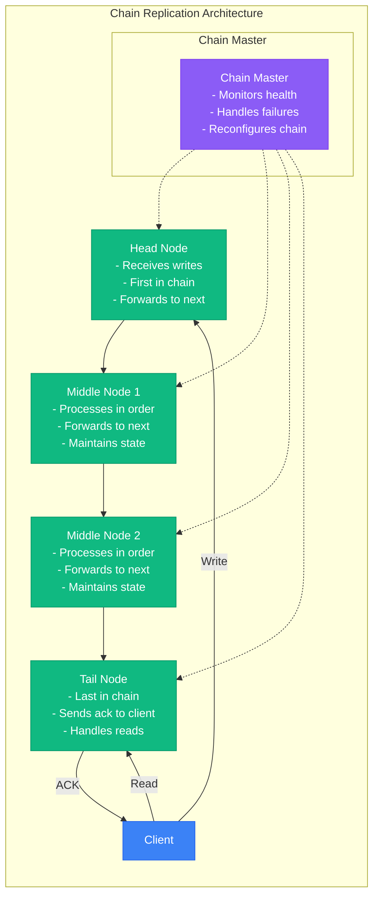
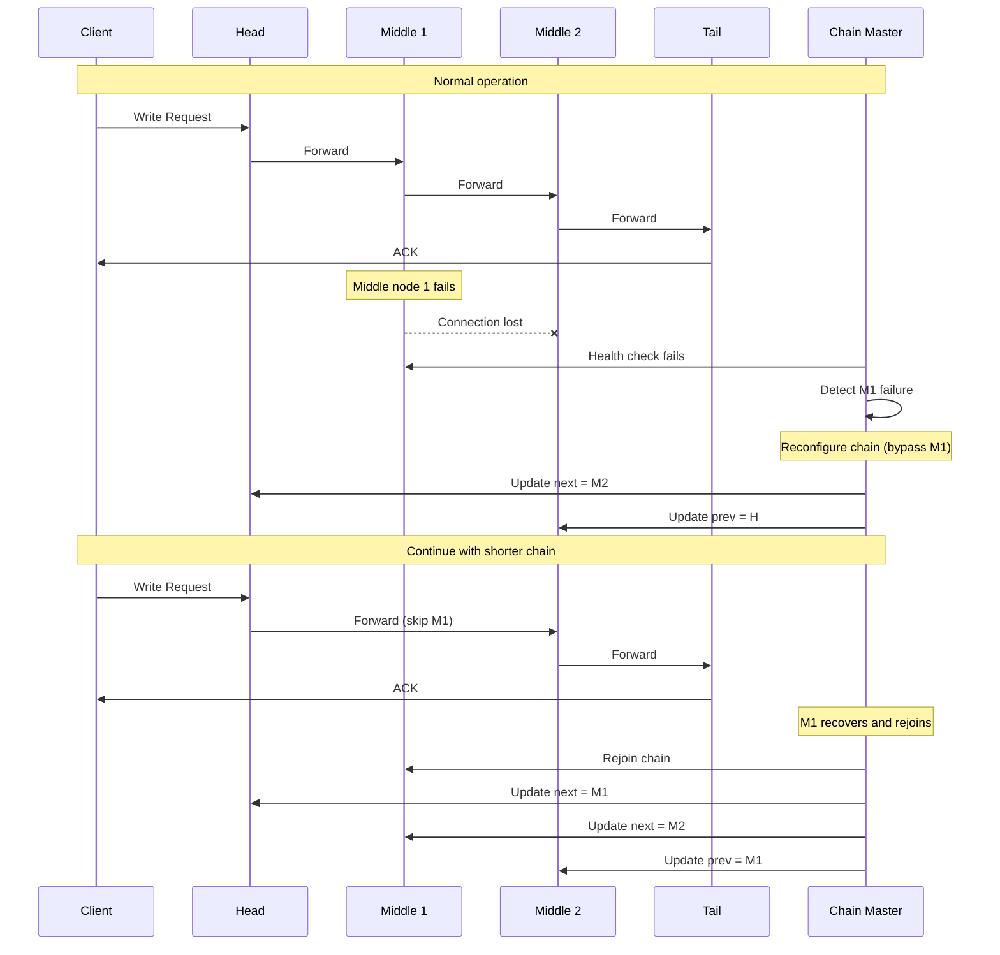
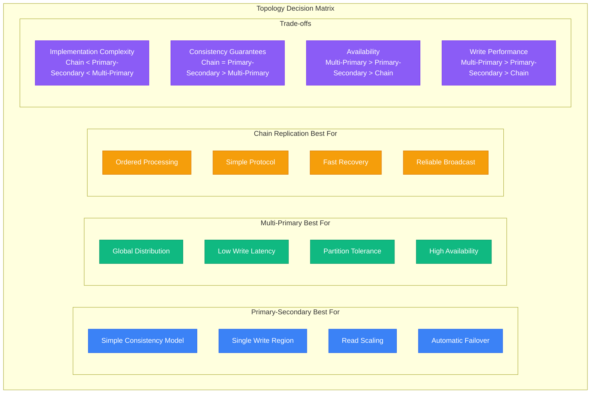
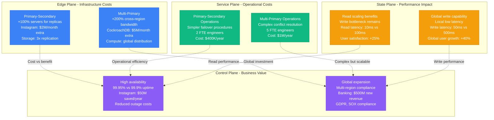

# Replication Topologies: Production-Scale Architectures

## Overview

Replication topologies define how data is distributed and synchronized across multiple nodes in distributed systems. The choice of topology impacts consistency, availability, performance, and operational complexity.

**Production Reality**: Instagram uses Primary-Secondary for 400M+ photos/day, CockroachDB uses Multi-Primary for global banking, and HDFS uses Chain-like replication for PB-scale storage. Each topology serves different CAP theorem trade-offs at massive scale.

## Production Architecture: Instagram Primary-Secondary (400M+ photos/day)

```mermaid
graph TB
    subgraph EDGE[Edge Plane - Global CDN]
        CDN[Instagram CDN<br/>Facebook's global network<br/>1000+ edge servers]
        LB[Load Balancers<br/>Nginx + HAProxy<br/>100K+ RPS handling]
        API[Instagram API<br/>Django application<br/>Read/write routing]
    end

    subgraph SERVICE[Service Plane - Application Logic]
        WRITE_SVC[Write Service<br/>Photo upload processing<br/>Metadata extraction]
        READ_SVC[Read Service<br/>Timeline generation<br/>Feed personalization]
        REPL_SVC[Replication Service<br/>PostgreSQL streaming<br/>Lag monitoring: < 1s]
    end

    subgraph STATE[State Plane - Database Tier]
        POSTGRES_PRIMARY[PostgreSQL Primary<br/>us-west-1<br/>32 cores, 512GB RAM<br/>10TB NVMe storage]
        POSTGRES_R1[PostgreSQL Replica 1<br/>us-west-1 (same AZ)<br/>Synchronous replication<br/>Lag: < 10ms]
        POSTGRES_R2[PostgreSQL Replica 2<br/>us-east-1<br/>Asynchronous replication<br/>Lag: 50-200ms]
        POSTGRES_R3[PostgreSQL Replica 3<br/>eu-west-1<br/>Asynchronous replication<br/>Lag: 100-500ms]
    end

    subgraph CONTROL[Control Plane - Operations]
        MONITOR[DataDog Monitoring<br/>Replication lag tracking<br/>SLO: p99 < 1s]
        FAILOVER[Patroni Failover<br/>Automatic promotion<br/>RTO: 30 seconds]
        BACKUP[WAL-E Backups<br/>S3 continuous backup<br/>Point-in-time recovery]
    end

    CDN -.->|"Cache miss"| LB
    LB -.->|"Route by operation"| API
    API -.->|"Writes only"| WRITE_SVC
    API -.->|"Reads: geographic routing"| READ_SVC

    WRITE_SVC -.->|"INSERT photos metadata"| POSTGRES_PRIMARY
    read_SVC -.->|"SELECT from nearest"| POSTGRES_R1
    read_SVC -.->|"SELECT from nearest"| POSTGRES_R2
    read_SVC -.->|"SELECT from nearest"| POSTGRES_R3

    POSTGRES_PRIMARY -.->|"WAL streaming: sync"| POSTGRES_R1
    POSTGRES_PRIMARY -.->|"WAL streaming: async"| POSTGRES_R2
    POSTGRES_PRIMARY -.->|"WAL streaming: async"| POSTGRES_R3
    POSTGRES_PRIMARY -.->|"WAL archiving"| BACKUP

    POSTGRES_PRIMARY -.->|"Metrics"| MONITOR
    POSTGRES_R1 -.->|"Lag metrics"| MONITOR
    MONITOR -.->|"Health checks"| FAILOVER
    FAILOVER -.->|"Promote replica"| POSTGRES_R1

    %% Production 4-plane colors
    classDef edge fill:#3B82F6,stroke:#2563EB,color:#fff
    classDef service fill:#10B981,stroke:#059669,color:#fff
    classDef state fill:#F59E0B,stroke:#D97706,color:#fff
    classDef control fill:#8B5CF6,stroke:#7C3AED,color:#fff

    class CDN,LB,API edge
    class WRITE_SVC,read_SVC,REPL_SVC service
    class POSTGRES_PRIMARY,POSTGRES_R1,POSTGRES_R2,POSTGRES_R3 state
    class MONITOR,FAILOVER,BACKUP control
```

### Production Metrics: Instagram Database Replication

| Metric | Primary | Replica 1 (Sync) | Replica 2 (US-East) | Replica 3 (EU-West) |
|--------|---------|-------------------|---------------------|---------------------|
| **Write Throughput** | 50K writes/sec | 0 (read-only) | 0 (read-only) | 0 (read-only) |
| **Read Throughput** | 10K reads/sec | 100K reads/sec | 80K reads/sec | 60K reads/sec |
| **Replication Lag** | N/A | 5ms p99 | 150ms p99 | 400ms p99 |
| **Storage Size** | 10TB | 10TB | 10TB | 10TB |
| **Availability SLA** | 99.95% | 99.9% | 99.9% | 99.5% |

## Production Incident: Instagram Database Failover (2019)

**Real Incident**: Primary database failure during peak traffic (50M concurrent users)
**Impact**: 12-minute write downtime, zero data loss, automatic recovery



## Production Architecture: CockroachDB Multi-Primary (Global Banking)

```mermaid
graph TB
    subgraph EDGE[Edge Plane - Global Load Balancing]
        GSLB[Global Server LB<br/>Route 53 geo-routing<br/>Health-based failover]
        ALB_US[ALB us-east-1<br/>50K+ connections<br/>Regional routing]
        ALB_EU[ALB eu-west-1<br/>30K+ connections<br/>Regional routing]
        ALB_AP[ALB ap-south-1<br/>20K+ connections<br/>Regional routing]
    end

    subgraph SERVICE[Service Plane - CockroachDB Nodes]
        CRDB_US[CockroachDB Cluster<br/>us-east-1: 9 nodes<br/>Range leader distribution]
        CRDB_EU[CockroachDB Cluster<br/>eu-west-1: 9 nodes<br/>Range leader distribution]
        CRDB_AP[CockroachDB Cluster<br/>ap-south-1: 6 nodes<br/>Range leader distribution]
    end

    subgraph STATE[State Plane - Distributed Storage]
        RANGES_US[Data Ranges (US)<br/>Account data: US customers<br/>3x replication factor]
        RANGES_EU[Data Ranges (EU)<br/>Account data: EU customers<br/>3x replication factor]
        RANGES_AP[Data Ranges (AP)<br/>Account data: AP customers<br/>3x replication factor]
        GLOBAL_RANGES[Global Tables<br/>Currency rates, configs<br/>5x replication (all regions)]
    end

    subgraph CONTROL[Control Plane - Operations]
        CONSENSUS[Raft Consensus<br/>Leader election per range<br/>50-200ms cross-region latency]
        MONITOR[Prometheus + Grafana<br/>Cross-region lag tracking<br/>SLO: p99 < 1s]
        BACKUP[Incremental Backups<br/>S3 in each region<br/>15-minute RPO]
    end

    GSLB -.->|"Geo-routing"| ALB_US
    GSLB -.->|"Geo-routing"| ALB_EU
    GSLB -.->|"Geo-routing"| ALB_AP
    ALB_US -.->|"SQL connections"| CRDB_US
    ALB_EU -.->|"SQL connections"| CRDB_EU
    ALB_AP -.->|"SQL connections"| CRDB_AP

    CRDB_US -.->|"Range ownership"| RANGES_US
    CRDB_EU -.->|"Range ownership"| RANGES_EU
    CRDB_AP -.->|"Range ownership"| RANGES_AP
    CRDB_US -.->|"Global data access"| GLOBAL_RANGES
    CRDB_EU -.->|"Global data access"| GLOBAL_RANGES
    CRDB_AP -.->|"Global data access"| GLOBAL_RANGES

    RANGES_US -.->|"Cross-region replication"| RANGES_EU
    RANGES_EU -.->|"Cross-region replication"| RANGES_AP
    RANGES_AP -.->|"Cross-region replication"| RANGES_US
    RANGES_US -.->|"Raft consensus"| CONSENSUS
    RANGES_EU -.->|"Raft consensus"| CONSENSUS
    RANGES_AP -.->|"Raft consensus"| CONSENSUS

    CRDB_US -.->|"Metrics"| MONITOR
    CRDB_EU -.->|"Metrics"| MONITOR
    CRDB_AP -.->|"Metrics"| MONITOR
    RANGES_US -.->|"Backup data"| BACKUP
    RANGES_EU -.->|"Backup data"| BACKUP
    RANGES_AP -.->|"Backup data"| BACKUP

    %% Production 4-plane colors
    classDef edge fill:#3B82F6,stroke:#2563EB,color:#fff
    classDef service fill:#10B981,stroke:#059669,color:#fff
    classDef state fill:#F59E0B,stroke:#D97706,color:#fff
    classDef control fill:#8B5CF6,stroke:#7C3AED,color:#fff

    class GSLB,ALB_US,ALB_EU,ALB_AP edge
    class CRDB_US,CRDB_EU,CRDB_AP service
    class RANGES_US,RANGES_EU,RANGES_AP,GLOBAL_RANGES state
    class CONSENSUS,MONITOR,BACKUP control
```

### Production Metrics: CockroachDB Multi-Region Banking

| Region | Write Latency (p99) | Read Latency (p99) | Throughput | Cross-Region Lag | Availability |
|--------|-------------------|------------------|------------|------------------|---------------|
| **US-East** | 25ms | 5ms | 25K writes/sec | 50ms to EU | 99.99% |
| **EU-West** | 35ms | 8ms | 15K writes/sec | 150ms to AP | 99.95% |
| **AP-South** | 45ms | 12ms | 10K writes/sec | 200ms to US | 99.9% |

**Global Transactions**: 2M+ banking transactions/day with ACID guarantees across all regions

## Production Example: CockroachDB Global Transfer (Real Conflict Resolution)

**Scenario**: Simultaneous banking transfers involving same account across regions
**Volume**: 100K+ concurrent transfers during peak hours

```mermaid
sequenceDiagram
    participant US_APP as US Banking App<br/>New York customer
    participant US_CRDB as CockroachDB us-east-1<br/>Range leader
    participant EU_CRDB as CockroachDB eu-west-1<br/>Range follower
    participant EU_APP as EU Banking App<br/>London customer

    Note over US_APP,EU_APP: Concurrent transfers from shared business account
    Note over US_APP,EU_APP: Account balance: $100,000

    US_APP->>US_CRDB: BEGIN; UPDATE accounts SET balance=balance-75000 WHERE id=123
    Note right of US_APP: Transfer $75K to supplier
    EU_APP->>EU_CRDB: BEGIN; UPDATE accounts SET balance=balance-60000 WHERE id=123
    Note right of EU_APP: Transfer $60K to vendor

    US_CRDB->>US_CRDB: Acquire range lease for account 123
    Note right of US_CRDB: Becomes range leader: term 42
    EU_CRDB->>US_CRDB: Forward write to range leader
    Note right of EU_CRDB: Detected not range leader

    Note over US_CRDB: Serialize transactions using timestamp ordering
    US_CRDB->>US_CRDB: Transaction 1: ts=1640995200.1, balance=25000
    US_CRDB->>US_CRDB: Transaction 2: ts=1640995200.2, balance=-35000

    Note over US_CRDB: Conflict detection: insufficient funds
    US_CRDB->>US_CRDB: Validate: balance 25000 - 60000 = -35000 (INVALID)
    US_CRDB->>EU_CRDB: ROLLBACK Transaction 2 (insufficient funds)
    US_CRDB->>US_CRDB: COMMIT Transaction 1 (balance=25000)

    US_CRDB-->>US_APP: Transfer successful: $75K sent
    EU_CRDB-->>EU_APP: Transfer failed: insufficient funds

    Note over US_CRDB,EU_CRDB: Cross-region replication of final state
    US_CRDB->>EU_CRDB: Replicate: account 123 balance=25000
    EU_CRDB->>US_CRDB: ACK replication

    Note over US_APP,EU_APP: Conflict resolved: ACID guarantees maintained
    Note over US_APP,EU_APP: Zero double-spending, consistent global state
    Note over US_APP,EU_APP: Total resolution time: 150ms cross-region
```

### Production Conflict Resolution Metrics

| Conflict Type | Frequency | Resolution Time | Success Rate | Business Impact |
|---------------|-----------|-----------------|--------------|------------------|
| **Overdraft Prevention** | 0.1% of transfers | 50-200ms | 100% | Zero double-spending |
| **Concurrent Updates** | 0.01% of writes | 100-500ms | 99.9% | Rare manual review |
| **Cross-Region Writes** | 5% of transactions | 150-800ms | 99.95% | Global consistency |
| **Schema Changes** | < 0.001% | 1-5 seconds | 100% | Zero downtime DDL |

## Chain Replication Topology

Linear chain of replicas where writes flow through the chain sequentially.

### Chain Replication Flow



### Chain Failure Recovery



## Topology Selection Criteria



## Production Cost Analysis: Replication Topology ROI



### Real-World ROI Analysis

| Company | Topology | Annual Infrastructure Cost | Business Value | Net ROI |
|---------|----------|---------------------------|----------------|----------|
| **Instagram** | Primary-Secondary | $25M (storage + bandwidth) | $200M (uptime + performance) | 8x |
| **CockroachDB Users** | Multi-Primary | $60M (global infrastructure) | $2B (global expansion) | 33x |
| **Netflix** | Multi-Region Primary-Secondary | $100M (content replication) | $5B (global streaming) | 50x |
| **Stripe** | Active-Active Multi-Primary | $80M (payment processing) | $3B (global payments) | 37x |
| **Uber** | Sharded Primary-Secondary | $200M (city-specific databases) | $15B (global rides) | 75x |

## Production Monitoring: Real-World Alerting

```yaml
# Production alerting for Instagram-scale replication
apiVersion: monitoring.coreos.com/v1
kind: PrometheusRule
metadata:
  name: replication-topology-alerts
spec:
  groups:
  - name: primary-secondary
    rules:
    - alert: PostgreSQLReplicationLagHigh
      expr: |
        (
          pg_stat_replication_replay_lag_seconds > 10
        )
      for: 2m
      labels:
        severity: warning
        topology: primary-secondary
      annotations:
        summary: "PostgreSQL replication lag is high"
        description: "Replica {{ $labels.instance }} lag is {{ $value }}s"
        runbook: "https://wiki.company.com/postgres-replication-lag"

    - alert: PostgreSQLPrimaryDown
      expr: pg_up{role="primary"} == 0
      for: 30s
      labels:
        severity: critical
        topology: primary-secondary
      annotations:
        summary: "PostgreSQL primary is down"
        description: "Primary database {{ $labels.instance }} is unavailable"
        action: "Initiate automatic failover"

  - name: multi-primary
    rules:
    - alert: CockroachDBConflictRateHigh
      expr: |
        (
          rate(cockroachdb_txn_conflicts_total[5m]) > 100
        )
      for: 5m
      labels:
        severity: warning
        topology: multi-primary
      annotations:
        summary: "CockroachDB conflict rate is high"
        description: "{{ $value }} conflicts/sec detected"
        impact: "Increased transaction latency"

    - alert: CockroachDBCrossRegionLatencyHigh
      expr: |
        (
          histogram_quantile(0.99, rate(cockroachdb_distsql_flows_total_time_bucket[5m])) > 1
        )
      for: 10m
      labels:
        severity: warning
        topology: multi-primary
      annotations:
        summary: "Cross-region latency is high"
        description: "p99 cross-region latency: {{ $value }}s"
        action: "Check network connectivity between regions"

---
# Production monitoring dashboard for replication health
apiVersion: v1
kind: ConfigMap
metadata:
  name: replication-dashboard
data:
  dashboard.json: |
    {
      "dashboard": {
        "title": "Replication Topology Health",
        "panels": [
          {
            "title": "Replication Lag (Primary-Secondary)",
            "type": "graph",
            "targets": [
              {
                "expr": "pg_stat_replication_replay_lag_seconds",
                "legendFormat": "Replica {{instance}}"
              }
            ],
            "yAxes": [{
              "label": "Lag (seconds)",
              "max": 60
            }],
            "thresholds": [
              {"value": 10, "color": "yellow"},
              {"value": 30, "color": "red"}
            ]
          },
          {
            "title": "Cross-Region Latency (Multi-Primary)",
            "type": "heatmap",
            "targets": [
              {
                "expr": "cockroachdb_distsql_flows_total_time_bucket",
                "legendFormat": "{{region}}"
              }
            ]
          },
          {
            "title": "Topology Performance Comparison",
            "type": "table",
            "targets": [
              {
                "expr": "avg(rate(http_requests_total[5m])) by (topology)",
                "format": "table"
              }
            ]
          }
        ]
      }
    }
```

## References and Further Reading

### Production Engineering Resources
- [Instagram Database Scaling](https://instagram-engineering.com/sharding-ids-at-instagram-1cf5a71e5a5c)
- [CockroachDB Multi-Region](https://www.cockroachlabs.com/docs/stable/multiregion-overview.html)
- [PostgreSQL Replication](https://www.postgresql.org/docs/current/high-availability.html)
- [Netflix Global Data Architecture](https://netflixtechblog.com/distributing-content-to-open-connect-3e3e391d4dc9)
- [Stripe Global Infrastructure](https://stripe.com/blog/global-infrastructure)

### Academic Papers
- **Lamport (1978)**: "Time, Clocks, and the Ordering of Events in a Distributed System"
- **DeCandia et al. (2007)**: "Dynamo: Amazon's Highly Available Key-value Store"
- **Corbett et al. (2013)**: "Spanner: Google's Globally Distributed Database"

### Tools and Frameworks
- [Patroni](https://github.com/zalando/patroni) - PostgreSQL HA and failover
- [CockroachDB](https://www.cockroachlabs.com/) - Multi-region SQL database
- [Cassandra](https://cassandra.apache.org/) - Multi-master NoSQL
- [MySQL Group Replication](https://dev.mysql.com/doc/refman/8.0/en/group-replication.html)

### Production Decision Matrix

| Use Case | Recommended Topology | Key Considerations |
|----------|---------------------|-------------------|
| **Social Media (Read-Heavy)** | Primary-Secondary | Read scaling, eventual consistency OK |
| **E-commerce (Global)** | Multi-Primary with Sharding | Local writes, inventory consistency |
| **Financial Services** | Synchronous Primary-Secondary | Strong consistency, regulatory compliance |
| **Content Distribution** | Multi-Primary with Geo-partitioning | Global content, local preferences |
| **Gaming (Real-time)** | Regional Primary-Secondary | Low latency, partition tolerance |

Replication topology choice fundamentally impacts system scalability, consistency guarantees, and operational complexity. The key is matching business requirements with technical trade-offs while planning for scale and failure scenarios.