# Replication Topologies

## Primary-Secondary (Master-Slave) Topology

The most common replication pattern where one node accepts writes and replicates to read-only secondaries.

### Single Primary Architecture


### Primary-Secondary with Automatic Failover


## Multi-Primary (Multi-Master) Topology

Multiple nodes can accept writes concurrently, requiring conflict resolution mechanisms.

### Active-Active Multi-Primary


### Conflict Resolution in Multi-Primary


## Chain Replication Topology

Linear chain of replicas where writes flow through the chain sequentially.

### Chain Replication Flow


### Chain Failure Recovery


## Topology Selection Criteria

```mermaid
graph TB
    subgraph "Topology Decision Matrix"
        subgraph "Primary-Secondary Best For"
            PS_SIMPLE[Simple Consistency Model]
            PS_SINGLE[Single Write Region]
            PS_SCALE[Read Scaling]
            PS_FAILOVER[Automatic Failover]
        end

        subgraph "Multi-Primary Best For"
            MP_GLOBAL[Global Distribution]
            MP_LATENCY[Low Write Latency]
            MP_PARTITION[Partition Tolerance]
            MP_AVAILABILITY[High Availability]
        end

        subgraph "Chain Replication Best For"
            CR_ORDERED[Ordered Processing]
            CR_SIMPLE[Simple Protocol]
            CR_RECOVERY[Fast Recovery]
            CR_BROADCAST[Reliable Broadcast]
        end

        subgraph "Trade-offs"
            COMPLEXITY[Implementation Complexity<br/>Chain < Primary-Secondary < Multi-Primary]
            CONSISTENCY[Consistency Guarantees<br/>Chain = Primary-Secondary > Multi-Primary]
            AVAILABILITY[Availability<br/>Multi-Primary > Primary-Secondary > Chain]
            PERFORMANCE[Write Performance<br/>Multi-Primary > Primary-Secondary > Chain]
        end
    end

    %% Apply colors
    classDef edgeStyle fill:#0066CC,stroke:#004499,color:#fff
    classDef serviceStyle fill:#00AA00,stroke:#007700,color:#fff
    classDef stateStyle fill:#FF8800,stroke:#CC6600,color:#fff
    classDef controlStyle fill:#CC0000,stroke:#990000,color:#fff

    class PS_SIMPLE,PS_SINGLE,PS_SCALE,PS_FAILOVER edgeStyle
    class MP_GLOBAL,MP_LATENCY,MP_PARTITION,MP_AVAILABILITY serviceStyle
    class CR_ORDERED,CR_SIMPLE,CR_RECOVERY,CR_BROADCAST stateStyle
    class COMPLEXITY,CONSISTENCY,AVAILABILITY,PERFORMANCE controlStyle
```



## Real-World Topology Examples

### PostgreSQL Streaming Replication (Primary-Secondary)

```yaml
# PostgreSQL streaming replication configuration
postgresql_topology:
  primary:
    host: "pg-primary.internal"
    port: 5432
    configuration:
      wal_level: "replica"
      max_wal_senders: 10
      wal_keep_segments: 100
      synchronous_standby_names: "pg-standby-1"

  secondaries:
    - name: "pg-standby-1"
      host: "pg-standby-1.internal"
      type: "synchronous"
      lag_threshold: "1MB"

    - name: "pg-standby-2"
      host: "pg-standby-2.internal"
      type: "asynchronous"
      lag_threshold: "100MB"

    - name: "pg-standby-3"
      host: "pg-standby-3.internal"
      type: "asynchronous"
      geographic_location: "different_dc"
      lag_threshold: "500MB"

  failover:
    tool: "patroni"
    health_check_interval: "5s"
    failover_timeout: "30s"
    automatic: true
```

### CockroachDB Multi-Region (Multi-Primary)

```yaml
# CockroachDB multi-region configuration
cockroachdb_topology:
  regions:
    - name: "us-east1"
      zones: ["us-east1-a", "us-east1-b", "us-east1-c"]
      nodes: 3
      primary_for: ["users_east", "orders_east"]

    - name: "us-west1"
      zones: ["us-west1-a", "us-west1-b", "us-west1-c"]
      nodes: 3
      primary_for: ["users_west", "orders_west"]

    - name: "europe-west1"
      zones: ["europe-west1-a", "europe-west1-b", "europe-west1-c"]
      nodes: 3
      primary_for: ["users_eu", "orders_eu"]

  survival_goals:
    database: "region"
    tables:
      - name: "users"
        survival_goal: "zone"
        placement: "restricted"

      - name: "orders"
        survival_goal: "region"
        placement: "restricted"

  conflict_resolution:
    strategy: "timestamp_ordering"
    clock_skew_tolerance: "500ms"
```

### HDFS NameNode HA (Chain-like with Quorum)

```yaml
# HDFS NameNode High Availability
hdfs_topology:
  nameservice: "mycluster"
  namenodes:
    - id: "nn1"
      host: "namenode1.example.com"
      rpc_port: 8020
      http_port: 50070
      role: "active"

    - id: "nn2"
      host: "namenode2.example.com"
      rpc_port: 8020
      http_port: 50070
      role: "standby"

  journal_nodes:
    - host: "journalnode1.example.com"
      port: 8485
    - host: "journalnode2.example.com"
      port: 8485
    - host: "journalnode3.example.com"
      port: 8485

  automatic_failover:
    enabled: true
    zookeeper_quorum: "zk1:2181,zk2:2181,zk3:2181"
    failover_controller: "zkfc"

  shared_storage:
    type: "qjournal"
    journal_uri: "qjournal://journalnode1:8485;journalnode2:8485;journalnode3:8485/mycluster"
```

## Performance Characteristics


## Monitoring and Alerting

```yaml
# Topology-specific monitoring
monitoring_by_topology:
  primary_secondary:
    metrics:
      - replication_lag_seconds
      - primary_availability
      - secondary_count_healthy
      - failover_time_seconds
    alerts:
      - name: "ReplicationLagHigh"
        condition: "lag > 10s"
        severity: "warning"
      - name: "PrimaryDown"
        condition: "primary_up == 0"
        severity: "critical"

  multi_primary:
    metrics:
      - conflict_resolution_rate
      - cross_region_latency
      - node_availability_per_region
      - consensus_time_p99
    alerts:
      - name: "HighConflictRate"
        condition: "conflicts/sec > 100"
        severity: "warning"
      - name: "RegionPartitioned"
        condition: "region_connectivity < 0.5"
        severity: "critical"

  chain_replication:
    metrics:
      - chain_length
      - head_to_tail_latency
      - node_position_in_chain
      - chain_reconfiguration_count
    alerts:
      - name: "ChainTooLong"
        condition: "chain_length > 5"
        severity: "warning"
      - name: "ChainBroken"
        condition: "chain_integrity == false"
        severity: "critical"
```

This comprehensive overview of replication topologies provides the foundation for choosing the right architecture based on consistency requirements, geographic distribution, and operational complexity.