# Mermaid Diagram Style Guide

## Interactive, Beautiful Diagrams with Zoom & Pan

This style guide demonstrates the new Mermaid design system with interactive zoom/pan features.

### How to Use Interactive Features

- **Zoom**: Use `Ctrl/Cmd + Scroll` or the zoom buttons
- **Pan**: Click and drag on the diagram
- **Reset**: Double-click or use the reset button
- **Fullscreen**: Press `F` key or use the fullscreen button
- **Keyboard Shortcuts**:
  - `+` or `=`: Zoom in
  - `-`: Zoom out
  - `0`: Reset view
  - `F`: Toggle fullscreen

---

## Example 1: Complete System Architecture

```mermaid
graph TB
    subgraph EdgePlane["🌐 Edge Plane - CDN & Security"]
        CDN["CDN/CloudFlare<br/>📊 500 Gbps<br/>💰 $5K/month"]
        WAF["WAF Rules<br/>🛡️ 10K rules<br/>⚡ <1ms"]
        LB["Load Balancer<br/>ALB<br/>🎯 10ms p99"]
    end

    subgraph ServicePlane["⚙️ Service Plane - Business Logic"]
        API["API Gateway<br/>Kong 3.4<br/>🔐 OAuth2/JWT"]
        MESH["Service Mesh<br/>Istio 1.19<br/>🔄 mTLS"]
        SVC1["Order Service<br/>Java 17<br/>📦 50 pods"]
        SVC2["Payment Service<br/>Go 1.21<br/>💳 PCI DSS"]
    end

    subgraph StatePlane["💾 State Plane - Data Layer"]
        DB[("PostgreSQL 16<br/>💽 10TB<br/>📈 5K TPS")]
        CACHE[("Redis 7.2<br/>⚡ 1ms p50<br/>💰 $2K/month")]
        QUEUE[("Kafka 3.6<br/>📬 1M msg/s<br/>💾 7 days")]
    end

    subgraph ControlPlane["🎛️ Control Plane - Operations"]
        MON["Prometheus<br/>📊 10K metrics/s<br/>💾 30d retention"]
        LOG["ELK Stack<br/>📝 1TB/day<br/>🔍 Full-text search"]
        TRACE["Jaeger<br/>🔗 100K traces/s<br/>⏱️ p99 tracking"]
    end

    CDN --> WAF
    WAF --> LB
    LB --> API
    API --> MESH
    MESH --> SVC1
    MESH --> SVC2
    SVC1 --> DB
    SVC1 --> CACHE
    SVC2 --> QUEUE
    SVC1 --> MON
    SVC2 --> LOG
    API --> TRACE

    classDef edgeStyle fill:#0066CC,stroke:#004499,color:#fff,stroke-width:2px
    classDef serviceStyle fill:#00AA00,stroke:#007700,color:#fff,stroke-width:2px
    classDef stateStyle fill:#FF8800,stroke:#CC6600,color:#fff,stroke-width:2px
    classDef controlStyle fill:#CC0000,stroke:#990000,color:#fff,stroke-width:2px

    class CDN,WAF,LB edgeStyle
    class API,MESH,SVC1,SVC2 serviceStyle
    class DB,CACHE,QUEUE stateStyle
    class MON,LOG,TRACE controlStyle

    click CDN "https://example.com/docs/cdn" "CDN Documentation"
    click DB "https://example.com/docs/database" "Database Schema"
```

---

## Example 2: Request Flow Timeline

```mermaid
sequenceDiagram
    participant U as User 📱
    participant CDN as CDN 🌐
    participant LB as Load Balancer ⚖️
    participant API as API Gateway 🔐
    participant SVC as Service 💼
    participant DB as Database 💾
    participant CACHE as Cache ⚡

    Note over U,CACHE: 🎯 SLA: <50ms p99 latency

    U->>+CDN: HTTPS Request
    Note right of CDN: Cache Check<br/>HIT Rate: 80%

    alt Cache Hit
        CDN-->>U: Cached Response<br/>⏱️ 5ms
    else Cache Miss
        CDN->>+LB: Forward Request<br/>⏱️ +2ms

        LB->>+API: Route to API<br/>⏱️ +1ms

        API->>API: Auth Validation<br/>JWT Check<br/>⏱️ +3ms

        API->>+SVC: Business Logic<br/>⏱️ +5ms

        par Database Query
            SVC->>+DB: SELECT * FROM orders<br/>⏱️ +10ms
            DB-->>-SVC: 142 rows
        and Cache Lookup
            SVC->>+CACHE: GET user:123<br/>⏱️ +1ms
            CACHE-->>-SVC: User profile
        end

        SVC-->>-API: Response data
        API-->>-LB: HTTP 200 OK
        LB-->>-CDN: Response
        CDN-->>U: Final Response<br/>⏱️ Total: 35ms

        CDN->>CDN: Update Cache<br/>TTL: 300s
    end

    Note over U,CACHE: ✅ Success Rate: 99.95%<br/>📊 Throughput: 10K req/s
```

---

## Example 3: Failure Detection State Machine

```mermaid
stateDiagram-v2
    [*] --> Healthy: System Start

    Healthy --> Degraded: Component Failure<br/>Error Rate > 0.1%
    Healthy --> Healthy: Health Check OK<br/>Every 10s

    Degraded --> Recovering: Auto-healing Triggered<br/>Circuit Breaker Open
    Degraded --> Critical: Multiple Failures<br/>Error Rate > 1%

    Recovering --> Healthy: Recovery Complete<br/>Error Rate < 0.1%
    Recovering --> Degraded: Recovery Failed<br/>Timeout 60s

    Critical --> Emergency: Total Failure<br/>All replicas down
    Critical --> Recovering: Manual Intervention<br/>Operator action

    Emergency --> [*]: System Down

    note right of Healthy
        📊 Metrics:
        • CPU: <70%
        • Memory: <80%
        • Latency: <50ms p99
        • Error Rate: <0.1%
        • Throughput: 10K req/s
    end note

    note right of Degraded
        ⚠️ Warnings:
        • CPU: 70-85%
        • Memory: 80-90%
        • Latency: 50-200ms p99
        • Error Rate: 0.1-1%
        • Throughput: 5-10K req/s
    end note

    note right of Critical
        🚨 Alerts:
        • CPU: >85%
        • Memory: >90%
        • Latency: >200ms p99
        • Error Rate: >1%
        • Throughput: <5K req/s
        • PagerDuty triggered
    end note

    note right of Emergency
        ☠️ Disaster:
        • Total system failure
        • Data loss risk
        • Revenue impact
        • Executive escalation
        • War room activated
    end note
```

---

## Example 4: Cost Breakdown Pie Chart

---

## Example 5: Scale Evolution Journey

---

## Example 6: GitOps Deployment Pipeline

---

## Example 7: Gantt Chart - Migration Timeline

---

## Color Palette Reference

### 4-Plane Architecture Colors

| Plane | Light Mode | Dark Mode | Usage |
|-------|------------|-----------|--------|
| **Edge** | `#0066CC` | `#64B5F6` | CDN, WAF, Load Balancers |
| **Service** | `#00AA00` | `#66BB6A` | API Gateway, Microservices |
| **State** | `#FF8800` | `#FFB74D` | Databases, Caches, Storage |
| **Control** | `#CC0000` | `#EF5350` | Monitoring, Logging, Alerts |

### Semantic Colors

| Purpose | Color | Usage |
|---------|-------|--------|
| **Success** | `#4CAF50` | Healthy states, successful operations |
| **Warning** | `#FF9800` | Degraded states, warnings |
| **Error** | `#F44336` | Failures, critical issues |
| **Info** | `#2196F3` | Informational states, metrics |

---

## Best Practices

### 1. Always Use Production Metrics

```mermaid
graph LR
    Bad["Service<br/>High Performance"]
    Good["Service<br/>p99: 45ms<br/>10K req/s<br/>$2K/month"]

    Bad -.->|❌ Vague| X[Don't Use]
    Good -.->|✅ Specific| Y[Do Use]

    style Bad fill:#ffcccc
    style Good fill:#ccffcc
```

### 2. Include Failure Scenarios

### 3. Show Cost Information

```mermaid
graph LR
    subgraph Monthly Costs
        Compute["EC2<br/>m5.xlarge x10<br/>💰 $1,400"]
        Storage["S3<br/>10TB<br/>💰 $230"]
        Network["CloudFront<br/>1TB transfer<br/>💰 $85"]
    end
```

### 4. Add Interactive Elements
- Make important nodes clickable with documentation links
- Use clear labels that indicate interaction possibilities
- Add hover effects for better user experience

---

## Testing the Features

1. **Test Zoom**: Try zooming in/out on any diagram above
2. **Test Pan**: Click and drag to move the diagram
3. **Test Reset**: Double-click to reset the view
4. **Test Fullscreen**: Press F key while hovering over a diagram
5. **Test Mobile**: If on mobile, try pinch-to-zoom

---

## Troubleshooting

If diagrams aren't interactive:
1. Ensure JavaScript is enabled
2. Check browser console for errors
3. Verify files are loaded:
   - `/javascripts/mermaid-interactive.js`
   - `/stylesheets/mermaid-beautiful.css`
4. Clear browser cache and reload

---

*This style guide is part of the Distributed Systems Architecture Framework v5.0*