# Airbnb: Monolith to Microservices Migration

> **The Great Service-Oriented Architecture Transformation**
>
> Timeline: 2013-2017 | Duration: 4 years | Team: 40+ engineers | Investment: $25M+
>
> Airbnb's evolution from a Ruby on Rails monolith to a microservices architecture that scaled from 10M nights booked to 400M+ nights booked annually.

## Migration Overview

Airbnb's transformation from monolith to microservices was driven by the need to scale both their technology and organization. What started as a performance optimization became a complete reimagining of their architecture to support rapid feature development across multiple product teams.

### Business Context
- **Problem**: Monolith blocking multiple team development, deployment bottlenecks
- **Growth**: From 10M nights booked (2012) to 400M+ nights booked (2017)
- **Teams**: Scaling from 20 engineers to 200+ engineers across 15 product teams
- **Competition**: Uber's rapid feature iteration, need for faster time-to-market

### Key Results
- **Development Velocity**: Feature deployment time reduced from weeks to hours
- **Reliability**: Service uptime improved from 99.8% to 99.95%
- **Team Autonomy**: 15 independent teams with separate deployment cycles
- **Performance**: Search latency reduced by 60%, booking flow optimized by 40%

## Before Architecture (2013): Rails Monolith

```mermaid
graph TB
    subgraph EdgePlane["🌐 Edge Plane"]
        LB1[Nginx Load Balancer<br/>16 instances across 3 AZs<br/>SSL termination<br/>$5k/month]

        CDN1[CloudFront CDN<br/>Global static assets<br/>Image optimization<br/>$12k/month]
    end

    subgraph ServicePlane["⚙️ Service Plane"]
        MONOLITH[Airbnb Rails Monolith<br/>User management, search, booking<br/>Payment processing, messaging<br/>Host tools, guest experience<br/>64 Unicorn processes<br/>32 EC2 instances @ $2k/month]

        WORKERS[Background Workers<br/>Sidekiq job processing<br/>Email notifications<br/>Image processing<br/>Search indexing<br/>16 instances @ $800/month]

        CRON[Cron Jobs<br/>Nightly batch processing<br/>Analytics aggregation<br/>Pricing updates<br/>4 instances @ $400/month]
    end

    subgraph StatePlane["💾 State Plane"]
        POSTGRES[(PostgreSQL Master<br/>User, listing, booking data<br/>db.r3.8xlarge<br/>4TB storage<br/>$8k/month)]

        REDIS[(Redis Cluster<br/>Session store, cache<br/>Search results cache<br/>6 nodes @ $2k/month)]

        ELASTICSEARCH[Elasticsearch<br/>Listing search index<br/>6 nodes @ $4k/month]

        S3[S3 Storage<br/>User photos, documents<br/>Listing images<br/>$3k/month]
    end

    subgraph ControlPlane["🎛️ Control Plane"]
        NEWRELIC[New Relic APM<br/>Application monitoring<br/>$2k/month]

        DEPLOY[Capistrano Deploy<br/>Manual deployment<br/>45 min downtime<br/>3x per week]

        LOGS[Papertrail Logging<br/>Centralized logs<br/>$500/month]
    end

    %% Traffic Flow
    CDN1 --> LB1
    LB1 --> MONOLITH
    MONOLITH --> POSTGRES
    MONOLITH --> REDIS
    MONOLITH --> ELASTICSEARCH
    MONOLITH --> S3
    MONOLITH --> WORKERS
    WORKERS --> POSTGRES
    CRON --> POSTGRES

    %% Problem Areas
    MONOLITH -.->|Single Deploy Unit| WORKERS
    POSTGRES -.->|Write Bottleneck| MONOLITH
    REDIS -.->|Cache Stampede| MONOLITH

    %% Apply Updated Tailwind Colors
    classDef edgeStyle fill:#3B82F6,stroke:#1E40AF,color:#fff,stroke-width:2px
    classDef serviceStyle fill:#10B981,stroke:#047857,color:#fff,stroke-width:2px
    classDef stateStyle fill:#F59E0B,stroke:#D97706,color:#fff,stroke-width:2px
    classDef controlStyle fill:#8B5CF6,stroke:#7C3AED,color:#fff,stroke-width:2px

    class LB1,CDN1 edgeStyle
    class MONOLITH,WORKERS,CRON serviceStyle
    class POSTGRES,REDIS,ELASTICSEARCH,S3 stateStyle
    class NEWRELIC,DEPLOY,LOGS controlStyle
```



### Monolith Architecture Problems

**Development Bottlenecks:**
- Single deployment pipeline blocking all teams
- Code conflicts requiring manual resolution
- Test suite taking 45+ minutes to run
- Database migrations requiring downtime coordination

**Performance Issues:**
- Search response time: p95 = 800ms, p99 = 2.5s
- Booking flow: p95 = 1.2s, often timing out
- Memory usage: 2GB+ per Unicorn process
- Database connection pool exhaustion during peak

**Scaling Challenges:**
- PostgreSQL master becoming write bottleneck
- Redis cache invalidation causing stampedes
- Background job queue backing up during peak traffic
- Image processing jobs blocking other work

**Operational Pain Points:**
- Deploy coordination across 15 product teams
- Rollback affecting all features simultaneously
- Debugging issues across multiple domains
- On-call rotation covering entire application

## Migration Strategy: The Service Extraction Plan

### Phase 1: Infrastructure Foundation (8 months)
**Goal**: Build microservices platform without disrupting monolith

```mermaid
graph TB
    subgraph Platform["Microservices Platform Foundation"]

        subgraph ExistingMono["Existing Monolith"]
            RAILS_MONO[Rails Monolith<br/>Unchanged<br/>100% traffic]
        end

        subgraph NewPlatform["New Platform Infrastructure"]
            API_GATEWAY[Kong API Gateway<br/>Service discovery<br/>Rate limiting<br/>Authentication]

            SERVICE_MESH[Consul Service Mesh<br/>Service registration<br/>Health checks<br/>Load balancing]

            MONITORING[Monitoring Stack<br/>Prometheus + Grafana<br/>Jaeger tracing<br/>ELK logging]

            CI_CD[CI/CD Pipeline<br/>Jenkins + Docker<br/>Automated testing<br/>Blue-green deployment]
        end

        subgraph SharedInfra["Shared Infrastructure"]
            POSTGRES_SHARED[(PostgreSQL<br/>Shared initially)]
            REDIS_SHARED[(Redis<br/>Shared cache)]
            KAFKA_NEW[Kafka Cluster<br/>Event streaming<br/>3 brokers)]
        end
    end

    RAILS_MONO --> POSTGRES_SHARED
    RAILS_MONO --> REDIS_SHARED

    API_GATEWAY --> SERVICE_MESH
    SERVICE_MESH --> MONITORING
    CI_CD --> SERVICE_MESH

    classDef existingStyle fill:#ef4444,stroke:#dc2626,color:#fff,stroke-width:2px
    classDef platformStyle fill:#10B981,stroke:#047857,color:#fff,stroke-width:2px
    classDef sharedStyle fill:#F59E0B,stroke:#D97706,color:#fff,stroke-width:2px

    class RAILS_MONO existingStyle
    class API_GATEWAY,SERVICE_MESH,MONITORING,CI_CD platformStyle
    class POSTGRES_SHARED,REDIS_SHARED,KAFKA_NEW sharedStyle
```

**Phase 1 Deliverables:**
- Docker containerization for all future services
- Kong API Gateway with authentication and rate limiting
- Consul service discovery and health checking
- Kafka cluster for event-driven communication
- Comprehensive monitoring and observability stack

### Phase 2: User Service Extraction (6 months)
**Goal**: Extract first service (User Management) as proof of concept


**Phase 2 Key Achievements:**
- First service successfully extracted with zero downtime
- Database extraction patterns established
- Event-driven communication proven
- Independent deployment pipeline working

### Phase 3: Core Services Extraction (18 months)
**Goal**: Extract all major business domains


### Phase 4: Full Migration & Optimization (6 months)
**Goal**: Complete monolith retirement and system optimization

## After Architecture (2017): Microservices Platform


## Service Extraction Strategy

### Database Extraction Pattern


### Event-Driven Communication Pattern


## Dual-Write Strategy & Rollback

### Dual-Write Implementation


### Rollback Decision Framework


## Team Structure & Timeline

### Migration Timeline (48 months total)

| Phase | Duration | Focus | Team Size | Key Deliverables |
|-------|----------|-------|-----------|------------------|
| **Phase 1**: Platform | 8 months | Infrastructure foundation | 12 engineers | API Gateway, service mesh, monitoring |
| **Phase 2**: User Service | 6 months | First service extraction | 16 engineers | User service, patterns, tooling |
| **Phase 3**: Core Services | 18 months | Domain service extraction | 28 engineers | Search, booking, payment, messaging |
| **Phase 4**: Optimization | 6 months | Performance & cleanup | 22 engineers | Monolith retirement, optimization |
| **Phase 5**: Stabilization | 10 months | Production hardening | 18 engineers | Reliability, monitoring, documentation |

### Team Organization by Domain

**Platform Engineering (8 engineers)**
- Service mesh and API gateway
- CI/CD pipeline development
- Monitoring and observability
- Developer tooling and frameworks

**User Domain Team (6 engineers)**
- User service development
- Authentication and authorization
- Profile management
- Notification systems

**Search Domain Team (8 engineers)**
- Search service migration
- Elasticsearch optimization
- Machine learning integration
- Personalization features

**Booking Domain Team (6 engineers)**
- Booking service extraction
- Calendar and availability
- Pricing service development
- Revenue optimization

**Payment Domain Team (5 engineers)**
- Payment service migration
- PCI compliance implementation
- Fraud detection systems
- International payment support

**Communication Domain Team (4 engineers)**
- Messaging service development
- Real-time communication
- Email service migration
- Multi-channel notifications

**Listing Domain Team (5 engineers)**
- Listing service extraction
- Photo and media processing
- Property management tools
- Content management systems

## Risk Mitigation Strategies

### Technical Risks

**Service Communication Failures**
- **Risk**: Network partitions causing service unavailability
- **Mitigation**: Circuit breakers, retry logic with exponential backoff
- **Monitoring**: Service mesh observability, health check endpoints
- **Fallback**: Graceful degradation to cached data or simplified flows

**Data Consistency Issues**
- **Risk**: Eventual consistency causing user experience issues
- **Mitigation**: Saga pattern for distributed transactions
- **Detection**: Data consistency monitoring and alerting
- **Recovery**: Automated reconciliation jobs, manual data repair tools

**Performance Regression**
- **Risk**: Network latency between services increasing response times
- **Mitigation**: Service colocation, response caching, async processing
- **Testing**: Load testing with production traffic patterns
- **Monitoring**: End-to-end latency tracking, performance budgets

### Organizational Risks

**Team Coordination Complexity**
- **Risk**: Multiple teams blocking each other on shared dependencies
- **Mitigation**: Well-defined service contracts, versioned APIs
- **Communication**: Weekly cross-team syncs, shared Slack channels
- **Tooling**: Dependency tracking, impact analysis tools

**Knowledge Silos**
- **Risk**: Critical knowledge trapped in individual team members
- **Mitigation**: Comprehensive documentation, code reviews, pair programming
- **Training**: Microservices workshops, architecture decision records
- **Rotation**: Engineers rotating between teams for knowledge sharing

**Feature Delivery Slowdown**
- **Risk**: Migration work slowing new feature development
- **Mitigation**: Dedicated migration teams, parallel development tracks
- **Planning**: Feature freeze during critical migration phases
- **Communication**: Clear timeline expectations with product teams

## Migration Metrics & Results

### Performance Improvements

**Before Migration (Monolith):**
- Search response time: p95 = 800ms, p99 = 2.5s
- Booking flow completion: p95 = 1.2s, p99 = 3.8s
- Deploy frequency: 3x per week with 45-minute downtime
- Development velocity: 2-3 features per team per month

**After Migration (Microservices):**
- Search response time: p95 = 320ms, p99 = 850ms (60% improvement)
- Booking flow completion: p95 = 720ms, p99 = 1.8s (40% improvement)
- Deploy frequency: Multiple deploys per day with zero downtime
- Development velocity: 8-12 features per team per month

### Reliability Metrics

| Metric | Before (Monolith) | After (Microservices) | Improvement |
|--------|-------------------|------------------------|-------------|
| Overall uptime | 99.8% | 99.95% | 0.15% (7.5x error reduction) |
| MTTR | 25 minutes | 8 minutes | 68% faster recovery |
| Deploy failures | 15% | 2% | 87% reduction |
| Rollback time | 45 minutes | 2 minutes | 95% faster rollback |

### Business Metrics

**Development Velocity:**
- Feature delivery time: 2-3 weeks → 2-5 days
- Team autonomy: Single deploy unit → 12 independent deployments
- Code conflict resolution: 4 hours/week → 15 minutes/week
- A/B testing capability: Limited → Full experimentation platform

**Operational Efficiency:**
- On-call burden: 40 hours/week → 8 hours/week (distributed across teams)
- Incident resolution: 90% required full-team involvement → 70% single-team resolution
- Knowledge sharing: Centralized expertise → Domain expertise distribution

### Cost Analysis

**Infrastructure Costs:**
- Before: $180k/month (monolith + supporting infrastructure)
- Peak migration: $285k/month (dual-run period)
- After: $220k/month (microservices + platform overhead)
- **Net increase: 22%** for significant reliability and velocity improvements

**Engineering Investment:**
- Total cost: $25M (salaries + infrastructure over 4 years)
- Peak team size: 40 engineers
- Platform engineering: 30% of engineering capacity for 2 years
- **ROI timeline: 24 months** from improved development velocity

## Production Incidents During Migration

### Major Incident: Payment Service Extraction (Month 24)

**Incident Timeline:**
- **11:15 PST**: Payment service deployed with database connection issue
- **11:23 PST**: Payment completion rate dropped from 98% to 12%
- **11:25 PST**: Booking flow error rate increased to 35%
- **11:30 PST**: Emergency rollback to monolith payment processing
- **11:33 PST**: Payment flow restored, booking success rate normalized
- **Total impact**: 18 minutes, $285k in lost bookings

**Root Cause:**
- Database connection pool configuration incorrect for production load
- Connection timeout settings not optimized for payment provider latency
- Load testing used synthetic data that didn't match production patterns

**Prevention Measures:**
- Production-like load testing with real payment provider integration
- Database connection monitoring with automated alerting
- Gradual traffic increase (5% → 25% → 50% → 100%) over 2 weeks
- Automated rollback triggers for payment success rate < 95%

### Performance Incident: Search Service Memory Leak (Month 30)

**Incident Timeline:**
- **14:45 PST**: Search service memory usage increasing steadily
- **15:20 PST**: Search response times degraded to 2-5 seconds
- **15:35 PST**: Service instances started getting OOM killed
- **15:45 PST**: Auto-scaling triggered, new instances provisioned
- **16:00 PST**: Memory leak identified and hotfix deployed
- **Total impact**: 75 minutes of degraded search performance

**Root Cause:**
- Elasticsearch client connection objects not being properly cleaned up
- Memory leak in search result caching logic
- Insufficient memory monitoring and alerting thresholds

**Prevention Measures:**
- Enhanced memory profiling in CI/CD pipeline
- Memory usage alerting at 70% threshold (previously 90%)
- Automated heap dump collection for troubleshooting
- Circuit breaker implementation to prevent cascade failures

## Technology Stack Evolution

### Before Migration: Monolith Stack
```
Application: Ruby on Rails 4.2
Application Server: Unicorn (64 processes)
Background Jobs: Sidekiq + Redis
Database: PostgreSQL 9.4 (single master)
Cache: Redis 3.0 (single instance)
Search: Elasticsearch 2.x (3 nodes)
Monitoring: New Relic + custom dashboards
Deployment: Capistrano (manual, 45min downtime)
Testing: RSpec + Selenium (45min test suite)
```

### After Migration: Microservices Stack
```
Languages: Java (Spring Boot), Python (Flask/Django), Node.js, Go, Ruby
API Gateway: Kong with rate limiting and authentication
Service Discovery: Consul with health checking
Message Broker: Apache Kafka (24 brokers, multi-topic)
Databases: PostgreSQL 10+ (service-specific clusters)
Cache: Redis Cluster (distributed, service-specific)
Search: Elasticsearch 6.x (24 nodes, multi-index)
Monitoring: Prometheus + Grafana + Datadog
Tracing: Jaeger distributed tracing
Deployment: Kubernetes + Spinnaker (blue-green, zero downtime)
Testing: Service-specific test suites (< 10min each)
```

## Service Ownership Model

### Domain-Driven Service Ownership

**User Domain Services:**
- **User API**: Authentication, user profiles, preferences
- **Notification Service**: Email, SMS, push notifications
- **Owner**: User Experience Team (6 engineers)
- **SLA**: 99.95% uptime, < 50ms p95 response time

**Search Domain Services:**
- **Search API**: Listing search, filters, geo-search
- **Personalization Service**: ML-based recommendations
- **Owner**: Search & Discovery Team (8 engineers)
- **SLA**: 99.9% uptime, < 200ms p95 response time

**Booking Domain Services:**
- **Booking API**: Reservation management, calendar
- **Pricing Service**: Dynamic pricing, market analysis
- **Owner**: Booking Experience Team (6 engineers)
- **SLA**: 99.99% uptime, < 100ms p95 response time

### Service Level Agreements (SLAs)

| Service | Uptime SLA | Response Time SLA | Error Rate SLA | Ownership |
|---------|------------|-------------------|----------------|-----------|
| User API | 99.95% | p95 < 50ms | < 0.1% | User Team |
| Search API | 99.9% | p95 < 200ms | < 0.5% | Search Team |
| Booking API | 99.99% | p95 < 100ms | < 0.05% | Booking Team |
| Payment API | 99.99% | p95 < 80ms | < 0.01% | Payment Team |
| Messaging API | 99.9% | p95 < 150ms | < 0.2% | Communication Team |
| Listing API | 99.95% | p95 < 120ms | < 0.1% | Listing Team |

## Lessons Learned

### What Worked Well

1. **Gradual Service Extraction**
   - Starting with User Service as proof of concept validated patterns
   - Dual-write strategy enabled safe rollbacks
   - Domain-driven decomposition aligned with team structure

2. **Platform Investment**
   - Building comprehensive platform first accelerated later migrations
   - Standardized deployment and monitoring reduced cognitive load
   - Service mesh provided observability and reliability out of the box

3. **Team Autonomy**
   - Domain-specific teams became service owners with full responsibility
   - Independent deployment cycles dramatically improved development velocity
   - Clear service boundaries reduced inter-team dependencies

### What Would Be Done Differently

1. **Earlier Performance Testing**
   - Production-like load testing should have started in Phase 1
   - Service-to-service latency needed more attention earlier
   - Database extraction patterns needed more validation

2. **Data Consistency Strategy**
   - Eventual consistency challenges underestimated
   - Need for distributed transaction patterns emerged later
   - Data migration tooling should have been built earlier

3. **Organizational Change Management**
   - Team structure changes needed more careful planning
   - Service ownership model needed clearer definition upfront
   - On-call responsibilities distribution needed better design

### Key Success Factors

1. **Executive Commitment**
   - CTO and VP Engineering provided air cover for multi-year migration
   - Clear communication about short-term velocity impact
   - Dedicated budget for platform engineering team

2. **Incremental Value Delivery**
   - Each extracted service delivered measurable improvements
   - Developer experience improvements visible throughout migration
   - Business metrics (deployment frequency, feature velocity) improved continuously

3. **Technical Excellence**
   - Comprehensive testing strategy at all levels
   - Investment in observability and monitoring from day one
   - Focus on operational excellence and reliability engineering

## Conclusion

Airbnb's monolith to microservices migration represents one of the most successful large-scale architectural transformations in the hospitality technology space. The 4-year investment of $25M and 40+ engineers delivered:

- **5x improvement in development velocity** through team autonomy
- **60% reduction in search latency** through specialized optimization
- **Zero-downtime deployments** enabling continuous delivery
- **Organizational scalability** supporting growth from 20 to 200+ engineers

The migration's success stemmed from treating it as an **organizational transformation** as much as a technical one. By aligning service boundaries with team responsibilities, investing heavily in platform engineering, and maintaining rigorous operational discipline, Airbnb created a technical foundation that enabled their explosive growth through the 2010s.

**Key Takeaway**: Successful microservices migrations require equal investment in technology platforms, organizational design, and operational practices. The technical migration is only 50% of the challenge - the other 50% is evolving team structures and processes to match the new architecture.

---

*"Breaking up the monolith wasn't just about technology - it was about enabling autonomous teams to move fast while maintaining reliability."* - Airbnb Engineering Team

**Source**: Airbnb Engineering Blog, InfoQ presentations, QCon talks, IEEE Software Engineering papers