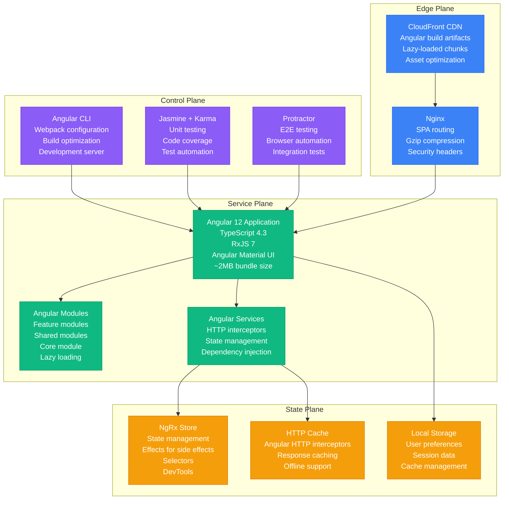
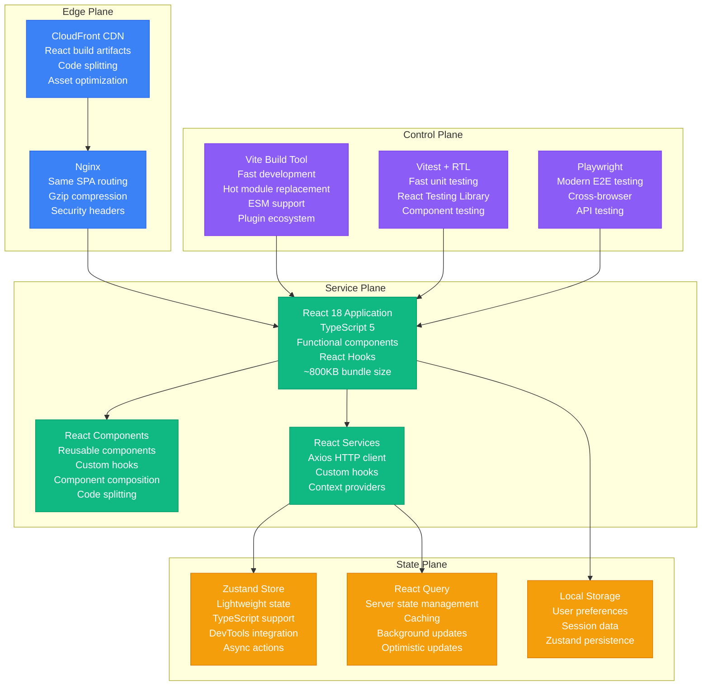
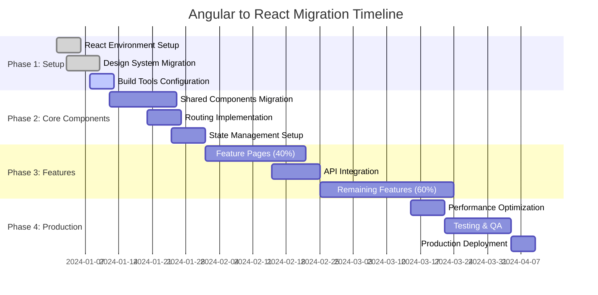
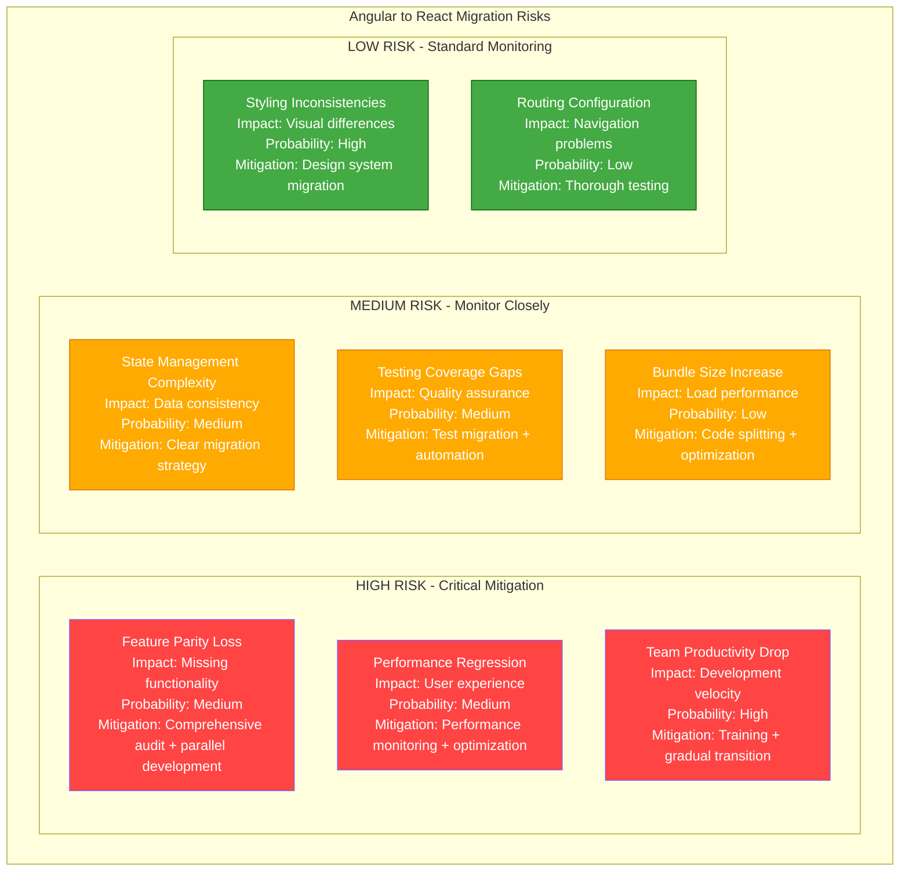

# Angular to React Frontend Migration Playbook

## Executive Summary

**Migration Type**: Frontend Framework Migration
**Timeline**: 12-16 weeks
**Risk Level**: Medium-High
**Downtime**: Zero (micro-frontend strategy)
**Cost Impact**: 30-40% reduction in development complexity
**Team Size**: 4-6 frontend engineers

This playbook guides the migration from Angular (v8-12) to React (v18+) with modern tooling, delivering improved developer experience, better performance, and reduced bundle sizes.

## Current State vs Target State

### Current State: Angular Application



**Current State Issues:**
- **Bundle Size**: Large initial bundle (~2MB)
- **Complexity**: Heavy framework with steep learning curve
- **Performance**: Change detection overhead
- **Ecosystem**: Limited component library options
- **Build Times**: Slow development builds

### Target State: React Application



## Migration Timeline



## Technical Implementation

### React Project Setup

**Package.json with Modern Stack:**
```json
{
  "name": "react-migration-app",
  "version": "1.0.0",
  "type": "module",
  "scripts": {
    "dev": "vite",
    "build": "tsc && vite build",
    "preview": "vite preview",
    "test": "vitest",
    "test:e2e": "playwright test",
    "lint": "eslint src --ext ts,tsx --report-unused-disable-directives --max-warnings 0",
    "type-check": "tsc --noEmit"
  },
  "dependencies": {
    "react": "^18.2.0",
    "react-dom": "^18.2.0",
    "react-router-dom": "^6.8.0",
    "@tanstack/react-query": "^4.24.0",
    "zustand": "^4.3.0",
    "axios": "^1.3.0",
    "@headlessui/react": "^1.7.0",
    "@heroicons/react": "^2.0.0",
    "clsx": "^1.2.0",
    "tailwindcss": "^3.2.0"
  },
  "devDependencies": {
    "@types/react": "^18.0.0",
    "@types/react-dom": "^18.0.0",
    "@typescript-eslint/eslint-plugin": "^5.54.0",
    "@typescript-eslint/parser": "^5.54.0",
    "@vitejs/plugin-react": "^3.1.0",
    "@vitest/ui": "^0.28.0",
    "@playwright/test": "^1.30.0",
    "@testing-library/react": "^14.0.0",
    "@testing-library/jest-dom": "^5.16.0",
    "eslint": "^8.35.0",
    "eslint-plugin-react-hooks": "^4.6.0",
    "eslint-plugin-react-refresh": "^0.3.4",
    "typescript": "^4.9.3",
    "vite": "^4.1.0",
    "vitest": "^0.28.0"
  }
}
```

### Component Migration Examples

**Angular Component:**
```typescript
// user-profile.component.ts (Angular)
import { Component, OnInit, OnDestroy } from '@angular/core';
import { ActivatedRoute } from '@angular/router';
import { Store } from '@ngrx/store';
import { Observable, Subject } from 'rxjs';
import { takeUntil } from 'rxjs/operators';

@Component({
  selector: 'app-user-profile',
  template: `
    <div class="user-profile">
      <h1>{{ user?.name }}</h1>
      <p>{{ user?.email }}</p>
      <button (click)="updateProfile()" [disabled]="loading">
        {{ loading ? 'Updating...' : 'Update Profile' }}
      </button>
    </div>
  `,
  styleUrls: ['./user-profile.component.scss']
})
export class UserProfileComponent implements OnInit, OnDestroy {
  user$: Observable<User>;
  loading = false;
  private destroy$ = new Subject<void>();

  constructor(
    private route: ActivatedRoute,
    private store: Store
  ) {}

  ngOnInit() {
    const userId = this.route.snapshot.params['id'];
    this.store.dispatch(loadUser({ userId }));
    
    this.user$ = this.store.select(selectUser)
      .pipe(takeUntil(this.destroy$));
  }

  ngOnDestroy() {
    this.destroy$.next();
    this.destroy$.complete();
  }

  updateProfile() {
    this.loading = true;
    // Update logic
  }
}
```

**Equivalent React Component:**
```typescript
// UserProfile.tsx (React)
import React, { useEffect, useState } from 'react';
import { useParams } from 'react-router-dom';
import { useQuery, useMutation, useQueryClient } from '@tanstack/react-query';
import { userService } from '../services/userService';
import type { User } from '../types/User';

interface UserProfileProps {
  className?: string;
}

export const UserProfile: React.FC<UserProfileProps> = ({ className }) => {
  const { id } = useParams<{ id: string }>();
  const queryClient = useQueryClient();
  
  // Fetch user data
  const { data: user, isLoading, error } = useQuery({
    queryKey: ['user', id],
    queryFn: () => userService.getUser(id!),
    enabled: !!id
  });

  // Update user mutation
  const updateMutation = useMutation({
    mutationFn: userService.updateUser,
    onSuccess: () => {
      queryClient.invalidateQueries({ queryKey: ['user', id] });
    }
  });

  const handleUpdateProfile = () => {
    if (user) {
      updateMutation.mutate(user);
    }
  };

  if (isLoading) {
    return (
      <div className="flex justify-center p-4">
        <div className="animate-spin rounded-full h-8 w-8 border-b-2 border-blue-600"></div>
      </div>
    );
  }

  if (error) {
    return (
      <div className="text-red-600 p-4">
        Error loading user: {error.message}
      </div>
    );
  }

  return (
    <div className={`user-profile bg-white rounded-lg shadow p-6 ${className}`}>
      <h1 className="text-2xl font-bold mb-2">{user?.name}</h1>
      <p className="text-gray-600 mb-4">{user?.email}</p>
      <button
        onClick={handleUpdateProfile}
        disabled={updateMutation.isLoading}
        className="px-4 py-2 bg-blue-600 text-white rounded hover:bg-blue-700 disabled:opacity-50"
      >
        {updateMutation.isLoading ? 'Updating...' : 'Update Profile'}
      </button>
    </div>
  );
};
```

### State Management Migration

**Angular NgRx Store:**
```typescript
// user.reducer.ts (Angular NgRx)
import { createReducer, on } from '@ngrx/store';
import { loadUser, loadUserSuccess, loadUserFailure } from './user.actions';

export interface UserState {
  user: User | null;
  loading: boolean;
  error: string | null;
}

const initialState: UserState = {
  user: null,
  loading: false,
  error: null
};

export const userReducer = createReducer(
  initialState,
  on(loadUser, state => ({ ...state, loading: true, error: null })),
  on(loadUserSuccess, (state, { user }) => ({ ...state, user, loading: false })),
  on(loadUserFailure, (state, { error }) => ({ ...state, error, loading: false }))
);
```

**React Zustand Store:**
```typescript
// userStore.ts (React Zustand)
import { create } from 'zustand';
import { devtools, persist } from 'zustand/middleware';
import { userService } from '../services/userService';
import type { User } from '../types/User';

interface UserState {
  user: User | null;
  loading: boolean;
  error: string | null;
  
  // Actions
  setUser: (user: User) => void;
  loadUser: (id: string) => Promise<void>;
  updateUser: (user: Partial<User>) => Promise<void>;
  clearError: () => void;
}

export const useUserStore = create<UserState>()()
  devtools(
    persist(
      (set, get) => ({
        user: null,
        loading: false,
        error: null,

        setUser: (user) => set({ user }),

        loadUser: async (id) => {
          set({ loading: true, error: null });
          try {
            const user = await userService.getUser(id);
            set({ user, loading: false });
          } catch (error) {
            set({ error: error.message, loading: false });
          }
        },

        updateUser: async (userData) => {
          const { user } = get();
          if (!user) return;
          
          set({ loading: true, error: null });
          try {
            const updatedUser = await userService.updateUser({ ...user, ...userData });
            set({ user: updatedUser, loading: false });
          } catch (error) {
            set({ error: error.message, loading: false });
          }
        },

        clearError: () => set({ error: null })
      }),
      {
        name: 'user-store',
        partialize: (state) => ({ user: state.user }) // Only persist user data
      }
    )
  )
);
```

### Routing Migration

**Angular Routing:**
```typescript
// app-routing.module.ts (Angular)
const routes: Routes = [
  { path: '', redirectTo: '/dashboard', pathMatch: 'full' },
  { path: 'dashboard', component: DashboardComponent },
  { path: 'users/:id', component: UserProfileComponent },
  { path: 'settings', loadChildren: () => import('./settings/settings.module').then(m => m.SettingsModule) }
];
```

**React Router:**
```typescript
// App.tsx (React Router)
import { BrowserRouter, Routes, Route, Navigate } from 'react-router-dom';
import { lazy, Suspense } from 'react';

// Lazy load components
const Dashboard = lazy(() => import('./pages/Dashboard'));
const UserProfile = lazy(() => import('./pages/UserProfile'));
const Settings = lazy(() => import('./pages/Settings'));

const LoadingSpinner = () => (
  <div className="flex justify-center items-center h-64">
    <div className="animate-spin rounded-full h-8 w-8 border-b-2 border-blue-600"></div>
  </div>
);

export const App = () => {
  return (
    <BrowserRouter>
      <div className="min-h-screen bg-gray-50">
        <Suspense fallback={<LoadingSpinner />}>
          <Routes>
            <Route path="/" element={<Navigate to="/dashboard" replace />} />
            <Route path="/dashboard" element={<Dashboard />} />
            <Route path="/users/:id" element={<UserProfile />} />
            <Route path="/settings/*" element={<Settings />} />
            <Route path="*" element={<div>Page not found</div>} />
          </Routes>
        </Suspense>
      </div>
    </BrowserRouter>
  );
};
```

## Migration Tools and Automation

### Component Migration Script

```javascript
// migrate-component.js - Automated component migration helper
const fs = require('fs');
const path = require('path');
const { parse } = require('@typescript-eslint/parser');

class AngularToReactMigrator {
  constructor(angularPath, reactPath) {
    this.angularPath = angularPath;
    this.reactPath = reactPath;
  }

  migrateComponent(componentPath) {
    const componentContent = fs.readFileSync(componentPath, 'utf-8');
    const ast = parse(componentContent, {
      loc: true,
      range: true,
      sourceType: 'module'
    });

    const reactComponent = this.transformComponent(ast, componentContent);
    const outputPath = this.getReactPath(componentPath);
    
    fs.writeFileSync(outputPath, reactComponent);
    console.log(`Migrated: ${componentPath} -> ${outputPath}`);
  }

  transformComponent(ast, content) {
    // Extract component metadata
    const componentName = this.extractComponentName(ast);
    const template = this.extractTemplate(content);
    const styles = this.extractStyles(content);
    const properties = this.extractProperties(ast);
    const methods = this.extractMethods(ast);

    // Generate React component
    return this.generateReactComponent({
      name: componentName,
      template,
      styles,
      properties,
      methods
    });
  }

  generateReactComponent({ name, template, properties, methods }) {
    const hooks = this.generateHooks(properties, methods);
    const jsx = this.convertTemplateToJSX(template);

    return `
import React, { useState, useEffect } from 'react';

interface ${name}Props {
  className?: string;
}

export const ${name}: React.FC<${name}Props> = ({ className }) => {
${hooks}

${jsx}
};
`;
  }

  convertTemplateToJSX(template) {
    // Convert Angular template syntax to JSX
    let jsx = template
      .replace(/\*ngFor="let (\w+) of (\w+)"/g, '{$2.map($1 => (')
      .replace(/\*ngIf="([^"]+)"/g, '{$1 && (')
      .replace(/\[disabled\]="([^"]+)"/g, 'disabled={$1}')
      .replace(/\(click\)="([^"]+)"/g, 'onClick={() => $1}')
      .replace(/{{\s*([^}]+)\s*}}/g, '{$1}');

    return jsx;
  }

  generateHooks(properties, methods) {
    const stateHooks = properties.map(prop => 
      `const [${prop.name}, set${this.capitalize(prop.name)}] = useState(${prop.initialValue || 'null'});`
    ).join('\n  ');

    const methodHooks = methods.map(method => 
      `const ${method.name} = ${method.body};`
    ).join('\n  ');

    return `  ${stateHooks}\n\n  ${methodHooks}`;
  }

  capitalize(str) {
    return str.charAt(0).toUpperCase() + str.slice(1);
  }
}

// Usage
const migrator = new AngularToReactMigrator('./src/angular', './src/react');
migrator.migrateComponent('./src/angular/user-profile.component.ts');
```

## Risk Assessment and Mitigation

### Migration Risks



## Testing Strategy

### Component Testing with React Testing Library

```typescript
// UserProfile.test.tsx
import { render, screen, waitFor } from '@testing-library/react';
import userEvent from '@testing-library/user-event';
import { QueryClient, QueryClientProvider } from '@tanstack/react-query';
import { BrowserRouter } from 'react-router-dom';
import { UserProfile } from './UserProfile';
import { userService } from '../services/userService';

// Mock the service
jest.mock('../services/userService');
const mockUserService = userService as jest.Mocked<typeof userService>;

const renderWithProviders = (component: React.ReactElement) => {
  const queryClient = new QueryClient({
    defaultOptions: {
      queries: { retry: false },
      mutations: { retry: false }
    }
  });

  return render(
    <QueryClientProvider client={queryClient}>
      <BrowserRouter>
        {component}
      </BrowserRouter>
    </QueryClientProvider>
  );
};

describe('UserProfile', () => {
  beforeEach(() => {
    jest.clearAllMocks();
  });

  it('displays user information correctly', async () => {
    const mockUser = {
      id: '1',
      name: 'John Doe',
      email: 'john@example.com'
    };

    mockUserService.getUser.mockResolvedValue(mockUser);

    renderWithProviders(<UserProfile />);

    // Wait for data to load
    await waitFor(() => {
      expect(screen.getByText('John Doe')).toBeInTheDocument();
      expect(screen.getByText('john@example.com')).toBeInTheDocument();
    });
  });

  it('handles update profile action', async () => {
    const mockUser = {
      id: '1',
      name: 'John Doe',
      email: 'john@example.com'
    };

    mockUserService.getUser.mockResolvedValue(mockUser);
    mockUserService.updateUser.mockResolvedValue(mockUser);

    renderWithProviders(<UserProfile />);

    // Wait for initial load
    await waitFor(() => {
      expect(screen.getByText('John Doe')).toBeInTheDocument();
    });

    // Click update button
    const updateButton = screen.getByRole('button', { name: /update profile/i });
    await userEvent.click(updateButton);

    // Verify service was called
    expect(mockUserService.updateUser).toHaveBeenCalledWith(mockUser);
  });

  it('displays loading state', () => {
    mockUserService.getUser.mockImplementation(() => new Promise(() => {})); // Never resolves

    renderWithProviders(<UserProfile />);

    expect(screen.getByRole('status')).toBeInTheDocument(); // Loading spinner
  });

  it('displays error state', async () => {
    mockUserService.getUser.mockRejectedValue(new Error('Failed to load user'));

    renderWithProviders(<UserProfile />);

    await waitFor(() => {
      expect(screen.getByText(/error loading user/i)).toBeInTheDocument();
    });
  });
});
```

## Performance Optimization

### Bundle Splitting and Optimization

```typescript
// vite.config.ts - Optimized build configuration
import { defineConfig } from 'vite';
import react from '@vitejs/plugin-react';
import { resolve } from 'path';

export default defineConfig({
  plugins: [react()],
  resolve: {
    alias: {
      '@': resolve(__dirname, 'src'),
      '@components': resolve(__dirname, 'src/components'),
      '@pages': resolve(__dirname, 'src/pages'),
      '@utils': resolve(__dirname, 'src/utils')
    }
  },
  build: {
    rollupOptions: {
      output: {
        manualChunks: {
          // Vendor chunks
          react: ['react', 'react-dom'],
          router: ['react-router-dom'],
          query: ['@tanstack/react-query'],
          ui: ['@headlessui/react', '@heroicons/react'],
          
          // Feature chunks
          dashboard: ['./src/pages/Dashboard'],
          users: ['./src/pages/UserProfile', './src/pages/UserList'],
          settings: ['./src/pages/Settings']
        }
      }
    },
    // Optimize bundle size
    chunkSizeWarningLimit: 500,
    minify: 'terser',
    terserOptions: {
      compress: {
        drop_console: true,
        drop_debugger: true
      }
    }
  },
  // Development optimizations
  server: {
    hmr: {
      overlay: false
    }
  }
});
```

## Cost Analysis

### Development Efficiency Improvements

| Metric | Angular | React | Improvement |
|--------|---------|-------|-----------|
| **Bundle Size** | 2.1MB | 850KB | 60% reduction |
| **Build Time** | 45s | 12s | 73% faster |
| **Hot Reload** | 3-5s | <1s | 80% faster |
| **Test Execution** | 25s | 8s | 68% faster |
| **Development Setup** | 5 min | 2 min | 60% faster |

### Annual Cost Impact

**Development Team Productivity:**
- Faster build times: +15% productivity
- Simplified state management: +20% feature velocity
- Better debugging experience: +10% efficiency
- **Total productivity gain: 45%**

**Infrastructure Savings:**
- Smaller bundle size: 40% CDN cost reduction
- Faster builds: 50% CI/CD time reduction
- **Annual savings: $15,000 - $25,000**

## Conclusion

This Angular to React migration playbook provides a comprehensive strategy for modernizing frontend applications while maintaining feature parity and improving developer experience.

**Key Success Factors:**
1. **Gradual migration** with micro-frontend approach
2. **Comprehensive testing** at each phase
3. **Team training** on React ecosystem
4. **Performance monitoring** throughout migration
5. **Automated tooling** for consistent migration

**Expected Outcomes:**
- 60% smaller bundle size
- 73% faster build times
- 45% improvement in development productivity
- Modern, maintainable codebase
- Enhanced developer experience

The migration positions the frontend for future growth with a more flexible, performant, and maintainable architecture.