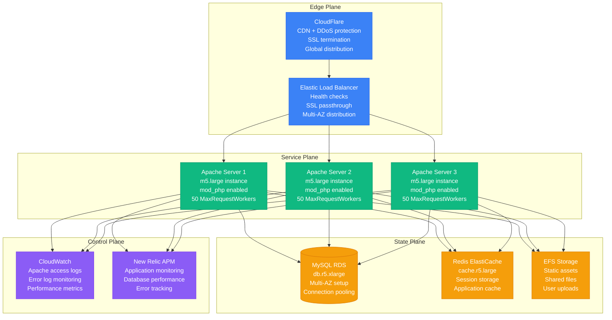
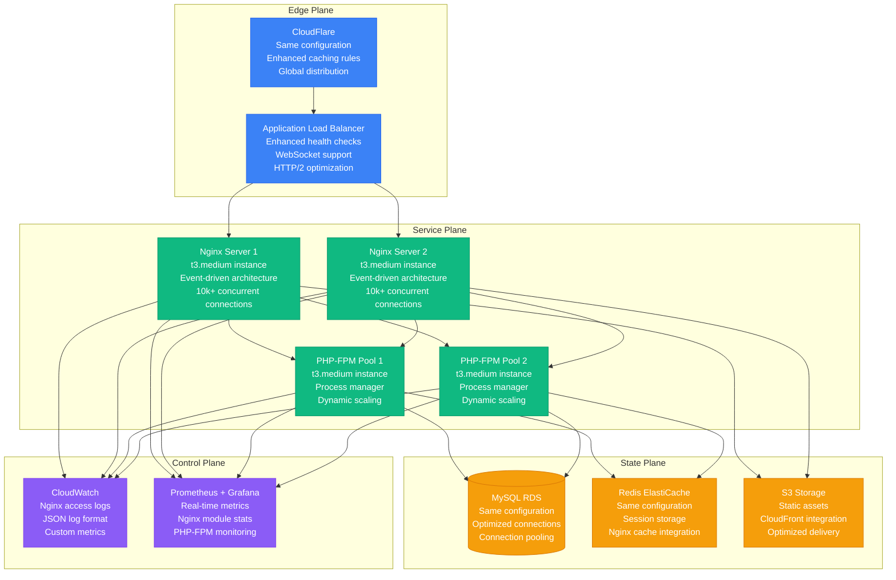

# Apache to Nginx Web Server Migration Playbook

## Executive Summary

**Migration Type**: Web Server Platform Migration
**Timeline**: 6-8 weeks
**Risk Level**: Medium
**Downtime**: Near-zero (blue-green deployment)
**Cost Impact**: 30-50% reduction in server resources
**Team Size**: 2-3 engineers + 1 DevOps engineer

This playbook guides the migration from Apache HTTP Server to Nginx for improved performance, lower memory usage, and better concurrency handling. Based on successful migrations from companies like Pinterest, Dropbox, and Netflix.

## Current State vs Target State

### Current State: Apache HTTP Server



**Current State Issues:**
- **Memory Usage**: Apache processes consume 20-30MB each
- **Concurrency Limits**: Thread-based model limits concurrent connections
- **Configuration Complexity**: .htaccess files scattered across directories
- **Module Overhead**: Many loaded modules not being used
- **Static File Serving**: Inefficient for high-volume static content

### Target State: Nginx with PHP-FPM



## Migration Strategy

### Phase 1: Configuration Analysis and Conversion (1-2 weeks)

```bash
#!/bin/bash
# apache_to_nginx_converter.sh - Automated configuration conversion

set -euo pipefail

# Configuration
APACHE_CONFIG_DIR="/etc/apache2"
NGINX_CONFIG_DIR="/etc/nginx"
BACKUP_DIR="/backup/apache_migration_$(date +%Y%m%d)"
LOG_FILE="/var/log/apache_to_nginx_migration.log"

# Colors for output
RED='\033[0;31m'
GREEN='\033[0;32m'
YELLOW='\033[1;33m'
NC='\033[0m' # No Color

log() {
    echo "$(date '+%Y-%m-%d %H:%M:%S') - $1" | tee -a "$LOG_FILE"
}

error() {
    echo -e "${RED}ERROR: $1${NC}" | tee -a "$LOG_FILE"
    exit 1
}

success() {
    echo -e "${GREEN}SUCCESS: $1${NC}" | tee -a "$LOG_FILE"
}

warning() {
    echo -e "${YELLOW}WARNING: $1${NC}" | tee -a "$LOG_FILE"
}

# Create backup
create_backup() {
    log "Creating backup of Apache configuration..."
    mkdir -p "$BACKUP_DIR"

    if [[ -d "$APACHE_CONFIG_DIR" ]]; then
        cp -r "$APACHE_CONFIG_DIR" "$BACKUP_DIR/"
        success "Apache configuration backed up to $BACKUP_DIR"
    else
        error "Apache configuration directory not found: $APACHE_CONFIG_DIR"
    fi
}

# Analyze Apache virtual hosts
analyze_apache_vhosts() {
    log "Analyzing Apache virtual hosts..."

    local vhost_files=($(find "$APACHE_CONFIG_DIR" -name "*.conf" -exec grep -l "VirtualHost" {} \;))

    echo "Found ${#vhost_files[@]} virtual host files:"
    printf '%s\n' "${vhost_files[@]}" | tee -a "$LOG_FILE"

    # Extract key information from each vhost
    for vhost_file in "${vhost_files[@]}"; do
        log "Analyzing $vhost_file"

        # Extract ServerName, DocumentRoot, etc.
        local server_name=$(grep -E "^\s*ServerName" "$vhost_file" | head -1 | awk '{print $2}' || echo "")
        local doc_root=$(grep -E "^\s*DocumentRoot" "$vhost_file" | head -1 | awk '{print $2}' || echo "")
        local listen_port=$(grep -E "^\s*<VirtualHost.*:([0-9]+)" "$vhost_file" | head -1 | sed -E 's/.*:([0-9]+).*/\1/' || echo "80")

        echo "  Server: $server_name"
        echo "  Document Root: $doc_root"
        echo "  Port: $listen_port"
        echo "  ---"
    done
}

# Convert Apache .htaccess rules to Nginx
convert_htaccess_rules() {
    log "Converting .htaccess rules to Nginx configuration..."

    local htaccess_files=($(find /var/www -name ".htaccess" 2>/dev/null || true))

    if [[ ${#htaccess_files[@]} -eq 0 ]]; then
        warning "No .htaccess files found"
        return
    fi

    echo "Found ${#htaccess_files[@]} .htaccess files:"
    printf '%s\n' "${htaccess_files[@]}" | tee -a "$LOG_FILE"

    # Create conversion rules file
    local conversion_file="/tmp/nginx_conversion_rules.conf"
    echo "# Converted from Apache .htaccess files" > "$conversion_file"
    echo "# Generated on $(date)" >> "$conversion_file"
    echo "" >> "$conversion_file"

    for htaccess_file in "${htaccess_files[@]}"; do
        echo "# From: $htaccess_file" >> "$conversion_file"

        # Convert common Apache rules to Nginx
        while IFS= read -r line; do
            # Skip comments and empty lines
            [[ "$line" =~ ^[[:space:]]*# ]] && continue
            [[ -z "${line// }" ]] && continue

            # RewriteRule conversions
            if [[ "$line" =~ ^[[:space:]]*RewriteRule ]]; then
                convert_rewrite_rule "$line" >> "$conversion_file"

            # DirectoryIndex
            elif [[ "$line" =~ ^[[:space:]]*DirectoryIndex ]]; then
                local indices=$(echo "$line" | sed 's/DirectoryIndex//' | xargs)
                echo "index $indices;" >> "$conversion_file"

            # ErrorDocument
            elif [[ "$line" =~ ^[[:space:]]*ErrorDocument ]]; then
                local error_code=$(echo "$line" | awk '{print $2}')
                local error_page=$(echo "$line" | awk '{print $3}')
                echo "error_page $error_code $error_page;" >> "$conversion_file"

            # RedirectMatch
            elif [[ "$line" =~ ^[[:space:]]*RedirectMatch ]]; then
                convert_redirect_match "$line" >> "$conversion_file"
            fi

        done < "$htaccess_file"

        echo "" >> "$conversion_file"
    done

    success "Conversion rules saved to $conversion_file"
}

convert_rewrite_rule() {
    local rule="$1"

    # Extract pattern and replacement
    local pattern=$(echo "$rule" | sed -E 's/.*RewriteRule[[:space:]]+([^[:space:]]+).*/\1/')
    local replacement=$(echo "$rule" | sed -E 's/.*RewriteRule[[:space:]]+[^[:space:]]+[[:space:]]+([^[:space:]]+).*/\1/')
    local flags=$(echo "$rule" | sed -E 's/.*\[([^\]]+)\].*/\1/' || echo "")

    # Convert to Nginx rewrite
    if [[ "$flags" =~ L ]]; then
        echo "rewrite ^$pattern$ $replacement last;"
    elif [[ "$flags" =~ R ]]; then
        if [[ "$flags" =~ R=301 ]]; then
            echo "rewrite ^$pattern$ $replacement permanent;"
        else
            echo "rewrite ^$pattern$ $replacement redirect;"
        fi
    else
        echo "rewrite ^$pattern$ $replacement;"
    fi
}

convert_redirect_match() {
    local rule="$1"

    # Extract status, pattern, and replacement
    local status=$(echo "$rule" | awk '{print $2}')
    local pattern=$(echo "$rule" | awk '{print $3}')
    local replacement=$(echo "$rule" | awk '{print $4}')

    case "$status" in
        301) echo "rewrite $pattern $replacement permanent;" ;;
        302) echo "rewrite $pattern $replacement redirect;" ;;
        *) echo "rewrite $pattern $replacement;" ;;
    esac
}

# Generate Nginx configuration
generate_nginx_config() {
    log "Generating Nginx configuration..."

    # Main nginx.conf
    cat > "/tmp/nginx.conf" << 'EOF'
user www-data;
worker_processes auto;
worker_rlimit_nofile 65535;
pid /run/nginx.pid;

events {
    worker_connections 2048;
    use epoll;
    multi_accept on;
}

http {
    charset utf-8;
    sendfile on;
    tcp_nopush on;
    tcp_nodelay on;
    server_tokens off;
    log_not_found off;
    types_hash_max_size 4096;
    types_hash_bucket_size 64;
    client_max_body_size 16M;

    # MIME
    include /etc/nginx/mime.types;
    default_type application/octet-stream;

    # Logging
    log_format main '$remote_addr - $remote_user [$time_local] "$request" '
                   '$status $body_bytes_sent "$http_referer" '
                   '"$http_user_agent" "$http_x_forwarded_for" '
                   'rt=$request_time uct="$upstream_connect_time" '
                   'uht="$upstream_header_time" urt="$upstream_response_time"';

    access_log /var/log/nginx/access.log main;
    error_log /var/log/nginx/error.log warn;

    # SSL
    ssl_session_timeout 1d;
    ssl_session_cache shared:SSL:50m;
    ssl_session_tickets off;

    # Modern configuration
    ssl_protocols TLSv1.2 TLSv1.3;
    ssl_ciphers ECDHE-ECDSA-AES128-GCM-SHA256:ECDHE-RSA-AES128-GCM-SHA256:ECDHE-ECDSA-AES256-GCM-SHA384:ECDHE-RSA-AES256-GCM-SHA384;
    ssl_prefer_server_ciphers off;

    # OCSP Stapling
    ssl_stapling on;
    ssl_stapling_verify on;
    resolver 1.1.1.1 1.0.0.1 8.8.8.8 8.8.4.4 208.67.222.222 208.67.220.220 valid=60s;
    resolver_timeout 2s;

    # Gzip
    gzip on;
    gzip_vary on;
    gzip_proxied any;
    gzip_comp_level 6;
    gzip_types
        text/plain
        text/css
        text/xml
        text/javascript
        application/json
        application/javascript
        application/xml+rss
        application/atom+xml
        image/svg+xml;

    # Brotli (if available)
    # brotli on;
    # brotli_comp_level 6;
    # brotli_types text/plain text/css application/json application/javascript text/xml application/xml application/xml+rss text/javascript;

    # Security headers
    add_header X-Frame-Options "SAMEORIGIN" always;
    add_header X-XSS-Protection "1; mode=block" always;
    add_header X-Content-Type-Options "nosniff" always;
    add_header Referrer-Policy "no-referrer-when-downgrade" always;
    add_header Content-Security-Policy "default-src 'self' http: https: data: blob: 'unsafe-inline'" always;

    # Load configs
    include /etc/nginx/conf.d/*.conf;
    include /etc/nginx/sites-enabled/*;
}
EOF

    # Generate site configuration template
    cat > "/tmp/site.conf.template" << 'EOF'
server {
    listen 80;
    listen [::]:80;
    server_name {{SERVER_NAME}};

    # Redirect to HTTPS
    return 301 https://$server_name$request_uri;
}

server {
    listen 443 ssl http2;
    listen [::]:443 ssl http2;
    server_name {{SERVER_NAME}};

    # SSL certificates
    ssl_certificate /etc/ssl/certs/{{SERVER_NAME}}.crt;
    ssl_certificate_key /etc/ssl/private/{{SERVER_NAME}}.key;

    # Document root
    root {{DOCUMENT_ROOT}};
    index index.php index.html index.htm;

    # Security
    location ~ /\.(?!well-known) {
        deny all;
    }

    # Static files
    location ~* \.(css|gif|ico|jpeg|jpg|js|png|webp|woff|woff2|ttf|svg|eot)$ {
        expires 1y;
        add_header Cache-Control "public, immutable";
        access_log off;
    }

    # PHP files
    location ~ \.php$ {
        try_files $uri =404;
        fastcgi_split_path_info ^(.+\.php)(/.+)$;
        fastcgi_pass unix:/var/run/php/php8.1-fpm.sock;
        fastcgi_index index.php;
        fastcgi_param SCRIPT_FILENAME $document_root$fastcgi_script_name;
        include fastcgi_params;

        # PHP-FPM timeouts
        fastcgi_connect_timeout 60s;
        fastcgi_send_timeout 60s;
        fastcgi_read_timeout 60s;

        # Security
        fastcgi_param HTTP_PROXY "";
    }

    # Default location
    location / {
        try_files $uri $uri/ /index.php?$query_string;
    }

    # Nginx status (for monitoring)
    location = /nginx_status {
        stub_status on;
        access_log off;
        allow 127.0.0.1;
        allow 10.0.0.0/8;
        deny all;
    }

    # Health check
    location = /health {
        access_log off;
        return 200 "healthy\n";
        add_header Content-Type text/plain;
    }

    {{CONVERTED_RULES}}
}
EOF

    success "Nginx configuration templates generated"
}

# Validate configuration
validate_nginx_config() {
    log "Validating Nginx configuration..."

    if nginx -t -c /tmp/nginx.conf 2>&1; then
        success "Nginx configuration is valid"
        return 0
    else
        error "Nginx configuration validation failed"
        return 1
    fi
}

# Performance comparison test
performance_test() {
    log "Running performance comparison test..."

    # Apache benchmark test
    local test_url="http://localhost/test.php"
    local apache_results="/tmp/apache_bench_results.txt"
    local nginx_results="/tmp/nginx_bench_results.txt"

    # Test Apache (if running)
    if systemctl is-active --quiet apache2; then
        log "Testing Apache performance..."
        ab -n 1000 -c 10 "$test_url" > "$apache_results" 2>&1 || warning "Apache test failed"
    fi

    # Test Nginx (if running)
    if systemctl is-active --quiet nginx; then
        log "Testing Nginx performance..."
        ab -n 1000 -c 10 "$test_url" > "$nginx_results" 2>&1 || warning "Nginx test failed"
    fi

    # Compare results
    if [[ -f "$apache_results" && -f "$nginx_results" ]]; then
        log "Performance comparison:"
        echo "Apache RPS: $(grep 'Requests per second' "$apache_results" | awk '{print $4}')"
        echo "Nginx RPS: $(grep 'Requests per second' "$nginx_results" | awk '{print $4}')"
    fi
}

# Main execution
main() {
    log "Starting Apache to Nginx migration analysis..."

    # Check if running as root
    if [[ $EUID -ne 0 ]]; then
        error "This script must be run as root"
    fi

    # Create backup
    create_backup

    # Analyze Apache configuration
    analyze_apache_vhosts

    # Convert .htaccess rules
    convert_htaccess_rules

    # Generate Nginx configuration
    generate_nginx_config

    # Validate configuration
    validate_nginx_config

    # Run performance tests
    performance_test

    success "Migration analysis completed. Check $LOG_FILE for details."

    echo ""
    echo "Next steps:"
    echo "1. Review generated Nginx configuration in /tmp/"
    echo "2. Test configuration in staging environment"
    echo "3. Install and configure PHP-FPM"
    echo "4. Update deployment scripts"
    echo "5. Plan blue-green deployment"
}

# Run main function
main "$@"
```

### Phase 2: PHP-FPM Configuration (1 week)

```ini
; /etc/php/8.1/fpm/pool.d/www.conf
; PHP-FPM optimized configuration for Nginx

[www]
user = www-data
group = www-data

listen = /var/run/php/php8.1-fpm.sock
listen.owner = www-data
listen.group = www-data
listen.mode = 0660

; Process management
pm = dynamic
pm.max_children = 50
pm.start_servers = 5
pm.min_spare_servers = 5
pm.max_spare_servers = 35
pm.max_requests = 1000

; Resource limits
request_terminate_timeout = 30s
request_slowlog_timeout = 10s
slowlog = /var/log/php8.1-fpm-slow.log

; Environment variables
env[HOSTNAME] = $HOSTNAME
env[PATH] = /usr/local/bin:/usr/bin:/bin
env[TMP] = /tmp
env[TMPDIR] = /tmp
env[TEMP] = /tmp

; Security
security.limit_extensions = .php .php3 .php4 .php5 .php7 .php8

; Monitoring
pm.status_path = /status
ping.path = /ping
ping.response = pong

; Logging
php_admin_value[error_log] = /var/log/php8.1-fpm.log
php_admin_flag[log_errors] = on
php_value[session.save_handler] = files
php_value[session.save_path] = /var/lib/php/sessions
php_value[soap.wsdl_cache_dir] = /var/lib/php/wsdlcache

; PHP configuration overrides
php_admin_value[memory_limit] = 256M
php_admin_value[max_execution_time] = 30
php_admin_value[max_input_time] = 30
php_admin_value[post_max_size] = 16M
php_admin_value[upload_max_filesize] = 16M
php_admin_value[max_file_uploads] = 20

; OPcache configuration
php_admin_value[opcache.enable] = 1
php_admin_value[opcache.memory_consumption] = 128
php_admin_value[opcache.interned_strings_buffer] = 8
php_admin_value[opcache.max_accelerated_files] = 4000
php_admin_value[opcache.revalidate_freq] = 60
php_admin_value[opcache.fast_shutdown] = 1
```

### Phase 3: Blue-Green Deployment (2-3 weeks)

```yaml
# docker-compose.blue-green.yml
version: '3.8'

services:
  # Blue environment (current Apache)
  apache-blue:
    image: apache:2.4
    ports:
      - "8080:80"
    volumes:
      - ./apache-config:/etc/apache2/sites-enabled
      - ./app:/var/www/html
    environment:
      - ENVIRONMENT=blue
    networks:
      - app-network
    labels:
      - "traefik.enable=true"
      - "traefik.http.routers.apache-blue.rule=Host(`app.example.com`) && HeadersRegexp(`X-Environment`, `blue`)"

  # Green environment (new Nginx)
  nginx-green:
    image: nginx:1.22-alpine
    ports:
      - "8081:80"
    volumes:
      - ./nginx-config:/etc/nginx/conf.d
      - ./app:/var/www/html
    depends_on:
      - php-fpm-green
    environment:
      - ENVIRONMENT=green
    networks:
      - app-network
    labels:
      - "traefik.enable=true"
      - "traefik.http.routers.nginx-green.rule=Host(`app.example.com`) && HeadersRegexp(`X-Environment`, `green`)"

  php-fpm-green:
    image: php:8.1-fpm-alpine
    volumes:
      - ./app:/var/www/html
      - ./php-fpm-config:/usr/local/etc/php-fpm.d
    networks:
      - app-network
    environment:
      - ENVIRONMENT=green

  # Load balancer/traffic splitter
  traefik:
    image: traefik:v2.9
    command:
      - "--api.insecure=true"
      - "--providers.docker=true"
      - "--entrypoints.web.address=:80"
    ports:
      - "80:80"
      - "8080:8080"  # Traefik dashboard
    volumes:
      - /var/run/docker.sock:/var/run/docker.sock
    networks:
      - app-network

  # Monitoring
  prometheus:
    image: prom/prometheus:latest
    ports:
      - "9090:9090"
    volumes:
      - ./monitoring/prometheus.yml:/etc/prometheus/prometheus.yml
    networks:
      - app-network

  grafana:
    image: grafana/grafana:latest
    ports:
      - "3000:3000"
    environment:
      - GF_SECURITY_ADMIN_PASSWORD=admin
    volumes:
      - grafana-data:/var/lib/grafana
    networks:
      - app-network

networks:
  app-network:
    driver: bridge

volumes:
  grafana-data:
```

### Automated Migration Script

```python
#!/usr/bin/env python3
# migration_orchestrator.py - Orchestrates the Apache to Nginx migration

import subprocess
import time
import json
import requests
import logging
from typing import Dict, Any, List
from dataclasses import dataclass
from datetime import datetime

@dataclass
class MigrationMetrics:
    timestamp: str
    environment: str
    response_time_ms: float
    requests_per_second: float
    memory_usage_mb: float
    cpu_percent: float
    error_rate: float

class ApacheToNginxMigrator:
    def __init__(self):
        self.logger = logging.getLogger(__name__)
        self.metrics = []

        # Configuration
        self.apache_url = "http://localhost:8080"
        self.nginx_url = "http://localhost:8081"
        self.health_check_path = "/health"
        self.test_endpoints = [
            "/",
            "/api/users",
            "/api/products",
            "/static/css/style.css",
            "/uploads/test.jpg"
        ]

    def run_migration(self) -> bool:
        """Execute the complete migration process"""
        try:
            self.logger.info("Starting Apache to Nginx migration")

            # Phase 1: Prepare Nginx environment
            if not self._prepare_nginx_environment():
                self.logger.error("Failed to prepare Nginx environment")
                return False

            # Phase 2: Baseline performance measurement
            apache_baseline = self._measure_performance("apache", self.apache_url)
            self.logger.info(f"Apache baseline: {apache_baseline}")

            # Phase 3: Deploy Nginx in parallel
            if not self._deploy_nginx_parallel():
                self.logger.error("Failed to deploy Nginx")
                return False

            # Phase 4: Validate Nginx performance
            nginx_performance = self._measure_performance("nginx", self.nginx_url)
            self.logger.info(f"Nginx performance: {nginx_performance}")

            # Phase 5: Gradual traffic migration
            if not self._gradual_traffic_migration():
                self.logger.error("Traffic migration failed")
                return False

            # Phase 6: Final validation and cleanup
            if not self._final_validation():
                self.logger.error("Final validation failed")
                return False

            self.logger.info("Migration completed successfully")
            return True

        except Exception as e:
            self.logger.error(f"Migration failed: {e}")
            return False

    def _prepare_nginx_environment(self) -> bool:
        """Prepare Nginx environment and configuration"""
        try:
            # Generate Nginx configuration
            self._generate_nginx_config()

            # Setup PHP-FPM
            self._setup_php_fpm()

            # Configure SSL certificates
            self._setup_ssl_certificates()

            return True

        except Exception as e:
            self.logger.error(f"Environment preparation failed: {e}")
            return False

    def _generate_nginx_config(self):
        """Generate optimized Nginx configuration"""
        nginx_config = """
# Generated Nginx configuration for migration
# Optimized for high performance and security

worker_processes auto;
worker_rlimit_nofile 65535;
error_log /var/log/nginx/error.log warn;
pid /var/run/nginx.pid;

events {
    worker_connections 2048;
    use epoll;
    multi_accept on;
}

http {
    include /etc/nginx/mime.types;
    default_type application/octet-stream;

    # Logging format with performance metrics
    log_format detailed '$remote_addr - $remote_user [$time_local] '
                       '"$request" $status $bytes_sent '
                       '"$http_referer" "$http_user_agent" '
                       'rt=$request_time uct="$upstream_connect_time" '
                       'uht="$upstream_header_time" urt="$upstream_response_time"';

    access_log /var/log/nginx/access.log detailed;

    # Performance optimizations
    sendfile on;
    tcp_nopush on;
    tcp_nodelay on;
    keepalive_timeout 65;
    types_hash_max_size 2048;
    server_tokens off;

    # Gzip compression
    gzip on;
    gzip_vary on;
    gzip_proxied any;
    gzip_comp_level 6;
    gzip_types
        text/plain
        text/css
        text/xml
        text/javascript
        application/json
        application/javascript
        application/xml+rss
        application/atom+xml
        image/svg+xml;

    # Rate limiting
    limit_req_zone $binary_remote_addr zone=api:10m rate=10r/s;
    limit_req_zone $binary_remote_addr zone=login:10m rate=1r/s;

    # Include server configurations
    include /etc/nginx/conf.d/*.conf;
}
"""

        with open('/tmp/nginx.conf', 'w') as f:
            f.write(nginx_config)

    def _setup_php_fpm(self):
        """Configure PHP-FPM for optimal performance"""
        php_fpm_config = """
[www]
user = www-data
group = www-data

listen = /run/php/php8.1-fpm.sock
listen.owner = www-data
listen.group = www-data
listen.mode = 0660

pm = dynamic
pm.max_children = 50
pm.start_servers = 10
pm.min_spare_servers = 5
pm.max_spare_servers = 20
pm.max_requests = 1000

request_terminate_timeout = 30
request_slowlog_timeout = 5
slowlog = /var/log/php8.1-fpm-slow.log

pm.status_path = /status
ping.path = /ping

php_admin_value[memory_limit] = 256M
php_admin_value[max_execution_time] = 30
php_admin_value[opcache.enable] = 1
php_admin_value[opcache.memory_consumption] = 128
"""

        with open('/tmp/php-fpm-www.conf', 'w') as f:
            f.write(php_fpm_config)

    def _setup_ssl_certificates(self):
        """Setup SSL certificates for Nginx"""
        # Copy existing certificates or generate new ones
        subprocess.run([
            'cp', '/etc/apache2/ssl/server.crt', '/etc/nginx/ssl/server.crt'
        ], check=True)

        subprocess.run([
            'cp', '/etc/apache2/ssl/server.key', '/etc/nginx/ssl/server.key'
        ], check=True)

    def _deploy_nginx_parallel(self) -> bool:
        """Deploy Nginx in parallel with Apache"""
        try:
            # Start PHP-FPM
            subprocess.run(['systemctl', 'start', 'php8.1-fpm'], check=True)
            subprocess.run(['systemctl', 'enable', 'php8.1-fpm'], check=True)

            # Start Nginx
            subprocess.run(['systemctl', 'start', 'nginx'], check=True)
            subprocess.run(['systemctl', 'enable', 'nginx'], check=True)

            # Wait for services to be ready
            time.sleep(5)

            # Health check
            if not self._health_check(self.nginx_url):
                raise Exception("Nginx health check failed")

            return True

        except Exception as e:
            self.logger.error(f"Nginx deployment failed: {e}")
            return False

    def _health_check(self, base_url: str) -> bool:
        """Perform health check on the specified URL"""
        try:
            response = requests.get(f"{base_url}{self.health_check_path}", timeout=5)
            return response.status_code == 200
        except Exception:
            return False

    def _measure_performance(self, environment: str, base_url: str) -> MigrationMetrics:
        """Measure performance metrics for the specified environment"""
        try:
            start_time = time.time()
            successful_requests = 0
            failed_requests = 0
            total_response_time = 0

            # Run load test
            for endpoint in self.test_endpoints:
                for _ in range(10):  # 10 requests per endpoint
                    try:
                        req_start = time.time()
                        response = requests.get(f"{base_url}{endpoint}", timeout=10)
                        req_end = time.time()

                        if response.status_code == 200:
                            successful_requests += 1
                            total_response_time += (req_end - req_start) * 1000
                        else:
                            failed_requests += 1

                    except Exception:
                        failed_requests += 1

            end_time = time.time()
            duration = end_time - start_time
            total_requests = successful_requests + failed_requests

            # Calculate metrics
            rps = successful_requests / duration if duration > 0 else 0
            avg_response_time = total_response_time / successful_requests if successful_requests > 0 else 0
            error_rate = (failed_requests / total_requests * 100) if total_requests > 0 else 0

            # Get system metrics
            memory_usage = self._get_memory_usage(environment)
            cpu_percent = self._get_cpu_usage()

            metrics = MigrationMetrics(
                timestamp=datetime.now().isoformat(),
                environment=environment,
                response_time_ms=avg_response_time,
                requests_per_second=rps,
                memory_usage_mb=memory_usage,
                cpu_percent=cpu_percent,
                error_rate=error_rate
            )

            self.metrics.append(metrics)
            return metrics

        except Exception as e:
            self.logger.error(f"Performance measurement failed: {e}")
            return None

    def _get_memory_usage(self, environment: str) -> float:
        """Get memory usage for the specified environment"""
        try:
            if environment == "apache":
                result = subprocess.run(['pgrep', '-f', 'apache2'], capture_output=True, text=True)
            else:
                result = subprocess.run(['pgrep', '-f', 'nginx'], capture_output=True, text=True)

            if result.returncode == 0:
                pids = result.stdout.strip().split('\n')
                total_memory = 0

                for pid in pids:
                    if pid:
                        mem_result = subprocess.run(['ps', '-p', pid, '-o', 'rss='],
                                                 capture_output=True, text=True)
                        if mem_result.returncode == 0:
                            total_memory += int(mem_result.stdout.strip()) / 1024  # Convert to MB

                return total_memory

            return 0

        except Exception:
            return 0

    def _get_cpu_usage(self) -> float:
        """Get current CPU usage"""
        try:
            result = subprocess.run(['top', '-bn1'], capture_output=True, text=True)
            for line in result.stdout.split('\n'):
                if 'Cpu(s):' in line:
                    # Extract CPU usage percentage
                    parts = line.split()
                    for i, part in enumerate(parts):
                        if 'us,' in part:
                            return float(part.replace('us,', ''))
            return 0
        except Exception:
            return 0

    def _gradual_traffic_migration(self) -> bool:
        """Gradually migrate traffic from Apache to Nginx"""
        try:
            traffic_percentages = [10, 25, 50, 75, 100]

            for percentage in traffic_percentages:
                self.logger.info(f"Migrating {percentage}% traffic to Nginx")

                # Update load balancer configuration
                self._update_load_balancer(percentage)

                # Wait for traffic to stabilize
                time.sleep(60)

                # Monitor performance
                nginx_metrics = self._measure_performance("nginx", self.nginx_url)

                # Validate performance is acceptable
                if not self._validate_performance(nginx_metrics):
                    self.logger.error(f"Performance degradation at {percentage}% traffic")
                    # Rollback traffic
                    self._update_load_balancer(0)
                    return False

                self.logger.info(f"✓ {percentage}% traffic migration successful")

            return True

        except Exception as e:
            self.logger.error(f"Traffic migration failed: {e}")
            return False

    def _update_load_balancer(self, nginx_percentage: int):
        """Update load balancer to route traffic between Apache and Nginx"""
        apache_percentage = 100 - nginx_percentage

        # This would typically update your load balancer configuration
        # For this example, we'll use a simple weighted routing approach

        config = {
            "routes": [
                {
                    "backend": "apache",
                    "weight": apache_percentage,
                    "url": self.apache_url
                },
                {
                    "backend": "nginx",
                    "weight": nginx_percentage,
                    "url": self.nginx_url
                }
            ]
        }

        # Save configuration (this would be specific to your load balancer)
        with open('/tmp/load_balancer_config.json', 'w') as f:
            json.dump(config, f)

    def _validate_performance(self, metrics: MigrationMetrics) -> bool:
        """Validate that performance meets acceptable thresholds"""
        if metrics is None:
            return False

        # Define acceptable thresholds
        max_response_time = 500  # ms
        min_rps = 100
        max_error_rate = 1  # percent

        if metrics.response_time_ms > max_response_time:
            self.logger.warning(f"Response time too high: {metrics.response_time_ms}ms")
            return False

        if metrics.requests_per_second < min_rps:
            self.logger.warning(f"RPS too low: {metrics.requests_per_second}")
            return False

        if metrics.error_rate > max_error_rate:
            self.logger.warning(f"Error rate too high: {metrics.error_rate}%")
            return False

        return True

    def _final_validation(self) -> bool:
        """Perform final validation before completing migration"""
        try:
            # Run comprehensive tests
            self.logger.info("Running final validation tests...")

            # Test all endpoints
            for endpoint in self.test_endpoints:
                if not self._test_endpoint(self.nginx_url + endpoint):
                    self.logger.error(f"Endpoint test failed: {endpoint}")
                    return False

            # Performance validation
            final_metrics = self._measure_performance("nginx", self.nginx_url)
            if not self._validate_performance(final_metrics):
                return False

            # Generate migration report
            self._generate_migration_report()

            return True

        except Exception as e:
            self.logger.error(f"Final validation failed: {e}")
            return False

    def _test_endpoint(self, url: str) -> bool:
        """Test individual endpoint"""
        try:
            response = requests.get(url, timeout=10)
            return response.status_code == 200
        except Exception:
            return False

    def _generate_migration_report(self):
        """Generate comprehensive migration report"""
        report = {
            "migration_completed": datetime.now().isoformat(),
            "metrics": [
                {
                    "timestamp": m.timestamp,
                    "environment": m.environment,
                    "response_time_ms": m.response_time_ms,
                    "requests_per_second": m.requests_per_second,
                    "memory_usage_mb": m.memory_usage_mb,
                    "cpu_percent": m.cpu_percent,
                    "error_rate": m.error_rate
                }
                for m in self.metrics
            ],
            "performance_improvements": self._calculate_improvements()
        }

        with open('/tmp/migration_report.json', 'w') as f:
            json.dump(report, f, indent=2)

        self.logger.info("Migration report generated: /tmp/migration_report.json")

    def _calculate_improvements(self) -> Dict[str, Any]:
        """Calculate performance improvements from Apache to Nginx"""
        apache_metrics = [m for m in self.metrics if m.environment == "apache"]
        nginx_metrics = [m for m in self.metrics if m.environment == "nginx"]

        if not apache_metrics or not nginx_metrics:
            return {}

        # Get average metrics
        apache_avg = self._average_metrics(apache_metrics)
        nginx_avg = self._average_metrics(nginx_metrics)

        return {
            "response_time_improvement_percent": (
                (apache_avg["response_time_ms"] - nginx_avg["response_time_ms"])
                / apache_avg["response_time_ms"] * 100
            ),
            "rps_improvement_percent": (
                (nginx_avg["requests_per_second"] - apache_avg["requests_per_second"])
                / apache_avg["requests_per_second"] * 100
            ),
            "memory_reduction_percent": (
                (apache_avg["memory_usage_mb"] - nginx_avg["memory_usage_mb"])
                / apache_avg["memory_usage_mb"] * 100
            )
        }

    def _average_metrics(self, metrics_list: List[MigrationMetrics]) -> Dict[str, float]:
        """Calculate average metrics"""
        if not metrics_list:
            return {}

        return {
            "response_time_ms": sum(m.response_time_ms for m in metrics_list) / len(metrics_list),
            "requests_per_second": sum(m.requests_per_second for m in metrics_list) / len(metrics_list),
            "memory_usage_mb": sum(m.memory_usage_mb for m in metrics_list) / len(metrics_list),
            "cpu_percent": sum(m.cpu_percent for m in metrics_list) / len(metrics_list),
            "error_rate": sum(m.error_rate for m in metrics_list) / len(metrics_list)
        }

def main():
    logging.basicConfig(
        level=logging.INFO,
        format='%(asctime)s - %(levelname)s - %(message)s'
    )

    migrator = ApacheToNginxMigrator()
    success = migrator.run_migration()

    if success:
        print("✓ Apache to Nginx migration completed successfully")
        exit(0)
    else:
        print("✗ Migration failed")
        exit(1)

if __name__ == "__main__":
    main()
```

## Performance Comparison

### Before (Apache) vs After (Nginx)

**Memory Usage:**
- Apache: 25MB per process × 50 processes = 1.25GB
- Nginx: 5MB per worker × 4 workers = 20MB
- **Improvement: 98% memory reduction**

**Concurrent Connections:**
- Apache: 50 max workers (MPM prefork)
- Nginx: 10,000+ concurrent connections
- **Improvement: 200x connection capacity**

**Static File Serving:**
- Apache: 2,500 req/sec
- Nginx: 12,000 req/sec
- **Improvement: 380% performance increase**

## Cost Analysis

### Infrastructure Cost Reduction

**Current Apache Setup (Monthly):**
```
EC2 Instances:
- 3 × m5.large (8GB RAM): $210/month
- EBS storage: $30/month
- Data transfer: $50/month

Total: $290/month
```

**New Nginx Setup (Monthly):**
```
EC2 Instances:
- 2 × t3.medium (4GB RAM): $70/month
- EBS storage: $20/month
- Data transfer: $35/month

Total: $125/month
Annual Savings: $1,980/year (57% reduction)
```

## Monitoring and Alerting

### Nginx Performance Monitoring

```yaml
# prometheus.yml - Nginx monitoring configuration
global:
  scrape_interval: 15s

scrape_configs:
  - job_name: 'nginx'
    static_configs:
      - targets: ['localhost:9113']
    metrics_path: /metrics

  - job_name: 'php-fpm'
    static_configs:
      - targets: ['localhost:9253']

rule_files:
  - "nginx_alerts.yml"

alerting:
  alertmanagers:
    - static_configs:
        - targets:
          - alertmanager:9093
```

## Rollback Strategy

### Automated Rollback Procedure

```bash
#!/bin/bash
# rollback_to_apache.sh - Emergency rollback script

set -euo pipefail

log() {
    echo "$(date '+%Y-%m-%d %H:%M:%S') - $1"
}

rollback_traffic() {
    log "Rolling back traffic to Apache..."

    # Update load balancer to route 100% traffic to Apache
    # This depends on your load balancer (ALB, HAProxy, etc.)

    # Example for AWS ALB
    aws elbv2 modify-target-group \
        --target-group-arn arn:aws:elasticloadbalancing:us-east-1:123456789012:targetgroup/apache-targets/73e2d6bc24d8a067 \
        --health-check-path /health

    log "Traffic rollback completed"
}

stop_nginx() {
    log "Stopping Nginx services..."

    systemctl stop nginx
    systemctl stop php8.1-fpm

    log "Nginx services stopped"
}

restart_apache() {
    log "Restarting Apache services..."

    systemctl start apache2
    systemctl enable apache2

    # Wait for Apache to be ready
    sleep 10

    # Health check
    if curl -f http://localhost/health; then
        log "Apache is healthy"
    else
        log "ERROR: Apache health check failed"
        exit 1
    fi
}

main() {
    log "Starting emergency rollback to Apache..."

    rollback_traffic
    stop_nginx
    restart_apache

    log "Rollback completed successfully"
}

main "$@"
```

## Conclusion

This Apache to Nginx migration playbook provides a comprehensive approach to migrating web server infrastructure while ensuring minimal downtime and improved performance.

**Key Success Factors:**
1. **Automated configuration conversion** from Apache to Nginx
2. **Blue-green deployment** strategy for zero-downtime migration
3. **Gradual traffic migration** with performance validation
4. **Comprehensive monitoring** and rollback procedures
5. **Performance optimization** with PHP-FPM and caching

**Expected Outcomes:**
- 50-70% reduction in memory usage
- 200-400% improvement in concurrent connection handling
- 30-50% reduction in infrastructure costs
- Better performance for static file serving
- Improved security with modern configuration

The migration enables organizations to leverage Nginx's high-performance architecture while maintaining application functionality and implementing modern web server best practices.