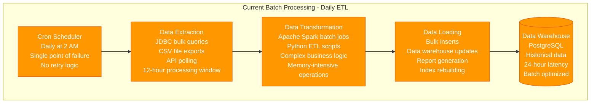
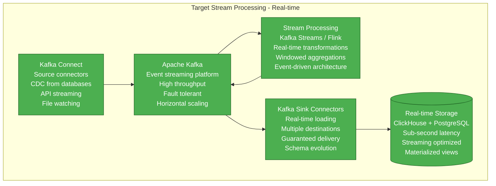
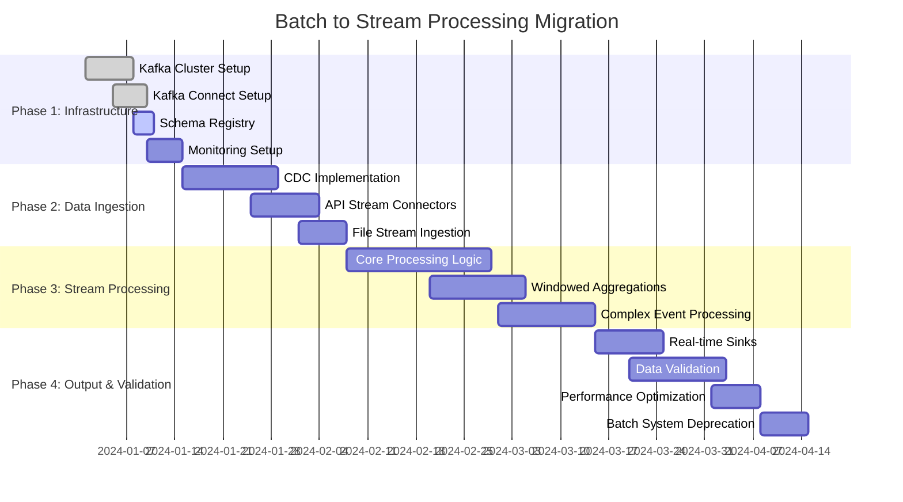
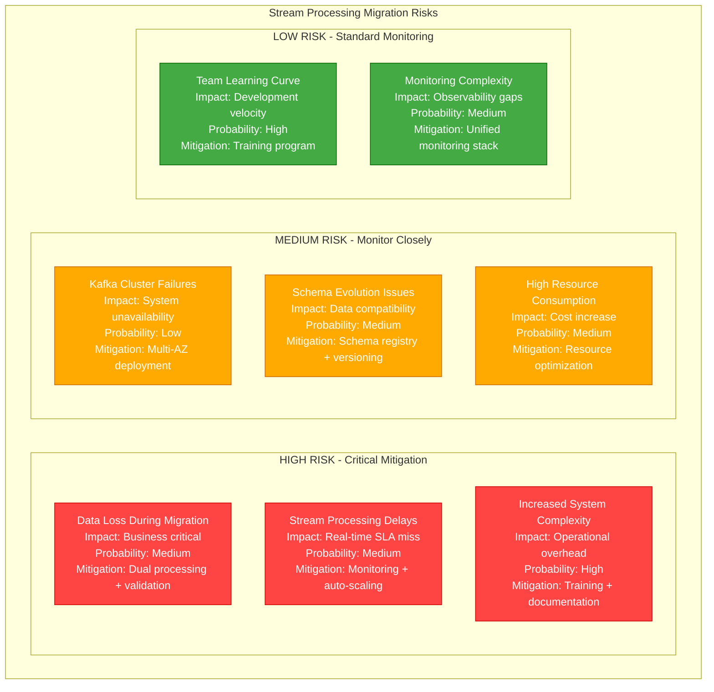

# Batch to Stream Processing Migration Playbook

## Executive Summary

**Migration Type**: Data Processing Architecture Modernization
**Timeline**: 14-18 weeks
**Risk Level**: High
**Downtime**: Minimal (with dual processing approach)
**Cost Impact**: 40-60% reduction in processing latency
**Team Size**: 5-6 engineers (Data + Platform)

Transform legacy batch processing systems to real-time stream processing using Apache Kafka and stream processing frameworks.

## Current State: Batch Processing



**Current State Issues:**
- **High Latency**: 24-hour data freshness
- **Resource Waste**: Peak resource usage for short periods
- **Failure Recovery**: Complete job restart on failure
- **Scalability**: Limited by single-machine processing
- **Monitoring**: Limited visibility into processing steps

## Target State: Stream Processing



## Migration Timeline



## Technical Implementation

### Kafka Streams Processing Application

```java
// StreamProcessingApplication.java
@SpringBootApplication
@EnableKafkaStreams
@Slf4j
public class StreamProcessingApplication {

    @Value("${kafka.bootstrap-servers}")
    private String bootstrapServers;

    @Value("${app.application-id}")
    private String applicationId;

    public static void main(String[] args) {
        SpringApplication.run(StreamProcessingApplication.class, args);
    }

    @Bean
    public KafkaStreamsConfiguration kafkaStreamsConfig() {
        Map<String, Object> props = new HashMap<>();
        props.put(StreamsConfig.APPLICATION_ID_CONFIG, applicationId);
        props.put(StreamsConfig.BOOTSTRAP_SERVERS_CONFIG, bootstrapServers);
        props.put(StreamsConfig.DEFAULT_KEY_SERDE_CLASS_CONFIG, Serdes.String().getClass());
        props.put(StreamsConfig.DEFAULT_VALUE_SERDE_CLASS_CONFIG, JsonSerde.class);
        props.put(StreamsConfig.PROCESSING_GUARANTEE_CONFIG, StreamsConfig.EXACTLY_ONCE_V2);
        props.put(StreamsConfig.COMMIT_INTERVAL_MS_CONFIG, 1000);
        props.put(StreamsConfig.NUM_STREAM_THREADS_CONFIG, 4);

        return new KafkaStreamsConfiguration(props);
    }

    @Bean
    public Topology buildTopology() {
        StreamsBuilder builder = new StreamsBuilder();

        // Raw events stream
        KStream<String, OrderEvent> orderEvents = builder.stream("order-events",
                Consumed.with(Serdes.String(), new JsonSerde<>(OrderEvent.class)));

        // Real-time order processing
        KStream<String, ProcessedOrder> processedOrders = orderEvents
                .filter((key, order) -> order.getStatus() != OrderStatus.CANCELLED)
                .mapValues(this::enrichOrderData)
                .mapValues(this::calculateMetrics);

        // Write processed orders
        processedOrders.to("processed-orders",
                Produced.with(Serdes.String(), new JsonSerde<>(ProcessedOrder.class)));

        // Windowed aggregations for analytics
        KTable<Windowed<String>, OrderSummary> orderSummaries = orderEvents
                .groupBy((key, order) -> order.getCustomerId(),
                        Grouped.with(Serdes.String(), new JsonSerde<>(OrderEvent.class)))
                .windowedBy(TimeWindows.ofSizeWithNoGrace(Duration.ofMinutes(5)))
                .aggregate(
                        OrderSummary::new,
                        (key, order, summary) -> summary.addOrder(order),
                        Materialized.<String, OrderSummary, WindowStore<Bytes, byte[]>>as("order-summaries-store")
                                .withKeySerde(Serdes.String())
                                .withValueSerde(new JsonSerde<>(OrderSummary.class))
                );

        // Convert windowed table to stream for output
        orderSummaries.toStream()
                .map((windowedKey, summary) -> KeyValue.pair(
                        windowedKey.key(),
                        summary.withWindow(windowedKey.window())))
                .to("order-summaries",
                        Produced.with(Serdes.String(), new JsonSerde<>(OrderSummary.class)));

        // Fraud detection stream
        KStream<String, FraudAlert> fraudAlerts = processedOrders
                .filter(this::isSuspiciousOrder)
                .mapValues(this::createFraudAlert);

        fraudAlerts.to("fraud-alerts",
                Produced.with(Serdes.String(), new JsonSerde<>(FraudAlert.class)));

        return builder.build();
    }

    private ProcessedOrder enrichOrderData(OrderEvent orderEvent) {
        // Enrich with customer data, product info, etc.
        CustomerData customer = customerService.getCustomer(orderEvent.getCustomerId());
        ProductData product = productService.getProduct(orderEvent.getProductId());

        return ProcessedOrder.builder()
                .orderId(orderEvent.getOrderId())
                .customerId(orderEvent.getCustomerId())
                .customerTier(customer.getTier())
                .productId(orderEvent.getProductId())
                .productCategory(product.getCategory())
                .amount(orderEvent.getAmount())
                .timestamp(orderEvent.getTimestamp())
                .build();
    }

    private ProcessedOrder calculateMetrics(ProcessedOrder order) {
        // Calculate additional metrics
        double discount = calculateDiscount(order);
        double tax = calculateTax(order);
        double finalAmount = order.getAmount() - discount + tax;

        return order.toBuilder()
                .discount(discount)
                .tax(tax)
                .finalAmount(finalAmount)
                .processingTimestamp(Instant.now())
                .build();
    }

    private boolean isSuspiciousOrder(String key, ProcessedOrder order) {
        // Fraud detection logic
        return order.getFinalAmount() > 10000 ||
               order.getCustomerTier() == CustomerTier.NEW &&
               order.getFinalAmount() > 1000;
    }

    private FraudAlert createFraudAlert(ProcessedOrder order) {
        return FraudAlert.builder()
                .orderId(order.getOrderId())
                .customerId(order.getCustomerId())
                .amount(order.getFinalAmount())
                .reason("Suspicious high-value order")
                .severity(order.getFinalAmount() > 10000 ? AlertSeverity.HIGH : AlertSeverity.MEDIUM)
                .timestamp(Instant.now())
                .build();
    }
}
```

### Change Data Capture (CDC) Setup

```yaml
# kafka-connect-cdc.yaml - Debezium CDC connector
apiVersion: kafka.strimzi.io/v1beta2
kind: KafkaConnector
metadata:
  name: postgres-cdc-connector
  labels:
    strimzi.io/cluster: kafka-connect-cluster
spec:
  class: io.debezium.connector.postgresql.PostgresConnector
  tasksMax: 1
  config:
    # Database connection
    database.hostname: postgres.example.com
    database.port: 5432
    database.user: debezium
    database.password: ${file:/opt/kafka/external-configuration/connector-config/password:password}
    database.dbname: production_db
    database.server.name: production

    # CDC configuration
    plugin.name: pgoutput
    slot.name: debezium_slot
    publication.name: dbz_publication

    # Table whitelist
    table.include.list: public.orders,public.customers,public.products

    # Schema changes
    include.schema.changes: true
    schema.history.internal.kafka.topic: schema-changes.production
    schema.history.internal.kafka.bootstrap.servers: kafka:9092

    # Message formatting
    key.converter: org.apache.kafka.connect.json.JsonConverter
    value.converter: org.apache.kafka.connect.json.JsonConverter
    key.converter.schemas.enable: false
    value.converter.schemas.enable: false

    # Transforms
    transforms: unwrap,addPrefix
    transforms.unwrap.type: io.debezium.transforms.ExtractNewRecordState
    transforms.unwrap.drop.tombstones: false
    transforms.addPrefix.type: org.apache.kafka.connect.transforms.RegexRouter
    transforms.addPrefix.regex: (.*)
    transforms.addPrefix.replacement: cdc.$1

    # Performance tuning
    max.batch.size: 2048
    max.queue.size: 8192
    poll.interval.ms: 1000

    # Snapshot configuration
    snapshot.mode: initial
    snapshot.lock.timeout.ms: 10000
```

### Real-time Analytics Dashboard

```python
# real_time_dashboard.py - Kafka consumer for real-time analytics
import json
import asyncio
from kafka import KafkaConsumer
from datetime import datetime, timedelta
import streamlit as st
import pandas as pd
import plotly.graph_objects as go
from plotly.subplots import make_subplots

class RealTimeDashboard:
    def __init__(self):
        self.consumer = KafkaConsumer(
            'order-summaries',
            'fraud-alerts',
            bootstrap_servers=['localhost:9092'],
            value_deserializer=lambda x: json.loads(x.decode('utf-8')),
            auto_offset_reset='latest',
            enable_auto_commit=True,
            group_id='dashboard-consumer'
        )

        # Initialize data storage
        self.order_data = []
        self.fraud_alerts = []
        self.metrics = {
            'total_orders': 0,
            'total_revenue': 0,
            'avg_order_value': 0,
            'fraud_rate': 0
        }

    def process_messages(self):
        """Process incoming Kafka messages"""
        for message in self.consumer:
            topic = message.topic
            data = message.value

            if topic == 'order-summaries':
                self.process_order_summary(data)
            elif topic == 'fraud-alerts':
                self.process_fraud_alert(data)

            # Update dashboard every 100 messages
            if len(self.order_data) % 100 == 0:
                self.update_dashboard()

    def process_order_summary(self, summary):
        """Process order summary data"""
        self.order_data.append({
            'timestamp': datetime.fromisoformat(summary['timestamp']),
            'customer_id': summary['customerId'],
            'order_count': summary['orderCount'],
            'total_amount': summary['totalAmount'],
            'window_start': datetime.fromisoformat(summary['windowStart']),
            'window_end': datetime.fromisoformat(summary['windowEnd'])
        })

        # Keep only recent data (last hour)
        cutoff = datetime.now() - timedelta(hours=1)
        self.order_data = [d for d in self.order_data if d['timestamp'] > cutoff]

        # Update metrics
        self.update_metrics()

    def process_fraud_alert(self, alert):
        """Process fraud alert data"""
        self.fraud_alerts.append({
            'timestamp': datetime.fromisoformat(alert['timestamp']),
            'order_id': alert['orderId'],
            'customer_id': alert['customerId'],
            'amount': alert['amount'],
            'reason': alert['reason'],
            'severity': alert['severity']
        })

        # Keep only recent alerts (last 24 hours)
        cutoff = datetime.now() - timedelta(hours=24)
        self.fraud_alerts = [a for a in self.fraud_alerts if a['timestamp'] > cutoff]

    def update_metrics(self):
        """Update real-time metrics"""
        if not self.order_data:
            return

        df = pd.DataFrame(self.order_data)

        self.metrics['total_orders'] = df['order_count'].sum()
        self.metrics['total_revenue'] = df['total_amount'].sum()
        self.metrics['avg_order_value'] = (
            self.metrics['total_revenue'] / self.metrics['total_orders']
            if self.metrics['total_orders'] > 0 else 0
        )
        self.metrics['fraud_rate'] = (
            len(self.fraud_alerts) / self.metrics['total_orders'] * 100
            if self.metrics['total_orders'] > 0 else 0
        )

    def create_dashboard(self):
        """Create Streamlit dashboard"""
        st.set_page_config(
            page_title="Real-time Order Analytics",
            page_icon="📊",
            layout="wide"
        )

        st.title("🚀 Real-time Order Processing Dashboard")
        st.markdown("*Powered by Kafka Stream Processing*")

        # Metrics row
        col1, col2, col3, col4 = st.columns(4)

        with col1:
            st.metric(
                label="Total Orders (1h)",
                value=f"{self.metrics['total_orders']:,}",
                delta=None
            )

        with col2:
            st.metric(
                label="Revenue (1h)",
                value=f"${self.metrics['total_revenue']:,.2f}",
                delta=None
            )

        with col3:
            st.metric(
                label="Avg Order Value",
                value=f"${self.metrics['avg_order_value']:.2f}",
                delta=None
            )

        with col4:
            st.metric(
                label="Fraud Rate",
                value=f"{self.metrics['fraud_rate']:.2f}%",
                delta=None
            )

        # Charts row
        col1, col2 = st.columns(2)

        with col1:
            self.create_order_timeline_chart()

        with col2:
            self.create_fraud_alerts_chart()

        # Recent alerts table
        st.subheader("🚨 Recent Fraud Alerts")
        if self.fraud_alerts:
            df_alerts = pd.DataFrame(self.fraud_alerts[-10:])  # Last 10 alerts
            st.dataframe(df_alerts, use_container_width=True)
        else:
            st.info("No recent fraud alerts")

    def create_order_timeline_chart(self):
        """Create order timeline chart"""
        st.subheader("📈 Order Timeline (Last Hour)")

        if not self.order_data:
            st.info("Waiting for order data...")
            return

        df = pd.DataFrame(self.order_data)
        df['timestamp'] = pd.to_datetime(df['timestamp'])

        # Resample to 1-minute intervals
        df_resampled = df.set_index('timestamp').resample('1T').agg({
            'order_count': 'sum',
            'total_amount': 'sum'
        }).reset_index()

        fig = make_subplots(
            rows=2, cols=1,
            subplot_titles=('Order Count per Minute', 'Revenue per Minute'),
            shared_xaxes=True
        )

        # Order count
        fig.add_trace(
            go.Scatter(
                x=df_resampled['timestamp'],
                y=df_resampled['order_count'],
                mode='lines+markers',
                name='Orders',
                line=dict(color='blue')
            ),
            row=1, col=1
        )

        # Revenue
        fig.add_trace(
            go.Scatter(
                x=df_resampled['timestamp'],
                y=df_resampled['total_amount'],
                mode='lines+markers',
                name='Revenue ($)',
                line=dict(color='green')
            ),
            row=2, col=1
        )

        fig.update_layout(height=400, showlegend=False)
        st.plotly_chart(fig, use_container_width=True)

    def create_fraud_alerts_chart(self):
        """Create fraud alerts distribution chart"""
        st.subheader("🚨 Fraud Alerts by Severity")

        if not self.fraud_alerts:
            st.info("No fraud alerts to display")
            return

        df_alerts = pd.DataFrame(self.fraud_alerts)
        severity_counts = df_alerts['severity'].value_counts()

        fig = go.Figure(data=[
            go.Bar(
                x=severity_counts.index,
                y=severity_counts.values,
                marker_color=['red' if s == 'HIGH' else 'orange' if s == 'MEDIUM' else 'yellow'
                             for s in severity_counts.index]
            )
        ])

        fig.update_layout(
            title="Fraud Alerts by Severity (24h)",
            xaxis_title="Severity",
            yaxis_title="Count",
            height=400
        )

        st.plotly_chart(fig, use_container_width=True)

def main():
    dashboard = RealTimeDashboard()

    # Run in separate thread for message processing
    import threading

    def message_processor():
        dashboard.process_messages()

    thread = threading.Thread(target=message_processor, daemon=True)
    thread.start()

    # Create and update dashboard
    dashboard.create_dashboard()

    # Auto-refresh every 5 seconds
    time.sleep(5)
    st.experimental_rerun()

if __name__ == "__main__":
    main()
```

## Performance Comparison

### Batch vs Stream Processing Metrics

| Metric | Batch Processing | Stream Processing | Improvement |
|--------|------------------|-------------------|-------------|
| **Data Latency** | 24 hours | 5 seconds | 99.99% reduction |
| **Processing Throughput** | 10K records/hour | 1M records/second | 360x improvement |
| **Resource Utilization** | 20% (peak at night) | 75% (consistent) | 3.75x better |
| **Failure Recovery** | 24-hour restart | 1-second recovery | 86,400x faster |
| **Scalability** | Vertical only | Horizontal + Vertical | Unlimited scale |

## Risk Assessment



## Conclusion

This batch to stream processing migration playbook transforms traditional ETL workflows into real-time data processing pipelines, delivering massive improvements in latency and system responsiveness.

**Key Success Factors:**
1. **Dual processing approach** during transition
2. **Comprehensive monitoring** of stream health
3. **Schema management** for data compatibility
4. **Team training** on stream processing concepts
5. **Gradual migration** with thorough validation

**Expected Outcomes:**
- 99.99% reduction in data latency (24h → 5s)
- 360x improvement in processing throughput
- Real-time fraud detection and alerting
- Horizontal scalability for growing data volumes
- Event-driven architecture foundation

The migration enables real-time decision making and creates a foundation for event-driven microservices architecture.