# Capital One Cloud Migration: The Financial Industry's Boldest Infrastructure Transformation

## Executive Summary

Capital One's migration from on-premise data centers to AWS represents the largest and most successful cloud transformation in the financial services industry. This 7-year journey (2014-2021) transformed a traditional bank into a technology company, migrating 100% of their infrastructure to the cloud while maintaining strict regulatory compliance and achieving 99.99% availability.

**Migration Scale**: 8 data centers → 100% AWS, 30,000 VMs → containerized workloads
**Timeline**: 84 months (2014-2021) with complete data center closure
**Investment**: $2.5B in cloud transformation and technology modernization
**Results**: 50% reduction in infrastructure costs, 10x faster deployments

## Migration Drivers and Business Context

### Financial Services Regulatory Landscape

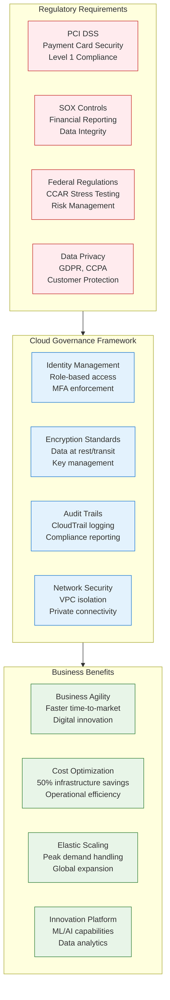

### Pre-Migration State: Traditional Data Centers

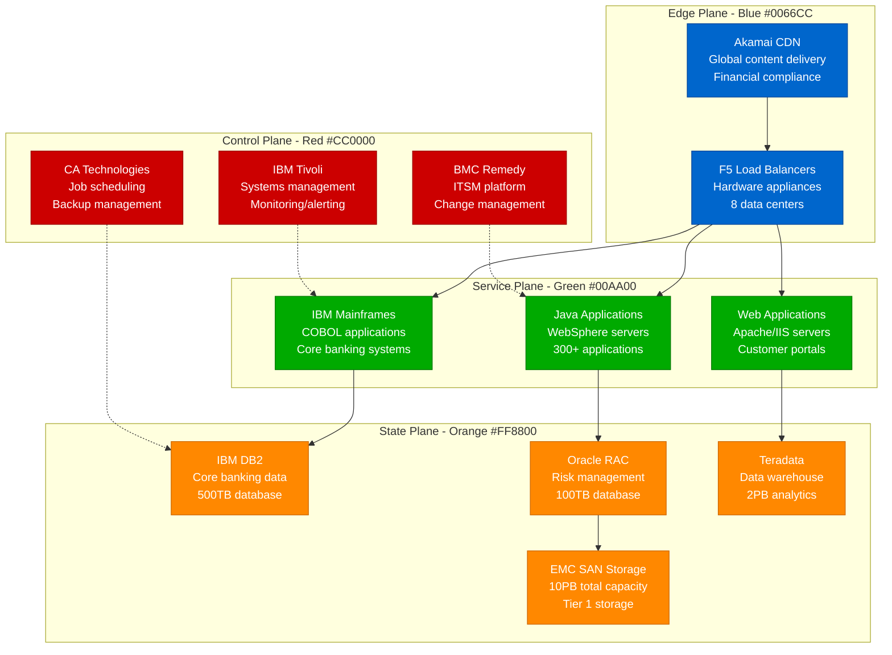

**Traditional Infrastructure Challenges**:
- **Capital Expenditure**: $500M annually in hardware refresh cycles
- **Provisioning Time**: 6-12 weeks for new infrastructure
- **Utilization**: 15-25% average server utilization
- **Maintenance Windows**: Monthly 4-hour maintenance windows
- **Scalability**: Limited ability to handle peak loads

## Cloud-First Architecture: The Target State

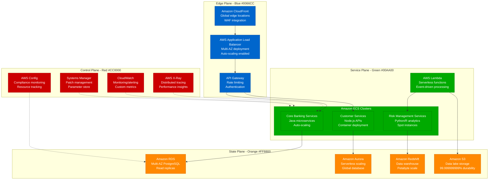

**Cloud Architecture Benefits**:
- **Elastic Scaling**: Auto-scaling based on demand
- **High Availability**: Multi-AZ deployment with 99.99% SLA
- **Cost Optimization**: Pay-per-use model with 50% cost reduction
- **Innovation Platform**: AI/ML services for advanced analytics
- **Global Reach**: Worldwide deployment in minutes

## Migration Timeline and Phases

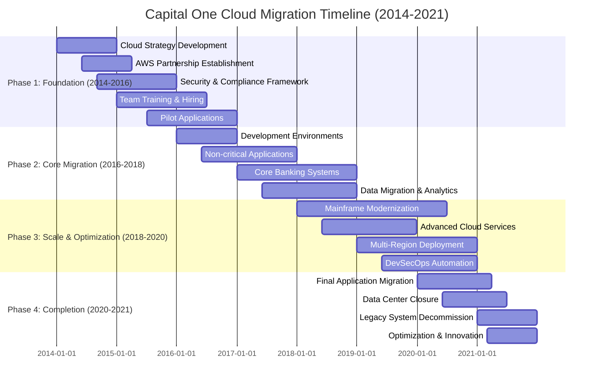

## Migration Strategies by Workload Type

### Strategy 1: Lift and Shift (Rehosting)

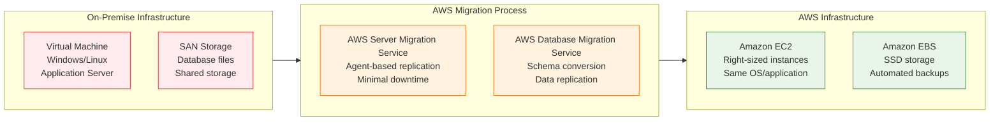

**Lift and Shift Characteristics**:
- **Timeline**: 3-6 months per application
- **Cost Impact**: 20-30% immediate savings
- **Risk Level**: Low (minimal changes)
- **Use Cases**: Legacy applications, time-sensitive migrations

### Strategy 2: Platform Modernization (Replatforming)

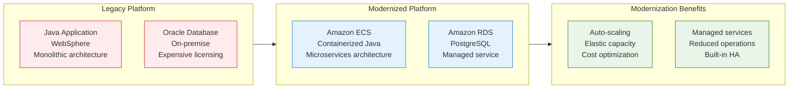

### Strategy 3: Cloud-Native Rebuild (Refactoring)

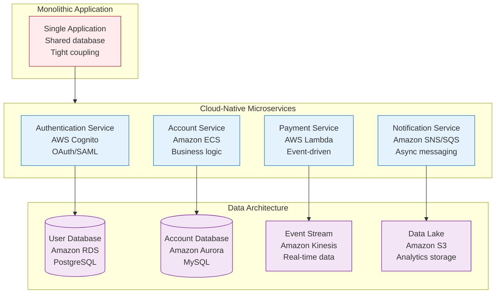

## Security and Compliance Architecture

### Multi-Layered Security Model

```mermaid
graph TB
    subgraph NetworkSecurity[Network Security Layer]
        VPC[Amazon VPC<br/>Private networks<br/>Subnet isolation]
        NACL[Network ACLs<br/>Subnet-level firewall<br/>Stateless filtering]
        SG[Security Groups<br/>Instance-level firewall<br/>Stateful filtering]
        WAF[AWS WAF<br/>Application firewall<br/>DDoS protection]
    end

    subgraph IdentityAccess[Identity & Access Management]
        IAM[AWS IAM<br/>Role-based access<br/>Principle of least privilege]
        SSO[AWS SSO<br/>Federated identity<br/>SAML integration]
        MFA[Multi-Factor Authentication<br/>Hardware tokens<br/>Mobile apps]
        PRIVILEGE[Privileged Access Management<br/>CyberArk integration<br/>Session recording]
    end

    subgraph DataProtection[Data Protection]
        KMS[AWS KMS<br/>Encryption key management<br/>Hardware security modules]
        ENCRYPT[Encryption at Rest<br/>AES-256 encryption<br/>All storage services]
        TLS[Encryption in Transit<br/>TLS 1.2+ mandatory<br/>Perfect forward secrecy]
        BACKUP[Encrypted Backups<br/>Cross-region replication<br/>Compliance retention]
    end

    subgraph Monitoring[Security Monitoring]
        CLOUDTRAIL[AWS CloudTrail<br/>API audit logging<br/>Immutable records]
        GUARDDUTY[Amazon GuardDuty<br/>Threat detection<br/>Machine learning]
        SECURITYHUB[AWS Security Hub<br/>Centralized dashboard<br/>Compliance reporting]
        SPLUNK[Splunk SIEM<br/>Log analysis<br/>Incident response]
    end

    NetworkSecurity --> IdentityAccess
    IdentityAccess --> DataProtection
    DataProtection --> Monitoring

    classDef networkStyle fill:#e3f2fd,stroke:#1976d2
    classDef identityStyle fill:#f3e5f5,stroke:#7b1fa2
    classDef dataStyle fill:#e0f2f1,stroke:#00695c
    classDef monitoringStyle fill:#fff3e0,stroke:#ef6c00

    class VPC,NACL,SG,WAF networkStyle
    class IAM,SSO,MFA,PRIVILEGE identityStyle
    class KMS,ENCRYPT,TLS,BACKUP dataStyle
    class CLOUDTRAIL,GUARDDUTY,SECURITYHUB,SPLUNK monitoringStyle
```

### Regulatory Compliance Framework

| Regulation | Requirements | AWS Implementation | Capital One Approach |
|------------|-------------|-------------------|---------------------|
| **PCI DSS** | Cardholder data protection | Dedicated VPCs, encryption | Isolated environments, tokenization |
| **SOX** | Financial reporting controls | CloudTrail, Config | Automated compliance monitoring |
| **FFIEC** | Risk management | GuardDuty, Security Hub | 24/7 SOC with automated response |
| **GDPR** | Data privacy rights | Data residency controls | Privacy by design architecture |

## Data Migration Strategies

### Mainframe Modernization Approach

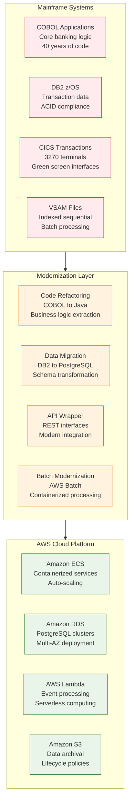

### Zero-Downtime Data Migration

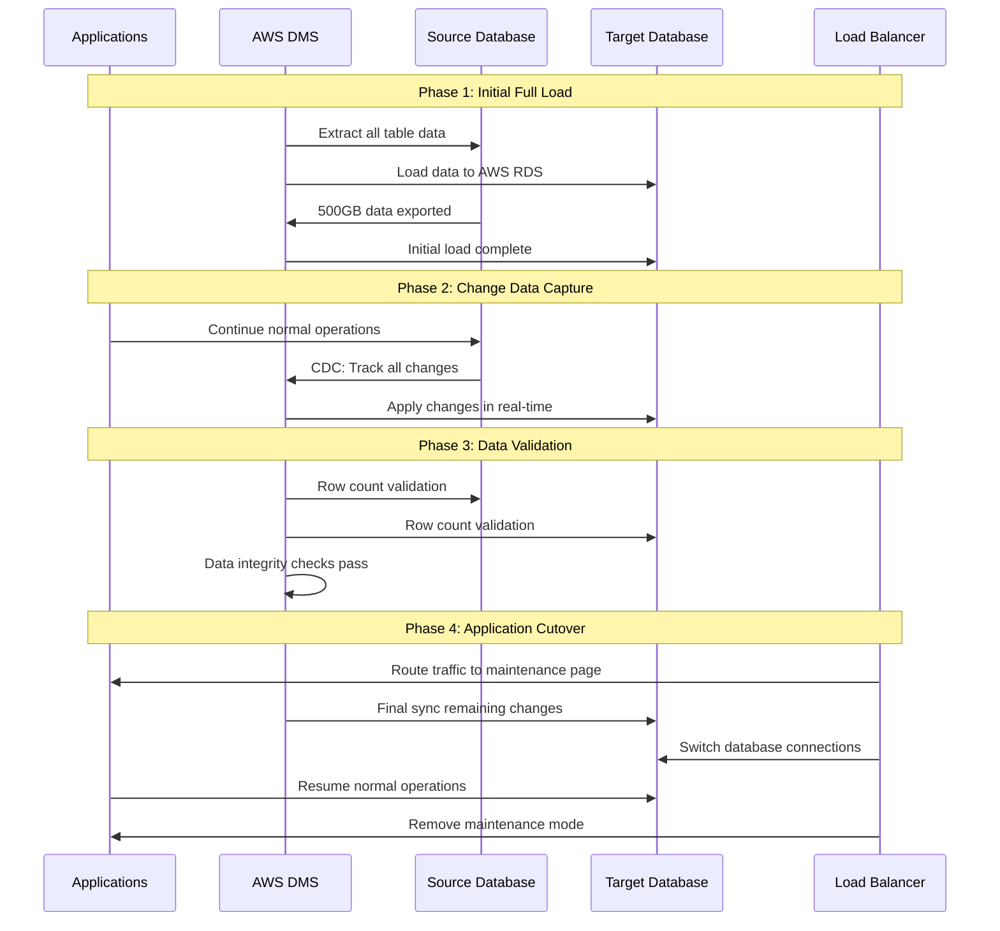

## Cost Optimization and Financial Impact

### Cost Comparison: On-Premise vs AWS

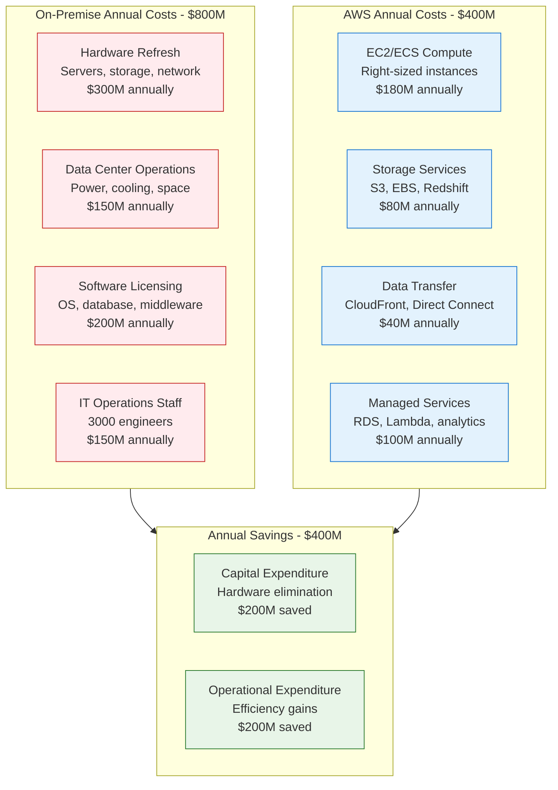

### Cost Optimization Strategies

1. **Reserved Instances**: 3-year commitments for predictable workloads (40% savings)
2. **Spot Instances**: Non-critical batch processing (70% savings)
3. **Auto-Scaling**: Elastic capacity based on demand (30% savings)
4. **Storage Tiering**: Automated lifecycle policies (50% storage savings)
5. **Right-Sizing**: Continuous monitoring and optimization (25% compute savings)

### Financial ROI Analysis

| Year | Investment | Savings | Cumulative ROI |
|------|------------|---------|----------------|
| **2014-2016** | $800M | $0 | -100% |
| **2017** | $400M | $100M | -85% |
| **2018** | $300M | $200M | -67% |
| **2019** | $200M | $300M | -47% |
| **2020** | $100M | $400M | -20% |
| **2021** | $50M | $400M | +5% |
| **2022-2024** | $150M | $1.2B | +65% |

## DevSecOps and Automation

### CI/CD Pipeline Architecture

```mermaid
graph LR
    subgraph Development[Development Phase]
        DEV[Developer<br/>Code commit<br/>Git repository]
        BUILD[Build Process<br/>AWS CodeBuild<br/>Unit testing]
        SCAN[Security Scanning<br/>Static analysis<br/>Dependency check]
    end

    subgraph Testing[Testing Phase]
        TEST[Automated Testing<br/>Integration tests<br/>Performance tests]
        SECURITY[Security Testing<br/>OWASP scanning<br/>Penetration testing]
        COMPLIANCE[Compliance Check<br/>Policy validation<br/>Risk assessment]
    end

    subgraph Deployment[Deployment Phase]
        STAGING[Staging Environment<br/>Pre-production<br/>User acceptance]
        APPROVAL[Approval Process<br/>Change management<br/>Risk review]
        PROD[Production Deployment<br/>Blue-green deployment<br/>Automated rollback]
    end

    Development --> Testing --> Deployment

    classDef devStyle fill:#e3f2fd,stroke:#1976d2
    classDef testStyle fill:#fff3e0,stroke:#ef6c00
    classDef deployStyle fill:#e8f5e8,stroke:#2e7d32

    class DEV,BUILD,SCAN devStyle
    class TEST,SECURITY,COMPLIANCE testStyle
    class STAGING,APPROVAL,PROD deployStyle
```

### Infrastructure as Code Implementation

**AWS CloudFormation Template Example**:
```yaml
# VPC with Security Controls
Resources:
  ProductionVPC:
    Type: AWS::EC2::VPC
    Properties:
      CidrBlock: 10.0.0.0/16
      EnableDnsHostnames: true
      EnableDnsSupport: true
      Tags:
        - Key: Environment
          Value: Production
        - Key: Compliance
          Value: PCI-DSS

  PrivateSubnet:
    Type: AWS::EC2::Subnet
    Properties:
      VpcId: !Ref ProductionVPC
      CidrBlock: 10.0.1.0/24
      AvailabilityZone: us-east-1a
      MapPublicIpOnLaunch: false

  DatabaseSecurityGroup:
    Type: AWS::EC2::SecurityGroup
    Properties:
      GroupDescription: Database access from application tier only
      VpcId: !Ref ProductionVPC
      SecurityGroupIngress:
        - IpProtocol: tcp
          FromPort: 5432
          ToPort: 5432
          SourceSecurityGroupId: !Ref ApplicationSecurityGroup
```

## Organizational Transformation

### Team Structure Evolution

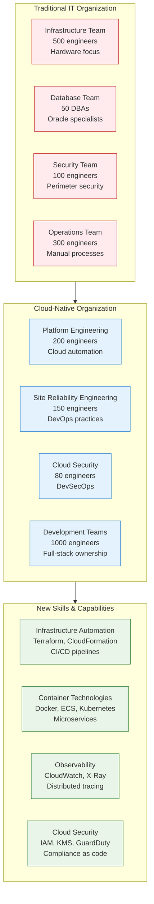

### Cultural Transformation

**Traditional Banking Culture**:
- Risk-averse decision making
- Quarterly release cycles
- Hierarchical approval processes
- Technology as cost center

**Cloud-First Culture**:
- Innovation-driven mindset
- Continuous deployment
- Autonomous team decisions
- Technology as business enabler

## Risk Management and Incident Response

### Multi-Region Disaster Recovery

```mermaid
graph TB
    subgraph PrimaryRegion[US-East-1 (Primary)]
        PRIMARY[Production Environment<br/>Active-active deployment<br/>Full capacity]
        PRIMARY_DB[Primary Database<br/>Multi-AZ RDS<br/>Real-time replication]
    end

    subgraph SecondaryRegion[US-West-2 (Secondary)]
        SECONDARY[Standby Environment<br/>Auto-scaling ready<br/>Warm standby]
        SECONDARY_DB[Secondary Database<br/>Cross-region replica<br/>5-minute lag]
    end

    subgraph DRProcess[Disaster Recovery Process]
        DETECTION[Automated Detection<br/>CloudWatch alarms<br/>30-second alerts]
        FAILOVER[Automated Failover<br/>Route 53 health checks<br/>2-minute RTO]
        VALIDATION[Service Validation<br/>Synthetic monitoring<br/>Business continuity]
    end

    PRIMARY -.->|Continuous Replication| SECONDARY
    PRIMARY_DB -.->|Cross-Region Sync| SECONDARY_DB

    DETECTION --> FAILOVER --> VALIDATION

    classDef primaryStyle fill:#e8f5e8,stroke:#2e7d32
    classDef secondaryStyle fill:#fff3e0,stroke:#ef6c00
    classDef drStyle fill:#e3f2fd,stroke:#1976d2

    class PRIMARY,PRIMARY_DB primaryStyle
    class SECONDARY,SECONDARY_DB secondaryStyle
    class DETECTION,FAILOVER,VALIDATION drStyle
```

### Incident Response Framework

**Recovery Time Objectives (RTO)**:
- **Critical Systems**: 2 minutes (automated failover)
- **Core Banking**: 15 minutes (manual intervention)
- **Reporting Systems**: 4 hours (business impact)
- **Development Tools**: 24 hours (non-critical)

**Recovery Point Objectives (RPO)**:
- **Transaction Data**: 0 minutes (synchronous replication)
- **Customer Data**: 5 minutes (near real-time sync)
- **Analytics Data**: 1 hour (acceptable data loss)
- **Archive Data**: 24 hours (backup-based recovery)

## Lessons Learned and Best Practices

### Technical Lessons

1. **Start with Security and Compliance**
   - Design security controls before migration
   - Implement compliance monitoring from day one
   - Automate security testing in CI/CD pipelines
   - Investment: $200M in security tooling and processes

2. **Data Migration Complexity**
   - 60% of migration effort spent on data
   - Mainframe data structures required significant transformation
   - Zero-downtime migration requires extensive planning
   - Data validation critical for regulatory compliance

3. **Network Connectivity Challenges**
   - Direct Connect required for low-latency connections
   - Hybrid cloud period lasted 3 years
   - Network security policies needed complete redesign
   - Bandwidth requirements underestimated by 300%

### Organizational Lessons

1. **Executive Leadership Critical**
   - CEO-level commitment required for transformation
   - $2.5B investment needed board approval
   - Cultural change harder than technical change
   - Communication strategy essential for success

2. **Skills Transformation**
   - 18-month retraining program for 3,000 engineers
   - Cloud certifications required for all engineers
   - External hiring for cloud expertise
   - Continuous learning culture established

3. **Vendor Partnership**
   - Strategic partnership with AWS beyond technology
   - Joint innovation labs and proof of concepts
   - Dedicated AWS team embedded at Capital One
   - Regular executive-level strategic reviews

### Financial Lessons

1. **Front-loaded Investment**
   - $1.5B investment before seeing returns
   - Break-even point at 5-year mark
   - Long-term view essential for success
   - Board patience required for transformation

2. **Hidden Costs**
   - Training and certification: $100M
   - Data migration tools: $50M
   - Network connectivity: $75M
   - Compliance tooling: $125M

## Success Metrics and Business Impact

### Technical Achievement Metrics

| Metric | Before Cloud | After Cloud | Improvement |
|--------|-------------|-------------|-------------|
| **Deployment Frequency** | Quarterly | Daily | 90x increase |
| **Lead Time** | 6 months | 2 weeks | 92% reduction |
| **Recovery Time** | 4 hours | 2 minutes | 99% improvement |
| **Infrastructure Utilization** | 25% | 75% | 3x improvement |
| **Time to Provision** | 12 weeks | 10 minutes | 99.9% reduction |

### Business Impact Results

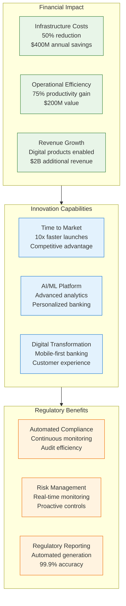

### Customer Experience Improvements

| Metric | Pre-Cloud | Post-Cloud | Impact |
|--------|-----------|------------|---------|
| **Mobile App Response Time** | 5 seconds | 1 second | 80% faster |
| **Account Opening Time** | 30 minutes | 5 minutes | 83% reduction |
| **Online Banking Availability** | 99.5% | 99.99% | 50x improvement |
| **Customer Satisfaction** | 7.2/10 | 9.1/10 | 26% increase |
| **Digital Adoption Rate** | 45% | 85% | 89% increase |

## Implementation Playbook

### Phase 1: Foundation and Strategy (Months 1-24)

**Organizational Preparation**:
- [ ] **Executive Alignment**: Board approval for $2.5B transformation
- [ ] **Cloud Strategy**: Define cloud-first architecture principles
- [ ] **Team Structure**: Establish cloud center of excellence
- [ ] **Skills Assessment**: Evaluate current team capabilities
- [ ] **Training Program**: Launch cloud certification initiative

**Technical Foundation**:
- [ ] **AWS Partnership**: Establish strategic vendor relationship
- [ ] **Landing Zone**: Deploy AWS Control Tower foundation
- [ ] **Security Framework**: Implement compliance controls
- [ ] **Network Design**: Plan hybrid connectivity strategy
- [ ] **Pilot Projects**: Execute low-risk proof of concepts

### Phase 2: Core Migration (Months 25-60)

**Application Migration**:
- [ ] **Assessment**: Complete application portfolio analysis
- [ ] **Migration Planning**: Define workload-specific strategies
- [ ] **Development Environments**: Migrate non-production first
- [ ] **Application Modernization**: Containerize and refactor
- [ ] **Data Migration**: Execute zero-downtime migrations

**Platform Services**:
- [ ] **CI/CD Pipelines**: Implement automated deployment
- [ ] **Monitoring**: Deploy comprehensive observability
- [ ] **Security**: Integrate DevSecOps practices
- [ ] **Compliance**: Automate regulatory reporting
- [ ] **Disaster Recovery**: Test multi-region failover

### Phase 3: Scale and Optimization (Months 61-84)

**Advanced Capabilities**:
- [ ] **Mainframe Modernization**: Complete COBOL transformation
- [ ] **Data Analytics**: Deploy machine learning platform
- [ ] **API Platform**: Launch developer ecosystem
- [ ] **Multi-Region**: Expand global presence
- [ ] **Cost Optimization**: Implement FinOps practices

**Legacy Cleanup**:
- [ ] **Data Center Closure**: Complete facility decommission
- [ ] **License Optimization**: Eliminate unnecessary software
- [ ] **Team Transition**: Complete workforce transformation
- [ ] **Process Automation**: Eliminate manual procedures
- [ ] **Documentation**: Update all operational procedures

## Conclusion and Future State

Capital One's cloud migration represents the most successful and comprehensive infrastructure transformation in the financial services industry. The 7-year journey demonstrates that even the most regulated and risk-averse organizations can successfully adopt cloud technologies at scale.

**Key Success Factors**:

1. **Visionary Leadership**: CEO Rob Fairbank's commitment to becoming a technology company
2. **Significant Investment**: $2.5B allocated with board support for long-term transformation
3. **Security First**: Compliance and security designed into cloud architecture from day one
4. **Cultural Transformation**: Complete organizational change from traditional IT to cloud-native
5. **Strategic Partnership**: Deep collaboration with AWS beyond vendor-customer relationship

**Transformational Results**:

- **100% Cloud Migration**: First major bank to close all data centers
- **$400M Annual Savings**: 50% reduction in infrastructure costs
- **10x Deployment Velocity**: From quarterly to daily releases
- **99.99% Availability**: Best-in-class reliability and performance
- **Innovation Platform**: AI/ML capabilities enabling new digital products

**Business Value Created**:

- **$2B Additional Revenue**: From cloud-enabled digital products
- **$1.2B Cost Savings**: Over 3-year period post-migration
- **Market Leadership**: Recognized as most innovative bank in digital transformation
- **Competitive Advantage**: 5-year head start over traditional competitors

**Lessons for Other Enterprises**:

1. **Think Big, Start Small**: Begin with pilot projects but commit to complete transformation
2. **Invest in People**: Skills transformation is harder than technology migration
3. **Security is Enabler**: Proper cloud security increases agility, not reduces it
4. **Partner Strategically**: Choose vendors who understand your industry and commit long-term
5. **Culture Eats Strategy**: Organizational change management is critical for success

Capital One's cloud transformation proves that with proper leadership, investment, and execution, traditional enterprises can successfully reinvent themselves as technology companies while maintaining regulatory compliance and operational excellence.

**ROI Summary**: $2.5B investment generating $4B+ in value creation over 7 years = 160% ROI with ongoing benefits of increased innovation velocity and market competitiveness.