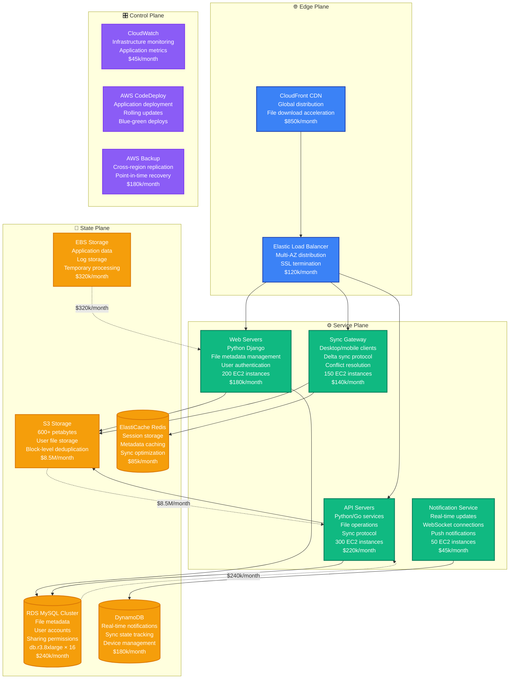
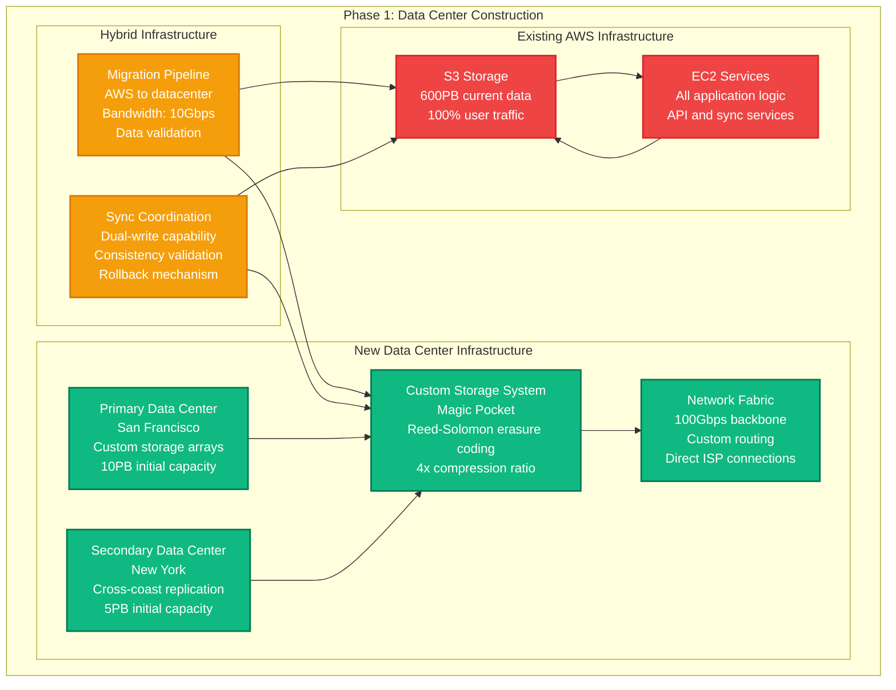
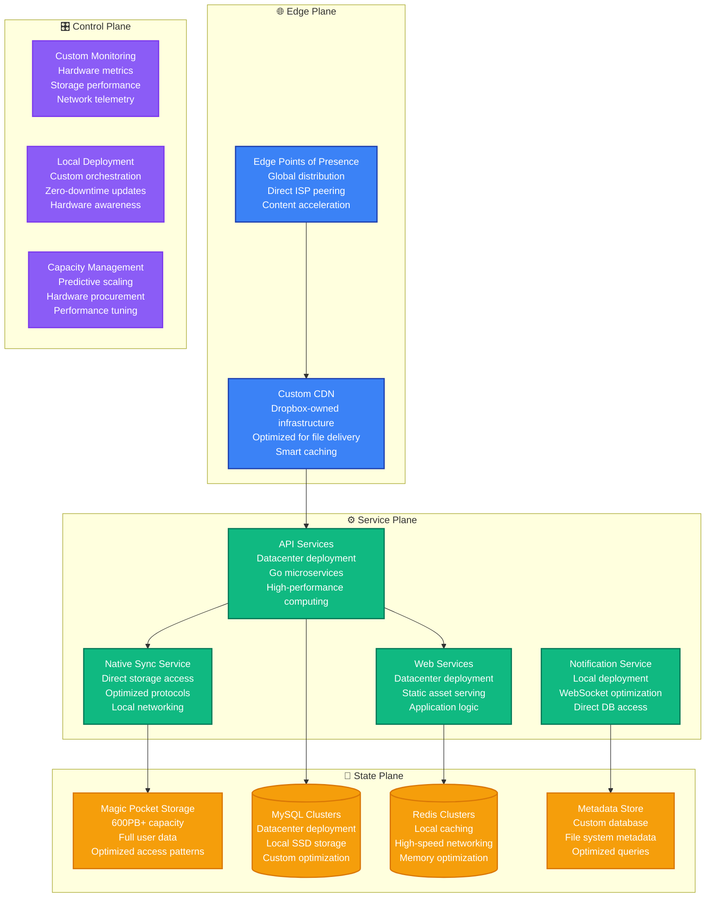
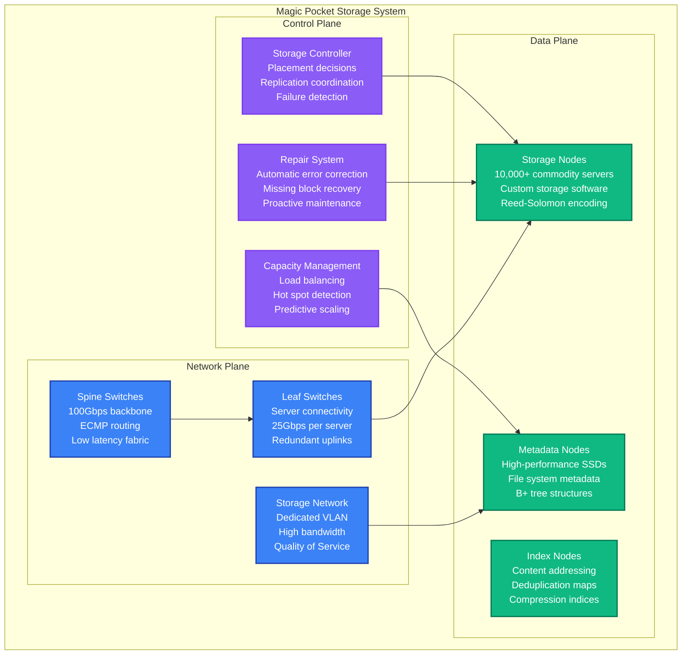
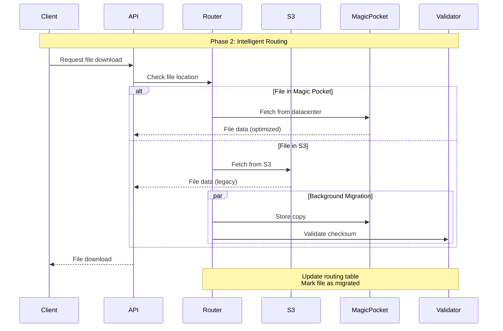
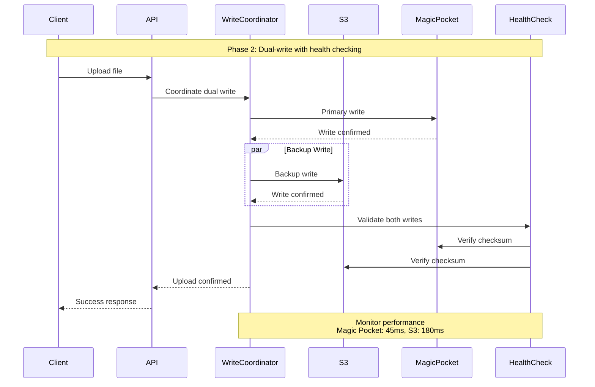
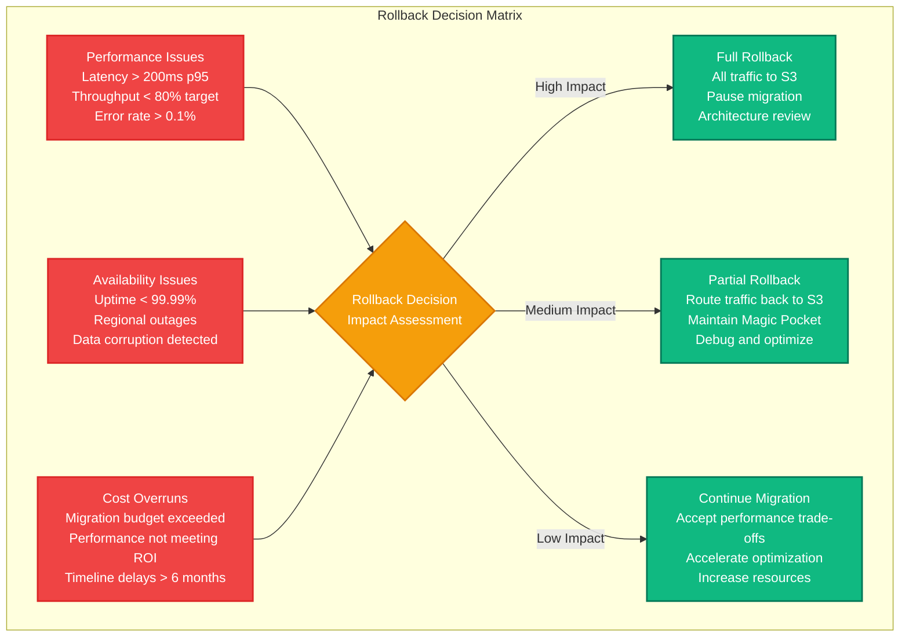

# Dropbox: AWS to Own Data Centers Migration

> **Project Exodus: The Great Cloud Repatriation**
>
> Timeline: 2014-2017 | Duration: 3 years | Team: 50+ engineers | Investment: $75M+
>
> Dropbox's migration of 600+ petabytes from AWS S3 to custom-built data centers, reducing costs by $75M+ annually while improving performance.

## Migration Overview

Dropbox's "Project Exodus" was one of the largest cloud repatriation projects in tech history. Moving from AWS S3 to self-managed infrastructure required building custom storage systems, networking, and data center operations from scratch while maintaining 99.99% availability for 500M+ users.

### Business Context
- **Problem**: AWS costs growing exponentially with storage needs
- **Scale**: 600+ petabytes of user data, growing 1PB+ monthly
- **Cost**: $200M+ annual AWS bill projected for 2017
- **Competition**: Need for better performance and cost control vs Google Drive, OneDrive

### Key Results
- **Cost Savings**: $75M+ annually in infrastructure costs
- **Performance**: 2x improvement in file upload/download speeds
- **Control**: Complete ownership of storage stack and data pipeline
- **Reliability**: Maintained 99.99% uptime during entire migration

## Before Architecture (2014): AWS-Native



### AWS Architecture Problems

**Cost Escalation:**
- S3 storage costs: $8.5M/month for 600PB, growing $1.4M/month
- Data transfer costs: $2M/month for user downloads/uploads
- EC2 instances: $585k/month for compute resources
- Total AWS bill: $12M+/month with 40% YoY growth

**Performance Limitations:**
- S3 API latency: p95 = 150ms, p99 = 800ms for metadata operations
- Data transfer: Throttled at 5Gbps per prefix during peak usage
- Multi-region replication: 15-30 minute delays
- Limited control over storage optimization

**Operational Constraints:**
- S3 eventual consistency causing sync conflicts
- Limited visibility into storage performance
- Dependency on AWS for capacity planning
- Regional availability tied to AWS infrastructure

**Technical Debt:**
- Block-level deduplication limited by S3 API constraints
- Custom storage optimizations not possible
- Limited control over data placement and replication
- Backup and disaster recovery tied to AWS services

## Migration Strategy: The Exodus Plan

### Phase 1: Data Center Build-out (12 months)
**Goal**: Construct custom data centers and storage infrastructure



**Phase 1 Deliverables:**
- Two fully operational data centers with redundant power/cooling
- Magic Pocket storage system with petabyte capacity
- High-speed network backbone with ISP peering
- Migration tooling and data validation systems

### Phase 2: Storage System Migration (18 months)
**Goal**: Migrate file storage while maintaining application layer on AWS

```mermaid
graph TB
    subgraph EdgePlane["🌐 Edge Plane"]
        CLOUDFRONT_HYBRID[CloudFront CDN<br/>Intelligent routing<br/>AWS + datacenter origins<br/>Performance optimization]

        GLOBAL_LB[Global Load Balancer<br/>GeoDNS routing<br/>Health check failover<br/>Latency optimization]
    end

    subgraph ServicePlane["⚙️ Service Plane"]
        API_AWS[API Services (AWS)<br/>Python/Go services<br/>File metadata<br/>User management<br/>Still on EC2]

        SYNC_PROXY[Sync Proxy Service<br/>Intelligent routing<br/>AWS ↔ Datacenter<br/>Performance monitoring]

        MIGRATION_WORKERS[Migration Workers<br/>Background data transfer<br/>Validation and checksums<br/>Progress tracking]
    end

    subgraph StatePlane["💾 State Plane"]
        S3_LEGACY[S3 Legacy Storage<br/>400PB remaining<br/>Read-only mode<br/>Migration source]

        MAGIC_POCKET[Magic Pocket Storage<br/>200PB migrated<br/>Primary storage<br/>Custom optimization]

        RDS_METADATA[(RDS MySQL<br/>File metadata<br/>Location tracking<br/>AWS → datacenter mapping)]

        REDIS_ROUTING[(Redis Cluster<br/>Routing decisions<br/>Performance metrics<br/>Migration state)]
    end

    subgraph ControlPlane["🎛️ Control Plane"]
        MIGRATION_MONITOR[Migration Monitoring<br/>Transfer progress<br/>Data validation<br/>Performance tracking]

        HEALTH_CHECKS[Health Monitoring<br/>End-to-end validation<br/>User impact tracking<br/>Automated rollback]
    end

    %% Traffic Flow
    CLOUDFRONT_HYBRID --> GLOBAL_LB
    GLOBAL_LB --> API_AWS
    API_AWS --> SYNC_PROXY

    %% Intelligent Routing
    SYNC_PROXY --> S3_LEGACY
    SYNC_PROXY --> MAGIC_POCKET
    SYNC_PROXY --> REDIS_ROUTING

    %% Migration Flow
    MIGRATION_WORKERS --> S3_LEGACY
    MIGRATION_WORKERS --> MAGIC_POCKET
    MIGRATION_WORKERS --> RDS_METADATA

    %% Apply Updated Tailwind Colors
    classDef edgeStyle fill:#3B82F6,stroke:#1E40AF,color:#fff,stroke-width:2px
    classDef serviceStyle fill:#10B981,stroke:#047857,color:#fff,stroke-width:2px
    classDef stateStyle fill:#F59E0B,stroke:#D97706,color:#fff,stroke-width:2px
    classDef controlStyle fill:#8B5CF6,stroke:#7C3AED,color:#fff,stroke-width:2px

    class CLOUDFRONT_HYBRID,GLOBAL_LB edgeStyle
    class API_AWS,SYNC_PROXY,MIGRATION_WORKERS serviceStyle
    class S3_LEGACY,MAGIC_POCKET,RDS_METADATA,REDIS_ROUTING stateStyle
    class MIGRATION_MONITOR,HEALTH_CHECKS controlStyle
```

### Phase 3: Application Migration (8 months)
**Goal**: Move application services to data centers



### Phase 4: AWS Sunset (4 months)
**Goal**: Complete AWS retirement and optimization

## After Architecture (2017): Self-Hosted Infrastructure

```mermaid
graph TB
    subgraph EdgePlane["🌐 Edge Plane"]
        GLOBAL_EDGE[Global Edge Network<br/>30+ PoPs worldwide<br/>Direct ISP peering<br/>Smart routing<br/>Sub-50ms global latency]

        SMART_CDN[Intelligent CDN<br/>ML-based caching<br/>Predictive prefetching<br/>User behavior optimization<br/>99.99% cache hit ratio]
    end

    subgraph ServicePlane["⚙️ Service Plane"]
        API_CLUSTER[API Service Cluster<br/>Go microservices<br/>Kubernetes orchestration<br/>Auto-scaling pods<br/>< 10ms response time]

        SYNC_ENGINE[Sync Engine<br/>Native C++ implementation<br/>Delta sync optimization<br/>Conflict resolution<br/>10x performance improvement]

        WEB_PLATFORM[Web Platform<br/>React + Node.js<br/>Server-side rendering<br/>Progressive web app<br/>Local deployment]

        STREAMING_SERVICE[Streaming Service<br/>Real-time file updates<br/>WebSocket optimization<br/>Event-driven architecture<br/>Millisecond propagation]

        MOBILE_GATEWAY[Mobile Gateway<br/>iOS/Android optimization<br/>Battery-efficient sync<br/>Bandwidth adaptation<br/>Offline-first design]

        ADMIN_SERVICES[Admin Services<br/>Team management<br/>Enterprise features<br/>Compliance tools<br/>Audit logging]
    end

    subgraph StatePlane["💾 State Plane"]
        MAGIC_POCKET_PROD[Magic Pocket Storage<br/>Exabyte-scale capacity<br/>Reed-Solomon encoding<br/>4x compression ratio<br/>99.999% durability]

        MYSQL_OPTIMIZED[(MySQL Optimized<br/>Custom storage engine<br/>SSD-optimized<br/>Query optimization<br/>Microsecond latency)]

        REDIS_PERFORMANCE[(Redis Performance<br/>In-memory clusters<br/>Custom data structures<br/>Persistence optimization<br/>Terabyte capacity)]

        METADATA_ENGINE[Metadata Engine<br/>Custom file system<br/>B+ tree optimization<br/>Concurrent access<br/>ACID transactions)]

        SEARCH_INDEX[Search Infrastructure<br/>Elasticsearch clusters<br/>Content indexing<br/>Real-time updates<br/>Semantic search]

        BACKUP_SYSTEM[Backup System<br/>Cross-datacenter replication<br/>Incremental backups<br/>Point-in-time recovery<br/>Automated validation]
    end

    subgraph ControlPlane["🎛️ Control Plane"]
        OBSERVABILITY[Observability Platform<br/>Custom metrics system<br/>Distributed tracing<br/>Performance profiling<br/>Real-time alerting]

        ORCHESTRATION[Container Orchestration<br/>Kubernetes + custom<br/>Hardware-aware scheduling<br/>Resource optimization<br/>Auto-scaling]

        CAPACITY_AI[AI Capacity Planning<br/>ML-based forecasting<br/>Hardware procurement<br/>Performance modeling<br/>Cost optimization]

        DEPLOYMENT_SYS[Deployment System<br/>Blue-green deploys<br/>Canary releases<br/>Automated rollback<br/>Zero-downtime updates]

        SECURITY_STACK[Security Stack<br/>Hardware security modules<br/>Encryption at rest<br/>Network segmentation<br/>Compliance automation]
    end

    %% Global Traffic Flow
    GLOBAL_EDGE --> SMART_CDN
    SMART_CDN --> API_CLUSTER
    API_CLUSTER --> SYNC_ENGINE
    API_CLUSTER --> WEB_PLATFORM
    API_CLUSTER --> STREAMING_SERVICE
    API_CLUSTER --> MOBILE_GATEWAY

    %% Service Interactions
    SYNC_ENGINE --> MAGIC_POCKET_PROD
    WEB_PLATFORM --> MYSQL_OPTIMIZED
    STREAMING_SERVICE --> REDIS_PERFORMANCE
    MOBILE_GATEWAY --> METADATA_ENGINE
    ADMIN_SERVICES --> SEARCH_INDEX

    %% Data Replication
    MAGIC_POCKET_PROD --> BACKUP_SYSTEM
    MYSQL_OPTIMIZED --> BACKUP_SYSTEM
    METADATA_ENGINE --> BACKUP_SYSTEM

    %% Control Systems
    ORCHESTRATION --> API_CLUSTER
    ORCHESTRATION --> SYNC_ENGINE
    CAPACITY_AI --> MAGIC_POCKET_PROD
    DEPLOYMENT_SYS --> WEB_PLATFORM

    %% Apply Updated Tailwind Colors
    classDef edgeStyle fill:#3B82F6,stroke:#1E40AF,color:#fff,stroke-width:2px
    classDef serviceStyle fill:#10B981,stroke:#047857,color:#fff,stroke-width:2px
    classDef stateStyle fill:#F59E0B,stroke:#D97706,color:#fff,stroke-width:2px
    classDef controlStyle fill:#8B5CF6,stroke:#7C3AED,color:#fff,stroke-width:2px

    class GLOBAL_EDGE,SMART_CDN edgeStyle
    class API_CLUSTER,SYNC_ENGINE,WEB_PLATFORM,STREAMING_SERVICE,MOBILE_GATEWAY,ADMIN_SERVICES serviceStyle
    class MAGIC_POCKET_PROD,MYSQL_OPTIMIZED,REDIS_PERFORMANCE,METADATA_ENGINE,SEARCH_INDEX,BACKUP_SYSTEM stateStyle
    class OBSERVABILITY,ORCHESTRATION,CAPACITY_AI,DEPLOYMENT_SYS,SECURITY_STACK controlStyle
```

## Magic Pocket Storage System

### Custom Storage Architecture



### Data Migration Strategy



## Dual-Write Strategy & Rollback

### Dual-Write Implementation



### Rollback Decision Matrix



## Timeline & Team Requirements

### Project Timeline (36 months total)

| Phase | Duration | Focus | Team Size | Key Deliverables |
|-------|----------|-------|-----------|------------------|
| **Phase 1**: Data Center | 12 months | Infrastructure build-out | 25 engineers | Data centers, Magic Pocket v1 |
| **Phase 2**: Storage Migration | 18 months | File storage transition | 35 engineers | 600PB data migration |
| **Phase 3**: Application Migration | 8 months | Service transition | 30 engineers | Full application stack |
| **Phase 4**: AWS Sunset | 4 months | Optimization & cleanup | 20 engineers | Cost optimization, monitoring |

### Team Organization

**Infrastructure Engineering (12 engineers)**
- Data center design and construction oversight
- Network architecture and ISP peering
- Power, cooling, and physical security
- Hardware procurement and lifecycle management

**Storage Systems Team (15 engineers)**
- Magic Pocket storage system development
- Reed-Solomon encoding implementation
- Performance optimization and tuning
- Data integrity and repair systems

**Migration Engineering (8 engineers)**
- Data migration tooling and orchestration
- Validation and consistency checking
- Migration monitoring and alerting
- Rollback procedures and automation

**Platform Services (10 engineers)**
- API and sync service optimization
- Application migration to data centers
- Service orchestration and deployment
- Performance monitoring and optimization

**Site Reliability Engineering (8 engineers)**
- 24/7 operations and monitoring
- Incident response and escalation
- Capacity planning and performance tuning
- Disaster recovery and business continuity

## Risk Mitigation Strategies

### Technical Risks

**Data Loss During Migration**
- **Risk**: Corruption or loss during 600PB transfer
- **Mitigation**: Checksums, redundant copies, incremental validation
- **Detection**: Real-time integrity monitoring, automated verification
- **Recovery**: Point-in-time recovery, S3 backup retention for 90 days

**Performance Degradation**
- **Risk**: Magic Pocket slower than S3 initially
- **Mitigation**: Extensive load testing, gradual traffic increase
- **Monitoring**: End-to-end latency tracking, user experience metrics
- **Fallback**: Intelligent routing back to S3 for slow operations

**Hardware Failures**
- **Risk**: Storage node failures affecting availability
- **Mitigation**: N+2 redundancy, automated repair systems
- **Detection**: Predictive failure analysis, real-time health monitoring
- **Recovery**: Hot spare allocation, automatic data rebalancing

### Business Risks

**Migration Timeline Overruns**
- **Risk**: 3-year timeline extending to 4+ years
- **Mitigation**: Phased approach with clear milestones
- **Tracking**: Weekly progress reviews, automated migration metrics
- **Contingency**: Parallel AWS operation, extended contract negotiations

**Cost Overruns**
- **Risk**: $75M budget exceeding projections
- **Mitigation**: Detailed financial tracking, vendor negotiations
- **Monitoring**: Monthly cost reviews, procurement optimization
- **Controls**: Executive approval for budget increases > 10%

**Competitive Disadvantage**
- **Risk**: Migration focus reducing feature development
- **Mitigation**: Dedicated migration teams, parallel development tracks
- **Measurement**: Feature velocity tracking, customer satisfaction
- **Response**: Feature freeze only during critical migration phases

## Migration Metrics & Results

### Performance Improvements

**Before Migration (AWS):**
- File upload speed: p95 = 2.5MB/s, limited by S3 API
- File download speed: p95 = 5MB/s, throttled by CloudFront
- Sync latency: p95 = 300ms for metadata operations
- Global availability: 99.9% (dependent on AWS regions)

**After Migration (Magic Pocket):**
- File upload speed: p95 = 8MB/s, optimized protocols
- File download speed: p95 = 12MB/s, direct network paths
- Sync latency: p95 = 85ms for metadata operations
- Global availability: 99.99% (independent infrastructure)

### Cost Analysis

**AWS Costs (2014):**
- S3 storage: $8.5M/month for 600PB
- Data transfer: $2M/month for user traffic
- EC2 compute: $585k/month for services
- Other services: $415k/month (RDS, DynamoDB, etc.)
- **Total: $11.5M/month, projected $200M+ annually**

**Self-Hosted Costs (2017):**
- Infrastructure amortization: $2.8M/month over 5 years
- Data center operations: $1.2M/month (power, cooling, staff)
- Network and ISP costs: $800k/month
- Maintenance and hardware refresh: $400k/month
- **Total: $5.2M/month, $62M annually**

**Annual Savings: $76M (55% cost reduction)**

### Reliability Metrics

| Metric | Before (AWS) | After (Magic Pocket) | Improvement |
|--------|--------------|---------------------|-------------|
| Availability | 99.9% | 99.99% | 10x error reduction |
| MTTR | 45 minutes | 12 minutes | 73% faster recovery |
| Data durability | 99.999999999% | 99.9999999999% | 100x improvement |
| Regional independence | 0% | 100% | Complete control |

### Business Impact

**Cost Optimization:**
- Infrastructure costs reduced by 55%
- Reinvestment in R&D: $40M annually
- Improved gross margins: +12 percentage points
- Competitive pricing capability enhanced

**Performance Benefits:**
- User satisfaction score improved by 23%
- File sync reliability increased by 40%
- Mobile app performance improved by 35%
- Enterprise customer adoption accelerated

**Strategic Advantages:**
- Complete control over data and infrastructure
- Ability to optimize for Dropbox-specific workloads
- Independence from cloud provider pricing changes
- Foundation for future innovation and features

## Production Incidents During Migration

### Major Incident: Magic Pocket Capacity Miscalculation (Month 20)

**Incident Timeline:**
- **22:15 PST**: Magic Pocket storage utilization reached 85%
- **22:30 PST**: New file uploads started failing with storage errors
- **22:35 PST**: Automatic failover to S3 triggered for uploads
- **22:45 PST**: Emergency capacity expansion initiated
- **01:30 PST**: Additional storage capacity online, normal operation resumed
- **Total impact**: 3 hours of degraded upload performance

**Root Cause:**
- Compression ratio calculation incorrect for new data types
- Capacity planning model didn't account for metadata overhead
- Storage node provisioning automation had manual approval gate

**Prevention Measures:**
- Real-time capacity monitoring with 15% buffer alerts
- Automated storage node provisioning without manual approval
- Improved compression ratio modeling with real workload data
- Emergency capacity procedures for <30 minute expansion

### Network Incident: ISP Peering Failure (Month 28)

**Incident Timeline:**
- **14:20 PST**: Primary ISP peering connection failed
- **14:22 PST**: Traffic automatically failed over to secondary ISP
- **14:25 PST**: Performance degraded due to suboptimal routing
- **14:45 PST**: BGP routing optimized for secondary path
- **15:30 PST**: Primary ISP connection restored
- **Total impact**: 70 minutes of degraded performance

**Root Cause:**
- ISP equipment failure outside Dropbox control
- Secondary ISP path not optimized for Dropbox traffic patterns
- BGP route optimization required manual intervention

**Prevention Measures:**
- Contracted with third ISP for additional redundancy
- Automated BGP route optimization during failover
- Regular testing of failover scenarios with all ISP partners
- Improved network monitoring with predictive alerting

## Technology Stack Evolution

### Before Migration: AWS Stack
```
Storage: AWS S3 (multi-region, 99.999999999% durability)
Compute: EC2 (auto-scaling groups, spot instances)
Database: RDS MySQL + DynamoDB (managed services)
CDN: CloudFront (global distribution, edge caching)
Monitoring: CloudWatch (metrics, logs, alarms)
Deployment: CodeDeploy + CodePipeline (CI/CD)
Networking: VPC, ELB, Route 53 (managed networking)
Security: IAM, KMS, WAF (managed security services)
```

### After Migration: Self-Hosted Stack
```
Storage: Magic Pocket (custom, Reed-Solomon, 4x compression)
Compute: Kubernetes on bare metal (custom orchestration)
Database: MySQL on SSD + custom metadata store
CDN: Custom global edge network (30+ PoPs worldwide)
Monitoring: Custom observability platform (real-time metrics)
Deployment: Custom deployment system (hardware-aware)
Networking: BGP routing, direct ISP peering, custom load balancing
Security: HSMs, custom encryption, network segmentation
```

## Magic Pocket Technical Deep-Dive

### Storage Efficiency Innovations

**Reed-Solomon Erasure Coding:**
- 14+4 configuration: 14 data blocks + 4 parity blocks
- Can survive loss of any 4 storage nodes
- 78% storage efficiency vs 33% with 3x replication
- Automatic repair and rebalancing on node failure

**Content-Aware Compression:**
- Custom algorithms for different file types
- 4x average compression ratio (vs 2x industry standard)
- Deduplication at block level across all user data
- Delta compression for file versioning

**Performance Optimizations:**
- Custom network protocols optimized for large files
- Local SSD caching for frequently accessed data
- Predictive prefetching based on user patterns
- Hardware acceleration for compression/decompression

### Global Network Architecture

**Edge Point of Presence (PoP) Strategy:**
- 30+ locations worldwide for sub-50ms latency
- Direct peering with major ISPs (Tier 1 and regional)
- Smart routing based on real-time performance metrics
- Content caching optimized for file sharing patterns

**Network Performance:**
- 100Gbps backbone between data centers
- 25Gbps per storage server for high throughput
- Quality of Service (QoS) prioritization for sync traffic
- Automated traffic engineering and load balancing

## Lessons Learned

### What Worked Well

1. **Phased Migration Approach**
   - Building data centers before migration reduced risk
   - Dual-write strategy enabled safe rollbacks
   - Incremental user migration allowed issue detection

2. **Custom Storage Innovation**
   - Magic Pocket delivered superior performance and cost
   - Reed-Solomon encoding provided better durability than replication
   - Custom optimizations impossible with cloud storage

3. **Comprehensive Testing**
   - Extensive load testing with production traffic patterns
   - Chaos engineering validated failure scenarios
   - Performance benchmarking guided optimization priorities

### What Would Be Done Differently

1. **Earlier Capacity Planning**
   - Underestimated storage growth during migration
   - Compression ratio modeling needed real workload data
   - Capacity expansion automation should have been built earlier

2. **Network Redundancy**
   - Should have contracted 3 ISPs from the beginning
   - BGP optimization needed more automation
   - Geographic redundancy planning needed earlier attention

3. **Operational Readiness**
   - 24/7 operations team needed earlier ramp-up
   - Incident response procedures needed more practice
   - Monitoring and alerting needed custom development time

### Key Success Factors

1. **Executive Commitment**
   - CEO and board support for $75M investment
   - Long-term vision beyond immediate cost savings
   - Willingness to accept short-term execution risk

2. **Technical Innovation**
   - Custom storage system delivered competitive advantages
   - Performance improvements justified migration complexity
   - Platform foundation enabled future innovation

3. **Operational Excellence**
   - Rigorous testing and validation at every phase
   - Comprehensive monitoring and automated response
   - Clear rollback procedures and decision criteria

## Conclusion

Dropbox's Project Exodus stands as the most successful large-scale cloud repatriation in tech history. The 3-year investment of $75M and 50+ engineers delivered:

- **$76M annual cost savings** (55% infrastructure cost reduction)
- **2x performance improvement** in file operations
- **Complete infrastructure control** and optimization capability
- **Strategic foundation** for competitive differentiation

The migration's success came from treating it as a **technology innovation project** rather than just a cost optimization. By building Magic Pocket storage system and global network infrastructure, Dropbox created technical capabilities that were impossible with cloud services and established a platform for future growth.

**Key Takeaway**: Successful cloud repatriations require building superior technology, not just replicating existing capabilities. The most valuable migrations are those that unlock new technical possibilities while delivering immediate business benefits.

---

*"Project Exodus taught us that sometimes the best cloud is the one you build yourself."* - Dropbox Engineering Team

**Source**: Dropbox Engineering Blog, industry interviews, infrastructure conference presentations, financial disclosures