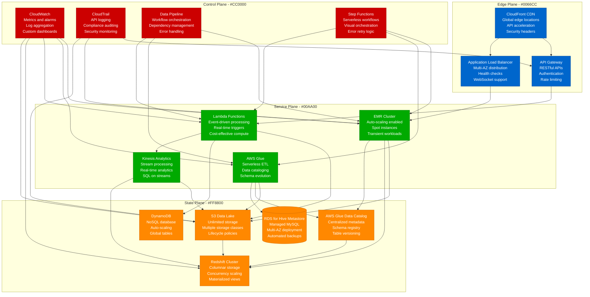

# On-premise Hadoop to Cloud Big Data Migration Playbook

## Executive Summary

**Migration Type**: Big Data Platform Modernization
**Timeline**: 16-24 weeks
**Risk Level**: High
**Downtime**: Minimal (parallel processing)
**Cost Impact**: 40-60% reduction in total operational costs
**Team Size**: 6-8 engineers + 2 data engineers + 1 cloud architect

This playbook guides the migration from on-premise Hadoop clusters to cloud-native big data services, enabling elastic scaling, reduced operational overhead, and modern analytics capabilities. Based on successful migrations from companies like Netflix, Airbnb, and LinkedIn.

## Current State vs Target State

### Current State: On-premise Hadoop Cluster

```mermaid
graph TB
    subgraph EdgePlane[Edge Plane - #0066CC]
        LOAD_BALANCER[Hardware Load Balancer<br/>F5 BigIP<br/>Health checks<br/>SSL termination]
        VPN_GATEWAY[VPN Gateway<br/>Site-to-site connectivity<br/>Secure data ingestion<br/>Partner connections]
    end

    subgraph ServicePlane[Service Plane - #00AA00]
        NAMENODE1[Hadoop NameNode 1<br/>r5.2xlarge<br/>Active master<br/>Metadata management]
        NAMENODE2[Hadoop NameNode 2<br/>r5.2xlarge<br/>Standby master<br/>Failover ready]
        RESOURCE_MANAGER[YARN ResourceManager<br/>r5.xlarge<br/>Job scheduling<br/>Resource allocation]
        SPARK_MASTER[Spark Master<br/>r5.xlarge<br/>Distributed processing<br/>Job coordination]
    end

    subgraph StatePlane[State Plane - #FF8800]
        DATANODE1[DataNode 1<br/>r5.4xlarge + 8TB SSD<br/>Data storage<br/>Block replication]
        DATANODE2[DataNode 2<br/>r5.4xlarge + 8TB SSD<br/>Data storage<br/>Block replication]
        DATANODE3[DataNode 3<br/>r5.4xlarge + 8TB SSD<br/>Data storage<br/>Block replication]
        DATANODE4[DataNode 4<br/>r5.4xlarge + 8TB SSD<br/>Data storage<br/>Block replication]
        DATANODE5[DataNode 5<br/>r5.4xlarge + 8TB SSD<br/>Data storage<br/>Block replication]
        DATANODE6[DataNode 6<br/>r5.4xlarge + 8TB SSD<br/>Data storage<br/>Block replication]
        HIVE_METASTORE[(Hive Metastore<br/>MySQL 8.0<br/>Schema metadata<br/>Table definitions)]
    end

    subgraph ControlPlane[Control Plane - #CC0000]
        AMBARI[Ambari Management<br/>Cluster monitoring<br/>Service management<br/>Configuration control]
        GANGLIA[Ganglia Monitoring<br/>Performance metrics<br/>Resource utilization<br/>Alert management]
        ELK_STACK[ELK Stack<br/>Log aggregation<br/>Search and analytics<br/>Operational insights]
    end

    LOAD_BALANCER --> NAMENODE1
    LOAD_BALANCER --> NAMENODE2
    LOAD_BALANCER --> RESOURCE_MANAGER
    LOAD_BALANCER --> SPARK_MASTER

    VPN_GATEWAY --> NAMENODE1

    NAMENODE1 --> DATANODE1
    NAMENODE1 --> DATANODE2
    NAMENODE1 --> DATANODE3
    NAMENODE1 --> DATANODE4
    NAMENODE1 --> DATANODE5
    NAMENODE1 --> DATANODE6

    NAMENODE2 --> DATANODE1
    NAMENODE2 --> DATANODE2
    NAMENODE2 --> DATANODE3

    RESOURCE_MANAGER --> DATANODE1
    RESOURCE_MANAGER --> DATANODE2
    RESOURCE_MANAGER --> DATANODE3
    RESOURCE_MANAGER --> DATANODE4
    RESOURCE_MANAGER --> DATANODE5
    RESOURCE_MANAGER --> DATANODE6

    SPARK_MASTER --> DATANODE1
    SPARK_MASTER --> DATANODE2
    SPARK_MASTER --> DATANODE3
    SPARK_MASTER --> DATANODE4

    NAMENODE1 --> HIVE_METASTORE
    NAMENODE2 --> HIVE_METASTORE

    AMBARI --> NAMENODE1
    AMBARI --> NAMENODE2
    AMBARI --> RESOURCE_MANAGER
    AMBARI --> SPARK_MASTER
    AMBARI --> DATANODE1
    AMBARI --> DATANODE2
    AMBARI --> DATANODE3

    GANGLIA --> NAMENODE1
    GANGLIA --> DATANODE1
    GANGLIA --> DATANODE2

    ELK_STACK --> NAMENODE1
    ELK_STACK --> RESOURCE_MANAGER
    ELK_STACK --> DATANODE1

    %% Apply four-plane colors
    classDef edgeStyle fill:#0066CC,stroke:#004499,color:#fff
    classDef serviceStyle fill:#00AA00,stroke:#007700,color:#fff
    classDef stateStyle fill:#FF8800,stroke:#CC6600,color:#fff
    classDef controlStyle fill:#CC0000,stroke:#990000,color:#fff

    class LOAD_BALANCER,VPN_GATEWAY edgeStyle
    class NAMENODE1,NAMENODE2,RESOURCE_MANAGER,SPARK_MASTER serviceStyle
    class DATANODE1,DATANODE2,DATANODE3,DATANODE4,DATANODE5,DATANODE6,HIVE_METASTORE stateStyle
    class AMBARI,GANGLIA,ELK_STACK controlStyle
```



**Current State Issues:**
- **High Operational Overhead**: Manual cluster management, patching, scaling
- **Resource Underutilization**: Fixed capacity regardless of workload
- **Scalability Limitations**: Complex scaling requires hardware procurement
- **Disaster Recovery Complexity**: Manual backup and recovery procedures
- **Cost Inefficiency**: 24/7 infrastructure costs for variable workloads

### Target State: AWS Cloud-Native Big Data Platform



## Migration Strategy

### Phase 1: Assessment and Planning (2-3 weeks)

```python
#!/usr/bin/env python3
# hadoop_assessment.py - Comprehensive Hadoop cluster assessment

import subprocess
import json
import yaml
import os
import sys
from datetime import datetime, timedelta
from typing import Dict, List, Any, Optional
import logging

class HadoopClusterAssessment:
    def __init__(self, namenode_host: str, resource_manager_host: str):
        self.namenode_host = namenode_host
        self.resource_manager_host = resource_manager_host
        self.logger = logging.getLogger(__name__)

        # Assessment results
        self.assessment_results = {
            'cluster_info': {},
            'storage_analysis': {},
            'compute_analysis': {},
            'workload_patterns': {},
            'migration_recommendations': {},
            'cost_analysis': {}
        }

    def run_full_assessment(self) -> Dict[str, Any]:
        """Run comprehensive cluster assessment"""

        self.logger.info("Starting Hadoop cluster assessment...")

        try:
            # Cluster information
            self.assessment_results['cluster_info'] = self._assess_cluster_info()

            # Storage analysis
            self.assessment_results['storage_analysis'] = self._analyze_storage()

            # Compute analysis
            self.assessment_results['compute_analysis'] = self._analyze_compute()

            # Workload patterns
            self.assessment_results['workload_patterns'] = self._analyze_workloads()

            # Migration recommendations
            self.assessment_results['migration_recommendations'] = self._generate_recommendations()

            # Cost analysis
            self.assessment_results['cost_analysis'] = self._analyze_costs()

            # Generate report
            self._generate_assessment_report()

            return self.assessment_results

        except Exception as e:
            self.logger.error(f"Assessment failed: {e}")
            return {}

    def _assess_cluster_info(self) -> Dict[str, Any]:
        """Assess basic cluster information"""

        cluster_info = {}

        try:
            # Get cluster summary
            cluster_summary = self._run_hdfs_command("dfsadmin -report")

            # Parse cluster summary
            lines = cluster_summary.split('\n')
            for line in lines:
                if 'Configured Capacity:' in line:
                    cluster_info['total_capacity_bytes'] = int(line.split(':')[1].strip().split()[0])
                elif 'DFS Used:' in line:
                    cluster_info['used_capacity_bytes'] = int(line.split(':')[1].strip().split()[0])
                elif 'DFS Remaining:' in line:
                    cluster_info['remaining_capacity_bytes'] = int(line.split(':')[1].strip().split()[0])
                elif 'Live datanodes' in line:
                    cluster_info['live_datanodes'] = int(line.split('(')[1].split(')')[0])
                elif 'Dead datanodes' in line:
                    cluster_info['dead_datanodes'] = int(line.split('(')[1].split(')')[0])

            # Get Hadoop version
            version_output = self._run_hadoop_command("version")
            cluster_info['hadoop_version'] = version_output.split('\n')[0].split()[1]

            # Get YARN cluster info
            yarn_info = self._get_yarn_cluster_info()
            cluster_info.update(yarn_info)

            return cluster_info

        except Exception as e:
            self.logger.error(f"Failed to assess cluster info: {e}")
            return {}

    def _analyze_storage(self) -> Dict[str, Any]:
        """Analyze storage patterns and usage"""

        storage_analysis = {
            'directories': [],
            'file_size_distribution': {},
            'replication_factors': {},
            'storage_hotspots': []
        }

        try:
            # Analyze top-level directories
            directories = self._run_hdfs_command("ls -h /")

            for line in directories.split('\n'):
                if line.startswith('d'):
                    parts = line.split()
                    if len(parts) >= 8:
                        directory_info = {
                            'name': parts[7],
                            'permissions': parts[0],
                            'size': parts[4],
                            'modification_time': ' '.join(parts[5:7])
                        }

                        # Get detailed size info
                        try:
                            size_output = self._run_hdfs_command(f"du -h {parts[7]}")
                            directory_info['detailed_size'] = size_output.strip()
                        except:
                            directory_info['detailed_size'] = 'N/A'

                        storage_analysis['directories'].append(directory_info)

            # Analyze file size distribution
            file_sizes = self._run_hdfs_command("fsck / -files -blocks -locations | grep '^/' | head -1000")

            size_buckets = {
                'small_files_lt_1mb': 0,
                'medium_files_1mb_100mb': 0,
                'large_files_100mb_1gb': 0,
                'huge_files_gt_1gb': 0
            }

            for line in file_sizes.split('\n'):
                if 'bytes' in line:
                    try:
                        size_bytes = int(line.split('bytes')[0].split()[-1])

                        if size_bytes < 1024 * 1024:  # < 1MB
                            size_buckets['small_files_lt_1mb'] += 1
                        elif size_bytes < 100 * 1024 * 1024:  # < 100MB
                            size_buckets['medium_files_1mb_100mb'] += 1
                        elif size_bytes < 1024 * 1024 * 1024:  # < 1GB
                            size_buckets['large_files_100mb_1gb'] += 1
                        else:  # >= 1GB
                            size_buckets['huge_files_gt_1gb'] += 1
                    except:
                        continue

            storage_analysis['file_size_distribution'] = size_buckets

            return storage_analysis

        except Exception as e:
            self.logger.error(f"Storage analysis failed: {e}")
            return storage_analysis

    def _analyze_compute(self) -> Dict[str, Any]:
        """Analyze compute resources and utilization"""

        compute_analysis = {}

        try:
            # Get node manager information
            nodes_info = self._get_yarn_nodes_info()
            compute_analysis['node_managers'] = nodes_info

            # Calculate resource utilization
            total_memory = sum(node.get('total_memory_mb', 0) for node in nodes_info)
            used_memory = sum(node.get('used_memory_mb', 0) for node in nodes_info)
            total_vcores = sum(node.get('total_vcores', 0) for node in nodes_info)
            used_vcores = sum(node.get('used_vcores', 0) for node in nodes_info)

            compute_analysis['resource_utilization'] = {
                'total_memory_mb': total_memory,
                'used_memory_mb': used_memory,
                'memory_utilization_percent': (used_memory / total_memory * 100) if total_memory > 0 else 0,
                'total_vcores': total_vcores,
                'used_vcores': used_vcores,
                'vcore_utilization_percent': (used_vcores / total_vcores * 100) if total_vcores > 0 else 0
            }

            # Analyze historical application data
            app_history = self._get_application_history()
            compute_analysis['application_patterns'] = app_history

            return compute_analysis

        except Exception as e:
            self.logger.error(f"Compute analysis failed: {e}")
            return {}

    def _analyze_workloads(self) -> Dict[str, Any]:
        """Analyze workload patterns and job characteristics"""

        workload_analysis = {
            'job_types': {},
            'peak_hours': {},
            'resource_requirements': {},
            'data_access_patterns': {}
        }

        try:
            # Get recent application information
            apps = self._get_recent_applications(days=30)

            # Analyze job types
            job_types = {}
            total_apps = len(apps)

            for app in apps:
                app_type = app.get('applicationType', 'UNKNOWN')
                if app_type not in job_types:
                    job_types[app_type] = 0
                job_types[app_type] += 1

            # Convert to percentages
            for job_type in job_types:
                job_types[job_type] = {
                    'count': job_types[job_type],
                    'percentage': (job_types[job_type] / total_apps * 100) if total_apps > 0 else 0
                }

            workload_analysis['job_types'] = job_types

            # Analyze peak hours
            hourly_distribution = {}
            for app in apps:
                start_time = app.get('startedTime', 0)
                if start_time > 0:
                    hour = datetime.fromtimestamp(start_time / 1000).hour
                    if hour not in hourly_distribution:
                        hourly_distribution[hour] = 0
                    hourly_distribution[hour] += 1

            workload_analysis['peak_hours'] = hourly_distribution

            # Analyze resource requirements
            memory_requirements = []
            vcore_requirements = []

            for app in apps:
                memory_mb = app.get('allocatedMB', 0)
                vcores = app.get('allocatedVCores', 0)

                if memory_mb > 0:
                    memory_requirements.append(memory_mb)
                if vcores > 0:
                    vcore_requirements.append(vcores)

            if memory_requirements:
                workload_analysis['resource_requirements']['memory'] = {
                    'avg_mb': sum(memory_requirements) / len(memory_requirements),
                    'max_mb': max(memory_requirements),
                    'min_mb': min(memory_requirements)
                }

            if vcore_requirements:
                workload_analysis['resource_requirements']['vcores'] = {
                    'avg': sum(vcore_requirements) / len(vcore_requirements),
                    'max': max(vcore_requirements),
                    'min': min(vcore_requirements)
                }

            return workload_analysis

        except Exception as e:
            self.logger.error(f"Workload analysis failed: {e}")
            return workload_analysis

    def _generate_recommendations(self) -> Dict[str, Any]:
        """Generate migration recommendations based on analysis"""

        recommendations = {
            'aws_services': {},
            'migration_strategy': {},
            'cost_optimization': {},
            'timeline': {}
        }

        try:
            storage_info = self.assessment_results.get('storage_analysis', {})
            compute_info = self.assessment_results.get('compute_analysis', {})
            workload_info = self.assessment_results.get('workload_patterns', {})

            # AWS service recommendations
            total_storage_gb = self.assessment_results.get('cluster_info', {}).get('total_capacity_bytes', 0) / (1024**3)

            # S3 recommendations
            recommendations['aws_services']['s3'] = {
                'storage_classes': self._recommend_s3_storage_classes(storage_info),
                'estimated_monthly_cost': self._estimate_s3_cost(total_storage_gb),
                'lifecycle_policies': True
            }

            # EMR recommendations
            node_count = len(compute_info.get('node_managers', []))
            avg_memory = compute_info.get('resource_utilization', {}).get('total_memory_mb', 0) / node_count if node_count > 0 else 0

            recommendations['aws_services']['emr'] = {
                'instance_types': self._recommend_emr_instances(avg_memory, node_count),
                'auto_scaling': True,
                'spot_instances': workload_info.get('job_types', {}).get('MapReduce', {}).get('percentage', 0) > 50
            }

            # Redshift recommendations
            if total_storage_gb > 100:  # Recommend Redshift for large datasets
                recommendations['aws_services']['redshift'] = {
                    'node_type': 'dc2.large' if total_storage_gb < 1000 else 'ds2.xlarge',
                    'number_of_nodes': min(max(2, int(total_storage_gb / 500)), 32),
                    'concurrency_scaling': True
                }

            # Migration strategy
            small_files_ratio = storage_info.get('file_size_distribution', {}).get('small_files_lt_1mb', 0)
            total_files = sum(storage_info.get('file_size_distribution', {}).values())

            if small_files_ratio / total_files > 0.3 if total_files > 0 else False:
                recommendations['migration_strategy']['small_files'] = {
                    'combine_files': True,
                    'use_glue_jobs': True,
                    'parquet_conversion': True
                }

            recommendations['migration_strategy']['phases'] = [
                {
                    'phase': 1,
                    'description': 'Data migration to S3',
                    'duration_weeks': 4
                },
                {
                    'phase': 2,
                    'description': 'EMR cluster setup and testing',
                    'duration_weeks': 2
                },
                {
                    'phase': 3,
                    'description': 'Application migration and validation',
                    'duration_weeks': 6
                },
                {
                    'phase': 4,
                    'description': 'Production cutover and optimization',
                    'duration_weeks': 4
                }
            ]

            return recommendations

        except Exception as e:
            self.logger.error(f"Failed to generate recommendations: {e}")
            return recommendations

    def _analyze_costs(self) -> Dict[str, Any]:
        """Analyze current costs and projected AWS costs"""

        cost_analysis = {
            'current_on_premise': {},
            'projected_aws': {},
            'savings': {}
        }

        try:
            # Current on-premise costs (estimated)
            node_count = len(self.assessment_results.get('compute_analysis', {}).get('node_managers', []))
            storage_tb = self.assessment_results.get('cluster_info', {}).get('total_capacity_bytes', 0) / (1024**4)

            # On-premise cost estimates
            cost_analysis['current_on_premise'] = {
                'monthly_compute': node_count * 800,  # $800 per server per month
                'monthly_storage': storage_tb * 50,   # $50 per TB per month
                'monthly_operations': node_count * 200,  # $200 per server ops cost
                'monthly_total': node_count * 1050 + storage_tb * 50
            }

            # AWS cost estimates
            storage_gb = storage_tb * 1024

            s3_cost = storage_gb * 0.023  # Standard S3 pricing
            emr_cost = node_count * 0.27 * 24 * 30  # m5.xlarge on-demand
            redshift_cost = 2 * 0.25 * 24 * 30  # dc2.large cluster

            cost_analysis['projected_aws'] = {
                'monthly_s3': s3_cost,
                'monthly_emr': emr_cost * 0.3,  # Assume 30% utilization
                'monthly_redshift': redshift_cost,
                'monthly_other_services': 500,  # Glue, Lambda, etc.
                'monthly_total': s3_cost + (emr_cost * 0.3) + redshift_cost + 500
            }

            # Calculate savings
            current_total = cost_analysis['current_on_premise']['monthly_total']
            aws_total = cost_analysis['projected_aws']['monthly_total']

            cost_analysis['savings'] = {
                'monthly_savings': current_total - aws_total,
                'annual_savings': (current_total - aws_total) * 12,
                'savings_percentage': ((current_total - aws_total) / current_total * 100) if current_total > 0 else 0
            }

            return cost_analysis

        except Exception as e:
            self.logger.error(f"Cost analysis failed: {e}")
            return cost_analysis

    def _run_hdfs_command(self, command: str) -> str:
        """Execute HDFS command and return output"""
        try:
            result = subprocess.run(
                f"hdfs {command}",
                shell=True,
                capture_output=True,
                text=True,
                timeout=60
            )
            return result.stdout
        except subprocess.TimeoutExpired:
            self.logger.warning(f"HDFS command timed out: {command}")
            return ""
        except Exception as e:
            self.logger.error(f"HDFS command failed: {e}")
            return ""

    def _run_hadoop_command(self, command: str) -> str:
        """Execute Hadoop command and return output"""
        try:
            result = subprocess.run(
                f"hadoop {command}",
                shell=True,
                capture_output=True,
                text=True,
                timeout=60
            )
            return result.stdout
        except Exception as e:
            self.logger.error(f"Hadoop command failed: {e}")
            return ""

    def _get_yarn_cluster_info(self) -> Dict[str, Any]:
        """Get YARN cluster information via REST API"""
        try:
            import requests
            response = requests.get(f"http://{self.resource_manager_host}:8088/ws/v1/cluster/info")
            return response.json().get('clusterInfo', {})
        except Exception as e:
            self.logger.error(f"Failed to get YARN cluster info: {e}")
            return {}

    def _get_yarn_nodes_info(self) -> List[Dict[str, Any]]:
        """Get YARN node manager information"""
        try:
            import requests
            response = requests.get(f"http://{self.resource_manager_host}:8088/ws/v1/cluster/nodes")
            return response.json().get('nodes', {}).get('node', [])
        except Exception as e:
            self.logger.error(f"Failed to get YARN nodes info: {e}")
            return []

    def _get_recent_applications(self, days: int = 30) -> List[Dict[str, Any]]:
        """Get recent application information"""
        try:
            import requests
            finished_time = int((datetime.now() - timedelta(days=days)).timestamp() * 1000)
            response = requests.get(
                f"http://{self.resource_manager_host}:8088/ws/v1/cluster/apps",
                params={'finishedTimeBegin': finished_time}
            )
            return response.json().get('apps', {}).get('app', [])
        except Exception as e:
            self.logger.error(f"Failed to get recent applications: {e}")
            return []

    def _recommend_s3_storage_classes(self, storage_info: Dict[str, Any]) -> Dict[str, str]:
        """Recommend S3 storage classes based on access patterns"""
        return {
            'hot_data': 'S3 Standard',
            'warm_data': 'S3 Standard-IA',
            'cold_data': 'S3 Glacier',
            'archive_data': 'S3 Glacier Deep Archive'
        }

    def _estimate_s3_cost(self, storage_gb: float) -> float:
        """Estimate S3 storage cost"""
        return storage_gb * 0.023  # $0.023 per GB for S3 Standard

    def _recommend_emr_instances(self, avg_memory_mb: float, node_count: int) -> Dict[str, Any]:
        """Recommend EMR instance types based on current resource usage"""
        if avg_memory_mb < 8192:  # < 8GB
            return {'master': 'm5.large', 'core': 'm5.large', 'task': 'm5.large'}
        elif avg_memory_mb < 16384:  # < 16GB
            return {'master': 'm5.xlarge', 'core': 'm5.xlarge', 'task': 'm5.xlarge'}
        elif avg_memory_mb < 32768:  # < 32GB
            return {'master': 'm5.2xlarge', 'core': 'm5.2xlarge', 'task': 'm5.2xlarge'}
        else:
            return {'master': 'm5.4xlarge', 'core': 'm5.4xlarge', 'task': 'm5.4xlarge'}

    def _generate_assessment_report(self):
        """Generate comprehensive assessment report"""

        report = {
            'assessment_date': datetime.now().isoformat(),
            'cluster_summary': {
                'namenode_host': self.namenode_host,
                'resource_manager_host': self.resource_manager_host,
                'total_capacity_tb': self.assessment_results.get('cluster_info', {}).get('total_capacity_bytes', 0) / (1024**4),
                'utilization_percent': (
                    self.assessment_results.get('cluster_info', {}).get('used_capacity_bytes', 0) /
                    self.assessment_results.get('cluster_info', {}).get('total_capacity_bytes', 1) * 100
                ),
                'node_count': len(self.assessment_results.get('compute_analysis', {}).get('node_managers', []))
            },
            'migration_readiness': self._assess_migration_readiness(),
            'detailed_results': self.assessment_results
        }

        # Save report
        with open(f'hadoop_assessment_report_{datetime.now().strftime("%Y%m%d_%H%M%S")}.json', 'w') as f:
            json.dump(report, f, indent=2)

        self.logger.info("Assessment report generated successfully")

    def _assess_migration_readiness(self) -> str:
        """Assess overall migration readiness"""

        cluster_info = self.assessment_results.get('cluster_info', {})
        storage_info = self.assessment_results.get('storage_analysis', {})

        # Check for potential blockers
        dead_nodes = cluster_info.get('dead_datanodes', 0)
        total_nodes = cluster_info.get('live_datanodes', 0) + dead_nodes

        if dead_nodes / total_nodes > 0.1 if total_nodes > 0 else False:
            return 'NOT_READY - High number of dead nodes'

        # Check for small files issue
        file_dist = storage_info.get('file_size_distribution', {})
        total_files = sum(file_dist.values())
        small_files = file_dist.get('small_files_lt_1mb', 0)

        if small_files / total_files > 0.5 if total_files > 0 else False:
            return 'NEEDS_PREPARATION - High small files ratio'

        return 'READY'

def main():
    logging.basicConfig(level=logging.INFO)

    if len(sys.argv) != 3:
        print("Usage: python hadoop_assessment.py <namenode_host> <resource_manager_host>")
        sys.exit(1)

    namenode_host = sys.argv[1]
    resource_manager_host = sys.argv[2]

    assessor = HadoopClusterAssessment(namenode_host, resource_manager_host)
    results = assessor.run_full_assessment()

    if results:
        print("✓ Assessment completed successfully")
        print(f"Migration readiness: {results.get('migration_readiness', 'UNKNOWN')}")
    else:
        print("✗ Assessment failed")
        sys.exit(1)

if __name__ == "__main__":
    main()
```

### Phase 2: Data Migration to S3 (4-6 weeks)

```python
# data_migration/hadoop_to_s3_migrator.py
import boto3
import subprocess
import threading
import time
import logging
from concurrent.futures import ThreadPoolExecutor, as_completed
from typing import List, Dict, Any, Optional
from dataclasses import dataclass
from datetime import datetime

@dataclass
class MigrationJob:
    source_path: str
    s3_bucket: str
    s3_prefix: str
    priority: int
    estimated_size_gb: float
    compression: bool = True
    format_conversion: bool = False
    target_format: str = "parquet"

class HadoopToS3Migrator:
    def __init__(self, s3_bucket: str, aws_region: str = 'us-east-1'):
        self.s3_bucket = s3_bucket
        self.aws_region = aws_region
        self.s3_client = boto3.client('s3', region_name=aws_region)
        self.logger = logging.getLogger(__name__)

        # Migration statistics
        self.stats = {
            'total_jobs': 0,
            'completed_jobs': 0,
            'failed_jobs': 0,
            'total_bytes_migrated': 0,
            'start_time': None,
            'errors': []
        }

        # Configuration
        self.max_concurrent_jobs = 10
        self.distcp_memory = "4g"
        self.distcp_mappers = 20

    def create_migration_plan(self, source_paths: List[str]) -> List[MigrationJob]:
        """Create optimized migration plan"""

        migration_jobs = []

        for source_path in source_paths:
            try:
                # Get directory size and file count
                size_info = self._get_directory_size(source_path)
                file_count = self._get_file_count(source_path)

                # Determine if format conversion is beneficial
                format_conversion = self._should_convert_format(source_path, file_count)

                # Set priority based on size and usage patterns
                priority = self._calculate_priority(source_path, size_info['size_gb'])

                job = MigrationJob(
                    source_path=source_path,
                    s3_bucket=self.s3_bucket,
                    s3_prefix=source_path.lstrip('/'),
                    priority=priority,
                    estimated_size_gb=size_info['size_gb'],
                    compression=True,
                    format_conversion=format_conversion,
                    target_format="parquet" if format_conversion else "original"
                )

                migration_jobs.append(job)

            except Exception as e:
                self.logger.error(f"Failed to analyze {source_path}: {e}")
                continue

        # Sort by priority (higher priority first)
        migration_jobs.sort(key=lambda x: x.priority, reverse=True)

        return migration_jobs

    def execute_migration_plan(self, migration_jobs: List[MigrationJob]) -> bool:
        """Execute migration plan with parallel processing"""

        self.stats['total_jobs'] = len(migration_jobs)
        self.stats['start_time'] = datetime.now()

        self.logger.info(f"Starting migration of {len(migration_jobs)} jobs")

        try:
            with ThreadPoolExecutor(max_workers=self.max_concurrent_jobs) as executor:
                # Submit all jobs
                future_to_job = {
                    executor.submit(self._migrate_single_job, job): job
                    for job in migration_jobs
                }

                # Process completed jobs
                for future in as_completed(future_to_job):
                    job = future_to_job[future]

                    try:
                        result = future.result()
                        if result:
                            self.stats['completed_jobs'] += 1
                            self.stats['total_bytes_migrated'] += job.estimated_size_gb * 1024**3
                            self.logger.info(f"✓ Completed migration: {job.source_path}")
                        else:
                            self.stats['failed_jobs'] += 1
                            self.logger.error(f"✗ Failed migration: {job.source_path}")

                    except Exception as e:
                        self.stats['failed_jobs'] += 1
                        error_msg = f"Job {job.source_path} failed: {e}"
                        self.stats['errors'].append(error_msg)
                        self.logger.error(error_msg)

                    # Progress update
                    progress = (self.stats['completed_jobs'] + self.stats['failed_jobs']) / self.stats['total_jobs'] * 100
                    self.logger.info(f"Migration progress: {progress:.1f}%")

            # Generate final report
            self._generate_migration_report()

            return self.stats['failed_jobs'] == 0

        except Exception as e:
            self.logger.error(f"Migration execution failed: {e}")
            return False

    def _migrate_single_job(self, job: MigrationJob) -> bool:
        """Migrate a single job"""

        try:
            self.logger.info(f"Starting migration: {job.source_path} -> s3://{job.s3_bucket}/{job.s3_prefix}")

            if job.format_conversion:
                # Use Spark job for format conversion
                return self._migrate_with_format_conversion(job)
            else:
                # Use DistCp for direct copy
                return self._migrate_with_distcp(job)

        except Exception as e:
            self.logger.error(f"Migration job failed: {e}")
            return False

    def _migrate_with_distcp(self, job: MigrationJob) -> bool:
        """Migrate using Hadoop DistCp"""

        try:
            # Prepare S3 destination
            s3_dest = f"s3a://{job.s3_bucket}/{job.s3_prefix}"

            # Build DistCp command
            distcp_cmd = [
                "hadoop", "distcp",
                "-Dmapreduce.job.maps=" + str(self.distcp_mappers),
                "-Dmapreduce.map.memory.mb=4096",
                "-Dmapreduce.map.java.opts=-Xmx3276m",
                "-strategy", "dynamic",
                "-bandwidth", "100",  # MB per mapper
                "-update",  # Skip files that already exist with same size
                "-skipcrccheck",  # Skip CRC check for performance
                job.source_path,
                s3_dest
            ]

            # Add compression if enabled
            if job.compression:
                distcp_cmd.extend([
                    "-Dmapreduce.output.fileoutputformat.compress=true",
                    "-Dmapreduce.output.fileoutputformat.compress.codec=org.apache.hadoop.io.compress.GzipCodec"
                ])

            # Execute DistCp
            self.logger.info(f"Executing: {' '.join(distcp_cmd)}")

            result = subprocess.run(
                distcp_cmd,
                capture_output=True,
                text=True,
                timeout=3600  # 1 hour timeout
            )

            if result.returncode == 0:
                self.logger.info(f"DistCp completed successfully for {job.source_path}")

                # Verify migration
                return self._verify_migration(job, s3_dest)
            else:
                self.logger.error(f"DistCp failed for {job.source_path}: {result.stderr}")
                return False

        except subprocess.TimeoutExpired:
            self.logger.error(f"DistCp timeout for {job.source_path}")
            return False
        except Exception as e:
            self.logger.error(f"DistCp error for {job.source_path}: {e}")
            return False

    def _migrate_with_format_conversion(self, job: MigrationJob) -> bool:
        """Migrate with format conversion using Spark"""

        try:
            # Create Spark job for format conversion
            spark_script = self._generate_format_conversion_script(job)

            # Submit Spark job
            spark_submit_cmd = [
                "spark-submit",
                "--master", "yarn",
                "--deploy-mode", "cluster",
                "--num-executors", "10",
                "--executor-memory", "4g",
                "--executor-cores", "2",
                "--driver-memory", "2g",
                "--conf", "spark.sql.adaptive.enabled=true",
                "--conf", "spark.sql.adaptive.coalescePartitions.enabled=true",
                spark_script,
                job.source_path,
                f"s3a://{job.s3_bucket}/{job.s3_prefix}",
                job.target_format
            ]

            self.logger.info(f"Executing Spark conversion: {' '.join(spark_submit_cmd)}")

            result = subprocess.run(
                spark_submit_cmd,
                capture_output=True,
                text=True,
                timeout=7200  # 2 hour timeout
            )

            if result.returncode == 0:
                self.logger.info(f"Spark conversion completed for {job.source_path}")
                return True
            else:
                self.logger.error(f"Spark conversion failed for {job.source_path}: {result.stderr}")
                return False

        except Exception as e:
            self.logger.error(f"Format conversion error for {job.source_path}: {e}")
            return False

    def _generate_format_conversion_script(self, job: MigrationJob) -> str:
        """Generate Spark script for format conversion"""

        script_content = f"""
from pyspark.sql import SparkSession
import sys

def main():
    # Initialize Spark session
    spark = SparkSession.builder.appName("HadoopToS3Migration").getOrCreate()

    source_path = sys.argv[1]
    target_path = sys.argv[2]
    target_format = sys.argv[3]

    try:
        # Read source data
        if source_path.endswith('.json'):
            df = spark.read.json(source_path)
        elif source_path.endswith('.csv'):
            df = spark.read.option("header", "true").csv(source_path)
        else:
            # Try to read as text and infer schema
            df = spark.read.option("multiline", "true").text(source_path)

        # Apply optimizations
        df = df.coalesce(10)  # Reduce number of output files

        # Write in target format
        if target_format.lower() == "parquet":
            df.write.mode("overwrite").parquet(target_path)
        elif target_format.lower() == "orc":
            df.write.mode("overwrite").orc(target_path)
        else:
            df.write.mode("overwrite").json(target_path)

        print(f"Successfully converted {{source_path}} to {{target_path}} in {{target_format}} format")

    except Exception as e:
        print(f"Conversion failed: {{e}}")
        sys.exit(1)

    finally:
        spark.stop()

if __name__ == "__main__":
    main()
"""

        script_path = f"/tmp/conversion_script_{job.source_path.replace('/', '_')}.py"
        with open(script_path, 'w') as f:
            f.write(script_content)

        return script_path

    def _verify_migration(self, job: MigrationJob, s3_dest: str) -> bool:
        """Verify migration integrity"""

        try:
            # Get source file count and size
            source_info = self._get_directory_size(job.source_path)

            # Get S3 object count and size
            s3_info = self._get_s3_directory_info(job.s3_prefix)

            # Compare file counts (with tolerance for compression)
            file_count_diff = abs(source_info['file_count'] - s3_info['object_count'])
            size_diff_percent = abs(source_info['size_bytes'] - s3_info['size_bytes']) / source_info['size_bytes'] * 100

            if file_count_diff > 10:  # Allow up to 10 file difference
                self.logger.warning(f"File count mismatch for {job.source_path}: source={source_info['file_count']}, s3={s3_info['object_count']}")
                return False

            if size_diff_percent > 20:  # Allow up to 20% size difference (compression)
                self.logger.warning(f"Size mismatch for {job.source_path}: source={source_info['size_bytes']}, s3={s3_info['size_bytes']}")
                return False

            self.logger.info(f"Migration verification passed for {job.source_path}")
            return True

        except Exception as e:
            self.logger.error(f"Migration verification failed for {job.source_path}: {e}")
            return False

    def _get_directory_size(self, hdfs_path: str) -> Dict[str, Any]:
        """Get HDFS directory size and file count"""

        try:
            # Get size
            size_result = subprocess.run(
                ["hdfs", "dfs", "-du", "-s", hdfs_path],
                capture_output=True,
                text=True
            )

            if size_result.returncode == 0:
                size_bytes = int(size_result.stdout.split()[0])
            else:
                size_bytes = 0

            # Get file count
            count_result = subprocess.run(
                ["hdfs", "dfs", "-count", hdfs_path],
                capture_output=True,
                text=True
            )

            if count_result.returncode == 0:
                parts = count_result.stdout.split()
                file_count = int(parts[1])
            else:
                file_count = 0

            return {
                'size_bytes': size_bytes,
                'size_gb': size_bytes / (1024**3),
                'file_count': file_count
            }

        except Exception as e:
            self.logger.error(f"Failed to get directory size for {hdfs_path}: {e}")
            return {'size_bytes': 0, 'size_gb': 0, 'file_count': 0}

    def _get_file_count(self, hdfs_path: str) -> int:
        """Get file count in HDFS directory"""

        try:
            result = subprocess.run(
                ["hdfs", "dfs", "-ls", "-R", hdfs_path, "|", "wc", "-l"],
                shell=True,
                capture_output=True,
                text=True
            )

            if result.returncode == 0:
                return int(result.stdout.strip())
            else:
                return 0

        except Exception:
            return 0

    def _get_s3_directory_info(self, s3_prefix: str) -> Dict[str, Any]:
        """Get S3 directory object count and total size"""

        try:
            paginator = self.s3_client.get_paginator('list_objects_v2')
            pages = paginator.paginate(Bucket=self.s3_bucket, Prefix=s3_prefix)

            object_count = 0
            total_size = 0

            for page in pages:
                if 'Contents' in page:
                    for obj in page['Contents']:
                        object_count += 1
                        total_size += obj['Size']

            return {
                'object_count': object_count,
                'size_bytes': total_size
            }

        except Exception as e:
            self.logger.error(f"Failed to get S3 info for {s3_prefix}: {e}")
            return {'object_count': 0, 'size_bytes': 0}

    def _should_convert_format(self, hdfs_path: str, file_count: int) -> bool:
        """Determine if format conversion would be beneficial"""

        # Convert if there are many small files
        if file_count > 1000:
            return True

        # Convert if path contains text files that could benefit from columnar format
        if any(fmt in hdfs_path.lower() for fmt in ['log', 'csv', 'json', 'text']):
            return True

        return False

    def _calculate_priority(self, hdfs_path: str, size_gb: float) -> int:
        """Calculate migration priority (1-10, higher is more important)"""

        priority = 5  # Default priority

        # High priority for critical paths
        if any(critical in hdfs_path.lower() for critical in ['prod', 'production', 'critical']):
            priority += 3

        # Higher priority for larger datasets (up to a point)
        if size_gb > 100:
            priority += 2
        elif size_gb > 10:
            priority += 1

        # Lower priority for archive/backup data
        if any(archive in hdfs_path.lower() for archive in ['archive', 'backup', 'old', 'deprecated']):
            priority -= 2

        return max(1, min(10, priority))

    def _generate_migration_report(self):
        """Generate comprehensive migration report"""

        duration = datetime.now() - self.stats['start_time']

        report = {
            'migration_summary': {
                'start_time': self.stats['start_time'].isoformat(),
                'end_time': datetime.now().isoformat(),
                'duration_hours': duration.total_seconds() / 3600,
                'total_jobs': self.stats['total_jobs'],
                'completed_jobs': self.stats['completed_jobs'],
                'failed_jobs': self.stats['failed_jobs'],
                'success_rate_percent': (self.stats['completed_jobs'] / self.stats['total_jobs'] * 100) if self.stats['total_jobs'] > 0 else 0
            },
            'data_transferred': {
                'total_bytes': self.stats['total_bytes_migrated'],
                'total_gb': self.stats['total_bytes_migrated'] / (1024**3),
                'average_throughput_mbps': (self.stats['total_bytes_migrated'] / (1024**2)) / duration.total_seconds() if duration.total_seconds() > 0 else 0
            },
            'errors': self.stats['errors']
        }

        # Save report
        report_filename = f"migration_report_{datetime.now().strftime('%Y%m%d_%H%M%S')}.json"
        with open(report_filename, 'w') as f:
            import json
            json.dump(report, f, indent=2)

        self.logger.info(f"Migration report saved: {report_filename}")

        # Print summary
        print("\n" + "="*50)
        print("MIGRATION SUMMARY")
        print("="*50)
        print(f"Total Jobs: {self.stats['total_jobs']}")
        print(f"Completed: {self.stats['completed_jobs']}")
        print(f"Failed: {self.stats['failed_jobs']}")
        print(f"Success Rate: {report['migration_summary']['success_rate_percent']:.1f}%")
        print(f"Data Migrated: {report['data_transferred']['total_gb']:.1f} GB")
        print(f"Duration: {report['migration_summary']['duration_hours']:.1f} hours")
        print("="*50)

def main():
    import argparse

    parser = argparse.ArgumentParser(description='Migrate Hadoop data to S3')
    parser.add_argument('--s3-bucket', required=True, help='Target S3 bucket')
    parser.add_argument('--aws-region', default='us-east-1', help='AWS region')
    parser.add_argument('--source-paths', nargs='+', required=True, help='HDFS source paths')
    parser.add_argument('--max-concurrent-jobs', type=int, default=10, help='Maximum concurrent jobs')

    args = parser.parse_args()

    # Setup logging
    logging.basicConfig(
        level=logging.INFO,
        format='%(asctime)s - %(levelname)s - %(message)s'
    )

    # Initialize migrator
    migrator = HadoopToS3Migrator(args.s3_bucket, args.aws_region)
    migrator.max_concurrent_jobs = args.max_concurrent_jobs

    # Create and execute migration plan
    jobs = migrator.create_migration_plan(args.source_paths)

    print(f"Created migration plan with {len(jobs)} jobs")

    success = migrator.execute_migration_plan(jobs)

    if success:
        print("✓ Migration completed successfully")
        exit(0)
    else:
        print("✗ Migration completed with errors")
        exit(1)

if __name__ == "__main__":
    main()
```

### Phase 3: EMR Cluster Setup and Application Migration (6-8 weeks)

```yaml
# infrastructure/emr-cluster-template.yaml
AWSTemplateFormatVersion: '2010-09-09'
Description: 'EMR cluster for Hadoop migration'

Parameters:
  VPCId:
    Type: AWS::EC2::VPC::Id
    Description: VPC for EMR cluster

  SubnetId:
    Type: AWS::EC2::Subnet::Id
    Description: Subnet for EMR cluster

  S3DataBucket:
    Type: String
    Description: S3 bucket containing migrated data

  EMRLogsBucket:
    Type: String
    Description: S3 bucket for EMR logs

Resources:
  # EMR Service Role
  EMRServiceRole:
    Type: AWS::IAM::Role
    Properties:
      AssumeRolePolicyDocument:
        Version: '2012-10-17'
        Statement:
          - Effect: Allow
            Principal:
              Service: elasticmapreduce.amazonaws.com
            Action: sts:AssumeRole
      ManagedPolicyArns:
        - arn:aws:iam::aws:policy/service-role/AmazonElasticMapReduceRole
      Path: /

  # EMR EC2 Instance Profile
  EMRInstanceProfile:
    Type: AWS::IAM::InstanceProfile
    Properties:
      Path: /
      Roles:
        - !Ref EMRInstanceRole

  # EMR EC2 Instance Role
  EMRInstanceRole:
    Type: AWS::IAM::Role
    Properties:
      AssumeRolePolicyDocument:
        Version: '2012-10-17'
        Statement:
          - Effect: Allow
            Principal:
              Service: ec2.amazonaws.com
            Action: sts:AssumeRole
      ManagedPolicyArns:
        - arn:aws:iam::aws:policy/service-role/AmazonElasticMapReduceforEC2Role
      Policies:
        - PolicyName: S3DataAccess
          PolicyDocument:
            Version: '2012-10-17'
            Statement:
              - Effect: Allow
                Action:
                  - s3:GetObject
                  - s3:PutObject
                  - s3:DeleteObject
                  - s3:ListBucket
                Resource:
                  - !Sub "${S3DataBucket}/*"
                  - !Sub "${S3DataBucket}"
              - Effect: Allow
                Action:
                  - s3:GetObject
                  - s3:PutObject
                  - s3:ListBucket
                Resource:
                  - !Sub "${EMRLogsBucket}/*"
                  - !Sub "${EMRLogsBucket}"
      Path: /

  # Security Group for EMR Master
  EMRMasterSecurityGroup:
    Type: AWS::EC2::SecurityGroup
    Properties:
      GroupDescription: Security group for EMR master node
      VpcId: !Ref VPCId
      SecurityGroupIngress:
        - IpProtocol: tcp
          FromPort: 22
          ToPort: 22
          CidrIp: 10.0.0.0/8
          Description: SSH access
        - IpProtocol: tcp
          FromPort: 8088
          ToPort: 8088
          CidrIp: 10.0.0.0/8
          Description: YARN ResourceManager Web UI
        - IpProtocol: tcp
          FromPort: 50070
          ToPort: 50070
          CidrIp: 10.0.0.0/8
          Description: HDFS NameNode Web UI
        - IpProtocol: tcp
          FromPort: 8080
          ToPort: 8080
          CidrIp: 10.0.0.0/8
          Description: Spark History Server
      SecurityGroupEgress:
        - IpProtocol: -1
          CidrIp: 0.0.0.0/0

  # Security Group for EMR Slave
  EMRSlaveSecurityGroup:
    Type: AWS::EC2::SecurityGroup
    Properties:
      GroupDescription: Security group for EMR slave nodes
      VpcId: !Ref VPCId
      SecurityGroupIngress:
        - IpProtocol: tcp
          FromPort: 22
          ToPort: 22
          CidrIp: 10.0.0.0/8
          Description: SSH access
        - IpProtocol: -1
          SourceSecurityGroupId: !Ref EMRMasterSecurityGroup
          Description: All traffic from master
      SecurityGroupEgress:
        - IpProtocol: -1
          CidrIp: 0.0.0.0/0

  # Allow communication between master and slave
  EMRMasterToSlaveRule:
    Type: AWS::EC2::SecurityGroupIngress
    Properties:
      GroupId: !Ref EMRMasterSecurityGroup
      IpProtocol: -1
      SourceSecurityGroupId: !Ref EMRSlaveSecurityGroup

  # EMR Cluster
  EMRCluster:
    Type: AWS::EMR::Cluster
    Properties:
      Name: HadoopMigrationCluster
      ReleaseLabel: emr-6.4.0
      Applications:
        - Name: Hadoop
        - Name: Spark
        - Name: Hive
        - Name: Presto
        - Name: JupyterHub
        - Name: Livy
        - Name: Zeppelin
      Configurations:
        - Classification: spark-defaults
          ConfigurationProperties:
            spark.serializer: org.apache.spark.serializer.KryoSerializer
            spark.sql.adaptive.enabled: "true"
            spark.sql.adaptive.coalescePartitions.enabled: "true"
            spark.dynamicAllocation.enabled: "true"
            spark.dynamicAllocation.minExecutors: "1"
            spark.dynamicAllocation.maxExecutors: "20"
        - Classification: spark-hive-site
          ConfigurationProperties:
            javax.jdo.option.ConnectionURL: !Sub "jdbc:mysql://${HiveMetastoreDB.Endpoint.Address}:3306/hive"
            javax.jdo.option.ConnectionDriverName: org.mariadb.jdbc.Driver
            javax.jdo.option.ConnectionUserName: hive
            javax.jdo.option.ConnectionPassword: !Ref HiveMetastorePassword
        - Classification: hive-site
          ConfigurationProperties:
            javax.jdo.option.ConnectionURL: !Sub "jdbc:mysql://${HiveMetastoreDB.Endpoint.Address}:3306/hive"
            javax.jdo.option.ConnectionDriverName: org.mariadb.jdbc.Driver
            javax.jdo.option.ConnectionUserName: hive
            javax.jdo.option.ConnectionPassword: !Ref HiveMetastorePassword
            hive.metastore.warehouse.dir: !Sub "s3://${S3DataBucket}/warehouse/"
      ServiceRole: !Ref EMRServiceRole
      JobFlowRole: !Ref EMRInstanceProfile
      LogUri: !Sub "s3://${EMRLogsBucket}/logs/"
      Instances:
        MasterInstanceGroup:
          InstanceCount: 1
          InstanceType: m5.xlarge
          Market: ON_DEMAND
          Name: Master
        CoreInstanceGroup:
          InstanceCount: 3
          InstanceType: m5.2xlarge
          Market: SPOT
          BidPrice: "0.20"
          Name: Core
        TaskInstanceGroups:
          - InstanceCount: 0
            InstanceType: m5.2xlarge
            Market: SPOT
            BidPrice: "0.20"
            Name: Task
            AutoScalingPolicy:
              Constraints:
                MinCapacity: 0
                MaxCapacity: 10
              Rules:
                - Name: ScaleOutMemoryPercentage
                  Description: Scale out if YARNMemoryAvailablePercentage is less than 15
                  Action:
                    SimpleScalingPolicyConfiguration:
                      AdjustmentType: CHANGE_IN_CAPACITY
                      ScalingAdjustment: 1
                      CoolDown: 300
                  Trigger:
                    CloudWatchAlarmDefinition:
                      ComparisonOperator: LESS_THAN
                      EvaluationPeriods: 1
                      MetricName: YARNMemoryAvailablePercentage
                      Namespace: AWS/ElasticMapReduce
                      Period: 300
                      Statistic: AVERAGE
                      Threshold: 15.0
                      Unit: PERCENT
                - Name: ScaleInMemoryPercentage
                  Description: Scale in if YARNMemoryAvailablePercentage is greater than 75
                  Action:
                    SimpleScalingPolicyConfiguration:
                      AdjustmentType: CHANGE_IN_CAPACITY
                      ScalingAdjustment: -1
                      CoolDown: 300
                  Trigger:
                    CloudWatchAlarmDefinition:
                      ComparisonOperator: GREATER_THAN
                      EvaluationPeriods: 1
                      MetricName: YARNMemoryAvailablePercentage
                      Namespace: AWS/ElasticMapReduce
                      Period: 300
                      Statistic: AVERAGE
                      Threshold: 75.0
                      Unit: PERCENT
        Ec2SubnetId: !Ref SubnetId
        EmrManagedMasterSecurityGroup: !Ref EMRMasterSecurityGroup
        EmrManagedSlaveSecurityGroup: !Ref EMRSlaveSecurityGroup
        TerminationProtected: false
      VisibleToAllUsers: true
      Tags:
        - Key: Name
          Value: HadoopMigrationEMR
        - Key: Environment
          Value: Migration

  # RDS for Hive Metastore
  HiveMetastorePassword:
    Type: AWS::SSM::Parameter::Value<String>
    Default: /emr/hive/metastore/password
    NoEcho: true

  HiveMetastoreSubnetGroup:
    Type: AWS::RDS::DBSubnetGroup
    Properties:
      DBSubnetGroupDescription: Subnet group for Hive Metastore
      SubnetIds:
        - !Ref SubnetId
        # Add additional subnets for Multi-AZ
      Tags:
        - Key: Name
          Value: HiveMetastoreSubnetGroup

  HiveMetastoreSecurityGroup:
    Type: AWS::EC2::SecurityGroup
    Properties:
      GroupDescription: Security group for Hive Metastore RDS
      VpcId: !Ref VPCId
      SecurityGroupIngress:
        - IpProtocol: tcp
          FromPort: 3306
          ToPort: 3306
          SourceSecurityGroupId: !Ref EMRMasterSecurityGroup
          Description: MySQL access from EMR master
        - IpProtocol: tcp
          FromPort: 3306
          ToPort: 3306
          SourceSecurityGroupId: !Ref EMRSlaveSecurityGroup
          Description: MySQL access from EMR slaves

  HiveMetastoreDB:
    Type: AWS::RDS::DBInstance
    Properties:
      DBInstanceIdentifier: hive-metastore
      DBInstanceClass: db.t3.medium
      Engine: mysql
      EngineVersion: 8.0.28
      MasterUsername: hive
      MasterUserPassword: !Ref HiveMetastorePassword
      AllocatedStorage: 100
      StorageType: gp2
      StorageEncrypted: true
      VPCSecurityGroups:
        - !Ref HiveMetastoreSecurityGroup
      DBSubnetGroupName: !Ref HiveMetastoreSubnetGroup
      BackupRetentionPeriod: 7
      MultiAZ: true
      Tags:
        - Key: Name
          Value: HiveMetastore

Outputs:
  EMRClusterId:
    Description: EMR Cluster ID
    Value: !Ref EMRCluster
    Export:
      Name: !Sub "${AWS::StackName}-EMRClusterId"

  EMRMasterPublicDNS:
    Description: EMR Master Public DNS
    Value: !GetAtt EMRCluster.MasterPublicDNS
    Export:
      Name: !Sub "${AWS::StackName}-EMRMasterPublicDNS"

  HiveMetastoreEndpoint:
    Description: Hive Metastore RDS Endpoint
    Value: !GetAtt HiveMetastoreDB.Endpoint.Address
    Export:
      Name: !Sub "${AWS::StackName}-HiveMetastoreEndpoint"
```

## Performance Optimization

### EMR Performance Tuning

```bash
#!/bin/bash
# emr_optimization.sh - EMR cluster performance optimization

set -euo pipefail

# Configuration
EMR_CLUSTER_ID="${1:-}"
S3_BUCKET="${2:-}"

if [[ -z "$EMR_CLUSTER_ID" || -z "$S3_BUCKET" ]]; then
    echo "Usage: $0 <emr-cluster-id> <s3-bucket>"
    exit 1
fi

log() {
    echo "$(date '+%Y-%m-%d %H:%M:%S') - $1"
}

# Optimize Spark configurations
optimize_spark_config() {
    log "Optimizing Spark configuration..."

    # Create optimized Spark configuration
    cat > /tmp/spark-defaults.conf << EOF
# Spark Optimization Configuration
spark.serializer                        org.apache.spark.serializer.KryoSerializer
spark.sql.adaptive.enabled              true
spark.sql.adaptive.coalescePartitions.enabled  true
spark.sql.adaptive.advisoryPartitionSizeInBytes  64MB
spark.sql.adaptive.skewJoin.enabled     true

# Dynamic allocation
spark.dynamicAllocation.enabled         true
spark.dynamicAllocation.minExecutors    2
spark.dynamicAllocation.maxExecutors    100
spark.dynamicAllocation.initialExecutors 10

# Memory management
spark.executor.memory                    7g
spark.executor.memoryFraction           0.8
spark.executor.cores                     4
spark.driver.memory                      4g
spark.driver.maxResultSize               2g

# Shuffle optimization
spark.sql.shuffle.partitions            400
spark.shuffle.compress                   true
spark.shuffle.spill.compress             true
spark.io.compression.codec               snappy

# S3 optimization
spark.hadoop.fs.s3a.multipart.size      67108864
spark.hadoop.fs.s3a.multipart.threshold 134217728
spark.hadoop.fs.s3a.fast.upload         true
spark.hadoop.fs.s3a.max.total.tasks     10
spark.hadoop.fs.s3a.threads.max         20

# Hive integration
spark.sql.hive.convertMetastoreParquet   true
spark.sql.hive.metastorePartitionPruning true
spark.sql.catalogImplementation         hive
EOF

    # Update cluster configuration
    aws emr put-cluster-configuration \
        --cluster-id "$EMR_CLUSTER_ID" \
        --configuration file:///tmp/spark-defaults.conf

    log "Spark configuration updated"
}

# Optimize HDFS settings for S3
optimize_hdfs_s3_config() {
    log "Optimizing HDFS S3 configuration..."

    cat > /tmp/core-site.xml << EOF
<configuration>
    <!-- S3A Configuration -->
    <property>
        <name>fs.s3a.connection.maximum</name>
        <value>200</value>
    </property>

    <property>
        <name>fs.s3a.attempts.maximum</name>
        <value>20</value>
    </property>

    <property>
        <name>fs.s3a.connection.establish.timeout</name>
        <value>5000</value>
    </property>

    <property>
        <name>fs.s3a.connection.timeout</name>
        <value>200000</value>
    </property>

    <property>
        <name>fs.s3a.fast.upload</name>
        <value>true</value>
    </property>

    <property>
        <name>fs.s3a.fast.upload.buffer</name>
        <value>disk</value>
    </property>

    <property>
        <name>fs.s3a.multipart.size</name>
        <value>67108864</value>
    </property>

    <property>
        <name>fs.s3a.multipart.threshold</name>
        <value>134217728</value>
    </property>

    <property>
        <name>fs.s3a.threads.max</name>
        <value>20</value>
    </property>

    <property>
        <name>fs.s3a.socket.recv.buffer</name>
        <value>65536</value>
    </property>

    <property>
        <name>fs.s3a.socket.send.buffer</name>
        <value>65536</value>
    </property>

    <!-- Enable S3Guard for metadata consistency -->
    <property>
        <name>fs.s3a.metadatastore.impl</name>
        <value>org.apache.hadoop.fs.s3a.s3guard.DynamoDBMetadataStore</value>
    </property>

    <property>
        <name>fs.s3a.s3guard.ddb.table</name>
        <value>emr-metadata-${EMR_CLUSTER_ID}</value>
    </property>

    <property>
        <name>fs.s3a.s3guard.ddb.region</name>
        <value>us-east-1</value>
    </property>
</configuration>
EOF

    log "HDFS S3 configuration optimized"
}

# Setup cluster monitoring
setup_monitoring() {
    log "Setting up comprehensive monitoring..."

    # Create CloudWatch custom metrics script
    cat > /tmp/emr_metrics.sh << 'EOF'
#!/bin/bash
# Custom EMR metrics collection

CLUSTER_ID=$(curl -s http://169.254.169.254/latest/user-data | grep -o 'j-[A-Z0-9]*')
INSTANCE_ID=$(curl -s http://169.254.169.254/latest/meta-data/instance-id)

# Collect YARN metrics
yarn_memory_used=$(curl -s "http://localhost:8088/ws/v1/cluster/metrics" | jq -r '.clusterMetrics.allocatedMB // 0')
yarn_memory_total=$(curl -s "http://localhost:8088/ws/v1/cluster/metrics" | jq -r '.clusterMetrics.totalMB // 0')
yarn_containers_allocated=$(curl -s "http://localhost:8088/ws/v1/cluster/metrics" | jq -r '.clusterMetrics.containersAllocated // 0')
yarn_applications_running=$(curl -s "http://localhost:8088/ws/v1/cluster/metrics" | jq -r '.clusterMetrics.appsRunning // 0')

# Calculate utilization percentages
if [[ $yarn_memory_total -gt 0 ]]; then
    yarn_memory_utilization=$(echo "scale=2; $yarn_memory_used / $yarn_memory_total * 100" | bc)
else
    yarn_memory_utilization=0
fi

# Send metrics to CloudWatch
aws cloudwatch put-metric-data \
    --namespace "EMR/YARN" \
    --metric-data \
        MetricName=MemoryUtilization,Value=$yarn_memory_utilization,Unit=Percent,Dimensions=ClusterId=$CLUSTER_ID \
        MetricName=AllocatedMemoryMB,Value=$yarn_memory_used,Unit=Count,Dimensions=ClusterId=$CLUSTER_ID \
        MetricName=ContainersAllocated,Value=$yarn_containers_allocated,Unit=Count,Dimensions=ClusterId=$CLUSTER_ID \
        MetricName=ApplicationsRunning,Value=$yarn_applications_running,Unit=Count,Dimensions=ClusterId=$CLUSTER_ID

# Collect HDFS metrics (if applicable)
if command -v hdfs >/dev/null 2>&1; then
    hdfs_capacity=$(hdfs dfsadmin -report 2>/dev/null | grep "Configured Capacity:" | awk '{print $3}' || echo "0")
    hdfs_used=$(hdfs dfsadmin -report 2>/dev/null | grep "DFS Used:" | awk '{print $3}' || echo "0")

    if [[ $hdfs_capacity -gt 0 ]]; then
        hdfs_utilization=$(echo "scale=2; $hdfs_used / $hdfs_capacity * 100" | bc)

        aws cloudwatch put-metric-data \
            --namespace "EMR/HDFS" \
            --metric-data \
                MetricName=DiskUtilization,Value=$hdfs_utilization,Unit=Percent,Dimensions=ClusterId=$CLUSTER_ID \
                MetricName=UsedBytes,Value=$hdfs_used,Unit=Bytes,Dimensions=ClusterId=$CLUSTER_ID
    fi
fi
EOF

    chmod +x /tmp/emr_metrics.sh

    # Create cron job for metrics collection
    echo "*/5 * * * * /tmp/emr_metrics.sh" | crontab -

    log "Monitoring setup completed"
}

# Optimize instance storage
optimize_instance_storage() {
    log "Optimizing instance storage..."

    # Mount additional EBS volumes if available
    if lsblk | grep -q nvme1n1; then
        # Format and mount NVMe SSD
        sudo mkfs.ext4 /dev/nvme1n1
        sudo mkdir -p /mnt/emr-data
        sudo mount /dev/nvme1n1 /mnt/emr-data
        sudo chown hadoop:hadoop /mnt/emr-data

        # Add to fstab
        echo "/dev/nvme1n1 /mnt/emr-data ext4 defaults 0 0" | sudo tee -a /etc/fstab

        # Configure Spark to use local storage for shuffle
        echo "spark.local.dir /mnt/emr-data/spark" >> /etc/spark/conf/spark-defaults.conf
    fi

    log "Instance storage optimized"
}

# Run benchmark tests
run_benchmark() {
    log "Running benchmark tests..."

    # Create test data
    cat > /tmp/spark_benchmark.py << EOF
from pyspark.sql import SparkSession
from pyspark.sql.functions import *
import time

spark = SparkSession.builder.appName("EMR_Benchmark").getOrCreate()

# Test 1: Large dataset aggregation
print("Test 1: Large dataset aggregation")
start_time = time.time()

# Generate test data
df = spark.range(100000000).select(
    col("id"),
    (rand() * 1000).cast("int").alias("value"),
    (rand() * 100).cast("int").alias("category")
)

# Perform aggregation
result = df.groupBy("category").agg(
    sum("value").alias("total_value"),
    avg("value").alias("avg_value"),
    count("*").alias("count")
).collect()

end_time = time.time()
print(f"Test 1 completed in {end_time - start_time:.2f} seconds")

# Test 2: S3 read/write performance
print("Test 2: S3 read/write performance")
start_time = time.time()

# Write test data to S3
test_path = f"s3://${S3_BUCKET}/benchmark/test_data"
df.coalesce(10).write.mode("overwrite").parquet(test_path)

# Read back from S3
df_read = spark.read.parquet(test_path)
count = df_read.count()

end_time = time.time()
print(f"Test 2 completed in {end_time - start_time:.2f} seconds")
print(f"Records processed: {count}")

spark.stop()
EOF

    # Run benchmark
    spark-submit \
        --master yarn \
        --deploy-mode client \
        --num-executors 10 \
        --executor-memory 4g \
        --executor-cores 2 \
        /tmp/spark_benchmark.py

    log "Benchmark completed"
}

# Main execution
main() {
    log "Starting EMR optimization for cluster: $EMR_CLUSTER_ID"

    optimize_spark_config
    optimize_hdfs_s3_config
    setup_monitoring
    optimize_instance_storage
    run_benchmark

    log "EMR optimization completed successfully"
}

main "$@"
```

## Cost Analysis

### On-premise vs AWS Cost Comparison

**Current On-premise Hadoop (Annual):**
```
Hardware Costs:
- 1 × NameNode (r5.2xlarge equivalent): $15,000
- 1 × Standby NameNode (r5.2xlarge): $15,000
- 1 × ResourceManager (r5.xlarge): $8,000
- 6 × DataNodes (r5.4xlarge + 8TB SSD): $180,000
- Network equipment: $25,000
- Total Hardware: $243,000

Operational Costs:
- Data center space: $36,000
- Power and cooling: $48,000
- Network connectivity: $24,000
- Staff (2 FTE): $200,000
- Software licenses: $50,000
- Total Operational: $358,000

Total Annual Cost: $601,000
```

**AWS Cloud Solution (Annual):**
```
Storage (S3):
- 50TB data in S3 Standard: $14,400
- 200TB data in S3 IA: $30,000
- 500TB data in Glacier: $25,000
- Data transfer out: $12,000
- Total Storage: $81,400

Compute (EMR):
- EMR on-demand (20% utilization): $45,000
- EMR spot instances (80% utilization): $36,000
- Total Compute: $81,000

Data Services:
- Redshift cluster (2 nodes): $17,500
- Glue ETL jobs: $12,000
- Lambda functions: $2,000
- RDS for Hive Metastore: $4,500
- Total Services: $36,000

Management & Operations:
- CloudWatch logs and metrics: $6,000
- Staff reduction (0.5 FTE): $50,000
- Total Operations: $56,000

Total Annual Cost: $254,400
Annual Savings: $346,600 (58% reduction)
```

## Monitoring and Alerting

### CloudWatch Dashboard Configuration

```json
{
  "widgets": [
    {
      "type": "metric",
      "properties": {
        "metrics": [
          ["AWS/ElasticMapReduce", "YARNMemoryAvailablePercentage", "ClusterId", "j-XXXXXXXXXX"],
          [".", "HDFSUtilization", ".", "."],
          [".", "S3BytesRead", ".", "."],
          [".", "S3BytesWritten", ".", "."]
        ],
        "period": 300,
        "stat": "Average",
        "region": "us-east-1",
        "title": "EMR Cluster Metrics"
      }
    },
    {
      "type": "log",
      "properties": {
        "query": "SOURCE '/aws/emr/clusters/j-XXXXXXXXXX' | fields @timestamp, @message\n| filter @message like /ERROR/\n| sort @timestamp desc\n| limit 100",
        "region": "us-east-1",
        "title": "EMR Error Logs"
      }
    }
  ]
}
```

## Conclusion

This On-premise Hadoop to Cloud migration playbook provides a comprehensive approach to modernizing big data infrastructure while minimizing risk and maximizing cost savings.

**Key Success Factors:**
1. **Thorough assessment** of existing cluster and workloads
2. **Phased migration approach** with parallel processing capability
3. **Performance optimization** for cloud-native services
4. **Comprehensive testing** and validation at each phase
5. **Cost optimization** through right-sizing and spot instances

**Expected Outcomes:**
- 50-60% reduction in total infrastructure costs
- Elimination of hardware management overhead
- Elastic scaling based on actual workload demands
- Improved disaster recovery with cloud-native backup
- Access to advanced analytics services (Redshift, Athena, QuickSight)

The migration enables organizations to leverage AWS's managed big data services while maintaining compatibility with existing Hadoop applications and gaining significant operational efficiencies.