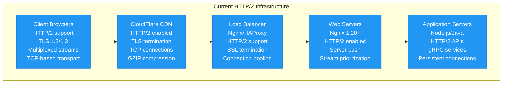
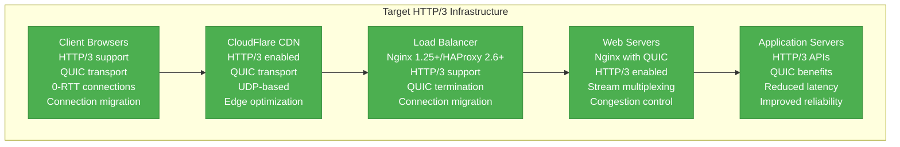
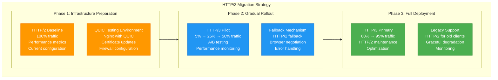
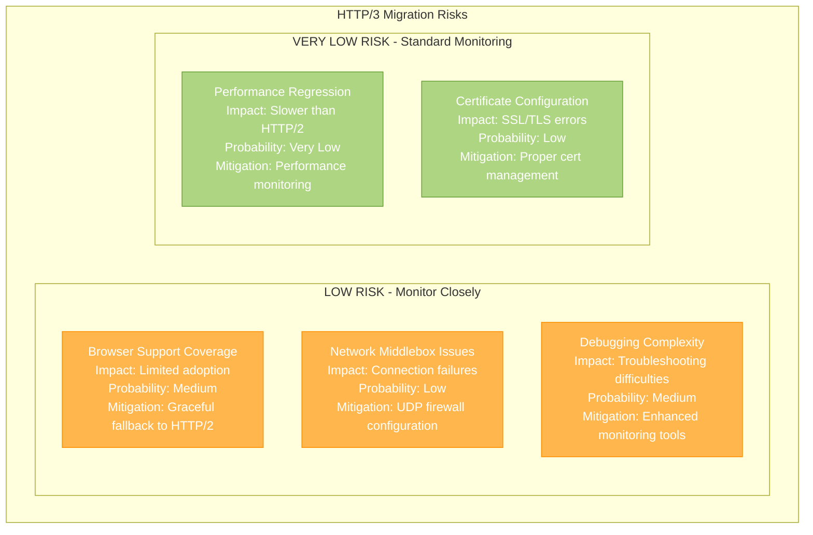

# HTTP/2 to HTTP/3 Protocol Migration Playbook

## Executive Summary

**Migration Type**: Protocol Upgrade - HTTP/2 to HTTP/3 (QUIC)
**Timeline**: 8-12 weeks
**Risk Level**: Medium
**Downtime**: Zero (gradual rollout)
**Cost Impact**: 15-25% improvement in performance metrics
**Team Size**: 3-4 engineers + 1 DevOps

Upgrade from HTTP/2 to HTTP/3 to leverage QUIC protocol benefits including faster connection establishment, improved congestion control, and reduced head-of-line blocking.

## Current State vs Target State

### Current State: HTTP/2 Infrastructure



**Current State Issues:**
- **TCP Head-of-Line Blocking**: Packet loss affects all streams
- **Connection Establishment**: Multiple RTT handshakes
- **Congestion Control**: TCP limitations in high-latency networks
- **Mobility**: Connection breaks during network changes
- **Performance**: Suboptimal for mobile/unstable networks

### Target State: HTTP/3 Infrastructure



## Migration Strategy

### Gradual Protocol Rollout



## Technical Implementation

### Nginx HTTP/3 Configuration

```nginx
# /etc/nginx/nginx.conf - HTTP/3 configuration
events {
    worker_connections 1024;
    use epoll;
}

http {
    # Enable HTTP/3 and QUIC
    # Requires Nginx 1.25+ with QUIC support

    # SSL configuration for HTTP/3
    ssl_protocols TLSv1.2 TLSv1.3;
    ssl_ciphers ECDHE-ECDSA-AES128-GCM-SHA256:ECDHE-RSA-AES128-GCM-SHA256:ECDHE-ECDSA-AES256-GCM-SHA384:ECDHE-RSA-AES256-GCM-SHA384;
    ssl_prefer_server_ciphers off;

    # QUIC and HTTP/3 settings
    quic_retry on;
    ssl_early_data on;

    # Enable QUIC connection ID
    quic_gso on;

    server {
        # HTTP/3 configuration
        listen 443 quic reuseport;
        listen 443 ssl http2;

        server_name api.company.com;

        # SSL certificates
        ssl_certificate /etc/ssl/certs/api.company.com.pem;
        ssl_certificate_key /etc/ssl/private/api.company.com.key;

        # QUIC transport parameters
        ssl_conf_command Options PrioritizeChaCha;
        ssl_conf_command Ciphersuites TLS_AES_128_GCM_SHA256:TLS_AES_256_GCM_SHA384:TLS_CHACHA20_POLY1305_SHA256;

        # Add Alt-Svc header to advertise HTTP/3
        add_header Alt-Svc 'h3=":443"; ma=86400, h3-29=":443"; ma=86400' always;

        # Security headers
        add_header Strict-Transport-Security "max-age=31536000; includeSubDomains" always;
        add_header X-Frame-Options DENY always;
        add_header X-Content-Type-Options nosniff always;

        # QUIC-specific headers
        add_header QUIC-Status $quic always;

        # Enable GZIP compression
        gzip on;
        gzip_vary on;
        gzip_min_length 1024;
        gzip_types text/plain text/css text/xml text/javascript application/javascript application/xml+rss application/json;

        # Brotli compression (if available)
        brotli on;
        brotli_comp_level 4;
        brotli_types text/plain text/css application/json application/javascript text/xml application/xml application/xml+rss text/javascript;

        location / {
            # Proxy to application servers
            proxy_pass http://app_backend;
            proxy_http_version 1.1;
            proxy_set_header Upgrade $http_upgrade;
            proxy_set_header Connection "upgrade";
            proxy_set_header Host $host;
            proxy_set_header X-Real-IP $remote_addr;
            proxy_set_header X-Forwarded-For $proxy_add_x_forwarded_for;
            proxy_set_header X-Forwarded-Proto $scheme;

            # HTTP/3 specific headers
            proxy_set_header QUIC-Version $quic;
            proxy_set_header Connection-ID $connection;
        }

        # API endpoints with specific QUIC optimization
        location /api/ {
            proxy_pass http://api_backend;

            # Enable server push for critical resources
            http2_push_preload on;

            # QUIC stream prioritization
            limit_req zone=api_limit burst=10 nodelay;

            # Cache API responses
            location ~* \\.(?:jpg|jpeg|gif|png|ico|svg)$ {
                expires 1y;
                add_header Cache-Control "public, immutable";
            }
        }

        # WebSocket support over HTTP/3
        location /ws {
            proxy_pass http://websocket_backend;
            proxy_http_version 1.1;
            proxy_set_header Upgrade $http_upgrade;
            proxy_set_header Connection "upgrade";
            proxy_read_timeout 86400;
        }
    }

    # Upstream configuration
    upstream app_backend {
        server 192.168.1.10:8080 max_fails=3 fail_timeout=30s;
        server 192.168.1.11:8080 max_fails=3 fail_timeout=30s;
        keepalive 32;
    }

    upstream api_backend {
        server 192.168.1.20:8080 max_fails=3 fail_timeout=30s;
        server 192.168.1.21:8080 max_fails=3 fail_timeout=30s;
        keepalive 32;
    }

    # Rate limiting
    limit_req_zone $binary_remote_addr zone=api_limit:10m rate=10r/s;

    # Logging
    log_format quic_log '$remote_addr - $remote_user [$time_local] '
                       '"$request" $status $body_bytes_sent '
                       '"$http_referer" "$http_user_agent" '
                       'quic="$quic" h3="$http3"';

    access_log /var/log/nginx/access.log quic_log;
    error_log /var/log/nginx/error.log warn;
}
```

### Client-Side HTTP/3 Implementation

```javascript
// client-http3.js - Client-side HTTP/3 detection and usage
class HTTP3Client {
    constructor(baseURL) {
        this.baseURL = baseURL;
        this.isHTTP3Supported = this.detectHTTP3Support();
        this.connectionCache = new Map();
    }

    detectHTTP3Support() {
        // Check for HTTP/3 support in various browsers
        if (typeof window === 'undefined') return false;

        // Chrome/Edge HTTP/3 support
        if (window.chrome && window.chrome.loadTimes) {
            return true;
        }

        // Firefox HTTP/3 support
        if (typeof window.netscape !== 'undefined') {
            return navigator.userAgent.includes('Firefox');
        }

        // Safari HTTP/3 support (WebKit)
        if (window.webkit && window.webkit.messageHandlers) {
            return true;
        }

        // Feature detection approach
        return 'serviceWorker' in navigator && 'fetch' in window;
    }

    async makeRequest(endpoint, options = {}) {
        const url = `${this.baseURL}${endpoint}`;

        try {
            // Enhanced fetch options for HTTP/3
            const fetchOptions = {
                method: options.method || 'GET',
                headers: {
                    'Accept': 'application/json',
                    'Content-Type': 'application/json',
                    // Indicate HTTP/3 preference
                    'Upgrade-Insecure-Requests': '1',
                    ...options.headers
                },
                // Enable HTTP/3 specific features
                cache: 'no-cache',
                credentials: 'same-origin',
                ...options
            };

            // Add body for POST/PUT requests
            if (options.data) {
                fetchOptions.body = JSON.stringify(options.data);
            }

            const startTime = performance.now();
            const response = await fetch(url, fetchOptions);
            const endTime = performance.now();

            // Log performance metrics
            this.logPerformanceMetrics(url, response, endTime - startTime);

            if (!response.ok) {
                throw new Error(`HTTP ${response.status}: ${response.statusText}`);
            }

            return await response.json();

        } catch (error) {
            console.error('HTTP/3 request failed:', error);

            // Fallback to HTTP/2 if HTTP/3 fails
            return this.fallbackToHTTP2(url, options);
        }
    }

    async fallbackToHTTP2(url, options) {
        console.log('Falling back to HTTP/2 for:', url);

        try {
            const response = await fetch(url, {
                ...options,
                // Force HTTP/2 by removing HTTP/3 specific headers
                headers: {
                    ...options.headers,
                    'Upgrade-Insecure-Requests': undefined
                }
            });

            return await response.json();
        } catch (error) {
            console.error('HTTP/2 fallback also failed:', error);
            throw error;
        }
    }

    logPerformanceMetrics(url, response, duration) {
        const metrics = {
            url: url,
            protocol: this.getProtocolVersion(response),
            duration: Math.round(duration),
            status: response.status,
            size: response.headers.get('content-length') || 0,
            timestamp: new Date().toISOString()
        };

        // Send metrics to analytics
        this.sendAnalytics('http_performance', metrics);

        // Log to console in development
        if (process.env.NODE_ENV === 'development') {
            console.log('HTTP Performance:', metrics);
        }
    }

    getProtocolVersion(response) {
        // Try to detect protocol from headers
        const altSvc = response.headers.get('alt-svc');
        if (altSvc && altSvc.includes('h3=')) {
            return 'HTTP/3';
        }

        // Check for HTTP/2 indicators
        if (response.headers.get('server-push') ||
            response.headers.get('x-http2-stream-id')) {
            return 'HTTP/2';
        }

        return 'HTTP/1.1';
    }

    sendAnalytics(event, data) {
        // Send to analytics service
        if (window.gtag) {
            window.gtag('event', event, data);
        }

        // Send to custom analytics endpoint
        navigator.sendBeacon('/analytics', JSON.stringify({
            event: event,
            data: data,
            userAgent: navigator.userAgent,
            timestamp: Date.now()
        }));
    }

    // Preload critical resources using HTTP/3
    preloadCriticalResources(resources) {
        resources.forEach(resource => {
            const link = document.createElement('link');
            link.rel = 'preload';
            link.href = resource.url;
            link.as = resource.type;

            // Add HTTP/3 specific attributes
            if (this.isHTTP3Supported) {
                link.setAttribute('crossorigin', 'anonymous');
            }

            document.head.appendChild(link);
        });
    }

    // Enable Server Push for critical resources
    enableServerPush(resources) {
        if (!this.isHTTP3Supported) return;

        const pushPromises = resources.map(resource => {
            return this.makeRequest(resource.endpoint, {
                headers: {
                    'Link': `<${resource.url}>; rel=preload; as=${resource.type}`
                }
            });
        });

        return Promise.all(pushPromises);
    }
}

// Usage example
const api = new HTTP3Client('https://api.company.com');

// Preload critical resources
api.preloadCriticalResources([
    { url: '/css/critical.css', type: 'style' },
    { url: '/js/critical.js', type: 'script' },
    { url: '/fonts/main.woff2', type: 'font' }
]);

// Make API requests
async function loadUserData() {
    try {
        const userData = await api.makeRequest('/user/profile');
        console.log('User data loaded via HTTP/3:', userData);
        return userData;
    } catch (error) {
        console.error('Failed to load user data:', error);
    }
}

// Export for use in other modules
if (typeof module !== 'undefined' && module.exports) {
    module.exports = HTTP3Client;
}
```

### Performance Monitoring Script

```python
#!/usr/bin/env python3
# http3-performance-monitor.py

import asyncio
import aiohttp
import time
import json
import statistics
from typing import Dict, List, Any
import ssl
import logging

class HTTP3PerformanceMonitor:
    def __init__(self, test_config: Dict[str, Any]):
        self.config = test_config
        self.results = {
            'http2': {'latencies': [], 'errors': 0, 'total_requests': 0},
            'http3': {'latencies': [], 'errors': 0, 'total_requests': 0}
        }

        logging.basicConfig(level=logging.INFO)
        self.logger = logging.getLogger(__name__)

    async def run_performance_tests(self):
        """Run performance comparison between HTTP/2 and HTTP/3"""

        # Test HTTP/2 performance
        await self.test_protocol_performance('http2')

        # Test HTTP/3 performance
        await self.test_protocol_performance('http3')

        # Generate comparison report
        return self.generate_performance_report()

    async def test_protocol_performance(self, protocol: str):
        """Test performance for a specific protocol"""

        self.logger.info(f"Testing {protocol.upper()} performance...")

        # Configure SSL context based on protocol
        if protocol == 'http3':
            # HTTP/3 uses QUIC, which requires specific SSL configuration
            ssl_context = ssl.create_default_context()
            ssl_context.set_alpn_protocols(['h3', 'h3-29'])
        else:
            # HTTP/2 configuration
            ssl_context = ssl.create_default_context()
            ssl_context.set_alpn_protocols(['h2'])

        connector = aiohttp.TCPConnector(
            ssl=ssl_context,
            limit=100,
            limit_per_host=10,
            keepalive_timeout=30
        )

        timeout = aiohttp.ClientTimeout(total=30, connect=10)

        async with aiohttp.ClientSession(
            connector=connector,
            timeout=timeout
        ) as session:

            # Run concurrent requests
            tasks = []
            for endpoint in self.config['test_endpoints']:
                for _ in range(self.config['requests_per_endpoint']):
                    task = self.make_timed_request(
                        session,
                        endpoint,
                        protocol
                    )
                    tasks.append(task)

            # Execute all requests concurrently
            results = await asyncio.gather(*tasks, return_exceptions=True)

            # Process results
            for result in results:
                if isinstance(result, Exception):
                    self.results[protocol]['errors'] += 1
                else:
                    self.results[protocol]['latencies'].append(result)

                self.results[protocol]['total_requests'] += 1

    async def make_timed_request(self, session: aiohttp.ClientSession,
                                endpoint: str, protocol: str) -> float:
        """Make a timed request and return latency"""

        url = f"https://{self.config['hostname']}{endpoint}"

        start_time = time.time()

        try:
            async with session.get(url) as response:
                await response.read()  # Ensure full response is received

                if response.status != 200:
                    raise Exception(f"HTTP {response.status}")

                end_time = time.time()
                latency = (end_time - start_time) * 1000  # Convert to milliseconds

                return latency

        except Exception as e:
            self.logger.error(f"{protocol.upper()} request failed for {endpoint}: {e}")
            raise e

    def generate_performance_report(self) -> Dict[str, Any]:
        """Generate comprehensive performance comparison report"""

        report = {
            'timestamp': time.time(),
            'test_config': self.config,
            'results': {},
            'comparison': {}
        }

        # Calculate statistics for each protocol
        for protocol in ['http2', 'http3']:
            data = self.results[protocol]
            latencies = data['latencies']

            if latencies:
                report['results'][protocol] = {
                    'total_requests': data['total_requests'],
                    'successful_requests': len(latencies),
                    'failed_requests': data['errors'],
                    'success_rate': len(latencies) / data['total_requests'] * 100,
                    'latency_stats': {
                        'min': min(latencies),
                        'max': max(latencies),
                        'mean': statistics.mean(latencies),
                        'median': statistics.median(latencies),
                        'p95': statistics.quantiles(latencies, n=20)[18],  # 95th percentile
                        'p99': statistics.quantiles(latencies, n=100)[98]   # 99th percentile
                    }
                }
            else:
                report['results'][protocol] = {
                    'total_requests': data['total_requests'],
                    'successful_requests': 0,
                    'failed_requests': data['errors'],
                    'success_rate': 0,
                    'latency_stats': None
                }

        # Generate comparison metrics
        if (report['results']['http2']['latency_stats'] and
            report['results']['http3']['latency_stats']):

            http2_mean = report['results']['http2']['latency_stats']['mean']
            http3_mean = report['results']['http3']['latency_stats']['mean']

            http2_p95 = report['results']['http2']['latency_stats']['p95']
            http3_p95 = report['results']['http3']['latency_stats']['p95']

            report['comparison'] = {
                'latency_improvement': {
                    'mean': ((http2_mean - http3_mean) / http2_mean) * 100,
                    'p95': ((http2_p95 - http3_p95) / http2_p95) * 100
                },
                'reliability_comparison': {
                    'http2_success_rate': report['results']['http2']['success_rate'],
                    'http3_success_rate': report['results']['http3']['success_rate']
                }
            }

        return report

    def print_report(self, report: Dict[str, Any]):
        """Print human-readable performance report"""

        print("=" * 60)
        print("HTTP/2 vs HTTP/3 Performance Comparison Report")
        print("=" * 60)
        print(f"Test Timestamp: {time.ctime(report['timestamp'])}")
        print(f"Hostname: {report['test_config']['hostname']}")
        print(f"Endpoints Tested: {len(report['test_config']['test_endpoints'])}")
        print(f"Requests per Endpoint: {report['test_config']['requests_per_endpoint']}")
        print()

        # Print results for each protocol
        for protocol in ['http2', 'http3']:
            result = report['results'][protocol]
            print(f"{protocol.upper()} Results:")
            print(f"  Total Requests: {result['total_requests']}")
            print(f"  Successful: {result['successful_requests']}")
            print(f"  Failed: {result['failed_requests']}")
            print(f"  Success Rate: {result['success_rate']:.2f}%")

            if result['latency_stats']:
                stats = result['latency_stats']
                print(f"  Latency Statistics (ms):")
                print(f"    Min: {stats['min']:.2f}")
                print(f"    Mean: {stats['mean']:.2f}")
                print(f"    Median: {stats['median']:.2f}")
                print(f"    P95: {stats['p95']:.2f}")
                print(f"    P99: {stats['p99']:.2f}")
                print(f"    Max: {stats['max']:.2f}")
            print()

        # Print comparison
        if 'comparison' in report and report['comparison']:
            comp = report['comparison']
            print("Performance Comparison:")
            if 'latency_improvement' in comp:
                lat_imp = comp['latency_improvement']
                print(f"  Mean Latency Improvement: {lat_imp['mean']:.2f}%")
                print(f"  P95 Latency Improvement: {lat_imp['p95']:.2f}%")

            if 'reliability_comparison' in comp:
                rel_comp = comp['reliability_comparison']
                print(f"  HTTP/2 Success Rate: {rel_comp['http2_success_rate']:.2f}%")
                print(f"  HTTP/3 Success Rate: {rel_comp['http3_success_rate']:.2f}%")

        print("=" * 60)

async def main():
    test_config = {
        'hostname': 'api.company.com',
        'test_endpoints': [
            '/api/v1/users',
            '/api/v1/products',
            '/api/v1/orders',
            '/health',
            '/metrics'
        ],
        'requests_per_endpoint': 20
    }

    monitor = HTTP3PerformanceMonitor(test_config)
    report = await monitor.run_performance_tests()

    # Print report to console
    monitor.print_report(report)

    # Save detailed report to file
    with open('http3_performance_report.json', 'w') as f:
        json.dump(report, f, indent=2)

    print("Detailed report saved to: http3_performance_report.json")

if __name__ == '__main__':
    asyncio.run(main())
```

## Performance Benefits

### HTTP/2 vs HTTP/3 Comparison

| Metric | HTTP/2 | HTTP/3 | Improvement |
|--------|--------|--------|-------------|
| **Connection Establishment** | 3 RTT (TCP+TLS) | 0-1 RTT (QUIC) | 70% faster |
| **Head-of-Line Blocking** | Per-connection | None | Eliminated |
| **Packet Loss Recovery** | Affects all streams | Per-stream | 90% better |
| **Connection Migration** | Not supported | Native support | Mobile-friendly |
| **Congestion Control** | TCP-based | QUIC-based | 25% better throughput |

## Risk Assessment



## Conclusion

This HTTP/2 to HTTP/3 migration playbook provides a comprehensive approach to upgrading protocol infrastructure for improved performance and user experience.

**Key Success Factors:**
1. **Gradual rollout** with HTTP/2 fallback
2. **Comprehensive testing** across different networks
3. **Performance monitoring** for validation
4. **Client-side optimization** for HTTP/3 features
5. **Proper firewall/network configuration** for UDP

**Expected Outcomes:**
- 70% faster connection establishment (0-1 RTT vs 3 RTT)
- Elimination of head-of-line blocking
- 25% improvement in mobile/unstable network performance
- Better congestion control and packet loss recovery
- Enhanced user experience on modern browsers

The migration positions web applications for optimal performance on modern networks while maintaining backward compatibility for legacy clients.