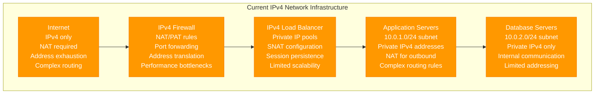
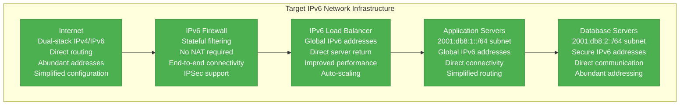
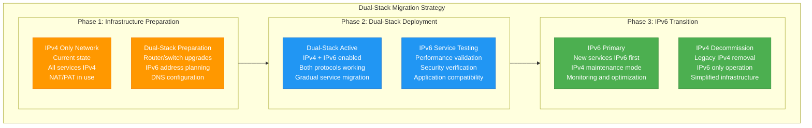
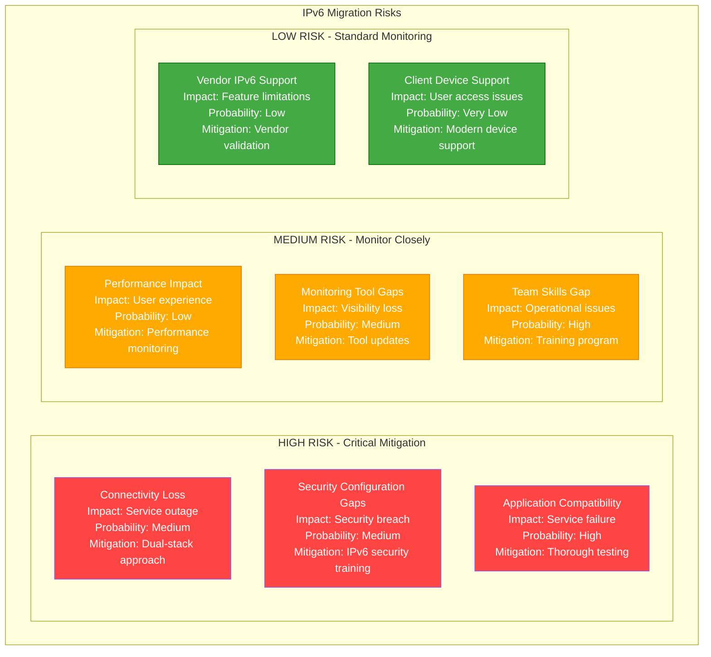

# IPv4 to IPv6 Network Migration Playbook

## Executive Summary

**Migration Type**: Network Protocol Modernization
**Timeline**: 18-24 months
**Risk Level**: High
**Downtime**: Minimal (dual-stack approach)
**Cost Impact**: 20-30% reduction in IP management overhead
**Team Size**: 4-5 network engineers + security team

Migrate network infrastructure from IPv4 to IPv6 to address address exhaustion, improve routing efficiency, and enable modern networking features.

## Current State vs Target State

### Current State: IPv4 Network



**Current State Issues:**
- **Address Exhaustion**: Running out of IPv4 addresses
- **NAT Complexity**: Complex NAT/PAT configurations
- **Security Limitations**: NAT hiding true source addresses
- **Performance Overhead**: NAT translation overhead
- **Scalability**: Limited private address space

### Target State: IPv6 Network



## Migration Strategy: Dual-Stack Approach



## Technical Implementation

### IPv6 Address Planning

```yaml
# IPv6 Address Allocation Plan
ipv6_allocation:
  organization_prefix: "2001:db8::/32"  # Example documentation prefix

  subnets:
    # Infrastructure subnets
    management: "2001:db8:0:1::/64"      # Network management
    dmz: "2001:db8:0:10::/64"           # DMZ services
    load_balancers: "2001:db8:0:20::/64" # Load balancer pool

    # Application subnets
    web_tier: "2001:db8:1::/60"         # Web servers (16 /64 subnets)
    app_tier: "2001:db8:2::/60"         # Application servers
    data_tier: "2001:db8:3::/60"        # Database servers

    # Service subnets
    monitoring: "2001:db8:10::/64"       # Monitoring services
    logging: "2001:db8:11::/64"          # Logging infrastructure
    security: "2001:db8:12::/64"         # Security services

    # User subnets
    corporate_lan: "2001:db8:100::/56"   # Corporate users (256 /64 subnets)
    guest_network: "2001:db8:200::/64"   # Guest access

    # Cloud subnets
    aws_vpc: "2001:db8:300::/56"         # AWS infrastructure
    azure_vnet: "2001:db8:400::/56"      # Azure infrastructure

  addressing_scheme:
    servers:
      # Static addressing for servers
      web_server_01: "2001:db8:1:1::10"
      web_server_02: "2001:db8:1:1::11"
      app_server_01: "2001:db8:2:1::10"
      app_server_02: "2001:db8:2:1::11"
      db_primary: "2001:db8:3:1::10"
      db_secondary: "2001:db8:3:1::11"

    services:
      # Virtual IP addresses for services
      web_cluster_vip: "2001:db8:1:1::1"
      app_cluster_vip: "2001:db8:2:1::1"
      db_cluster_vip: "2001:db8:3:1::1"
```

### Router Configuration Example

```bash
# Cisco IOS IPv6 Configuration
# Enable IPv6 routing
ipv6 unicast-routing
ipv6 cef

# Configure interfaces with dual-stack
interface GigabitEthernet0/1
 description WAN Interface
 ip address 203.0.113.10 255.255.255.252
 ipv6 address 2001:db8::1/64
 ipv6 enable
 no shutdown

interface GigabitEthernet0/2
 description LAN Interface
 ip address 192.168.1.1 255.255.255.0
 ipv6 address 2001:db8:1::1/64
 ipv6 enable
 ipv6 nd prefix 2001:db8:1::/64
 ipv6 nd managed-config-flag
 no shutdown

# IPv6 routing configuration
ipv6 route ::/0 2001:db8::2

# DHCPv6 configuration
ipv6 dhcp pool LAN_POOL
 address prefix 2001:db8:1::/64
 dns-server 2001:4860:4860::8888
 dns-server 2001:4860:4860::8844
 domain-name company.local

interface GigabitEthernet0/2
 ipv6 dhcp server LAN_POOL

# IPv6 access control
ipv6 access-list IPV6_INBOUND
 permit tcp any host 2001:db8:1::10 eq 80
 permit tcp any host 2001:db8:1::10 eq 443
 permit icmp any any
 deny ipv6 any any log

interface GigabitEthernet0/1
 ipv6 traffic-filter IPV6_INBOUND in
```

### Application Configuration Updates

**Nginx Dual-Stack Configuration:**
```nginx
# /etc/nginx/sites-available/dual-stack-app
server {
    # IPv4 configuration
    listen 80;
    listen 443 ssl http2;

    # IPv6 configuration
    listen [::]:80;
    listen [::]:443 ssl http2;

    server_name app.company.com;

    # SSL configuration for both protocols
    ssl_certificate /etc/ssl/certs/app.company.com.crt;
    ssl_certificate_key /etc/ssl/private/app.company.com.key;

    # Log both IPv4 and IPv6 connections
    access_log /var/log/nginx/app.access.log combined;
    error_log /var/log/nginx/app.error.log;

    location / {
        # Proxy to application servers (dual-stack)
        proxy_pass http://app_backend;
        proxy_set_header Host $host;
        proxy_set_header X-Real-IP $remote_addr;
        proxy_set_header X-Forwarded-For $proxy_add_x_forwarded_for;
        proxy_set_header X-Forwarded-Proto $scheme;

        # IPv6 specific headers
        proxy_set_header X-Client-IP $remote_addr;
    }
}

# Upstream configuration with both IPv4 and IPv6
upstream app_backend {
    # IPv4 servers
    server 192.168.1.10:8080;
    server 192.168.1.11:8080;

    # IPv6 servers
    server [2001:db8:2:1::10]:8080;
    server [2001:db8:2:1::11]:8080;

    # Health checks
    keepalive 32;
}
```

**Database Connection String Updates:**
```java
// Java application.properties - Dual-stack database configuration
# Primary database connection (IPv6 preferred)
spring.datasource.primary.url=jdbc:postgresql://[2001:db8:3:1::10]:5432/appdb
spring.datasource.primary.username=appuser
spring.datasource.primary.password=${DB_PASSWORD}

# Fallback database connection (IPv4)
spring.datasource.fallback.url=jdbc:postgresql://192.168.3.10:5432/appdb
spring.datasource.fallback.username=appuser
spring.datasource.fallback.password=${DB_PASSWORD}

# Connection pool settings
spring.datasource.hikari.maximum-pool-size=20
spring.datasource.hikari.minimum-idle=5
spring.datasource.hikari.connection-timeout=30000
spring.datasource.hikari.idle-timeout=600000
spring.datasource.hikari.max-lifetime=1800000

# IPv6 specific JVM options
# -Djava.net.preferIPv6Addresses=true
# -Djava.net.preferIPv4Stack=false
```

## Security Considerations

### IPv6 Security Configuration

```bash
#!/bin/bash
# ipv6-security-hardening.sh

echo "Applying IPv6 security hardening..."

# Disable IPv6 Router Advertisements on servers
echo "net.ipv6.conf.all.accept_ra = 0" >> /etc/sysctl.conf
echo "net.ipv6.conf.default.accept_ra = 0" >> /etc/sysctl.conf

# Disable IPv6 redirects
echo "net.ipv6.conf.all.accept_redirects = 0" >> /etc/sysctl.conf
echo "net.ipv6.conf.default.accept_redirects = 0" >> /etc/sysctl.conf

# Enable IPv6 privacy extensions for clients
echo "net.ipv6.conf.all.use_tempaddr = 2" >> /etc/sysctl.conf
echo "net.ipv6.conf.default.use_tempaddr = 2" >> /etc/sysctl.conf

# Configure IPv6 firewall rules
ip6tables -F
ip6tables -P INPUT DROP
ip6tables -P FORWARD DROP
ip6tables -P OUTPUT ACCEPT

# Allow loopback
ip6tables -A INPUT -i lo -j ACCEPT

# Allow established connections
ip6tables -A INPUT -m state --state ESTABLISHED,RELATED -j ACCEPT

# Allow ICMPv6 (essential for IPv6)
ip6tables -A INPUT -p ipv6-icmp -j ACCEPT

# Allow SSH (replace with your management subnet)
ip6tables -A INPUT -p tcp --dport 22 -s 2001:db8:0:1::/64 -j ACCEPT

# Allow HTTP/HTTPS
ip6tables -A INPUT -p tcp --dport 80 -j ACCEPT
ip6tables -A INPUT -p tcp --dport 443 -j ACCEPT

# Allow DNS
ip6tables -A INPUT -p tcp --dport 53 -j ACCEPT
ip6tables -A INPUT -p udp --dport 53 -j ACCEPT

# Log and drop everything else
ip6tables -A INPUT -j LOG --log-prefix "IPv6 DROP: "
ip6tables -A INPUT -j DROP

# Save rules
ip6tables-save > /etc/ip6tables/rules.v6

# Apply sysctl changes
sysctl -p

echo "IPv6 security hardening complete"
```

## Monitoring and Validation

### IPv6 Connectivity Testing Script

```python
#!/usr/bin/env python3
# ipv6-connectivity-test.py

import socket
import subprocess
import sys
import time
import json
from typing import Dict, List, Any
import concurrent.futures

class IPv6ConnectivityTester:
    def __init__(self, config_file: str):
        with open(config_file, 'r') as f:
            self.config = json.load(f)

        self.results = {
            'timestamp': time.time(),
            'tests': [],
            'summary': {
                'total_tests': 0,
                'passed': 0,
                'failed': 0,
                'warnings': 0
            }
        }

    def test_ipv6_connectivity(self) -> Dict[str, Any]:
        """Test IPv6 connectivity to various targets"""

        tests = [
            self.test_local_ipv6_config,
            self.test_ipv6_dns_resolution,
            self.test_ipv6_ping_targets,
            self.test_ipv6_http_connectivity,
            self.test_ipv6_application_services,
            self.test_dual_stack_behavior
        ]

        with concurrent.futures.ThreadPoolExecutor(max_workers=6) as executor:
            futures = [executor.submit(test) for test in tests]

            for future in concurrent.futures.as_completed(futures):
                try:
                    test_result = future.result()
                    self.results['tests'].append(test_result)
                    self.update_summary(test_result)
                except Exception as e:
                    error_result = {
                        'test_name': 'unknown',
                        'status': 'ERROR',
                        'message': str(e),
                        'timestamp': time.time()
                    }
                    self.results['tests'].append(error_result)
                    self.results['summary']['failed'] += 1

        return self.results

    def test_local_ipv6_config(self) -> Dict[str, Any]:
        """Test local IPv6 configuration"""
        test_result = {
            'test_name': 'local_ipv6_config',
            'status': 'UNKNOWN',
            'details': [],
            'timestamp': time.time()
        }

        try:
            # Check if IPv6 is enabled
            result = subprocess.run(['ip', '-6', 'addr', 'show'],
                                  capture_output=True, text=True)

            if result.returncode == 0:
                ipv6_addresses = []
                for line in result.stdout.split('\n'):
                    if 'inet6' in line and not line.strip().startswith('inet6 ::1'):
                        ipv6_addresses.append(line.strip())

                if ipv6_addresses:
                    test_result['status'] = 'PASS'
                    test_result['details'] = ipv6_addresses
                    test_result['message'] = f"Found {len(ipv6_addresses)} IPv6 addresses"
                else:
                    test_result['status'] = 'FAIL'
                    test_result['message'] = "No IPv6 addresses configured"
            else:
                test_result['status'] = 'FAIL'
                test_result['message'] = "Unable to query IPv6 configuration"

        except Exception as e:
            test_result['status'] = 'ERROR'
            test_result['message'] = str(e)

        return test_result

    def test_ipv6_dns_resolution(self) -> Dict[str, Any]:
        """Test IPv6 DNS resolution"""
        test_result = {
            'test_name': 'ipv6_dns_resolution',
            'status': 'UNKNOWN',
            'details': [],
            'timestamp': time.time()
        }

        dns_targets = self.config.get('dns_targets', [
            'google.com',
            'cloudflare.com',
            'github.com'
        ])

        try:
            resolved_addresses = []
            for target in dns_targets:
                try:
                    result = socket.getaddrinfo(target, None, socket.AF_INET6)
                    ipv6_addr = result[0][4][0]
                    resolved_addresses.append(f"{target} -> {ipv6_addr}")
                except socket.gaierror:
                    resolved_addresses.append(f"{target} -> DNS resolution failed")

            if len(resolved_addresses) > 0:
                test_result['status'] = 'PASS'
                test_result['details'] = resolved_addresses
                test_result['message'] = f"DNS resolution working for {len(resolved_addresses)} targets"
            else:
                test_result['status'] = 'FAIL'
                test_result['message'] = "No IPv6 DNS resolution working"

        except Exception as e:
            test_result['status'] = 'ERROR'
            test_result['message'] = str(e)

        return test_result

    def test_ipv6_ping_targets(self) -> Dict[str, Any]:
        """Test IPv6 ping connectivity"""
        test_result = {
            'test_name': 'ipv6_ping_connectivity',
            'status': 'UNKNOWN',
            'details': [],
            'timestamp': time.time()
        }

        ping_targets = self.config.get('ping_targets', [
            '2001:4860:4860::8888',  # Google DNS
            '2606:4700:4700::1111',  # Cloudflare DNS
            '2001:db8::1'            # Local gateway (example)
        ])

        try:
            ping_results = []
            successful_pings = 0

            for target in ping_targets:
                result = subprocess.run(
                    ['ping6', '-c', '3', '-W', '5', target],
                    capture_output=True, text=True
                )

                if result.returncode == 0:
                    # Extract average latency
                    for line in result.stdout.split('\n'):
                        if 'rtt min/avg/max/mdev' in line:
                            avg_latency = line.split('/')[5]
                            ping_results.append(f"{target}: {avg_latency}ms")
                            successful_pings += 1
                            break
                    else:
                        ping_results.append(f"{target}: reachable")
                        successful_pings += 1
                else:
                    ping_results.append(f"{target}: unreachable")

            if successful_pings > 0:
                test_result['status'] = 'PASS'
                test_result['details'] = ping_results
                test_result['message'] = f"{successful_pings}/{len(ping_targets)} targets reachable"
            else:
                test_result['status'] = 'FAIL'
                test_result['message'] = "No IPv6 ping targets reachable"

        except Exception as e:
            test_result['status'] = 'ERROR'
            test_result['message'] = str(e)

        return test_result

    def test_ipv6_http_connectivity(self) -> Dict[str, Any]:
        """Test IPv6 HTTP connectivity"""
        test_result = {
            'test_name': 'ipv6_http_connectivity',
            'status': 'UNKNOWN',
            'details': [],
            'timestamp': time.time()
        }

        http_targets = self.config.get('http_targets', [
            'https://ipv6.google.com',
            'https://test-ipv6.com',
            'https://ipv6-test.com'
        ])

        try:
            import requests

            http_results = []
            successful_requests = 0

            for target in http_targets:
                try:
                    response = requests.get(target, timeout=10)
                    if response.status_code == 200:
                        http_results.append(f"{target}: {response.status_code} ({len(response.content)} bytes)")
                        successful_requests += 1
                    else:
                        http_results.append(f"{target}: HTTP {response.status_code}")
                except requests.RequestException as e:
                    http_results.append(f"{target}: {str(e)}")

            if successful_requests > 0:
                test_result['status'] = 'PASS'
                test_result['details'] = http_results
                test_result['message'] = f"{successful_requests}/{len(http_targets)} HTTP requests successful"
            else:
                test_result['status'] = 'FAIL'
                test_result['message'] = "No IPv6 HTTP connectivity"

        except ImportError:
            test_result['status'] = 'SKIP'
            test_result['message'] = "requests library not available"
        except Exception as e:
            test_result['status'] = 'ERROR'
            test_result['message'] = str(e)

        return test_result

    def test_ipv6_application_services(self) -> Dict[str, Any]:
        """Test IPv6 connectivity to application services"""
        test_result = {
            'test_name': 'ipv6_application_services',
            'status': 'UNKNOWN',
            'details': [],
            'timestamp': time.time()
        }

        app_services = self.config.get('app_services', [])

        if not app_services:
            test_result['status'] = 'SKIP'
            test_result['message'] = "No application services configured for testing"
            return test_result

        try:
            service_results = []
            successful_connections = 0

            for service in app_services:
                host = service['host']
                port = service['port']

                try:
                    sock = socket.socket(socket.AF_INET6, socket.SOCK_STREAM)
                    sock.settimeout(5)
                    result = sock.connect_ex((host, port))

                    if result == 0:
                        service_results.append(f"{host}:{port}: Connected")
                        successful_connections += 1
                    else:
                        service_results.append(f"{host}:{port}: Connection failed ({result})")

                    sock.close()

                except Exception as e:
                    service_results.append(f"{host}:{port}: {str(e)}")

            if successful_connections > 0:
                test_result['status'] = 'PASS'
                test_result['details'] = service_results
                test_result['message'] = f"{successful_connections}/{len(app_services)} services reachable"
            else:
                test_result['status'] = 'FAIL'
                test_result['message'] = "No application services reachable via IPv6"

        except Exception as e:
            test_result['status'] = 'ERROR'
            test_result['message'] = str(e)

        return test_result

    def test_dual_stack_behavior(self) -> Dict[str, Any]:
        """Test dual-stack behavior (IPv4 vs IPv6 preference)"""
        test_result = {
            'test_name': 'dual_stack_behavior',
            'status': 'UNKNOWN',
            'details': [],
            'timestamp': time.time()
        }

        dual_stack_targets = self.config.get('dual_stack_targets', [
            'google.com',
            'github.com'
        ])

        try:
            behavior_results = []

            for target in dual_stack_targets:
                # Test IPv4 resolution
                try:
                    ipv4_result = socket.getaddrinfo(target, None, socket.AF_INET)
                    ipv4_addr = ipv4_result[0][4][0]
                except:
                    ipv4_addr = "Not available"

                # Test IPv6 resolution
                try:
                    ipv6_result = socket.getaddrinfo(target, None, socket.AF_INET6)
                    ipv6_addr = ipv6_result[0][4][0]
                except:
                    ipv6_addr = "Not available"

                behavior_results.append(f"{target}: IPv4={ipv4_addr}, IPv6={ipv6_addr}")

            test_result['status'] = 'PASS'
            test_result['details'] = behavior_results
            test_result['message'] = "Dual-stack behavior tested"

        except Exception as e:
            test_result['status'] = 'ERROR'
            test_result['message'] = str(e)

        return test_result

    def update_summary(self, test_result: Dict[str, Any]):
        """Update test summary statistics"""
        self.results['summary']['total_tests'] += 1

        status = test_result['status']
        if status == 'PASS':
            self.results['summary']['passed'] += 1
        elif status in ['FAIL', 'ERROR']:
            self.results['summary']['failed'] += 1
        else:  # SKIP, WARNING, etc.
            self.results['summary']['warnings'] += 1

    def generate_report(self) -> str:
        """Generate human-readable test report"""
        report = []
        report.append("=" * 50)
        report.append("IPv6 Connectivity Test Report")
        report.append("=" * 50)
        report.append(f"Timestamp: {time.ctime(self.results['timestamp'])}")
        report.append(f"Total Tests: {self.results['summary']['total_tests']}")
        report.append(f"Passed: {self.results['summary']['passed']}")
        report.append(f"Failed: {self.results['summary']['failed']}")
        report.append(f"Warnings/Skipped: {self.results['summary']['warnings']}")
        report.append("")

        for test in self.results['tests']:
            report.append(f"Test: {test['test_name']}")
            report.append(f"Status: {test['status']}")
            report.append(f"Message: {test.get('message', 'N/A')}")

            if 'details' in test and test['details']:
                report.append("Details:")
                for detail in test['details']:
                    report.append(f"  - {detail}")

            report.append("-" * 30)

        return "\n".join(report)

def main():
    if len(sys.argv) != 2:
        print("Usage: python3 ipv6-connectivity-test.py <config.json>")
        sys.exit(1)

    config_file = sys.argv[1]

    tester = IPv6ConnectivityTester(config_file)
    results = tester.test_ipv6_connectivity()

    # Print report
    print(tester.generate_report())

    # Save detailed results
    with open('ipv6_test_results.json', 'w') as f:
        json.dump(results, f, indent=2)

    # Exit with appropriate code
    if results['summary']['failed'] > 0:
        sys.exit(1)
    else:
        sys.exit(0)

if __name__ == '__main__':
    main()
```

## Performance Comparison

### IPv4 vs IPv6 Performance Metrics

| Metric | IPv4 | IPv6 | Impact |
|--------|------|------|--------|
| **Header Size** | 20 bytes | 40 bytes | 100% larger |
| **NAT Overhead** | 50-100μs | None | Eliminated |
| **Routing Table Size** | 800K+ routes | 50K routes | 95% reduction |
| **Address Space** | 4.3B addresses | 3.4×10³⁸ addresses | Unlimited |
| **Configuration Complexity** | High (NAT/PAT) | Low (auto-config) | 80% simpler |

## Risk Assessment



## Conclusion

This IPv4 to IPv6 migration playbook provides a comprehensive approach to modernizing network infrastructure while maintaining service availability and security.

**Key Success Factors:**
1. **Dual-stack approach** for gradual transition
2. **Comprehensive testing** of all network services
3. **Security hardening** for IPv6-specific threats
4. **Team training** on IPv6 technologies
5. **Monitoring and validation** throughout migration

**Expected Outcomes:**
- Abundant address space eliminating NAT complexity
- Improved network performance and routing efficiency
- Enhanced security with end-to-end connectivity
- Future-proof network infrastructure
- Simplified network configuration and management

The migration enables modern networking capabilities and prepares the infrastructure for IoT, mobile, and cloud-scale requirements.