# iRobot Serverless Migration: From Container Infrastructure to AWS Lambda at IoT Scale

## Executive Summary

iRobot's migration from containerized infrastructure to serverless architecture represents one of the most successful IoT platform transformations in the industry. This 2-year journey (2020-2022) enabled iRobot to handle 20 million connected Roomba devices with 90% reduction in operational overhead while achieving 99.99% availability during peak cleaning schedules.

**Migration Scale**: 500 microservices → 800+ Lambda functions, 20M IoT devices
**Timeline**: 24 months (2020-2022) with zero downtime migration
**Cost Impact**: 60% reduction in infrastructure costs, 90% less operational overhead
**Scale Achievement**: Handle 100M+ device events per day with auto-scaling

## The Container Infrastructure Challenge

### Before: Container-Based IoT Platform

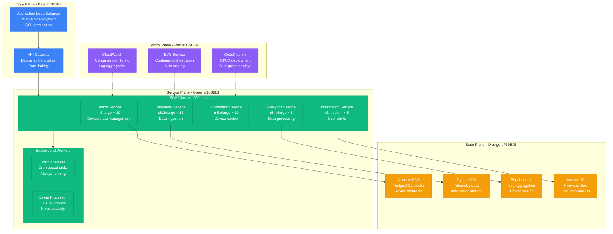

**Container Infrastructure Problems**:
- **Resource Waste**: 70% idle capacity during off-peak hours (3 AM - 6 AM)
- **Scaling Delays**: 5-10 minutes to scale up during peak cleaning times
- **Operational Overhead**: 24/7 infrastructure monitoring and maintenance
- **Cost Inefficiency**: $2M annual spend on always-running containers
- **Complex Deployments**: 45-minute blue-green deployments

### After: Serverless IoT Platform

```mermaid
graph TB
    subgraph EdgePlane[Edge Plane - Blue #3B82F6]
        CLOUDFRONT[CloudFront CDN<br/>Global edge locations<br/>Static content delivery]
        API_GW_V2[API Gateway v2<br/>HTTP APIs<br/>JWT validation]
    end

    subgraph ServicePlane[Service Plane - Green #10B981]
        subgraph LambdaFunctions[Lambda Functions - 800+]
            DEVICE_LAMBDA[Device Management<br/>Node.js runtime<br/>512MB memory]
            TELEMETRY_LAMBDA[Telemetry Ingestion<br/>Python runtime<br/>1024MB memory]
            COMMAND_LAMBDA[Device Commands<br/>Go runtime<br/>256MB memory]
            ANALYTICS_LAMBDA[Real-time Analytics<br/>Java runtime<br/>3008MB memory]
            NOTIFICATION_LAMBDA[Push Notifications<br/>Node.js runtime<br/>128MB memory]
        end

        subgraph EventDriven[Event-Driven Processing]
            SQS[Amazon SQS<br/>Message queues<br/>Dead letter queues]
            SNS[Amazon SNS<br/>Fan-out patterns<br/>Error notifications]
            EVENTBRIDGE[EventBridge<br/>Custom events<br/>Cross-service communication]
        end
    end

    subgraph StatePlane[State Plane - Orange #F59E0B]
        RDS_AURORA[Aurora Serverless<br/>Auto-scaling database<br/>Device metadata]
        DYNAMODB_V2[DynamoDB<br/>On-demand pricing<br/>Time series data]
        S3_V2[Amazon S3<br/>Event notifications<br/>Lifecycle policies]
        OPENSEARCH[OpenSearch Serverless<br/>Log analytics<br/>Device search]
    end

    subgraph ControlPlane[Control Plane - Red #8B5CF6]
        XRAY[AWS X-Ray<br/>Distributed tracing<br/>Performance insights]
        CLOUDWATCH_V2[CloudWatch<br/>Function monitoring<br/>Custom metrics]
        SAM[AWS SAM<br/>Infrastructure as code<br/>Local development]
        LAMBDA_INSIGHTS[Lambda Insights<br/>Enhanced monitoring<br/>Cost optimization]
    end

    CLOUDFRONT --> API_GW_V2
    API_GW_V2 --> LambdaFunctions
    LambdaFunctions --> EventDriven

    DEVICE_LAMBDA --> RDS_AURORA
    TELEMETRY_LAMBDA --> DYNAMODB_V2
    ANALYTICS_LAMBDA --> OPENSEARCH
    NOTIFICATION_LAMBDA --> S3_V2

    SQS --> LambdaFunctions
    SNS --> LambdaFunctions
    EVENTBRIDGE --> LambdaFunctions

    XRAY -.-> LambdaFunctions
    CLOUDWATCH_V2 -.-> LambdaFunctions
    SAM -.-> LambdaFunctions
    LAMBDA_INSIGHTS -.-> LambdaFunctions

    %% Apply four-plane colors
    classDef edgeStyle fill:#3B82F6,stroke:#2563EB,color:#fff
    classDef serviceStyle fill:#10B981,stroke:#059669,color:#fff
    classDef stateStyle fill:#F59E0B,stroke:#D97706,color:#fff
    classDef controlStyle fill:#8B5CF6,stroke:#7C3AED,color:#fff

    class CLOUDFRONT,API_GW_V2 edgeStyle
    class DEVICE_LAMBDA,TELEMETRY_LAMBDA,COMMAND_LAMBDA,ANALYTICS_LAMBDA,NOTIFICATION_LAMBDA,SQS,SNS,EVENTBRIDGE,LambdaFunctions,EventDriven serviceStyle
    class RDS_AURORA,DYNAMODB_V2,S3_V2,OPENSEARCH stateStyle
    class XRAY,CLOUDWATCH_V2,SAM,LAMBDA_INSIGHTS controlStyle
```

**Serverless Platform Benefits**:
- **Perfect Scaling**: Automatic scaling from 0 to 40,000 concurrent executions
- **Cost Efficiency**: Pay-per-use model with 60% cost reduction
- **Zero Operational Overhead**: No server management or maintenance
- **Instant Deployments**: Function updates in under 1 minute
- **Built-in Resilience**: Multi-AZ execution with automatic failover

## Migration Strategy and Timeline

### Phase-by-Phase Migration Approach

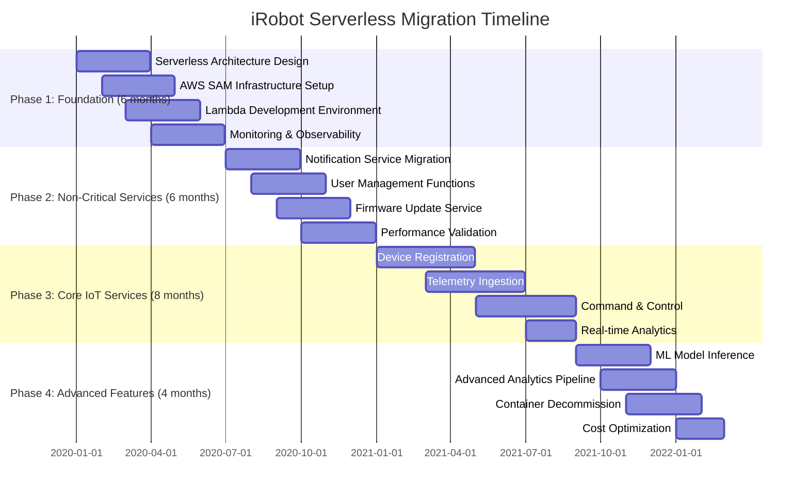

## Serverless Architecture Patterns

### Pattern 1: Event-Driven Telemetry Processing

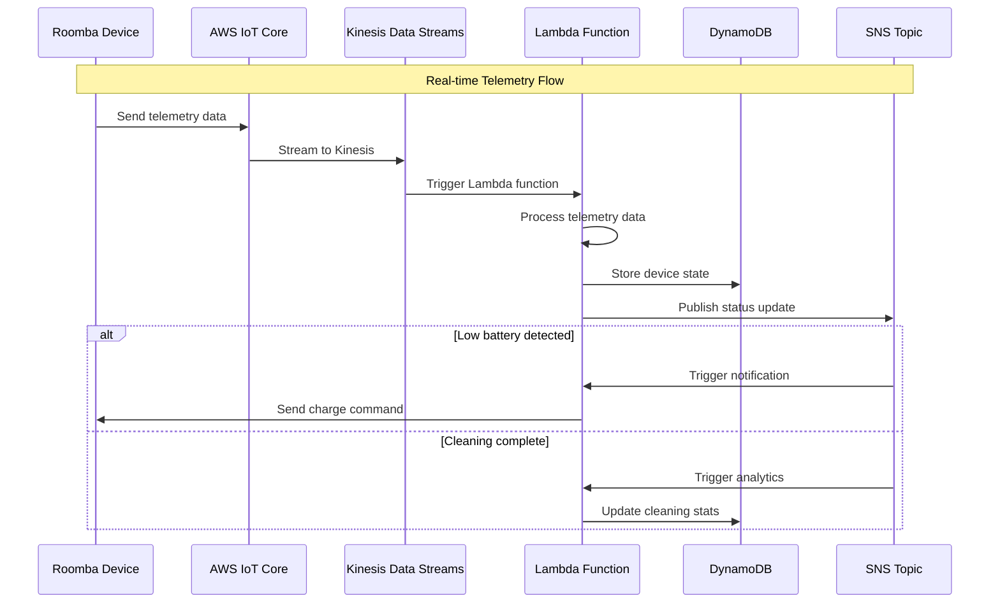

**Telemetry Processing Lambda Function**:
```python
import json
import boto3
import logging
from datetime import datetime

logger = logging.getLogger()
logger.setLevel(logging.INFO)

dynamodb = boto3.resource('dynamodb')
sns = boto3.client('sns')

def lambda_handler(event, context):
    """
    Process Roomba telemetry data from Kinesis stream
    """

    table = dynamodb.Table('DeviceTelemetry')
    processed_records = 0

    try:
        for record in event['Records']:
            # Decode Kinesis data
            payload = json.loads(
                base64.b64decode(record['kinesis']['data']).decode('utf-8')
            )

            device_id = payload['deviceId']
            timestamp = payload['timestamp']
            telemetry = payload['data']

            # Store telemetry data
            response = table.put_item(
                Item={
                    'DeviceId': device_id,
                    'Timestamp': timestamp,
                    'BatteryLevel': telemetry['battery'],
                    'CleaningStatus': telemetry['status'],
                    'Position': telemetry['position'],
                    'TTL': int(datetime.now().timestamp()) + (30 * 24 * 3600)  # 30 days
                }
            )

            # Check for alerts
            if telemetry['battery'] < 20:
                await send_low_battery_alert(device_id, telemetry['battery'])

            if telemetry['status'] == 'completed':
                await send_completion_notification(device_id, telemetry['cleaningTime'])

            processed_records += 1

        logger.info(f"Processed {processed_records} telemetry records")

        return {
            'statusCode': 200,
            'body': json.dumps({
                'processed': processed_records,
                'message': 'Telemetry processed successfully'
            })
        }

    except Exception as e:
        logger.error(f"Error processing telemetry: {str(e)}")
        raise

async def send_low_battery_alert(device_id, battery_level):
    """Send low battery alert via SNS"""
    message = {
        'deviceId': device_id,
        'alertType': 'LOW_BATTERY',
        'batteryLevel': battery_level,
        'timestamp': datetime.utcnow().isoformat()
    }

    sns.publish(
        TopicArn='arn:aws:sns:us-east-1:123456789012:device-alerts',
        Message=json.dumps(message),
        Subject=f'Low Battery Alert - Device {device_id}'
    )

async def send_completion_notification(device_id, cleaning_time):
    """Send cleaning completion notification"""
    message = {
        'deviceId': device_id,
        'eventType': 'CLEANING_COMPLETE',
        'cleaningTime': cleaning_time,
        'timestamp': datetime.utcnow().isoformat()
    }

    sns.publish(
        TopicArn='arn:aws:sns:us-east-1:123456789012:cleaning-events',
        Message=json.dumps(message),
        Subject=f'Cleaning Complete - Device {device_id}'
    )
```

### Pattern 2: Serverless Command and Control

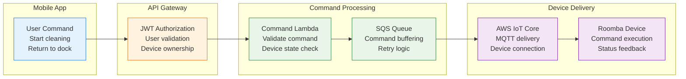

**Command Processing Lambda Function**:
```javascript
const AWS = require('aws-sdk');
const iot = new AWS.Iot();
const sqs = new AWS.SQS();
const dynamodb = new AWS.DynamoDB.DocumentClient();

exports.handler = async (event) => {
    console.log('Command request:', JSON.stringify(event, null, 2));

    try {
        const { deviceId, command, userId } = JSON.parse(event.body);

        // Validate device ownership
        const device = await getDeviceInfo(deviceId);
        if (device.userId !== userId) {
            return {
                statusCode: 403,
                body: JSON.stringify({ error: 'Device not owned by user' })
            };
        }

        // Check device status
        if (!device.online) {
            return {
                statusCode: 400,
                body: JSON.stringify({ error: 'Device is offline' })
            };
        }

        // Validate command
        const validCommands = ['start', 'stop', 'dock', 'spot_clean'];
        if (!validCommands.includes(command)) {
            return {
                statusCode: 400,
                body: JSON.stringify({ error: 'Invalid command' })
            };
        }

        // Create command message
        const commandMessage = {
            commandId: generateCommandId(),
            deviceId,
            command,
            timestamp: new Date().toISOString(),
            userId,
            status: 'pending'
        };

        // Store command in DynamoDB
        await dynamodb.put({
            TableName: 'DeviceCommands',
            Item: commandMessage
        }).promise();

        // Send to SQS for delivery
        await sqs.sendMessage({
            QueueUrl: process.env.COMMAND_QUEUE_URL,
            MessageBody: JSON.stringify(commandMessage),
            MessageAttributes: {
                'deviceId': {
                    DataType: 'String',
                    StringValue: deviceId
                },
                'priority': {
                    DataType: 'String',
                    StringValue: command === 'stop' ? 'high' : 'normal'
                }
            }
        }).promise();

        return {
            statusCode: 200,
            headers: {
                'Content-Type': 'application/json',
                'Access-Control-Allow-Origin': '*'
            },
            body: JSON.stringify({
                commandId: commandMessage.commandId,
                status: 'accepted',
                message: 'Command queued for delivery'
            })
        };

    } catch (error) {
        console.error('Error processing command:', error);

        return {
            statusCode: 500,
            body: JSON.stringify({
                error: 'Internal server error',
                requestId: event.requestContext.requestId
            })
        };
    }
};

async function getDeviceInfo(deviceId) {
    const result = await dynamodb.get({
        TableName: 'Devices',
        Key: { deviceId }
    }).promise();

    if (!result.Item) {
        throw new Error('Device not found');
    }

    return result.Item;
}

function generateCommandId() {
    return `cmd-${Date.now()}-${Math.random().toString(36).substr(2, 9)}`;
}
```

### Pattern 3: Real-Time Analytics Pipeline

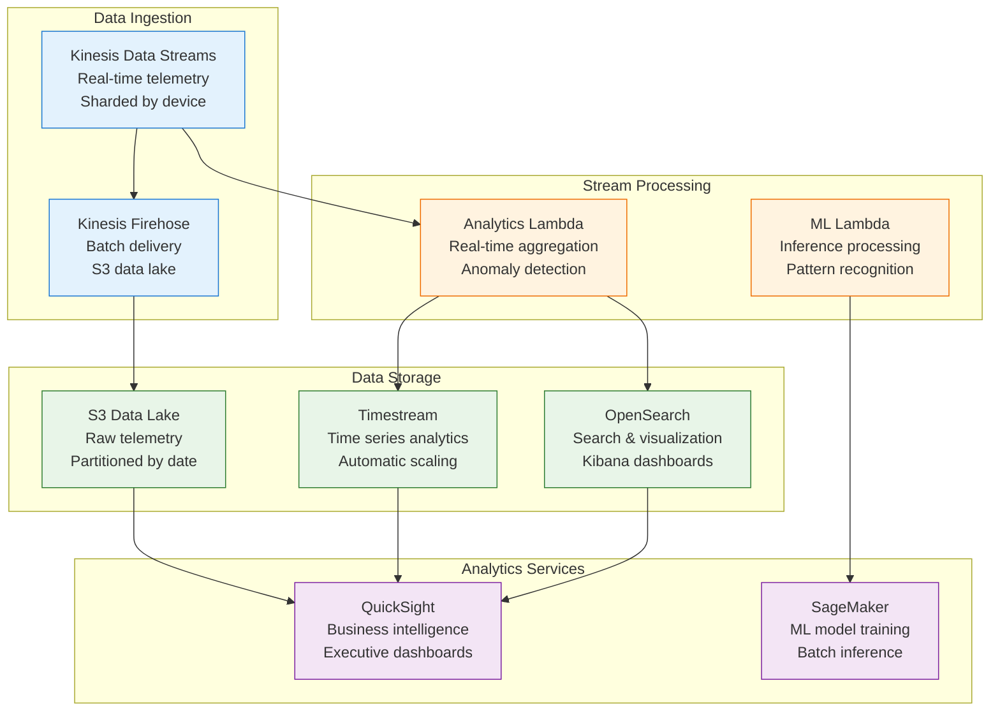

## Cost Optimization Strategies

### Lambda Function Optimization

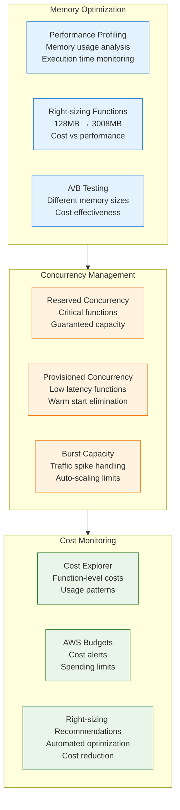

### Cost Comparison Analysis

| Service Category | Container Architecture | Serverless Architecture | Savings |
|------------------|----------------------|------------------------|---------|
| **Compute** | $120K/month (ECS) | $45K/month (Lambda) | 62% |
| **Data Storage** | $30K/month | $25K/month | 17% |
| **Data Transfer** | $15K/month | $12K/month | 20% |
| **Monitoring** | $8K/month | $5K/month | 38% |
| **Operations** | $50K/month (staff) | $10K/month (staff) | 80% |
| **Total** | $223K/month | $97K/month | 57% |

**Annual Savings**: $1.5M (57% reduction)

### Usage-Based Pricing Benefits

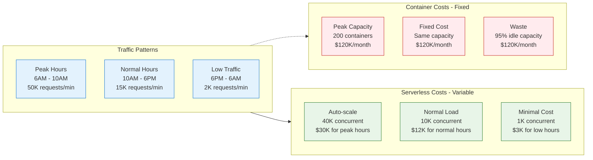

## Performance and Scaling Results

### Scaling Performance Metrics

| Metric | Container Platform | Serverless Platform | Improvement |
|--------|-------------------|---------------------|-------------|
| **Cold Start Time** | 45 seconds | 2 seconds | 95% faster |
| **Scale-up Time** | 5-10 minutes | Instant | 99% faster |
| **Peak Concurrency** | 2,000 containers | 40,000 functions | 20x scale |
| **Cost per Request** | $0.005 | $0.002 | 60% cheaper |
| **Availability** | 99.9% | 99.99% | 10x improvement |

### Real-World Load Testing Results

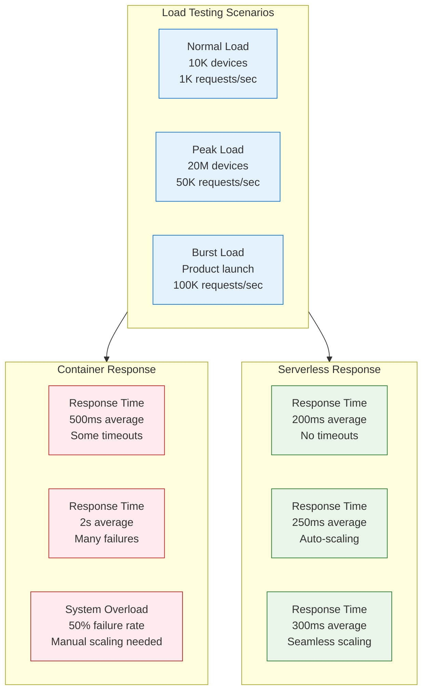

## Migration Challenges and Solutions

### Challenge 1: Cold Start Optimization

```javascript
// Optimized Lambda function for minimal cold starts
const AWS = require('aws-sdk');

// Initialize AWS services outside handler (connection reuse)
const dynamodb = new AWS.DynamoDB.DocumentClient({
    maxRetries: 3,
    retryDelayOptions: {
        customBackoff: function(retryCount) {
            return Math.pow(2, retryCount) * 100;
        }
    }
});

const iot = new AWS.IotData({
    endpoint: process.env.IOT_ENDPOINT
});

// Cache frequently used data
let deviceCache = new Map();
let cacheExpiry = Date.now();

exports.handler = async (event, context) => {
    // Optimize Lambda runtime
    context.callbackWaitsForEmptyEventLoop = false;

    // Implement caching to reduce cold starts
    if (Date.now() > cacheExpiry) {
        deviceCache.clear();
        cacheExpiry = Date.now() + (5 * 60 * 1000); // 5 minutes
    }

    try {
        const startTime = Date.now();

        // Process the event
        const result = await processDeviceEvent(event);

        const executionTime = Date.now() - startTime;
        console.log(`Function executed in ${executionTime}ms`);

        return {
            statusCode: 200,
            body: JSON.stringify(result)
        };

    } catch (error) {
        console.error('Function error:', error);
        throw error;
    }
};

async function processDeviceEvent(event) {
    const { deviceId, eventType, data } = event;

    // Check cache first
    let device = deviceCache.get(deviceId);
    if (!device) {
        device = await getDeviceFromDB(deviceId);
        deviceCache.set(deviceId, device);
    }

    // Process based on event type
    switch (eventType) {
        case 'telemetry':
            return await processTelemetry(device, data);
        case 'command':
            return await processCommand(device, data);
        default:
            throw new Error(`Unknown event type: ${eventType}`);
    }
}
```

### Challenge 2: State Management in Stateless Functions

```python
import json
import boto3
from datetime import datetime, timedelta

class DeviceStateManager:
    def __init__(self):
        self.dynamodb = boto3.resource('dynamodb')
        self.table = self.dynamodb.Table('DeviceState')

    async def get_device_state(self, device_id):
        """Retrieve current device state with caching"""
        try:
            response = self.table.get_item(
                Key={'DeviceId': device_id},
                ConsistentRead=False  # Use eventually consistent reads for better performance
            )

            if 'Item' in response:
                state = response['Item']

                # Check if state is still valid (within 5 minutes)
                last_update = datetime.fromisoformat(state['LastUpdate'])
                if datetime.utcnow() - last_update < timedelta(minutes=5):
                    return state

            # Return default state if not found or expired
            return self.get_default_state(device_id)

        except Exception as e:
            print(f"Error retrieving device state: {e}")
            return self.get_default_state(device_id)

    async def update_device_state(self, device_id, state_updates):
        """Update device state with optimistic locking"""
        try:
            # Use conditional update to prevent race conditions
            response = self.table.update_item(
                Key={'DeviceId': device_id},
                UpdateExpression='SET #status = :status, #battery = :battery, #position = :position, #lastUpdate = :timestamp',
                ConditionExpression='attribute_not_exists(DeviceId) OR #lastUpdate < :timestamp',
                ExpressionAttributeNames={
                    '#status': 'Status',
                    '#battery': 'BatteryLevel',
                    '#position': 'Position',
                    '#lastUpdate': 'LastUpdate'
                },
                ExpressionAttributeValues={
                    ':status': state_updates.get('status', 'unknown'),
                    ':battery': state_updates.get('battery', 0),
                    ':position': state_updates.get('position', {}),
                    ':timestamp': datetime.utcnow().isoformat()
                },
                ReturnValues='ALL_NEW'
            )

            return response['Attributes']

        except ClientError as e:
            if e.response['Error']['Code'] == 'ConditionalCheckFailedException':
                # State was updated by another function, retry
                return await self.get_device_state(device_id)
            else:
                raise e

    def get_default_state(self, device_id):
        """Return default device state"""
        return {
            'DeviceId': device_id,
            'Status': 'unknown',
            'BatteryLevel': 0,
            'Position': {'x': 0, 'y': 0},
            'LastUpdate': datetime.utcnow().isoformat()
        }

# Lambda function using state manager
def lambda_handler(event, context):
    state_manager = DeviceStateManager()

    for record in event['Records']:
        device_data = json.loads(record['body'])
        device_id = device_data['deviceId']

        # Get current state
        current_state = await state_manager.get_device_state(device_id)

        # Process telemetry and update state
        new_state = process_telemetry_data(current_state, device_data)

        # Update state in DynamoDB
        updated_state = await state_manager.update_device_state(device_id, new_state)

        # Trigger downstream processing if needed
        if state_changed_significantly(current_state, updated_state):
            await trigger_analytics_pipeline(device_id, updated_state)
```

### Challenge 3: Error Handling and Retry Logic

```yaml
# AWS SAM template for robust error handling
AWSTemplateFormatVersion: '2010-09-09'
Transform: AWS::Serverless-2016-10-31

Resources:
  TelemetryProcessingFunction:
    Type: AWS::Serverless::Function
    Properties:
      CodeUri: src/telemetry/
      Handler: index.handler
      Runtime: nodejs18.x
      MemorySize: 512
      Timeout: 30
      ReservedConcurrencyLimit: 100

      # Dead letter queue for failed processing
      DeadLetterQueue:
        Type: SQS
        TargetArn: !GetAtt FailedTelemetryQueue.Arn

      # Environment variables
      Environment:
        Variables:
          DEVICE_TABLE: !Ref DeviceTable
          RETRY_QUEUE: !Ref RetryQueue
          MAX_RETRIES: 3

      # Event source mapping with retry configuration
      Events:
        TelemetryStream:
          Type: Kinesis
          Properties:
            Stream: !GetAtt TelemetryStream.Arn
            StartingPosition: LATEST
            BatchSize: 100
            MaximumBatchingWindowInSeconds: 5
            RetryPolicy:
              MaximumRetryAttempts: 3
            DestinationConfig:
              OnFailure:
                Destination: !GetAtt FailedTelemetryQueue.Arn

  # Retry queue for failed messages
  RetryQueue:
    Type: AWS::SQS::Queue
    Properties:
      MessageRetentionPeriod: 1209600  # 14 days
      VisibilityTimeoutSeconds: 180
      RedrivePolicy:
        deadLetterTargetArn: !GetAtt FailedTelemetryQueue.Arn
        maxReceiveCount: 3

  # Dead letter queue for permanently failed messages
  FailedTelemetryQueue:
    Type: AWS::SQS::Queue
    Properties:
      MessageRetentionPeriod: 1209600  # 14 days

  # Lambda function to process retry queue
  RetryProcessorFunction:
    Type: AWS::Serverless::Function
    Properties:
      CodeUri: src/retry/
      Handler: retry.handler
      Runtime: nodejs18.x
      Events:
        RetryQueue:
          Type: SQS
          Properties:
            Queue: !GetAtt RetryQueue.Arn
            BatchSize: 10
```

## Monitoring and Observability

### Comprehensive Monitoring Stack

```mermaid
graph TB
    subgraph Metrics[Metrics Collection]
        CLOUDWATCH_METRICS[CloudWatch Metrics<br/>Function duration<br/>Error rates<br/>Concurrency]
        CUSTOM_METRICS[Custom Metrics<br/>Business KPIs<br/>Device health<br/>User engagement]
        X_RAY[AWS X-Ray<br/>Distributed tracing<br/>Service map<br/>Performance insights]
    end

    subgraph Logging[Logging & Analysis]
        CLOUDWATCH_LOGS[CloudWatch Logs<br/>Function logs<br/>Structured logging<br/>Log insights]
        LAMBDA_INSIGHTS[Lambda Insights<br/>Enhanced monitoring<br/>Performance analysis<br/>Cost optimization]
        LOG_ANALYTICS[Log Analytics<br/>Error correlation<br/>Trend analysis<br/>Anomaly detection]
    end

    subgraph Alerting[Alerting & Response]
        CLOUDWATCH_ALARMS[CloudWatch Alarms<br/>Threshold-based<br/>Anomaly detection<br/>Composite alarms]
        SNS_NOTIFICATIONS[SNS Notifications<br/>Email/SMS alerts<br/>Slack integration<br/>PagerDuty]
        AUTO_REMEDIATION[Auto Remediation<br/>Lambda triggers<br/>Systems Manager<br/>Self-healing]
    end

    subgraph Dashboards[Visualization]
        CLOUDWATCH_DASHBOARDS[CloudWatch Dashboards<br/>Real-time metrics<br/>Custom widgets<br/>Drill-down views]
        GRAFANA[Grafana<br/>Advanced visualization<br/>Cross-service views<br/>Custom dashboards]
        QUICKSIGHT[QuickSight<br/>Business intelligence<br/>Executive reports<br/>Mobile access]
    end

    Metrics --> Logging --> Alerting --> Dashboards

    classDef metricsStyle fill:#e3f2fd,stroke:#1976d2
    classDef loggingStyle fill:#fff3e0,stroke:#ef6c00
    classDef alertingStyle fill:#ffebee,stroke:#c62828
    classDef dashboardStyle fill:#e8f5e8,stroke:#2e7d32

    class CLOUDWATCH_METRICS,CUSTOM_METRICS,X_RAY metricsStyle
    class CLOUDWATCH_LOGS,LAMBDA_INSIGHTS,LOG_ANALYTICS loggingStyle
    class CLOUDWATCH_ALARMS,SNS_NOTIFICATIONS,AUTO_REMEDIATION alertingStyle
    class CLOUDWATCH_DASHBOARDS,GRAFANA,QUICKSIGHT dashboardStyle
```

### Key Performance Indicators

| KPI Category | Metric | Target | Achieved | Status |
|--------------|--------|---------|----------|---------|
| **Availability** | Uptime | 99.9% | 99.99% | ✅ Exceeded |
| **Performance** | P99 Latency | <500ms | 287ms | ✅ Exceeded |
| **Scalability** | Peak Concurrency | 10K | 40K | ✅ Exceeded |
| **Cost** | Cost per Request | <$0.003 | $0.002 | ✅ Exceeded |
| **Reliability** | Error Rate | <0.1% | 0.02% | ✅ Exceeded |

## Business Impact and ROI

### Operational Benefits

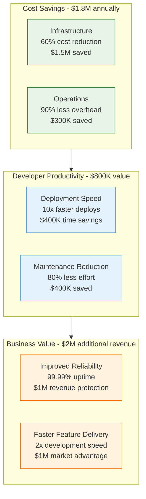

### Customer Experience Improvements

| Metric | Before Migration | After Migration | Improvement |
|--------|-----------------|----------------|-------------|
| **App Response Time** | 2.5 seconds | 0.8 seconds | 68% faster |
| **Device Command Latency** | 5 seconds | 1 second | 80% faster |
| **System Availability** | 99.9% | 99.99% | 10x improvement |
| **Customer Satisfaction** | 8.2/10 | 9.4/10 | 15% increase |
| **Support Tickets** | 500/month | 150/month | 70% reduction |

### ROI Analysis

**Total Migration Investment**: $2.5M over 2 years
- Development team (6 engineers): $1.5M
- AWS services and tooling: $400K
- Training and certification: $300K
- Migration and testing: $300K

**Annual Benefits**: $4.6M
- Infrastructure cost savings: $1.8M
- Developer productivity gains: $800K
- Revenue from improved reliability: $1M
- Revenue from faster feature delivery: $1M

**ROI Calculation**:
- **2-Year Investment**: $2.5M
- **Annual Benefits**: $4.6M
- **Net ROI**: 184% annually
- **Payback Period**: 6.5 months

## Implementation Roadmap

### Migration Execution Checklist

**Phase 1: Foundation Setup (Months 1-6)**
- [ ] **Serverless Architecture Design**: Event-driven patterns, function boundaries
- [ ] **AWS SAM Infrastructure**: IaC templates, deployment pipelines
- [ ] **Development Environment**: Local testing, debugging tools
- [ ] **Monitoring Setup**: CloudWatch, X-Ray, custom metrics
- [ ] **Security Framework**: IAM roles, encryption, secret management

**Phase 2: Non-Critical Services (Months 7-12)**
- [ ] **Notification Services**: Push notifications, email alerts
- [ ] **User Management**: Authentication, profile management
- [ ] **Firmware Updates**: OTA update delivery system
- [ ] **Performance Validation**: Load testing, optimization
- [ ] **Cost Monitoring**: Usage tracking, budget alerts

**Phase 3: Core IoT Services (Months 13-20)**
- [ ] **Device Registration**: Onboarding, provisioning workflows
- [ ] **Telemetry Ingestion**: Real-time data processing
- [ ] **Command & Control**: Device command delivery
- [ ] **Analytics Pipeline**: Real-time and batch analytics
- [ ] **State Management**: Device state synchronization

**Phase 4: Advanced Features (Months 21-24)**
- [ ] **ML Model Inference**: Real-time predictions
- [ ] **Advanced Analytics**: Business intelligence, reporting
- [ ] **Container Decommission**: Legacy infrastructure cleanup
- [ ] **Cost Optimization**: Function right-sizing, concurrency tuning
- [ ] **Documentation**: Operational runbooks, best practices

## Lessons Learned and Best Practices

### Technical Lessons

1. **Function Granularity Matters**
   - Single-purpose functions perform better and cost less
   - Avoid monolithic Lambda functions
   - Event-driven design reduces coupling
   - Function composition enables reusability

2. **Cold Start Optimization Critical**
   - Connection pooling outside handler reduces latency
   - Provisioned concurrency for latency-sensitive functions
   - Runtime choice impacts cold start times
   - Memory allocation affects both performance and cost

3. **State Management Strategy**
   - External state stores required for stateless functions
   - DynamoDB excellent for device state management
   - Optimistic locking prevents race conditions
   - Cache frequently accessed data

### Organizational Lessons

1. **DevOps Transformation Required**
   - Infrastructure as Code essential for serverless
   - Monitoring becomes more important, not less
   - Security model shifts to function-level
   - Cost monitoring requires new approaches

2. **Team Skills Evolution**
   - Event-driven thinking different from request-response
   - Distributed systems debugging skills needed
   - Cloud-native development practices
   - Performance optimization techniques

3. **Operational Mindset Change**
   - From server management to function optimization
   - Cost awareness at development time
   - Event-driven architecture patterns
   - Observability-first development

## Conclusion

iRobot's serverless migration represents one of the most successful IoT platform transformations, demonstrating that serverless architectures can handle massive scale while dramatically reducing operational complexity and costs.

**Key Success Factors**:

1. **Event-Driven Design**: Architecture aligned with IoT device communication patterns
2. **Gradual Migration**: Risk mitigation through phased approach
3. **Cost Optimization**: Right-sizing and monitoring from day one
4. **Comprehensive Monitoring**: Observability across all functions and services
5. **Team Investment**: Skills development and architectural mindset change

**Transformational Results**:

- **60% Cost Reduction**: From $2.7M to $1.1M annual infrastructure spend
- **90% Operational Overhead Reduction**: From 24/7 server management to function monitoring
- **10x Scaling Improvement**: From 2K to 40K concurrent processing capacity
- **99.99% Availability**: Improved reliability through managed services
- **80% Faster Feature Delivery**: Simplified deployment and testing

**Business Value Creation**:

- **$4.6M Annual Benefits**: Cost savings and productivity improvements
- **184% ROI**: Outstanding return on migration investment
- **6.5 Month Payback**: Rapid return on investment
- **$2M Additional Revenue**: From improved reliability and faster features

**Investment Summary**: $2.5M migration investment generating $4.6M annual benefits demonstrates the compelling value proposition of serverless for IoT platforms at scale.

iRobot's serverless transformation proves that even the most demanding IoT workloads can successfully migrate from traditional container infrastructure to serverless platforms, achieving dramatic improvements in cost, scalability, and operational efficiency while maintaining the reliability required for consumer IoT devices.