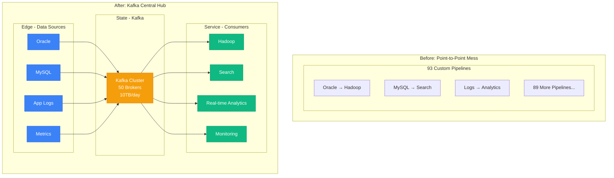
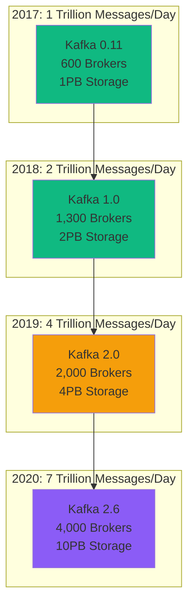
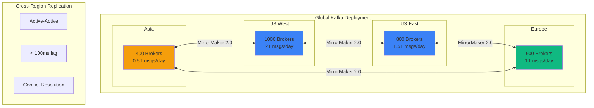
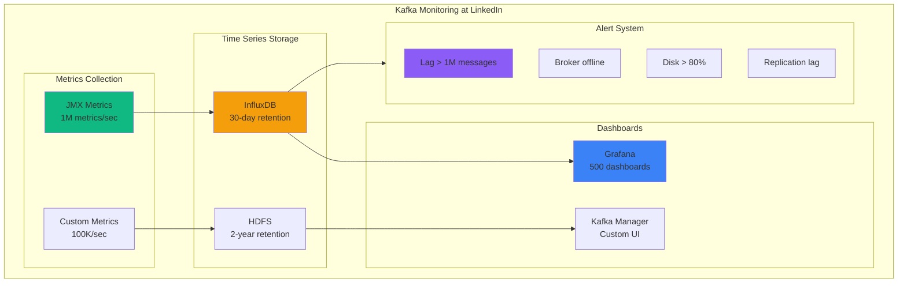

# LinkedIn's Kafka Evolution: Creating and Scaling the Stream Processing Revolution

## Executive Summary
LinkedIn created Apache Kafka in 2011, migrated their entire data infrastructure to it, and now processes 7 trillion messages/day. This is the story of inventing and dogfooding the world's most popular streaming platform.

## The Problem That Created Kafka (2010)

```mermaid
graph TB
    subgraph LinkedIn's Data Pipeline Hell (2010)
        subgraph Sources[14 Data Sources]
            DB1[(Oracle DB)]
            DB2[(MySQL)]
            LOGS[Application Logs]
            METRICS[Metrics]
        end

        subgraph Pipelines[Point-to-Point Chaos]
            P1[Pipeline 1<br/>Oracle→Hadoop]
            P2[Pipeline 2<br/>MySQL→Search]
            P3[Pipeline 3<br/>Logs→Analytics]
            P4[Pipeline 4<br/>Metrics→Monitoring]
            P5[... 89 more pipelines]
        end

        subgraph Destinations[12 Destinations]
            HADOOP[Hadoop]
            SEARCH[Search Index]
            CACHE[Memcached]
            DW[Data Warehouse]
        end

        DB1 --> P1 --> HADOOP
        DB2 --> P2 --> SEARCH
        LOGS --> P3 --> DW
        METRICS --> P4 --> CACHE
    end

    subgraph Problems[Critical Issues]
        PROB1[93 Custom Pipelines]
        PROB2[No Real-time Processing]
        PROB3[3-Day Data Delays]
        PROB4[50% Engineering Time on Plumbing]
    end

    style PROB1 fill:#8B5CF6
    style PROB2 fill:#8B5CF6
    style PROB3 fill:#8B5CF6
    style PROB4 fill:#8B5CF6
```

## Phase 1: Building Kafka (2011)

### Initial Design Principles
```python
# LinkedIn's Kafka Design Goals (2011)
kafka_principles = {
    "throughput": "1M messages/sec on commodity hardware",
    "latency": "< 10ms end-to-end",
    "durability": "No data loss with replication",
    "scalability": "Horizontal scaling without downtime",
    "simplicity": "Simple producer/consumer API",

    # Key Innovations
    "innovations": {
        "sequential_io": "Append-only log structure",
        "zero_copy": "Direct network→disk transfer",
        "batching": "Amortize network overhead",
        "partitioning": "Parallel consumption",
        "replication": "In-sync replicas for fault tolerance"
    }
}

# Performance achieved (2011)
initial_benchmarks = {
    "single_producer": "820,000 messages/sec",
    "single_consumer": "1.2M messages/sec",
    "latency_p99": "5ms",
    "hardware": "$6,000 commodity server"
}
```

### First Production Deployment
```mermaid
graph LR
    subgraph Kafka 0.7 at LinkedIn (2011)
        subgraph Producers[Producers]
            APP1[Profile Service]
            APP2[Connection Service]
            APP3[Feed Service]
        end

        subgraph KafkaCluster[Kafka Cluster - 3 Nodes]
            B1[Broker 1<br/>8GB RAM]
            B2[Broker 2<br/>8GB RAM]
            B3[Broker 3<br/>8GB RAM]
            ZK[ZooKeeper]
        end

        subgraph Consumers[Consumers]
            HADOOP2[Hadoop Ingestion]
            SEARCH2[Search Indexing]
            METRICS2[Metrics Processing]
        end

        APP1 --> B1
        APP2 --> B2
        APP3 --> B3
        B1 <--> B2 <--> B3
        B1 --> HADOOP2
        B2 --> SEARCH2
        B3 --> METRICS2
    end

    style B1 fill:#F59E0B
    style B2 fill:#F59E0B
    style B3 fill:#F59E0B
```

Initial Production Metrics:
- **Message Rate**: 10M messages/day
- **Data Volume**: 1TB/day
- **Clusters**: 1 production cluster
- **Use Cases**: 3 (logging, metrics, activity tracking)

## Phase 2: Internal Migration (2012-2013)

### Replacing Point-to-Point Pipelines


### Migration Timeline
```yaml
2012_q1:
  migrated: "Metrics pipeline"
  volume: "100M messages/day"
  result: "Real-time metrics (was 24hr delay)"

2012_q2:
  migrated: "Activity tracking"
  volume: "500M events/day"
  result: "Real-time feed updates"

2012_q3:
  migrated: "Database changelogs"
  volume: "1B changes/day"
  result: "Near real-time search indexing"

2012_q4:
  migrated: "Log aggregation"
  volume: "10TB/day"
  result: "Unified logging infrastructure"

2013_q1:
  migrated: "All remaining pipelines"
  total_pipelines_replaced: 93
  engineering_time_saved: "40%"
```

## Phase 3: Kafka Ecosystem Development (2014-2016)

### Building Kafka Connect
```python
# Problem: Too many custom connectors
class LegacyConnectorHell:
    def __init__(self):
        self.custom_connectors = {
            "oracle_to_kafka": 5000,  # Lines of code
            "mysql_to_kafka": 3000,
            "hadoop_to_kafka": 4000,
            "elasticsearch_from_kafka": 3500,
            # ... 47 more custom connectors
        }
        self.maintenance_hours_per_week = 120
        self.bugs_per_month = 45

# Solution: Kafka Connect Framework
class KafkaConnect:
    """Standardized connector framework"""

    def create_connector(self, config):
        return {
            "name": config[name],
            "connector.class": config[connector],
            "tasks.max": config.get("parallelism", 1),
            "topics": config[topics],

            # Automatic features
            "offset_management": "automatic",
            "error_handling": "built-in",
            "monitoring": "jmx_metrics",
            "scaling": "dynamic_rebalancing"
        }

# Result: 50 connectors → 1 framework
connect_impact = {
    "code_reduction": "95%",  # 200K lines → 10K
    "time_to_deploy": "5 days → 1 hour",
    "maintenance": "120 hrs/week → 10 hrs/week"
}
```

### Building Kafka Streams
```java
// Before: Complex Storm topology for stream processing
public class StormPageViewCounter {
    // 500+ lines of boilerplate code
    // Complex deployment and state management
    // Poor performance: 10K messages/sec
}

// After: Simple Kafka Streams application
public class KafkaStreamsPageViewCounter {
    public static void main(String[] args) {
        StreamsBuilder builder = new StreamsBuilder();

        builder.stream("page-views")
            .groupBy((key, value) -> value.getPageId())
            .count(Materialized.as("page-view-counts"))
            .toStream()
            .to("page-view-stats");

        // That's it! 10 lines vs 500
        // Performance: 100K messages/sec
        // Built-in state management and fault tolerance
    }
}
```

## Phase 4: Massive Scale (2017-2020)

### Infrastructure Evolution


### Multi-Region Architecture


## Phase 5: Current State (2024)

### Production Metrics
```yaml
scale_metrics:
  messages_per_day: 7_000_000_000_000  # 7 trillion
  data_ingested_per_day: 25PB
  peak_messages_per_second: 100_000_000  # 100M

infrastructure:
  brokers: 4000
  clusters: 100
  regions: 10
  hardware_cost: $45M/year

usage:
  internal_applications: 3000
  unique_topics: 100_000
  consumer_groups: 50_000

reliability:
  availability: 99.99%
  data_loss: 0
  p99_latency: 10ms

team:
  kafka_core_team: 30 engineers
  platform_team: 50 engineers
  total_users: 5000 engineers
```

### Cost Analysis
```python
# Infrastructure costs breakdown
kafka_costs = {
    "hardware": {
        "brokers": "$30M/year",  # 4000 servers
        "network": "$10M/year",  # 25PB/day transfer
        "storage": "$5M/year",   # 10PB SSD
    },
    "operations": {
        "engineering": "$12M/year",  # 80 engineers
        "monitoring": "$2M/year",    # Datadog, etc.
        "security": "$1M/year",
    },
    "total": "$60M/year",

    # Value delivered
    "value": {
        "eliminated_pipelines": 93,
        "engineering_hours_saved": 200_000,  # per year
        "value_of_saved_time": "$40M/year",
        "real_time_capabilities": "Enabled $2B revenue features",
        "open_source_impact": "Used by 80% of Fortune 100"
    }
}

roi_calculation = {
    "investment": "$60M/year",
    "direct_savings": "$40M/year",
    "revenue_impact": "$500M/year",  # From real-time features
    "roi": "750%"
}
```

## Lessons Learned

### Technical Lessons
```yaml
what_worked:
  - "Simple abstraction (log) scales infinitely"
  - "Sequential I/O beats random I/O always"
  - "Batching and compression are critical"
  - "Replication must be first-class citizen"
  - "Operational simplicity > feature richness"

what_failed:
  - "ZooKeeper dependency (removed in KRaft)"
  - "Consumer rebalancing storms at scale"
  - "Lack of built-in schema management initially"
  - "No native exactly-once until 0.11"

key_decisions:
  - "Open sourcing (2011) created ecosystem"
  - "Keeping protocol simple enabled polyglot clients"
  - "Log compaction enabled event sourcing"
  - "Investing in operations tooling early"
```

### Migration Best Practices
```python
class KafkaMigrationPlaybook:
    """LinkedIn's proven migration strategy"""

    def phase_1_pilot(self):
        """Start with non-critical, high-volume data"""
        return {
            "duration": "3 months",
            "systems": ["metrics", "logs"],
            "goal": "Prove scale and reliability",
            "team": "2-3 engineers"
        }

    def phase_2_expansion(self):
        """Migrate read-heavy workloads"""
        return {
            "duration": "6 months",
            "systems": ["analytics", "search indexing"],
            "goal": "Replace batch with streaming",
            "team": "5-10 engineers"
        }

    def phase_3_critical(self):
        """Migrate business-critical systems"""
        return {
            "duration": "12 months",
            "systems": ["payments", "user data"],
            "goal": "Full production migration",
            "team": "15-20 engineers",
            "requirement": "99.99% availability proven"
        }

    def phase_4_innovation(self):
        """Build new capabilities"""
        return {
            "duration": "Ongoing",
            "capabilities": [
                "Real-time ML features",
                "Event sourcing",
                "CQRS architectures",
                "Stream processing"
            ]
        }
```

## Production Operations

### Monitoring Stack


Key Metrics Tracked:
- **Message rate**: Per topic, broker, cluster
- **Consumer lag**: Critical for SLA compliance
- **Replication status**: ISR health
- **Request latency**: p50, p95, p99, p999
- **Disk usage**: Capacity planning
- **Network I/O**: Bottleneck detection

### Incident Response
```yaml
common_incidents:
  consumer_lag_spike:
    frequency: "Weekly"
    detection_time: "< 1 minute"
    resolution_time: "5-15 minutes"
    fix: "Scale consumer group or optimize processing"

  broker_failure:
    frequency: "Monthly"
    detection_time: "< 10 seconds"
    resolution_time: "0 minutes (automatic failover)"
    fix: "Replace failed broker, rebalance partitions"

  disk_full:
    frequency: "Quarterly"
    detection_time: "< 5 minutes"
    resolution_time: "30 minutes"
    fix: "Delete old segments, add capacity"

  network_partition:
    frequency: "Yearly"
    detection_time: "< 30 seconds"
    resolution_time: "10-60 minutes"
    fix: "Fix network, force leader election"
```

## The Kafka Revolution Impact

### Industry Adoption
```mermaid
graph LR
    subgraph Companies Using Kafka (2024)
        TECH[Tech Giants<br/>Netflix, Uber, Twitter]
        FINANCE[Financial<br/>Goldman, JPMorgan]
        RETAIL[Retail<br/>Walmart, Target]
        MEDIA[Media<br/>NYTimes, Netflix]
    end

    subgraph Use Cases Enabled
        UC1[Event Streaming]
        UC2[CDC/Data Integration]
        UC3[Microservices Comm]
        UC4[IoT Data Collection]
        UC5[Real-time Analytics]
    end

    TECH --> UC1
    FINANCE --> UC2
    RETAIL --> UC3
    MEDIA --> UC4
```

### Economic Impact
- **Market Size**: $20B streaming market
- **Companies Using**: 80% of Fortune 100
- **Messages Daily**: 100+ trillion globally
- **Engineers Trained**: 500,000+
- **Confluent Valuation**: $9.1B (LinkedIn's spin-off)

## Future at LinkedIn (2025+)

```yaml
ongoing_initiatives:
  tiered_storage:
    goal: "Infinite retention with S3"
    impact: "90% storage cost reduction"
    timeline: "2025 Q1"

  kraft_migration:
    goal: "Remove ZooKeeper dependency"
    impact: "50% operational overhead reduction"
    timeline: "2025 Q2"

  ml_integration:
    goal: "Native ML feature store"
    impact: "Real-time feature serving"
    timeline: "2025 Q3"

  global_tables:
    goal: "Globally replicated state stores"
    impact: "Multi-region stateful processing"
    timeline: "2025 Q4"
```

## The 3 AM War Story

**Date**: December 23, 2019, 3:17 AM PST
**Incident**: Complete Kafka cluster failure during holiday traffic spike

```python
# The incident that changed everything
incident_timeline = {
    "03:17": "Alert: 50% brokers offline",
    "03:19": "Alert: Consumer lag > 100M messages",
    "03:22": "Page: Entire SRE team",
    "03:25": "Discovery: Coordinated GC pause",
    "03:30": "Action: Rolling restart initiated",
    "03:45": "Recovery: 30% capacity restored",
    "04:15": "Recovery: 100% capacity restored",
    "04:30": "Post-mortem: Started",

    "root_cause": "JVM heap configuration + traffic spike",
    "messages_delayed": "500M",
    "revenue_impact": "$2M (delayed, not lost)",

    "changes_made": [
        "G1GC with proper tuning",
        "Automated heap dump analysis",
        "Predictive scaling based on traffic",
        "Regional failover capability"
    ]
}

# This incident led to the current 99.99% availability
```

*"We didn't just build Kafka. We bet the entire company on it. Seven trillion messages per day prove we were right."* - LinkedIn's Chief Architect