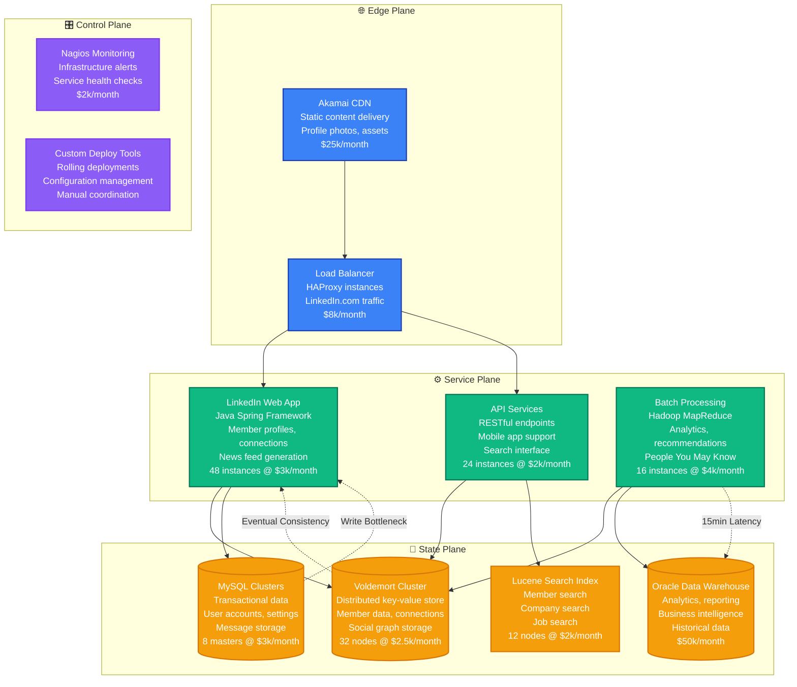
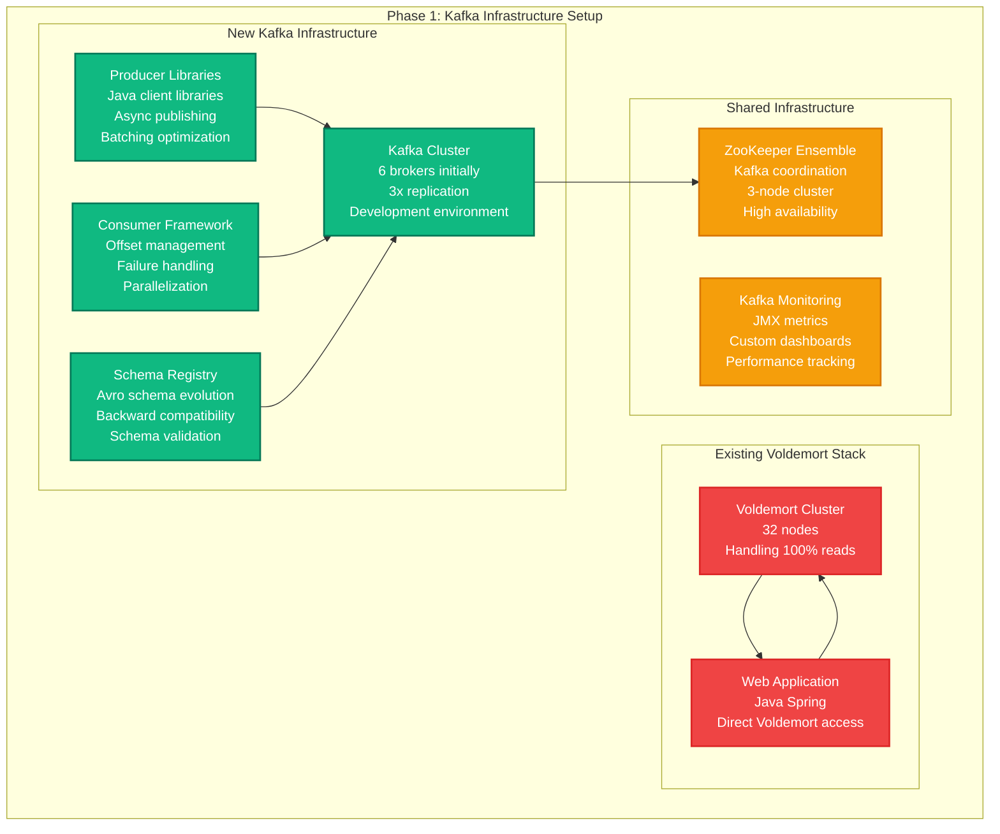
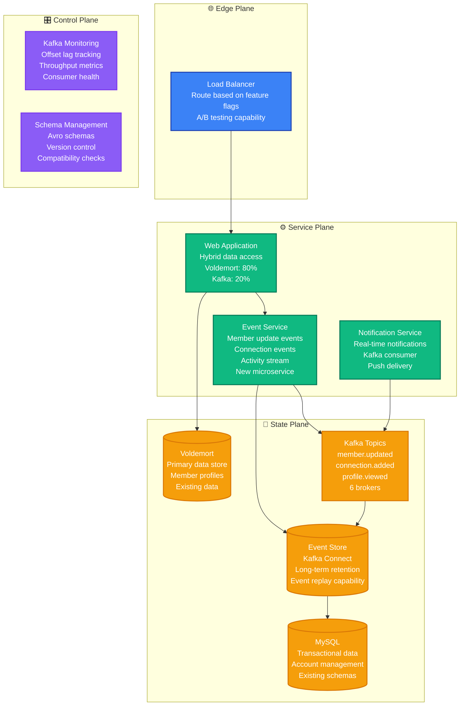
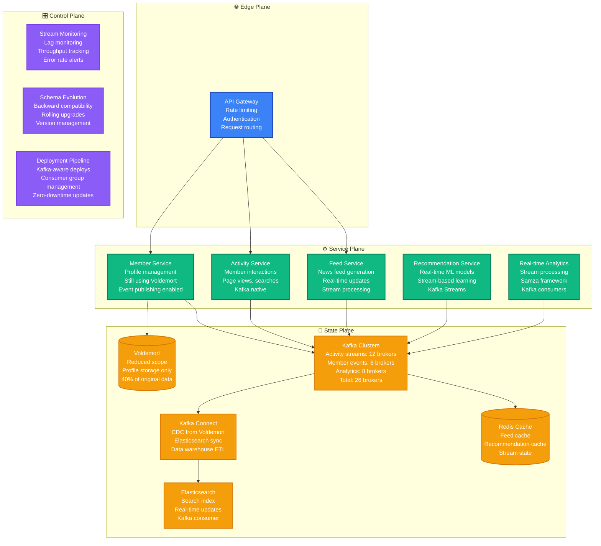
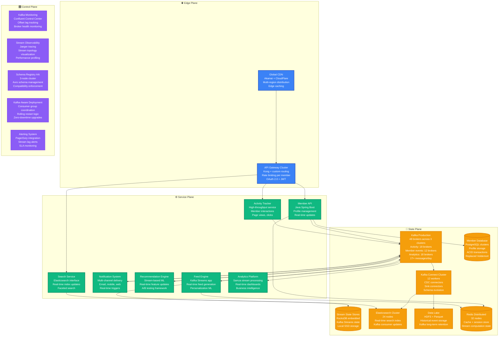
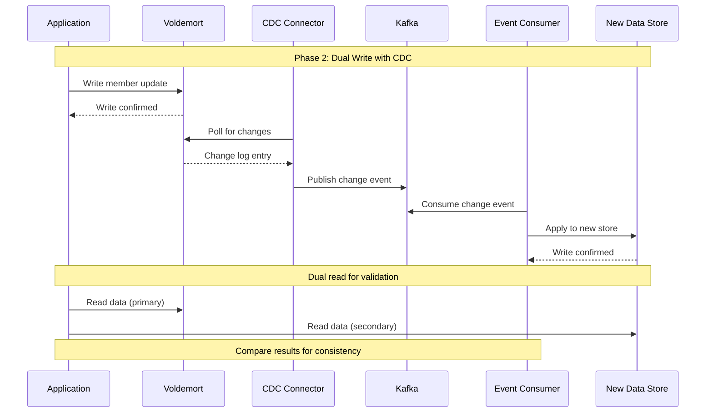
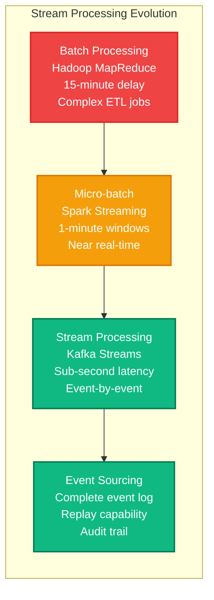
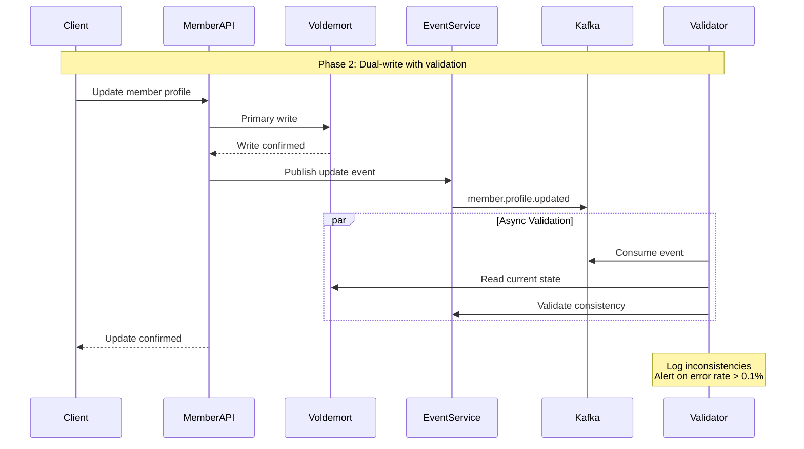
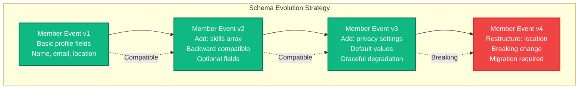

# LinkedIn: Voldemort to Kafka Migration

> **The Event-Driven Storage Revolution**
>
> Timeline: 2012-2015 | Duration: 3 years | Team: 18+ engineers | Investment: $15M+
>
> LinkedIn's transformation from Voldemort key-value store to Kafka-based event streaming architecture that revolutionized real-time data processing.

## Migration Overview

LinkedIn's migration from Voldemort to Kafka wasn't just a database migration - it was a fundamental shift from request-response data access to event-driven architecture. This transformation enabled LinkedIn to process billions of member updates in real-time and became the foundation for modern streaming platforms.

### Business Context
- **Problem**: Voldemort couldn't handle LinkedIn's real-time data requirements
- **Growth**: From 200M members (2012) to 400M+ members (2015)
- **Data Volume**: Processing 1 trillion messages per day by 2015
- **Competition**: Need for real-time features like news feed, notifications, recommendations

### Key Results
- **Latency**: Real-time data processing from 15-minute batch to <100ms streaming
- **Throughput**: Scaled from 10k to 2M messages per second
- **Reliability**: Improved data consistency and durability guarantees
- **Innovation**: Kafka became open-source standard, adopted by 70% of Fortune 500

## Before Architecture (2012): Voldemort Storage



### Voldemort Architecture Problems

**Consistency Challenges:**
- Eventual consistency causing stale data in member profiles
- No strong consistency guarantees for critical updates
- Conflict resolution complex with concurrent member updates
- Cross-datacenter replication delays of 5-15 minutes

**Scalability Bottlenecks:**
- Manual partitioning and rebalancing operations
- Hot spotting on popular member profiles
- Limited support for range queries and analytics
- Storage overhead of 3x replication factor

**Operational Complexity:**
- Complex cluster management and monitoring
- Difficult capacity planning and scaling
- Limited observability into data access patterns
- Manual intervention required for node failures

**Real-time Limitations:**
- Batch-oriented data pipeline (15-minute delays)
- No native support for event streaming
- Limited capability for real-time analytics
- Difficulty building reactive features

## Migration Strategy: The Event Streaming Transformation

### Phase 1: Kafka Infrastructure (8 months)
**Goal**: Build Kafka platform alongside existing Voldemort



**Phase 1 Deliverables:**
- Kafka cluster with high availability and monitoring
- Producer and consumer client libraries
- Schema registry for data evolution
- Comprehensive testing framework

### Phase 2: Event Sourcing Introduction (10 months)
**Goal**: Implement event sourcing for new features while maintaining Voldemort



**Phase 2 Key Achievements:**
- Event sourcing proven for member activity tracking
- Real-time notification system operational
- Kafka infrastructure scaled to production load
- Event schema evolution patterns established

### Phase 3: Stream Processing (12 months)
**Goal**: Build real-time analytics and recommendation systems



### Phase 4: Complete Migration (8 months)
**Goal**: Retire Voldemort and complete Kafka transformation

## After Architecture (2015): Kafka-Centric Platform



## Event Sourcing Migration Strategy

### Change Data Capture (CDC) Implementation



### Stream Processing Evolution



## Dual-Write Strategy & Data Consistency

### Dual-Write Implementation Pattern



### Event Schema Evolution



## Timeline & Team Requirements

### Project Timeline (36 months total)

| Phase | Duration | Focus | Team Size | Key Deliverables |
|-------|----------|-------|-----------|------------------|
| **Phase 1**: Infrastructure | 8 months | Kafka platform setup | 8 engineers | Kafka cluster, tooling, monitoring |
| **Phase 2**: Event Sourcing | 10 months | Event-driven patterns | 12 engineers | CDC, event services, schemas |
| **Phase 3**: Stream Processing | 12 months | Real-time analytics | 15 engineers | Stream apps, ML pipelines |
| **Phase 4**: Migration Complete | 6 months | Voldemort retirement | 12 engineers | Data migration, optimization |

### Team Structure

**Kafka Platform Team (6 engineers)**
- Kafka cluster operations and scaling
- Producer/consumer framework development
- Schema registry and governance
- Performance optimization and tuning

**Event Architecture Team (4 engineers)**
- Event sourcing patterns and best practices
- CDC connector development
- Event schema design and evolution
- Data consistency validation tools

**Stream Processing Team (5 engineers)**
- Kafka Streams application development
- Real-time analytics pipelines
- Stream processing framework
- Performance monitoring and optimization

**Data Migration Team (3 engineers)**
- Voldemort to Kafka migration tools
- Data validation and consistency checking
- Migration orchestration and monitoring
- Rollback and recovery procedures

## Risk Mitigation Strategies

### Technical Risks

**Data Consistency Issues**
- **Risk**: Event ordering and duplicate processing
- **Mitigation**: Exactly-once semantics, idempotent consumers
- **Detection**: Real-time consistency monitoring
- **Recovery**: Event replay and reconciliation tools

**Performance Degradation**
- **Risk**: Stream processing lag during peak traffic
- **Mitigation**: Auto-scaling consumers, partition rebalancing
- **Monitoring**: Consumer lag alerts, throughput tracking
- **Fallback**: Circuit breakers, graceful degradation

**Schema Evolution Failures**
- **Risk**: Breaking changes causing consumer failures
- **Mitigation**: Schema compatibility testing, gradual rollout
- **Validation**: Automated compatibility checks
- **Recovery**: Schema rollback, consumer version pinning

### Operational Risks

**Kafka Cluster Outages**
- **Risk**: Broker failures affecting all dependent services
- **Mitigation**: Multi-datacenter replication, auto-failover
- **Monitoring**: Cluster health monitoring, broker alerts
- **Recovery**: Automated leader election, partition reassignment

**Stream Processing Complexity**
- **Risk**: Debugging distributed stream processing issues
- **Mitigation**: Comprehensive logging, distributed tracing
- **Tooling**: Stream topology visualization, state inspection
- **Training**: Stream processing workshops, runbook development

## Migration Metrics & Results

### Performance Improvements

**Before Migration (Voldemort):**
- Data access latency: p95 = 50ms, p99 = 200ms
- Batch processing delay: 15 minutes minimum
- Consistency: Eventual (5-15 minute convergence)
- Throughput: 10k operations/second peak

**After Migration (Kafka):**
- Stream processing latency: p95 = 5ms, p99 = 25ms
- Real-time processing: <100ms end-to-end
- Consistency: Strong ordering guarantees within partition
- Throughput: 2M messages/second sustained

### Reliability Metrics

| Metric | Before (Voldemort) | After (Kafka) | Improvement |
|--------|-------------------|---------------|-------------|
| Data availability | 99.9% | 99.99% | 10x improvement |
| MTTR | 30 minutes | 5 minutes | 83% faster recovery |
| Data durability | 99.9% | 99.999% | 100x improvement |
| Processing latency | 15 minutes | <100ms | 9000x improvement |

### Business Impact

**Real-time Features Enabled:**
- News feed updates: From 15-minute batch to real-time
- Notification delivery: Sub-second from member action
- Recommendation refresh: Real-time model updates
- Analytics dashboards: Live business metrics

**Development Velocity:**
- Feature development time: 2-3 weeks → 3-5 days
- Data pipeline creation: 1-2 months → 1-2 weeks
- A/B testing capability: Batch analysis → Real-time results
- System observability: Limited → Comprehensive stream monitoring

### Cost Analysis

**Infrastructure Costs:**
- Before: $285k/month (Voldemort + batch processing)
- Peak migration: $420k/month (dual-run period)
- After: $340k/month (Kafka + stream processing)
- **Net increase: 19%** for real-time capabilities

**Engineering Investment:**
- Total cost: $15M (salaries + infrastructure over 3 years)
- Peak team size: 18 engineers
- Kafka expertise development: 6 months training per engineer
- **ROI timeline: 18 months** from improved feature velocity

## Production Incidents During Migration

### Major Incident: Kafka Consumer Lag Spike (Month 18)

**Incident Timeline:**
- **09:30 PST**: Consumer lag increased from 100ms to 30 seconds
- **09:35 PST**: Real-time features (feed, notifications) experiencing delays
- **09:40 PST**: Consumer group rebalancing triggered automatically
- **09:45 PST**: Additional consumer instances auto-scaled
- **09:50 PST**: Lag reduced to normal levels
- **Total impact**: 20 minutes of delayed real-time features

**Root Cause:**
- Sudden spike in member activity during major news event
- Consumer instances not auto-scaling fast enough
- GC pressure in consumer JVMs during high throughput

**Prevention Measures:**
- Pre-scaled consumer groups for anticipated events
- Improved auto-scaling metrics (lag + CPU + memory)
- JVM tuning for low-latency garbage collection
- Circuit breakers for non-critical real-time features

### Data Consistency Incident: Schema Evolution Bug (Month 24)

**Incident Timeline:**
- **14:15 PST**: New schema version deployed with breaking change
- **14:22 PST**: Legacy consumers started failing to deserialize events
- **14:25 PST**: Member profile updates stopped processing
- **14:30 PST**: Schema rollback initiated
- **14:35 PST**: Legacy consumers resumed processing
- **Total impact**: 20 minutes of profile update failures

**Root Cause:**
- Schema compatibility check bypassed during emergency deployment
- Field removed without proper deprecation period
- Consumer version compatibility matrix not maintained

**Prevention Measures:**
- Mandatory schema compatibility validation in CI/CD
- 30-day deprecation period for field removals
- Consumer version tracking and compatibility matrix
- Automated schema rollback on consumer failure spike

## Technology Stack Evolution

### Before Migration: Voldemort Stack
```
Storage: Voldemort 1.8 (32 nodes, manual partitioning)
Processing: Hadoop MapReduce (batch, 15-minute delays)
Monitoring: Custom JMX + Nagios (limited observability)
Consistency: Eventual consistency (5-15 minute convergence)
Replication: 3x replication within datacenter
Backup: Daily snapshots to HDFS
Query Interface: Key-value only (no range queries)
```

### After Migration: Kafka Stack
```
Streaming: Apache Kafka 0.10+ (48 brokers, auto-partitioning)
Processing: Kafka Streams + Samza (real-time, <100ms latency)
Monitoring: JMX + Prometheus + Grafana (comprehensive metrics)
Consistency: Strong ordering within partition, exactly-once semantics
Replication: 3x replication + cross-datacenter mirroring
Backup: Continuous replication + long-term retention (90 days)
Query Interface: Stream processing + materialized views
```

## Event-Driven Architecture Benefits

### Real-time Capabilities Unlocked

**Before: Batch-Oriented Processing**
- Member profile updates: 15-minute delay to search index
- News feed refresh: Hourly batch job
- Recommendations: Daily model refresh
- Analytics: End-of-day reporting

**After: Event-Driven Real-time**
- Member profile updates: <100ms to all systems
- News feed refresh: Real-time stream processing
- Recommendations: Continuous model updates
- Analytics: Live dashboards and alerting

### Microservices Enablement

**Service Decoupling:**
- Services communicate via events, not direct API calls
- Asynchronous processing enables fault tolerance
- Schema evolution allows independent service updates
- Event replay enables service rebuilding and testing

**Organizational Benefits:**
- Teams own their event schemas and processing
- Reduced coordination overhead between teams
- Independent deployment and scaling of services
- Clear audit trail of all business events

## Lessons Learned

### What Worked Well

1. **Incremental Migration Strategy**
   - Building Kafka infrastructure before migrating reduced risk
   - Dual-write approach enabled safe rollbacks
   - Event sourcing patterns provided immediate value

2. **Investment in Platform Engineering**
   - Comprehensive tooling reduced adoption friction
   - Schema registry prevented compatibility issues
   - Monitoring and alerting caught issues early

3. **Event-First Thinking**
   - Designing events as first-class citizens improved system design
   - Event sourcing enabled powerful debugging and replay capabilities
   - Stream processing unlocked new real-time features

### What Would Be Done Differently

1. **Earlier Consumer Framework**
   - Should have built comprehensive consumer framework earlier
   - Consumer group management needed more attention
   - Error handling and retry logic should have been standardized

2. **Schema Governance from Day One**
   - Schema evolution policies needed earlier
   - Compatibility testing should have been automated sooner
   - Event versioning strategy needed clearer definition

3. **Operational Complexity Planning**
   - Underestimated operational complexity of distributed streaming
   - Needed more investment in debugging and observability tools
   - Kafka expertise development took longer than expected

### Key Success Factors

1. **Technical Leadership Commitment**
   - Strong engineering leadership support for multi-year migration
   - Clear vision for event-driven architecture benefits
   - Investment in platform engineering team

2. **Gradual Adoption Strategy**
   - Started with non-critical use cases to build confidence
   - Proved value incrementally through real-time features
   - Built expertise and tooling before tackling core systems

3. **Open Source Innovation**
   - Contributing improvements back to Kafka community
   - Collaborating with Confluent on enterprise features
   - Building industry-standard patterns and practices

## Conclusion

LinkedIn's Voldemort to Kafka migration was more than a storage technology change - it was a transformation to event-driven architecture that fundamentally changed how LinkedIn builds and operates systems. The 3-year investment of $15M and 18 engineers delivered:

- **Real-time processing capabilities** enabling new product features
- **Event-driven microservices architecture** supporting organizational scale
- **Industry-leading streaming platform** that became the standard
- **Platform foundation** for modern data-driven applications

The migration's success came from treating it as an **architectural evolution** rather than just a technology replacement. By embracing event sourcing, stream processing, and eventually-consistent architectures, LinkedIn created technical capabilities that powered their growth and established Kafka as the de facto standard for event streaming.

**Key Takeaway**: Successful platform migrations should focus on unlocking new capabilities rather than just replacing existing ones. The most valuable migrations are those that enable new ways of building and thinking about systems.

---

*"The Kafka migration taught us that changing how you store data often means changing how you think about data."* - LinkedIn Engineering Team

**Source**: LinkedIn Engineering Blog, Kafka documentation, ApacheCon presentations, Martin Kleppmann papers