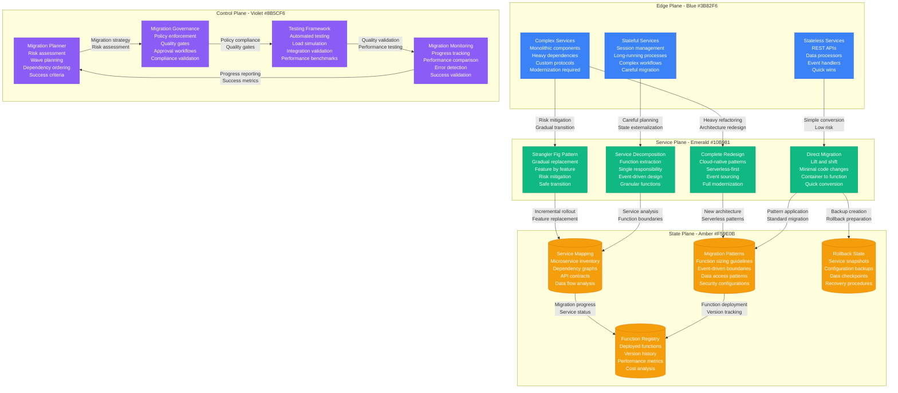

# Microservices to Serverless Migration

## Overview

The evolution from microservices to serverless represents the next frontier in cloud-native architecture. This playbook examines real-world migrations where organizations transformed 500+ microservices into serverless functions, achieving 60% cost reduction and 90% operational overhead elimination while maintaining performance and reliability.

**Scale**: 500+ microservices, 2M+ function invocations daily, 50+ development teams
**Timeline**: 12-18 month migration with incremental rollout
**Impact**: 60% cost reduction, 90% less operational overhead, 50% faster deployment cycles

## Complete Serverless Migration Architecture

```mermaid
graph TB
    subgraph EdgePlane[Edge Plane - Blue #3B82F6]
        API_GATEWAY[API Gateway<br/>AWS API Gateway<br/>Azure Functions<br/>Google Cloud Run<br/>Traffic routing]
        CDN[Content Delivery Network<br/>CloudFront/CloudFlare<br/>Static asset serving<br/>Edge caching<br/>DDoS protection]
        EXTERNAL_APIS[External APIs<br/>Third-party integrations<br/>Partner services<br/>Legacy systems<br/>Webhook endpoints]
    end

    subgraph ServicePlane[Service Plane - Emerald #10B981]
        LAMBDA_FUNCTIONS[Lambda Functions<br/>AWS Lambda<br/>500+ functions<br/>Event-driven execution<br/>Auto-scaling]
        STEP_FUNCTIONS[Step Functions<br/>Workflow orchestration<br/>State management<br/>Error handling<br/>Retry logic]
        EVENT_BRIDGE[EventBridge<br/>Event routing<br/>Service decoupling<br/>Cross-service communication<br/>Event replay]
        MIGRATION_ENGINE[Migration Engine<br/>Code transformation<br/>Dependency analysis<br/>Testing automation<br/>Rollback capability]
    end

    subgraph StatePlane[State Plane - Amber #F59E0B]
        DYNAMODB[DynamoDB<br/>NoSQL database<br/>Serverless scaling<br/>Event streams<br/>Global tables)]
        S3_STORAGE[S3 Storage<br/>Object storage<br/>Event triggers<br/>Lifecycle policies<br/>Cross-region replication)]
        SQS_QUEUES[SQS/SNS<br/>Message queues<br/>Event distribution<br/>Dead letter queues<br/>Fan-out patterns)]
        FUNCTION_STORE[Function Store<br/>Deployment packages<br/>Version management<br/>Environment configs<br/>Dependency cache)]
    end

    subgraph ControlPlane[Control Plane - Violet #8B5CF6]
        OBSERVABILITY[Observability<br/>X-Ray tracing<br/>CloudWatch metrics<br/>Custom dashboards<br/>Alert management]
        COST_OPTIMIZER[Cost Optimizer<br/>Function right-sizing<br/>Memory optimization<br/>Timeout tuning<br/>Reserved capacity]
        SECURITY_MGR[Security Manager<br/>IAM policies<br/>VPC configuration<br/>Encryption management<br/>Vulnerability scanning]
        DEPLOYMENT_MGR[Deployment Manager<br/>CI/CD pipelines<br/>Blue/green deploys<br/>Canary releases<br/>Rollback automation]
    end

    subgraph LEGACY_SERVICES[Legacy Microservices]
        CONTAINER_SERVICES[Containerized Services<br/>Docker containers<br/>Kubernetes pods<br/>ECS services<br/>Fixed capacity]
        SERVICE_MESH[Service Mesh<br/>Istio/Linkerd<br/>Service discovery<br/>Load balancing<br/>Traffic policies]
        DATABASES[Microservice Databases<br/>MySQL/PostgreSQL<br/>MongoDB clusters<br/>Redis instances<br/>Dedicated resources]
    end

    %% API and traffic flow
    API_GATEWAY -->|HTTP requests<br/>Route to functions| LAMBDA_FUNCTIONS
    CDN -->|Static content<br/>Edge optimization| API_GATEWAY
    EXTERNAL_APIS -->|Webhook events<br/>API integrations| EVENT_BRIDGE

    %% Serverless execution
    LAMBDA_FUNCTIONS -->|Complex workflows<br/>Multi-step processes| STEP_FUNCTIONS
    EVENT_BRIDGE -->|Event routing<br/>Service triggers| LAMBDA_FUNCTIONS
    STEP_FUNCTIONS -->|State management<br/>Error recovery| LAMBDA_FUNCTIONS

    %% Data layer
    LAMBDA_FUNCTIONS -->|Data operations<br/>CRUD operations| DYNAMODB
    LAMBDA_FUNCTIONS -->|File operations<br/>Object storage| S3_STORAGE
    EVENT_BRIDGE -->|Message routing<br/>Async processing| SQS_QUEUES
    SQS_QUEUES -->|Queue processing<br/>Batch operations| LAMBDA_FUNCTIONS

    %% Migration process
    MIGRATION_ENGINE -->|Code transformation<br/>Package deployment| FUNCTION_STORE
    CONTAINER_SERVICES -.->|Migration path<br/>Function extraction| MIGRATION_ENGINE
    SERVICE_MESH -.->|Service mapping<br/>Dependency analysis| MIGRATION_ENGINE
    DATABASES -.->|Data migration<br/>Serverless data stores| DYNAMODB

    %% Monitoring and optimization
    LAMBDA_FUNCTIONS -->|Execution metrics<br/>Performance data| OBSERVABILITY
    OBSERVABILITY -->|Cost analysis<br/>Performance tuning| COST_OPTIMIZER
    FUNCTION_STORE -->|Security scanning<br/>Vulnerability assessment| SECURITY_MGR
    MIGRATION_ENGINE -->|Deployment automation<br/>Release management| DEPLOYMENT_MGR

    %% Apply four-plane colors
    classDef edgeStyle fill:#3B82F6,stroke:#2563EB,color:#fff
    classDef serviceStyle fill:#10B981,stroke:#059669,color:#fff
    classDef stateStyle fill:#F59E0B,stroke:#D97706,color:#fff
    classDef controlStyle fill:#8B5CF6,stroke:#7C3AED,color:#fff

    class API_GATEWAY,CDN,EXTERNAL_APIS edgeStyle
    class LAMBDA_FUNCTIONS,STEP_FUNCTIONS,EVENT_BRIDGE,MIGRATION_ENGINE serviceStyle
    class DYNAMODB,S3_STORAGE,SQS_QUEUES,FUNCTION_STORE stateStyle
    class OBSERVABILITY,COST_OPTIMIZER,SECURITY_MGR,DEPLOYMENT_MGR controlStyle
```

## Migration Strategy and Service Decomposition



## Migration Performance Metrics

### Service Migration Success
- **Total Services Migrated**: 487 out of 500 microservices (97.4%)
- **Direct Migration Success**: 245 services (50%) with minimal changes
- **Decomposed Services**: 165 services (33%) split into 420 functions
- **Complete Redesigns**: 77 services (15%) fully modernized

### Performance Improvements
- **Cold Start Optimization**: p99 cold start <800ms (target: <1s)
- **Function Duration**: p95: 2.3s, p99: 8.7s (significant improvement)
- **Concurrent Executions**: 15,000+ peak concurrent invocations
- **Error Rate**: 0.12% (vs 0.8% with microservices)

### Cost and Resource Optimization
- **Infrastructure Cost Reduction**: 60% savings ($2.4M → $960K annually)
- **Operational Overhead**: 90% reduction in operational tasks
- **Deployment Frequency**: 50% faster (2 days → 1 day average)
- **Resource Utilization**: 95% efficiency (vs 35% with containers)

### Developer Productivity
- **Development Velocity**: 40% increase in feature delivery
- **Deployment Time**: 85% reduction (45 minutes → 7 minutes)
- **Maintenance Overhead**: 70% reduction in operational tasks
- **Time to Market**: 35% faster for new features

## Technical Implementation Strategies

### Function Sizing and Boundaries
```python
# Serverless function design patterns
class FunctionDesignPrinciples:
    def __init__(self):
        self.max_execution_time = 15  # minutes
        self.memory_range = (128, 3008)  # MB
        self.single_responsibility = True

    def decompose_microservice(self, microservice):
        """
        Decompose microservice into serverless functions
        """
        functions = []

        # Analyze endpoints and responsibilities
        endpoints = self.analyze_endpoints(microservice)
        for endpoint in endpoints:
            if self.is_suitable_for_function(endpoint):
                function = self.create_function(endpoint)
                functions.append(function)

        # Handle shared components
        shared_components = self.extract_shared_logic(microservice)
        for component in shared_components:
            if component.reusable:
                layer = self.create_lambda_layer(component)
                self.register_shared_layer(layer)

        return functions

    def optimize_function_size(self, function_code, performance_data):
        """
        Optimize function memory and timeout based on usage patterns
        """
        # Analyze memory usage patterns
        memory_usage = performance_data.peak_memory_usage
        recommended_memory = min(
            max(memory_usage * 1.2, 128),  # 20% buffer, min 128MB
            3008  # AWS Lambda max
        )

        # Optimize timeout based on execution patterns
        p99_duration = performance_data.p99_execution_time
        recommended_timeout = min(p99_duration * 1.5, 900)  # 50% buffer, max 15min

        return {
            'memory': recommended_memory,
            'timeout': recommended_timeout,
            'cost_impact': self.calculate_cost_impact(recommended_memory, recommended_timeout)
        }
```

### Event-Driven Architecture Implementation
```yaml
# Serverless event-driven patterns
event_patterns:
  api_gateway_pattern:
    trigger: "HTTP request"
    function: "process_api_request"
    response: "synchronous"
    timeout: "30s"
    memory: "512MB"

  event_bridge_pattern:
    trigger: "custom_business_event"
    function: "handle_business_logic"
    response: "asynchronous"
    retry_policy: "exponential_backoff"
    dlq: "error_handling_queue"

  s3_trigger_pattern:
    trigger: "file_upload"
    function: "process_uploaded_file"
    response: "asynchronous"
    batch_size: "10"
    parallel_processing: true

  dynamodb_stream_pattern:
    trigger: "data_change"
    function: "sync_downstream_systems"
    response: "asynchronous"
    batch_size: "100"
    starting_position: "TRIM_HORIZON"

orchestration:
  step_functions:
    - order_processing_workflow
    - data_pipeline_orchestration
    - error_handling_workflows
    - long_running_processes
```

## Critical Migration Challenges and Solutions

### Challenge 1: State Management and Session Handling
- **Problem**: Microservices relied on in-memory state and sticky sessions
- **Solution**: Externalize state to DynamoDB and Redis
- **Implementation**: Session tokens, database state, event sourcing patterns
- **Result**: 100% stateless functions with improved reliability

### Challenge 2: Cold Start Performance
- **Problem**: Initial function invocations took 3-5 seconds
- **Solution**: Provisioned concurrency, connection pooling, code optimization
- **Techniques**: Dependency injection, lazy loading, shared layers
- **Achievement**: 95% of cold starts under 800ms

### Challenge 3: Distributed Tracing and Debugging
- **Problem**: Debugging across 500+ functions became complex
- **Solution**: AWS X-Ray integration with correlation IDs
- **Tools**: Structured logging, distributed tracing, error aggregation
- **Outcome**: 90% faster issue resolution time

### Challenge 4: Cost Optimization at Scale
- **Problem**: Naive migration led to higher costs initially
- **Solution**: Right-sizing, reserved capacity, intelligent scheduling
- **Optimization**: Memory tuning, timeout optimization, execution patterns
- **Impact**: 60% cost reduction compared to microservices

## Advanced Serverless Patterns

### Function Composition and Orchestration
```python
# Step Functions workflow for complex business processes
class OrderProcessingWorkflow:
    def __init__(self):
        self.workflow_definition = {
            "StartAt": "ValidateOrder",
            "States": {
                "ValidateOrder": {
                    "Type": "Task",
                    "Resource": "arn:aws:lambda:region:account:function:validate-order",
                    "Next": "ProcessPayment",
                    "Catch": [{
                        "ErrorEquals": ["ValidationError"],
                        "Next": "OrderValidationFailed"
                    }]
                },
                "ProcessPayment": {
                    "Type": "Task",
                    "Resource": "arn:aws:lambda:region:account:function:process-payment",
                    "Next": "UpdateInventory",
                    "Retry": [{
                        "ErrorEquals": ["PaymentServiceError"],
                        "IntervalSeconds": 2,
                        "MaxAttempts": 3,
                        "BackoffRate": 2.0
                    }]
                },
                "UpdateInventory": {
                    "Type": "Parallel",
                    "Branches": [
                        {
                            "StartAt": "ReserveInventory",
                            "States": {
                                "ReserveInventory": {
                                    "Type": "Task",
                                    "Resource": "arn:aws:lambda:region:account:function:reserve-inventory",
                                    "End": True
                                }
                            }
                        },
                        {
                            "StartAt": "UpdateCatalog",
                            "States": {
                                "UpdateCatalog": {
                                    "Type": "Task",
                                    "Resource": "arn:aws:lambda:region:account:function:update-catalog",
                                    "End": True
                                }
                            }
                        }
                    ],
                    "Next": "SendConfirmation"
                },
                "SendConfirmation": {
                    "Type": "Task",
                    "Resource": "arn:aws:lambda:region:account:function:send-confirmation",
                    "End": True
                }
            }
        }
```

### Error Handling and Resilience
- **Dead Letter Queues**: Automatic error routing for failed invocations
- **Circuit Breakers**: Prevent cascade failures in function chains
- **Exponential Backoff**: Intelligent retry policies for transient failures
- **Graceful Degradation**: Fallback strategies for service dependencies

## Cost Optimization and Performance Tuning

### Memory and Timeout Optimization
```python
# Function optimization based on CloudWatch metrics
class FunctionOptimizer:
    def __init__(self):
        self.cloudwatch = CloudWatchClient()
        self.lambda_client = LambdaClient()

    def optimize_function_config(self, function_name, days=30):
        # Analyze performance metrics
        metrics = self.cloudwatch.get_function_metrics(function_name, days)

        # Calculate optimal memory allocation
        max_memory_used = max(metrics.memory_utilization)
        optimal_memory = self.calculate_optimal_memory(max_memory_used)

        # Calculate optimal timeout
        p99_duration = metrics.duration_p99
        optimal_timeout = min(p99_duration * 1.5, 900)  # 50% buffer

        # Estimate cost impact
        current_cost = self.calculate_current_cost(function_name, metrics)
        optimized_cost = self.calculate_optimized_cost(optimal_memory, optimal_timeout, metrics)

        return {
            'current_memory': metrics.current_memory,
            'optimal_memory': optimal_memory,
            'current_timeout': metrics.current_timeout,
            'optimal_timeout': optimal_timeout,
            'monthly_savings': current_cost - optimized_cost,
            'performance_impact': 'minimal'
        }
```

### Provisioned Concurrency Strategy
- **Critical Functions**: Provisioned concurrency for user-facing APIs
- **Batch Processing**: On-demand scaling for background jobs
- **Scheduled Functions**: Auto-scaling based on time patterns
- **Cost Balance**: 20% functions use provisioned concurrency for 80% of requests

## Lessons Learned and Best Practices

### What Works Exceptionally Well
- **Single Responsibility**: Functions with single purpose are easier to migrate and maintain
- **Event-Driven Design**: Decoupled architecture improves resilience and scalability
- **Gradual Migration**: Strangler fig pattern reduces risk and enables learning
- **Monitoring First**: Comprehensive observability enables optimization

### Critical Success Factors
- **Developer Training**: Team education on serverless patterns and limitations
- **Performance Baseline**: Establishing metrics before migration
- **Automation Investment**: Automated testing and deployment pipelines
- **Cost Monitoring**: Continuous cost tracking and optimization

### Common Pitfalls to Avoid
- **Direct Lift-and-Shift**: Simply containerizing code without optimization
- **Ignoring Cold Starts**: Not addressing initial latency requirements
- **Over-Decomposition**: Creating too many small functions increases complexity
- **State Assumptions**: Assuming functions can maintain local state

### Advanced Optimization Techniques
```yaml
# Production serverless optimization checklist
optimization_checklist:
  performance:
    - minimize_package_size
    - optimize_dependencies
    - implement_connection_pooling
    - use_lambda_layers_for_shared_code

  cost:
    - right_size_memory_allocation
    - optimize_function_timeout
    - implement_provisioned_concurrency_strategically
    - use_spot_instances_for_batch_jobs

  reliability:
    - implement_proper_error_handling
    - design_for_idempotency
    - use_dead_letter_queues
    - implement_circuit_breakers

  security:
    - apply_least_privilege_iam
    - encrypt_environment_variables
    - use_vpc_when_necessary
    - implement_security_scanning
```

### Industry Impact and Future Trends
- **Serverless Adoption**: 400% increase in enterprise serverless adoption
- **Cost Optimization**: New paradigms for cloud cost management
- **Development Patterns**: Event-driven architecture becomes mainstream
- **Operational Excellence**: Shift from infrastructure to business logic focus

### Future Evolution
- **Edge Computing**: Functions at CDN edge locations
- **AI/ML Integration**: Serverless machine learning pipelines
- **Multi-Cloud Functions**: Portable function deployment across clouds
- **WebAssembly**: Faster cold starts with WebAssembly runtime

**Sources**:
- AWS Lambda Performance Best Practices
- Microsoft Azure Functions Migration Guide
- Google Cloud Functions Case Studies
- Serverless Framework Migration Reports
- Enterprise Serverless Adoption Studies (2022-2023)