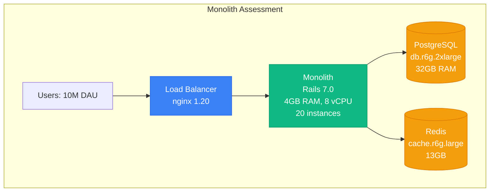
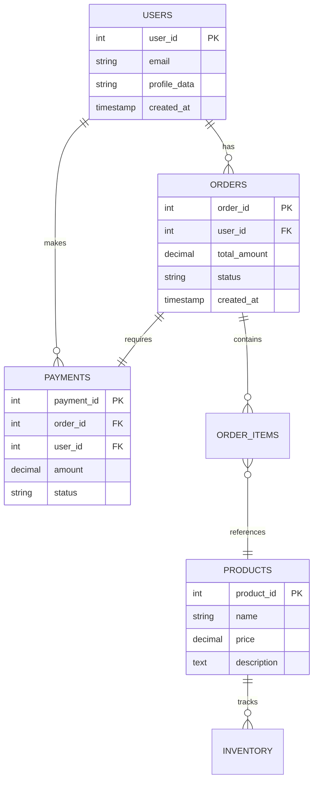
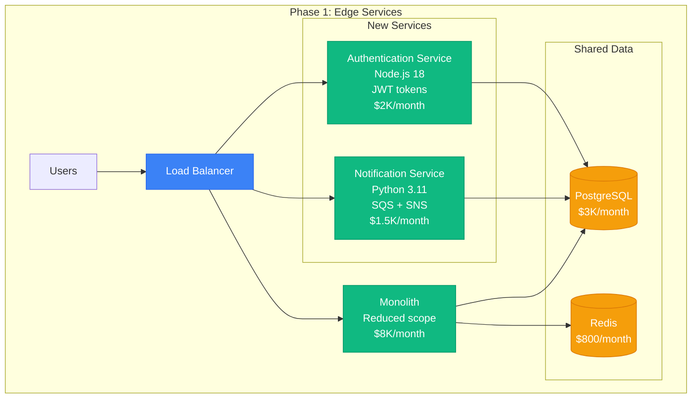
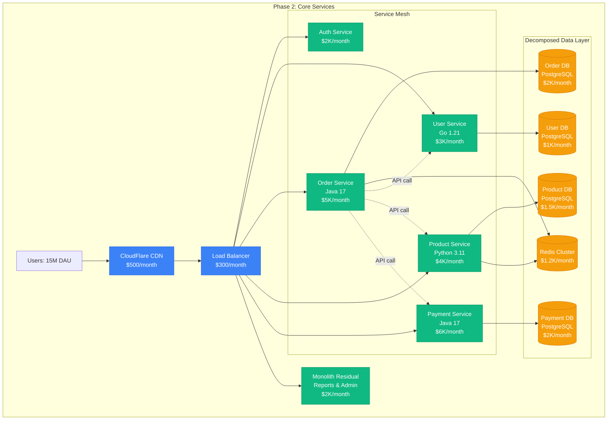
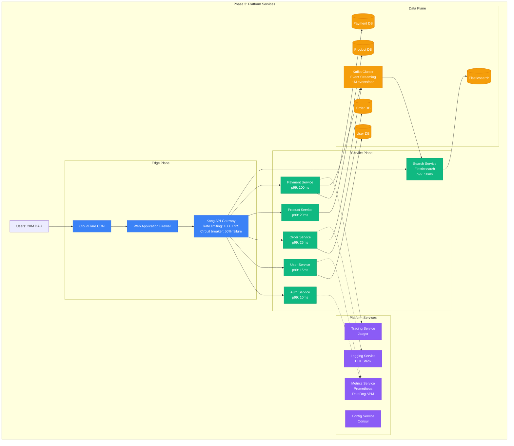
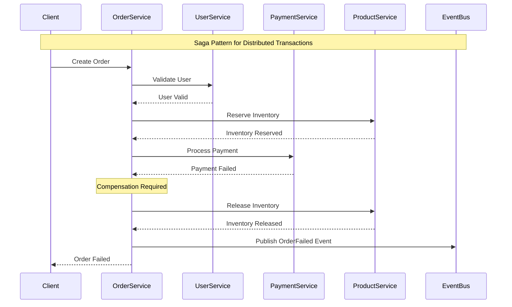
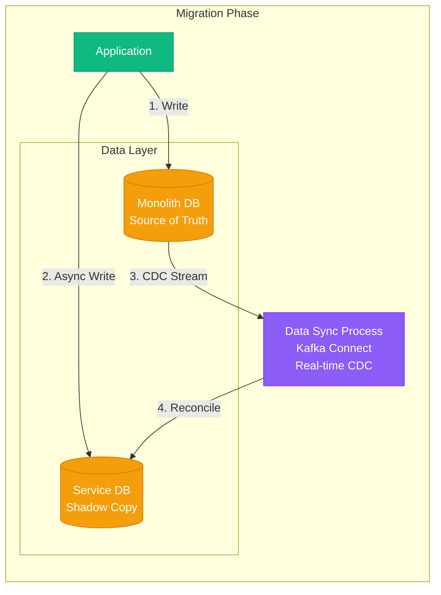
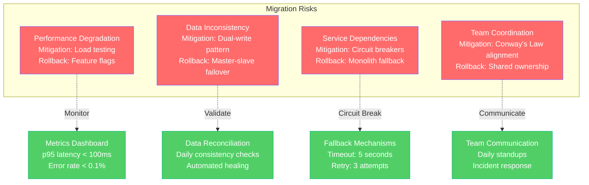
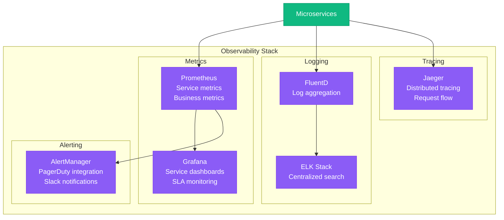

# Monolith to Microservices Migration Playbook

## Executive Summary

**Migration Type**: Architectural decomposition from monolithic application to microservices architecture
**Typical Timeline**: 12-24 months for large systems
**Risk Level**: High - requires careful orchestration to avoid service disruption
**Success Rate**: 70% when following proven patterns

## Real-World Success Stories

### Netflix (2008-2015)
- **Original**: Single Java monolith serving DVD-by-mail
- **Target**: 700+ microservices serving 200M+ users
- **Timeline**: 7 years gradual migration
- **Key Pattern**: Strangler Fig with gradual service extraction
- **Results**: 99.99% availability, global scale

### Uber (2013-2016)
- **Original**: Python monolith "Schemaless"
- **Target**: 1,000+ microservices in Go, Java, Python
- **Timeline**: 3 years with parallel development
- **Key Pattern**: Domain-driven decomposition
- **Results**: Real-time matching at global scale

### Airbnb (2017-2020)
- **Original**: Rails monolith "Monorail"
- **Target**: Service-oriented architecture with 1,000+ services
- **Timeline**: 3 years with service mesh adoption
- **Key Pattern**: API Gateway with service discovery
- **Results**: Improved deployment velocity, reduced MTTR

## Pre-Migration Assessment

### Current State Analysis



### Code Complexity Metrics
| Metric | Current State | Target State |
|--------|---------------|--------------|
| Lines of Code | 500K-2M | <50K per service |
| Deployment Time | 30-60 minutes | <5 minutes |
| Team Dependencies | Single shared codebase | Independent service teams |
| Release Frequency | Weekly/Monthly | Multiple times daily |
| MTTR | 2-4 hours | <30 minutes |

### Database Decomposition Assessment



## Migration Strategy: Strangler Fig Pattern

### Phase 1: Edge Services (Months 1-3)

Extract services with minimal database dependencies first.



**Extraction Criteria for Phase 1:**
- Independent functionality (authentication, notifications)
- Minimal cross-service transactions
- Clear API boundaries
- Non-critical path services

### Phase 2: Core Business Services (Months 4-12)

Extract core business logic with database decomposition.



### Phase 3: Platform Services (Months 13-18)

Add platform services for observability, security, and operations.



## Database Decomposition Strategy

### Data Consistency Patterns



### Data Migration Strategies

**Dual-Write Pattern for Safe Migration:**



## Service Boundary Design

### Domain-Driven Decomposition

| Domain | Bounded Context | Service | Database | Team |
|--------|----------------|---------|----------|------|
| **Identity** | User Management | User Service | user_db | Identity Team |
| **Catalog** | Product Information | Product Service | product_db | Catalog Team |
| **Commerce** | Order Processing | Order Service | order_db | Commerce Team |
| **Payments** | Financial Transactions | Payment Service | payment_db | FinTech Team |
| **Fulfillment** | Inventory & Shipping | Fulfillment Service | fulfillment_db | Ops Team |
| **Analytics** | Business Intelligence | Analytics Service | analytics_db | Data Team |

### API Design Patterns

**RESTful Service APIs:**

```yaml
# User Service API
/api/v1/users:
  GET: List users (paginated)
  POST: Create user

/api/v1/users/{userId}:
  GET: Get user details
  PUT: Update user
  DELETE: Deactivate user

/api/v1/users/{userId}/profile:
  GET: Get user profile
  PUT: Update profile

# Order Service API
/api/v1/orders:
  GET: List orders (filtered)
  POST: Create order

/api/v1/orders/{orderId}:
  GET: Get order details
  PUT: Update order status

/api/v1/orders/{orderId}/items:
  GET: Get order items
  POST: Add item to order
```

## Migration Timeline & Milestones

### 12-Month Detailed Timeline

| Month | Milestone | Services Extracted | Database Changes | Team Changes |
|-------|-----------|-------------------|------------------|--------------|
| **1-2** | Planning & Setup | - | Schema analysis | Form service teams |
| **3-4** | Edge Services | Auth, Notifications | Shared database | 2 service teams |
| **5-7** | Core Services | User, Product | Database per service | 4 service teams |
| **8-10** | Business Logic | Order, Payment | Event-driven architecture | 6 service teams |
| **11-12** | Platform Services | Search, Analytics | Complete decomposition | 8 service teams |

### Success Metrics by Phase

| Phase | Deployment Frequency | MTTR | Service Availability | Cost Impact |
|-------|---------------------|------|---------------------|-------------|
| **Baseline** | Weekly | 4 hours | 99.5% | $15K/month |
| **Phase 1** | 2x per week | 2 hours | 99.7% | $17K/month |
| **Phase 2** | Daily | 1 hour | 99.8% | $25K/month |
| **Phase 3** | Multiple daily | 30 minutes | 99.9% | $35K/month |

## Risk Mitigation Strategies

### Common Failure Modes



### Rollback Procedures

**Service Rollback Strategy:**

1. **Traffic Rollback** (1 minute)
   - Route traffic back to monolith via load balancer
   - Disable new service endpoints
   - Monitor error rates

2. **Data Rollback** (5 minutes)
   - Stop dual-write to new database
   - Resync data from monolith database
   - Validate data consistency

3. **Infrastructure Rollback** (10 minutes)
   - Scale down new services
   - Restore monolith capacity
   - Update monitoring dashboards

## Cost Analysis

### Infrastructure Costs Comparison

| Component | Monolith | Microservices | Delta |
|-----------|----------|---------------|-------|
| **Compute** | $8,000/month | $15,000/month | +$7,000 |
| **Database** | $3,000/month | $8,000/month | +$5,000 |
| **Networking** | $500/month | $2,000/month | +$1,500 |
| **Monitoring** | $200/month | $1,500/month | +$1,300 |
| **Total** | **$11,700/month** | **$26,500/month** | **+$14,800** |

### ROI Calculation

**Benefits:**
- **Deployment Velocity**: 10x faster deployments
- **Team Productivity**: 40% increase (independent teams)
- **Incident Recovery**: 75% faster MTTR
- **Feature Development**: 60% faster time-to-market

**Break-even Analysis:**
- Additional Cost: $177,600/year
- Productivity Gains: $300,000/year (team efficiency)
- Faster Time-to-Market: $500,000/year (revenue impact)
- **Net ROI**: 347% ($622,400 benefit vs $177,600 cost)

## Monitoring & Observability

### Service Health Dashboard



### Key Metrics to Track

| Metric Category | Metrics | Target SLA |
|-----------------|---------|------------|
| **Availability** | Service uptime, Error rate | 99.9% uptime, <0.1% errors |
| **Performance** | p50/p95/p99 latency | p99 < 100ms |
| **Throughput** | Requests per second | >10,000 RPS |
| **Business** | Order completion rate | >99% success |

## Success Validation

### Technical Validation Checklist

- [ ] All services independently deployable
- [ ] Database per service implemented
- [ ] Circuit breakers and timeouts configured
- [ ] Distributed tracing operational
- [ ] Service discovery working
- [ ] Load balancing configured
- [ ] Security policies enforced
- [ ] Monitoring and alerting active

### Business Validation Checklist

- [ ] Deployment frequency increased 5x
- [ ] MTTR reduced to <30 minutes
- [ ] Team velocity increased 40%
- [ ] Feature delivery time reduced 60%
- [ ] System availability >99.9%
- [ ] Customer satisfaction maintained
- [ ] Cost targets met
- [ ] ROI targets achieved

## Lessons Learned from Real Migrations

### Netflix Lessons
1. **Gradual Migration**: "Big bang" migrations fail - take 2-3 years minimum
2. **Chaos Engineering**: Build resilience from day one
3. **Team Structure**: Conway's Law - organize teams around services
4. **Data Strategy**: Database-per-service is non-negotiable

### Uber Lessons
1. **Service Mesh**: Invest in service mesh early (Envoy/Istio)
2. **Domain Boundaries**: Get domain boundaries right before coding
3. **Backward Compatibility**: Maintain API compatibility during migration
4. **Operational Complexity**: 10x operational overhead initially

### Airbnb Lessons
1. **Migration Tools**: Build automated migration tooling
2. **Cultural Change**: Engineering culture shift is harder than technology
3. **Metrics**: Measure everything - you can't improve what you don't measure
4. **Incremental Value**: Deliver business value in each phase

## Conclusion

Monolith to microservices migration is a complex, multi-year journey that requires careful planning, strong engineering practices, and organizational commitment. Success depends on:

1. **Gradual approach** using proven patterns like Strangler Fig
2. **Strong observability** from day one
3. **Team organization** aligned with service boundaries
4. **Data strategy** with database-per-service
5. **Risk mitigation** with rollback procedures
6. **Clear metrics** to validate success

The investment is significant but pays dividends in deployment velocity, team autonomy, and system resilience.