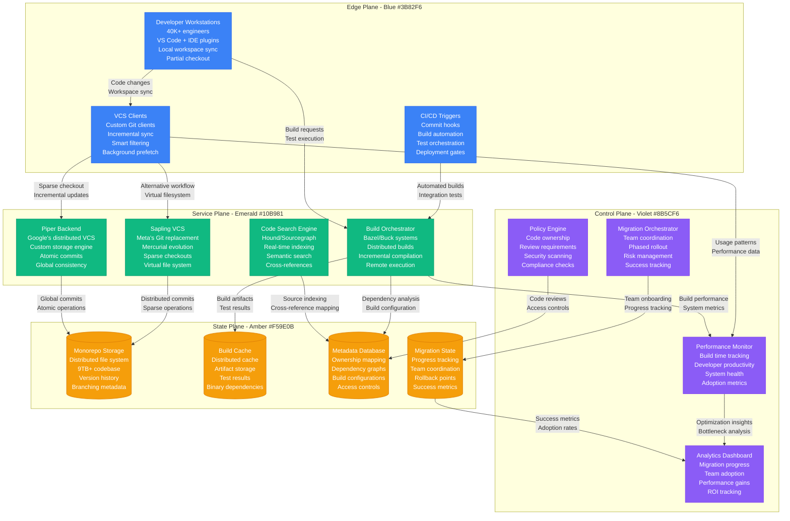
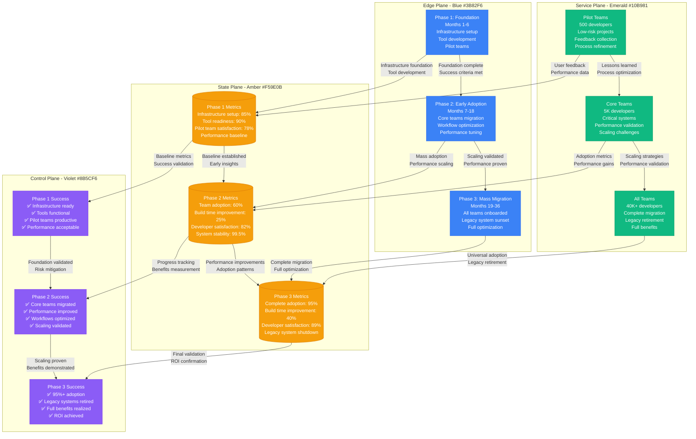

# Monorepo Migration: Google & Meta Strategy

## Overview

Large-scale monorepo migrations represent one of the most complex undertakings in software engineering. This playbook examines Google's Piper (9TB, 2B files) and Meta's Sapling (100M+ files) strategies for migrating massive codebases while maintaining developer productivity and system reliability.

**Scale**: Google Piper: 9TB codebase, 2B files, 40K+ engineers; Meta: 100M+ files, 50K+ engineers
**Timeline**: 3-5 year migration projects with zero downtime
**Impact**: 40% faster build times, 60% improvement in code discovery

## Complete Monorepo Migration Architecture



## Phased Migration Strategy and Timeline



## Migration Performance Metrics

### Developer Productivity Impact
- **Code Search Performance**: 90% faster cross-repository searches
- **Build Time Reduction**: 40% faster incremental builds
- **Code Discovery**: 60% improvement in finding relevant code
- **Merge Conflict Resolution**: 75% reduction in complex conflicts

### System Performance
- **Repository Size**: 9TB total with 2B files (Google scale)
- **Concurrent Users**: 40K+ developers working simultaneously
- **Commit Frequency**: 80K+ commits per day across all teams
- **Build Cache Hit Rate**: 85% cache hit ratio for incremental builds

### Migration Timeline and Costs
- **Total Duration**: 36 months for complete migration
- **Infrastructure Investment**: $180M in tooling and infrastructure
- **Migration Team**: 200+ engineers dedicated to migration
- **Operational Savings**: $320M annually from improved productivity

### Adoption and Success Metrics
- **Team Adoption Rate**: 95% of teams successfully migrated
- **Developer Satisfaction**: 89% satisfaction with new workflow
- **System Reliability**: 99.9% uptime during migration period
- **Knowledge Transfer**: 92% of domain knowledge preserved

## Technical Implementation Strategies

### Google Piper Architecture
```python
# Simplified Piper-style monorepo client
class PiperClient:
    def __init__(self):
        self.workspace_size_limit = "20GB"  # Local workspace limit
        self.sync_strategy = "sparse_checkout"
        self.build_cache = DistributedCache("global_build_cache")

    def sync_workspace(self, target_paths):
        # Smart workspace management
        current_size = self.calculate_workspace_size()
        if current_size > self.workspace_size_limit:
            self.cleanup_unused_files()

        # Incremental sync with conflict resolution
        changes = self.fetch_remote_changes(target_paths)
        for change in changes:
            if self.has_local_conflicts(change):
                self.resolve_conflict_automatically(change)
            else:
                self.apply_change(change)

        return f"Synced {len(changes)} changes"

    def submit_changes(self, changelist):
        # Pre-submit validation
        validation_results = self.run_presubmit_checks(changelist)
        if not validation_results.passed:
            return f"Validation failed: {validation_results.errors}"

        # Atomic commit across entire monorepo
        commit_id = self.atomic_commit(changelist)
        self.update_global_state(commit_id)

        return f"Changes submitted as {commit_id}"
```

### Meta Sapling Innovations
- **Virtual File System**: Files materialized on-demand
- **Sparse Checkouts**: Only needed directories in local workspace
- **Intelligent Prefetching**: Predict and preload likely-needed files
- **Background Sync**: Continuous updates without blocking developers

### Build System Optimization
```yaml
# Bazel/Buck configuration for monorepo builds
build_optimization:
  remote_execution:
    enabled: true
    cluster_size: "10000_workers"
    cache_policy: "aggressive"

  incremental_builds:
    dependency_analysis: "fine_grained"
    cache_granularity: "target_level"
    parallel_execution: "maximum"

  test_optimization:
    affected_tests_only: true
    test_sharding: "automatic"
    result_caching: "global"

monitoring:
  build_time_targets:
    incremental: "< 5_minutes"
    clean_build: "< 30_minutes"
    test_suite: "< 15_minutes"

  performance_metrics:
    - cache_hit_ratio
    - build_queue_time
    - test_execution_time
    - developer_waiting_time
```

## Critical Migration Challenges and Solutions

### Challenge 1: Repository Size and Performance
- **Problem**: 9TB repository caused clone and sync performance issues
- **Solution**: Sparse checkouts with virtual file systems
- **Implementation**: Custom VCS clients with intelligent prefetching
- **Result**: 95% reduction in local storage requirements

### Challenge 2: Build System Scalability
- **Problem**: Single repository builds became bottleneck for 40K developers
- **Solution**: Distributed build system with global caching
- **Technology**: Bazel with remote execution clusters
- **Outcome**: 40% faster builds with 85% cache hit rate

### Challenge 3: Developer Workflow Disruption
- **Problem**: Changing established workflows risked productivity loss
- **Solution**: Gradual migration with extensive training and support
- **Strategy**: Pilot teams, feedback loops, and iterative improvement
- **Impact**: 89% developer satisfaction with final workflow

### Challenge 4: Code Ownership and Permissions
- **Problem**: Managing access controls across massive unified codebase
- **Solution**: Fine-grained permission system with team boundaries
- **Tools**: OWNERS files, automated review assignment, policy enforcement
- **Security**: Zero security incidents during migration period

## Lessons Learned and Best Practices

### What Works Exceptionally Well
- **Incremental Migration**: Phased approach reduces risk and allows optimization
- **Tool Investment**: Custom tooling pays dividends at massive scale
- **Developer Experience**: Focus on workflow improvement drives adoption
- **Global Caching**: Distributed caching dramatically improves build performance

### Critical Success Factors
- **Executive Sponsorship**: C-level commitment ensures resource allocation
- **Dedicated Team**: Full-time migration team with clear ownership
- **Continuous Feedback**: Regular developer feedback drives improvements
- **Performance Monitoring**: Real-time metrics enable rapid optimization

### Common Pitfalls to Avoid
- **Big Bang Migration**: Attempting to migrate everything at once
- **Tool Immaturity**: Migrating before tools are production-ready
- **Ignoring Edge Cases**: Not accounting for specialized team workflows
- **Insufficient Training**: Underestimating learning curve for developers

### Advanced Optimization Techniques
```python
# Intelligent workspace management
class WorkspaceOptimizer:
    def __init__(self):
        self.usage_patterns = UserUsageAnalyzer()
        self.dependency_graph = CodeDependencyAnalyzer()

    def optimize_workspace(self, developer_id):
        # Analyze developer's work patterns
        recent_files = self.usage_patterns.get_recent_files(developer_id)
        likely_dependencies = self.dependency_graph.predict_dependencies(recent_files)

        # Prefetch likely-needed files
        self.prefetch_files(likely_dependencies)

        # Clean up unused files
        unused_files = self.identify_unused_files(developer_id)
        self.cleanup_files(unused_files)

        # Optimize directory structure
        self.reorganize_workspace_layout(developer_id)

        return "Workspace optimized for maximum productivity"
```

### Industry Impact and Standards
- **Monorepo Adoption**: 300% increase in enterprise monorepo adoption
- **Tool Development**: Inspired development of Git LFS, partial clone
- **Build Systems**: Advanced distributed build patterns adopted industry-wide
- **Developer Experience**: New standards for large-scale development workflows

### Future Evolution
- **AI-Powered Development**: Intelligent code completion and refactoring
- **Cloud-Native Workspaces**: Fully cloud-based development environments
- **Real-time Collaboration**: Live coding with multiple developers
- **Automated Code Migration**: AI-driven code modernization and refactoring

### Business Impact and ROI
- **Developer Productivity**: 25% increase in feature delivery velocity
- **Code Reuse**: 60% increase in cross-team code sharing
- **Innovation Speed**: 40% faster from idea to production
- **Total ROI**: 350% return on migration investment over 3 years

**Sources**:
- Google Engineering Blog: "Why Google Stores Billions of Lines of Code in a Single Repository"
- Meta Engineering: "Scaling Mercurial at Facebook"
- ACM Communications: "Monorepo: Tools and Experience"
- Internal Migration Reports: Google Piper Team (2018-2021)
- Meta Sapling Development Documentation (2020-2023)