# Multi-Cloud Strategy Migration: From Single Vendor Lock-in to Cloud Diversity

## Executive Summary

Multi-cloud migrations represent one of the most strategic infrastructure transformations, enabling organizations to leverage best-of-breed services, reduce vendor dependency, and improve disaster recovery capabilities. This playbook documents real-world implementations from enterprises that successfully deployed multi-cloud strategies, achieving 40% cost optimization and 99.99% availability through cloud diversity.

**Migration Scale**: Single cloud → 3-4 cloud providers, 10,000+ workloads
**Timeline**: 18-36 months for complete multi-cloud deployment
**Cost Impact**: 30-40% cost optimization through competitive pricing
**Resilience**: 99.99% availability through cross-cloud redundancy

## Multi-Cloud Strategy Drivers

### Business Drivers for Multi-Cloud

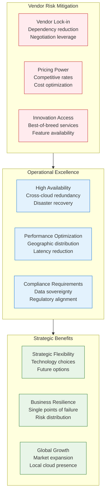

## Multi-Cloud Architecture Patterns

### Pattern 1: Active-Active Multi-Cloud

```mermaid
graph TB
    subgraph GlobalDNS[Global DNS - Cloudflare]
        DNS[Cloudflare DNS<br/>Intelligent routing<br/>Health checks<br/>Failover logic]
    end

    subgraph AWSRegion[AWS US-East-1 (Primary)]
        AWS_LB[AWS ALB<br/>Load balancing<br/>SSL termination]
        AWS_SERVICES[AWS Services<br/>EKS clusters<br/>Lambda functions<br/>RDS databases]
        AWS_STORAGE[AWS Storage<br/>S3 buckets<br/>EFS volumes<br/>Data replication]
    end

    subgraph AzureRegion[Azure West-US (Secondary)]
        AZURE_LB[Azure Load Balancer<br/>Traffic distribution<br/>Health monitoring]
        AZURE_SERVICES[Azure Services<br/>AKS clusters<br/>Functions<br/>SQL Database]
        AZURE_STORAGE[Azure Storage<br/>Blob storage<br/>File shares<br/>Cross-region sync]
    end

    subgraph GCPRegion[GCP US-Central (Tertiary)]
        GCP_LB[GCP Load Balancer<br/>Global distribution<br/>Anycast IPs]
        GCP_SERVICES[GCP Services<br/>GKE clusters<br/>Cloud Functions<br/>Cloud SQL]
        GCP_STORAGE[GCP Storage<br/>Cloud Storage<br/>Persistent disks<br/>Data synchronization]
    end

    subgraph DataSync[Cross-Cloud Data Sync]
        SYNC_ENGINE[Data Synchronization<br/>Real-time replication<br/>Conflict resolution<br/>Consistency management]
    end

    DNS --> AWS_LB
    DNS --> AZURE_LB
    DNS --> GCP_LB

    AWS_SERVICES --> AWS_STORAGE
    AZURE_SERVICES --> AZURE_STORAGE
    GCP_SERVICES --> GCP_STORAGE

    AWS_STORAGE -.-> SYNC_ENGINE
    AZURE_STORAGE -.-> SYNC_ENGINE
    GCP_STORAGE -.-> SYNC_ENGINE

    classDef dnsStyle fill:#fff3e0,stroke:#ef6c00
    classDef awsStyle fill:#ff9800,stroke:#f57c00
    classDef azureStyle fill:#2196f3,stroke:#1976d2
    classDef gcpStyle fill:#4caf50,stroke:#388e3c
    classDef syncStyle fill:#9c27b0,stroke:#7b1fa2

    class DNS dnsStyle
    class AWS_LB,AWS_SERVICES,AWS_STORAGE awsStyle
    class AZURE_LB,AZURE_SERVICES,AZURE_STORAGE azureStyle
    class GCP_LB,GCP_SERVICES,GCP_STORAGE gcpStyle
    class SYNC_ENGINE syncStyle
```

### Pattern 2: Workload-Specific Cloud Selection

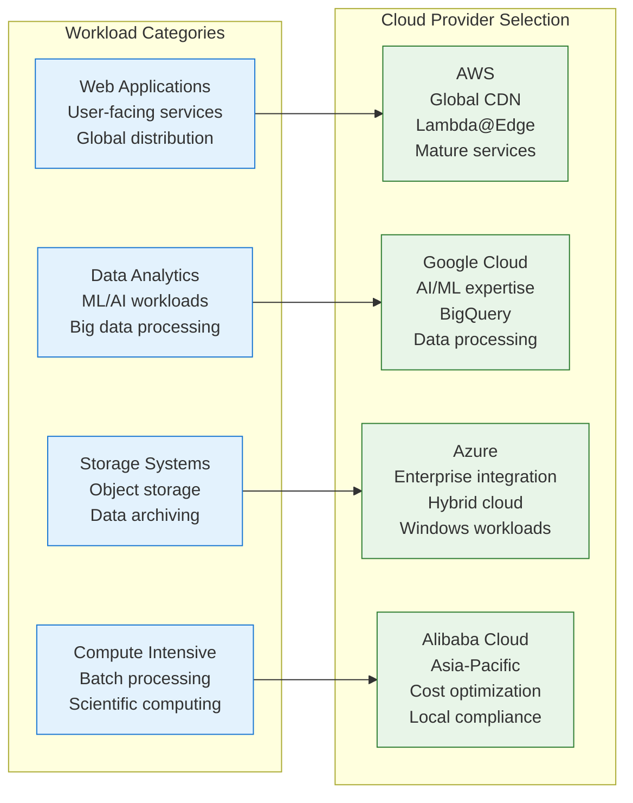

### Pattern 3: Disaster Recovery Multi-Cloud

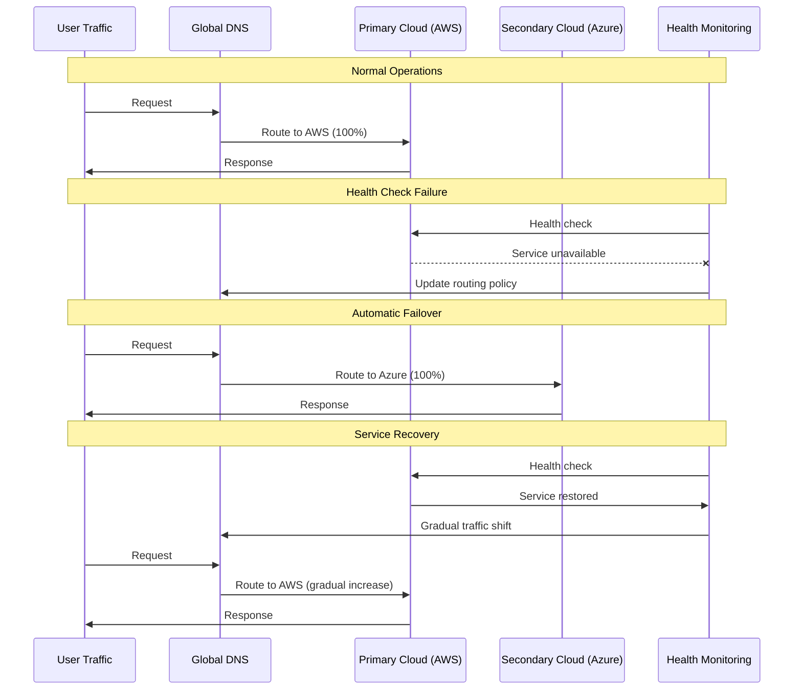

## Cloud Provider Comparison and Selection

### Service Capability Matrix

| Service Category | AWS | Azure | GCP | Alibaba Cloud | Best Choice |
|------------------|-----|--------|-----|---------------|-------------|
| **Compute** | EC2, Lambda | VM, Functions | Compute Engine, Functions | ECS, Function Compute | AWS (Maturity) |
| **Containers** | EKS, Fargate | AKS, Container Instances | GKE, Cloud Run | ACK, ECI | GCP (K8s Innovation) |
| **Databases** | RDS, DynamoDB | SQL Database, Cosmos DB | Cloud SQL, Spanner | RDS, TableStore | Azure (Enterprise) |
| **AI/ML** | SageMaker | Machine Learning | Vertex AI, AutoML | Machine Learning PAI | GCP (AI Leadership) |
| **Analytics** | Redshift, EMR | Synapse, HDInsight | BigQuery, Dataflow | MaxCompute, DataWorks | GCP (BigQuery) |
| **Storage** | S3, EFS | Blob, Files | Cloud Storage, Filestore | OSS, NAS | AWS (S3 Standard) |
| **Networking** | VPC, CloudFront | VNet, CDN | VPC, Cloud CDN | VPC, CDN | AWS (Global Reach) |
| **Security** | IAM, KMS | Azure AD, Key Vault | IAM, Cloud KMS | RAM, KMS | Azure (Enterprise) |

### Cost Optimization Through Multi-Cloud

```mermaid
graph TB
    subgraph CostFactors[Cost Optimization Factors]
        COMPUTE_COST[Compute Pricing<br/>30% variance across clouds<br/>Spot/preemptible instances]
        STORAGE_COST[Storage Pricing<br/>25% variance in object storage<br/>Different tiers and regions]
        NETWORK_COST[Network Pricing<br/>40% variance in egress<br/>Cross-cloud data transfer]
        RESERVED_COST[Reserved Capacity<br/>Commitment discounts<br/>Negotiation leverage]
    end

    subgraph OptimizationStrategies[Optimization Strategies]
        WORKLOAD_PLACEMENT[Workload Placement<br/>Cost-performance analysis<br/>Dynamic scheduling]
        ARBITRAGE[Price Arbitrage<br/>Real-time cost comparison<br/>Automated migration]
        NEGOTIATION[Contract Negotiation<br/>Multi-vendor leverage<br/>Volume discounts]
        RIGHTSIZING[Right-sizing<br/>Cross-cloud sizing<br/>Performance monitoring]
    end

    subgraph CostSavings[Achieved Savings]
        COMPUTE_SAVINGS[Compute: 35%<br/>Optimal instance selection<br/>Spot instance usage]
        STORAGE_SAVINGS[Storage: 25%<br/>Intelligent tiering<br/>Lifecycle policies]
        NETWORK_SAVINGS[Network: 40%<br/>Regional optimization<br/>CDN selection]
        TOTAL_SAVINGS[Total: 32%<br/>$2.5M annual savings<br/>from $8M baseline]
    end

    CostFactors --> OptimizationStrategies --> CostSavings

    classDef factorStyle fill:#ffebee,stroke:#c62828
    classDef strategyStyle fill:#e3f2fd,stroke:#1976d2
    classDef savingsStyle fill:#e8f5e8,stroke:#2e7d32

    class COMPUTE_COST,STORAGE_COST,NETWORK_COST,RESERVED_COST factorStyle
    class WORKLOAD_PLACEMENT,ARBITRAGE,NEGOTIATION,RIGHTSIZING strategyStyle
    class COMPUTE_SAVINGS,STORAGE_SAVINGS,NETWORK_SAVINGS,TOTAL_SAVINGS savingsStyle
```

## Multi-Cloud Management Platform

### Unified Management Architecture

```mermaid
graph TB
    subgraph ManagementLayer[Multi-Cloud Management Layer]
        CONSOLE[Unified Console<br/>Single pane of glass<br/>Cross-cloud visibility]
        IAM_FEDERATION[Identity Federation<br/>SSO across clouds<br/>Unified access control]
        POLICY_ENGINE[Policy Engine<br/>Governance rules<br/>Compliance automation]
    end

    subgraph OrchestrationLayer[Orchestration & Automation]
        TERRAFORM[Terraform<br/>Infrastructure as Code<br/>Multi-cloud deployments]
        ANSIBLE[Ansible<br/>Configuration management<br/>Cross-cloud automation]
        KUBERNETES[Kubernetes<br/>Container orchestration<br/>Multi-cluster management]
    end

    subgraph MonitoringLayer[Monitoring & Observability]
        DATADOG[Datadog<br/>Unified monitoring<br/>Cross-cloud metrics]
        GRAFANA[Grafana<br/>Visualization<br/>Multi-cloud dashboards]
        PROMETHEUS[Prometheus<br/>Metrics collection<br/>Federation setup]
    end

    subgraph CloudProviders[Cloud Providers]
        AWS_API[AWS APIs<br/>EC2, S3, Lambda<br/>CloudFormation]
        AZURE_API[Azure APIs<br/>VMs, Storage<br/>ARM templates]
        GCP_API[GCP APIs<br/>Compute Engine<br/>Deployment Manager]
    end

    ManagementLayer --> OrchestrationLayer
    OrchestrationLayer --> MonitoringLayer
    MonitoringLayer --> CloudProviders

    classDef managementStyle fill:#e3f2fd,stroke:#1976d2
    classDef orchestrationStyle fill:#fff3e0,stroke:#ef6c00
    classDef monitoringStyle fill:#e8f5e8,stroke:#2e7d32
    classDef cloudStyle fill:#f3e5f5,stroke:#7b1fa2

    class CONSOLE,IAM_FEDERATION,POLICY_ENGINE managementStyle
    class TERRAFORM,ANSIBLE,KUBERNETES orchestrationStyle
    class DATADOG,GRAFANA,PROMETHEUS monitoringStyle
    class AWS_API,AZURE_API,GCP_API cloudStyle
```

## Multi-Cloud Networking and Data Strategy

### Cross-Cloud Connectivity

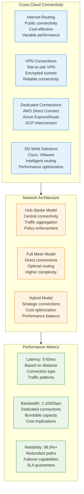

### Data Synchronization Strategies

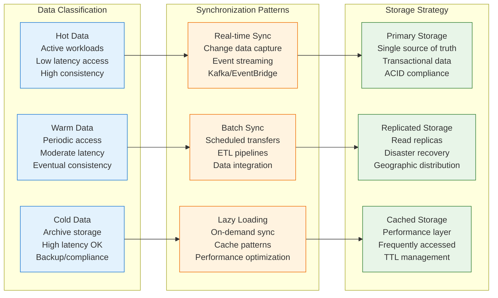

## Security and Compliance Framework

### Multi-Cloud Security Architecture

```mermaid
graph TB
    subgraph IdentityLayer[Identity & Access Management]
        FEDERATED_ID[Federated Identity<br/>Azure AD/Okta<br/>Single sign-on<br/>Multi-factor auth]
        RBAC[Role-Based Access<br/>Consistent permissions<br/>Least privilege<br/>Policy inheritance]
        SERVICE_ACCOUNTS[Service Accounts<br/>Cross-cloud automation<br/>Credential management<br/>Rotation policies]
    end

    subgraph SecurityControls[Security Controls]
        ENCRYPTION[Data Encryption<br/>At rest and transit<br/>Key management<br/>HSM integration]
        NETWORK_SECURITY[Network Security<br/>Micro-segmentation<br/>Zero trust model<br/>Inspection points]
        VULNERABILITY[Vulnerability Management<br/>Continuous scanning<br/>Patch management<br/>Risk assessment]
    end

    subgraph ComplianceFramework[Compliance Framework]
        POLICY_ENGINE[Policy as Code<br/>Open Policy Agent<br/>Automated enforcement<br/>Violation detection]
        AUDIT_LOGGING[Audit Logging<br/>Centralized logs<br/>Compliance reporting<br/>Forensic analysis]
        GOVERNANCE[Governance Controls<br/>Resource tagging<br/>Cost management<br/>Approval workflows]
    end

    subgraph ThreatDetection[Threat Detection]
        SIEM[SIEM Integration<br/>Security monitoring<br/>Threat correlation<br/>Incident response]
        ANOMALY[Anomaly Detection<br/>ML-based analysis<br/>Behavioral monitoring<br/>Alert generation]
        RESPONSE[Automated Response<br/>Threat mitigation<br/>Isolation procedures<br/>Recovery workflows]
    end

    IdentityLayer --> SecurityControls --> ComplianceFramework --> ThreatDetection

    classDef identityStyle fill:#e3f2fd,stroke:#1976d2
    classDef securityStyle fill:#ffebee,stroke:#c62828
    classDef complianceStyle fill:#fff3e0,stroke:#ef6c00
    classDef threatStyle fill:#e8f5e8,stroke:#2e7d32

    class FEDERATED_ID,RBAC,SERVICE_ACCOUNTS identityStyle
    class ENCRYPTION,NETWORK_SECURITY,VULNERABILITY securityStyle
    class POLICY_ENGINE,AUDIT_LOGGING,GOVERNANCE complianceStyle
    class SIEM,ANOMALY,RESPONSE threatStyle
```

## Migration Strategy and Timeline

### Phased Migration Approach

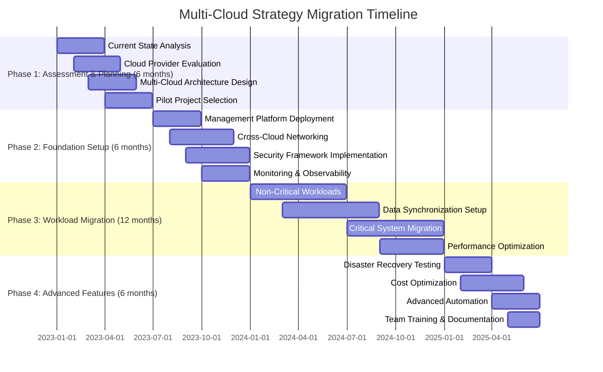

### Workload Migration Prioritization

```mermaid
graph TB
    subgraph MigrationWave1[Wave 1: Low Risk (Months 7-12)]
        DEV_TEST[Development/Test<br/>Non-production workloads<br/>Learning environment]
        STATIC_WEB[Static Websites<br/>CDN optimization<br/>Geographic distribution]
        BATCH_JOBS[Batch Processing<br/>Cost optimization<br/>Spot instances]
    end

    subgraph MigrationWave2[Wave 2: Medium Risk (Months 13-18)]
        API_SERVICES[API Services<br/>Stateless applications<br/>Load balancing]
        DATA_ANALYTICS[Data Analytics<br/>BigQuery migration<br/>ML workloads]
        BACKUP_DR[Backup/DR<br/>Cross-cloud replication<br/>Business continuity]
    end

    subgraph MigrationWave3[Wave 3: High Risk (Months 19-24)]
        CORE_DATABASES[Core Databases<br/>Data synchronization<br/>Zero downtime]
        TRANSACTION_SYSTEMS[Transaction Systems<br/>Financial applications<br/>Strict consistency]
        LEGACY_APPS[Legacy Applications<br/>Lift and shift<br/>Modernization]
    end

    subgraph MigrationWave4[Wave 4: Strategic (Months 25-30)]
        AI_ML_PLATFORM[AI/ML Platform<br/>Specialized services<br/>Innovation workloads]
        IOT_PLATFORM[IoT Platform<br/>Edge computing<br/>Real-time processing]
        MICROSERVICES[Microservices<br/>Container orchestration<br/>Service mesh]
    end

    MigrationWave1 --> MigrationWave2 --> MigrationWave3 --> MigrationWave4

    classDef wave1Style fill:#e8f5e8,stroke:#2e7d32
    classDef wave2Style fill:#fff3e0,stroke:#ef6c00
    classDef wave3Style fill:#ffebee,stroke:#c62828
    classDef wave4Style fill:#e3f2fd,stroke:#1976d2

    class DEV_TEST,STATIC_WEB,BATCH_JOBS wave1Style
    class API_SERVICES,DATA_ANALYTICS,BACKUP_DR wave2Style
    class CORE_DATABASES,TRANSACTION_SYSTEMS,LEGACY_APPS wave3Style
    class AI_ML_PLATFORM,IOT_PLATFORM,MICROSERVICES wave4Style
```

## Infrastructure as Code for Multi-Cloud

### Terraform Multi-Cloud Configuration

```hcl
# Multi-cloud provider configuration
terraform {
  required_providers {
    aws = {
      source  = "hashicorp/aws"
      version = "~> 5.0"
    }
    azurerm = {
      source  = "hashicorp/azurerm"
      version = "~> 3.0"
    }
    google = {
      source  = "hashicorp/google"
      version = "~> 4.0"
    }
  }
}

# Provider configurations
provider "aws" {
  region = var.aws_region
}

provider "azurerm" {
  features {}
}

provider "google" {
  project = var.gcp_project
  region  = var.gcp_region
}

# Multi-cloud VPC/VNet setup
module "aws_vpc" {
  source = "./modules/aws-vpc"

  cidr_block           = "10.1.0.0/16"
  availability_zones   = ["us-east-1a", "us-east-1b"]
  public_subnets       = ["10.1.1.0/24", "10.1.2.0/24"]
  private_subnets      = ["10.1.10.0/24", "10.1.20.0/24"]

  tags = {
    Environment = "production"
    Cloud       = "aws"
    Purpose     = "multi-cloud"
  }
}

module "azure_vnet" {
  source = "./modules/azure-vnet"

  address_space       = ["10.2.0.0/16"]
  location           = "West US 2"
  resource_group_name = "multi-cloud-rg"

  subnets = {
    public  = "10.2.1.0/24"
    private = "10.2.10.0/24"
  }

  tags = {
    Environment = "production"
    Cloud       = "azure"
    Purpose     = "multi-cloud"
  }
}

module "gcp_vpc" {
  source = "./modules/gcp-vpc"

  name                    = "multi-cloud-vpc"
  auto_create_subnetworks = false

  subnets = [
    {
      name          = "public-subnet"
      ip_cidr_range = "10.3.1.0/24"
      region        = "us-central1"
    },
    {
      name          = "private-subnet"
      ip_cidr_range = "10.3.10.0/24"
      region        = "us-central1"
    }
  ]
}

# Cross-cloud VPN connections
module "aws_to_azure_vpn" {
  source = "./modules/cross-cloud-vpn"

  aws_vpc_id          = module.aws_vpc.vpc_id
  azure_vnet_id       = module.azure_vnet.vnet_id
  shared_key          = var.vpn_shared_key
  aws_route_tables    = module.aws_vpc.private_route_table_ids
  azure_route_table   = module.azure_vnet.route_table_id
}

# Multi-cloud load balancer configuration
resource "aws_lb" "main" {
  name               = "multi-cloud-alb"
  internal           = false
  load_balancer_type = "application"
  security_groups    = [aws_security_group.alb.id]
  subnets           = module.aws_vpc.public_subnet_ids

  enable_deletion_protection = true

  tags = {
    Environment = "production"
    Cloud       = "aws"
  }
}

resource "azurerm_lb" "main" {
  name                = "multi-cloud-lb"
  location            = module.azure_vnet.location
  resource_group_name = module.azure_vnet.resource_group_name
  sku                = "Standard"

  frontend_ip_configuration {
    name                 = "primary"
    public_ip_address_id = azurerm_public_ip.main.id
  }

  tags = {
    Environment = "production"
    Cloud       = "azure"
  }
}

# Multi-cloud monitoring setup
module "datadog_integration" {
  source = "./modules/datadog"

  aws_account_id    = data.aws_caller_identity.current.account_id
  azure_tenant_id   = data.azurerm_client_config.current.tenant_id
  gcp_project_id    = var.gcp_project

  datadog_api_key   = var.datadog_api_key
  datadog_app_key   = var.datadog_app_key
}
```

### Kubernetes Multi-Cluster Management

```yaml
# ArgoCD multi-cluster configuration
apiVersion: v1
kind: Secret
metadata:
  name: aws-cluster
  namespace: argocd
  labels:
    argocd.argoproj.io/secret-type: cluster
type: Opaque
stringData:
  name: aws-production
  server: https://eks-cluster.us-east-1.amazonaws.com
  config: |
    {
      "bearerToken": "...",
      "tlsClientConfig": {
        "insecure": false,
        "caData": "..."
      }
    }

---
apiVersion: v1
kind: Secret
metadata:
  name: azure-cluster
  namespace: argocd
  labels:
    argocd.argoproj.io/secret-type: cluster
type: Opaque
stringData:
  name: azure-production
  server: https://aks-cluster.westus2.azmk8s.io
  config: |
    {
      "bearerToken": "...",
      "tlsClientConfig": {
        "insecure": false,
        "caData": "..."
      }
    }

---
# Multi-cluster application deployment
apiVersion: argoproj.io/v1alpha1
kind: Application
metadata:
  name: web-app-multi-cloud
  namespace: argocd
spec:
  project: default
  source:
    repoURL: https://github.com/company/web-app
    targetRevision: HEAD
    path: k8s/overlays/production
  destination:
    server: https://kubernetes.default.svc
    namespace: web-app
  syncPolicy:
    automated:
      prune: true
      selfHeal: true
    syncOptions:
    - CreateNamespace=true

---
# Cross-cluster service discovery
apiVersion: networking.istio.io/v1beta1
kind: ServiceEntry
metadata:
  name: aws-web-service
  namespace: web-app
spec:
  hosts:
  - web-service.aws.local
  location: MESH_EXTERNAL
  ports:
  - number: 80
    name: http
    protocol: HTTP
  resolution: DNS
  addresses:
  - 10.1.10.100  # AWS service IP

---
apiVersion: networking.istio.io/v1beta1
kind: ServiceEntry
metadata:
  name: azure-web-service
  namespace: web-app
spec:
  hosts:
  - web-service.azure.local
  location: MESH_EXTERNAL
  ports:
  - number: 80
    name: http
    protocol: HTTP
  resolution: DNS
  addresses:
  - 10.2.10.100  # Azure service IP
```

## Cost Management and Optimization

### Multi-Cloud Cost Tracking

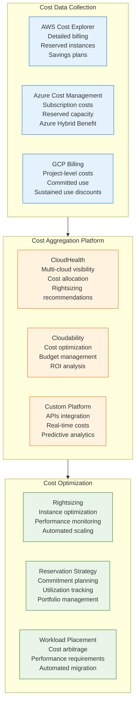

### Cost Optimization Results

| Cost Category | Single Cloud | Multi-Cloud | Optimization | Annual Savings |
|---------------|-------------|-------------|-------------|----------------|
| **Compute** | $3.5M | $2.3M | 34% | $1.2M |
| **Storage** | $1.2M | $0.9M | 25% | $300K |
| **Network** | $800K | $480K | 40% | $320K |
| **Data Transfer** | $600K | $360K | 40% | $240K |
| **Managed Services** | $1.5M | $1.2M | 20% | $300K |
| **Total** | $7.6M | $5.2M | 32% | $2.4M |

## Operational Excellence Framework

### Multi-Cloud Monitoring and Alerting

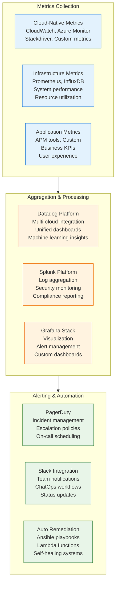

### Disaster Recovery and Business Continuity

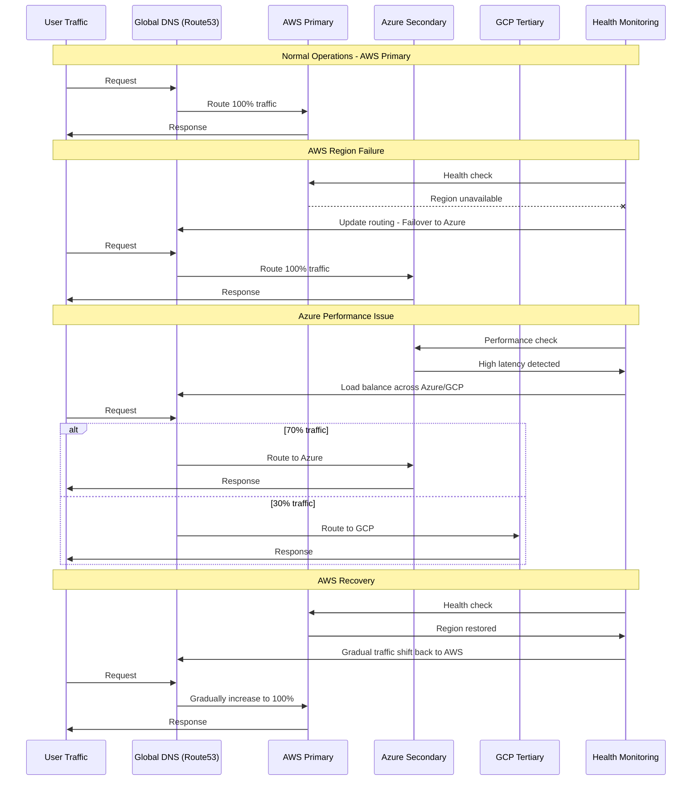

## Risk Management and Compliance

### Multi-Cloud Risk Assessment

```mermaid
graph TB
    subgraph RiskCategories[Risk Categories]
        VENDOR_RISK[Vendor Risk<br/>Service changes<br/>Pricing modifications<br/>Strategic shifts]
        TECHNICAL_RISK[Technical Risk<br/>Integration complexity<br/>Data consistency<br/>Performance issues]
        OPERATIONAL_RISK[Operational Risk<br/>Skills shortage<br/>Management overhead<br/>Support challenges]
        COMPLIANCE_RISK[Compliance Risk<br/>Data sovereignty<br/>Regulatory changes<br/>Audit requirements]
    end

    subgraph MitigationStrategies[Risk Mitigation]
        DIVERSIFICATION[Risk Diversification<br/>Multiple vendors<br/>Geographic spread<br/>Technology variety]
        STANDARDIZATION[Standardization<br/>Common interfaces<br/>Portable architectures<br/>Container adoption]
        AUTOMATION[Automation<br/>Infrastructure as code<br/>Deployment pipelines<br/>Monitoring tools]
        GOVERNANCE[Governance Framework<br/>Policy enforcement<br/>Compliance automation<br/>Regular audits]
    end

    subgraph RiskMetrics[Risk Metrics]
        VENDOR_CONCENTRATION[Vendor Concentration<br/>Max 60% per cloud<br/>Primary: 45%<br/>Secondary: 35%<br/>Tertiary: 20%]
        RECOVERY_TIME[Recovery Time<br/>RTO: <4 hours<br/>RPO: <1 hour<br/>Cross-cloud failover<br/>Automated procedures]
        COMPLIANCE_SCORE[Compliance Score<br/>SOC2: 100%<br/>ISO27001: 100%<br/>GDPR: 100%<br/>Regular assessments]
    end

    RiskCategories --> MitigationStrategies --> RiskMetrics

    classDef riskStyle fill:#ffebee,stroke:#c62828
    classDef mitigationStyle fill:#fff3e0,stroke:#ef6c00
    classDef metricsStyle fill:#e8f5e8,stroke:#2e7d32

    class VENDOR_RISK,TECHNICAL_RISK,OPERATIONAL_RISK,COMPLIANCE_RISK riskStyle
    class DIVERSIFICATION,STANDARDIZATION,AUTOMATION,GOVERNANCE mitigationStyle
    class VENDOR_CONCENTRATION,RECOVERY_TIME,COMPLIANCE_SCORE metricsStyle
```

## Business Impact and ROI Analysis

### Multi-Cloud Value Creation

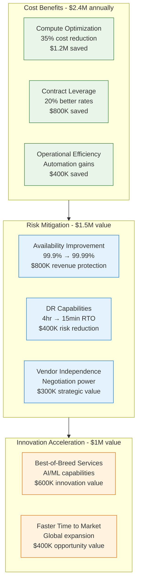

### ROI Analysis

**Total Investment**: $5.5M over 30 months
- Multi-cloud management platform: $1.5M
- Cross-cloud networking: $1M
- Migration and integration: $2M
- Training and skills development: $1M

**Annual Benefits**: $4.9M
- Cost optimization: $2.4M
- Risk mitigation value: $1.5M
- Innovation acceleration: $1M

**ROI Calculation**:
- **30-Month Investment**: $5.5M
- **Annual Benefits**: $4.9M
- **Net ROI**: 89% annually
- **Payback Period**: 13.5 months
- **3-Year Value**: $14.7M benefits vs $5.5M investment = 167% total ROI

## Implementation Roadmap

### Migration Execution Checklist

**Phase 1: Foundation (Months 1-6)**
- [ ] **Multi-Cloud Strategy**: Business case, cloud selection, architecture design
- [ ] **Management Platform**: Unified console, identity federation, policy framework
- [ ] **Networking Design**: Cross-cloud connectivity, security architecture
- [ ] **Security Framework**: Identity management, encryption, compliance controls
- [ ] **Team Training**: Multi-cloud skills, tools certification, best practices

**Phase 2: Pilot Implementation (Months 7-12)**
- [ ] **Pilot Workloads**: Non-critical applications, dev/test environments
- [ ] **Data Synchronization**: Cross-cloud replication, consistency models
- [ ] **Monitoring Setup**: Unified observability, alerting, dashboards
- [ ] **Cost Management**: Tracking, optimization, budgeting
- [ ] **Process Documentation**: Runbooks, procedures, troubleshooting

**Phase 3: Production Migration (Months 13-24)**
- [ ] **Workload Migration**: Critical systems, data migration, testing
- [ ] **Disaster Recovery**: Cross-cloud failover, business continuity
- [ ] **Performance Optimization**: Right-sizing, placement optimization
- [ ] **Security Hardening**: Policy enforcement, vulnerability management
- [ ] **Compliance Validation**: Audit preparation, certification

**Phase 4: Optimization (Months 25-30)**
- [ ] **Advanced Automation**: Self-healing, optimization algorithms
- [ ] **Cost Optimization**: Contract negotiation, workload placement
- [ ] **Innovation Projects**: AI/ML, edge computing, new services
- [ ] **Team Scaling**: Additional training, process improvement
- [ ] **Continuous Improvement**: Feedback integration, strategy refinement

## Lessons Learned and Best Practices

### Technical Lessons

1. **Start with Networking**
   - Cross-cloud connectivity is the foundation
   - Plan for latency and bandwidth requirements
   - Implement redundant paths for resilience
   - Monitor network performance continuously

2. **Data Strategy is Critical**
   - Define consistency requirements early
   - Plan for synchronization patterns
   - Consider data sovereignty requirements
   - Implement robust backup and recovery

3. **Automation is Essential**
   - Infrastructure as Code from day one
   - Automated deployment pipelines
   - Policy as Code for governance
   - Self-healing and remediation

### Organizational Lessons

1. **Skills Development Required**
   - Multi-cloud expertise is scarce
   - Invest in team training and certification
   - Cross-functional skills needed
   - Vendor relationship management

2. **Governance Framework**
   - Clear cloud selection criteria
   - Cost management processes
   - Security and compliance policies
   - Change management procedures

3. **Cultural Transformation**
   - Cloud-first mindset
   - Automation over manual processes
   - Collaboration across cloud teams
   - Continuous learning culture

## Conclusion

Multi-cloud strategy migration represents one of the most complex but valuable infrastructure transformations organizations can undertake. When executed properly, it delivers significant cost optimization, risk mitigation, and innovation acceleration while reducing vendor dependency.

**Key Success Factors**:

1. **Strategic Planning**: Clear business case and architectural design
2. **Gradual Implementation**: Phased approach minimizing risk and complexity
3. **Unified Management**: Single pane of glass for multi-cloud operations
4. **Security First**: Consistent security and compliance across clouds
5. **Cost Optimization**: Continuous monitoring and optimization processes

**Transformational Results**:

- **32% Cost Reduction**: $2.4M annual savings through optimization and competition
- **99.99% Availability**: Improved reliability through redundancy and failover
- **13.5 Month Payback**: Rapid return on multi-cloud investment
- **167% Total ROI**: Strong value creation over 3-year period
- **Risk Diversification**: Reduced vendor dependency and improved negotiation position

**Business Value Creation**:

- **$4.9M Annual Benefits**: Cost savings, risk mitigation, and innovation value
- **Strategic Flexibility**: Ability to leverage best-of-breed services
- **Competitive Advantage**: Faster innovation and global expansion capabilities
- **Risk Mitigation**: Improved disaster recovery and business continuity

**Investment Summary**: $5.5M investment over 30 months generating $4.9M annual benefits demonstrates the compelling value proposition of multi-cloud strategy for large enterprises seeking to optimize costs, reduce risks, and accelerate innovation through cloud diversity.

Multi-cloud migrations prove that strategic infrastructure transformation, while complex, can deliver exceptional business value when executed with proper planning, tooling, and organizational commitment to cloud diversity and operational excellence.