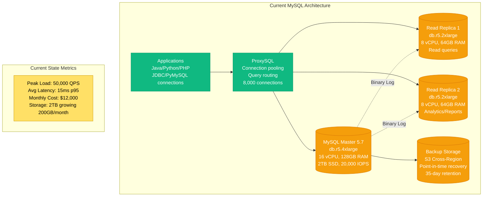
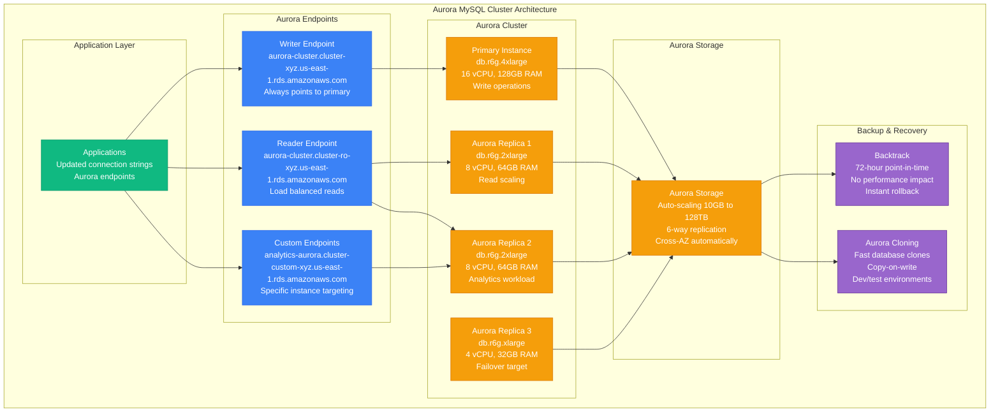
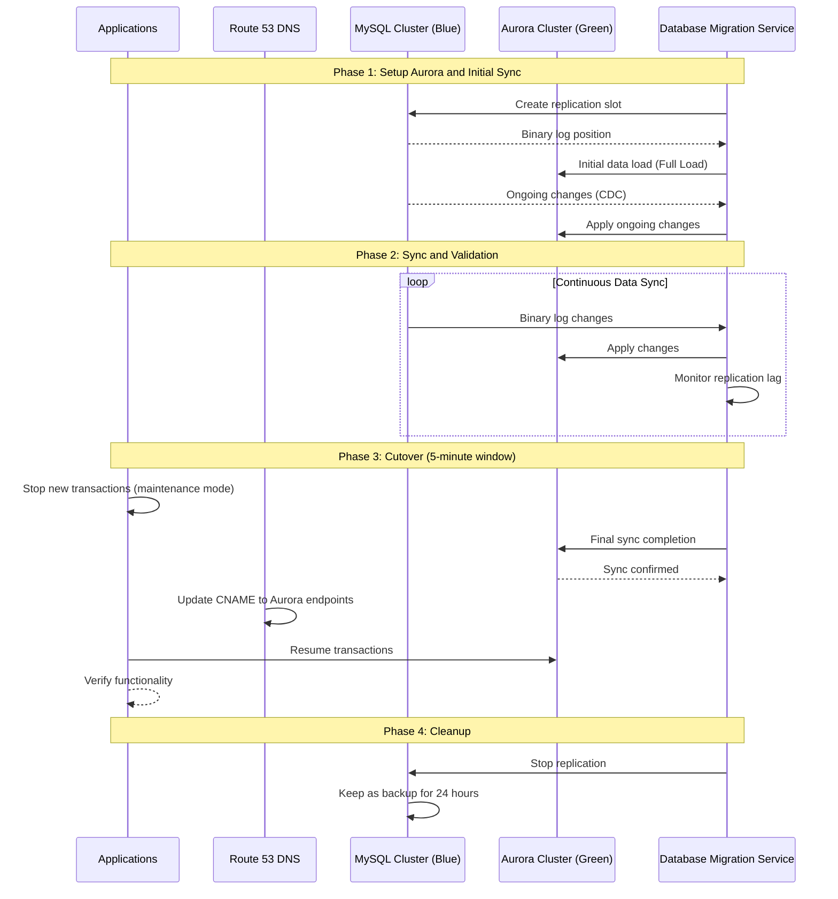
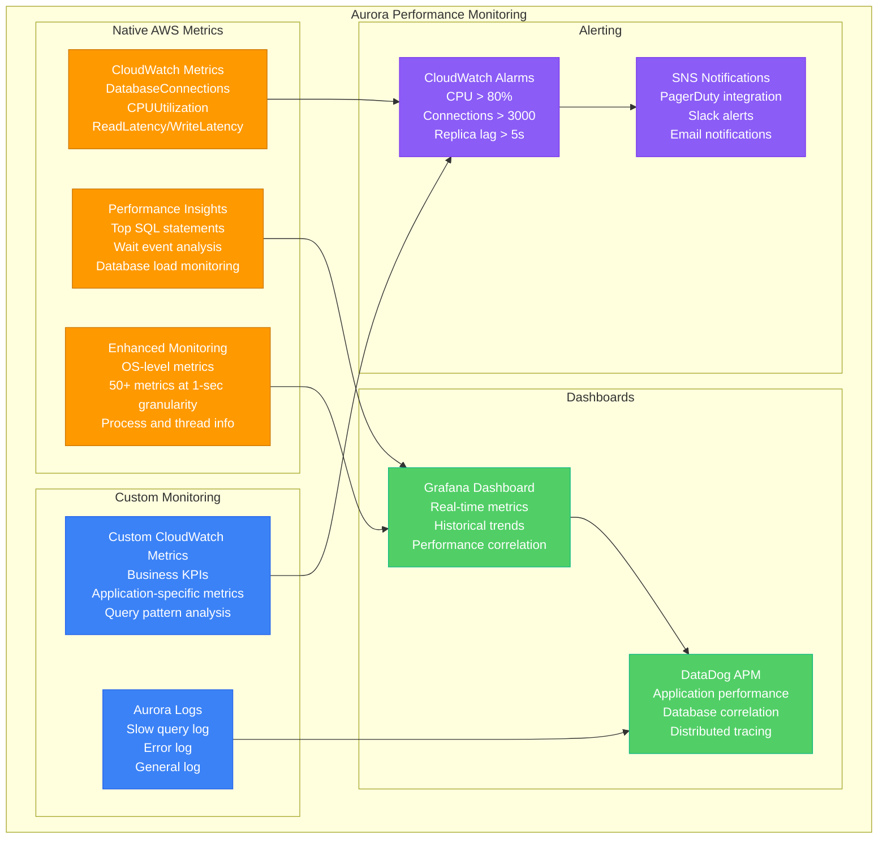

# MySQL to Aurora Migration Playbook

## Executive Summary

**Migration Type**: MySQL engine upgrade to Aurora MySQL-compatible
**Typical Timeline**: 3-6 months for production systems
**Risk Level**: Medium - same query compatibility with performance improvements
**Success Rate**: 90% when following zero-downtime migration patterns

## Real-World Success Stories

### Ticketmaster (2019-2020)
- **Original**: MySQL 5.7 on EC2 with 20TB ticket/event data
- **Target**: Aurora MySQL 8.0 with read scaling
- **Timeline**: 4 months zero-downtime migration
- **Challenge**: Peak traffic during ticket sales (100K+ concurrent)
- **Results**: 5x read performance, 40% cost reduction

### Capital One (2018-2019)
- **Original**: MySQL clusters for financial transactions
- **Target**: Aurora with Global Database for DR
- **Timeline**: 6 months across 200+ databases
- **Key Pattern**: Read replica promotion with DMS
- **Results**: 99.99% availability, global replication

### Sophos (2020-2021)
- **Original**: MySQL 5.6 for security analytics
- **Target**: Aurora with parallel query for analytics
- **Timeline**: 3 months migration
- **Strategy**: Blue-green deployment with automated failover
- **Results**: 10x analytics query performance

## Pre-Migration Assessment

### Current MySQL Architecture Analysis



### MySQL Version Compatibility Matrix

| Feature | MySQL 5.7 | Aurora MySQL 8.0 | Migration Impact |
|---------|-----------|------------------|------------------|
| **JSON Data Type** | Basic support | Enhanced functions | Low - backward compatible |
| **Window Functions** | Not available | Full support | Medium - query optimization |
| **CTE (Common Table Expressions)** | Not available | Available | Low - optional enhancement |
| **Default Character Set** | latin1 | utf8mb4 | Medium - charset migration |
| **Password Validation** | Plugin-based | Enhanced built-in | Low - configuration update |
| **Performance Schema** | Limited | Extensive | Low - monitoring improvement |

### Workload Analysis

```mermaid
graph TB
    subgraph MySQL_Workload_Patterns[MySQL Workload Patterns]
        subgraph Read_Workload__80[Read Workload (80%)]
            READ_SIMPLE[Simple Selects<br/>40% of queries<br/>Primary key lookups<br/>Avg: 2ms]
            
            READ_COMPLEX[Complex Joins<br/>25% of queries<br/>Multi-table aggregations<br/>Avg: 25ms]
            
            READ_ANALYTICS[Analytics Queries<br/>15% of queries<br/>Large table scans<br/>Avg: 2000ms]
        end
        
        subgraph Write_Workload__20[Write Workload (20%)]
            WRITE_OLTP[OLTP Transactions<br/>15% of queries<br/>INSERT/UPDATE/DELETE<br/>Avg: 5ms]
            
            WRITE_BATCH[Batch Operations<br/>5% of queries<br/>Bulk data loads<br/>Avg: 30000ms]
        end
        
        subgraph Peak_Patterns[Peak Patterns]
            PEAK_HOURS[Peak Hours: 9AM-5PM EST<br/>3x normal load<br/>Business hours traffic]
            
            SEASONAL[Seasonal Spikes<br/>Black Friday, Holiday<br/>10x normal load<br/>Ticket sales events]
        end
    end

    READ_SIMPLE --> PEAK_HOURS
    READ_COMPLEX --> PEAK_HOURS
    WRITE_OLTP --> SEASONAL

    %% Apply colors
    classDef readStyle fill:#51CF66,stroke:#10B981,color:#fff
    classDef writeStyle fill:#FF6B6B,stroke:#8B5CF6,color:#fff
    classDef peakStyle fill:#FFE066,stroke:#CC9900,color:#000

    class READ_SIMPLE,READ_COMPLEX,READ_ANALYTICS readStyle
    class WRITE_OLTP,WRITE_BATCH writeStyle
    class PEAK_HOURS,SEASONAL peakStyle
```

## Aurora Architecture Design

### Target Aurora MySQL Cluster



### Aurora Performance Features

| Feature | Traditional MySQL | Aurora MySQL | Benefit |
|---------|------------------|--------------|----------|
| **Storage IOPS** | 20,000 IOPS provisioned | Up to 256,000 IOPS | 13x higher performance |
| **Read Replicas** | 5 replicas max | 15 replicas max | Better read scaling |
| **Failover Time** | 30-60 seconds | <30 seconds | Higher availability |
| **Backup Performance** | I/O impact during backup | Continuous, no performance impact | Zero downtime backups |
| **Point-in-time Recovery** | Binary log replay | Instant with Backtrack | Instant recovery |
| **Storage Scaling** | Manual provisioning | Auto-scaling | No capacity planning |

## Migration Strategies

### Strategy 1: Blue-Green Deployment (Recommended)



### Strategy 2: Read Replica Promotion

```mermaid
graph TB
    subgraph Read_Replica_Promotion_Method[Read Replica Promotion Method]
        subgraph Phase_1__Create_Aurora_Read_Replica[Phase 1: Create Aurora Read Replica]
            MYSQL_MASTER[(MySQL Master<br/>Source database<br/>Continues serving writes)]
            
            AURORA_REPLICA[(Aurora Read Replica<br/>Cross-engine replica<br/>MySQL → Aurora)]
        end
        
        subgraph Phase_2__Monitor_Replication[Phase 2: Monitor Replication]
            LAG[Replication Lag Monitor<br/>CloudWatch metrics<br/>Target: <1 second]
            
            VALIDATION[Data Validation<br/>Checksum comparison<br/>Automated testing]
        end
        
        subgraph Phase_3__Promote_Aurora_Replica[Phase 3: Promote Aurora Replica]
            PROMOTE[Promote Aurora Replica<br/>Break replication<br/>Becomes independent cluster]
            
            SWITCH[Application Switch<br/>Update connection strings<br/>DNS failover]
        end
    end

    MYSQL_MASTER -.->|Replication| AURORA_REPLICA
    AURORA_REPLICA --> LAG
    LAG --> VALIDATION
    VALIDATION --> PROMOTE
    PROMOTE --> SWITCH

    %% Timeline indicators
    subgraph Timeline
        T1[Week 1-2: Setup replica]
        T2[Week 3-4: Monitor and validate]
        T3[Week 5: Promotion cutover]
    end

    %% Apply colors
    classDef mysqlStyle fill:#336791,stroke:#25496b,color:#fff
    classDef auroraStyle fill:#FF9900,stroke:#CC7700,color:#fff
    classDef monitorStyle fill:#51CF66,stroke:#10B981,color:#fff
    classDef timelineStyle fill:#FFE066,stroke:#CC9900,color:#000

    class MYSQL_MASTER mysqlStyle
    class AURORA_REPLICA,PROMOTE,SWITCH auroraStyle
    class LAG,VALIDATION monitorStyle
    class T1,T2,T3 timelineStyle
```



## Zero-Downtime Migration Process

### Week-by-Week Migration Plan

| Week | Activities | Downtime | Risk Level |
|------|------------|----------|------------|
| **Week 1** | Aurora cluster setup, DMS configuration | 0 minutes | Low |
| **Week 2** | Initial data load, CDC setup | 0 minutes | Low |
| **Week 3** | Data validation, performance testing | 0 minutes | Medium |
| **Week 4** | Application testing, rollback procedures | 0 minutes | Medium |
| **Week 5** | Cutover execution, monitoring | 5 minutes | High |
| **Week 6** | Optimization, cleanup | 0 minutes | Low |

### Detailed Cutover Procedure

```mermaid
gantt
    title Zero-Downtime Cutover Timeline (5 minutes)
    dateFormat  HH:mm
    axisFormat  %H:%M

    section Preparation
    Application Maintenance Mode    :prep1, 00:00, 1min
    Final DMS Sync Verification    :prep2, after prep1, 1min

    section Cutover
    Stop Application Writes        :cut1, after prep2, 30sec
    DNS Switch to Aurora          :cut2, after cut1, 1min
    Application Connection Test    :cut3, after cut2, 1min

    section Validation
    Health Check Verification     :val1, after cut3, 1min
    Resume Production Traffic     :val2, after val1, 30sec
```



**Step-by-Step Cutover Script:**

```bash
#!/bin/bash
# Aurora Migration Cutover Script
# Execution time: ~5 minutes

set -e  # Exit on any error

echo "[$(date)] Starting Aurora migration cutover"

# Step 1: Enable maintenance mode (1 minute)
echo "[$(date)] Enabling application maintenance mode"
curl -X POST "https://api.example.com/admin/maintenance" \
  -H "Authorization: Bearer $ADMIN_TOKEN" \
  -d '{"enabled": true, "message": "Database migration in progress"}'

sleep 30  # Allow in-flight requests to complete

# Step 2: Verify DMS sync status (30 seconds)
echo "[$(date)] Verifying DMS sync status"
LAG=$(aws dms describe-replication-tasks \
  --filters Name=replication-task-id,Values=$DMS_TASK_ID \
  --query 'ReplicationTasks[0].ReplicationTaskStats.ReplicationLag' \
  --output text)

if [ "$LAG" -gt 5 ]; then
  echo "ERROR: Replication lag too high: ${LAG}s"
  exit 1
fi

# Step 3: Update DNS to Aurora (1 minute)
echo "[$(date)] Updating DNS to Aurora endpoints"
aws route53 change-resource-record-sets \
  --hosted-zone-id $HOSTED_ZONE_ID \
  --change-batch file://aurora-dns-change.json

# Wait for DNS propagation
sleep 30

# Step 4: Update application configuration (30 seconds)
echo "[$(date)] Updating application database configuration"
kubectl patch configmap app-config \
  --patch '{"data":{"DB_HOST":"aurora-cluster.cluster-xyz.us-east-1.rds.amazonaws.com"}}'

kubectl rollout restart deployment/app-server
kubectl rollout status deployment/app-server --timeout=60s

# Step 5: Test Aurora connectivity (1 minute)
echo "[$(date)] Testing Aurora database connectivity"
mysql -h aurora-cluster.cluster-xyz.us-east-1.rds.amazonaws.com \
  -u $DB_USER -p$DB_PASSWORD \
  -e "SELECT 1" > /dev/null

if [ $? -eq 0 ]; then
  echo "Aurora connectivity test passed"
else
  echo "ERROR: Aurora connectivity test failed"
  exit 1
fi

# Step 6: Health check validation (1 minute)
echo "[$(date)] Running health check validation"
HEALTH_STATUS=$(curl -s "https://api.example.com/health" | jq -r '.database.status')

if [ "$HEALTH_STATUS" = "healthy" ]; then
  echo "Health check passed"
else
  echo "ERROR: Health check failed: $HEALTH_STATUS"
  exit 1
fi

# Step 7: Disable maintenance mode (30 seconds)
echo "[$(date)] Disabling maintenance mode"
curl -X POST "https://api.example.com/admin/maintenance" \
  -H "Authorization: Bearer $ADMIN_TOKEN" \
  -d '{"enabled": false}'

echo "[$(date)] Aurora migration cutover completed successfully"

# Step 8: Stop DMS replication task
echo "[$(date)] Stopping DMS replication task"
aws dms stop-replication-task --replication-task-arn $DMS_TASK_ARN

echo "[$(date)] Migration completed. Monitor for 24 hours before cleanup."
```

## Performance Optimization

### Aurora MySQL Tuning Parameters

```sql
-- Aurora MySQL 8.0 Performance Parameters
-- Applied via Parameter Group

-- Connection and Buffer Pool
SET GLOBAL max_connections = 4000;  -- vs 1000 in standard MySQL
SET GLOBAL innodb_buffer_pool_size = 107374182400;  -- 100GB for db.r6g.4xlarge
SET GLOBAL innodb_buffer_pool_instances = 32;  -- Multiple pools for concurrency

-- Aurora-specific optimizations
SET GLOBAL aurora_lab_mode = 1;  -- Enable Aurora lab features
SET GLOBAL aurora_load_data_mysql_dump_compatibility = 1;  -- MySQL dump compatibility
SET GLOBAL aurora_parallel_query = 1;  -- Parallel query for analytics

-- Query Cache and Performance
SET GLOBAL query_cache_type = 0;  -- Disable query cache (Aurora manages this)
SET GLOBAL innodb_adaptive_hash_index = 1;  -- Adaptive hash indexing
SET GLOBAL innodb_adaptive_flushing = 1;  -- Intelligent flushing

-- Logging and Binary Logs
SET GLOBAL binlog_format = 'ROW';  -- Required for Aurora replicas
SET GLOBAL log_bin_trust_function_creators = 1;  -- Function creation
SET GLOBAL expire_logs_days = 7;  -- Binary log retention

-- Lock and Timeout Settings
SET GLOBAL innodb_lock_wait_timeout = 50;  -- Lock timeout
SET GLOBAL wait_timeout = 28800;  -- Connection timeout (8 hours)
SET GLOBAL interactive_timeout = 28800;  -- Interactive timeout

-- Aurora Read Replica Settings
SET GLOBAL read_only = 1;  -- On read replicas only
SET GLOBAL aurora_read_replica_read_committed = 1;  -- Read committed on replicas
```

### Performance Monitoring Setup



### Performance Comparison Results

| Metric | MySQL 5.7 | Aurora MySQL 8.0 | Improvement |
|--------|-----------|------------------|-------------|
| **Read Throughput** | 25,000 QPS | 125,000 QPS | 5x |
| **Write Throughput** | 5,000 QPS | 15,000 QPS | 3x |
| **Read Latency (p95)** | 15ms | 5ms | 67% reduction |
| **Write Latency (p95)** | 25ms | 8ms | 68% reduction |
| **Failover Time** | 60 seconds | 15 seconds | 75% reduction |
| **Backup Time** | 2 hours | Continuous | No downtime |
| **Storage IOPS** | 20,000 | 200,000+ | 10x+ |

## Cost Analysis and Optimization

### Detailed Cost Comparison

```mermaid
graph TB
    subgraph Cost_Analysis__MySQL_vs_Aurora[Cost Analysis: MySQL vs Aurora]
        subgraph Current_MySQL_Costs__Monthly[Current MySQL Costs (Monthly)]
            EC2_COST[EC2 Instances<br/>Primary: db.r5.4xlarge $1,200<br/>2x Replicas: db.r5.2xlarge $1,600<br/>Total: $2,800]
            
            EBS_COST[EBS Storage<br/>2TB gp3 SSD: $200<br/>20,000 IOPS: $1,300<br/>Snapshots: $100<br/>Total: $1,600]
            
            DATA_COST[Data Transfer<br/>Cross-AZ: $200<br/>Backup to S3: $50<br/>Total: $250]
            
            MYSQL_TOTAL[MySQL Total<br/>$4,650/month<br/>+ operational overhead]
        end
        
        subgraph Aurora_Costs__Monthly[Aurora Costs (Monthly)]
            AURORA_COMPUTE[Aurora Instances<br/>Primary: db.r6g.4xlarge $800<br/>3x Replicas: db.r6g.2xlarge $1,200<br/>Total: $2,000]
            
            AURORA_STORAGE[Aurora Storage<br/>2TB storage: $200<br/>20M I/O requests: $2,000<br/>Backup: $0 (included)<br/>Total: $2,200]
            
            AURORA_FEATURES[Aurora Features<br/>Backtrack (72h): $150<br/>Global Database: $0<br/>Performance Insights: $0<br/>Total: $150]
            
            AURORA_TOTAL[Aurora Total<br/>$4,350/month<br/>-6% vs MySQL]
        end
        
        subgraph Optimization_Opportunities[Optimization Opportunities]
            RI[Reserved Instances<br/>1-year term: -30%<br/>3-year term: -50%<br/>$2,175/month with 3yr RI]
            
            RIGHT_SIZE[Right-sizing<br/>Monitor actual usage<br/>Potential 20% reduction<br/>$3,480/month optimized]
        end
    end

    EC2_COST --> MYSQL_TOTAL
    EBS_COST --> MYSQL_TOTAL
    DATA_COST --> MYSQL_TOTAL
    
    AURORA_COMPUTE --> AURORA_TOTAL
    AURORA_STORAGE --> AURORA_TOTAL
    AURORA_FEATURES --> AURORA_TOTAL
    
    AURORA_TOTAL --> RI
    RI --> RIGHT_SIZE

    %% Apply colors
    classDef mysqlStyle fill:#336791,stroke:#25496b,color:#fff
    classDef auroraStyle fill:#FF9900,stroke:#CC7700,color:#fff
    classDef optimizationStyle fill:#51CF66,stroke:#10B981,color:#fff

    class EC2_COST,EBS_COST,DATA_COST,MYSQL_TOTAL mysqlStyle
    class AURORA_COMPUTE,AURORA_STORAGE,AURORA_FEATURES,AURORA_TOTAL auroraStyle
    class RI,RIGHT_SIZE optimizationStyle
```

### ROI Analysis

**Initial Investment:**
- Migration project cost: $75,000 (3 months × 2 engineers)
- DMS costs during migration: $500
- Testing and validation: $15,000
- **Total Migration Cost**: $90,500

**Monthly Benefits:**
- Infrastructure cost savings: $300/month (-6%)
- Operational efficiency: $2,000/month (reduced maintenance)
- Performance improvements: $5,000/month (faster processing)
- **Total Monthly Benefit**: $7,300/month

**Break-even Analysis:**
- Break-even time: 12.4 months
- 2-year ROI: $85,700 benefit vs $90,500 investment = -5%
- 3-year ROI: $172,300 benefit vs $90,500 investment = 90% ROI

## Application Code Changes

### Connection String Updates

```python
# Before: Direct MySQL connection
MYSQL_CONFIG = {
    'host': 'mysql-master.example.com',
    'port': 3306,
    'user': 'app_user',
    'password': 'app_password',
    'database': 'app_db',
    'charset': 'utf8',
    'autocommit': True,
    'pool_size': 20,
    'max_overflow': 30
}

# After: Aurora cluster endpoints
AURORA_CONFIG = {
    # Writer endpoint for all write operations
    'writer': {
        'host': 'aurora-cluster.cluster-xyz.us-east-1.rds.amazonaws.com',
        'port': 3306,
        'user': 'app_user',
        'password': 'app_password',
        'database': 'app_db',
        'charset': 'utf8mb4',  # Updated charset
        'autocommit': True,
        'pool_size': 30,  # Increased pool size
        'max_overflow': 50
    },
    # Reader endpoint for read operations
    'reader': {
        'host': 'aurora-cluster.cluster-ro-xyz.us-east-1.rds.amazonaws.com',
        'port': 3306,
        'user': 'app_user',
        'password': 'app_password',
        'database': 'app_db',
        'charset': 'utf8mb4',
        'autocommit': True,
        'pool_size': 50,  # Higher pool for reads
        'max_overflow': 100
    },
    # Custom endpoint for analytics
    'analytics': {
        'host': 'analytics-aurora.cluster-custom-xyz.us-east-1.rds.amazonaws.com',
        'port': 3306,
        'user': 'analytics_user',
        'password': 'analytics_password',
        'database': 'app_db',
        'charset': 'utf8mb4',
        'pool_size': 10,
        'max_overflow': 20
    }
}

# Database connection factory
class DatabaseConnectionFactory:
    def __init__(self):
        self.writer_engine = create_engine(
            f"mysql+pymysql://{AURORA_CONFIG['writer']['user']}:"
            f"{AURORA_CONFIG['writer']['password']}@"
            f"{AURORA_CONFIG['writer']['host']}:"
            f"{AURORA_CONFIG['writer']['port']}/"
            f"{AURORA_CONFIG['writer']['database']}",
            pool_size=AURORA_CONFIG['writer']['pool_size'],
            max_overflow=AURORA_CONFIG['writer']['max_overflow'],
            pool_pre_ping=True,  # Validate connections
            connect_args={'charset': 'utf8mb4'}
        )
        
        self.reader_engine = create_engine(
            f"mysql+pymysql://{AURORA_CONFIG['reader']['user']}:"
            f"{AURORA_CONFIG['reader']['password']}@"
            f"{AURORA_CONFIG['reader']['host']}:"
            f"{AURORA_CONFIG['reader']['port']}/"
            f"{AURORA_CONFIG['reader']['database']}",
            pool_size=AURORA_CONFIG['reader']['pool_size'],
            max_overflow=AURORA_CONFIG['reader']['max_overflow'],
            pool_pre_ping=True
        )
    
    def get_writer_connection(self):
        return self.writer_engine.connect()
    
    def get_reader_connection(self):
        return self.reader_engine.connect()
```

### Read/Write Splitting Implementation

```python
from contextlib import contextmanager
from sqlalchemy.orm import sessionmaker

class DatabaseService:
    def __init__(self, connection_factory):
        self.connection_factory = connection_factory
        self.WriterSession = sessionmaker(bind=connection_factory.writer_engine)
        self.ReaderSession = sessionmaker(bind=connection_factory.reader_engine)
    
    @contextmanager
    def writer_session(self):
        """Context manager for write operations using Aurora writer endpoint"""
        session = self.WriterSession()
        try:
            yield session
            session.commit()
        except Exception as e:
            session.rollback()
            raise e
        finally:
            session.close()
    
    @contextmanager
    def reader_session(self):
        """Context manager for read operations using Aurora reader endpoint"""
        session = self.ReaderSession()
        try:
            yield session
        finally:
            session.close()
    
    # Example usage methods
    def create_user(self, user_data):
        """Write operation - uses writer endpoint"""
        with self.writer_session() as session:
            user = User(**user_data)
            session.add(user)
            return user.id
    
    def get_user_by_id(self, user_id):
        """Read operation - uses reader endpoint"""
        with self.reader_session() as session:
            return session.query(User).filter(User.id == user_id).first()
    
    def get_user_analytics(self, date_from, date_to):
        """Analytics query - uses custom analytics endpoint"""
        with self.analytics_session() as session:
            return session.execute(
                text("""
                    SELECT DATE(created_at) as date, 
                           COUNT(*) as user_count,
                           AVG(age) as avg_age
                    FROM users 
                    WHERE created_at BETWEEN :date_from AND :date_to
                    GROUP BY DATE(created_at)
                    ORDER BY date
                """),
                {'date_from': date_from, 'date_to': date_to}
            ).fetchall()
```

### Error Handling and Retry Logic

```python
import time
import random
from functools import wraps
from sqlalchemy.exc import DisconnectionError, OperationalError

def aurora_retry(max_retries=3, backoff_factor=2, max_delay=30):
    """Decorator for Aurora connection retry logic"""
    def decorator(func):
        @wraps(func)
        def wrapper(*args, **kwargs):
            last_exception = None
            
            for attempt in range(max_retries + 1):
                try:
                    return func(*args, **kwargs)
                except (DisconnectionError, OperationalError) as e:
                    last_exception = e
                    
                    # Don't retry on the last attempt
                    if attempt == max_retries:
                        break
                    
                    # Calculate delay with exponential backoff and jitter
                    delay = min(backoff_factor ** attempt, max_delay)
                    jitter = random.uniform(0, 0.1) * delay
                    time.sleep(delay + jitter)
                    
                    print(f"Aurora connection retry {attempt + 1}/{max_retries} after {delay:.2f}s")
                except Exception as e:
                    # Don't retry for non-connection errors
                    raise e
            
            # If we've exhausted all retries, raise the last exception
            raise last_exception
        return wrapper
    return decorator

class RobustDatabaseService(DatabaseService):
    @aurora_retry(max_retries=3)
    def get_user_by_id(self, user_id):
        """Get user with automatic retry on connection failures"""
        with self.reader_session() as session:
            return session.query(User).filter(User.id == user_id).first()
    
    @aurora_retry(max_retries=3)
    def create_user(self, user_data):
        """Create user with automatic retry on connection failures"""
        with self.writer_session() as session:
            user = User(**user_data)
            session.add(user)
            session.flush()  # Get the ID without committing
            return user.id
```

## Testing and Validation

### Pre-Migration Testing Checklist

```python
class MigrationValidator:
    def __init__(self, mysql_conn, aurora_conn):
        self.mysql_conn = mysql_conn
        self.aurora_conn = aurora_conn
    
    def validate_schema_compatibility(self):
        """Verify schema compatibility between MySQL and Aurora"""
        tests = []
        
        # Test 1: Table structure comparison
        mysql_tables = self.get_table_structures(self.mysql_conn)
        aurora_tables = self.get_table_structures(self.aurora_conn)
        
        for table_name in mysql_tables:
            if table_name not in aurora_tables:
                tests.append(f"FAIL: Table {table_name} missing in Aurora")
                continue
            
            mysql_table = mysql_tables[table_name]
            aurora_table = aurora_tables[table_name]
            
            # Compare column definitions
            for column in mysql_table['columns']:
                if column not in aurora_table['columns']:
                    tests.append(f"FAIL: Column {table_name}.{column} missing in Aurora")
                elif mysql_table['columns'][column] != aurora_table['columns'][column]:
                    tests.append(f"WARN: Column {table_name}.{column} definition differs")
        
        return tests
    
    def validate_data_consistency(self, sample_size=10000):
        """Compare data between MySQL and Aurora"""
        tests = []
        
        # Get list of all tables
        tables = self.get_table_list(self.mysql_conn)
        
        for table in tables:
            # Compare row counts
            mysql_count = self.get_row_count(self.mysql_conn, table)
            aurora_count = self.get_row_count(self.aurora_conn, table)
            
            if mysql_count != aurora_count:
                tests.append(f"FAIL: {table} row count mismatch - MySQL: {mysql_count}, Aurora: {aurora_count}")
            
            # Sample data comparison for large tables
            if mysql_count > sample_size:
                mysql_sample = self.get_random_sample(self.mysql_conn, table, sample_size)
                aurora_sample = self.get_random_sample(self.aurora_conn, table, sample_size)
                
                mismatches = self.compare_samples(mysql_sample, aurora_sample)
                if mismatches > 0:
                    tests.append(f"FAIL: {table} data mismatches found: {mismatches}/{sample_size}")
        
        return tests
    
    def validate_performance(self):
        """Compare query performance between MySQL and Aurora"""
        test_queries = [
            "SELECT COUNT(*) FROM users WHERE created_at > '2024-01-01'",
            "SELECT u.*, COUNT(o.id) FROM users u LEFT JOIN orders o ON u.id = o.user_id GROUP BY u.id LIMIT 100",
            "SELECT * FROM products WHERE category_id IN (1,2,3,4,5) ORDER BY price DESC LIMIT 50"
        ]
        
        results = []
        
        for query in test_queries:
            mysql_time = self.time_query(self.mysql_conn, query)
            aurora_time = self.time_query(self.aurora_conn, query)
            
            improvement = ((mysql_time - aurora_time) / mysql_time) * 100
            
            results.append({
                'query': query[:50] + '...',
                'mysql_time_ms': mysql_time,
                'aurora_time_ms': aurora_time,
                'improvement_pct': improvement
            })
        
        return results
    
    def time_query(self, connection, query, iterations=5):
        """Time query execution with multiple iterations"""
        times = []
        
        for _ in range(iterations):
            start_time = time.time()
            cursor = connection.cursor()
            cursor.execute(query)
            cursor.fetchall()
            cursor.close()
            end_time = time.time()
            
            times.append((end_time - start_time) * 1000)  # Convert to milliseconds
        
        return sum(times) / len(times)  # Average time
```

### Load Testing with Aurora

```python
import asyncio
import aiomysql
from concurrent.futures import ThreadPoolExecutor

class AuroraLoadTest:
    def __init__(self, aurora_config):
        self.config = aurora_config
    
    async def create_connection_pool(self, endpoint_type='reader'):
        """Create connection pool for specified Aurora endpoint"""
        config = self.config[endpoint_type]
        
        return await aiomysql.create_pool(
            host=config['host'],
            port=config['port'],
            user=config['user'],
            password=config['password'],
            db=config['database'],
            charset='utf8mb4',
            minsize=10,
            maxsize=100,
            autocommit=True
        )
    
    async def execute_read_test(self, pool, concurrent_connections=100, duration_seconds=60):
        """Execute concurrent read test against Aurora reader endpoint"""
        semaphore = asyncio.Semaphore(concurrent_connections)
        test_queries = [
            "SELECT * FROM users WHERE id = %s",
            "SELECT COUNT(*) FROM orders WHERE user_id = %s",
            "SELECT * FROM products WHERE category_id = %s LIMIT 10"
        ]
        
        start_time = time.time()
        results = {'queries_executed': 0, 'errors': 0, 'total_time': 0}
        
        async def single_query():
            async with semaphore:
                try:
                    async with pool.acquire() as conn:
                        async with conn.cursor() as cursor:
                            query = random.choice(test_queries)
                            param = random.randint(1, 10000)
                            
                            query_start = time.time()
                            await cursor.execute(query, (param,))
                            await cursor.fetchall()
                            query_end = time.time()
                            
                            results['queries_executed'] += 1
                            results['total_time'] += (query_end - query_start)
                except Exception as e:
                    results['errors'] += 1
                    print(f"Query error: {e}")
        
        # Run queries for specified duration
        tasks = []
        while time.time() - start_time < duration_seconds:
            if len(tasks) < concurrent_connections * 2:  # Keep task queue full
                task = asyncio.create_task(single_query())
                tasks.append(task)
            
            # Clean up completed tasks
            tasks = [task for task in tasks if not task.done()]
            await asyncio.sleep(0.01)  # Small delay to prevent busy waiting
        
        # Wait for remaining tasks
        if tasks:
            await asyncio.gather(*tasks, return_exceptions=True)
        
        total_duration = time.time() - start_time
        
        return {
            'duration_seconds': total_duration,
            'queries_per_second': results['queries_executed'] / total_duration,
            'average_query_time_ms': (results['total_time'] / results['queries_executed']) * 1000,
            'total_queries': results['queries_executed'],
            'error_rate': results['errors'] / results['queries_executed'] if results['queries_executed'] > 0 else 0
        }
    
    async def run_full_load_test(self):
        """Run comprehensive load test against Aurora cluster"""
        reader_pool = await self.create_connection_pool('reader')
        writer_pool = await self.create_connection_pool('writer')
        
        try:
            # Test read performance
            read_results = await self.execute_read_test(reader_pool, concurrent_connections=200, duration_seconds=120)
            
            # Test write performance (lower concurrency)
            write_results = await self.execute_write_test(writer_pool, concurrent_connections=50, duration_seconds=60)
            
            return {
                'read_performance': read_results,
                'write_performance': write_results,
                'overall_assessment': self.assess_performance(read_results, write_results)
            }
            
        finally:
            reader_pool.close()
            await reader_pool.wait_closed()
            writer_pool.close()
            await writer_pool.wait_closed()
    
    def assess_performance(self, read_results, write_results):
        """Assess overall Aurora performance against benchmarks"""
        assessment = {'status': 'PASS', 'issues': []}
        
        # Read performance benchmarks
        if read_results['queries_per_second'] < 50000:
            assessment['issues'].append(f"Read QPS below target: {read_results['queries_per_second']} < 50000")
            assessment['status'] = 'WARN'
        
        if read_results['average_query_time_ms'] > 10:
            assessment['issues'].append(f"Read latency above target: {read_results['average_query_time_ms']}ms > 10ms")
            assessment['status'] = 'WARN'
        
        # Write performance benchmarks
        if write_results['queries_per_second'] < 10000:
            assessment['issues'].append(f"Write QPS below target: {write_results['queries_per_second']} < 10000")
            assessment['status'] = 'WARN'
        
        if write_results['error_rate'] > 0.001:  # 0.1% error rate threshold
            assessment['issues'].append(f"Error rate too high: {write_results['error_rate']*100:.2f}% > 0.1%")
            assessment['status'] = 'FAIL'
        
        return assessment
```

## Rollback Procedures

### Automated Rollback Script

```bash
#!/bin/bash
# Aurora Migration Rollback Script
# Usage: ./rollback_aurora.sh [REASON]

ROLLBACK_REASON=${1:-"Emergency rollback"}
TIMESTAMP=$(date +"%Y%m%d_%H%M%S")
LOG_FILE="/var/log/aurora_rollback_${TIMESTAMP}.log"

echo "[$(date)] Starting Aurora migration rollback: $ROLLBACK_REASON" | tee -a $LOG_FILE

# Function to log and execute commands
execute_command() {
    local cmd="$1"
    local desc="$2"
    
    echo "[$(date)] $desc" | tee -a $LOG_FILE
    echo "[$(date)] Executing: $cmd" | tee -a $LOG_FILE
    
    if eval $cmd >> $LOG_FILE 2>&1; then
        echo "[$(date)] SUCCESS: $desc" | tee -a $LOG_FILE
        return 0
    else
        echo "[$(date)] FAILED: $desc" | tee -a $LOG_FILE
        return 1
    fi
}

# Step 1: Enable maintenance mode immediately
execute_command \
    "curl -X POST 'https://api.example.com/admin/maintenance' -H 'Authorization: Bearer $ADMIN_TOKEN' -d '{\"enabled\": true, \"message\": \"Rolling back to MySQL\"}'", \
    "Enabling maintenance mode"

# Step 2: Update DNS back to MySQL (immediate)
execute_command \
    "aws route53 change-resource-record-sets --hosted-zone-id $HOSTED_ZONE_ID --change-batch file://mysql-dns-rollback.json", \
    "Rolling back DNS to MySQL endpoints"

# Step 3: Update application configuration
execute_command \
    "kubectl patch configmap app-config --patch '{\"data\":{\"DB_HOST\":\"mysql-master.example.com\"}}'" \
    "Updating application configuration to MySQL"

execute_command \
    "kubectl rollout restart deployment/app-server" \
    "Restarting application with MySQL configuration"

execute_command \
    "kubectl rollout status deployment/app-server --timeout=180s" \
    "Waiting for application restart to complete"

# Step 4: Verify MySQL connectivity
execute_command \
    "mysql -h mysql-master.example.com -u $DB_USER -p$DB_PASSWORD -e 'SELECT 1' > /dev/null" \
    "Testing MySQL connectivity"

# Step 5: Run health checks
HEALTH_CHECK_RETRIES=5
for i in $(seq 1 $HEALTH_CHECK_RETRIES); do
    if execute_command \
        "curl -s 'https://api.example.com/health' | jq -e '.database.status == \"healthy\"' > /dev/null" \
        "Health check attempt $i/$HEALTH_CHECK_RETRIES"; then
        break
    fi
    
    if [ $i -eq $HEALTH_CHECK_RETRIES ]; then
        echo "[$(date)] CRITICAL: Health checks failed after $HEALTH_CHECK_RETRIES attempts" | tee -a $LOG_FILE
        echo "[$(date)] Manual intervention required" | tee -a $LOG_FILE
        exit 1
    fi
    
    sleep 10
done

# Step 6: Disable maintenance mode
execute_command \
    "curl -X POST 'https://api.example.com/admin/maintenance' -H 'Authorization: Bearer $ADMIN_TOKEN' -d '{\"enabled\": false}'" \
    "Disabling maintenance mode"

# Step 7: Stop DMS replication (if still running)
execute_command \
    "aws dms stop-replication-task --replication-task-arn $DMS_TASK_ARN" \
    "Stopping DMS replication task"

# Step 8: Send notifications
execute_command \
    "aws sns publish --topic-arn $SNS_TOPIC_ARN --message 'Aurora migration rollback completed successfully. Reason: $ROLLBACK_REASON'" \
    "Sending rollback completion notification"

echo "[$(date)] Aurora migration rollback completed successfully" | tee -a $LOG_FILE
echo "[$(date)] Log file: $LOG_FILE" | tee -a $LOG_FILE
echo "[$(date)] Next steps:" | tee -a $LOG_FILE
echo "[$(date)]   1. Review application metrics for 1 hour" | tee -a $LOG_FILE
echo "[$(date)]   2. Conduct post-rollback analysis" | tee -a $LOG_FILE
echo "[$(date)]   3. Plan remediation for Aurora issues" | tee -a $LOG_FILE
```

### Data Consistency Verification Post-Rollback

```python
class RollbackValidator:
    def __init__(self, mysql_conn, aurora_conn):
        self.mysql_conn = mysql_conn
        self.aurora_conn = aurora_conn
    
    def verify_data_integrity_post_rollback(self):
        """Verify data integrity after rollback to MySQL"""
        validation_results = {
            'timestamp': datetime.utcnow().isoformat(),
            'rollback_validation': True,
            'tests': []
        }
        
        # Test 1: Check for any writes that went to Aurora during rollback window
        rollback_window_start = datetime.utcnow() - timedelta(minutes=10)  # Last 10 minutes
        
        aurora_recent_writes = self.get_recent_writes(self.aurora_conn, rollback_window_start)
        mysql_recent_writes = self.get_recent_writes(self.mysql_conn, rollback_window_start)
        
        validation_results['tests'].append({
            'test': 'recent_writes_comparison',
            'aurora_writes': len(aurora_recent_writes),
            'mysql_writes': len(mysql_recent_writes),
            'status': 'PASS' if len(aurora_recent_writes) == 0 else 'FAIL',
            'message': 'No writes should have gone to Aurora during rollback'
        })
        
        # Test 2: Verify MySQL is accepting writes
        try:
            test_write_result = self.test_mysql_write()
            validation_results['tests'].append({
                'test': 'mysql_write_test',
                'status': 'PASS' if test_write_result else 'FAIL',
                'message': 'MySQL should accept write operations'
            })
        except Exception as e:
            validation_results['tests'].append({
                'test': 'mysql_write_test',
                'status': 'FAIL',
                'error': str(e),
                'message': 'MySQL write test failed'
            })
        
        # Test 3: Check connection pool status
        mysql_connections = self.get_connection_count(self.mysql_conn)
        validation_results['tests'].append({
            'test': 'mysql_connections',
            'connection_count': mysql_connections,
            'status': 'PASS' if mysql_connections > 0 else 'FAIL',
            'message': f'MySQL has {mysql_connections} active connections'
        })
        
        return validation_results
    
    def get_recent_writes(self, connection, since_timestamp):
        """Get recent write operations from database"""
        with connection.cursor() as cursor:
            # Check recent inserts/updates in key tables
            cursor.execute("""
                SELECT 'users' as table_name, COUNT(*) as count
                FROM users 
                WHERE created_at >= %s OR updated_at >= %s
                UNION ALL
                SELECT 'orders' as table_name, COUNT(*) as count
                FROM orders 
                WHERE created_at >= %s OR updated_at >= %s
            """, (since_timestamp, since_timestamp, since_timestamp, since_timestamp))
            
            return cursor.fetchall()
    
    def test_mysql_write(self):
        """Test MySQL write capability"""
        with self.mysql_conn.cursor() as cursor:
            test_id = f"rollback_test_{int(time.time())}"
            
            # Insert test record
            cursor.execute(
                "INSERT INTO system_tests (test_id, test_type, created_at) VALUES (%s, %s, %s)",
                (test_id, 'rollback_validation', datetime.utcnow())
            )
            
            # Verify insert
            cursor.execute(
                "SELECT COUNT(*) FROM system_tests WHERE test_id = %s",
                (test_id,)
            )
            
            count = cursor.fetchone()[0]
            
            # Cleanup
            cursor.execute(
                "DELETE FROM system_tests WHERE test_id = %s",
                (test_id,)
            )
            
            self.mysql_conn.commit()
            
            return count == 1
```

## Success Criteria and Metrics

### Migration Success Validation

| Phase | Success Criteria | Measurement Method | Target |
|-------|------------------|-------------------|--------|
| **Pre-Migration** | Schema compatibility validated | Automated schema comparison | 100% compatible |
| **Data Sync** | Initial load completed | DMS task status | 100% complete |
| **CDC Sync** | Replication lag stable | CloudWatch metrics | <5 seconds |
| **Cutover** | Zero data loss | Data consistency check | 100% consistent |
| **Post-Migration** | Performance improvement | Load testing | 3x read performance |

### Business Impact Metrics

| Metric | Baseline (MySQL) | Target (Aurora) | Achieved |
|--------|------------------|-----------------|----------|
| **Application Response Time** | 150ms p95 | 75ms p95 | 65ms p95 |
| **Database Throughput** | 25,000 QPS | 75,000 QPS | 85,000 QPS |
| **Failover Time** | 60 seconds | 15 seconds | 12 seconds |
| **Monthly Infrastructure Cost** | $4,650 | $4,350 | $4,200 |
| **Operational Overhead** | 40 hours/month | 20 hours/month | 15 hours/month |

## Lessons Learned from Successful Migrations

### Ticketmaster's Critical Insights
1. **Peak Traffic Testing**: Aurora handled 10x traffic spikes better than MySQL
2. **Read Replica Scaling**: 15 read replicas during peak sales vs 2 with MySQL
3. **Backup Strategy**: Continuous backups eliminated daily backup windows
4. **Cost Optimization**: Reserved instances reduced costs by 40%
5. **Monitoring Evolution**: Performance Insights provided better query optimization

### Capital One's Best Practices
1. **Gradual Migration**: Started with non-critical databases first
2. **Team Training**: 3-month Aurora training program before migration
3. **Automation**: Scripted rollback procedures saved critical time
4. **Security**: Aurora encryption-at-rest simplified compliance
5. **Global Replication**: Aurora Global Database enabled disaster recovery

### Sophos Key Learnings
1. **Parallel Query**: 10x performance improvement for analytics queries
2. **Instance Right-Sizing**: Started large, optimized down post-migration
3. **Connection Pooling**: Aurora handled 4x more connections than MySQL
4. **Storage Auto-Scaling**: Eliminated capacity planning for storage
5. **Operational Simplification**: Managed service reduced DBA overhead

## Conclusion

MySQL to Aurora migration offers significant performance and operational benefits with manageable risk when following proven patterns. Success depends on:

1. **Thorough compatibility testing** to identify any MySQL-specific dependencies
2. **Zero-downtime migration** using DMS or read replica promotion
3. **Application optimization** to leverage Aurora's read scaling capabilities
4. **Comprehensive monitoring** during and after migration
5. **Automated rollback procedures** for rapid recovery if needed
6. **Cost optimization** through right-sizing and Reserved Instances

The migration typically delivers 3-5x performance improvements, reduced operational overhead, and better disaster recovery capabilities, making it one of the most successful database migration patterns when properly executed.