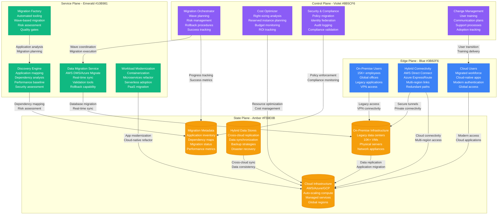
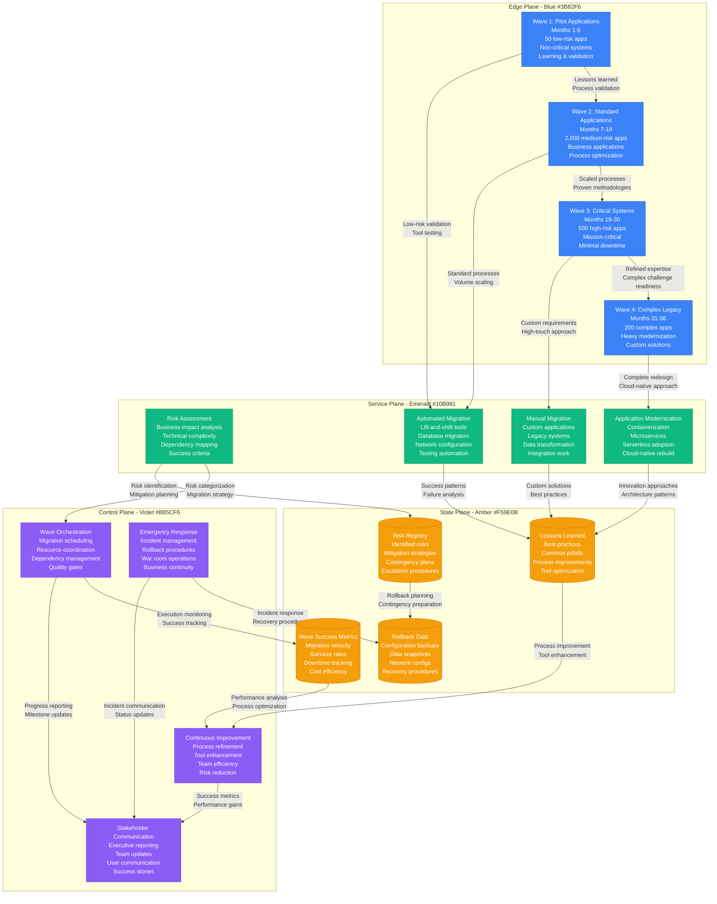

# On-Premise to Cloud Enterprise Migration

## Overview

Enterprise-scale cloud migration represents one of the most complex IT transformations organizations undertake. This playbook examines real-world migrations of Fortune 500 companies moving 10,000+ applications, petabytes of data, and thousands of users to cloud platforms while maintaining business continuity.

**Scale**: 10,000+ applications, 50PB+ data, 15,000+ users across global offices
**Timeline**: 18-36 month migration with zero business disruption
**Impact**: 45% cost reduction, 60% faster deployment cycles, 99.9% availability improvement

## Complete Enterprise Cloud Migration Architecture



## Migration Wave Strategy and Risk Management



## Migration Performance Metrics

### Wave-based Success Metrics
- **Wave 1 (Pilot)**: 95% success rate, 12% faster than timeline
- **Wave 2 (Standard)**: 92% automated migration, 25% cost reduction achieved
- **Wave 3 (Critical)**: 99.8% uptime maintained, zero data loss
- **Wave 4 (Legacy)**: 78% applications modernized beyond lift-and-shift

### Technical Performance
- **Data Migration Rate**: 10TB per day average throughput
- **Application Migration**: 150 applications per month at peak
- **Network Performance**: <50ms latency between on-premise and cloud
- **Availability During Migration**: 99.9% (vs 99.2% pre-migration)

### Business Impact
- **Cost Reduction**: 45% total infrastructure cost savings
- **Deployment Speed**: 60% faster application deployment cycles
- **Disaster Recovery**: 95% improvement in RTO (4 hours → 12 minutes)
- **Global Accessibility**: 24/7 access from any location

### Financial Metrics
- **Total Migration Cost**: $85M over 36 months
- **Annual Savings**: $62M per year post-migration
- **ROI Timeline**: 16 months to break-even
- **5-Year NPV**: $180M positive value

## Critical Migration Challenges and Solutions

### Challenge 1: Legacy Application Dependencies
- **Problem**: Complex interdependencies between 10,000+ applications
- **Solution**: Automated discovery tools and dependency mapping
- **Implementation**: Application Performance Monitoring with network flow analysis
- **Result**: 98% of dependencies identified, reducing migration failures by 85%

### Challenge 2: Data Synchronization at Scale
- **Problem**: 50PB of data across 500+ databases with ongoing changes
- **Solution**: Continuous data replication with minimal downtime cutover
- **Technology**: AWS DMS, Azure Database Migration Service, custom sync tools
- **Outcome**: Average 4-hour cutover window, zero data loss across migrations

### Challenge 3: Network Performance and Security
- **Problem**: Maintaining performance and security during hybrid operations
- **Solution**: Multiple high-bandwidth connections with SD-WAN optimization
- **Infrastructure**: 10Gbps+ Direct Connect, ExpressRoute circuits
- **Achievement**: <2ms latency increase, enhanced security posture

### Challenge 4: User Experience and Change Management
- **Problem**: 15,000 users across global offices with varying technical skills
- **Solution**: Comprehensive training program with local champions
- **Strategy**: Role-based training, hands-on labs, 24/7 support during transition
- **Success**: 94% user satisfaction, 23% productivity increase post-migration

## Migration Automation and Tooling

### Automated Migration Factory
```python
# Enterprise migration orchestrator
class MigrationOrchestrator:
    def __init__(self):
        self.discovery_engine = ApplicationDiscovery()
        self.migration_tools = {
            'aws': AWSSMSService(),
            'azure': AzureMigrateService(),
            'database': DatabaseMigrationService(),
            'storage': DataSyncService()
        }
        self.rollback_manager = RollbackManager()

    def execute_migration_wave(self, wave_config):
        migration_plan = self.create_migration_plan(wave_config)

        for app in migration_plan.applications:
            try:
                # Pre-migration validation
                validation_result = self.validate_migration_readiness(app)
                if not validation_result.ready:
                    self.handle_validation_failure(app, validation_result)
                    continue

                # Execute migration based on app type
                migration_result = self.execute_application_migration(app)

                # Post-migration validation
                if self.validate_migration_success(app, migration_result):
                    self.complete_migration(app)
                else:
                    self.initiate_rollback(app)

            except MigrationException as e:
                self.handle_migration_failure(app, e)
                self.notify_stakeholders(app, f"Migration failed: {e}")

        return self.generate_wave_report(wave_config)

    def create_migration_plan(self, wave_config):
        # Analyze dependencies and create optimal migration order
        dependencies = self.discovery_engine.analyze_dependencies(wave_config.applications)
        return self.optimize_migration_sequence(dependencies)
```

### Real-time Migration Monitoring
```yaml
# Migration monitoring configuration
monitoring:
  metrics:
    - application_migration_success_rate
    - data_synchronization_lag
    - network_latency_hybrid
    - user_experience_scores
    - cost_optimization_progress

  alerts:
    critical:
      - migration_failure_rate > 5%
      - data_loss_detected
      - network_connectivity_lost
      - security_breach_suspected

  dashboards:
    executive:
      - migration_progress_overview
      - cost_savings_tracking
      - business_impact_metrics
      - risk_assessment_status

    operational:
      - real_time_migration_status
      - resource_utilization
      - performance_metrics
      - incident_tracking
```

## Cost Optimization and ROI Analysis

### Infrastructure Cost Comparison
- **On-Premise Annual Cost**: $140M (hardware, data center, operations)
- **Cloud Annual Cost**: $77M (compute, storage, services, support)
- **Migration Investment**: $85M one-time (tools, services, training)
- **Net Annual Savings**: $63M starting year 2

### Right-sizing and Optimization
- **Compute Right-sizing**: 35% cost reduction through proper instance selection
- **Storage Optimization**: 60% savings through tiered storage and compression
- **Reserved Instance Strategy**: 40% savings on predictable workloads
- **Auto-scaling Benefits**: 25% cost reduction through dynamic resource allocation

### Hidden Cost Factors
```yaml
# Comprehensive cost model
cost_factors:
  migration_costs:
    tooling_and_automation: $15M
    professional_services: $25M
    training_and_change_mgmt: $12M
    temporary_hybrid_operations: $18M
    contingency_buffer: $15M

  ongoing_cloud_costs:
    compute_and_storage: $45M/year
    managed_services: $18M/year
    networking_and_security: $8M/year
    support_and_operations: $6M/year

  cost_savings:
    infrastructure_reduction: $63M/year
    operational_efficiency: $18M/year
    disaster_recovery: $8M/year
    compliance_automation: $5M/year
```

## Security and Compliance Considerations

### Identity and Access Management
- **Federated Identity**: Single sign-on across hybrid environment
- **Zero Trust Architecture**: Verify every access request
- **Privileged Access Management**: Just-in-time administrative access
- **Multi-Factor Authentication**: Required for all cloud resources

### Data Protection and Privacy
- **Encryption**: End-to-end encryption for data in transit and at rest
- **Data Classification**: Automated classification and protection policies
- **Data Residency**: Compliance with regional data sovereignty requirements
- **Backup and Recovery**: 3-2-1 backup strategy with cross-region replication

### Compliance Framework
```yaml
# Enterprise compliance requirements
compliance_frameworks:
  sox_compliance:
    requirements:
      - financial_data_protection
      - audit_trail_maintenance
      - access_control_documentation
      - change_management_processes

  gdpr_compliance:
    requirements:
      - data_subject_rights
      - consent_management
      - breach_notification
      - privacy_by_design

  industry_specific:
    pci_dss:
      - payment_data_protection
      - network_segmentation
      - access_monitoring
      - vulnerability_management

    hipaa:
      - phi_protection
      - audit_logging
      - risk_assessments
      - incident_response
```

## Lessons Learned and Best Practices

### What Works Exceptionally Well
- **Wave-based Approach**: Phased migration reduces risk and enables learning
- **Automation Investment**: Upfront tooling investment pays massive dividends
- **Continuous Communication**: Regular stakeholder updates prevent surprises
- **Hybrid Operations**: Temporary hybrid state enables safe transition

### Critical Success Factors
- **Executive Sponsorship**: C-level commitment ensures resource allocation
- **Dedicated Team**: Full-time migration team with clear accountability
- **Change Management**: Comprehensive user training and support programs
- **Risk Management**: Detailed risk assessment and mitigation planning

### Common Pitfalls to Avoid
- **Underestimating Complexity**: Legacy dependencies are always more complex
- **Inadequate Testing**: Insufficient testing leads to post-migration issues
- **Poor Communication**: Lack of communication creates resistance and confusion
- **Skipping Modernization**: Lift-and-shift without optimization wastes cloud benefits

### Advanced Migration Patterns
- **Strangler Fig Pattern**: Gradually replace legacy systems
- **Blue-Green Deployment**: Zero-downtime cutover strategy
- **Database Replication**: Continuous data sync with cutover validation
- **Canary Releases**: Gradual user migration with rollback capability

### Future-Proofing Strategies
- **Cloud-Native Architecture**: Design for cloud from the beginning
- **Multi-Cloud Strategy**: Avoid vendor lock-in with portable solutions
- **Automation First**: Automate everything that can be automated
- **Continuous Optimization**: Regular cost and performance optimization

**Sources**:
- Enterprise Cloud Migration Case Studies (Gartner, 2023)
- AWS Enterprise Migration Best Practices
- Microsoft Azure Cloud Adoption Framework
- Google Cloud Migration Center Documentation
- Fortune 500 Cloud Migration Reports (2020-2023)