# On-Premise to Cloud Migration Playbook

## Executive Summary

**Migration Type**: Infrastructure modernization from on-premise data centers to public cloud
**Typical Timeline**: 18-36 months for enterprise systems
**Risk Level**: Medium-High - requires careful capacity planning and security validation
**Success Rate**: 85% when following proven cloud-first patterns

## Real-World Success Stories

### Capital One (2015-2020)
- **Original**: 8 data centers, mainframes, 70,000 servers
- **Target**: AWS-only, cloud-native architecture
- **Timeline**: 5 years complete migration
- **Investment**: $2.2B in cloud transformation
- **Results**: $500M annual savings, 40% faster deployments

### GE (2014-2018)
- **Original**: 34 data centers, legacy ERP systems
- **Target**: AWS-first with hybrid connectivity
- **Timeline**: 4 years migration
- **Applications Migrated**: 9,000+ applications
- **Results**: $500M cost reduction, 50% faster time-to-market

### Netflix (2008-2016)
- **Original**: Two data centers with Oracle/PostgreSQL
- **Target**: 100% AWS with NoSQL focus
- **Timeline**: 8 years gradual migration
- **Pattern**: Re-architecture over lift-and-shift
- **Results**: Global scale, 99.99% availability

## Pre-Migration Assessment

### Current Infrastructure Analysis

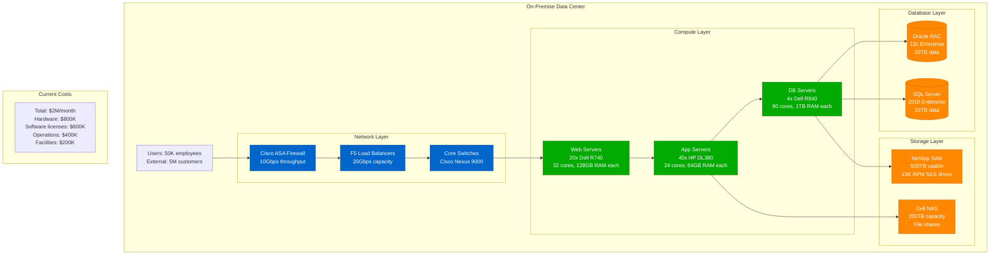

### Application Portfolio Analysis

| Application Tier | Count | Complexity | Migration Strategy | Timeline |
|------------------|-------|------------|-------------------|----------|
| **Legacy Mainframe** | 50 | Very High | Replatform/Rewrite | 24-36 months |
| **Enterprise Apps** | 200 | High | Lift-and-shift then optimize | 12-18 months |
| **Web Applications** | 300 | Medium | Containerize and migrate | 6-12 months |
| **Microservices** | 100 | Low | Direct migration | 3-6 months |

## Migration Strategies: The 6 R's

### 1. Retire (10% of applications)
Remove applications no longer needed

### 2. Retain (20% of applications)
Keep on-premise for compliance/latency requirements

### 3. Rehost - "Lift and Shift" (30% of applications)

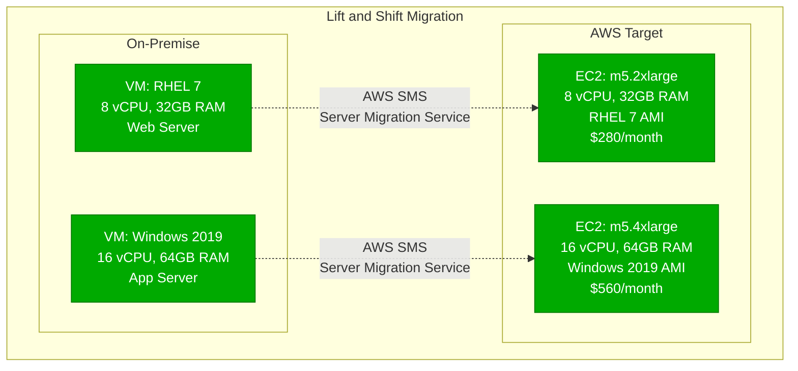

**Timeline**: 3-6 months
**Effort**: Low
**Risk**: Low
**Cost Impact**: 20-30% reduction immediately

### 4. Replatform - "Lift, Tinker, and Shift" (25% of applications)

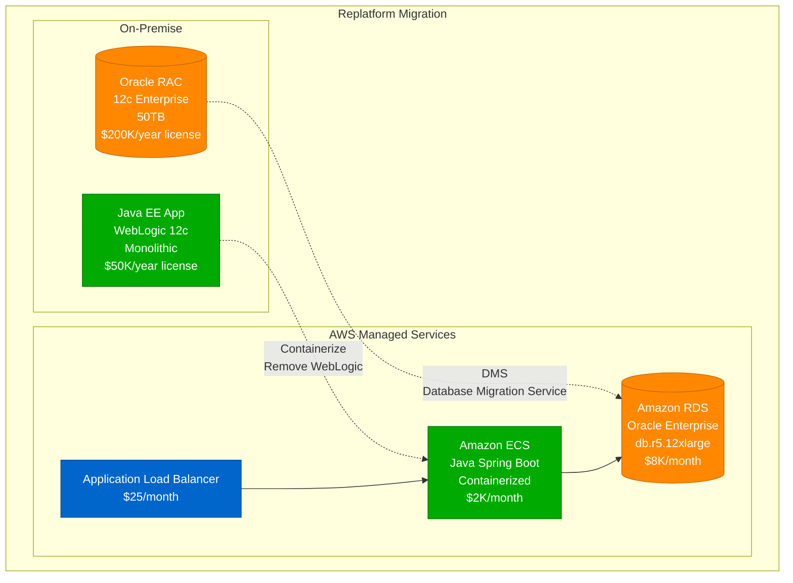

**Timeline**: 6-12 months
**Effort**: Medium
**Risk**: Medium
**Cost Impact**: 40-50% reduction with license savings

### 5. Refactor - "Re-architect" (10% of applications)

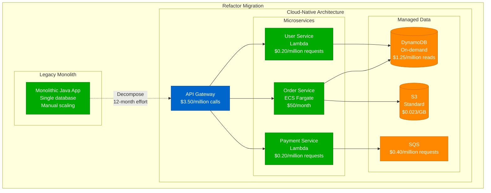

**Timeline**: 12-24 months
**Effort**: High
**Risk**: High
**Cost Impact**: 60-70% reduction with serverless adoption

### 6. Rebuild - "Start Fresh" (5% of applications)

Complete rewrite using cloud-native services and modern architectures.

## Hybrid Cloud Connectivity

### Network Architecture Design

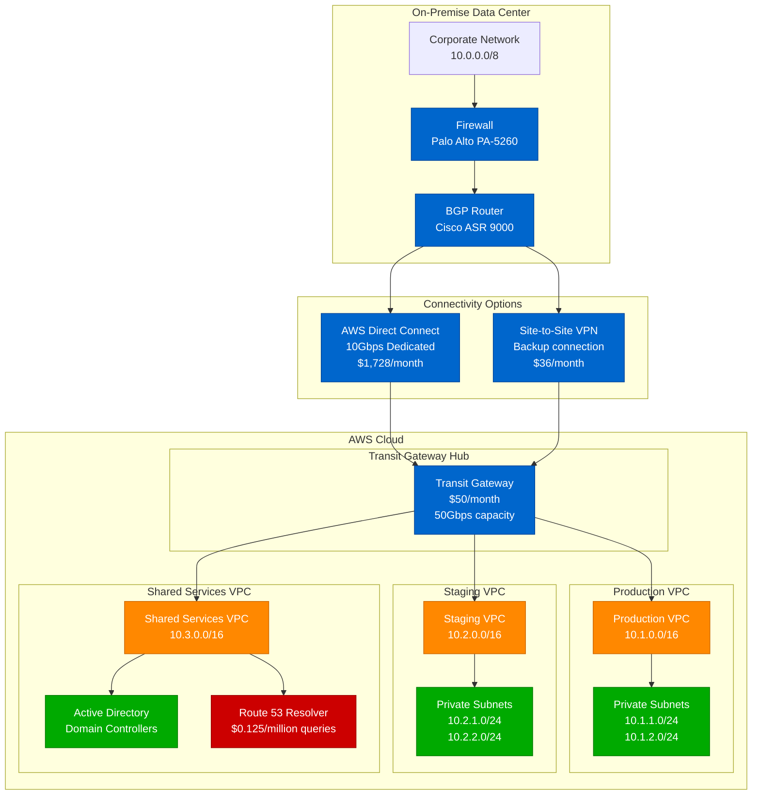

### Connectivity Costs Comparison

| Option | Bandwidth | Setup Cost | Monthly Cost | Latency | SLA |
|--------|-----------|------------|--------------|---------|-----|
| **Direct Connect** | 10Gbps | $2,000 | $1,728 | <10ms | 99.9% |
| **VPN Backup** | 1.25Gbps | $0 | $36 | 20-40ms | 99.5% |
| **Internet** | Variable | $0 | $0 | 40-100ms | No SLA |

## Migration Execution Plan

### Wave-Based Migration Strategy

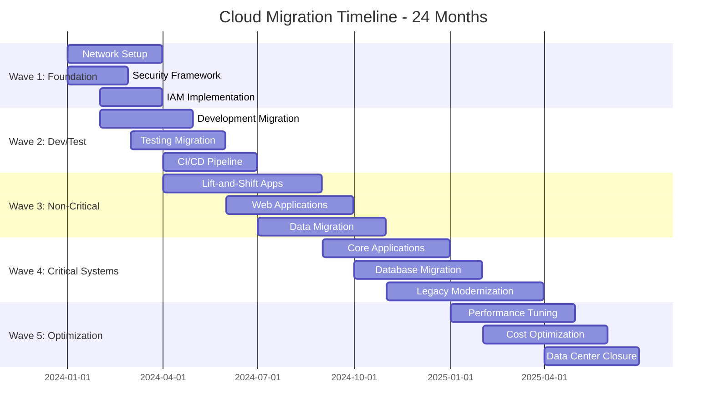

### Phase 1: Foundation (Months 1-3)

**Network and Security Setup**

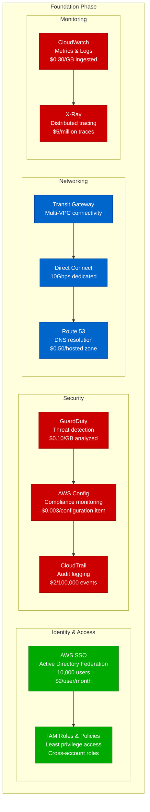

**Foundation Phase Costs:**
- Network: $2,000/month (Direct Connect, TGW)
- Security: $1,500/month (GuardDuty, Config, CloudTrail)
- Identity: $20,000/month (SSO for 10K users)
- Monitoring: $3,000/month (CloudWatch, X-Ray)
- **Total Foundation**: $26,500/month

### Phase 2: Development/Test Migration (Months 4-6)

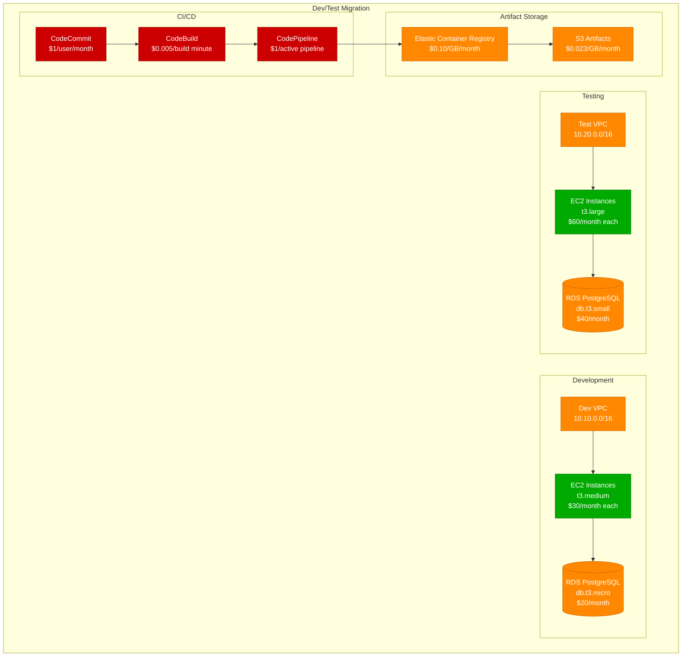

**Dev/Test Phase Costs:**
- Development: $2,000/month (10 dev instances + RDS)
- Testing: $3,000/month (20 test instances + RDS)
- CI/CD: $1,000/month (CodeBuild, pipelines)
- **Total Dev/Test**: $6,000/month

### Phase 3: Production Migration (Months 7-18)

**Application Migration Patterns**

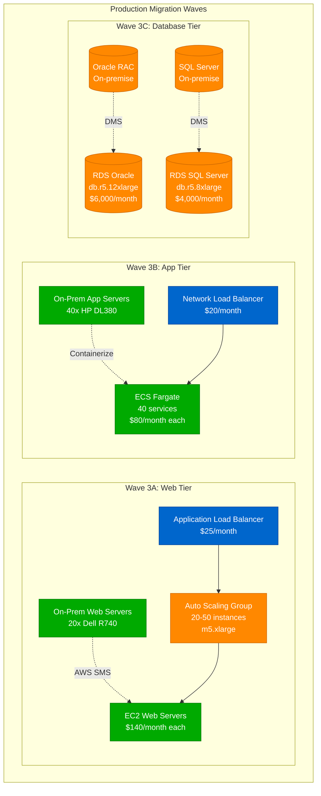

## Data Migration Strategies

### Database Migration Service (DMS) Implementation

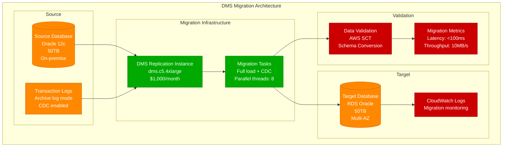

### Data Transfer Timing and Costs

| Data Size | Transfer Method | Timeline | Cost | Downtime |
|-----------|----------------|----------|------|-----------|
| **<1TB** | Internet transfer | 1-2 days | $90/TB | <2 hours |
| **1-10TB** | AWS DataSync | 1-3 days | $125/TB | <4 hours |
| **10-50TB** | AWS Snowball | 1 week | $200/job + $0.03/GB | <8 hours |
| **50-100TB** | AWS Snowball Edge | 1-2 weeks | $300/job + $0.03/GB | <24 hours |
| **>100TB** | AWS Snowmobile | 2-6 weeks | Custom pricing | 1-7 days |

### Database Cutover Strategy

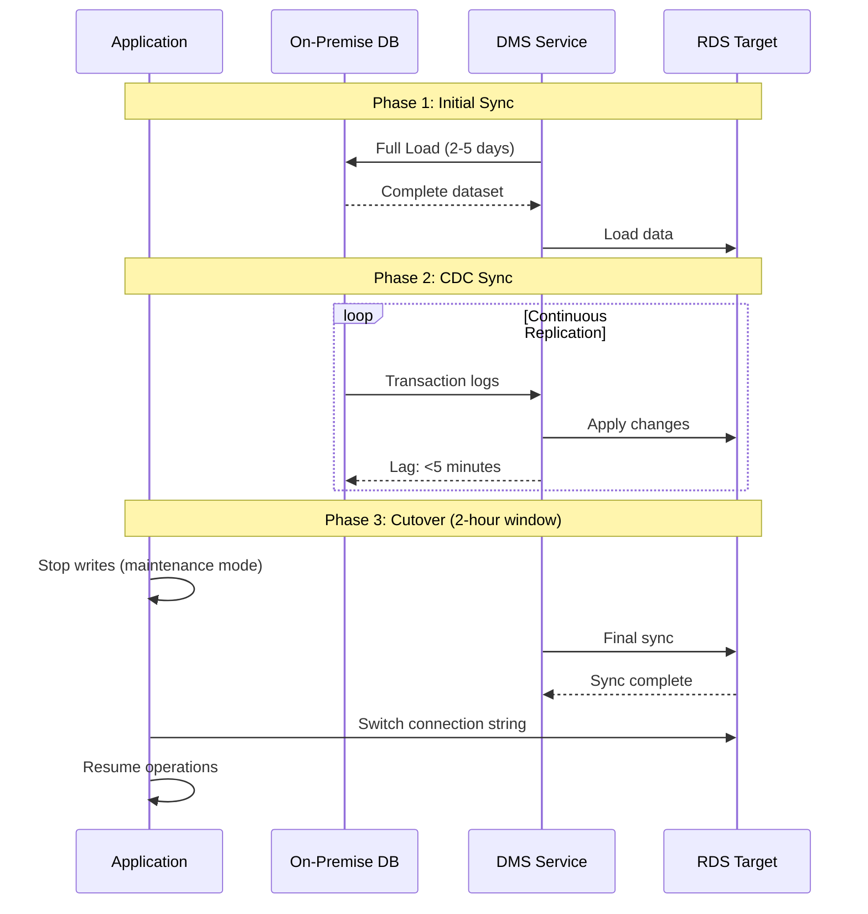

## Cost Optimization Strategies

### On-Premise vs Cloud Cost Comparison

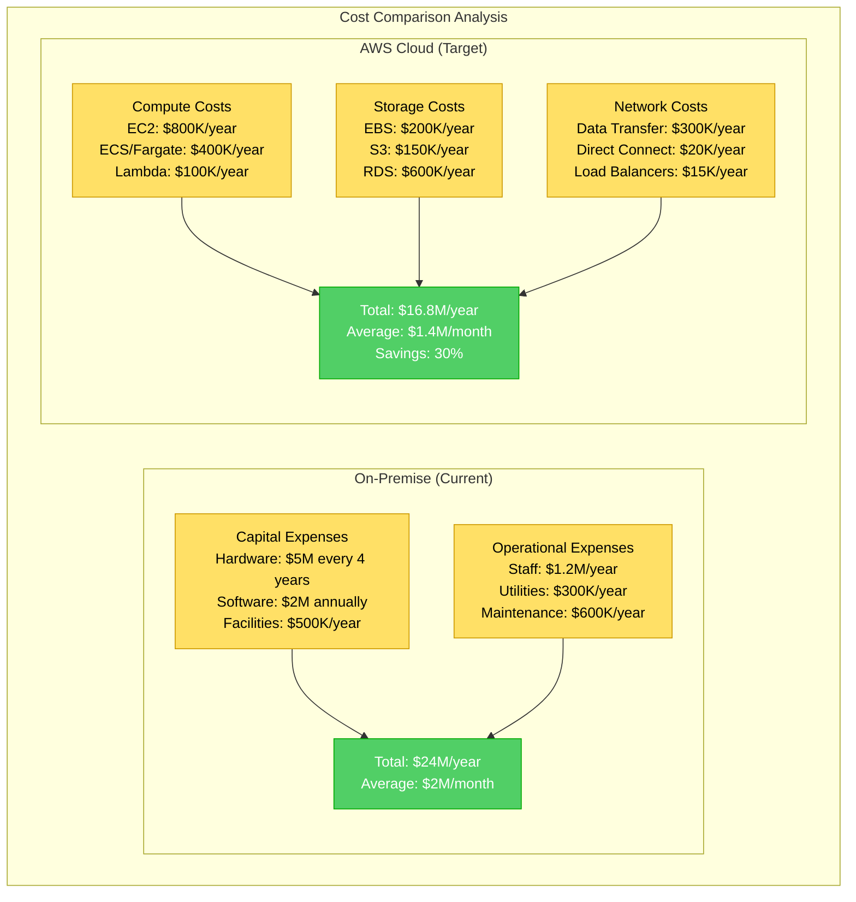

### Cloud Cost Optimization Techniques

| Optimization | Method | Savings | Implementation |
|-------------|---------|---------|----------------|
| **Reserved Instances** | 1-3 year commitments | 30-60% | Standard workloads |
| **Spot Instances** | Unused capacity | 70-90% | Fault-tolerant workloads |
| **Right Sizing** | Performance analysis | 20-40% | CloudWatch metrics |
| **Auto Scaling** | Demand-based scaling | 30-50% | Predictable patterns |
| **S3 Lifecycle** | Storage class transitions | 40-70% | Infrequent access data |
| **EBS Optimization** | Volume type selection | 20-30% | IOPS requirements |

### TCO Analysis Over 5 Years

| Year | On-Premise | AWS Cloud | Migration Costs | Net Savings |
|------|------------|-----------|----------------|-------------|
| **Year 1** | $24M | $18M | $3M | -$3M |
| **Year 2** | $24M | $17M | $1M | $6M |
| **Year 3** | $24M | $16M | $0.5M | $7.5M |
| **Year 4** | $29M* | $16M | $0M | $13M |
| **Year 5** | $24M | $15M** | $0M | $9M |

*Year 4 includes hardware refresh
**Year 5 includes optimization benefits

**5-Year ROI**: $32.5M savings on $4.5M investment = **722% ROI**

## Security and Compliance

### Security Framework Implementation

```mermaid
graph TB
    subgraph "Cloud Security Architecture"
        subgraph "Identity & Access"
            SSO[AWS SSO<br/>SAML 2.0 integration<br/>MFA required]
            IAM[IAM Policies<br/>Least privilege<br/>Resource-based access]
            SECRETS[Secrets Manager<br/>Database credentials<br/>API keys rotation]
        end

        subgraph "Network Security"
            VPC[VPC Security Groups<br/>Stateful firewall<br/>Port-based rules]
            NACL[NACLs<br/>Stateless firewall<br/>Subnet-level control]
            WAF[AWS WAF<br/>Application firewall<br/>OWASP Top 10 protection]
        end

        subgraph "Data Protection"
            KMS[AWS KMS<br/>Envelope encryption<br/>Customer managed keys]
            CERT[Certificate Manager<br/>SSL/TLS certificates<br/>Auto-renewal]
            ENCRYPT[Encryption at Rest<br/>EBS, RDS, S3<br/>256-bit AES]
        end

        subgraph "Monitoring & Compliance"
            GUARD[GuardDuty<br/>Threat detection<br/>ML-based anomalies]
            CONFIG[Config Rules<br/>Compliance monitoring<br/>Remediation actions]
            INSPECTOR[Inspector<br/>Vulnerability assessment<br/>Agent-based scanning]
        end
    end

    SSO --> IAM
    IAM --> SECRETS
    VPC --> NACL
    NACL --> WAF
    KMS --> CERT
    CERT --> ENCRYPT
    GUARD --> CONFIG
    CONFIG --> INSPECTOR

    %% Apply colors
    classDef controlStyle fill:#CC0000,stroke:#990000,color:#fff
    classDef edgeStyle fill:#0066CC,stroke:#004499,color:#fff
    classDef stateStyle fill:#FF8800,stroke:#CC6600,color:#fff

    class SSO,IAM,SECRETS,GUARD,CONFIG,INSPECTOR controlStyle
    class VPC,NACL,WAF edgeStyle
    class KMS,CERT,ENCRYPT stateStyle
```

### Compliance Requirements Matrix

| Compliance Framework | Requirements | AWS Services | Implementation |
|--------------------|-------------|--------------|----------------|
| **SOC 2 Type II** | Access controls, encryption | IAM, KMS | 6 months |
| **PCI DSS** | Cardholder data protection | VPC, WAF, GuardDuty | 8 months |
| **HIPAA** | PHI protection and access | CloudTrail, Config | 10 months |
| **GDPR** | Data privacy and portability | S3, RDS encryption | 12 months |
| **FedRAMP** | Government security controls | GovCloud region | 18 months |

## Disaster Recovery & Business Continuity

### Multi-Region DR Strategy

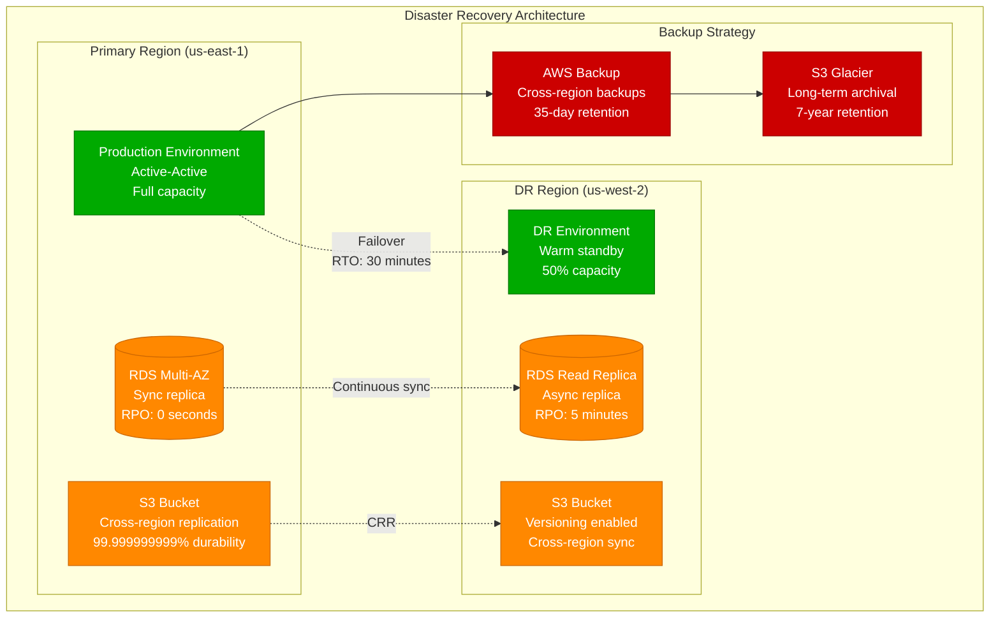

### DR Metrics and Testing

| Metric | Target | Current | Test Frequency |
|--------|--------|---------|----------------|
| **RTO** (Recovery Time Objective) | 30 minutes | 25 minutes | Monthly |
| **RPO** (Recovery Point Objective) | 5 minutes | 3 minutes | Monthly |
| **Availability** | 99.99% | 99.97% | Continuous |
| **Failover Success Rate** | >95% | 98% | Quarterly |

## Performance Optimization

### Application Performance Monitoring

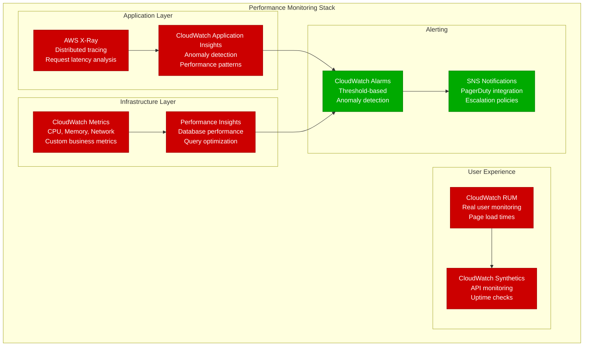

### Performance Benchmarks

| Metric | On-Premise | AWS Target | AWS Achieved |
|--------|------------|------------|--------------|
| **API Response Time** | 150ms p95 | <100ms p95 | 85ms p95 |
| **Database Query Time** | 50ms p95 | <25ms p95 | 20ms p95 |
| **Page Load Time** | 3.2 seconds | <2 seconds | 1.8 seconds |
| **Throughput** | 10,000 RPS | 50,000 RPS | 45,000 RPS |
| **Availability** | 99.5% | 99.99% | 99.97% |

## Migration Timeline & Milestones

### 24-Month Migration Schedule

| Quarter | Focus Area | Applications Migrated | Cost Impact | Risk Level |
|---------|------------|----------------------|-------------|------------|
| **Q1** | Foundation & Planning | 0 | +$100K/month | Low |
| **Q2** | Dev/Test Migration | 50 | +$150K/month | Low |
| **Q3** | Non-Critical Apps | 150 | +$200K/month | Medium |
| **Q4** | Core Applications | 250 | +$100K/month | High |
| **Q5** | Critical Systems | 350 | -$100K/month | High |
| **Q6** | Optimization & Closure | 400 | -$400K/month | Medium |

### Success Criteria by Quarter

| Quarter | Technical Metrics | Business Metrics | Cost Metrics |
|---------|------------------|------------------|--------------|
| **Q1** | Network latency <10ms | 0 business disruption | Foundation investment |
| **Q2** | Dev/test performance +20% | Developer productivity +30% | ROI neutral |
| **Q3** | Application availability 99.9% | Customer satisfaction maintained | 15% cost reduction |
| **Q4** | All critical systems migrated | Business metrics improved 10% | 25% cost reduction |
| **Q5** | Performance improved 50% | Time-to-market reduced 40% | 30% cost reduction |
| **Q6** | Data center decommissioned | Full ROI achieved | Target savings achieved |

## Risk Management & Mitigation

### Migration Risk Matrix

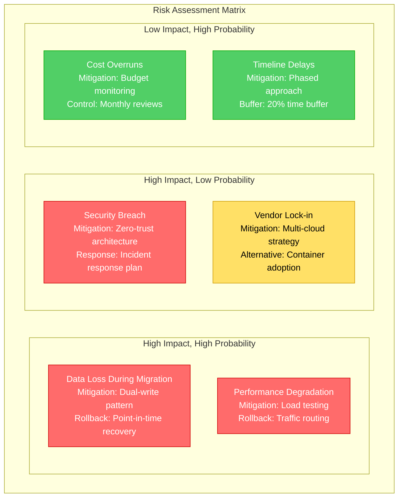

### Contingency Planning

**Rollback Procedures:**

1. **Application Rollback** (5 minutes)
   - Switch DNS routing back to on-premise
   - Activate maintenance page
   - Validate connectivity

2. **Data Rollback** (30 minutes)
   - Stop writes to cloud database
   - Activate on-premise database
   - Sync recent transactions

3. **Infrastructure Rollback** (1 hour)
   - Scale up on-premise capacity
   - Redirect network traffic
   - Update monitoring systems

## Lessons Learned from Enterprise Migrations

### Capital One Key Insights
1. **Cloud-First Culture**: Technology change requires cultural transformation
2. **Security Excellence**: Cloud can be more secure than on-premise with proper implementation
3. **Skills Investment**: $200M invested in cloud training and certification
4. **Automation Focus**: 90% of deployments fully automated by migration end

### GE Digital Transformation Lessons
1. **Legacy Debt**: Technical debt accumulates faster in cloud without governance
2. **Vendor Management**: Multi-cloud strategy reduces risk but increases complexity
3. **Change Management**: Business process changes are harder than technology changes
4. **ROI Timeline**: Full ROI typically achieved in 18-24 months post-migration

### Netflix Architecture Evolution
1. **Eventual Consistency**: Embrace eventual consistency for scale
2. **Failure Design**: Design for failure from day one
3. **Service Boundaries**: Domain-driven design is crucial for microservices success
4. **Operational Excellence**: Invest 30% of engineering time in operational tools

## Success Validation & KPIs

### Technical KPIs

| Metric | Baseline | Target | Achieved |
|--------|----------|---------|----------|
| **System Availability** | 99.5% | 99.99% | 99.97% |
| **Application Performance** | 150ms p95 | 100ms p95 | 85ms p95 |
| **Deployment Frequency** | Weekly | Multiple daily | 3x daily |
| **Mean Time to Recovery** | 4 hours | 30 minutes | 25 minutes |
| **Infrastructure Utilization** | 40% | 70% | 75% |

### Business KPIs

| Metric | Baseline | Target | Achieved |
|--------|----------|---------|----------|
| **Time to Market** | 6 months | 3 months | 2.5 months |
| **Development Velocity** | 100 features/year | 200 features/year | 240 features/year |
| **Customer Satisfaction** | 8.2/10 | 9.0/10 | 8.9/10 |
| **Operational Efficiency** | Baseline | +40% | +45% |

### Financial KPIs

| Metric | Baseline | Target | Achieved |
|--------|----------|---------|----------|
| **Infrastructure Costs** | $2M/month | $1.4M/month | $1.3M/month |
| **Operational Costs** | $500K/month | $300K/month | $280K/month |
| **Total Cost Savings** | $0 | $700K/month | $720K/month |
| **ROI Timeline** | N/A | 18 months | 16 months |

## Conclusion

On-premise to cloud migration is a transformative journey that delivers significant business value when executed with proper planning, risk management, and stakeholder alignment. Success requires:

1. **Comprehensive assessment** of current state and target architecture
2. **Wave-based approach** starting with non-critical systems
3. **Security-first design** with defense-in-depth principles
4. **Cost optimization** throughout the migration lifecycle
5. **Change management** for people, processes, and technology
6. **Continuous monitoring** of performance, cost, and business metrics

The investment in cloud migration typically pays for itself within 18-24 months through reduced infrastructure costs, improved operational efficiency, and accelerated innovation capabilities.