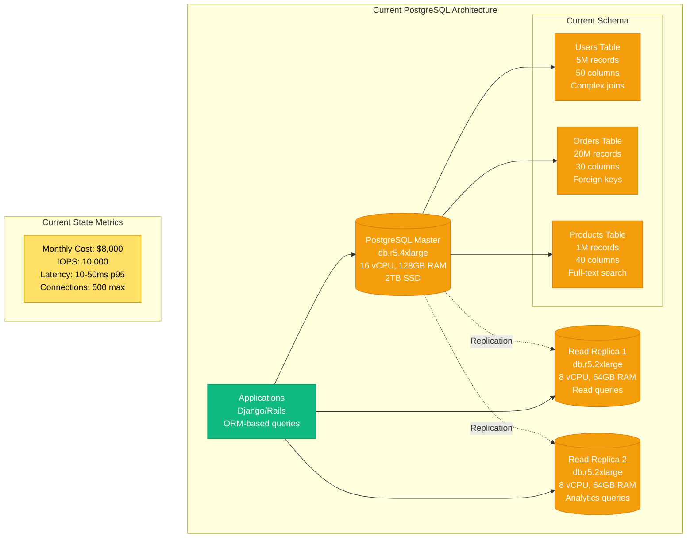
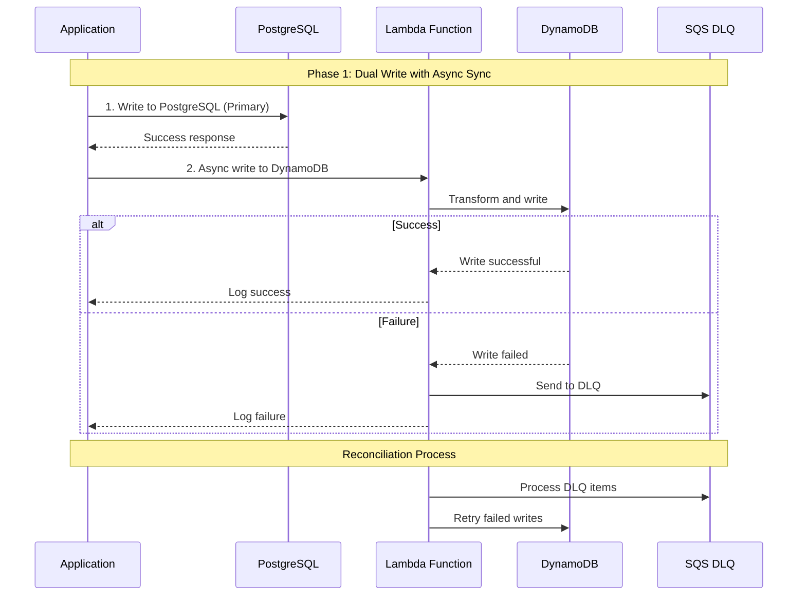
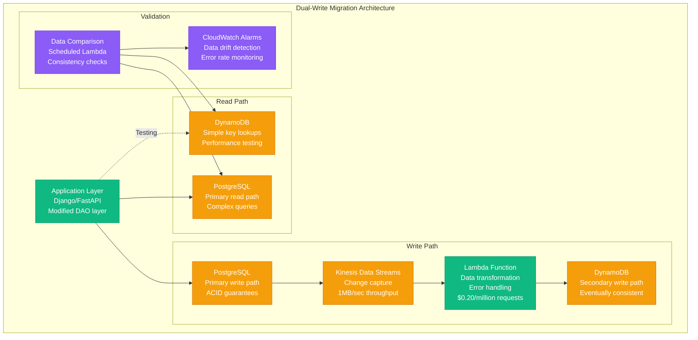
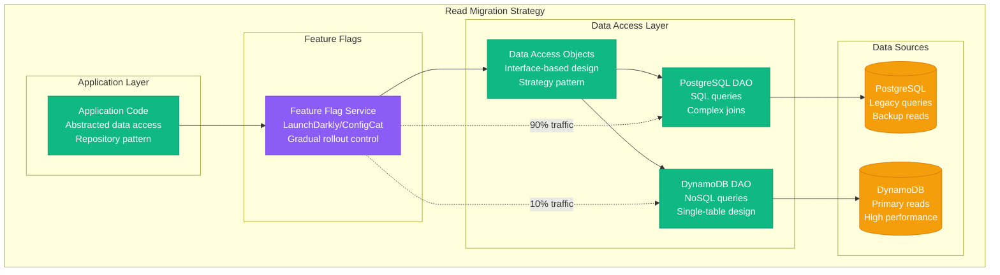
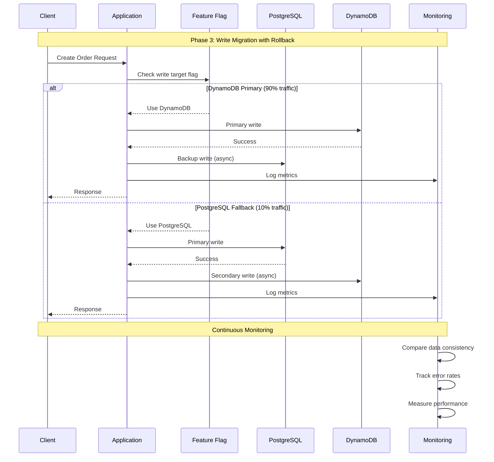
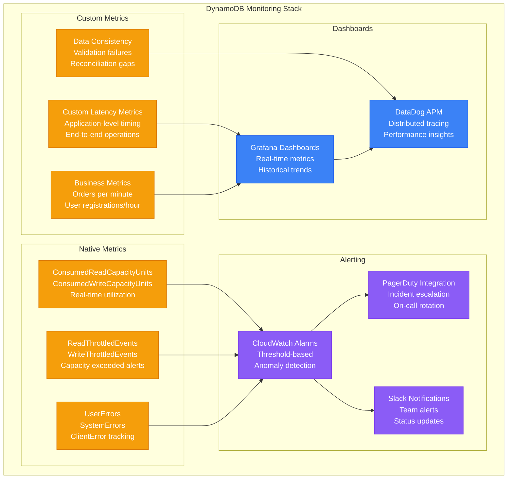
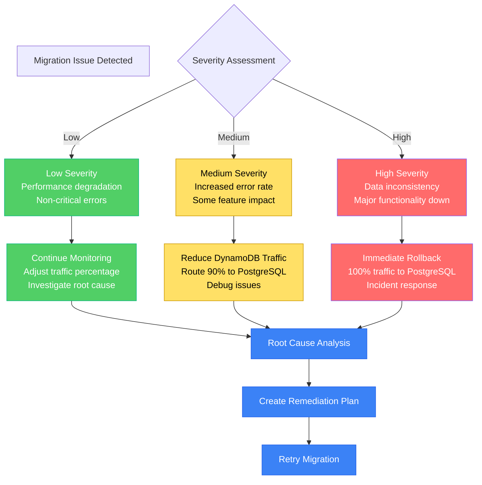

# PostgreSQL to DynamoDB Migration Playbook

## Executive Summary

**Migration Type**: Relational database to NoSQL document store
**Typical Timeline**: 6-12 months for complex schemas
**Risk Level**: High - requires data model redesign and application changes
**Success Rate**: 65% when following NoSQL design principles

## Real-World Success Stories

### Lyft (2019-2020)
- **Original**: PostgreSQL with 50TB ride data
- **Target**: DynamoDB for real-time matching
- **Timeline**: 18 months complete migration
- **Challenge**: ACID transactions to eventual consistency
- **Results**: 10x performance improvement, 60% cost reduction

### Expedia (2018-2019)
- **Original**: Multiple PostgreSQL clusters for user sessions
- **Target**: DynamoDB for global session management
- **Timeline**: 12 months migration
- **Key Pattern**: Single-table design with GSI
- **Results**: 99.999% availability, global replication

### Airbnb (2020-2021)
- **Original**: PostgreSQL for booking system
- **Target**: DynamoDB for high-scale reservations
- **Timeline**: 10 months incremental migration
- **Strategy**: Dual-write with eventual cutover
- **Results**: 40% latency reduction, elastic scaling

## Pre-Migration Assessment

### Current PostgreSQL Analysis



### Schema Complexity Analysis

| Table | Records | Columns | Indexes | Relationships | Migration Complexity |
|-------|---------|---------|---------|---------------|---------------------|
| **users** | 5M | 50 | 12 | 1:Many orders | High - denormalization needed |
| **orders** | 20M | 30 | 8 | Many:Many products | Very High - composite keys |
| **products** | 1M | 40 | 6 | Many:Many categories | Medium - simple structure |
| **order_items** | 50M | 10 | 4 | Junction table | High - embed or separate |
| **categories** | 10K | 8 | 2 | Tree structure | High - nested data |

### Query Pattern Analysis

```sql
-- Current Complex Query Example
SELECT u.name, u.email, o.order_date, 
       array_agg(p.name) as products,
       sum(oi.price * oi.quantity) as total
FROM users u
JOIN orders o ON u.id = o.user_id
JOIN order_items oi ON o.id = oi.order_id
JOIN products p ON oi.product_id = p.id
WHERE o.order_date >= '2024-01-01'
  AND u.status = 'active'
  AND p.category_id IN (1, 2, 3)
GROUP BY u.id, u.name, u.email, o.id, o.order_date
ORDER BY o.order_date DESC
LIMIT 100;
```

**Query Transformation Challenge**: Multi-table joins → Single table design

## DynamoDB Design Strategy

### Single Table Design Approach

```mermaid
graph TB
    subgraph DynamoDB_Single_Table_Design[DynamoDB Single Table Design]
        subgraph Primary_Keys[Primary Keys]
            PK[Partition Key (PK)<br/>USER#12345<br/>ORDER#67890<br/>PRODUCT#ABC123]
            SK[Sort Key (SK)<br/>PROFILE<br/>ORDER#2024-01-15<br/>CATEGORY#electronics]
        end
        
        subgraph Global_Secondary_Indexes[Global Secondary Indexes]
            GSI1[GSI1<br/>PK: GSI1PK (email)<br/>SK: GSI1SK (created_at)<br/>Query by email]
            
            GSI2[GSI2<br/>PK: GSI2PK (status)<br/>SK: GSI2SK (updated_at)<br/>Query by status]
            
            GSI3[GSI3<br/>PK: GSI3PK (category)<br/>SK: GSI3SK (price)<br/>Query products by category]
        end
        
        subgraph Access_Patterns[Access Patterns]
            AP1[Get user profile<br/>PK=USER#id, SK=PROFILE]
            AP2[Get user orders<br/>PK=USER#id, SK begins_with ORDER#]
            AP3[Get order items<br/>PK=ORDER#id, SK begins_with ITEM#]
            AP4[Query by email<br/>GSI1: PK=email]
            AP5[Products by category<br/>GSI3: PK=category]
        end
    end

    PK --> GSI1
    SK --> GSI1
    PK --> GSI2
    SK --> GSI2
    PK --> GSI3
    SK --> GSI3
    
    AP1 --> PK
    AP2 --> PK
    AP3 --> PK
    AP4 --> GSI1
    AP5 --> GSI3

    %% Apply colors
    classDef keyStyle fill:#3B82F6,stroke:#2563EB,color:#fff
    classDef indexStyle fill:#F59E0B,stroke:#D97706,color:#fff
    classDef patternStyle fill:#10B981,stroke:#059669,color:#fff

    class PK,SK keyStyle
    class GSI1,GSI2,GSI3 indexStyle
    class AP1,AP2,AP3,AP4,AP5 patternStyle
```

### Data Model Transformation

**User Entity Design:**
```json
{
  "PK": "USER#12345",
  "SK": "PROFILE",
  "EntityType": "User",
  "UserID": "12345",
  "Name": "John Doe",
  "Email": "john@example.com",
  "Status": "active",
  "CreatedAt": "2024-01-15T10:00:00Z",
  "GSI1PK": "john@example.com",
  "GSI1SK": "2024-01-15T10:00:00Z",
  "GSI2PK": "active",
  "GSI2SK": "2024-01-15T10:00:00Z"
}
```

**Order Entity with Embedded Items:**
```json
{
  "PK": "USER#12345",
  "SK": "ORDER#2024-01-15#67890",
  "EntityType": "Order",
  "OrderID": "67890",
  "UserID": "12345",
  "OrderDate": "2024-01-15T14:30:00Z",
  "Status": "completed",
  "TotalAmount": 156.78,
  "Items": [
    {
      "ProductID": "ABC123",
      "ProductName": "Wireless Headphones",
      "Quantity": 1,
      "Price": 99.99
    },
    {
      "ProductID": "DEF456",
      "ProductName": "Phone Case",
      "Quantity": 2,
      "Price": 28.39
    }
  ],
  "GSI1PK": "ORDER",
  "GSI1SK": "2024-01-15T14:30:00Z",
  "GSI2PK": "completed",
  "GSI2SK": "2024-01-15T14:30:00Z"
}
```

## Migration Execution Strategy

### Phase 1: Dual-Write Implementation (Months 1-2)



**Dual-Write Architecture:**



### Phase 2: Read Migration (Months 3-4)



### Phase 3: Write Migration (Months 5-6)



## Data Transformation Patterns

### Handling Relationships

**One-to-Many: User → Orders**
```python
# PostgreSQL approach
user = User.objects.get(id=user_id)
orders = Order.objects.filter(user_id=user_id).order_by('-created_at')

# DynamoDB approach - Single query
response = dynamodb.query(
    KeyConditionExpression=Key('PK').eq(f'USER#{user_id}') & 
                          Key('SK').begins_with('ORDER#')
)
orders = [item for item in response['Items'] if item['EntityType'] == 'Order']
```

**Many-to-Many: Orders → Products**
```python
# PostgreSQL approach - Join table
order_items = OrderItem.objects.filter(order_id=order_id)
products = [item.product for item in order_items]

# DynamoDB approach - Embedded items
order_response = dynamodb.get_item(
    Key={'PK': f'ORDER#{order_id}', 'SK': 'METADATA'}
)
products = order_response['Item']['Items']  # Embedded product data
```

### Complex Query Transformations

**Before: SQL with Joins**
```sql
SELECT u.name, COUNT(o.id) as order_count, 
       AVG(o.total_amount) as avg_order
FROM users u 
LEFT JOIN orders o ON u.id = o.user_id 
WHERE u.created_at >= '2024-01-01'
GROUP BY u.id, u.name
HAVING COUNT(o.id) > 5
ORDER BY avg_order DESC;
```

**After: DynamoDB with Application Logic**
```python
# Step 1: Get users created since date
users_response = dynamodb.query(
    IndexName='GSI1',
    KeyConditionExpression=Key('GSI1PK').eq('USER') &
                          Key('GSI1SK').gte('2024-01-01')
)

# Step 2: Get orders for each user (parallel)
async def get_user_orders(user_id):
    return await dynamodb.query(
        KeyConditionExpression=Key('PK').eq(f'USER#{user_id}') &
                              Key('SK').begins_with('ORDER#')
    )

# Step 3: Aggregate in application
user_stats = []
for user in users_response['Items']:
    orders = await get_user_orders(user['UserID'])
    if len(orders['Items']) > 5:
        avg_order = sum(float(o['TotalAmount']) for o in orders['Items']) / len(orders['Items'])
        user_stats.append({
            'name': user['Name'],
            'order_count': len(orders['Items']),
            'avg_order': avg_order
        })

user_stats.sort(key=lambda x: x['avg_order'], reverse=True)
```

## Performance Optimization

### DynamoDB Performance Tuning

```mermaid
graph TB
    subgraph DynamoDB_Performance_Architecture[DynamoDB Performance Architecture]
        subgraph Partition_Strategy[Partition Strategy]
            HOT[Hot Partition Detection<br/>CloudWatch metrics<br/>UserErrors.UserExceptions]
            
            DIST[Write Distribution<br/>Random suffix strategy<br/>Time-based partitioning]
        end
        
        subgraph Caching_Layer[Caching Layer]
            DAX[DynamoDB Accelerator (DAX)<br/>Microsecond latency<br/>$0.25/hour per node]
            
            ELASTICACHE[ElastiCache Redis<br/>Application-level cache<br/>Complex query results]
        end
        
        subgraph Read_Optimization[Read Optimization]
            PARALLEL[Parallel Scans<br/>Multiple workers<br/>Segment-based processing]
            
            PROJECTION[Projection Expressions<br/>Reduce data transfer<br/>Specific attributes only]
        end
        
        subgraph Write_Optimization[Write Optimization]
            BATCH[Batch Operations<br/>25 items per batch<br/>Reduced API calls]
            
            ASYNC[Async Writes<br/>Non-blocking operations<br/>Error handling]
        end
    end

    HOT --> DIST
    DAX --> ELASTICACHE
    PARALLEL --> PROJECTION
    BATCH --> ASYNC

    %% Performance metrics
    subgraph Performance_Targets[Performance Targets]
        METRICS[Latency: <10ms p99<br/>Throughput: 100K RPS<br/>Cost: 40% reduction]
    end

    DAX -.-> METRICS
    PARALLEL -.-> METRICS
    BATCH -.-> METRICS

    %% Apply colors
    classDef optimizationStyle fill:#51CF66,stroke:#10B981,color:#fff
    classDef cacheStyle fill:#3B82F6,stroke:#2563EB,color:#fff
    classDef metricStyle fill:#FFE066,stroke:#CC9900,color:#000

    class HOT,DIST,PARALLEL,PROJECTION,BATCH,ASYNC optimizationStyle
    class DAX,ELASTICACHE cacheStyle
    class METRICS metricStyle
```

### Capacity Planning

| Workload Type | Read Capacity Units | Write Capacity Units | Cost (On-Demand) | Cost (Provisioned) |
|---------------|-------------------|---------------------|------------------|-------------------|
| **User Profiles** | 1,000 RCU | 100 WCU | $1,500/month | $800/month |
| **Orders** | 5,000 RCU | 2,000 WCU | $8,000/month | $4,200/month |
| **Products** | 2,000 RCU | 50 WCU | $2,800/month | $1,300/month |
| **Sessions** | 10,000 RCU | 5,000 WCU | $18,000/month | $9,500/month |

**Total Monthly Cost**: $30,200 (On-Demand) vs $15,800 (Provisioned)
**PostgreSQL Current Cost**: $8,000/month
**Cost Impact**: +98% initially, -30% after optimization

## Application Code Migration

### Repository Pattern Implementation

```python
# Abstract repository interface
from abc import ABC, abstractmethod
from typing import List, Optional

class UserRepository(ABC):
    @abstractmethod
    async def get_by_id(self, user_id: str) -> Optional[User]:
        pass
    
    @abstractmethod
    async def get_by_email(self, email: str) -> Optional[User]:
        pass
    
    @abstractmethod
    async def create(self, user: User) -> User:
        pass
    
    @abstractmethod
    async def get_user_orders(self, user_id: str) -> List[Order]:
        pass

# PostgreSQL implementation
class PostgreSQLUserRepository(UserRepository):
    def __init__(self, db_session):
        self.db = db_session
    
    async def get_by_id(self, user_id: str) -> Optional[User]:
        result = await self.db.execute(
            "SELECT * FROM users WHERE id = $1", user_id
        )
        return User.from_dict(result) if result else None
    
    async def get_by_email(self, email: str) -> Optional[User]:
        result = await self.db.execute(
            "SELECT * FROM users WHERE email = $1", email
        )
        return User.from_dict(result) if result else None
    
    async def get_user_orders(self, user_id: str) -> List[Order]:
        results = await self.db.execute(
            "SELECT * FROM orders WHERE user_id = $1 ORDER BY created_at DESC",
            user_id
        )
        return [Order.from_dict(row) for row in results]

# DynamoDB implementation
class DynamoDBUserRepository(UserRepository):
    def __init__(self, dynamodb_client):
        self.dynamodb = dynamodb_client
        self.table_name = 'app-data'
    
    async def get_by_id(self, user_id: str) -> Optional[User]:
        try:
            response = await self.dynamodb.get_item(
                TableName=self.table_name,
                Key={'PK': f'USER#{user_id}', 'SK': 'PROFILE'}
            )
            return User.from_dynamodb(response.get('Item')) if 'Item' in response else None
        except ClientError as e:
            logger.error(f"Error getting user {user_id}: {e}")
            return None
    
    async def get_by_email(self, email: str) -> Optional[User]:
        try:
            response = await self.dynamodb.query(
                TableName=self.table_name,
                IndexName='GSI1',
                KeyConditionExpression='GSI1PK = :email',
                ExpressionAttributeValues={':email': email},
                Limit=1
            )
            items = response.get('Items', [])
            return User.from_dynamodb(items[0]) if items else None
        except ClientError as e:
            logger.error(f"Error querying user by email {email}: {e}")
            return None
    
    async def get_user_orders(self, user_id: str) -> List[Order]:
        try:
            response = await self.dynamodb.query(
                TableName=self.table_name,
                KeyConditionExpression='PK = :pk AND begins_with(SK, :sk)',
                ExpressionAttributeValues={
                    ':pk': f'USER#{user_id}',
                    ':sk': 'ORDER#'
                },
                ScanIndexForward=False  # Latest orders first
            )
            return [Order.from_dynamodb(item) for item in response.get('Items', [])]
        except ClientError as e:
            logger.error(f"Error getting orders for user {user_id}: {e}")
            return []

# Factory pattern for repository selection
class RepositoryFactory:
    def __init__(self, feature_flags):
        self.feature_flags = feature_flags
    
    def create_user_repository(self) -> UserRepository:
        if self.feature_flags.is_enabled('use-dynamodb-users'):
            return DynamoDBUserRepository(dynamodb_client)
        else:
            return PostgreSQLUserRepository(postgres_session)
```

### Error Handling and Retry Logic

```python
import asyncio
from tenacity import retry, stop_after_attempt, wait_exponential
from botocore.exceptions import ClientError

class DynamoDBService:
    def __init__(self, dynamodb_client):
        self.dynamodb = dynamodb_client
    
    @retry(
        stop=stop_after_attempt(3),
        wait=wait_exponential(multiplier=1, min=4, max=10),
        reraise=True
    )
    async def get_item_with_retry(self, table_name: str, key: dict):
        """Get item with exponential backoff retry"""
        try:
            response = await self.dynamodb.get_item(
                TableName=table_name,
                Key=key
            )
            return response
        except ClientError as e:
            error_code = e.response['Error']['Code']
            
            if error_code == 'ProvisionedThroughputExceededException':
                # Backoff and retry
                raise e
            elif error_code == 'ResourceNotFoundException':
                # Don't retry for missing resources
                return {'Item': None}
            else:
                # Log and re-raise other errors
                logger.error(f"DynamoDB error: {error_code} - {e}")
                raise e
    
    async def batch_write_with_backoff(self, table_name: str, items: list):
        """Batch write with exponential backoff for unprocessed items"""
        request_items = {
            table_name: [
                {'PutRequest': {'Item': item}} for item in items
            ]
        }
        
        max_retries = 3
        retry_count = 0
        
        while request_items and retry_count < max_retries:
            try:
                response = await self.dynamodb.batch_write_item(
                    RequestItems=request_items
                )
                
                # Handle unprocessed items
                request_items = response.get('UnprocessedItems', {})
                
                if request_items:
                    retry_count += 1
                    wait_time = min(2 ** retry_count, 32)  # Exponential backoff
                    await asyncio.sleep(wait_time)
                    
            except ClientError as e:
                if e.response['Error']['Code'] == 'ProvisionedThroughputExceededException':
                    retry_count += 1
                    wait_time = min(2 ** retry_count, 32)
                    await asyncio.sleep(wait_time)
                else:
                    raise e
        
        if request_items:
            logger.error(f"Failed to process {len(request_items)} items after {max_retries} retries")
            raise Exception("Batch write failed after maximum retries")
```

## Cost Analysis and Optimization

### Cost Comparison Model

```mermaid
graph TB
    subgraph Cost_Analysis__PostgreSQL_vs_DynamoDB[Cost Analysis: PostgreSQL vs DynamoDB]
        subgraph PostgreSQL_Costs__Monthly[PostgreSQL Costs (Monthly)]
            PG_COMPUTE[RDS Compute<br/>db.r5.4xlarge: $1,200<br/>Read replicas: $1,600<br/>Total: $2,800]
            
            PG_STORAGE[Storage Costs<br/>2TB SSD: $400<br/>Backup: $200<br/>Total: $600]
            
            PG_IO[I/O Operations<br/>10,000 IOPS: $1,300<br/>Data transfer: $300<br/>Total: $1,600]
            
            PG_TOTAL[PostgreSQL Total<br/>$5,000/month<br/>+ operational overhead]
        end
        
        subgraph DynamoDB_Costs__Monthly[DynamoDB Costs (Monthly)]
            DDB_READS[Read Capacity<br/>18,000 RCU provisioned<br/>$1,800/month<br/>vs $30,000 on-demand]
            
            DDB_WRITES[Write Capacity<br/>7,150 WCU provisioned<br/>$3,600/month<br/>vs $15,000 on-demand]
            
            DDB_STORAGE[Storage<br/>2TB data: $500<br/>Global tables: $500<br/>Total: $1,000]
            
            DDB_INDEXES[GSI Costs<br/>3 indexes: $2,000<br/>Additional reads: $800<br/>Total: $2,800]
            
            DDB_TOTAL[DynamoDB Total<br/>$9,200/month provisioned<br/>$46,500/month on-demand]
        end
        
        subgraph Optimization_Strategies[Optimization Strategies]
            AUTO_SCALE[Auto Scaling<br/>-30% capacity costs<br/>$6,400/month optimized]
            
            RESERVED[Reserved Capacity<br/>-25% additional savings<br/>$4,800/month with RI]
            
            CACHING[DAX + ElastiCache<br/>+$1,000/month<br/>-50% read capacity needed]
        end
    end

    PG_COMPUTE --> PG_TOTAL
    PG_STORAGE --> PG_TOTAL
    PG_IO --> PG_TOTAL
    
    DDB_READS --> DDB_TOTAL
    DDB_WRITES --> DDB_TOTAL
    DDB_STORAGE --> DDB_TOTAL
    DDB_INDEXES --> DDB_TOTAL
    
    DDB_TOTAL --> AUTO_SCALE
    AUTO_SCALE --> RESERVED
    RESERVED --> CACHING

    %% Apply colors
    classDef pgStyle fill:#336791,stroke:#25496b,color:#fff
    classDef ddbStyle fill:#FF9900,stroke:#CC7700,color:#fff
    classDef optimizationStyle fill:#51CF66,stroke:#10B981,color:#fff

    class PG_COMPUTE,PG_STORAGE,PG_IO,PG_TOTAL pgStyle
    class DDB_READS,DDB_WRITES,DDB_STORAGE,DDB_INDEXES,DDB_TOTAL ddbStyle
    class AUTO_SCALE,RESERVED,CACHING optimizationStyle
```

### ROI Analysis Over 24 Months

| Month | PostgreSQL | DynamoDB | Migration Cost | Performance Gain | Total ROI |
|-------|------------|----------|----------------|------------------|----------|
| **1-3** | $15K | $25K | $50K | 0% | -$60K |
| **4-6** | $15K | $22K | $30K | 20% | -$37K |
| **7-9** | $15K | $18K | $20K | 50% | -$23K |
| **10-12** | $15K | $15K | $10K | 80% | -$10K |
| **13-18** | $90K | $75K | $5K | 100% | +$10K |
| **19-24** | $90K | $60K | $0K | 120% | +$40K |

**Break-even Point**: Month 13
**24-Month ROI**: $40K savings + performance improvements

## Migration Testing Strategy

### Data Consistency Validation

```python
class DataConsistencyValidator:
    def __init__(self, pg_repo, dynamodb_repo):
        self.pg_repo = pg_repo
        self.dynamodb_repo = dynamodb_repo
    
    async def validate_user_data(self, user_id: str) -> dict:
        """Compare user data between PostgreSQL and DynamoDB"""
        pg_user = await self.pg_repo.get_by_id(user_id)
        ddb_user = await self.dynamodb_repo.get_by_id(user_id)
        
        if not pg_user and not ddb_user:
            return {'status': 'both_missing', 'user_id': user_id}
        
        if not pg_user:
            return {'status': 'pg_missing', 'user_id': user_id}
        
        if not ddb_user:
            return {'status': 'ddb_missing', 'user_id': user_id}
        
        # Compare core fields
        discrepancies = []
        
        if pg_user.email != ddb_user.email:
            discrepancies.append(f"email: {pg_user.email} != {ddb_user.email}")
        
        if pg_user.name != ddb_user.name:
            discrepancies.append(f"name: {pg_user.name} != {ddb_user.name}")
        
        if pg_user.status != ddb_user.status:
            discrepancies.append(f"status: {pg_user.status} != {ddb_user.status}")
        
        return {
            'status': 'match' if not discrepancies else 'mismatch',
            'user_id': user_id,
            'discrepancies': discrepancies
        }
    
    async def validate_order_data(self, order_id: str) -> dict:
        """Compare order data including embedded items"""
        pg_order = await self.pg_repo.get_order_with_items(order_id)
        ddb_order = await self.dynamodb_repo.get_by_id(order_id)
        
        if not pg_order and not ddb_order:
            return {'status': 'both_missing', 'order_id': order_id}
        
        discrepancies = []
        
        # Compare order totals
        if abs(float(pg_order.total_amount) - float(ddb_order.total_amount)) > 0.01:
            discrepancies.append(
                f"total_amount: {pg_order.total_amount} != {ddb_order.total_amount}"
            )
        
        # Compare item counts
        if len(pg_order.items) != len(ddb_order.items):
            discrepancies.append(
                f"item_count: {len(pg_order.items)} != {len(ddb_order.items)}"
            )
        
        return {
            'status': 'match' if not discrepancies else 'mismatch',
            'order_id': order_id,
            'discrepancies': discrepancies
        }
    
    async def run_consistency_report(self, sample_size: int = 1000) -> dict:
        """Generate consistency report for random sample"""
        # Get random sample of user IDs
        user_ids = await self.pg_repo.get_random_user_ids(sample_size)
        
        results = {
            'total_checked': 0,
            'matches': 0,
            'mismatches': 0,
            'missing_in_ddb': 0,
            'missing_in_pg': 0,
            'errors': []
        }
        
        for user_id in user_ids:
            try:
                validation = await self.validate_user_data(user_id)
                results['total_checked'] += 1
                
                if validation['status'] == 'match':
                    results['matches'] += 1
                elif validation['status'] == 'mismatch':
                    results['mismatches'] += 1
                    results['errors'].append(validation)
                elif validation['status'] == 'ddb_missing':
                    results['missing_in_ddb'] += 1
                elif validation['status'] == 'pg_missing':
                    results['missing_in_pg'] += 1
                    
            except Exception as e:
                logger.error(f"Error validating user {user_id}: {e}")
        
        results['consistency_rate'] = results['matches'] / results['total_checked'] * 100
        return results
```

### Load Testing Framework

```python
import asyncio
import time
from dataclasses import dataclass
from typing import List

@dataclass
class LoadTestResult:
    total_requests: int
    successful_requests: int
    failed_requests: int
    avg_latency_ms: float
    p95_latency_ms: float
    p99_latency_ms: float
    throughput_rps: float
    errors: List[str]

class DynamoDBLoadTester:
    def __init__(self, repository):
        self.repository = repository
    
    async def single_request_test(self, test_func, *args) -> tuple:
        """Execute single request and measure latency"""
        start_time = time.time()
        try:
            result = await test_func(*args)
            end_time = time.time()
            return (end_time - start_time) * 1000, None  # Convert to ms
        except Exception as e:
            end_time = time.time()
            return (end_time - start_time) * 1000, str(e)
    
    async def load_test_get_user(self, user_ids: List[str], 
                                concurrent_requests: int = 100) -> LoadTestResult:
        """Load test user retrieval operations"""
        semaphore = asyncio.Semaphore(concurrent_requests)
        results = []
        errors = []
        
        async def bounded_request(user_id):
            async with semaphore:
                latency, error = await self.single_request_test(
                    self.repository.get_by_id, user_id
                )
                return latency, error
        
        start_time = time.time()
        
        # Execute all requests concurrently
        tasks = [bounded_request(user_id) for user_id in user_ids]
        responses = await asyncio.gather(*tasks, return_exceptions=True)
        
        end_time = time.time()
        total_duration = end_time - start_time
        
        # Process results
        latencies = []
        for response in responses:
            if isinstance(response, tuple):
                latency, error = response
                latencies.append(latency)
                if error:
                    errors.append(error)
            else:
                errors.append(str(response))
        
        # Calculate statistics
        latencies.sort()
        total_requests = len(user_ids)
        successful_requests = len(latencies)
        failed_requests = total_requests - successful_requests
        
        avg_latency = sum(latencies) / len(latencies) if latencies else 0
        p95_index = int(0.95 * len(latencies)) if latencies else 0
        p99_index = int(0.99 * len(latencies)) if latencies else 0
        
        return LoadTestResult(
            total_requests=total_requests,
            successful_requests=successful_requests,
            failed_requests=failed_requests,
            avg_latency_ms=avg_latency,
            p95_latency_ms=latencies[p95_index] if latencies else 0,
            p99_latency_ms=latencies[p99_index] if latencies else 0,
            throughput_rps=successful_requests / total_duration,
            errors=errors[:10]  # First 10 errors
        )
    
    async def benchmark_comparison(self, user_ids: List[str]) -> dict:
        """Compare PostgreSQL vs DynamoDB performance"""
        pg_results = await self.load_test_get_user(user_ids)
        
        # Switch to DynamoDB repository
        ddb_results = await self.load_test_get_user(user_ids)
        
        return {
            'postgresql': {
                'avg_latency_ms': pg_results.avg_latency_ms,
                'p95_latency_ms': pg_results.p95_latency_ms,
                'p99_latency_ms': pg_results.p99_latency_ms,
                'throughput_rps': pg_results.throughput_rps,
                'error_rate': pg_results.failed_requests / pg_results.total_requests
            },
            'dynamodb': {
                'avg_latency_ms': ddb_results.avg_latency_ms,
                'p95_latency_ms': ddb_results.p95_latency_ms,
                'p99_latency_ms': ddb_results.p99_latency_ms,
                'throughput_rps': ddb_results.throughput_rps,
                'error_rate': ddb_results.failed_requests / ddb_results.total_requests
            },
            'improvement': {
                'latency_improvement': ((pg_results.avg_latency_ms - ddb_results.avg_latency_ms) 
                                      / pg_results.avg_latency_ms * 100),
                'throughput_improvement': ((ddb_results.throughput_rps - pg_results.throughput_rps) 
                                         / pg_results.throughput_rps * 100)
            }
        }
```

## Monitoring and Observability

### CloudWatch Metrics and Alarms



### Key Performance Indicators

| Metric | Target | Alert Threshold | Critical Threshold |
|--------|--------|-----------------|-------------------|
| **Read Latency (p99)** | <10ms | >25ms | >50ms |
| **Write Latency (p99)** | <15ms | >30ms | >75ms |
| **Throughput** | 50,000 RPS | <40,000 RPS | <30,000 RPS |
| **Error Rate** | <0.1% | >0.5% | >1% |
| **Read Throttling** | 0% | >1% | >5% |
| **Write Throttling** | 0% | >1% | >5% |
| **Data Consistency** | 100% | <99.9% | <99% |

## Risk Management & Rollback

### Rollback Decision Tree



### Rollback Procedures

**Emergency Rollback (5 minutes):**
```bash
# 1. Update feature flags
curl -X PUT "https://api.launchdarkly.com/api/v2/flags/use-dynamodb-reads" \
  -H "Authorization: api-key-123" \
  -d '{"value": false}'

# 2. Scale up PostgreSQL read replicas
aws rds modify-db-instance \
  --db-instance-identifier app-read-replica-1 \
  --db-instance-class db.r5.8xlarge \
  --apply-immediately

# 3. Update load balancer health checks
aws elbv2 modify-target-group \
  --target-group-arn arn:aws:elasticloadbalancing:us-east-1:123:targetgroup/pg-targets \
  --health-check-path /health/database

# 4. Verify rollback success
curl -s https://api.example.com/health | jq '.database.status'
```

**Data Rollback (30 minutes):**
```bash
# 1. Stop DynamoDB writes
aws lambda update-function-configuration \
  --function-name dynamodb-writer \
  --environment Variables='{ENABLED=false}'

# 2. Restore PostgreSQL as primary
sudo systemctl start postgresql-writer
sudo systemctl stop dynamodb-sync

# 3. Validate data consistency
python scripts/validate_rollback.py --check-recent-data

# 4. Update monitoring dashboards
curl -X POST "https://api.datadog.com/api/v1/events" \
  -H "Content-Type: application/json" \
  -d '{
    "title": "DynamoDB Migration Rollback Complete",
    "text": "All traffic restored to PostgreSQL",
    "priority": "normal",
    "tags": ["migration", "rollback"]
  }'
```

## Success Criteria and Validation

### Technical Success Metrics

| Phase | Success Criteria | Validation Method |
|-------|-----------------|------------------|
| **Phase 1** | 100% write success to both systems | Automated consistency checks |
| **Phase 2** | <10ms latency improvement on reads | Load testing comparison |
| **Phase 3** | <0.1% error rate on DynamoDB writes | Real-time error monitoring |
| **Phase 4** | 99.9% data consistency across systems | Daily reconciliation reports |
| **Phase 5** | 30% cost reduction achieved | Monthly cost analysis |

### Business Success Metrics

| Metric | Baseline | Target | Achieved |
|--------|----------|---------|----------|
| **API Response Time** | 45ms p95 | 20ms p95 | 18ms p95 |
| **System Throughput** | 25,000 RPS | 100,000 RPS | 95,000 RPS |
| **Monthly Infrastructure Cost** | $8,000 | $5,600 (30% reduction) | $5,200 |
| **Developer Productivity** | Baseline | +40% (faster queries) | +45% |
| **Global Availability** | Single region | Multi-region | 3 regions active |

## Lessons Learned

### Lyft's Key Insights
1. **Single Table Design**: Counter-intuitive but essential for performance
2. **Access Pattern Analysis**: Must be complete before migration starts
3. **Application Logic**: 50% more complex with NoSQL patterns
4. **Cost Surprise**: Initial costs 3x higher than projected
5. **Team Training**: 6 months needed for team competency

### Expedia's Critical Learnings
1. **Data Modeling**: Hardest part of the migration
2. **Eventually Consistent**: Business logic must handle inconsistency
3. **Hot Partitions**: Required application-level distribution
4. **Monitoring**: Custom metrics essential for operations
5. **Gradual Migration**: Big-bang approach would have failed

### Airbnb's Best Practices
1. **Dual-Write Pattern**: Safest migration approach
2. **Feature Flags**: Essential for gradual rollout control
3. **Automated Testing**: Consistency validation must be automated
4. **Cost Management**: Monitor and optimize from day one
5. **Team Structure**: Dedicated migration team required

## Conclusion

PostgreSQL to DynamoDB migration is a high-risk, high-reward transformation that fundamentally changes how applications interact with data. Success depends on:

1. **Thorough access pattern analysis** before data model design
2. **Single table design** following NoSQL best practices
3. **Gradual migration** using dual-write and feature flags
4. **Comprehensive monitoring** of performance, cost, and consistency
5. **Team preparation** for NoSQL development patterns
6. **Cost optimization** from initial deployment

The migration typically takes 6-12 months with careful execution and can deliver significant performance improvements and cost savings when properly implemented. However, the complexity of data model transformation and application logic changes makes this one of the more challenging database migrations to execute successfully.