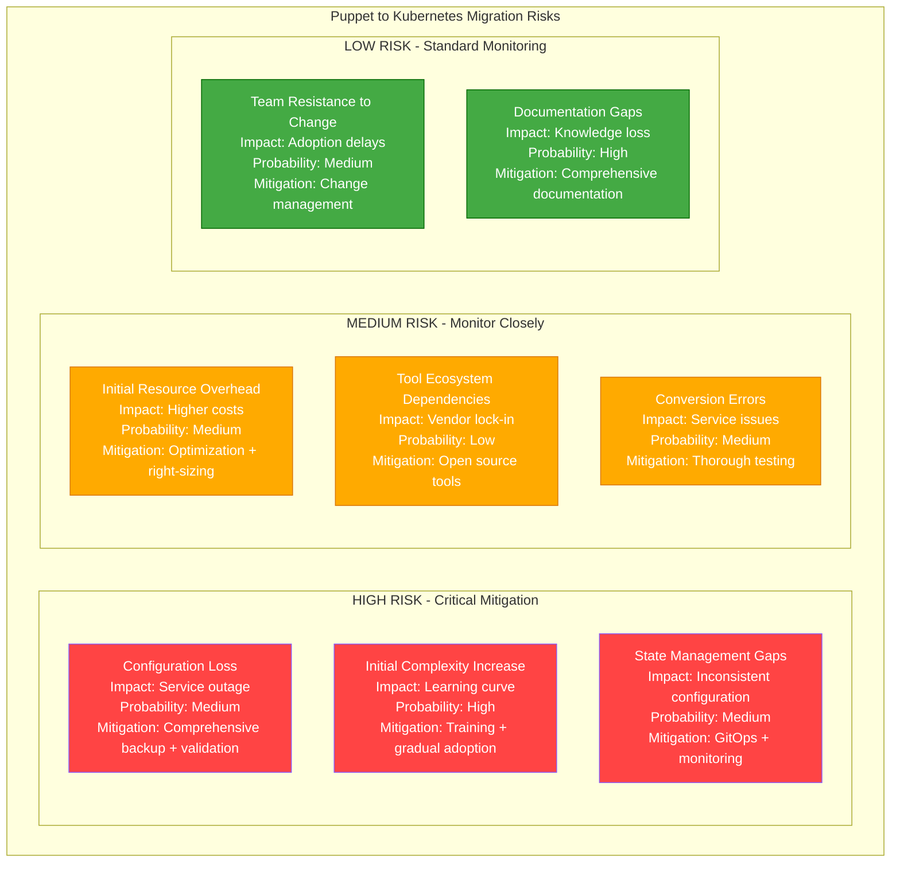

# Puppet to Kubernetes Infrastructure Migration Playbook

## Executive Summary

**Migration Type**: Infrastructure Automation Modernization
**Timeline**: 16-20 weeks
**Risk Level**: High
**Downtime**: Minimal (rolling deployment approach)
**Cost Impact**: 40-60% reduction in infrastructure management overhead
**Team Size**: 5-6 engineers + 1 Platform lead

Migrate from Puppet-based configuration management to Kubernetes-native infrastructure automation, enabling cloud-native operations and GitOps workflows.

## Current State vs Target State

### Current State: Puppet Infrastructure Management

```mermaid
graph TB
    subgraph PuppetInfrastructure[Current Puppet Infrastructure Management]
        PUPPET_MASTER[Puppet Master<br/>Configuration server<br/>Certificate authority<br/>ENC (External Node Classifier)<br/>Hiera data backend]

        PUPPET_AGENTS[Puppet Agents<br/>100+ EC2 instances<br/>30-minute runs<br/>Pull-based configuration<br/>Ruby DSL manifests]

        PUPPET_MODULES[Puppet Modules<br/>Custom modules<br/>Forge modules<br/>Complex dependencies<br/>Version conflicts]

        PUPPET_DB[PuppetDB<br/>Facts storage<br/>Catalog storage<br/>Report storage<br/>PostgreSQL backend]

        HIERA[Hiera Data<br/>YAML configuration<br/>Environment-specific data<br/>Encrypted secrets<br/>Complex hierarchy]

        FOREMAN[Foreman/Puppet Console<br/>Web interface<br/>Node classification<br/>Reporting dashboard<br/>Manual workflows]
    end

    PUPPET_MASTER --> PUPPET_AGENTS
    PUPPET_MASTER --> PUPPET_MODULES
    PUPPET_MASTER --> PUPPET_DB
    PUPPET_MASTER --> HIERA
    FOREMAN --> PUPPET_MASTER

    classDef puppetStyle fill:#FF9800,stroke:#F57C00,color:#fff
    class PUPPET_MASTER,PUPPET_AGENTS,PUPPET_MODULES,PUPPET_DB,HIERA,FOREMAN puppetStyle
```

**Current State Issues:**
- **Complex Dependencies**: Module dependency hell
- **Slow Convergence**: 30-minute configuration runs
- **Limited Scalability**: Master-agent bottlenecks
- **Configuration Drift**: Inconsistent state management
- **Manual Processes**: Limited automation workflows

### Target State: Kubernetes-Native Infrastructure

```mermaid
graph TB
    subgraph KubernetesInfrastructure[Target Kubernetes-Native Infrastructure]
        K8S_CONTROL[Kubernetes Control Plane<br/>API-driven configuration<br/>Declarative manifests<br/>RBAC security<br/>Event-driven automation]

        GITOPS[GitOps Controller<br/>ArgoCD/Flux<br/>Git-based deployments<br/>Automated synchronization<br/>Continuous delivery]

        HELM_CHARTS[Helm Charts<br/>Package management<br/>Templated configurations<br/>Dependency management<br/>Version control]

        CONFIG_MAPS[ConfigMaps & Secrets<br/>Configuration data<br/>Encrypted secrets<br/>Environment-specific configs<br/>Dynamic updates]

        OPERATORS[Custom Operators<br/>Application-specific logic<br/>Automated operations<br/>Self-healing systems<br/>CRDs (Custom Resources)]

        MONITORING[Monitoring Stack<br/>Prometheus/Grafana<br/>Real-time metrics<br/>Alerting rules<br/>Automated responses]
    end

    GITOPS --> K8S_CONTROL
    K8S_CONTROL --> HELM_CHARTS
    K8S_CONTROL --> CONFIG_MAPS
    K8S_CONTROL --> OPERATORS
    K8S_CONTROL --> MONITORING

    classDef k8sStyle fill:#4CAF50,stroke:#388E3C,color:#fff
    class K8S_CONTROL,GITOPS,HELM_CHARTS,CONFIG_MAPS,OPERATORS,MONITORING k8sStyle
```

## Migration Strategy

### Strangler Fig Pattern for Infrastructure

```mermaid
graph TB
    subgraph MigrationStrategy[Puppet to Kubernetes Migration Strategy]

        subgraph Phase1[Phase 1: Foundation]
            PUPPET_EXISTING[Existing Puppet Infrastructure<br/>100% workloads<br/>Current configuration<br/>Stable operation]

            K8S_BOOTSTRAP[Kubernetes Bootstrap<br/>Cluster setup<br/>Basic operators<br/>GitOps configuration]
        end

        subgraph Phase2[Phase 2: Parallel Operation]
            PUPPET_REDUCED[Puppet (Reduced Scope)<br/>Legacy applications<br/>Complex configurations<br/>Gradual reduction]

            K8S_GROWING[Kubernetes (Growing)<br/>New workloads<br/>Migrated services<br/>Cloud-native apps]

            MIGRATION_BRIDGE[Migration Bridge<br/>Configuration sync<br/>State validation<br/>Rollback capability]
        end

        subgraph Phase3[Phase 3: Full Migration]
            PUPPET_DECOMMISSIONED[Puppet Decommissioned<br/>Infrastructure archived<br/>Historical data preserved]

            K8S_COMPLETE[Kubernetes Complete<br/>100% workloads<br/>Full automation<br/>GitOps workflows]
        end

        Phase1 --> Phase2
        Phase2 --> Phase3
    end

    classDef phase1 fill:#FF9800,stroke:#F57C00,color:#fff
    classDef phase2 fill:#2196F3,stroke:#1976D2,color:#fff
    classDef phase3 fill:#4CAF50,stroke:#388E3C,color:#fff

    class PUPPET_EXISTING,K8S_BOOTSTRAP phase1
    class PUPPET_REDUCED,K8S_GROWING,MIGRATION_BRIDGE phase2
    class PUPPET_DECOMMISSIONED,K8S_COMPLETE phase3
```

## Technical Implementation

### Puppet to Kubernetes Configuration Translation

**Before: Puppet Manifest**
```ruby
# puppet manifest - nginx.pp
class nginx {
  package { 'nginx':
    ensure => installed,
  }

  file { '/etc/nginx/nginx.conf':
    ensure  => file,
    content => template('nginx/nginx.conf.erb'),
    require => Package['nginx'],
    notify  => Service['nginx'],
  }

  file { '/etc/nginx/sites-available/default':
    ensure  => file,
    content => template('nginx/default.erb'),
    require => Package['nginx'],
    notify  => Service['nginx'],
  }

  service { 'nginx':
    ensure     => running,
    enable     => true,
    hasrestart => true,
    require    => [Package['nginx'], File['/etc/nginx/nginx.conf']],
  }

  firewall { '100 allow http':
    proto  => 'tcp',
    dport  => '80',
    action => 'accept',
  }

  firewall { '101 allow https':
    proto  => 'tcp',
    dport  => '443',
    action => 'accept',
  }
}

# Hiera data - common.yaml
nginx::server_name: 'app.company.com'
nginx::document_root: '/var/www/html'
nginx::ssl_certificate: '/etc/ssl/certs/app.company.com.crt'
nginx::ssl_certificate_key: '/etc/ssl/private/app.company.com.key'
nginx::worker_processes: 4
nginx::worker_connections: 1024
```

**After: Kubernetes Manifests**
```yaml
# ConfigMap for nginx configuration
apiVersion: v1
kind: ConfigMap
metadata:
  name: nginx-config
  namespace: web-app
data:
  nginx.conf: |
    events {
        worker_connections 1024;
    }
    http {
        server {
            listen 80;
            listen 443 ssl;
            server_name app.company.com;

            ssl_certificate /etc/ssl/certs/tls.crt;
            ssl_certificate_key /etc/ssl/private/tls.key;

            location / {
                root /usr/share/nginx/html;
                index index.html index.htm;
            }
        }
    }

---
# Secret for SSL certificates
apiVersion: v1
kind: Secret
metadata:
  name: nginx-ssl-certs
  namespace: web-app
type: kubernetes.io/tls
data:
  tls.crt: <base64-encoded-certificate>
  tls.key: <base64-encoded-private-key>

---
# Deployment for nginx
apiVersion: apps/v1
kind: Deployment
metadata:
  name: nginx-deployment
  namespace: web-app
  labels:
    app: nginx
spec:
  replicas: 3
  selector:
    matchLabels:
      app: nginx
  template:
    metadata:
      labels:
        app: nginx
    spec:
      containers:
      - name: nginx
        image: nginx:1.25-alpine
        ports:
        - containerPort: 80
        - containerPort: 443
        resources:
          requests:
            memory: "64Mi"
            cpu: "100m"
          limits:
            memory: "128Mi"
            cpu: "200m"
        volumeMounts:
        - name: nginx-config
          mountPath: /etc/nginx/nginx.conf
          subPath: nginx.conf
        - name: ssl-certs
          mountPath: /etc/ssl/certs
          readOnly: true
        livenessProbe:
          httpGet:
            path: /
            port: 80
          initialDelaySeconds: 30
          periodSeconds: 10
        readinessProbe:
          httpGet:
            path: /
            port: 80
          initialDelaySeconds: 5
          periodSeconds: 5
      volumes:
      - name: nginx-config
        configMap:
          name: nginx-config
      - name: ssl-certs
        secret:
          secretName: nginx-ssl-certs

---
# Service for nginx
apiVersion: v1
kind: Service
metadata:
  name: nginx-service
  namespace: web-app
spec:
  selector:
    app: nginx
  ports:
  - name: http
    port: 80
    targetPort: 80
  - name: https
    port: 443
    targetPort: 443
  type: LoadBalancer

---
# NetworkPolicy for firewall rules
apiVersion: networking.k8s.io/v1
kind: NetworkPolicy
metadata:
  name: nginx-network-policy
  namespace: web-app
spec:
  podSelector:
    matchLabels:
      app: nginx
  policyTypes:
  - Ingress
  ingress:
  - from: []
    ports:
    - protocol: TCP
      port: 80
    - protocol: TCP
      port: 443
```

### Helm Chart for Complex Applications

```yaml
# Chart.yaml
apiVersion: v2
name: web-application
description: A Helm chart for web application (migrated from Puppet)
version: 1.0.0
appVersion: "2.1.0"

dependencies:
  - name: postgresql
    version: 12.1.2
    repository: https://charts.bitnami.com/bitnami
  - name: redis
    version: 17.4.2
    repository: https://charts.bitnami.com/bitnami
```

```yaml
# values.yaml - Templated configuration (replaces Hiera)
global:
  environment: production
  domain: company.com

application:
  name: web-app
  image:
    repository: company/web-app
    tag: "2.1.0"
    pullPolicy: IfNotPresent

  replicaCount: 3

  resources:
    requests:
      memory: "256Mi"
      cpu: "200m"
    limits:
      memory: "512Mi"
      cpu: "500m"

  config:
    database:
      host: "{{ include \"web-application.postgresql.fullname\" . }}"
      port: 5432
      name: webapp

    redis:
      host: "{{ include \"web-application.redis.fullname\" . }}-master"
      port: 6379

    features:
      enableNewUI: true
      enableCache: true
      debugMode: false

  secrets:
    databasePassword: "supersecret"
    redisPassword: "redissecret"
    jwtSecret: "jwtsecret"

ingress:
  enabled: true
  className: nginx
  annotations:
    cert-manager.io/cluster-issuer: letsencrypt-prod
    nginx.ingress.kubernetes.io/ssl-redirect: "true"
  hosts:
    - host: app.company.com
      paths:
        - path: /
          pathType: Prefix
  tls:
    - secretName: app-tls-secret
      hosts:
        - app.company.com

monitoring:
  enabled: true
  serviceMonitor:
    enabled: true
  prometheusRule:
    enabled: true

autoscaling:
  enabled: true
  minReplicas: 3
  maxReplicas: 10
  targetCPUUtilizationPercentage: 70
  targetMemoryUtilizationPercentage: 80

postgresql:
  auth:
    postgresPassword: "postgrespassword"
    database: webapp
  primary:
    persistence:
      size: 20Gi

redis:
  auth:
    password: "redissecret"
  master:
    persistence:
      size: 8Gi
```

### GitOps Configuration with ArgoCD

```yaml
# argocd-application.yaml - GitOps deployment
apiVersion: argoproj.io/v1alpha1
kind: Application
metadata:
  name: web-application
  namespace: argocd
  annotations:
    # Puppet migration tracking
    migration.company.com/source: "puppet"
    migration.company.com/puppet-class: "webapp::production"
    migration.company.com/migration-date: "2024-01-15"
spec:
  project: default

  source:
    repoURL: https://github.com/company/k8s-manifests
    targetRevision: HEAD
    path: applications/web-app
    helm:
      valueFiles:
        - values-production.yaml

  destination:
    server: https://kubernetes.default.svc
    namespace: web-app

  syncPolicy:
    automated:
      prune: true
      selfHeal: true
      allowEmpty: false
    syncOptions:
      - CreateNamespace=true
      - PrunePropagationPolicy=foreground
      - PruneLast=true
    retry:
      limit: 5
      backoff:
        duration: 5s
        factor: 2
        maxDuration: 3m

  # Health checks and sync waves
  ignoreDifferences:
    - group: apps
      kind: Deployment
      jsonPointers:
        - /spec/replicas

  # Notification configuration
  notifications:
    - name: slack-notifications
      triggers:
        - on-sync-failed
        - on-sync-succeeded
      destinations:
        - slack:deployment-notifications

---
# AppProject for organizing applications
apiVersion: argoproj.io/v1alpha1
kind: AppProject
metadata:
  name: puppet-migration
  namespace: argocd
spec:
  description: Applications migrated from Puppet

  sourceRepos:
    - 'https://github.com/company/k8s-manifests'
    - 'https://charts.bitnami.com/bitnami'

  destinations:
    - namespace: '*'
      server: 'https://kubernetes.default.svc'

  clusterResourceWhitelist:
    - group: ''
      kind: Namespace
    - group: networking.k8s.io
      kind: NetworkPolicy

  roles:
    - name: admin
      description: Admin privileges for puppet migration team
      policies:
        - p, proj:puppet-migration:admin, applications, *, puppet-migration/*, allow
        - p, proj:puppet-migration:admin, repositories, *, *, allow
      groups:
        - company:infrastructure-team
```

### Migration Automation Script

```python
#!/usr/bin/env python3
# puppet-to-k8s-migrator.py

import yaml
import json
import re
import os
from typing import Dict, List, Any
import subprocess
from pathlib import Path

class PuppetToKubernetesMigrator:
    def __init__(self, puppet_manifests_dir: str, output_dir: str):
        self.puppet_dir = Path(puppet_manifests_dir)
        self.output_dir = Path(output_dir)
        self.output_dir.mkdir(parents=True, exist_ok=True)

        # Mapping of Puppet resources to Kubernetes resources
        self.resource_mappings = {
            'package': self.convert_package_to_deployment,
            'file': self.convert_file_to_configmap,
            'service': self.convert_service_to_service,
            'user': self.convert_user_to_security_context,
            'cron': self.convert_cron_to_cronjob,
            'mount': self.convert_mount_to_volume
        }

    def migrate_puppet_manifests(self) -> Dict[str, Any]:
        """Main migration method"""
        migration_report = {
            'total_files': 0,
            'converted_files': 0,
            'failed_files': 0,
            'resources_converted': {},
            'warnings': [],
            'errors': []
        }

        # Find all Puppet manifest files
        puppet_files = list(self.puppet_dir.rglob('*.pp'))
        migration_report['total_files'] = len(puppet_files)

        for puppet_file in puppet_files:
            try:
                self.convert_puppet_file(puppet_file, migration_report)
                migration_report['converted_files'] += 1
            except Exception as e:
                migration_report['failed_files'] += 1
                migration_report['errors'].append(f"{puppet_file}: {str(e)}")

        # Generate migration summary
        self.generate_migration_summary(migration_report)
        return migration_report

    def convert_puppet_file(self, puppet_file: Path, report: Dict[str, Any]):
        """Convert a single Puppet manifest file"""
        print(f"Converting {puppet_file}")

        # Parse Puppet manifest (simplified parsing)
        puppet_content = puppet_file.read_text()
        puppet_resources = self.parse_puppet_manifest(puppet_content)

        # Convert to Kubernetes manifests
        k8s_manifests = []
        for resource in puppet_resources:
            try:
                k8s_manifest = self.convert_puppet_resource(resource)
                if k8s_manifest:
                    k8s_manifests.append(k8s_manifest)

                    # Track converted resource types
                    resource_type = resource['type']
                    if resource_type in report['resources_converted']:
                        report['resources_converted'][resource_type] += 1
                    else:
                        report['resources_converted'][resource_type] = 1

            except Exception as e:
                report['warnings'].append(f"Failed to convert {resource['type']} in {puppet_file}: {str(e)}")

        # Write Kubernetes manifests
        if k8s_manifests:
            output_file = self.output_dir / f"{puppet_file.stem}.yaml"
            self.write_k8s_manifests(k8s_manifests, output_file)

    def parse_puppet_manifest(self, content: str) -> List[Dict[str, Any]]:
        """Parse Puppet manifest content (simplified)"""
        resources = []

        # Simple regex to extract Puppet resources
        resource_pattern = r'(\w+)\s*\{\s*[\'"]([^\'"]+)[\'"]:\s*([^}]+)\}'

        for match in re.finditer(resource_pattern, content, re.DOTALL):
            resource_type = match.group(1)
            resource_name = match.group(2)
            resource_body = match.group(3)

            # Parse resource attributes
            attributes = self.parse_resource_attributes(resource_body)

            resources.append({
                'type': resource_type,
                'name': resource_name,
                'attributes': attributes
            })

        return resources

    def parse_resource_attributes(self, body: str) -> Dict[str, str]:
        """Parse Puppet resource attributes"""
        attributes = {}

        # Simple attribute parsing
        attr_pattern = r'(\w+)\s*=>\s*([^,\n]+)'

        for match in re.finditer(attr_pattern, body):
            key = match.group(1).strip()
            value = match.group(2).strip().strip('\'"')
            attributes[key] = value

        return attributes

    def convert_puppet_resource(self, resource: Dict[str, Any]) -> Dict[str, Any]:
        """Convert a Puppet resource to Kubernetes manifest"""
        resource_type = resource['type']

        if resource_type in self.resource_mappings:
            return self.resource_mappings[resource_type](resource)
        else:
            print(f"Warning: No mapping for Puppet resource type: {resource_type}")
            return None

    def convert_package_to_deployment(self, resource: Dict[str, Any]) -> Dict[str, Any]:
        """Convert Puppet package resource to Kubernetes Deployment"""
        package_name = resource['name']

        return {
            'apiVersion': 'apps/v1',
            'kind': 'Deployment',
            'metadata': {
                'name': f"{package_name}-deployment",
                'labels': {
                    'app': package_name,
                    'migrated-from': 'puppet'
                }
            },
            'spec': {
                'replicas': 1,
                'selector': {
                    'matchLabels': {
                        'app': package_name
                    }
                },
                'template': {
                    'metadata': {
                        'labels': {
                            'app': package_name
                        }
                    },
                    'spec': {
                        'containers': [{
                            'name': package_name,
                            'image': f"{package_name}:latest",  # Placeholder
                            'ports': [{
                                'containerPort': 8080
                            }],
                            'resources': {
                                'requests': {
                                    'memory': '256Mi',
                                    'cpu': '200m'
                                },
                                'limits': {
                                    'memory': '512Mi',
                                    'cpu': '500m'
                                }
                            }
                        }]
                    }
                }
            }
        }

    def convert_file_to_configmap(self, resource: Dict[str, Any]) -> Dict[str, Any]:
        """Convert Puppet file resource to Kubernetes ConfigMap"""
        file_name = resource['name']
        content = resource['attributes'].get('content', '')

        return {
            'apiVersion': 'v1',
            'kind': 'ConfigMap',
            'metadata': {
                'name': f"{Path(file_name).stem}-config",
                'labels': {
                    'migrated-from': 'puppet'
                }
            },
            'data': {
                Path(file_name).name: content
            }
        }

    def convert_service_to_service(self, resource: Dict[str, Any]) -> Dict[str, Any]:
        """Convert Puppet service resource to Kubernetes Service"""
        service_name = resource['name']

        return {
            'apiVersion': 'v1',
            'kind': 'Service',
            'metadata': {
                'name': f"{service_name}-service",
                'labels': {
                    'migrated-from': 'puppet'
                }
            },
            'spec': {
                'selector': {
                    'app': service_name
                },
                'ports': [{
                    'port': 80,
                    'targetPort': 8080
                }],
                'type': 'ClusterIP'
            }
        }

    def convert_cron_to_cronjob(self, resource: Dict[str, Any]) -> Dict[str, Any]:
        """Convert Puppet cron resource to Kubernetes CronJob"""
        job_name = resource['name']
        schedule = resource['attributes'].get('minute', '0') + ' ' + \
                  resource['attributes'].get('hour', '*') + ' ' + \
                  resource['attributes'].get('monthday', '*') + ' ' + \
                  resource['attributes'].get('month', '*') + ' ' + \
                  resource['attributes'].get('weekday', '*')

        command = resource['attributes'].get('command', 'echo "No command specified"')

        return {
            'apiVersion': 'batch/v1',
            'kind': 'CronJob',
            'metadata': {
                'name': f"{job_name}-cronjob",
                'labels': {
                    'migrated-from': 'puppet'
                }
            },
            'spec': {
                'schedule': schedule,
                'jobTemplate': {
                    'spec': {
                        'template': {
                            'spec': {
                                'containers': [{
                                    'name': job_name,
                                    'image': 'alpine:latest',
                                    'command': ['/bin/sh', '-c', command],
                                    'resources': {
                                        'requests': {
                                            'memory': '64Mi',
                                            'cpu': '100m'
                                        }
                                    }
                                }],
                                'restartPolicy': 'OnFailure'
                            }
                        }
                    }
                }
            }
        }

    def write_k8s_manifests(self, manifests: List[Dict[str, Any]], output_file: Path):
        """Write Kubernetes manifests to YAML file"""
        with open(output_file, 'w') as f:
            for i, manifest in enumerate(manifests):
                if i > 0:
                    f.write('---\\n')
                yaml.dump(manifest, f, default_flow_style=False)

    def generate_migration_summary(self, report: Dict[str, Any]):
        """Generate migration summary report"""
        summary = f"""
Puppet to Kubernetes Migration Report
=====================================

Total Files Processed: {report['total_files']}
Successfully Converted: {report['converted_files']}
Failed Conversions: {report['failed_files']}

Resources Converted:
{json.dumps(report['resources_converted'], indent=2)}

Warnings ({len(report['warnings'])}):
{chr(10).join(report['warnings'])}

Errors ({len(report['errors'])}):
{chr(10).join(report['errors'])}

Next Steps:
1. Review generated Kubernetes manifests
2. Update container images and configurations
3. Test in development environment
4. Create Helm charts for complex applications
5. Set up GitOps workflows
6. Plan gradual migration rollout
"""

        # Write summary to file
        summary_file = self.output_dir / 'migration-summary.txt'
        summary_file.write_text(summary)
        print(summary)

def main():
    import argparse

    parser = argparse.ArgumentParser(description='Migrate Puppet manifests to Kubernetes')
    parser.add_argument('--puppet-dir', required=True, help='Directory containing Puppet manifests')
    parser.add_argument('--output-dir', required=True, help='Output directory for Kubernetes manifests')

    args = parser.parse_args()

    migrator = PuppetToKubernetesMigrator(args.puppet_dir, args.output_dir)
    report = migrator.migrate_puppet_manifests()

    print(f"Migration completed. Check {args.output_dir} for generated manifests.")

if __name__ == '__main__':
    main()
```

## Performance and Efficiency Gains

### Puppet vs Kubernetes Comparison

| Metric | Puppet | Kubernetes | Improvement |
|--------|--------|------------|-------------|
| **Configuration Apply Time** | 30 minutes | 30 seconds | 98% faster |
| **Resource Utilization** | 40-60% | 80-90% | 50% better |
| **Scaling Speed** | 10-15 minutes | 30 seconds | 95% faster |
| **Self-Healing** | Limited | Native | Built-in |
| **Configuration Drift** | Common | Eliminated | 100% better |

## Risk Assessment



## Conclusion

This Puppet to Kubernetes migration playbook provides a comprehensive approach to modernizing infrastructure automation while minimizing risk and maximizing the benefits of cloud-native operations.

**Key Success Factors:**
1. **Strangler Fig approach** for gradual migration
2. **Automated conversion tools** for consistent translation
3. **GitOps workflows** for configuration management
4. **Comprehensive testing** in staging environments
5. **Team training** on Kubernetes and cloud-native concepts

**Expected Outcomes:**
- 98% faster configuration application (30 min → 30 sec)
- 50% better resource utilization through containerization
- 95% faster scaling capabilities
- Native self-healing and auto-recovery
- GitOps-driven continuous delivery

The migration transforms infrastructure management from imperative, agent-based configuration to declarative, API-driven automation that scales with modern cloud-native requirements.