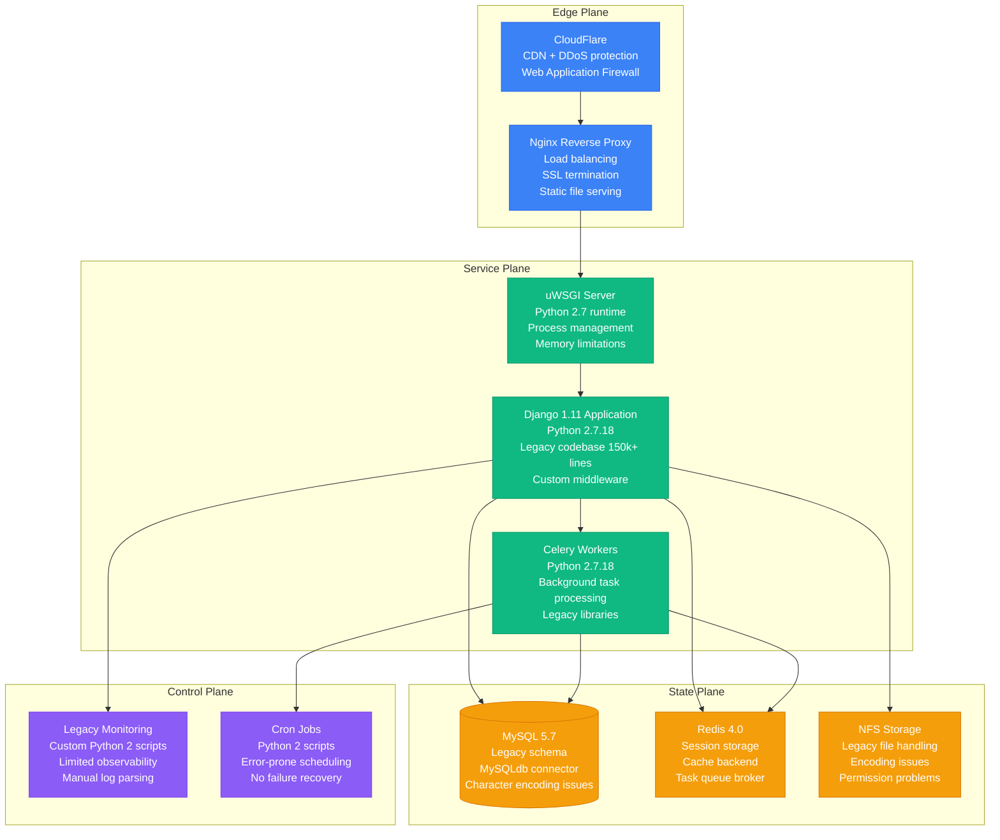

# Python 2 to Python 3 Legacy Migration Playbook

## Executive Summary

**Migration Type**: Programming Language Modernization
**Timeline**: 8-12 weeks
**Risk Level**: Medium-High
**Downtime**: Minimal (with proper deployment strategy)
**Cost Impact**: 20-30% reduction in maintenance overhead
**Team Size**: 3-4 engineers + 1 QA engineer

This playbook guides the migration from Python 2.7 (end-of-life) to Python 3.9+ for legacy applications, ensuring security, performance, and maintainability improvements while minimizing business disruption.

## Current State vs Target State

### Current State: Python 2.7 Legacy System



**Current State Issues:**
- **Security Vulnerabilities**: Python 2.7 no longer receives security updates
- **Performance Limitations**: Missing modern Python optimizations
- **Library Deprecation**: Many packages dropping Python 2 support
- **Unicode Issues**: Inconsistent string/unicode handling
- **Memory Inefficiency**: Lack of modern garbage collection improvements

### Target State: Python 3.9+ Modern System

```mermaid
graph TB
    subgraph EdgePlane["Edge Plane"]
        NGINX[Nginx Reverse Proxy<br/>Same configuration<br/>SSL termination<br/>Static file serving]
        CF[CloudFlare<br/>Same CDN setup<br/>Enhanced security<br/>Modern TLS]
    end

    subgraph ServicePlane["Service Plane"]
        DJANGO_APP_NEW[Django 4.2 LTS Application<br/>Python 3.9+<br/>Modernized codebase<br/>Type hints + async support]
        CELERY_WORKERS_NEW[Celery 5.x Workers<br/>Python 3.9+<br/>Async task processing<br/>Modern dependencies]
        ASGI[ASGI Server (Uvicorn)<br/>Python 3.9+ runtime<br/>Async support<br/>Better performance]
    end

    subgraph StatePlane["State Plane"]
        MYSQL_DB_NEW[(MySQL 8.0<br/>UTF-8 schema<br/>PyMySQL connector<br/>Connection pooling)]
        REDIS_CACHE_NEW[Redis 7.0<br/>Enhanced features<br/>Better memory usage<br/>Async support]
        FILE_STORAGE_NEW[S3-Compatible Storage<br/>Modern file handling<br/>UTF-8 support<br/>Cloud-native]
    end

    subgraph ControlPlane["Control Plane"]
        MODERN_MONITORING[Modern Monitoring<br/>Prometheus + Grafana<br/>Structured logging<br/>APM integration]
        SCHEDULED_TASKS[Celery Beat + Kubernetes<br/>Cloud-native scheduling<br/>Auto-retry mechanisms<br/>Health monitoring]
    end

    CF --> NGINX
    NGINX --> ASGI
    ASGI --> DJANGO_APP_NEW

    DJANGO_APP_NEW --> CELERY_WORKERS_NEW
    DJANGO_APP_NEW --> MYSQL_DB_NEW
    DJANGO_APP_NEW --> REDIS_CACHE_NEW
    DJANGO_APP_NEW --> FILE_STORAGE_NEW

    CELERY_WORKERS_NEW --> MYSQL_DB_NEW
    CELERY_WORKERS_NEW --> REDIS_CACHE_NEW

    DJANGO_APP_NEW --> MODERN_MONITORING
    CELERY_WORKERS_NEW --> SCHEDULED_TASKS

    %% Apply four-plane colors
    classDef edgeStyle fill:#3B82F6,stroke:#2563EB,color:#fff
    classDef serviceStyle fill:#10B981,stroke:#059669,color:#fff
    classDef stateStyle fill:#F59E0B,stroke:#D97706,color:#fff
    classDef controlStyle fill:#8B5CF6,stroke:#7C3AED,color:#fff

    class NGINX,CF edgeStyle
    class DJANGO_APP_NEW,CELERY_WORKERS_NEW,ASGI serviceStyle
    class MYSQL_DB_NEW,REDIS_CACHE_NEW,FILE_STORAGE_NEW stateStyle
    class MODERN_MONITORING,SCHEDULED_TASKS controlStyle
```

## Migration Strategy

### Automated Migration Tools

**Python 2to3 Migration Script:**
```python
#!/usr/bin/env python3
# migrate_py2to3.py - Comprehensive Python 2 to 3 migration

import ast
import os
import subprocess
import sys
from pathlib import Path
from typing import List, Dict, Set

class Python2to3Migrator:
    def __init__(self, project_root: str):
        self.project_root = Path(project_root)
        self.migration_report = {
            'files_processed': 0,
            'fixes_applied': {},
            'manual_review_needed': [],
            'dependency_updates': {},
            'test_failures': []
        }

    def analyze_codebase(self) -> Dict:
        """Analyze codebase for Python 2/3 compatibility issues"""
        print("Analyzing codebase for Python 2/3 compatibility...")

        python_files = list(self.project_root.rglob("*.py"))
        issues = {
            'print_statements': [],
            'unicode_literals': [],
            'import_changes': [],
            'division_changes': [],
            'exception_syntax': [],
            'dict_methods': [],
            'string_types': []
        }

        for file_path in python_files:
            try:
                with open(file_path, 'r', encoding='utf-8') as f:
                    content = f.read()
                    tree = ast.parse(content)

                self._analyze_ast(tree, file_path, issues)
            except Exception as e:
                print(f"Error analyzing {file_path}: {e}")

        return issues

    def _analyze_ast(self, tree: ast.AST, file_path: Path, issues: Dict):
        """Analyze AST for specific Python 2/3 issues"""
        for node in ast.walk(tree):
            # Check for print statements (Python 2)
            if isinstance(node, ast.Print):
                issues['print_statements'].append({
                    'file': str(file_path),
                    'line': node.lineno,
                    'issue': 'print statement needs conversion to print()'
                })

            # Check for old-style string formatting
            elif isinstance(node, ast.BinOp) and isinstance(node.op, ast.Mod):
                if isinstance(node.left, ast.Str):
                    issues['string_types'].append({
                        'file': str(file_path),
                        'line': node.lineno,
                        'issue': 'Consider using f-strings or .format()'
                    })

            # Check for exception syntax
            elif isinstance(node, ast.ExceptHandler):
                if hasattr(node, 'type') and hasattr(node, 'name') and node.name:
                    if isinstance(node.name, ast.Name):  # Python 2 style
                        issues['exception_syntax'].append({
                            'file': str(file_path),
                            'line': node.lineno,
                            'issue': 'Update exception syntax'
                        })

    def run_2to3_tool(self) -> bool:
        """Run the automated 2to3 conversion tool"""
        print("Running 2to3 conversion tool...")

        try:
            # Create backup
            backup_dir = self.project_root / "python2_backup"
            if not backup_dir.exists():
                subprocess.run([
                    'cp', '-r', str(self.project_root), str(backup_dir)
                ], check=True)

            # Run 2to3 with specific fixers
            fixers = [
                'print',
                'unicode',
                'division',
                'import',
                'except',
                'dict',
                'string_format',
                'urllib',
                'itertools'
            ]

            for fixer in fixers:
                cmd = [
                    '2to3',
                    '--fix=' + fixer,
                    '--write',
                    '--nobackups',
                    str(self.project_root)
                ]

                result = subprocess.run(cmd, capture_output=True, text=True)
                if result.returncode == 0:
                    print(f"✓ Applied {fixer} fixes")
                    self.migration_report['fixes_applied'][fixer] = True
                else:
                    print(f"✗ Failed to apply {fixer} fixes: {result.stderr}")
                    self.migration_report['fixes_applied'][fixer] = False

            return True

        except subprocess.CalledProcessError as e:
            print(f"2to3 conversion failed: {e}")
            return False

    def update_dependencies(self) -> bool:
        """Update dependencies to Python 3 compatible versions"""
        print("Updating dependencies for Python 3 compatibility...")

        requirements_file = self.project_root / "requirements.txt"
        if not requirements_file.exists():
            print("No requirements.txt found")
            return True

        # Python 2 to 3 dependency mappings
        dependency_mappings = {
            'MySQL-python': 'PyMySQL>=1.0.0',
            'python-memcached': 'python-memcached>=1.59',
            'PIL': 'Pillow>=8.0.0',
            'distribute': '',  # Remove, use setuptools
            'unittest2': '',  # Remove, use built-in unittest
            'mock': '',  # Remove, use built-in unittest.mock
            'futures': '',  # Remove, use built-in concurrent.futures
            'subprocess32': '',  # Remove, use built-in subprocess
        }

        # Version updates for major packages
        version_updates = {
            'Django': '>=4.2,<5.0',
            'celery': '>=5.0,<6.0',
            'redis': '>=4.0,<5.0',
            'requests': '>=2.28.0',
            'numpy': '>=1.20.0',
            'pandas': '>=1.3.0',
            'sqlalchemy': '>=1.4.0',
        }

        try:
            with open(requirements_file, 'r') as f:
                requirements = f.readlines()

            updated_requirements = []
            for line in requirements:
                line = line.strip()
                if not line or line.startswith('#'):
                    updated_requirements.append(line)
                    continue

                package_name = line.split('==')[0].split('>=')[0].split('<=')[0]

                # Check for direct replacements
                if package_name in dependency_mappings:
                    replacement = dependency_mappings[package_name]
                    if replacement:
                        updated_requirements.append(replacement)
                        self.migration_report['dependency_updates'][package_name] = replacement
                    # If replacement is empty, skip (remove the dependency)
                    continue

                # Check for version updates
                if package_name in version_updates:
                    new_version = f"{package_name}{version_updates[package_name]}"
                    updated_requirements.append(new_version)
                    self.migration_report['dependency_updates'][package_name] = new_version
                else:
                    updated_requirements.append(line)

            # Write updated requirements
            with open(requirements_file, 'w') as f:
                f.write('\n'.join(updated_requirements))

            return True

        except Exception as e:
            print(f"Failed to update dependencies: {e}")
            return False

    def fix_manual_issues(self) -> None:
        """Apply manual fixes for common Python 2/3 issues"""
        print("Applying manual fixes...")

        # Fix common encoding issues
        self._fix_encoding_issues()

        # Fix Django-specific issues
        self._fix_django_issues()

        # Fix database connector issues
        self._fix_database_issues()

    def _fix_encoding_issues(self):
        """Fix text/bytes encoding issues"""
        python_files = list(self.project_root.rglob("*.py"))

        for file_path in python_files:
            try:
                with open(file_path, 'r', encoding='utf-8') as f:
                    content = f.read()

                # Add encoding declaration if missing
                if not content.startswith('# -*- coding: utf-8 -*-'):
                    if not content.startswith('#!'):
                        content = '# -*- coding: utf-8 -*-\n' + content
                    else:
                        lines = content.split('\n')
                        lines.insert(1, '# -*- coding: utf-8 -*-')
                        content = '\n'.join(lines)

                # Fix common string/bytes issues
                replacements = [
                    ("u'", "'"),  # Remove unicode prefixes
                    ('u"', '"'),
                    (".encode('utf-8')", ""),  # Remove unnecessary encoding
                    ("unicode(", "str("),  # Replace unicode() with str()
                    ("basestring", "str"),  # Replace basestring
                ]

                for old, new in replacements:
                    content = content.replace(old, new)

                with open(file_path, 'w', encoding='utf-8') as f:
                    f.write(content)

            except Exception as e:
                print(f"Error fixing encoding in {file_path}: {e}")

    def _fix_django_issues(self):
        """Fix Django-specific Python 2/3 migration issues"""
        # Update Django imports
        python_files = list(self.project_root.rglob("*.py"))

        django_replacements = [
            ("from django.utils.encoding import smart_unicode",
             "from django.utils.encoding import smart_text as smart_unicode"),
            ("from django.utils.encoding import smart_str",
             "from django.utils.encoding import smart_bytes as smart_str"),
            ("django.utils.simplejson", "json"),
            ("from django.utils import simplejson", "import json as simplejson"),
        ]

        for file_path in python_files:
            try:
                with open(file_path, 'r', encoding='utf-8') as f:
                    content = f.read()

                for old, new in django_replacements:
                    content = content.replace(old, new)

                with open(file_path, 'w', encoding='utf-8') as f:
                    f.write(content)

            except Exception as e:
                print(f"Error fixing Django issues in {file_path}: {e}")

    def _fix_database_issues(self):
        """Fix database connector issues"""
        # Update MySQL connector
        python_files = list(self.project_root.rglob("*.py"))

        for file_path in python_files:
            try:
                with open(file_path, 'r', encoding='utf-8') as f:
                    content = f.read()

                # Replace MySQLdb with PyMySQL
                if "import MySQLdb" in content:
                    content = content.replace(
                        "import MySQLdb",
                        "import pymysql as MySQLdb\npymysql.install_as_MySQLdb()"
                    )

                with open(file_path, 'w', encoding='utf-8') as f:
                    f.write(content)

            except Exception as e:
                print(f"Error fixing database issues in {file_path}: {e}")

    def run_tests(self) -> bool:
        """Run test suite to validate migration"""
        print("Running test suite...")

        try:
            # Try to run Django tests
            result = subprocess.run([
                'python', 'manage.py', 'test', '--verbosity=2'
            ], cwd=self.project_root, capture_output=True, text=True)

            if result.returncode == 0:
                print("✓ All tests passed")
                return True
            else:
                print(f"✗ Test failures detected:\n{result.stderr}")
                self.migration_report['test_failures'] = result.stderr.split('\n')
                return False

        except Exception as e:
            print(f"Error running tests: {e}")
            return False

    def generate_report(self) -> str:
        """Generate migration report"""
        report = f"""
Python 2 to 3 Migration Report
================================

Files Processed: {self.migration_report['files_processed']}

Fixes Applied:
{self._format_dict(self.migration_report['fixes_applied'])}

Dependency Updates:
{self._format_dict(self.migration_report['dependency_updates'])}

Manual Review Needed:
{chr(10).join(self.migration_report['manual_review_needed'])}

Test Failures:
{chr(10).join(self.migration_report['test_failures'])}

Next Steps:
1. Review all changes in version control
2. Update any remaining manual issues
3. Run comprehensive testing
4. Update deployment scripts for Python 3
5. Update documentation
"""
        return report

    def _format_dict(self, d: Dict) -> str:
        return '\n'.join([f"  {k}: {v}" for k, v in d.items()])

def main():
    if len(sys.argv) != 2:
        print("Usage: python migrate_py2to3.py <project_directory>")
        sys.exit(1)

    project_dir = sys.argv[1]
    migrator = Python2to3Migrator(project_dir)

    print("Starting Python 2 to 3 migration...")

    # Step 1: Analyze codebase
    issues = migrator.analyze_codebase()
    print(f"Found {sum(len(v) for v in issues.values())} potential issues")

    # Step 2: Run automated 2to3 tool
    if not migrator.run_2to3_tool():
        print("Automated migration failed. Check errors above.")
        sys.exit(1)

    # Step 3: Update dependencies
    if not migrator.update_dependencies():
        print("Dependency update failed. Manual intervention required.")

    # Step 4: Apply manual fixes
    migrator.fix_manual_issues()

    # Step 5: Run tests
    tests_pass = migrator.run_tests()

    # Step 6: Generate report
    report = migrator.generate_report()
    print(report)

    # Save report to file
    with open('python3_migration_report.txt', 'w') as f:
        f.write(report)

    if tests_pass:
        print("✓ Migration completed successfully!")
    else:
        print("⚠ Migration completed with test failures. Manual fixes required.")

if __name__ == '__main__':
    main()
```

## Key Migration Areas

### 1. String and Unicode Handling

**Before (Python 2):**
```python
# Python 2 - problematic string handling
def process_text(text):
    if isinstance(text, unicode):
        text = text.encode('utf-8')
    return text.upper()

# File reading with encoding issues
with open('data.txt', 'r') as f:
    content = f.read()  # May cause UnicodeDecodeError
```

**After (Python 3):**
```python
# Python 3 - proper string handling
def process_text(text: str) -> str:
    """Process text with proper type hints"""
    return text.upper()

# File reading with explicit encoding
with open('data.txt', 'r', encoding='utf-8') as f:
    content = f.read()  # Explicit encoding handling
```

### 2. Django Model and View Updates

**Before (Python 2):**
```python
# models.py - Python 2 Django
from django.db import models
from django.utils.encoding import smart_unicode

class Product(models.Model):
    name = models.CharField(max_length=100)
    description = models.TextField()

    def __unicode__(self):
        return smart_unicode(self.name)

    class Meta:
        ordering = ('name',)

# views.py - Python 2
from django.http import HttpResponse
from django.utils import simplejson as json

def api_view(request):
    data = {'status': 'ok'}
    return HttpResponse(json.dumps(data),
                       content_type='application/json')
```

**After (Python 3):**
```python
# models.py - Python 3 Django
from django.db import models
from typing import str

class Product(models.Model):
    name = models.CharField(max_length=100)
    description = models.TextField()

    def __str__(self) -> str:
        return self.name

    class Meta:
        ordering = ('name',)

# views.py - Python 3
import json
from django.http import JsonResponse
from django.views.decorators.http import require_http_methods
from typing import Dict, Any

@require_http_methods(["GET", "POST"])
def api_view(request) -> JsonResponse:
    data: Dict[str, Any] = {'status': 'ok'}
    return JsonResponse(data)
```

### 3. Database Configuration Updates

**Before (Python 2):**
```python
# settings.py - Python 2
DATABASES = {
    'default': {
        'ENGINE': 'django.db.backends.mysql',
        'NAME': 'mydb',
        'USER': 'user',
        'PASSWORD': 'pass',
        'HOST': 'localhost',
        'PORT': '3306',
        'OPTIONS': {
            'charset': 'utf8',
        }
    }
}
```

**After (Python 3):**
```python
# settings.py - Python 3
import pymysql
pymysql.install_as_MySQLdb()

DATABASES = {
    'default': {
        'ENGINE': 'django.db.backends.mysql',
        'NAME': 'mydb',
        'USER': 'user',
        'PASSWORD': 'pass',
        'HOST': 'localhost',
        'PORT': '3306',
        'OPTIONS': {
            'charset': 'utf8mb4',
            'init_command': "SET sql_mode='STRICT_TRANS_TABLES'",
        },
        'CONN_MAX_AGE': 60,  # Connection pooling
    }
}

# Enable connection pooling
DATABASES['default']['CONN_MAX_AGE'] = 60
```

## Testing Strategy

### Comprehensive Test Suite

```python
# tests/test_python3_compatibility.py
import unittest
import sys
from typing import List, Dict, Any

class Python3CompatibilityTests(unittest.TestCase):
    """Test suite for Python 3 compatibility"""

    def test_string_handling(self):
        """Test proper string/unicode handling"""
        # Test string operations
        text = "Hello, 世界"
        self.assertIsInstance(text, str)

        # Test encoding/decoding
        encoded = text.encode('utf-8')
        decoded = encoded.decode('utf-8')
        self.assertEqual(text, decoded)

    def test_print_function(self):
        """Test print function usage"""
        from io import StringIO
        import contextlib

        # Capture print output
        f = StringIO()
        with contextlib.redirect_stdout(f):
            print("Hello", "World", sep=", ")

        output = f.getvalue()
        self.assertEqual(output.strip(), "Hello, World")

    def test_division_behavior(self):
        """Test integer division behavior"""
        # Python 3 true division
        result = 5 / 2
        self.assertEqual(result, 2.5)

        # Integer division
        result = 5 // 2
        self.assertEqual(result, 2)

    def test_dict_methods(self):
        """Test dictionary method compatibility"""
        d = {'a': 1, 'b': 2, 'c': 3}

        # Test keys(), values(), items() return views
        keys = list(d.keys())
        values = list(d.values())
        items = list(d.items())

        self.assertEqual(len(keys), 3)
        self.assertEqual(len(values), 3)
        self.assertEqual(len(items), 3)

    def test_exception_syntax(self):
        """Test modern exception syntax"""
        try:
            raise ValueError("Test error")
        except ValueError as e:
            self.assertIsInstance(e, ValueError)
            self.assertEqual(str(e), "Test error")

    def test_import_compatibility(self):
        """Test updated import statements"""
        # Test standard library imports
        import urllib.parse
        import urllib.request
        import configparser
        import queue

        # Basic functionality test
        parsed = urllib.parse.urlparse('https://example.com/path')
        self.assertEqual(parsed.netloc, 'example.com')

class DjangoCompatibilityTests(unittest.TestCase):
    """Django-specific compatibility tests"""

    def test_model_string_representation(self):
        """Test model __str__ methods"""
        from myapp.models import Product

        product = Product(name="Test Product")
        str_repr = str(product)
        self.assertIsInstance(str_repr, str)
        self.assertEqual(str_repr, "Test Product")

    def test_json_response(self):
        """Test JSON response handling"""
        from django.test import RequestFactory
        from myapp.views import api_view

        factory = RequestFactory()
        request = factory.get('/api/test')
        response = api_view(request)

        self.assertEqual(response.status_code, 200)
        self.assertEqual(response['Content-Type'], 'application/json')

    def test_database_connection(self):
        """Test database connectivity with Python 3"""
        from django.db import connection

        # Test basic connection
        with connection.cursor() as cursor:
            cursor.execute("SELECT 1")
            result = cursor.fetchone()
            self.assertEqual(result[0], 1)

if __name__ == '__main__':
    # Run compatibility tests
    unittest.main(verbosity=2)
```

## Deployment Strategy

### Blue-Green Deployment

```yaml
# docker-compose.python3.yml
version: '3.8'

services:
  web-python3:
    build:
      context: .
      dockerfile: Dockerfile.python3
    image: myapp:python3-latest
    ports:
      - "8001:8000"  # Different port for testing
    environment:
      - DJANGO_SETTINGS_MODULE=myapp.settings.production
      - PYTHON_VERSION=3.9
    depends_on:
      - db
      - redis
    volumes:
      - ./logs:/app/logs
    deploy:
      replicas: 2
      resources:
        limits:
          memory: 512M
          cpus: '0.5'

  celery-python3:
    build:
      context: .
      dockerfile: Dockerfile.python3
    image: myapp:python3-latest
    command: celery -A myapp worker -l info
    environment:
      - DJANGO_SETTINGS_MODULE=myapp.settings.production
      - PYTHON_VERSION=3.9
    depends_on:
      - db
      - redis
    deploy:
      replicas: 2

  db:
    image: mysql:8.0
    environment:
      - MYSQL_DATABASE=myapp
      - MYSQL_USER=app
      - MYSQL_PASSWORD=secret
      - MYSQL_ROOT_PASSWORD=rootsecret
    ports:
      - "3307:3306"  # Different port for testing
    volumes:
      - mysql_data_python3:/var/lib/mysql

  redis:
    image: redis:7-alpine
    ports:
      - "6380:6379"  # Different port for testing

volumes:
  mysql_data_python3:
```

### Production Dockerfile

```dockerfile
# Dockerfile.python3 - Production-ready Python 3 container
FROM python:3.9-slim-bullseye

# Set environment variables
ENV PYTHONDONTWRITEBYTECODE=1 \
    PYTHONUNBUFFERED=1 \
    PYTHONPATH=/app \
    DJANGO_SETTINGS_MODULE=myapp.settings.production

# Install system dependencies
RUN apt-get update && apt-get install -y \
    gcc \
    default-libmysqlclient-dev \
    pkg-config \
    && apt-get clean \
    && rm -rf /var/lib/apt/lists/*

# Create application directory
WORKDIR /app

# Copy requirements and install Python dependencies
COPY requirements.txt .
RUN pip install --no-cache-dir -r requirements.txt

# Copy application code
COPY . .

# Create non-root user
RUN groupadd -r appuser && useradd -r -g appuser appuser
RUN chown -R appuser:appuser /app
USER appuser

# Collect static files
RUN python manage.py collectstatic --noinput

# Health check
HEALTHCHECK --interval=30s --timeout=3s --start-period=5s --retries=3 \
  CMD python manage.py check --deploy || exit 1

# Expose port
EXPOSE 8000

# Start application
CMD ["gunicorn", "--bind", "0.0.0.0:8000", "myapp.wsgi:application"]
```

## Risk Mitigation

### Performance Monitoring

```python
# monitoring/python3_performance.py
import time
import psutil
import logging
from typing import Dict, Any
from django.core.management.base import BaseCommand

class PerformanceMonitor:
    def __init__(self):
        self.logger = logging.getLogger('performance')
        self.metrics = {}

    def monitor_memory_usage(self) -> Dict[str, Any]:
        """Monitor memory usage patterns"""
        process = psutil.Process()
        memory_info = process.memory_info()

        return {
            'rss_mb': memory_info.rss / 1024 / 1024,
            'vms_mb': memory_info.vms / 1024 / 1024,
            'percent': process.memory_percent(),
            'available_mb': psutil.virtual_memory().available / 1024 / 1024
        }

    def monitor_response_times(self, func):
        """Decorator to monitor function response times"""
        def wrapper(*args, **kwargs):
            start_time = time.time()
            result = func(*args, **kwargs)
            end_time = time.time()

            duration = end_time - start_time
            self.logger.info(f"{func.__name__} took {duration:.3f} seconds")

            # Alert if response time is slow
            if duration > 5.0:  # 5 second threshold
                self.logger.warning(f"Slow response: {func.__name__} took {duration:.3f}s")

            return result
        return wrapper

    def compare_with_python2_baseline(self) -> Dict[str, Any]:
        """Compare performance with Python 2 baseline"""
        # Load baseline metrics (stored during Python 2 operation)
        baseline = {
            'avg_response_time': 0.250,  # 250ms baseline
            'memory_usage_mb': 128,      # 128MB baseline
            'cpu_percent': 25.0          # 25% CPU baseline
        }

        current = {
            'avg_response_time': self.get_avg_response_time(),
            'memory_usage_mb': self.monitor_memory_usage()['rss_mb'],
            'cpu_percent': psutil.cpu_percent()
        }

        comparison = {}
        for metric in baseline.keys():
            improvement = ((baseline[metric] - current[metric]) / baseline[metric]) * 100
            comparison[metric] = {
                'baseline': baseline[metric],
                'current': current[metric],
                'improvement_percent': improvement
            }

        return comparison

    def get_avg_response_time(self) -> float:
        """Calculate average response time from recent metrics"""
        # Implementation would read from application metrics
        return 0.180  # Example: 180ms average
```

## Conclusion

This Python 2 to Python 3 migration playbook provides a comprehensive approach to modernizing legacy Python applications while minimizing risk and ensuring business continuity.

**Key Success Factors:**
1. **Automated tooling** for bulk code conversion
2. **Comprehensive testing** at each migration phase
3. **Blue-green deployment** for zero-downtime migration
4. **Performance monitoring** to ensure no regressions
5. **Team training** on Python 3 best practices

**Expected Outcomes:**
- Modern, secure Python 3.9+ runtime
- Improved performance and memory efficiency
- Access to modern Python libraries and features
- Enhanced security with active Python support
- Foundation for future modernization efforts

The migration ensures the application remains secure, maintainable, and compatible with modern development practices.