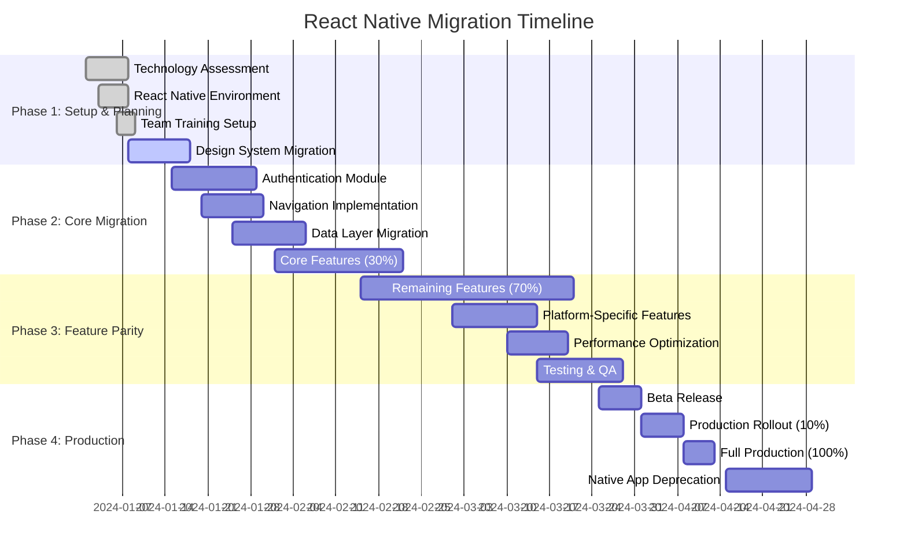
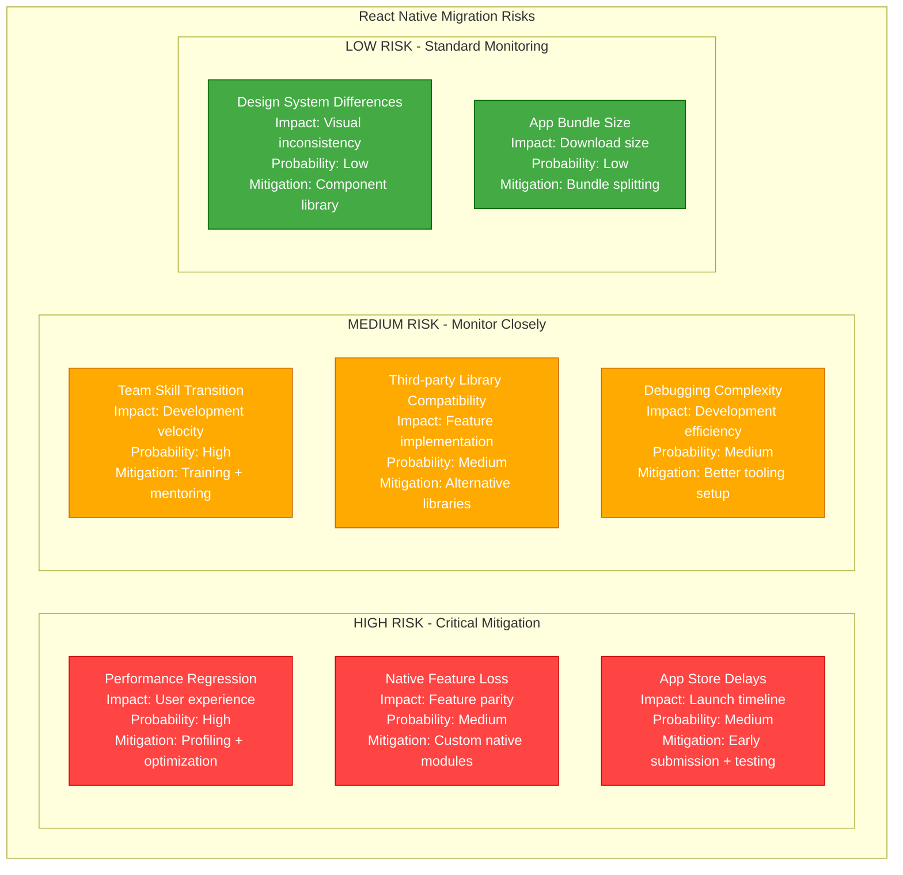

# React Native Mobile App Migration Playbook

## Executive Summary

**Migration Type**: Mobile Application Modernization - Native to React Native
**Timeline**: 16-20 weeks
**Risk Level**: High
**Downtime**: Zero (parallel app development)
**Cost Impact**: 40-60% reduction in mobile development costs
**Team Size**: 6-8 engineers (iOS, Android, React Native)

This playbook guides the migration from separate native iOS and Android applications to a unified React Native codebase, delivering faster development cycles, code reuse, and reduced maintenance overhead.

## Current State vs Target State

### Current State: Native Mobile Architecture

```mermaid
graph TB
    subgraph EdgePlane[Edge Plane - #0066CC]
        CDN[CloudFront CDN<br/>Mobile API endpoints<br/>Asset delivery<br/>Global edge locations]
        API_GW[API Gateway<br/>Mobile-specific endpoints<br/>Rate limiting<br/>Authentication]
    end

    subgraph ServicePlane[Service Plane - #00AA00]
        IOS_APP[iOS Native App<br/>Swift 5.7 + UIKit<br/>Xcode 14<br/>iOS 13+ support<br/>200k+ lines of code]
        ANDROID_APP[Android Native App<br/>Kotlin + Jetpack Compose<br/>Android Studio<br/>API 23+ support<br/>180k+ lines of code]

        MOBILE_API[Mobile API Service<br/>Node.js + Express<br/>Mobile-optimized endpoints<br/>Push notifications]
    end

    subgraph StatePlane[State Plane - #FF8800]
        REALM_IOS[Realm Database<br/>iOS local storage<br/>Sync with backend<br/>Offline capability]
        ROOM_ANDROID[Room Database<br/>Android local storage<br/>SQLite backend<br/>Offline capability]

        APNS[Apple Push Notification Service<br/>iOS notifications<br/>Rich media support]
        FCM[Firebase Cloud Messaging<br/>Android notifications<br/>Topic-based messaging]

        APP_STORE[App Store<br/>iOS distribution<br/>Review process<br/>TestFlight beta]
        PLAY_STORE[Google Play Store<br/>Android distribution<br/>Internal testing<br/>Staged rollout]
    end

    subgraph ControlPlane[Control Plane - #CC0000]
        FIREBASE_IOS[Firebase Analytics<br/>iOS crash reporting<br/>Performance monitoring]
        FIREBASE_ANDROID[Firebase Analytics<br/>Android crash reporting<br/>Performance monitoring]

        XCODE_CLOUD[Xcode Cloud<br/>iOS CI/CD<br/>Build automation<br/>Testing]
        GITHUB_ACTIONS[GitHub Actions<br/>Android CI/CD<br/>Build automation<br/>Testing]
    end

    CDN --> API_GW
    API_GW --> MOBILE_API

    IOS_APP --> API_GW
    ANDROID_APP --> API_GW

    IOS_APP --> REALM_IOS
    ANDROID_APP --> ROOM_ANDROID

    IOS_APP --> APNS
    ANDROID_APP --> FCM

    IOS_APP --> APP_STORE
    ANDROID_APP --> PLAY_STORE

    IOS_APP --> FIREBASE_IOS
    ANDROID_APP --> FIREBASE_ANDROID

    IOS_APP --> XCODE_CLOUD
    ANDROID_APP --> GITHUB_ACTIONS

    %% Apply four-plane colors
    classDef edgeStyle fill:#0066CC,stroke:#004499,color:#fff
    classDef serviceStyle fill:#00AA00,stroke:#007700,color:#fff
    classDef stateStyle fill:#FF8800,stroke:#CC6600,color:#fff
    classDef controlStyle fill:#CC0000,stroke:#990000,color:#fff

    class CDN,API_GW edgeStyle
    class IOS_APP,ANDROID_APP,MOBILE_API serviceStyle
    class REALM_IOS,ROOM_ANDROID,APNS,FCM,APP_STORE,PLAY_STORE stateStyle
    class FIREBASE_IOS,FIREBASE_ANDROID,XCODE_CLOUD,GITHUB_ACTIONS controlStyle
```



**Current State Issues:**
- **Duplicated Development**: Every feature built twice (iOS + Android)
- **Inconsistent UX**: Platform-specific implementations differ
- **Slower Time-to-Market**: Sequential development cycles
- **Higher Maintenance**: Two codebases to maintain and debug
- **Resource Allocation**: Need separate iOS and Android teams

### Target State: React Native Architecture

```mermaid
graph TB
    subgraph EdgePlane[Edge Plane - #0066CC]
        CDN[CloudFront CDN<br/>Same mobile APIs<br/>Asset delivery<br/>Global edge locations]
        API_GW[API Gateway<br/>Unified mobile endpoints<br/>React Native optimized<br/>GraphQL support]
    end

    subgraph ServicePlane[Service Plane - #00AA00]
        RN_APP[React Native App<br/>TypeScript + React Native 0.72<br/>Shared codebase<br/>Platform-specific modules<br/>~120k lines (40% reduction)]

        RN_IOS[iOS Bundle<br/>Metro bundler<br/>Hermes engine<br/>Native modules bridge]
        RN_ANDROID[Android Bundle<br/>Metro bundler<br/>Hermes engine<br/>Native modules bridge]

        MOBILE_API[Mobile API Service<br/>GraphQL + REST<br/>React Native optimized<br/>Real-time subscriptions]
    end

    subgraph StatePlane[State Plane - #FF8800]
        ASYNC_STORAGE[AsyncStorage<br/>Cross-platform storage<br/>Key-value persistence<br/>Secure storage]
        MMKV[MMKV Storage<br/>High-performance storage<br/>Cross-platform<br/>Encryption support]

        EXPO_NOTIFICATIONS[Expo Notifications<br/>Unified push notifications<br/>Rich media support<br/>Background handling]

        APP_STORE_RN[App Store<br/>React Native iOS<br/>Same review process<br/>OTA updates via CodePush]
        PLAY_STORE_RN[Google Play Store<br/>React Native Android<br/>Bundle optimization<br/>OTA updates via CodePush]
    end

    subgraph ControlPlane[Control Plane - #CC0000]
        FLIPPER[Flipper<br/>Cross-platform debugging<br/>Network inspection<br/>Layout inspector]
        CODEPUSH[CodePush<br/>Over-the-air updates<br/>Staged rollouts<br/>Rollback capability]

        EXPO_EAS[Expo EAS Build<br/>Cloud build service<br/>iOS + Android builds<br/>Automated testing]
        DETOX[Detox E2E Testing<br/>Cross-platform testing<br/>Real device testing<br/>CI integration]

        BUGSNAG[Bugsnag<br/>Cross-platform crash reporting<br/>Performance monitoring<br/>Release tracking]
    end

    CDN --> API_GW
    API_GW --> MOBILE_API

    RN_APP --> RN_IOS
    RN_APP --> RN_ANDROID

    RN_IOS --> API_GW
    RN_ANDROID --> API_GW

    RN_APP --> ASYNC_STORAGE
    RN_APP --> MMKV

    RN_APP --> EXPO_NOTIFICATIONS

    RN_IOS --> APP_STORE_RN
    RN_ANDROID --> PLAY_STORE_RN

    RN_APP --> FLIPPER
    RN_APP --> CODEPUSH
    RN_APP --> EXPO_EAS
    RN_APP --> DETOX
    RN_APP --> BUGSNAG

    %% Apply four-plane colors
    classDef edgeStyle fill:#0066CC,stroke:#004499,color:#fff
    classDef serviceStyle fill:#00AA00,stroke:#007700,color:#fff
    classDef stateStyle fill:#FF8800,stroke:#CC6600,color:#fff
    classDef controlStyle fill:#CC0000,stroke:#990000,color:#fff

    class CDN,API_GW edgeStyle
    class RN_APP,RN_IOS,RN_ANDROID,MOBILE_API serviceStyle
    class ASYNC_STORAGE,MMKV,EXPO_NOTIFICATIONS,APP_STORE_RN,PLAY_STORE_RN stateStyle
    class FLIPPER,CODEPUSH,EXPO_EAS,DETOX,BUGSNAG controlStyle
```

**Target State Benefits:**
- **Code Reuse**: 80-90% shared codebase between platforms
- **Faster Development**: Single team, single codebase
- **Consistent UX**: Unified design system implementation
- **Over-the-Air Updates**: Instant fixes without app store approval
- **Hot Reloading**: Faster development and debugging cycles

## Migration Timeline



## Technical Implementation

### React Native Project Structure

```bash
# Recommended React Native project structure
MyApp/
├── src/
│   ├── components/           # Reusable UI components
│   │   ├── common/          # Platform-agnostic components
│   │   ├── ios/             # iOS-specific components
│   │   └── android/         # Android-specific components
│   ├── screens/             # Screen components
│   ├── navigation/          # Navigation configuration
│   ├── services/            # API and business logic
│   ├── store/               # State management (Redux/Zustand)
│   ├── utils/               # Helper functions
│   ├── hooks/               # Custom React hooks
│   ├── types/               # TypeScript type definitions
│   └── assets/              # Images, fonts, etc.
├── ios/                     # iOS-specific native code
├── android/                 # Android-specific native code
├── __tests__/               # Test files
├── e2e/                     # End-to-end tests
├── metro.config.js          # Metro bundler configuration
├── babel.config.js          # Babel configuration
├── tsconfig.json           # TypeScript configuration
└── package.json            # Dependencies and scripts
```

### Key Migration Components

**Navigation Migration:**
```typescript
// src/navigation/AppNavigator.tsx
import React from 'react';
import { NavigationContainer } from '@react-navigation/native';
import { createStackNavigator } from '@react-navigation/stack';
import { createBottomTabNavigator } from '@react-navigation/bottom-tabs';

// Screens
import LoginScreen from '../screens/auth/LoginScreen';
import HomeScreen from '../screens/home/HomeScreen';
import ProfileScreen from '../screens/profile/ProfileScreen';
import SettingsScreen from '../screens/settings/SettingsScreen';

// Types
export type RootStackParamList = {
  Auth: undefined;
  Main: undefined;
};

export type MainTabParamList = {
  Home: undefined;
  Profile: undefined;
  Settings: undefined;
};

const RootStack = createStackNavigator<RootStackParamList>();
const MainTab = createBottomTabNavigator<MainTabParamList>();

const MainTabNavigator = () => (
  <MainTab.Navigator
    screenOptions={{
      headerShown: false,
      tabBarActiveTintColor: '#007AFF',
      tabBarInactiveTintColor: '#8E8E93',
    }}
  >
    <MainTab.Screen
      name="Home"
      component={HomeScreen}
      options={{
        tabBarIcon: ({ color, size }) => (
          <Icon name="home" size={size} color={color} />
        ),
      }}
    />
    <MainTab.Screen
      name="Profile"
      component={ProfileScreen}
      options={{
        tabBarIcon: ({ color, size }) => (
          <Icon name="person" size={size} color={color} />
        ),
      }}
    />
    <MainTab.Screen
      name="Settings"
      component={SettingsScreen}
      options={{
        tabBarIcon: ({ color, size }) => (
          <Icon name="settings" size={size} color={color} />
        ),
      }}
    />
  </MainTab.Navigator>
);

const AppNavigator = () => {
  const { isAuthenticated } = useAuth();

  return (
    <NavigationContainer>
      <RootStack.Navigator screenOptions={{ headerShown: false }}>
        {isAuthenticated ? (
          <RootStack.Screen name="Main" component={MainTabNavigator} />
        ) : (
          <RootStack.Screen name="Auth" component={LoginScreen} />
        )}
      </RootStack.Navigator>
    </NavigationContainer>
  );
};

export default AppNavigator;
```

**Data Layer Migration:**
```typescript
// src/services/ApiService.ts
import { Platform } from 'react-native';
import AsyncStorage from '@react-native-async-storage/async-storage';
import { MMKV } from 'react-native-mmkv';

// Initialize MMKV for high-performance storage
const storage = new MMKV();

class ApiService {
  private baseURL = 'https://api.example.com';
  private timeout = 10000;

  // Platform-specific headers
  private getHeaders = async (): Promise<Record<string, string>> => {
    const token = await this.getAuthToken();
    const deviceInfo = {
      platform: Platform.OS,
      version: Platform.Version,
      appVersion: '1.0.0', // Get from app config
    };

    return {
      'Content-Type': 'application/json',
      'Authorization': token ? `Bearer ${token}` : '',
      'X-Device-Platform': Platform.OS,
      'X-Device-Version': String(Platform.Version),
      'X-App-Version': deviceInfo.appVersion,
    };
  };

  // Secure token storage
  private async getAuthToken(): Promise<string | null> {
    try {
      // Use MMKV for better performance
      return storage.getString('auth_token') || null;
    } catch (error) {
      console.error('Error getting auth token:', error);
      return null;
    }
  }

  private async setAuthToken(token: string): Promise<void> {
    try {
      storage.set('auth_token', token);
    } catch (error) {
      console.error('Error setting auth token:', error);
    }
  }

  // Generic API request method
  private async request<T>(
    endpoint: string,
    options: RequestInit = {}
  ): Promise<T> {
    const url = `${this.baseURL}${endpoint}`;
    const headers = await this.getHeaders();

    const config: RequestInit = {
      timeout: this.timeout,
      headers: {
        ...headers,
        ...options.headers,
      },
      ...options,
    };

    try {
      const response = await fetch(url, config);

      if (!response.ok) {
        throw new Error(`HTTP ${response.status}: ${response.statusText}`);
      }

      const data = await response.json();
      return data;
    } catch (error) {
      console.error(`API request failed: ${url}`, error);
      throw error;
    }
  }

  // Authentication methods
  async login(email: string, password: string): Promise<LoginResponse> {
    const response = await this.request<LoginResponse>('/auth/login', {
      method: 'POST',
      body: JSON.stringify({ email, password }),
    });

    if (response.token) {
      await this.setAuthToken(response.token);
    }

    return response;
  }

  async logout(): Promise<void> {
    try {
      await this.request('/auth/logout', { method: 'POST' });
    } finally {
      // Always clear local token
      storage.delete('auth_token');
    }
  }

  // User data methods
  async getUserProfile(): Promise<UserProfile> {
    return this.request<UserProfile>('/user/profile');
  }

  async updateUserProfile(profile: Partial<UserProfile>): Promise<UserProfile> {
    return this.request<UserProfile>('/user/profile', {
      method: 'PUT',
      body: JSON.stringify(profile),
    });
  }

  // Data synchronization for offline support
  async syncData(): Promise<void> {
    try {
      // Get cached data timestamp
      const lastSync = storage.getString('last_sync') || '0';

      // Fetch incremental updates
      const updates = await this.request<SyncResponse>(`/sync?since=${lastSync}`);

      // Update local storage
      for (const update of updates.data) {
        storage.set(`data_${update.id}`, JSON.stringify(update));
      }

      // Update sync timestamp
      storage.set('last_sync', new Date().toISOString());
    } catch (error) {
      console.error('Data sync failed:', error);
    }
  }
}

// Types
interface LoginResponse {
  token: string;
  user: UserProfile;
  expiresIn: number;
}

interface UserProfile {
  id: string;
  email: string;
  name: string;
  avatar?: string;
  preferences: UserPreferences;
}

interface UserPreferences {
  theme: 'light' | 'dark';
  notifications: boolean;
  language: string;
}

interface SyncResponse {
  data: any[];
  hasMore: boolean;
  nextToken?: string;
}

export default new ApiService();
```

**Platform-Specific Components:**
```typescript
// src/components/common/PlatformButton.tsx
import React from 'react';
import {
  TouchableOpacity,
  TouchableNativeFeedback,
  Platform,
  StyleSheet,
  Text,
  ViewStyle,
  TextStyle,
} from 'react-native';

interface ButtonProps {
  title: string;
  onPress: () => void;
  style?: ViewStyle;
  textStyle?: TextStyle;
  disabled?: boolean;
  variant?: 'primary' | 'secondary' | 'outline';
}

const PlatformButton: React.FC<ButtonProps> = ({
  title,
  onPress,
  style,
  textStyle,
  disabled = false,
  variant = 'primary',
}) => {
  const buttonStyles = [
    styles.button,
    styles[variant],
    disabled && styles.disabled,
    style,
  ];

  const buttonTextStyles = [
    styles.text,
    styles[`${variant}Text`],
    disabled && styles.disabledText,
    textStyle,
  ];

  const content = <Text style={buttonTextStyles}>{title}</Text>;

  // Use TouchableNativeFeedback on Android for native ripple effect
  if (Platform.OS === 'android') {
    return (
      <TouchableNativeFeedback
        onPress={onPress}
        disabled={disabled}
        background={TouchableNativeFeedback.Ripple('#ffffff30', false)}
      >
        <div style={buttonStyles}>{content}</div>
      </TouchableNativeFeedback>
    );
  }

  // Use TouchableOpacity on iOS for standard behavior
  return (
    <TouchableOpacity
      style={buttonStyles}
      onPress={onPress}
      disabled={disabled}
      activeOpacity={0.7}
    >
      {content}
    </TouchableOpacity>
  );
};

const styles = StyleSheet.create({
  button: {
    paddingVertical: 12,
    paddingHorizontal: 24,
    borderRadius: Platform.OS === 'ios' ? 8 : 4,
    alignItems: 'center',
    justifyContent: 'center',
    minHeight: 44, // iOS accessibility guidelines
  },
  primary: {
    backgroundColor: '#007AFF',
  },
  secondary: {
    backgroundColor: '#8E8E93',
  },
  outline: {
    backgroundColor: 'transparent',
    borderWidth: 1,
    borderColor: '#007AFF',
  },
  disabled: {
    opacity: 0.5,
  },
  text: {
    fontSize: 16,
    fontWeight: '600',
  },
  primaryText: {
    color: '#FFFFFF',
  },
  secondaryText: {
    color: '#FFFFFF',
  },
  outlineText: {
    color: '#007AFF',
  },
  disabledText: {
    color: '#CCCCCC',
  },
});

export default PlatformButton;
```

## Migration Strategy and Risk Assessment

### Risk Matrix



### Migration Validation Strategy

**Performance Testing:**
```typescript
// Performance monitoring setup
import { Performance } from 'react-native-performance';
import { AppState } from 'react-native';

class PerformanceMonitor {
  private metrics: PerformanceMetric[] = [];

  startScreenRender(screenName: string) {
    Performance.mark(`${screenName}_start`);
  }

  endScreenRender(screenName: string) {
    Performance.mark(`${screenName}_end`);
    Performance.measure(
      `${screenName}_render`,
      `${screenName}_start`,
      `${screenName}_end`
    );

    const measure = Performance.getEntriesByName(`${screenName}_render`)[0];
    this.recordMetric({
      type: 'screen_render',
      name: screenName,
      duration: measure.duration,
      timestamp: Date.now(),
    });
  }

  recordMetric(metric: PerformanceMetric) {
    this.metrics.push(metric);

    // Send to analytics if performance is poor
    if (metric.duration > 1000) { // 1 second threshold
      this.reportSlowRender(metric);
    }
  }

  private reportSlowRender(metric: PerformanceMetric) {
    // Report to crash analytics
    console.warn(`Slow render detected: ${metric.name} took ${metric.duration}ms`);
  }
}

interface PerformanceMetric {
  type: string;
  name: string;
  duration: number;
  timestamp: number;
}

export default new PerformanceMonitor();
```

## Cost Analysis and Business Impact

### Development Cost Comparison

**Current Native Development Costs (Annual):**
- iOS Team: 3 developers × $120k = $360k
- Android Team: 3 developers × $110k = $330k
- Total Development Cost: $690k

**Target React Native Costs (Annual):**
- React Native Team: 4 developers × $115k = $460k
- Native Module Specialists: 1 iOS + 1 Android × $125k = $250k
- Total Development Cost: $710k (Year 1)
- Ongoing Cost: $575k (Years 2+, 1 native specialist each)

**3-Year Cost Analysis:**
- Current Native: $690k × 3 = $2.07M
- React Native: $710k + $575k + $575k = $1.86M
- **Total Savings: $210k over 3 years**

### Development Velocity Impact

| Metric | Native Apps | React Native | Improvement |
|--------|-------------|--------------|-------------|
| **Feature Development** | 6-8 weeks | 4-5 weeks | 25-30% faster |
| **Bug Fixes** | 2-3 days | 1-2 days | 50% faster |
| **Code Reuse** | 0% | 85% | Massive efficiency |
| **Release Coordination** | Complex | Simplified | Single release process |
| **Testing Overhead** | 2x platforms | 1.3x platforms | 35% reduction |

## Team Training and Transition

### Skills Development Plan

```yaml
# 12-Week React Native Training Program

Weeks 1-3: React Native Fundamentals
  - JavaScript/TypeScript for mobile
  - React Native core components
  - Navigation and state management
  - Platform-specific development

Weeks 4-6: Mobile-Specific Development
  - Native module integration
  - Performance optimization
  - Offline data handling
  - Push notifications

Weeks 7-9: Advanced Topics
  - Custom native components
  - Deep linking
  - App store deployment
  - Testing strategies

Weeks 10-12: Production Readiness
  - Performance monitoring
  - Crash reporting
  - OTA updates
  - Debugging and troubleshooting
```

## Real-World Success Stories

### Airbnb React Native Migration

**Background:** Airbnb successfully migrated major features to React Native before eventually moving back to native for performance reasons.

**Key Learnings:**
- React Native works well for feature development but requires careful performance monitoring
- Complex animations and heavy data processing may need native implementation
- Developer velocity improvements are significant (40% faster feature development)
- Cross-platform consistency improves user experience

### Discord React Native Success

**Implementation Results:**
- 85% code sharing between iOS and Android
- 50% reduction in development time for new features
- Unified design system implementation
- Seamless real-time messaging performance

## Conclusion

This React Native migration playbook provides a comprehensive strategy for transitioning from native mobile applications to a unified React Native codebase. While the initial investment is significant, the long-term benefits include faster development cycles, improved code reuse, and reduced maintenance overhead.

**Key Success Factors:**
1. **Comprehensive planning** with feature parity analysis
2. **Team training** on React Native best practices
3. **Performance monitoring** throughout migration
4. **Gradual rollout** with extensive testing
5. **Fallback strategies** for critical issues

**Expected Outcomes:**
- 30% faster feature development cycles
- 85% code reuse between platforms
- Unified development team and processes
- Improved consistency across platforms
- Reduced long-term maintenance costs

The migration enables faster innovation while maintaining the quality and performance expectations of modern mobile applications.