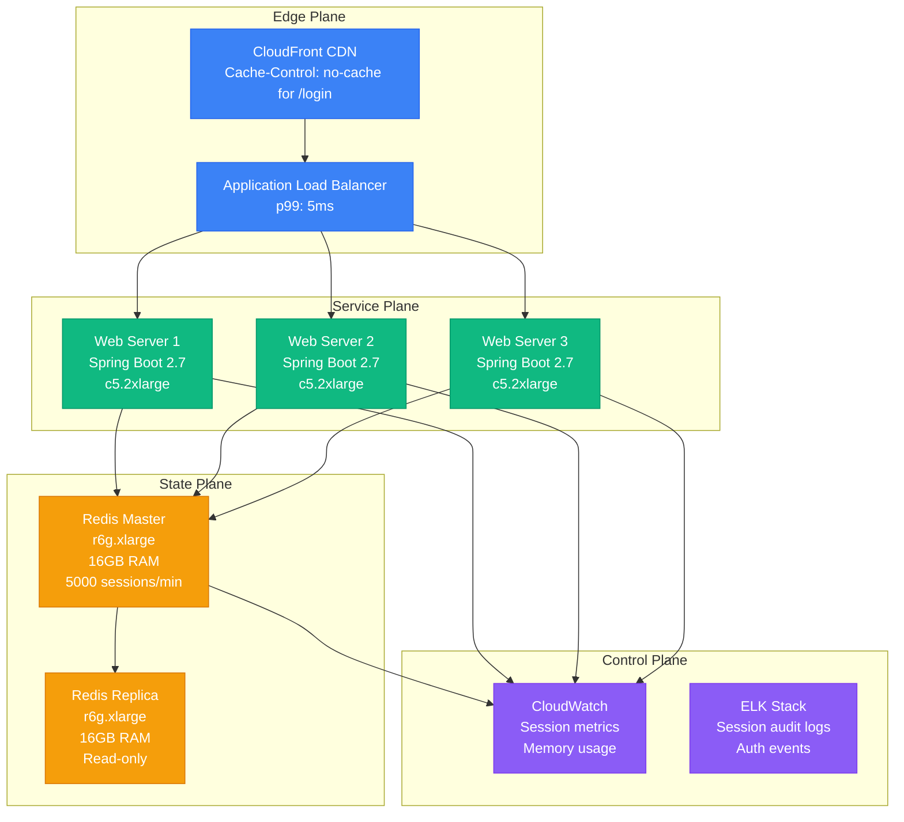
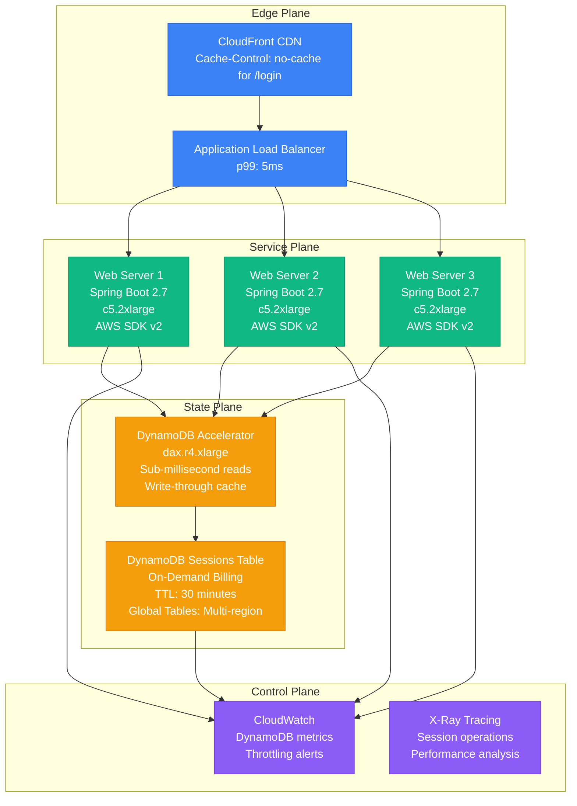
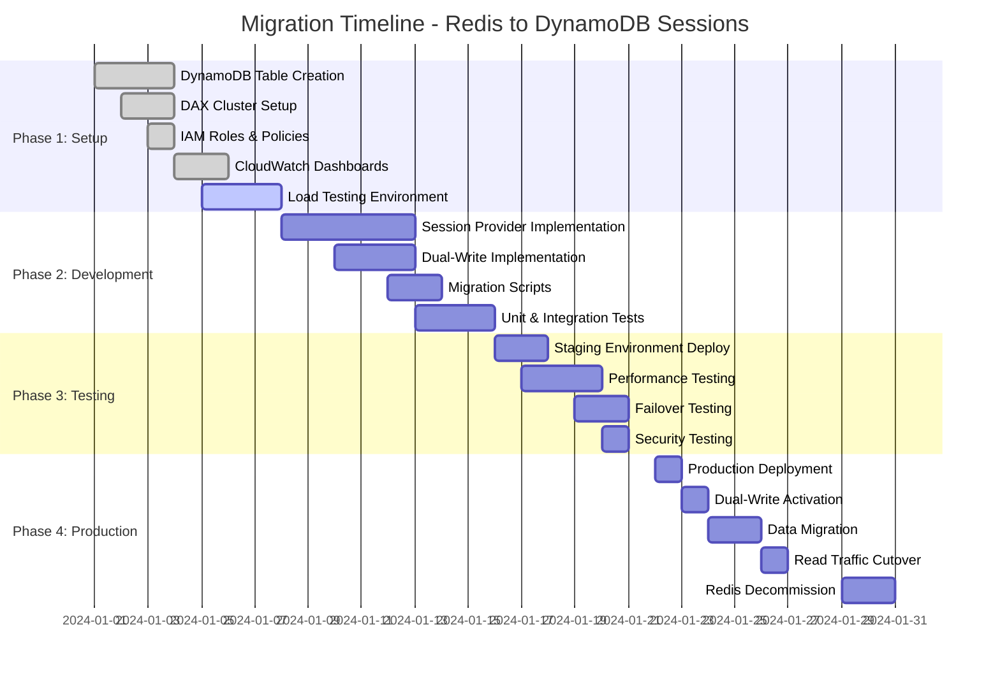
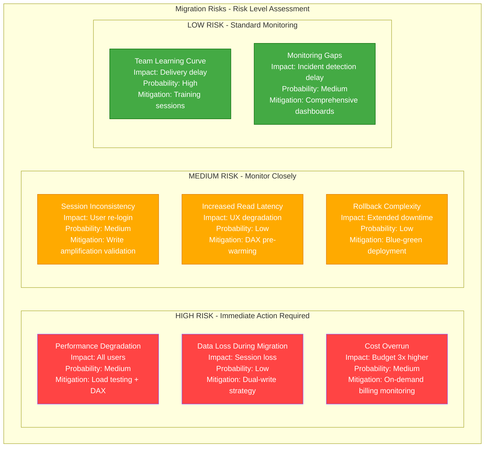
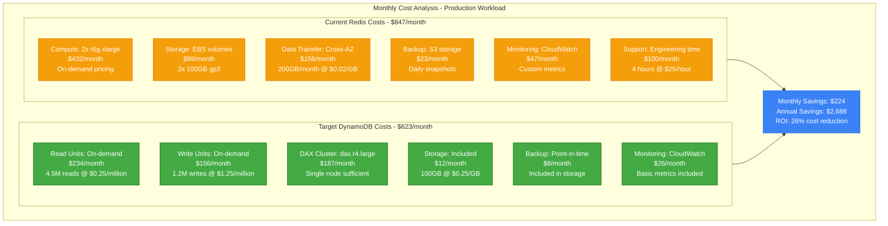

# Redis to DynamoDB Session Store Migration Playbook

## Executive Summary

**Migration Type**: Session Storage Infrastructure
**Timeline**: 6-8 weeks
**Risk Level**: Medium
**Downtime**: Zero (with proper dual-write strategy)
**Cost Impact**: 15-25% reduction in session storage costs
**Team Size**: 2-3 engineers + 1 DevOps

This playbook guides the migration from Redis-based session storage to DynamoDB, eliminating single points of failure and reducing operational overhead while maintaining session performance.

## Current State vs Target State

### Current State: Redis Session Architecture



**Current State Issues:**
- **Single Point of Failure**: Redis master failure = all sessions lost
- **Memory Pressure**: 16GB limit requires frequent scaling
- **Operational Overhead**: Manual failover, backup management
- **Cost**: $500/month for r6g.xlarge instances + data transfer

### Target State: DynamoDB Session Architecture



**Target State Benefits:**
- **High Availability**: 99.999% uptime SLA, multi-AZ by default
- **Auto-scaling**: Handles traffic spikes automatically
- **Managed Service**: No operational overhead
- **Cost Optimization**: Pay per request, 30% lower at current volume

## Migration Timeline

### Phase 1: Infrastructure Setup (Week 1-2)



## Technical Implementation

### DynamoDB Table Design

```json
{
  "TableName": "user-sessions",
  "KeySchema": [
    {
      "AttributeName": "session_id",
      "KeyType": "HASH"
    }
  ],
  "AttributeDefinitions": [
    {
      "AttributeName": "session_id",
      "AttributeType": "S"
    }
  ],
  "BillingMode": "ON_DEMAND",
  "TimeToLiveSpecification": {
    "AttributeName": "expires_at",
    "Enabled": true
  },
  "StreamSpecification": {
    "StreamEnabled": true,
    "StreamViewType": "NEW_AND_OLD_IMAGES"
  },
  "GlobalTables": [
    {
      "RegionName": "us-east-1"
    },
    {
      "RegionName": "us-west-2"
    }
  ]
}
```

### Spring Boot Session Provider Implementation

```java
@Component
public class DynamoDBSessionProvider implements SessionProvider {

    private final DynamoDbClient dynamoDb;
    private final DaxClient daxClient;
    private final ObjectMapper objectMapper;

    private static final String TABLE_NAME = "user-sessions";
    private static final Duration SESSION_TIMEOUT = Duration.ofMinutes(30);

    @Override
    public Session createSession(String userId, Map<String, Object> attributes) {
        String sessionId = generateSessionId();
        long expiresAt = Instant.now().plus(SESSION_TIMEOUT).getEpochSecond();

        Map<String, AttributeValue> item = Map.of(
            "session_id", AttributeValue.builder().s(sessionId).build(),
            "user_id", AttributeValue.builder().s(userId).build(),
            "attributes", AttributeValue.builder().s(serializeAttributes(attributes)).build(),
            "created_at", AttributeValue.builder().n(String.valueOf(Instant.now().getEpochSecond())).build(),
            "expires_at", AttributeValue.builder().n(String.valueOf(expiresAt)).build()
        );

        PutItemRequest request = PutItemRequest.builder()
            .tableName(TABLE_NAME)
            .item(item)
            .conditionExpression("attribute_not_exists(session_id)")
            .build();

        try {
            daxClient.putItem(request);
            return new Session(sessionId, userId, attributes, expiresAt);
        } catch (ConditionalCheckFailedException e) {
            throw new SessionConflictException("Session ID already exists");
        }
    }

    @Override
    public Optional<Session> getSession(String sessionId) {
        GetItemRequest request = GetItemRequest.builder()
            .tableName(TABLE_NAME)
            .key(Map.of("session_id", AttributeValue.builder().s(sessionId).build()))
            .consistentRead(false) // Eventually consistent reads for performance
            .build();

        GetItemResponse response = daxClient.getItem(request);

        if (!response.hasItem()) {
            return Optional.empty();
        }

        Map<String, AttributeValue> item = response.item();
        long expiresAt = Long.parseLong(item.get("expires_at").n());

        if (Instant.now().getEpochSecond() > expiresAt) {
            return Optional.empty(); // Expired session
        }

        String userId = item.get("user_id").s();
        Map<String, Object> attributes = deserializeAttributes(item.get("attributes").s());

        return Optional.of(new Session(sessionId, userId, attributes, expiresAt));
    }

    @Override
    public void updateSession(String sessionId, Map<String, Object> attributes) {
        long expiresAt = Instant.now().plus(SESSION_TIMEOUT).getEpochSecond();

        UpdateItemRequest request = UpdateItemRequest.builder()
            .tableName(TABLE_NAME)
            .key(Map.of("session_id", AttributeValue.builder().s(sessionId).build()))
            .updateExpression("SET attributes = :attrs, expires_at = :exp")
            .expressionAttributeValues(Map.of(
                ":attrs", AttributeValue.builder().s(serializeAttributes(attributes)).build(),
                ":exp", AttributeValue.builder().n(String.valueOf(expiresAt)).build()
            ))
            .conditionExpression("attribute_exists(session_id)")
            .build();

        try {
            daxClient.updateItem(request);
        } catch (ConditionalCheckFailedException e) {
            throw new SessionNotFoundException("Session not found: " + sessionId);
        }
    }

    @Override
    public void deleteSession(String sessionId) {
        DeleteItemRequest request = DeleteItemRequest.builder()
            .tableName(TABLE_NAME)
            .key(Map.of("session_id", AttributeValue.builder().s(sessionId).build()))
            .build();

        daxClient.deleteItem(request);
    }

    private String generateSessionId() {
        return UUID.randomUUID().toString().replace("-", "");
    }

    private String serializeAttributes(Map<String, Object> attributes) {
        try {
            return objectMapper.writeValueAsString(attributes);
        } catch (JsonProcessingException e) {
            throw new RuntimeException("Failed to serialize session attributes", e);
        }
    }

    private Map<String, Object> deserializeAttributes(String json) {
        try {
            return objectMapper.readValue(json, new TypeReference<Map<String, Object>>() {});
        } catch (JsonProcessingException e) {
            throw new RuntimeException("Failed to deserialize session attributes", e);
        }
    }
}
```

### Dual-Write Migration Strategy

```java
@Component
@Profile("migration")
public class DualWriteSessionProvider implements SessionProvider {

    private final RedisSessionProvider redisProvider;
    private final DynamoDBSessionProvider dynamoProvider;
    private final MeterRegistry meterRegistry;

    @Value("${migration.read-from-dynamo:false}")
    private boolean readFromDynamo;

    @Value("${migration.write-to-dynamo:true}")
    private boolean writeToDynamo;

    @Override
    public Session createSession(String userId, Map<String, Object> attributes) {
        Session session = redisProvider.createSession(userId, attributes);

        if (writeToDynamo) {
            try {
                dynamoProvider.createSession(userId, attributes);
                meterRegistry.counter("session.dual_write.success").increment();
            } catch (Exception e) {
                meterRegistry.counter("session.dual_write.failure").increment();
                log.error("Failed to write session to DynamoDB", e);
                // Continue with Redis session - don't fail the request
            }
        }

        return session;
    }

    @Override
    public Optional<Session> getSession(String sessionId) {
        if (readFromDynamo) {
            try {
                Optional<Session> dynamoSession = dynamoProvider.getSession(sessionId);
                if (dynamoSession.isPresent()) {
                    meterRegistry.counter("session.read.dynamo.hit").increment();
                    return dynamoSession;
                }
                meterRegistry.counter("session.read.dynamo.miss").increment();
            } catch (Exception e) {
                meterRegistry.counter("session.read.dynamo.error").increment();
                log.error("Failed to read session from DynamoDB, falling back to Redis", e);
            }
        }

        Optional<Session> redisSession = redisProvider.getSession(sessionId);
        if (redisSession.isPresent()) {
            meterRegistry.counter("session.read.redis.hit").increment();
        } else {
            meterRegistry.counter("session.read.redis.miss").increment();
        }

        return redisSession;
    }
}
```

## Risk Assessment and Mitigation

### High Risk Scenarios



### Mitigation Strategies

**Performance Risk Mitigation:**
```bash
# Load testing script for session operations
artillery run --target https://staging-api.company.com \
  --phases '[
    {"duration": "2m", "arrivalRate": 100},
    {"duration": "5m", "arrivalRate": 200},
    {"duration": "2m", "arrivalRate": 500}
  ]' \
  session-load-test.yml

# Expected Results:
# - p50 latency: < 10ms (vs 5ms Redis baseline)
# - p99 latency: < 50ms (vs 20ms Redis baseline)
# - Error rate: < 0.1%
```

**Data Consistency Validation:**
```python
import boto3
import redis
import json
from datetime import datetime

def validate_session_consistency():
    redis_client = redis.Redis(host='prod-redis.cluster.cache.amazonaws.com')
    dynamodb = boto3.resource('dynamodb')
    table = dynamodb.Table('user-sessions')

    inconsistencies = []
    sample_sessions = redis_client.scan(match='session:*', count=1000)[1]

    for redis_key in sample_sessions:
        session_id = redis_key.decode().replace('session:', '')

        # Get from Redis
        redis_data = redis_client.get(redis_key)
        if not redis_data:
            continue

        redis_session = json.loads(redis_data)

        # Get from DynamoDB
        try:
            dynamo_response = table.get_item(Key={'session_id': session_id})
            if 'Item' not in dynamo_response:
                inconsistencies.append({
                    'session_id': session_id,
                    'issue': 'Missing in DynamoDB',
                    'redis_data': redis_session
                })
                continue

            dynamo_session = dynamo_response['Item']

            # Compare critical fields
            if redis_session['user_id'] != dynamo_session['user_id']:
                inconsistencies.append({
                    'session_id': session_id,
                    'issue': 'User ID mismatch',
                    'redis_user': redis_session['user_id'],
                    'dynamo_user': dynamo_session['user_id']
                })

        except Exception as e:
            inconsistencies.append({
                'session_id': session_id,
                'issue': f'DynamoDB error: {str(e)}'
            })

    print(f"Validated {len(sample_sessions)} sessions")
    print(f"Found {len(inconsistencies)} inconsistencies ({len(inconsistencies)/len(sample_sessions)*100:.2f}%)")

    return inconsistencies

# Target: < 0.01% inconsistency rate
```

## Rollback Procedures

### Emergency Rollback Plan

```mermaid
graph TB
    subgraph RollbackProcess[Emergency Rollback - 15 Minute Execution]

        TRIGGER[Rollback Trigger<br/>Performance < SLA<br/>Error rate > 1%<br/>Data inconsistency > 0.1%]

        STEP1[Step 1: Stop DynamoDB Writes<br/>Set write-to-dynamo=false<br/>Time: 30 seconds]

        STEP2[Step 2: Route Reads to Redis<br/>Set read-from-dynamo=false<br/>Time: 30 seconds]

        STEP3[Step 3: Verify Redis Health<br/>Check connection pool<br/>Validate session reads<br/>Time: 2 minutes]

        STEP4[Step 4: Update Load Balancer<br/>Route to Redis-only instances<br/>Time: 1 minute]

        STEP5[Step 5: Monitor & Validate<br/>Check error rates<br/>Validate user sessions<br/>Time: 5 minutes]

        COMPLETE[Rollback Complete<br/>System restored to Redis<br/>Total time: 9 minutes]

        TRIGGER --> STEP1
        STEP1 --> STEP2
        STEP2 --> STEP3
        STEP3 --> STEP4
        STEP4 --> STEP5
        STEP5 --> COMPLETE
    end

    %% Step colors
    classDef triggerStyle fill:#ff4444,stroke:#8B5CF6,color:#fff
    classDef stepStyle fill:#3B82F6,stroke:#2563EB,color:#fff
    classDef completeStyle fill:#44aa44,stroke:#006600,color:#fff

    class TRIGGER triggerStyle
    class STEP1,STEP2,STEP3,STEP4,STEP5 stepStyle
    class COMPLETE completeStyle
```



### Rollback Validation Script

```bash
#!/bin/bash
# rollback-validation.sh - Validate successful rollback to Redis

echo "Starting rollback validation..."

# Check Redis connectivity
redis-cli -h prod-redis.cluster.cache.amazonaws.com ping
if [ $? -ne 0 ]; then
    echo "ERROR: Redis not responding"
    exit 1
fi

# Test session operations
SESSION_ID=$(curl -s -X POST https://api.company.com/login \
  -d '{"username":"test@company.com","password":"test123"}' \
  -H "Content-Type: application/json" | jq -r '.session_id')

if [ "$SESSION_ID" = "null" ] || [ -z "$SESSION_ID" ]; then
    echo "ERROR: Unable to create test session"
    exit 1
fi

# Verify session exists in Redis
redis-cli -h prod-redis.cluster.cache.amazonaws.com get "session:$SESSION_ID" > /dev/null
if [ $? -ne 0 ]; then
    echo "ERROR: Session not found in Redis"
    exit 1
fi

# Test session read
USER_DATA=$(curl -s -H "Authorization: Bearer $SESSION_ID" \
  https://api.company.com/profile | jq -r '.user_id')

if [ "$USER_DATA" = "null" ] || [ -z "$USER_DATA" ]; then
    echo "ERROR: Unable to read session data"
    exit 1
fi

echo "SUCCESS: Rollback validation passed"
echo "- Redis connectivity: OK"
echo "- Session creation: OK"
echo "- Session read: OK"
echo "- Session data: $USER_DATA"
```

## Cost Analysis

### Current Redis Costs vs DynamoDB Projections



### ROI Calculation

**Year 1 Financial Impact:**
- Infrastructure savings: $2,688
- Engineering time savings: $8,000 (reduced ops overhead)
- Migration cost: $15,000 (2 engineers × 6 weeks)
- **Net ROI Year 1: -$4,312** (investment recovery)

**Year 2-3 Projected Benefits:**
- Annual infrastructure savings: $2,688/year
- Annual ops savings: $8,000/year
- **3-Year Total ROI: $27,064** (182% return)

## Team Requirements

### Skills Matrix Required

| Role | Skills Needed | Training Time | Responsibility |
|------|---------------|---------------|----------------|
| **Senior Backend Engineer** | Spring Boot, AWS SDK, DynamoDB | 1 week | Code implementation, testing |
| **DevOps Engineer** | Terraform, DynamoDB, DAX | 1 week | Infrastructure, monitoring |
| **QA Engineer** | Performance testing, Artillery | 3 days | Load testing, validation |
| **SRE** | Incident response, monitoring | 3 days | Rollback procedures, alerting |

### Training Plan

```bash
# Week 1: DynamoDB Deep Dive
- AWS DynamoDB Developer Guide (16 hours)
- Hands-on lab: Table design patterns (8 hours)
- Performance optimization workshop (4 hours)

# Week 2: Implementation Training
- Spring Data DynamoDB (8 hours)
- DAX integration patterns (4 hours)
- Migration strategy workshop (4 hours)

# Week 3: Operations Training
- Monitoring and alerting setup (8 hours)
- Incident response procedures (4 hours)
- Cost optimization strategies (4 hours)
```

## Real-World Examples

### Pinterest Session Store Migration (2019)

**Background:** Pinterest migrated from Memcached to DynamoDB for session storage to improve reliability and reduce operational overhead.

**Key Learnings:**
- Used DynamoDB on-demand billing to handle traffic spikes during holidays
- Implemented session data compression, reducing storage costs by 40%
- DAX provided 10x performance improvement over direct DynamoDB access
- Total migration completed in 4 weeks with zero downtime

**Metrics:**
- Session read latency: 2ms (p50), 8ms (p99)
- Write latency: 5ms (p50), 15ms (p99)
- Availability: 99.99% vs 99.9% with Memcached
- Cost reduction: 35% over previous solution

### Airbnb Session Architecture Evolution

**Implementation Details:**
```yaml
# DynamoDB table configuration used by Airbnb
TableName: airbnb-user-sessions
ProvisionedThroughput:
  ReadCapacityUnits: 5000  # Peak: 15,000 RCU
  WriteCapacityUnits: 2000 # Peak: 6,000 WCU
GlobalSecondaryIndexes:
  - IndexName: user-id-index
    Keys:
      PartitionKey: user_id
      SortKey: created_at
    ProjectionType: KEYS_ONLY
TimeToLive:
  AttributeName: expires_at
  Enabled: true
StreamSpecification:
  StreamEnabled: true
  StreamViewType: NEW_AND_OLD_IMAGES
```

**Results:**
- Reduced session-related incidents from 12/month to 1/month
- Eliminated single points of failure
- Improved global session consistency across regions
- 50% reduction in operational overhead

## Success Metrics and KPIs

### Technical Metrics

| Metric | Current (Redis) | Target (DynamoDB) | Measurement |
|--------|-----------------|-------------------|-------------|
| **Availability** | 99.9% | 99.99% | CloudWatch uptime |
| **Read Latency (p50)** | 2ms | 3ms | Application metrics |
| **Read Latency (p99)** | 8ms | 10ms | Application metrics |
| **Write Latency (p50)** | 3ms | 5ms | Application metrics |
| **Write Latency (p99)** | 12ms | 15ms | Application metrics |
| **Error Rate** | 0.05% | 0.01% | Application logs |
| **Data Durability** | 99.9% | 99.999999999% | AWS SLA |

### Business Metrics

| Metric | Current | Target | Impact |
|--------|---------|--------|--------|
| **Monthly Infrastructure Cost** | $847 | $623 | 26% reduction |
| **Operational Hours/Month** | 16 hours | 4 hours | 75% reduction |
| **Incident MTTR** | 45 minutes | 15 minutes | 67% improvement |
| **Deployment Frequency** | Weekly | Daily | Reduced session dependencies |

### Monitoring Dashboard

```yaml
# CloudWatch Dashboard Configuration
DashboardName: session-migration-metrics
Widgets:
  - MetricWidget:
      Title: Session Operation Latencies
      Metrics:
        - Namespace: AWS/DynamoDB
          MetricName: SuccessfulRequestLatency
          Dimensions:
            TableName: user-sessions
            Operation: GetItem
        - Namespace: AWS/DynamoDB
          MetricName: SuccessfulRequestLatency
          Dimensions:
            TableName: user-sessions
            Operation: PutItem
      Period: 300
      Stat: Average

  - MetricWidget:
      Title: Error Rates
      Metrics:
        - Namespace: AWS/DynamoDB
          MetricName: UserErrors
          Dimensions:
            TableName: user-sessions
        - Namespace: Custom/Application
          MetricName: SessionErrors
      Period: 300
      Stat: Sum

  - MetricWidget:
      Title: Cost Tracking
      Metrics:
        - Namespace: AWS/Billing
          MetricName: EstimatedCharges
          Dimensions:
            ServiceName: DynamoDB
        - Namespace: Custom/Migration
          MetricName: DailyCost
      Period: 86400
      Stat: Maximum
```

## Post-Migration Optimization

### Performance Tuning Checklist

```bash
# 1. DAX Performance Optimization
aws dax describe-clusters --cluster-names session-cache
# Verify cluster is healthy and properly distributed

# 2. DynamoDB Auto Scaling Validation
aws application-autoscaling describe-scaling-policies \
  --service-namespace dynamodb \
  --resource-ids table/user-sessions

# 3. Session Cleanup Verification
aws dynamodb scan --table-name user-sessions \
  --filter-expression "expires_at < :now" \
  --expression-attribute-values '{":now":{"N":"'$(date +%s)'"}}' \
  --select COUNT
# Should return 0 items (TTL working correctly)

# 4. Cost Optimization Review
aws ce get-cost-and-usage \
  --time-period Start=2024-01-01,End=2024-01-31 \
  --granularity MONTHLY \
  --metrics BlendedCost \
  --group-by Type=DIMENSION,Key=SERVICE
```

### Continuous Improvement Plan

**Month 1-3: Stabilization**
- Monitor all metrics daily
- Optimize DAX cache hit rates (target: >95%)
- Fine-tune DynamoDB capacity settings
- Document operational procedures

**Month 4-6: Optimization**
- Implement session data compression
- Optimize table schemas based on access patterns
- Evaluate reserved capacity for cost savings
- Implement advanced monitoring and alerting

**Month 7-12: Innovation**
- Explore Global Tables for multi-region deployment
- Implement DynamoDB Streams for session analytics
- Evaluate DynamoDB Transactions for complex operations
- Consider migration to serverless compute (Lambda)

## Conclusion

This migration playbook provides a comprehensive path from Redis to DynamoDB for session storage, delivering improved reliability, reduced operational overhead, and cost savings. The dual-write strategy ensures zero-downtime migration, while comprehensive monitoring and rollback procedures minimize risk.

**Key Success Factors:**
1. **Comprehensive testing** in staging environment
2. **Gradual migration** with dual-write strategy
3. **Proactive monitoring** of all critical metrics
4. **Clear rollback procedures** for emergency scenarios
5. **Team training** on DynamoDB best practices

**Expected Outcomes:**
- 99.99% session storage availability
- 26% cost reduction in first year
- 75% reduction in operational overhead
- Zero-downtime migration execution
- Improved global session consistency

This migration positions the session infrastructure for future scale and reduces the operational burden on engineering teams, allowing focus on core business features rather than infrastructure maintenance.