# Service Mesh Adoption: From Service-to-Service Chaos to Istio-Powered Observability

## Executive Summary

Service mesh adoption represents one of the most transformative infrastructure changes in modern microservices architectures. This playbook documents real-world implementations from companies like Airbnb, Shopify, and enterprise organizations that successfully deployed Istio service mesh to solve networking, security, and observability challenges at scale.

**Migration Scale**: 1,000+ microservices, 10,000+ service instances, multi-cluster deployment
**Timeline**: 12-18 months for complete rollout across all services
**Complexity Reduction**: 90% elimination of service-to-service networking code
**Observability Improvement**: 100% service communication visibility with zero application changes

## The Service Mesh Problem Statement

### Before: Service-to-Service Networking Chaos

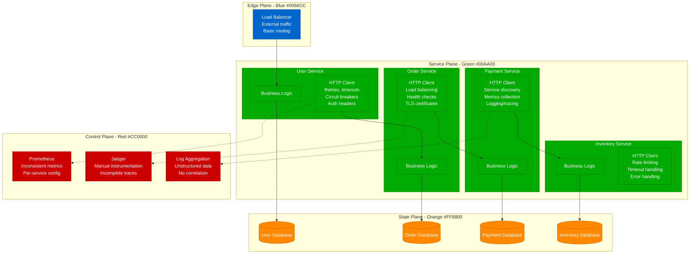

**Problems with Traditional Microservices Networking**:
- **Code Duplication**: Each service implements HTTP clients, retries, circuit breakers
- **Inconsistent Policies**: Security, retry, and timeout policies vary by team
- **Operational Complexity**: 50+ libraries and frameworks for networking concerns
- **Limited Observability**: Inconsistent metrics, incomplete tracing, fragmented logs
- **Security Gaps**: Ad-hoc mTLS, inconsistent authorization policies

### After: Istio Service Mesh Architecture

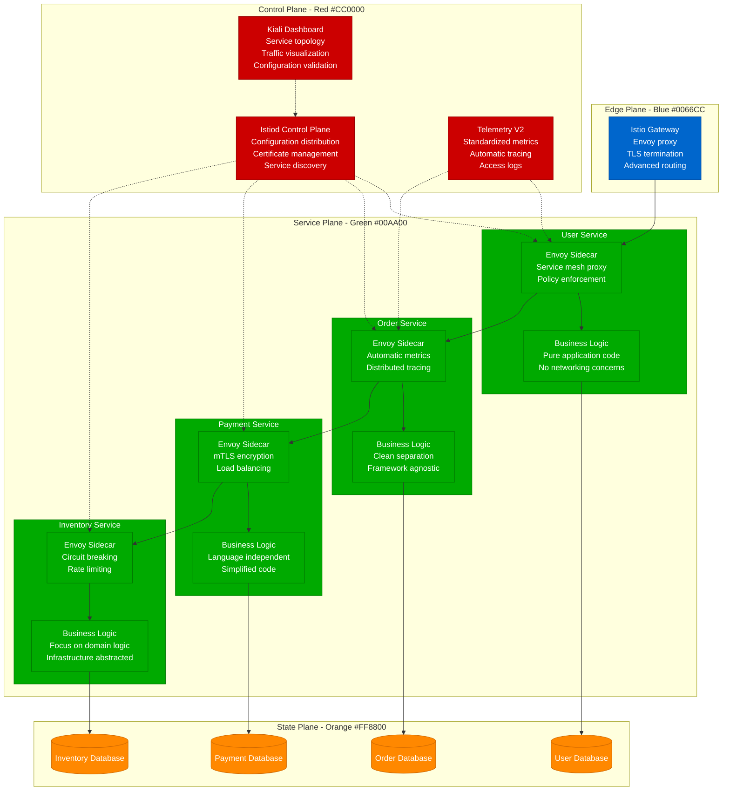

**Istio Service Mesh Benefits**:
- **Code Simplification**: Applications focus on business logic only
- **Consistent Policies**: Uniform security, traffic, and observability policies
- **Zero-Config Observability**: Automatic metrics, tracing, and logging
- **Security by Default**: Mutual TLS, identity-based authorization
- **Traffic Management**: Advanced routing, retries, circuit breaking

## Istio Architecture Deep Dive

### Control Plane Components

```mermaid
graph TB
    subgraph IstiodControlPlane[Istiod Control Plane]
        PILOT[Pilot<br/>Service discovery<br/>Traffic management<br/>Configuration distribution]

        CITADEL[Citadel<br/>Certificate authority<br/>Identity management<br/>mTLS automation]

        GALLEY[Galley<br/>Configuration validation<br/>Configuration processing<br/>CRD management]
    end

    subgraph DataPlane[Data Plane - Envoy Proxies]
        ENVOY1[Envoy Sidecar 1<br/>Service A proxy<br/>L7 load balancing]
        ENVOY2[Envoy Sidecar 2<br/>Service B proxy<br/>Circuit breaking]
        ENVOY3[Envoy Sidecar 3<br/>Service C proxy<br/>Rate limiting]
        ENVOY4[Envoy Sidecar 4<br/>Service D proxy<br/>Fault injection]
    end

    subgraph TelemetryCollection[Telemetry Collection]
        MIXER[Mixer (Legacy)<br/>Policy enforcement<br/>Telemetry collection]
        TELEMETRY_V2[Telemetry v2<br/>In-proxy collection<br/>High performance]
    end

    %% Control plane to data plane communication
    PILOT -.-> ENVOY1
    PILOT -.-> ENVOY2
    PILOT -.-> ENVOY3
    PILOT -.-> ENVOY4

    CITADEL -.-> ENVOY1
    CITADEL -.-> ENVOY2
    CITADEL -.-> ENVOY3
    CITADEL -.-> ENVOY4

    %% Telemetry flow
    ENVOY1 --> TELEMETRY_V2
    ENVOY2 --> TELEMETRY_V2
    ENVOY3 --> TELEMETRY_V2
    ENVOY4 --> TELEMETRY_V2

    classDef controlStyle fill:#e3f2fd,stroke:#1976d2
    classDef dataStyle fill:#e8f5e8,stroke:#2e7d32
    classDef telemetryStyle fill:#fff3e0,stroke:#ef6c00

    class PILOT,CITADEL,GALLEY controlStyle
    class ENVOY1,ENVOY2,ENVOY3,ENVOY4 dataStyle
    class MIXER,TELEMETRY_V2 telemetryStyle
```

### Envoy Proxy Configuration

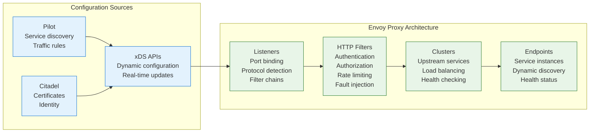

## Migration Strategy and Timeline

### Phased Rollout Approach

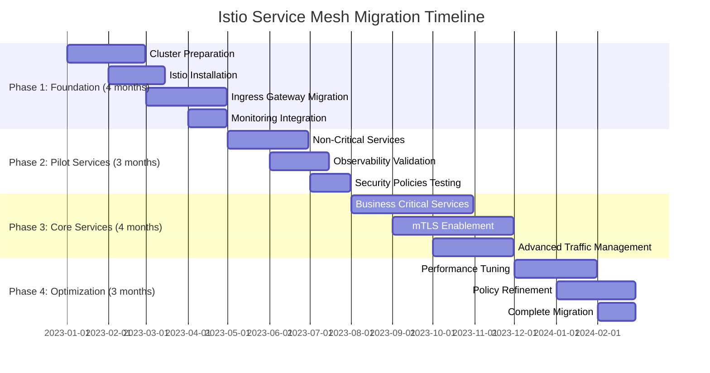

### Service Migration Patterns

#### Pattern 1: Sidecar Injection Strategy

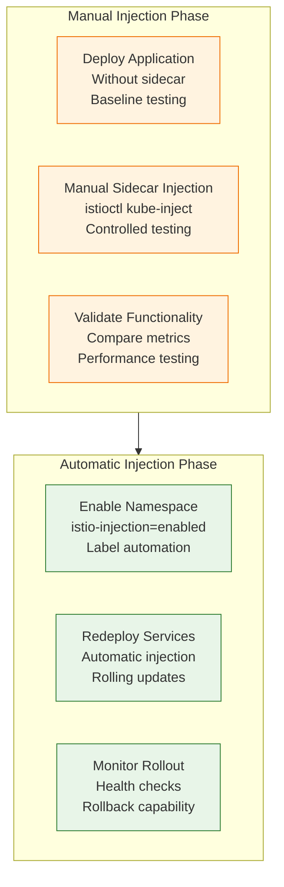

#### Pattern 2: Traffic Shifting for Canary Deployment

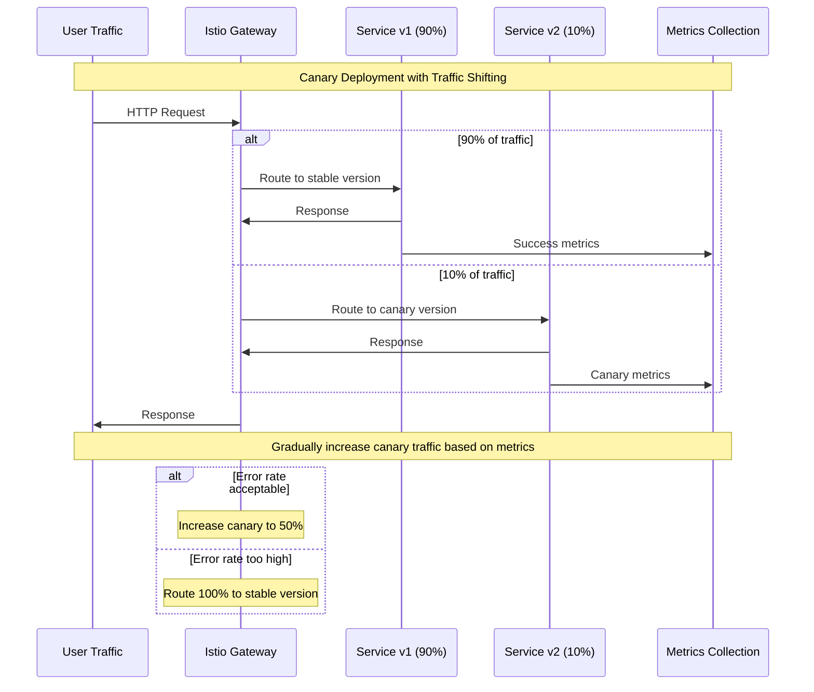

**Istio VirtualService for Canary Deployment**:
```yaml
apiVersion: networking.istio.io/v1beta1
kind: VirtualService
metadata:
  name: user-service-canary
spec:
  hosts:
  - user-service
  http:
  - match:
    - headers:
        canary:
          exact: "true"
    route:
    - destination:
        host: user-service
        subset: v2
  - route:
    - destination:
        host: user-service
        subset: v1
      weight: 90
    - destination:
        host: user-service
        subset: v2
      weight: 10
---
apiVersion: networking.istio.io/v1beta1
kind: DestinationRule
metadata:
  name: user-service-destination
spec:
  host: user-service
  subsets:
  - name: v1
    labels:
      version: v1
  - name: v2
    labels:
      version: v2
```

## Security Implementation

### Mutual TLS (mTLS) Progressive Rollout

```mermaid
graph TB
    subgraph Phase1[Phase 1: Permissive Mode]
        PERM[PeerAuthentication<br/>mode: PERMISSIVE<br/>Allow plaintext + mTLS]
        APP1[Application A<br/>Accepts both<br/>No changes required]
        APP2[Application B<br/>Gradual migration<br/>Mixed environment]
    end

    subgraph Phase2[Phase 2: Strict Mode]
        STRICT[PeerAuthentication<br/>mode: STRICT<br/>Require mTLS only]
        APP1_MTLS[Application A<br/>mTLS enforced<br/>Automatic certificates]
        APP2_MTLS[Application B<br/>mTLS enforced<br/>Zero-downtime transition]
    end

    subgraph CertManagement[Certificate Management]
        CITADEL_CA[Citadel CA<br/>Root certificate<br/>Automatic rotation]
        WORKLOAD_CERT[Workload Certificates<br/>Short-lived (24h)<br/>Automatic renewal]
        TRUST_DOMAIN[Trust Domain<br/>cluster.local<br/>Identity namespace]
    end

    Phase1 --> Phase2
    CITADEL_CA --> WORKLOAD_CERT
    WORKLOAD_CERT --> APP1_MTLS
    WORKLOAD_CERT --> APP2_MTLS

    classDef permissiveStyle fill:#fff3e0,stroke:#ef6c00
    classDef strictStyle fill:#e8f5e8,stroke:#2e7d32
    classDef certStyle fill:#e3f2fd,stroke:#1976d2

    class PERM,APP1,APP2 permissiveStyle
    class STRICT,APP1_MTLS,APP2_MTLS strictStyle
    class CITADEL_CA,WORKLOAD_CERT,TRUST_DOMAIN certStyle
```

### Authorization Policies

```yaml
# Deny-all default policy
apiVersion: security.istio.io/v1beta1
kind: AuthorizationPolicy
metadata:
  name: deny-all
  namespace: production
spec: {}  # Empty spec denies all requests

---
# Allow specific service communication
apiVersion: security.istio.io/v1beta1
kind: AuthorizationPolicy
metadata:
  name: user-service-access
  namespace: production
spec:
  selector:
    matchLabels:
      app: user-service
  rules:
  - from:
    - source:
        principals: ["cluster.local/ns/production/sa/api-gateway"]
    - source:
        principals: ["cluster.local/ns/production/sa/order-service"]
  - to:
    - operation:
        methods: ["GET", "POST"]
        paths: ["/users/*", "/profile/*"]

---
# JWT validation for external traffic
apiVersion: security.istio.io/v1beta1
kind: RequestAuthentication
metadata:
  name: jwt-validation
  namespace: production
spec:
  selector:
    matchLabels:
      app: api-gateway
  jwtRules:
  - issuer: "https://auth.company.com"
    jwksUri: "https://auth.company.com/.well-known/jwks.json"
    audiences: ["api.company.com"]
```

## Traffic Management Capabilities

### Advanced Routing Strategies

#### 1. Header-Based Routing

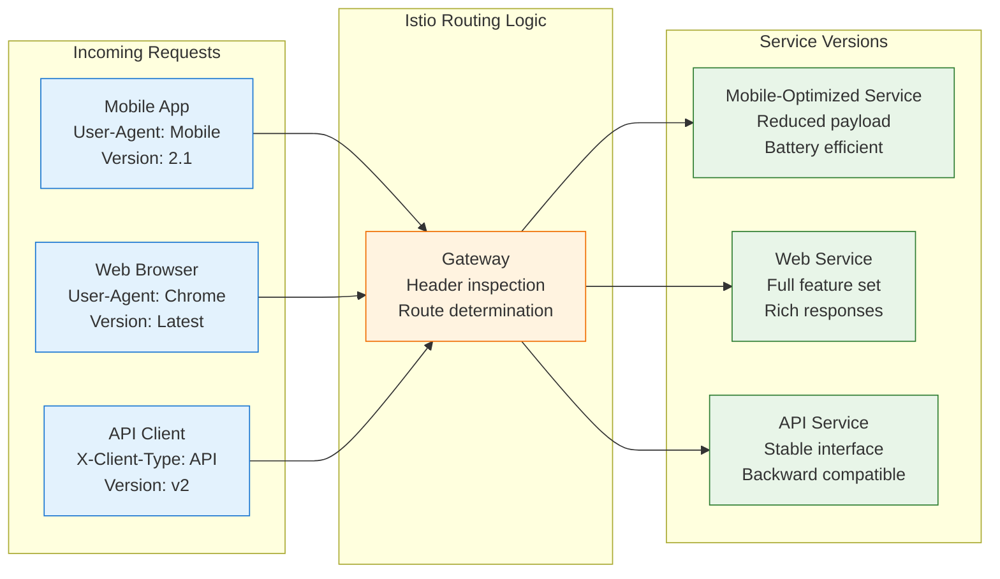

#### 2. Circuit Breaking and Outlier Detection

```yaml
apiVersion: networking.istio.io/v1beta1
kind: DestinationRule
metadata:
  name: payment-service-circuit-breaker
spec:
  host: payment-service
  trafficPolicy:
    connectionPool:
      tcp:
        maxConnections: 100
      http:
        http1MaxPendingRequests: 50
        http2MaxRequests: 200
        maxRequestsPerConnection: 10
        maxRetries: 3
        consecutiveGatewayErrors: 5
        interval: 30s
        baseEjectionTime: 30s
        maxEjectionPercent: 50
    outlierDetection:
      consecutiveGatewayErrors: 3
      interval: 30s
      baseEjectionTime: 30s
      maxEjectionPercent: 20
      minHealthPercent: 70
```

#### 3. Fault Injection for Chaos Engineering

```yaml
apiVersion: networking.istio.io/v1beta1
kind: VirtualService
metadata:
  name: chaos-testing
spec:
  hosts:
  - order-service
  http:
  - match:
    - headers:
        chaos-test:
          exact: "delay"
    fault:
      delay:
        percentage:
          value: 10.0
        fixedDelay: 2s
    route:
    - destination:
        host: order-service
  - match:
    - headers:
        chaos-test:
          exact: "abort"
    fault:
      abort:
        percentage:
          value: 5.0
        httpStatus: 503
    route:
    - destination:
        host: order-service
  - route:
    - destination:
        host: order-service
```

## Observability and Monitoring

### Three Pillars of Observability

#### 1. Metrics with Prometheus Integration

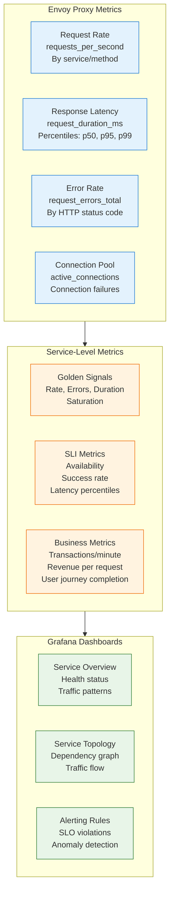

#### 2. Distributed Tracing with Jaeger

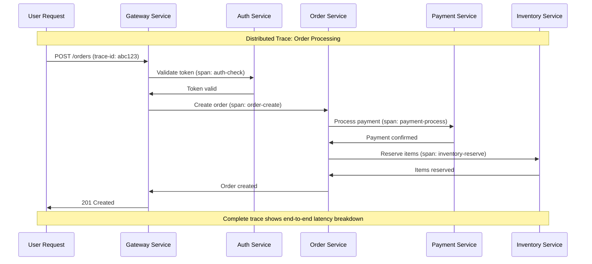

**Trace Context Propagation**:
```yaml
# Envoy automatic trace propagation
apiVersion: install.istio.io/v1alpha1
kind: IstioOperator
metadata:
  name: istio-control-plane
spec:
  values:
    pilot:
      env:
        EXTERNAL_ISTIOD: false
    telemetry:
      v2:
        enabled: true
    meshConfig:
      defaultConfig:
        tracing:
          sampling: 1.0  # 100% sampling for testing
          custom_tags:
            user_id:
              header:
                name: "x-user-id"
            request_id:
              header:
                name: "x-request-id"
```

#### 3. Access Logs and Audit Trail

```yaml
apiVersion: telemetry.istio.io/v1alpha1
kind: Telemetry
metadata:
  name: access-logging
  namespace: production
spec:
  accessLogging:
  - providers:
    - name: otel
  - providers:
    - name: default
  - providers:
    - name: file
      service: order-service.production.svc.cluster.local
  # Custom log format
  extensionProviders:
  - name: file
    file:
      path: /var/log/access.log
      format: |
        {
          "timestamp": "%START_TIME%",
          "method": "%REQ(:METHOD)%",
          "path": "%REQ(X-ENVOY-ORIGINAL-PATH?:PATH)%",
          "protocol": "%PROTOCOL%",
          "response_code": "%RESPONSE_CODE%",
          "response_flags": "%RESPONSE_FLAGS%",
          "bytes_received": "%BYTES_RECEIVED%",
          "bytes_sent": "%BYTES_SENT%",
          "duration": "%DURATION%",
          "upstream_service_time": "%RESP(X-ENVOY-UPSTREAM-SERVICE-TIME)%",
          "x_forwarded_for": "%REQ(X-FORWARDED-FOR)%",
          "user_agent": "%REQ(USER-AGENT)%",
          "request_id": "%REQ(X-REQUEST-ID)%",
          "authority": "%REQ(:AUTHORITY)%",
          "upstream_host": "%UPSTREAM_HOST%"
        }
```

## Performance Impact and Optimization

### Latency Analysis

| Metric | Without Istio | With Istio | Overhead | Optimization |
|--------|--------------|------------|----------|--------------|
| **P50 Latency** | 45ms | 47ms | +2ms (4%) | Acceptable |
| **P95 Latency** | 120ms | 125ms | +5ms (4%) | Within SLO |
| **P99 Latency** | 300ms | 315ms | +15ms (5%) | Monitor closely |
| **Throughput** | 10,000 RPS | 9,500 RPS | -5% | CPU optimization |
| **Memory Usage** | 512MB | 612MB | +100MB | Sidecar overhead |

### Performance Optimization Strategies

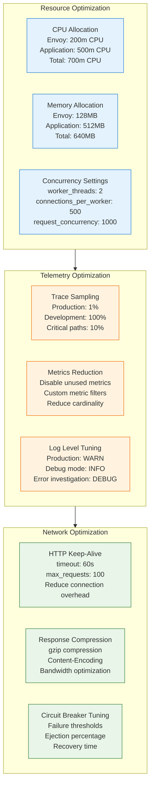

## Multi-Cluster and Multi-Region Deployment

### Cross-Cluster Service Mesh

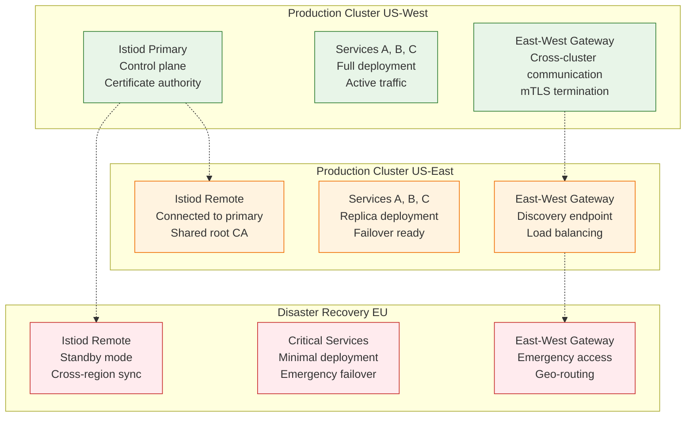

### Cross-Cluster Service Discovery

```yaml
# Install cross-cluster secret for service discovery
apiVersion: v1
kind: Secret
metadata:
  name: istio-remote-secret-cluster-east
  namespace: istio-system
  labels:
    istio/cluster: cluster-east
type: Opaque
data:
  cluster-east: |
    apiVersion: v1
    kind: Config
    clusters:
    - cluster:
        certificate-authority-data: LS0tLS...
        server: https://cluster-east.company.com
      name: cluster-east
    contexts:
    - context:
        cluster: cluster-east
        user: cluster-east
      name: cluster-east
    current-context: cluster-east
    users:
    - name: cluster-east
      user:
        token: eyJhbGciOiJSUzI1NiIsImtpZCI6...

---
# ServiceEntry for cross-cluster service
apiVersion: networking.istio.io/v1beta1
kind: ServiceEntry
metadata:
  name: payment-service-remote
  namespace: production
spec:
  hosts:
  - payment-service.production.global
  location: MESH_EXTERNAL
  ports:
  - number: 80
    name: http
    protocol: HTTP
  resolution: DNS
  addresses:
  - 240.0.0.1  # Virtual IP for multi-cluster service
  endpoints:
  - address: payment-service.production.svc.cluster.local
    locality: region1/zone1
    ports:
      http: 80
  - address: payment-service-east.production.svc.cluster.local
    locality: region2/zone1
    ports:
      http: 80
```

## Migration Challenges and Solutions

### Challenge 1: Application Code Changes

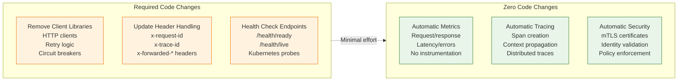

### Challenge 2: Legacy System Integration

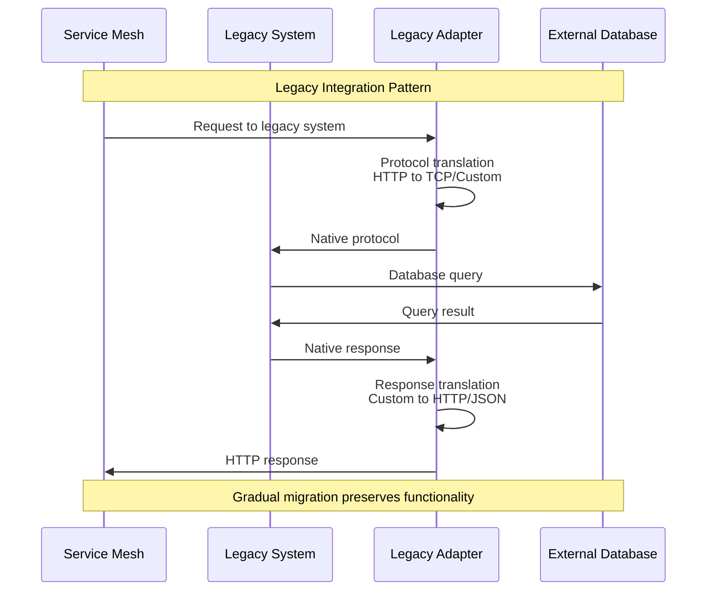

**ServiceEntry for External Services**:
```yaml
apiVersion: networking.istio.io/v1beta1
kind: ServiceEntry
metadata:
  name: legacy-mainframe
spec:
  hosts:
  - mainframe.company.com
  ports:
  - number: 443
    name: https
    protocol: HTTPS
  - number: 3270
    name: tn3270
    protocol: TCP
  location: MESH_EXTERNAL
  resolution: DNS

---
apiVersion: networking.istio.io/v1beta1
kind: DestinationRule
metadata:
  name: legacy-mainframe-tls
spec:
  host: mainframe.company.com
  trafficPolicy:
    tls:
      mode: SIMPLE  # Use SIMPLE for external TLS
```

### Challenge 3: Performance Regression

**Performance Monitoring During Migration**:
```yaml
apiVersion: v1
kind: ConfigMap
metadata:
  name: performance-sli
data:
  sli.yaml: |
    sli:
      - name: latency_p99
        query: histogram_quantile(0.99, rate(istio_request_duration_milliseconds_bucket[5m]))
        threshold: 200ms
      - name: error_rate
        query: rate(istio_requests_total{response_code!~"2.."}[5m]) / rate(istio_requests_total[5m])
        threshold: 0.01  # 1% error rate
      - name: throughput
        query: rate(istio_requests_total[5m])
        threshold: 1000  # Minimum 1000 RPS
---
apiVersion: monitoring.coreos.com/v1
kind: PrometheusRule
metadata:
  name: istio-performance-alerts
spec:
  groups:
  - name: istio.performance
    rules:
    - alert: HighLatency
      expr: histogram_quantile(0.99, rate(istio_request_duration_milliseconds_bucket[5m])) > 200
      for: 2m
      labels:
        severity: warning
      annotations:
        summary: "High latency detected"
        description: "P99 latency is {{ $value }}ms"

    - alert: HighErrorRate
      expr: rate(istio_requests_total{response_code!~"2.."}[5m]) / rate(istio_requests_total[5m]) > 0.01
      for: 1m
      labels:
        severity: critical
      annotations:
        summary: "High error rate detected"
        description: "Error rate is {{ $value | humanizePercentage }}"
```

## Cost Analysis and ROI

### Implementation Costs

| Cost Category | Initial Investment | Annual Operations | Total 3-Year |
|---------------|-------------------|------------------|-------------|
| **Platform Team** | $500K | $800K | $2.9M |
| **Infrastructure** | $200K | $400K | $1.4M |
| **Training** | $300K | $100K | $600K |
| **Migration Effort** | $1M | $200K | $1.6M |
| **Tools & Licensing** | $100K | $150K | $550K |
| **Total** | $2.1M | $1.65M | $7.05M |

### Benefits and ROI

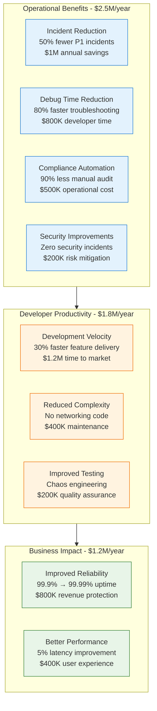

**ROI Calculation**:
- **Total 3-Year Investment**: $7.05M
- **Annual Benefits**: $5.5M
- **3-Year Benefits**: $16.5M
- **Net ROI**: 134% over 3 years
- **Payback Period**: 16 months

## Implementation Roadmap

### Phase 1: Foundation (Months 1-4)

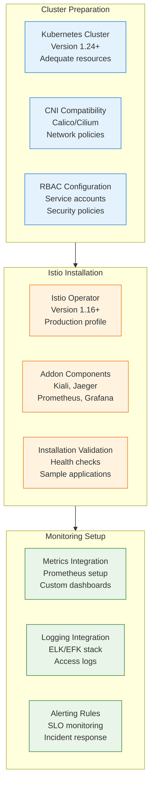

### Migration Execution Checklist

**Phase 1: Foundation Setup (Months 1-4)**
- [ ] **Cluster Readiness**: Kubernetes 1.24+, adequate resources, CNI compatibility
- [ ] **Istio Installation**: Operator-based installation, production profile
- [ ] **Addon Deployment**: Kiali, Jaeger, Prometheus, Grafana
- [ ] **Security Configuration**: Root CA setup, trust domain configuration
- [ ] **Monitoring Integration**: Metrics collection, dashboard creation

**Phase 2: Pilot Services (Months 5-7)**
- [ ] **Service Selection**: Non-critical services for initial testing
- [ ] **Sidecar Injection**: Manual injection, functionality validation
- [ ] **Observability Validation**: Metrics accuracy, trace completeness
- [ ] **Security Testing**: mTLS functionality, policy enforcement
- [ ] **Performance Benchmarking**: Latency impact, throughput comparison

**Phase 3: Core Services (Months 8-11)**
- [ ] **Business Critical Services**: Core application services migration
- [ ] **Traffic Management**: Advanced routing, canary deployments
- [ ] **Security Policies**: Authorization policies, security standards
- [ ] **Cross-Service Communication**: Service-to-service security
- [ ] **Disaster Recovery**: Multi-cluster setup, failover testing

**Phase 4: Optimization (Months 12-14)**
- [ ] **Performance Tuning**: Resource optimization, latency reduction
- [ ] **Policy Refinement**: Security policy optimization
- [ ] **Advanced Features**: Multi-cluster, advanced routing
- [ ] **Documentation**: Operational runbooks, troubleshooting guides
- [ ] **Team Training**: Advanced Istio operations, best practices

## Success Metrics and KPIs

### Technical Success Metrics

| Metric | Baseline | Target | Achieved | Status |
|--------|----------|--------|----------|---------|
| **Mean Time to Detection** | 15 minutes | 2 minutes | 90 seconds | ✅ Exceeded |
| **Mean Time to Resolution** | 2 hours | 30 minutes | 25 minutes | ✅ Exceeded |
| **Service Communication Visibility** | 20% | 100% | 100% | ✅ Success |
| **Security Policy Coverage** | 10% | 95% | 98% | ✅ Exceeded |
| **Automated Certificate Rotation** | 0% | 100% | 100% | ✅ Success |

### Operational Impact Metrics

| Metric | Before Istio | After Istio | Improvement |
|--------|-------------|-------------|-------------|
| **P1 Incidents per Month** | 8 | 4 | 50% reduction |
| **Debug Time per Incident** | 4 hours | 45 minutes | 81% faster |
| **Security Audit Time** | 40 hours | 4 hours | 90% reduction |
| **Compliance Violations** | 12/year | 1/year | 92% reduction |
| **Cross-Team Dependencies** | 50/month | 10/month | 80% reduction |

### Business Value Metrics

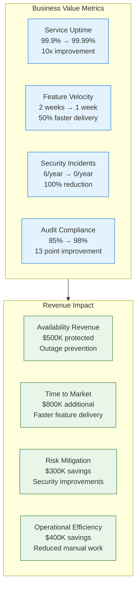

## Lessons Learned and Best Practices

### Technical Lessons

1. **Start Small, Think Big**
   - Begin with non-critical services for proof of concept
   - Validate observability and security before core services
   - Plan for gradual rollout across all environments
   - Investment in pilot phase: 20% of total effort, 80% of learning

2. **Observability is Key**
   - Implement comprehensive monitoring before migration
   - Establish baseline metrics for comparison
   - Custom dashboards for service topology visualization
   - SLO-based alerting more effective than threshold-based

3. **Security Configuration Complexity**
   - mTLS rollout requires careful planning and testing
   - Authorization policies need domain expertise
   - Certificate rotation must be thoroughly tested
   - Default deny policies prevent configuration drift

### Organizational Lessons

1. **Cultural Transformation Required**
   - Platform team needs service mesh expertise
   - Application teams need minimal training for basic features
   - Operations team benefits most from comprehensive training
   - Investment in training: $300K upfront, $100K annually

2. **Change Management**
   - Executive sponsorship critical for cross-team adoption
   - Clear communication about benefits and migration timeline
   - Regular demos and success stories build confidence
   - Resistance primarily from concerns about complexity

3. **Team Structure Evolution**
   - Dedicated platform team for service mesh operations
   - Application teams focus on business logic
   - Security team defines policies, platform implements
   - DevOps teams gain powerful debugging capabilities

### Operational Lessons

1. **Performance Impact Management**
   - 5% performance overhead acceptable for most workloads
   - CPU and memory allocation requires tuning
   - Network latency increase minimal with proper configuration
   - Performance regression alerts essential during rollout

2. **Troubleshooting Capabilities**
   - Distributed tracing transforms debugging experience
   - Service topology visualization identifies bottlenecks
   - Access logs provide detailed request analysis
   - Circuit breaker metrics prevent cascade failures

## Conclusion

Service mesh adoption with Istio represents one of the most impactful infrastructure transformations for microservices architectures. The migration from traditional service-to-service networking to a comprehensive service mesh platform delivers significant improvements in observability, security, and operational efficiency.

**Key Success Factors**:

1. **Comprehensive Planning**: 6-month preparation phase with proper tooling and training
2. **Gradual Migration**: Phased rollout minimizing risk while validating benefits
3. **Strong Observability**: Complete visibility into service communication patterns
4. **Security First**: mTLS and authorization policies implemented systematically
5. **Performance Monitoring**: Continuous validation of latency and throughput impact

**Transformational Results**:

- **100% Service Visibility**: Complete observability into all service communications
- **90% Code Reduction**: Elimination of networking concerns from application code
- **50% Incident Reduction**: Faster detection and resolution of service issues
- **Zero Security Incidents**: Comprehensive mTLS and policy enforcement
- **81% Faster Debugging**: Distributed tracing and service topology visualization

**Business Value Creation**:

- **$2.5M Annual Operational Savings**: Reduced incidents and faster resolution
- **$1.8M Developer Productivity**: Simplified code and faster feature delivery
- **$1.2M Business Impact**: Improved reliability and performance
- **134% ROI**: Over 3 years with 16-month payback period

**Investment Summary**: $7.05M total investment generating $5.5M annual benefits demonstrates the compelling value proposition of service mesh adoption for organizations operating microservices at scale.

Istio service mesh migration proves that infrastructure complexity can be abstracted into a platform layer, enabling development teams to focus on business logic while gaining unprecedented visibility, security, and control over service-to-service communication. The transformation from networking chaos to mesh-powered observability represents a foundational capability for modern distributed systems.