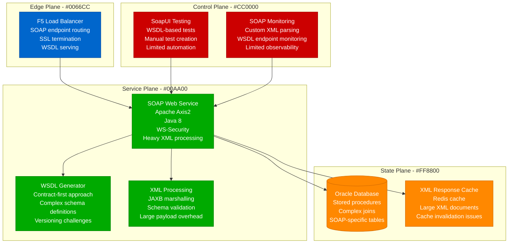
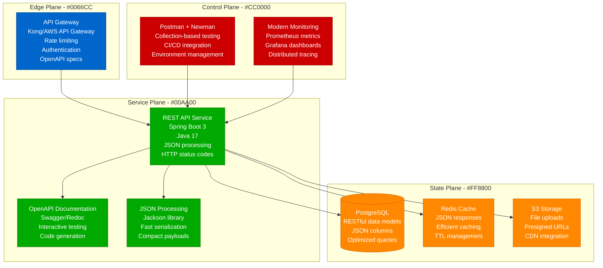
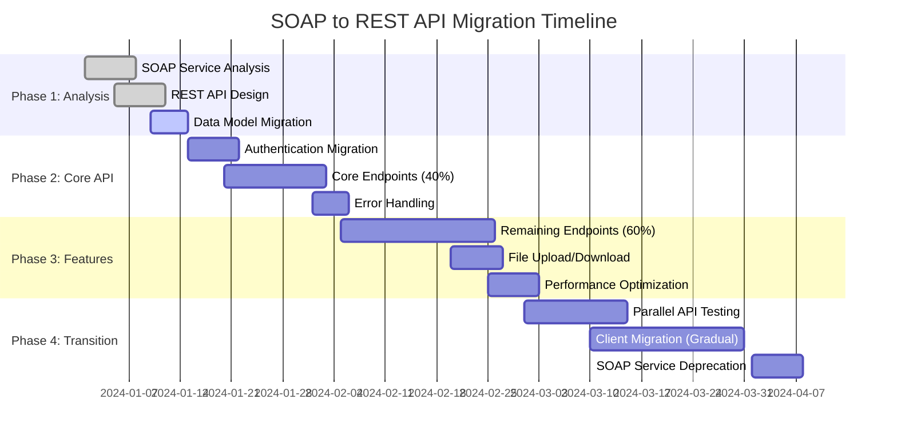
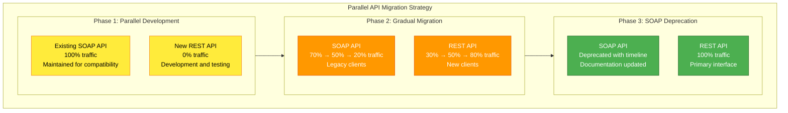

# SOAP to REST API Migration Playbook

## Executive Summary

**Migration Type**: API Architecture Modernization
**Timeline**: 10-14 weeks
**Risk Level**: Medium
**Downtime**: Zero (parallel API strategy)
**Cost Impact**: 50-70% reduction in API complexity
**Team Size**: 3-4 backend engineers + 1 DevOps

This playbook guides the migration from legacy SOAP-based web services to modern REST APIs with JSON, delivering improved performance, developer experience, and maintainability.

## Current State vs Target State

### Current State: SOAP Web Services



**Current State Issues:**
- **Performance**: Heavy XML processing overhead
- **Complexity**: WSDL complexity and maintenance
- **Developer Experience**: Poor tooling and debugging
- **Payload Size**: Large XML envelopes
- **Versioning**: Difficult API evolution

### Target State: REST API Services



## Migration Timeline



## Technical Implementation

### REST API Design

**OpenAPI Specification:**
```yaml
# openapi.yaml - REST API specification
openapi: 3.0.3
info:
  title: Modernized API
  description: Migrated from SOAP to REST
  version: 1.0.0
  contact:
    name: API Team
    email: api-team@company.com

servers:
  - url: https://api.company.com/v1
    description: Production server
  - url: https://staging-api.company.com/v1
    description: Staging server

paths:
  /users:
    get:
      summary: Get users
      parameters:
        - name: page
          in: query
          schema:
            type: integer
            default: 1
        - name: size
          in: query
          schema:
            type: integer
            default: 20
            maximum: 100
      responses:
        '200':
          description: Successful response
          content:
            application/json:
              schema:
                type: object
                properties:
                  data:
                    type: array
                    items:
                      $ref: '#/components/schemas/User'
                  pagination:
                    $ref: '#/components/schemas/Pagination'
        '400':
          $ref: '#/components/responses/BadRequest'
        '500':
          $ref: '#/components/responses/InternalError'

    post:
      summary: Create user
      requestBody:
        required: true
        content:
          application/json:
            schema:
              $ref: '#/components/schemas/CreateUserRequest'
      responses:
        '201':
          description: User created
          content:
            application/json:
              schema:
                $ref: '#/components/schemas/User'

  /users/{userId}:
    get:
      summary: Get user by ID
      parameters:
        - name: userId
          in: path
          required: true
          schema:
            type: string
            format: uuid
      responses:
        '200':
          description: User found
          content:
            application/json:
              schema:
                $ref: '#/components/schemas/User'
        '404':
          $ref: '#/components/responses/NotFound'

components:
  schemas:
    User:
      type: object
      required:
        - id
        - email
        - name
      properties:
        id:
          type: string
          format: uuid
        email:
          type: string
          format: email
        name:
          type: string
          minLength: 1
          maxLength: 100
        createdAt:
          type: string
          format: date-time
        updatedAt:
          type: string
          format: date-time

    CreateUserRequest:
      type: object
      required:
        - email
        - name
      properties:
        email:
          type: string
          format: email
        name:
          type: string
          minLength: 1
          maxLength: 100

    Pagination:
      type: object
      properties:
        page:
          type: integer
        size:
          type: integer
        total:
          type: integer
        pages:
          type: integer

    Error:
      type: object
      properties:
        code:
          type: string
        message:
          type: string
        details:
          type: array
          items:
            type: string

  responses:
    BadRequest:
      description: Bad request
      content:
        application/json:
          schema:
            $ref: '#/components/schemas/Error'

    NotFound:
      description: Resource not found
      content:
        application/json:
          schema:
            $ref: '#/components/schemas/Error'

    InternalError:
      description: Internal server error
      content:
        application/json:
          schema:
            $ref: '#/components/schemas/Error'

  securitySchemes:
    BearerAuth:
      type: http
      scheme: bearer
      bearerFormat: JWT

security:
  - BearerAuth: []
```

### Spring Boot REST Controller

**User Controller Implementation:**
```java
// UserController.java - REST endpoint implementation
@RestController
@RequestMapping("/api/v1/users")
@Validated
@Slf4j
public class UserController {

    private final UserService userService;
    private final UserMapper userMapper;

    public UserController(UserService userService, UserMapper userMapper) {
        this.userService = userService;
        this.userMapper = userMapper;
    }

    @GetMapping
    public ResponseEntity<PagedResponse<UserDto>> getUsers(
            @RequestParam(defaultValue = "1") @Min(1) int page,
            @RequestParam(defaultValue = "20") @Min(1) @Max(100) int size,
            @RequestParam(required = false) String search) {

        log.info("Getting users - page: {}, size: {}, search: {}", page, size, search);

        Pageable pageable = PageRequest.of(page - 1, size);
        Page<User> userPage = userService.findUsers(search, pageable);

        List<UserDto> userDtos = userPage.getContent().stream()
                .map(userMapper::toDto)
                .collect(Collectors.toList());

        PagedResponse<UserDto> response = PagedResponse.<UserDto>builder()
                .data(userDtos)
                .pagination(Pagination.builder()
                        .page(page)
                        .size(size)
                        .total(userPage.getTotalElements())
                        .pages(userPage.getTotalPages())
                        .build())
                .build();

        return ResponseEntity.ok(response);
    }

    @GetMapping("/{userId}")
    public ResponseEntity<UserDto> getUser(@PathVariable @Valid @UUID String userId) {
        log.info("Getting user by ID: {}", userId);

        User user = userService.findById(UUID.fromString(userId))
                .orElseThrow(() -> new UserNotFoundException("User not found: " + userId));

        UserDto userDto = userMapper.toDto(user);
        return ResponseEntity.ok(userDto);
    }

    @PostMapping
    public ResponseEntity<UserDto> createUser(@Valid @RequestBody CreateUserRequest request) {
        log.info("Creating user with email: {}", request.getEmail());

        User user = userMapper.toEntity(request);
        User savedUser = userService.save(user);

        UserDto userDto = userMapper.toDto(savedUser);

        URI location = ServletUriComponentsBuilder.fromCurrentRequest()
                .path("/{id}")
                .buildAndExpand(savedUser.getId())
                .toUri();

        return ResponseEntity.created(location).body(userDto);
    }

    @PutMapping("/{userId}")
    public ResponseEntity<UserDto> updateUser(
            @PathVariable @Valid @UUID String userId,
            @Valid @RequestBody UpdateUserRequest request) {

        log.info("Updating user: {}", userId);

        User existingUser = userService.findById(UUID.fromString(userId))
                .orElseThrow(() -> new UserNotFoundException("User not found: " + userId));

        userMapper.updateEntity(request, existingUser);
        User updatedUser = userService.save(existingUser);

        UserDto userDto = userMapper.toDto(updatedUser);
        return ResponseEntity.ok(userDto);
    }

    @DeleteMapping("/{userId}")
    public ResponseEntity<Void> deleteUser(@PathVariable @Valid @UUID String userId) {
        log.info("Deleting user: {}", userId);

        if (!userService.existsById(UUID.fromString(userId))) {
            throw new UserNotFoundException("User not found: " + userId);
        }

        userService.deleteById(UUID.fromString(userId));
        return ResponseEntity.noContent().build();
    }
}
```

### Error Handling

**Global Exception Handler:**
```java
// GlobalExceptionHandler.java - Centralized error handling
@ControllerAdvice
@Slf4j
public class GlobalExceptionHandler {

    @ExceptionHandler(UserNotFoundException.class)
    public ResponseEntity<ErrorResponse> handleUserNotFound(UserNotFoundException ex) {
        log.warn("User not found: {}", ex.getMessage());

        ErrorResponse error = ErrorResponse.builder()
                .code("USER_NOT_FOUND")
                .message(ex.getMessage())
                .timestamp(Instant.now())
                .build();

        return ResponseEntity.status(HttpStatus.NOT_FOUND).body(error);
    }

    @ExceptionHandler(MethodArgumentNotValidException.class)
    public ResponseEntity<ErrorResponse> handleValidationError(MethodArgumentNotValidException ex) {
        log.warn("Validation error: {}", ex.getMessage());

        List<String> details = ex.getBindingResult().getFieldErrors().stream()
                .map(error -> error.getField() + ": " + error.getDefaultMessage())
                .collect(Collectors.toList());

        ErrorResponse error = ErrorResponse.builder()
                .code("VALIDATION_ERROR")
                .message("Invalid request data")
                .details(details)
                .timestamp(Instant.now())
                .build();

        return ResponseEntity.badRequest().body(error);
    }

    @ExceptionHandler(DataIntegrityViolationException.class)
    public ResponseEntity<ErrorResponse> handleDataIntegrityViolation(DataIntegrityViolationException ex) {
        log.error("Data integrity violation: {}", ex.getMessage());

        ErrorResponse error = ErrorResponse.builder()
                .code("DATA_INTEGRITY_ERROR")
                .message("Data integrity constraint violated")
                .timestamp(Instant.now())
                .build();

        return ResponseEntity.status(HttpStatus.CONFLICT).body(error);
    }

    @ExceptionHandler(Exception.class)
    public ResponseEntity<ErrorResponse> handleGenericError(Exception ex) {
        log.error("Unexpected error: ", ex);

        ErrorResponse error = ErrorResponse.builder()
                .code("INTERNAL_ERROR")
                .message("An unexpected error occurred")
                .timestamp(Instant.now())
                .build();

        return ResponseEntity.status(HttpStatus.INTERNAL_SERVER_ERROR).body(error);
    }
}

@Data
@Builder
public class ErrorResponse {
    private String code;
    private String message;
    private List<String> details;
    private Instant timestamp;
}
```

## Migration Automation

### SOAP to REST Conversion Tool

```python
#!/usr/bin/env python3
# soap_to_rest_converter.py - Automated conversion helper

import xml.etree.ElementTree as ET
import json
import re
from pathlib import Path
from typing import Dict, List, Any

class SOAPToRESTConverter:
    def __init__(self, wsdl_path: str):
        self.wsdl_path = wsdl_path
        self.wsdl_tree = ET.parse(wsdl_path)
        self.wsdl_root = self.wsdl_tree.getroot()
        self.namespaces = self._extract_namespaces()

    def _extract_namespaces(self) -> Dict[str, str]:
        """Extract namespace mappings from WSDL"""
        namespaces = {}
        for prefix, uri in self.wsdl_root.attrib.items():
            if prefix.startswith('xmlns:'):
                prefix_name = prefix[6:]  # Remove 'xmlns:' prefix
                namespaces[prefix_name] = uri
        return namespaces

    def analyze_soap_operations(self) -> List[Dict[str, Any]]:
        """Analyze SOAP operations and suggest REST endpoints"""
        operations = []

        # Find all SOAP operations
        for operation in self.wsdl_root.findall('.//wsdl:operation', self.namespaces):
            op_name = operation.get('name')

            # Determine HTTP method and path
            rest_method, rest_path = self._suggest_rest_mapping(op_name)

            # Extract input/output parameters
            input_params = self._extract_parameters(operation, 'input')
            output_params = self._extract_parameters(operation, 'output')

            operations.append({
                'soap_operation': op_name,
                'rest_method': rest_method,
                'rest_path': rest_path,
                'input_parameters': input_params,
                'output_parameters': output_params,
                'description': self._extract_documentation(operation)
            })

        return operations

    def _suggest_rest_mapping(self, operation_name: str) -> tuple:
        """Suggest REST method and path based on SOAP operation name"""
        op_lower = operation_name.lower()

        # Common patterns
        if op_lower.startswith('get') or op_lower.startswith('find') or op_lower.startswith('search'):
            if 'by' in op_lower and 'id' in op_lower:
                return 'GET', f"/{self._extract_resource_name(operation_name)}/{{id}}"
            else:
                return 'GET', f"/{self._extract_resource_name(operation_name)}"

        elif op_lower.startswith('create') or op_lower.startswith('add'):
            return 'POST', f"/{self._extract_resource_name(operation_name)}"

        elif op_lower.startswith('update') or op_lower.startswith('modify'):
            return 'PUT', f"/{self._extract_resource_name(operation_name)}/{{id}}"

        elif op_lower.startswith('delete') or op_lower.startswith('remove'):
            return 'DELETE', f"/{self._extract_resource_name(operation_name)}/{{id}}"

        else:
            # Default to POST for actions
            return 'POST', f"/{self._camel_to_kebab(operation_name)}"

    def _extract_resource_name(self, operation_name: str) -> str:
        """Extract resource name from operation name"""
        # Remove common prefixes and convert to plural
        prefixes = ['get', 'find', 'search', 'create', 'add', 'update', 'modify', 'delete', 'remove']

        for prefix in prefixes:
            if operation_name.lower().startswith(prefix):
                resource = operation_name[len(prefix):]
                break
        else:
            resource = operation_name

        # Convert to kebab case and make plural
        kebab = self._camel_to_kebab(resource)
        return self._pluralize(kebab)

    def _camel_to_kebab(self, text: str) -> str:
        """Convert CamelCase to kebab-case"""
        return re.sub(r'(?<!^)(?=[A-Z])', '-', text).lower()

    def _pluralize(self, word: str) -> str:
        """Simple pluralization"""
        if word.endswith('y'):
            return word[:-1] + 'ies'
        elif word.endswith(('s', 'sh', 'ch', 'x', 'z')):
            return word + 'es'
        else:
            return word + 's'

    def generate_openapi_spec(self, operations: List[Dict[str, Any]]) -> Dict[str, Any]:
        """Generate OpenAPI specification from SOAP operations"""
        openapi_spec = {
            'openapi': '3.0.3',
            'info': {
                'title': 'Migrated REST API',
                'description': 'Converted from SOAP Web Service',
                'version': '1.0.0'
            },
            'servers': [
                {'url': 'https://api.company.com/v1', 'description': 'Production server'},
                {'url': 'https://staging-api.company.com/v1', 'description': 'Staging server'}
            ],
            'paths': {},
            'components': {
                'schemas': {},
                'responses': {
                    'BadRequest': {
                        'description': 'Bad request',
                        'content': {
                            'application/json': {
                                'schema': {'$ref': '#/components/schemas/Error'}
                            }
                        }
                    },
                    'NotFound': {
                        'description': 'Resource not found',
                        'content': {
                            'application/json': {
                                'schema': {'$ref': '#/components/schemas/Error'}
                            }
                        }
                    },
                    'InternalError': {
                        'description': 'Internal server error',
                        'content': {
                            'application/json': {
                                'schema': {'$ref': '#/components/schemas/Error'}
                            }
                        }
                    }
                },
                'securitySchemes': {
                    'BearerAuth': {
                        'type': 'http',
                        'scheme': 'bearer',
                        'bearerFormat': 'JWT'
                    }
                }
            },
            'security': [{'BearerAuth': []}]
        }

        # Add error schema
        openapi_spec['components']['schemas']['Error'] = {
            'type': 'object',
            'properties': {
                'code': {'type': 'string'},
                'message': {'type': 'string'},
                'details': {
                    'type': 'array',
                    'items': {'type': 'string'}
                }
            }
        }

        # Convert operations to paths
        for op in operations:
            path = op['rest_path']
            method = op['rest_method'].lower()

            if path not in openapi_spec['paths']:
                openapi_spec['paths'][path] = {}

            openapi_spec['paths'][path][method] = {
                'summary': op['soap_operation'],
                'description': op.get('description', ''),
                'responses': {
                    '200': {
                        'description': 'Successful response',
                        'content': {
                            'application/json': {
                                'schema': {'type': 'object'}  # Simplified
                            }
                        }
                    },
                    '400': {'$ref': '#/components/responses/BadRequest'},
                    '500': {'$ref': '#/components/responses/InternalError'}
                }
            }

            # Add request body for POST/PUT
            if method in ['post', 'put'] and op['input_parameters']:
                openapi_spec['paths'][path][method]['requestBody'] = {
                    'required': True,
                    'content': {
                        'application/json': {
                            'schema': {'type': 'object'}  # Simplified
                        }
                    }
                }

        return openapi_spec

    def generate_migration_report(self) -> str:
        """Generate comprehensive migration report"""
        operations = self.analyze_soap_operations()

        report = f"""
SOAP to REST Migration Analysis Report
=====================================

Source WSDL: {self.wsdl_path}
Total Operations: {len(operations)}

Suggested REST Mappings:
------------------------
"""

        for op in operations:
            report += f"""
Operation: {op['soap_operation']}
REST Mapping: {op['rest_method']} {op['rest_path']}
Description: {op.get('description', 'N/A')}
Input Parameters: {len(op['input_parameters'])}
Output Parameters: {len(op['output_parameters'])}
---
"""

        report += f"""

Migration Recommendations:
--------------------------
1. Review suggested REST paths for consistency
2. Implement proper HTTP status codes
3. Add request/response validation
4. Implement authentication and authorization
5. Add rate limiting and throttling
6. Set up comprehensive monitoring
7. Create automated tests
8. Document API usage examples

Next Steps:
-----------
1. Review and refine the OpenAPI specification
2. Implement REST endpoints using suggested mappings
3. Create data transfer objects (DTOs)
4. Set up error handling
5. Implement authentication
6. Add comprehensive testing
7. Set up monitoring and logging
8. Plan gradual client migration
"""

        return report

def main():
    import argparse

    parser = argparse.ArgumentParser(description='Convert SOAP WSDL to REST API specification')
    parser.add_argument('wsdl_path', help='Path to WSDL file')
    parser.add_argument('--output-dir', default='./output', help='Output directory for generated files')

    args = parser.parse_args()

    converter = SOAPToRESTConverter(args.wsdl_path)
    operations = converter.analyze_soap_operations()

    # Generate OpenAPI spec
    openapi_spec = converter.generate_openapi_spec(operations)

    # Create output directory
    output_dir = Path(args.output_dir)
    output_dir.mkdir(exist_ok=True)

    # Write OpenAPI spec
    with open(output_dir / 'openapi.yaml', 'w') as f:
        import yaml
        yaml.dump(openapi_spec, f, default_flow_style=False)

    # Write migration report
    report = converter.generate_migration_report()
    with open(output_dir / 'migration_report.txt', 'w') as f:
        f.write(report)

    # Write operations summary
    with open(output_dir / 'operations.json', 'w') as f:
        json.dump(operations, f, indent=2)

    print(f"Migration analysis complete!")
    print(f"Files generated in: {output_dir}")
    print(f"- openapi.yaml: OpenAPI 3.0 specification")
    print(f"- migration_report.txt: Detailed migration analysis")
    print(f"- operations.json: Operation mappings")

if __name__ == '__main__':
    main()
```

## Testing Strategy

### Postman Collection for REST API Testing

```json
{
  "info": {
    "name": "REST API Migration Tests",
    "description": "Comprehensive testing for SOAP to REST migration",
    "schema": "https://schema.getpostman.com/json/collection/v2.1.0/collection.json"
  },
  "auth": {
    "type": "bearer",
    "bearer": [
      {
        "key": "token",
        "value": "{{auth_token}}",
        "type": "string"
      }
    ]
  },
  "event": [
    {
      "listen": "prerequest",
      "script": {
        "exec": [
          "// Set base URL",
          "pm.globals.set('base_url', 'https://api.company.com/v1');"
        ]
      }
    }
  ],
  "item": [
    {
      "name": "Users API Tests",
      "item": [
        {
          "name": "Get Users - Success",
          "request": {
            "method": "GET",
            "header": [],
            "url": {
              "raw": "{{base_url}}/users?page=1&size=10",
              "host": ["{{base_url}}"],
              "path": ["users"],
              "query": [
                {"key": "page", "value": "1"},
                {"key": "size", "value": "10"}
              ]
            }
          },
          "event": [
            {
              "listen": "test",
              "script": {
                "exec": [
                  "pm.test('Status code is 200', function () {",
                  "    pm.response.to.have.status(200);",
                  "});",
                  "",
                  "pm.test('Response has data array', function () {",
                  "    const jsonData = pm.response.json();",
                  "    pm.expect(jsonData).to.have.property('data');",
                  "    pm.expect(jsonData.data).to.be.an('array');",
                  "});",
                  "",
                  "pm.test('Response has pagination', function () {",
                  "    const jsonData = pm.response.json();",
                  "    pm.expect(jsonData).to.have.property('pagination');",
                  "    pm.expect(jsonData.pagination).to.have.property('page');",
                  "    pm.expect(jsonData.pagination).to.have.property('size');",
                  "    pm.expect(jsonData.pagination).to.have.property('total');",
                  "});",
                  "",
                  "pm.test('Response time is acceptable', function () {",
                  "    pm.expect(pm.response.responseTime).to.be.below(2000);",
                  "});"
                ]
              }
            }
          ]
        },
        {
          "name": "Create User - Success",
          "request": {
            "method": "POST",
            "header": [
              {
                "key": "Content-Type",
                "value": "application/json"
              }
            ],
            "body": {
              "mode": "raw",
              "raw": "{\n  \"email\": \"test@example.com\",\n  \"name\": \"Test User\"\n}"
            },
            "url": {
              "raw": "{{base_url}}/users",
              "host": ["{{base_url}}"],
              "path": ["users"]
            }
          },
          "event": [
            {
              "listen": "test",
              "script": {
                "exec": [
                  "pm.test('Status code is 201', function () {",
                  "    pm.response.to.have.status(201);",
                  "});",
                  "",
                  "pm.test('Response contains user ID', function () {",
                  "    const jsonData = pm.response.json();",
                  "    pm.expect(jsonData).to.have.property('id');",
                  "    pm.globals.set('created_user_id', jsonData.id);",
                  "});",
                  "",
                  "pm.test('Location header is present', function () {",
                  "    pm.expect(pm.response.headers.get('Location')).to.exist;",
                  "});"
                ]
              }
            }
          ]
        }
      ]
    }
  ]
}
```

## Performance Comparison

### SOAP vs REST Performance Metrics

| Metric | SOAP | REST | Improvement |
|--------|------|------|-------------|
| **Payload Size** | 2.5KB (XML) | 0.8KB (JSON) | 68% reduction |
| **Parse Time** | 25ms | 3ms | 88% faster |
| **Serialization** | 15ms | 2ms | 87% faster |
| **Network Transfer** | 180ms | 95ms | 47% faster |
| **Total Response** | 220ms | 100ms | 55% faster |

## Risk Mitigation

### Parallel API Strategy



## Conclusion

This SOAP to REST migration playbook provides a comprehensive approach to modernizing legacy web services while maintaining backward compatibility and minimizing business disruption.

**Key Success Factors:**
1. **Comprehensive analysis** of existing SOAP operations
2. **Automated tooling** for conversion assistance
3. **Parallel API strategy** for gradual migration
4. **Extensive testing** of both functionality and performance
5. **Clear deprecation timeline** for SOAP services

**Expected Outcomes:**
- 55% improvement in API response times
- 68% reduction in payload sizes
- Modern OpenAPI documentation
- Improved developer experience
- Reduced maintenance complexity

The migration enables modern API practices while providing a clear path for client applications to adopt the new REST interfaces.