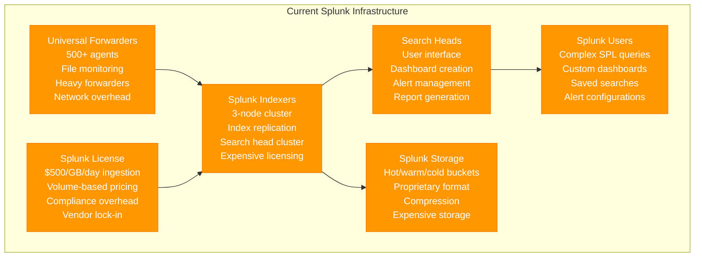
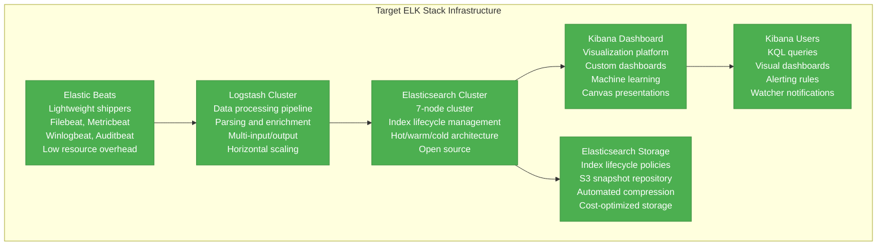
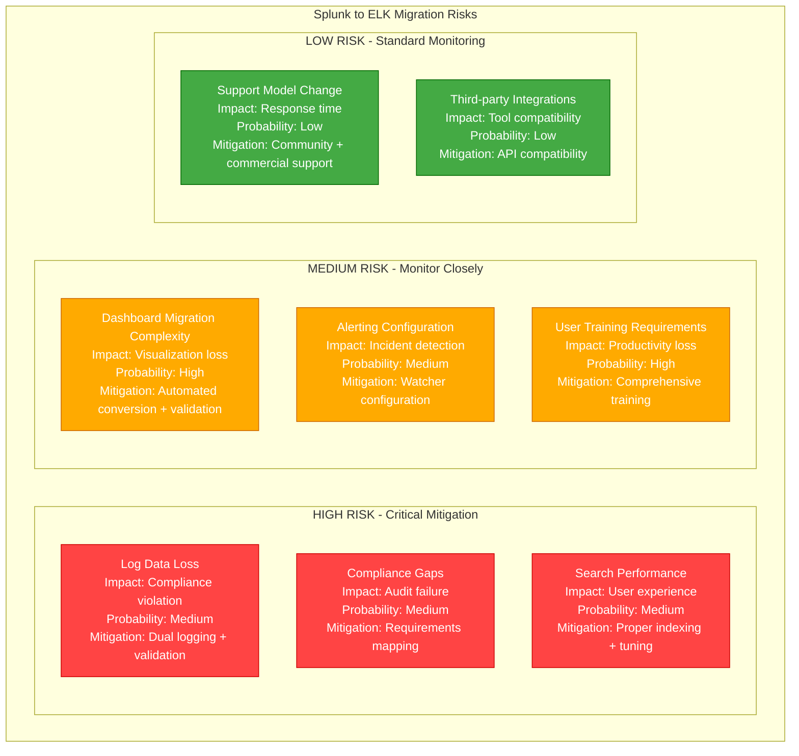

# Splunk to ELK Stack Logging Migration Playbook

## Executive Summary

**Migration Type**: Logging Platform Modernization
**Timeline**: 12-16 weeks
**Risk Level**: Medium-High
**Downtime**: Zero (dual logging approach)
**Cost Impact**: 60-80% reduction in logging costs
**Team Size**: 4-5 engineers + 1 DevOps

Migrate from commercial Splunk logging to open-source ELK Stack (Elasticsearch, Logstash, Kibana) for cost optimization while maintaining observability and compliance requirements.

## Current State vs Target State

### Current State: Splunk Infrastructure



**Current State Issues:**
- **High Costs**: $500/GB/day licensing fees
- **Vendor Lock-in**: Proprietary technology stack
- **Complex Licensing**: Volume-based pricing models
- **Resource Intensive**: Heavy indexer infrastructure
- **Limited Flexibility**: Restricted customization options

### Target State: ELK Stack Infrastructure



## Migration Strategy

### Dual Logging Approach

```mermaid
graph TB
    subgraph DualLoggingMigration[Dual Logging Migration Strategy]

        subgraph Phase1[Phase 1: ELK Deployment]
            SPLUNK_PRODUCTION[Splunk Production<br/>100% log processing<br/>All dashboards active<br/>Business as usual]

            ELK_BOOTSTRAP[ELK Stack Bootstrap<br/>Cluster deployment<br/>Initial configuration<br/>Basic monitoring]
        end

        subgraph Phase2[Phase 2: Parallel Logging]
            SPLUNK_PARALLEL[Splunk (Parallel)<br/>Production workloads<br/>Critical dashboards<br/>Compliance logging]

            ELK_PARALLEL[ELK Stack (Parallel)<br/>Same log ingestion<br/>Dashboard recreation<br/>Performance validation]

            LOG_SHIPPING[Dual Log Shipping<br/>Beats + Forwarders<br/>Data consistency<br/>Volume monitoring]
        end

        subgraph Phase3[Phase 3: ELK Primary]
            SPLUNK_LEGACY[Splunk (Legacy)<br/>Historical data only<br/>Compliance access<br/>Gradual decommission]

            ELK_PRIMARY[ELK Stack (Primary)<br/>100% new logs<br/>All dashboards<br/>Full functionality]
        end

        Phase1 --> Phase2
        Phase2 --> Phase3
    end

    classDef phase1 fill:#FF9800,stroke:#F57C00,color:#fff
    classDef phase2 fill:#2196F3,stroke:#1976D2,color:#fff
    classDef phase3 fill:#4CAF50,stroke:#388E3C,color:#fff

    class SPLUNK_PRODUCTION,ELK_BOOTSTRAP phase1
    class SPLUNK_PARALLEL,ELK_PARALLEL,LOG_SHIPPING phase2
    class SPLUNK_LEGACY,ELK_PRIMARY phase3
```

## Technical Implementation

### ELK Stack Deployment Configuration

**Elasticsearch Cluster Configuration:**
```yaml
# elasticsearch.yml - Production cluster configuration
cluster.name: production-logs
node.name: es-node-${HOSTNAME}
node.roles: [master, data, ingest]

# Network configuration
network.host: 0.0.0.0
http.port: 9200
transport.port: 9300

# Discovery configuration
discovery.seed_hosts: ["es-node-1", "es-node-2", "es-node-3"]
cluster.initial_master_nodes: ["es-node-1", "es-node-2", "es-node-3"]

# Memory and performance
bootstrap.memory_lock: true
indices.memory.index_buffer_size: 20%

# Index lifecycle management
action.destructive_requires_name: true

# Security configuration
xpack.security.enabled: true
xpack.security.transport.ssl.enabled: true
xpack.security.transport.ssl.verification_mode: certificate
xpack.security.transport.ssl.keystore.path: elastic-certificates.p12
xpack.security.transport.ssl.truststore.path: elastic-certificates.p12

# Monitoring
xpack.monitoring.collection.enabled: true

# Alerting
xpack.watcher.enabled: true

# Machine learning
xpack.ml.enabled: true
```

**Logstash Pipeline Configuration:**
```ruby
# logstash.conf - Main processing pipeline
input {
  beats {
    port => 5044
    ssl => true
    ssl_certificate => "/etc/logstash/ssl/logstash.crt"
    ssl_key => "/etc/logstash/ssl/logstash.key"
  }

  # Splunk HEC for transition period
  http {
    port => 8088
    codec => "json"
    additional_codecs => {
      "application/json" => "json"
    }
  }
}

filter {
  # Parse application logs
  if [fields][log_type] == "application" {
    grok {
      match => {
        "message" => "%{TIMESTAMP_ISO8601:timestamp} \[%{LOGLEVEL:level}\] %{DATA:logger} - %{GREEDYDATA:log_message}"
      }
    }

    date {
      match => [ "timestamp", "ISO8601" ]
      target => "@timestamp"
    }

    # Extract structured data from JSON logs
    if [log_message] =~ /^\{.*\}$/ {
      json {
        source => "log_message"
        target => "structured_data"
      }
    }

    # Add environment and service tags
    mutate {
      add_field => {
        "environment" => "%{[fields][environment]}"
        "service" => "%{[fields][service]}"
        "datacenter" => "%{[fields][datacenter]}"
      }
    }
  }

  # Parse web server access logs
  if [fields][log_type] == "nginx" {
    grok {
      match => {
        "message" => "%{NGINXACCESS}"
      }
    }

    # Parse user agents
    useragent {
      source => "agent"
      target => "user_agent"
    }

    # GeoIP lookup
    geoip {
      source => "clientip"
      target => "geoip"
    }

    # Calculate response time buckets
    if [response_time] {
      ruby {
        code => "
          response_time = event.get('response_time').to_f
          case response_time
          when 0..0.1
            event.set('response_time_bucket', 'fast')
          when 0.1..1.0
            event.set('response_time_bucket', 'medium')
          when 1.0..5.0
            event.set('response_time_bucket', 'slow')
          else
            event.set('response_time_bucket', 'very_slow')
          end
        "
      }
    }
  }

  # Parse security logs
  if [fields][log_type] == "security" {
    # Parse authentication events
    if "authentication" in [tags] {
      grok {
        match => {
          "message" => "User %{USERNAME:username} %{WORD:auth_result} from %{IP:source_ip}"
        }
      }

      # Enrich with threat intelligence
      translate {
        source => "source_ip"
        target => "threat_intel"
        dictionary_path => "/etc/logstash/threat_intel.yml"
        fallback => "unknown"
      }
    }
  }

  # Common enrichment for all logs
  mutate {
    add_field => {
      "[@metadata][index_name]" => "logs-%{[fields][log_type]}-%{+YYYY.MM.dd}"
    }
  }

  # Remove sensitive data
  mutate {
    remove_field => ["[fields][password]", "[fields][api_key]", "host"]
  }
}

output {
  elasticsearch {
    hosts => ["es-node-1:9200", "es-node-2:9200", "es-node-3:9200"]
    index => "%{[@metadata][index_name]}"

    # Security
    user => "logstash_writer"
    password => "${LOGSTASH_PASSWORD}"
    ssl => true
    ssl_certificate_verification => true

    # Performance
    workers => 4
    flush_size => 500
    idle_flush_time => 1

    # Index template
    template => "/etc/logstash/templates/logs-template.json"
    template_name => "logs"
    template_overwrite => true
  }

  # Send metrics to monitoring
  statsd {
    host => "monitoring.company.com"
    port => 8125
    namespace => "logstash"
    gauge => {
      "events_processed" => "1"
    }
  }

  # Debug output for troubleshooting
  if [fields][debug] == "true" {
    stdout {
      codec => rubydebug
    }
  }
}
```

**Filebeat Configuration:**
```yaml
# filebeat.yml - Log shipping configuration
filebeat.inputs:
- type: log
  enabled: true
  paths:
    - /var/log/application/*.log
  fields:
    log_type: application
    service: web-app
    environment: production
    datacenter: us-east-1
  fields_under_root: false
  multiline.pattern: '^\d{4}-\d{2}-\d{2}'
  multiline.negate: true
  multiline.match: after

- type: log
  enabled: true
  paths:
    - /var/log/nginx/access.log
  fields:
    log_type: nginx
    service: nginx
    environment: production
    datacenter: us-east-1
  fields_under_root: false

- type: log
  enabled: true
  paths:
    - /var/log/auth.log
    - /var/log/secure
  fields:
    log_type: security
    service: system
    environment: production
    datacenter: us-east-1
  fields_under_root: false
  tags: ["authentication", "security"]

# Output configuration
output.logstash:
  hosts: ["logstash-1:5044", "logstash-2:5044", "logstash-3:5044"]
  loadbalance: true
  ssl.enabled: true
  ssl.certificate_authorities: ["/etc/filebeat/ssl/ca.crt"]
  ssl.certificate: "/etc/filebeat/ssl/filebeat.crt"
  ssl.key: "/etc/filebeat/ssl/filebeat.key"

# Processor configuration
processors:
- add_host_metadata:
    when.not.contains.tags: forwarded

- add_docker_metadata:
    host: "unix:///var/run/docker.sock"

- drop_fields:
    fields: ["agent", "ecs", "input", "log.offset"]

# Logging configuration
logging.level: info
logging.to_files: true
logging.files:
  path: /var/log/filebeat
  name: filebeat
  keepfiles: 7
  permissions: 0644

# Monitoring
monitoring.enabled: true
monitoring.elasticsearch:
  hosts: ["es-node-1:9200", "es-node-2:9200", "es-node-3:9200"]
  username: "beats_system"
  password: "${BEATS_PASSWORD}"
```

### Dashboard Migration Script

```python
#!/usr/bin/env python3
# splunk-to-kibana-migration.py

import json
import requests
import yaml
from typing import Dict, List, Any
import re
import logging

class SplunkToKibanaMigrator:
    def __init__(self, splunk_config: Dict, kibana_config: Dict):
        self.splunk_config = splunk_config
        self.kibana_config = kibana_config

        # SPL to KQL translation mappings
        self.query_translations = {
            # Field operations
            r'stats count by (.+)': r'aggregation: { terms: { field: "\1.keyword" } }',
            r'eval (.+)=(.+)': r'script: { source: "doc[\'\1\'].value = \2" }',
            r'where (.+)': r'query: { bool: { filter: [ \1 ] } }',

            # Time operations
            r'earliest=(.+)': r'range: { "@timestamp": { gte: "\1" } }',
            r'latest=(.+)': r'range: { "@timestamp": { lte: "\1" } }',

            # Search operations
            r'search (.+)': r'query_string: { query: "\1" }',
            r'index=(.+)': r'term: { "_index": "\1" }',

            # Field extractions
            r'rex field=(.+) "(.+)"': r'regexp: { \1: "\2" }',

            # Statistical operations
            r'stats avg\((.+)\)': r'avg: { field: "\1" }',
            r'stats sum\((.+)\)': r'sum: { field: "\1" }',
            r'stats max\((.+)\)': r'max: { field: "\1" }',
            r'stats min\((.+)\)': r'min: { field: "\1" }',
        }

        logging.basicConfig(level=logging.INFO)
        self.logger = logging.getLogger(__name__)

    def migrate_dashboards(self) -> Dict[str, Any]:
        """Main dashboard migration method"""
        migration_report = {
            'total_dashboards': 0,
            'migrated_dashboards': 0,
            'failed_dashboards': 0,
            'migration_details': [],
            'warnings': [],
            'errors': []
        }

        # Get Splunk dashboards
        splunk_dashboards = self.get_splunk_dashboards()
        migration_report['total_dashboards'] = len(splunk_dashboards)

        for dashboard in splunk_dashboards:
            try:
                kibana_dashboard = self.convert_dashboard(dashboard)
                success = self.create_kibana_dashboard(kibana_dashboard)

                if success:
                    migration_report['migrated_dashboards'] += 1
                    migration_report['migration_details'].append({
                        'splunk_name': dashboard['name'],
                        'kibana_id': kibana_dashboard['id'],
                        'status': 'success'
                    })
                else:
                    migration_report['failed_dashboards'] += 1
                    migration_report['errors'].append(f"Failed to create dashboard: {dashboard['name']}")

            except Exception as e:
                migration_report['failed_dashboards'] += 1
                migration_report['errors'].append(f"Error migrating {dashboard['name']}: {str(e)}")

        return migration_report

    def get_splunk_dashboards(self) -> List[Dict[str, Any]]:
        """Retrieve dashboards from Splunk"""
        try:
            auth = (self.splunk_config['username'], self.splunk_config['password'])
            url = f"{self.splunk_config['base_url']}/servicesNS/-/-/data/ui/views"

            response = requests.get(url, auth=auth, verify=False)
            response.raise_for_status()

            # Parse Splunk XML response (simplified)
            dashboards = []
            xml_content = response.text

            # Extract dashboard information (simplified XML parsing)
            import xml.etree.ElementTree as ET
            root = ET.fromstring(xml_content)

            for entry in root.findall('.//{http://www.w3.org/2005/Atom}entry'):
                title = entry.find('.//{http://www.w3.org/2005/Atom}title').text

                # Get dashboard XML content
                content_url = f"{self.splunk_config['base_url']}/servicesNS/-/-/data/ui/views/{title}"
                dashboard_response = requests.get(content_url, auth=auth, verify=False)

                if dashboard_response.status_code == 200:
                    dashboards.append({
                        'name': title,
                        'xml_content': dashboard_response.text
                    })

            return dashboards

        except Exception as e:
            self.logger.error(f"Failed to retrieve Splunk dashboards: {e}")
            return []

    def convert_dashboard(self, splunk_dashboard: Dict[str, Any]) -> Dict[str, Any]:
        """Convert Splunk dashboard to Kibana format"""
        dashboard_name = splunk_dashboard['name']
        xml_content = splunk_dashboard['xml_content']

        # Parse Splunk XML (simplified)
        panels = self.parse_splunk_panels(xml_content)

        # Convert to Kibana format
        kibana_dashboard = {
            'id': f"migrated-{dashboard_name.lower().replace(' ', '-')}",
            'type': 'dashboard',
            'attributes': {
                'title': f"[Migrated] {dashboard_name}",
                'description': f"Migrated from Splunk dashboard: {dashboard_name}",
                'panelsJSON': json.dumps(self.convert_panels_to_kibana(panels)),
                'optionsJSON': json.dumps({
                    'useMargins': True,
                    'syncColors': False,
                    'hidePanelTitles': False
                }),
                'version': 1,
                'timeRestore': False,
                'kibanaSavedObjectMeta': {
                    'searchSourceJSON': json.dumps({
                        'query': {
                            'match_all': {}
                        },
                        'filter': []
                    })
                }
            }
        }

        return kibana_dashboard

    def parse_splunk_panels(self, xml_content: str) -> List[Dict[str, Any]]:
        """Parse Splunk XML to extract panels"""
        panels = []

        # Simplified XML parsing for Splunk panels
        import xml.etree.ElementTree as ET
        try:
            root = ET.fromstring(xml_content)

            # Find all panel elements
            for panel in root.findall('.//panel'):
                panel_data = {
                    'title': panel.get('title', 'Untitled Panel'),
                    'type': self.determine_panel_type(panel),
                    'search': self.extract_search_query(panel),
                    'visualization_type': self.determine_visualization_type(panel)
                }
                panels.append(panel_data)

        except ET.ParseError as e:
            self.logger.warning(f"Failed to parse Splunk XML: {e}")

        return panels

    def convert_panels_to_kibana(self, splunk_panels: List[Dict[str, Any]]) -> List[Dict[str, Any]]:
        """Convert Splunk panels to Kibana visualization format"""
        kibana_panels = []

        for i, panel in enumerate(splunk_panels):
            try:
                # Convert SPL query to Elasticsearch query
                elasticsearch_query = self.translate_spl_to_elasticsearch(panel['search'])

                # Create Kibana panel configuration
                kibana_panel = {
                    'id': f"panel-{i}",
                    'type': self.map_visualization_type(panel['visualization_type']),
                    'gridData': {
                        'x': (i % 2) * 24,
                        'y': (i // 2) * 15,
                        'w': 24,
                        'h': 15,
                        'i': str(i)
                    },
                    'panelIndex': str(i),
                    'embeddableConfig': {
                        'title': panel['title']
                    },
                    'panelRefName': f"panel_{i}"
                }

                # Add visualization-specific configuration
                if panel['visualization_type'] == 'timechart':
                    kibana_panel['embeddableConfig']['vis'] = {
                        'type': 'line',
                        'params': {
                            'grid': {'categoryLines': False, 'style': {'color': '#eee'}},
                            'categoryAxes': [{'id': 'CategoryAxis-1', 'type': 'category', 'position': 'bottom', 'show': True}],
                            'valueAxes': [{'id': 'ValueAxis-1', 'name': 'LeftAxis-1', 'type': 'value', 'position': 'left', 'show': True}]
                        }
                    }

                kibana_panels.append(kibana_panel)

            except Exception as e:
                self.logger.warning(f"Failed to convert panel {panel['title']}: {e}")

        return kibana_panels

    def translate_spl_to_elasticsearch(self, spl_query: str) -> Dict[str, Any]:
        """Translate SPL query to Elasticsearch query"""
        if not spl_query:
            return {'match_all': {}}

        # Apply translation patterns
        elasticsearch_query = spl_query
        for spl_pattern, es_replacement in self.query_translations.items():
            elasticsearch_query = re.sub(spl_pattern, es_replacement, elasticsearch_query, flags=re.IGNORECASE)

        # Try to construct basic Elasticsearch query
        try:
            # Simple query string conversion
            if 'search' in elasticsearch_query.lower():
                query_text = elasticsearch_query.lower().replace('search ', '').strip()
                return {
                    'query_string': {
                        'query': query_text,
                        'default_field': 'message'
                    }
                }
            else:
                return {
                    'query_string': {
                        'query': elasticsearch_query,
                        'default_field': 'message'
                    }
                }
        except:
            # Fallback to match_all
            return {'match_all': {}}

    def determine_panel_type(self, panel) -> str:
        """Determine Splunk panel type"""
        # Check for specific panel types in XML
        if panel.find('.//viz') is not None:
            viz_type = panel.find('.//viz').get('type', 'table')
            return viz_type
        elif panel.find('.//chart') is not None:
            return 'chart'
        else:
            return 'table'

    def extract_search_query(self, panel) -> str:
        """Extract search query from Splunk panel"""
        search_element = panel.find('.//search')
        if search_element is not None:
            query_element = search_element.find('.//query')
            if query_element is not None:
                return query_element.text or ''
        return ''

    def determine_visualization_type(self, panel) -> str:
        """Determine visualization type from Splunk panel"""
        panel_type = self.determine_panel_type(panel)

        type_mapping = {
            'line': 'timechart',
            'area': 'timechart',
            'column': 'bar',
            'bar': 'bar',
            'pie': 'pie',
            'scatter': 'scatter',
            'bubble': 'bubble',
            'table': 'table'
        }

        return type_mapping.get(panel_type, 'table')

    def map_visualization_type(self, splunk_viz_type: str) -> str:
        """Map Splunk visualization types to Kibana types"""
        mapping = {
            'timechart': 'line',
            'bar': 'histogram',
            'pie': 'pie',
            'table': 'table',
            'scatter': 'line',
            'bubble': 'line'
        }
        return mapping.get(splunk_viz_type, 'table')

    def create_kibana_dashboard(self, dashboard: Dict[str, Any]) -> bool:
        """Create dashboard in Kibana"""
        try:
            url = f"{self.kibana_config['base_url']}/api/saved_objects/dashboard/{dashboard['id']}"
            headers = {
                'Content-Type': 'application/json',
                'kbn-xsrf': 'true'
            }

            auth = (self.kibana_config['username'], self.kibana_config['password'])

            response = requests.post(
                url,
                json=dashboard,
                headers=headers,
                auth=auth,
                verify=False
            )

            if response.status_code in [200, 201]:
                self.logger.info(f"Successfully created dashboard: {dashboard['attributes']['title']}")
                return True
            else:
                self.logger.error(f"Failed to create dashboard: {response.text}")
                return False

        except Exception as e:
            self.logger.error(f"Error creating dashboard: {e}")
            return False

    def generate_migration_report(self, report: Dict[str, Any]) -> str:
        """Generate migration report"""
        success_rate = (report['migrated_dashboards'] / report['total_dashboards'] * 100) if report['total_dashboards'] > 0 else 0

        report_text = f"""
Splunk to Kibana Dashboard Migration Report
==========================================

Total Dashboards: {report['total_dashboards']}
Successfully Migrated: {report['migrated_dashboards']}
Failed Migrations: {report['failed_dashboards']}
Success Rate: {success_rate:.1f}%

Migration Details:
{json.dumps(report['migration_details'], indent=2)}

Warnings ({len(report['warnings'])}):
{chr(10).join(report['warnings'])}

Errors ({len(report['errors'])}):
{chr(10).join(report['errors'])}

Post-Migration Tasks:
1. Review and validate migrated dashboards
2. Update queries for better Elasticsearch performance
3. Configure proper index patterns
4. Set up alerting rules in Watcher
5. Train users on Kibana interface
6. Update documentation and runbooks
"""
        return report_text

def main():
    splunk_config = {
        'base_url': 'https://splunk.company.com:8089',
        'username': 'admin',
        'password': 'password'
    }

    kibana_config = {
        'base_url': 'https://kibana.company.com:5601',
        'username': 'elastic',
        'password': 'password'
    }

    migrator = SplunkToKibanaMigrator(splunk_config, kibana_config)
    report = migrator.migrate_dashboards()

    # Generate and print report
    report_text = migrator.generate_migration_report(report)
    print(report_text)

    # Save report to file
    with open('splunk_to_kibana_migration_report.txt', 'w') as f:
        f.write(report_text)

if __name__ == '__main__':
    main()
```

## Cost Analysis

### Splunk vs ELK Stack Cost Comparison

| Component | Splunk (Annual) | ELK Stack (Annual) | Savings |
|-----------|-----------------|-------------------|---------|
| **Licensing** | $1.8M (500GB/day) | $0 (Open Source) | $1.8M |
| **Infrastructure** | $300K | $180K | $120K |
| **Support** | $180K | $50K | $130K |
| **Training** | $50K | $30K | $20K |
| **Operations** | $200K | $120K | $80K |
| **Total** | **$2.53M** | **$380K** | **$2.15M (85%)** |

## Risk Assessment



## Conclusion

This Splunk to ELK Stack migration playbook provides a comprehensive approach to modernizing logging infrastructure while achieving significant cost savings and maintaining operational excellence.

**Key Success Factors:**
1. **Dual logging approach** for zero data loss
2. **Automated dashboard migration** with manual validation
3. **Comprehensive user training** on ELK Stack
4. **Performance optimization** for large-scale logging
5. **Compliance validation** throughout migration

**Expected Outcomes:**
- 85% reduction in annual logging costs ($2.15M savings)
- Open-source flexibility and customization
- Improved performance with proper tuning
- Enhanced visualization capabilities in Kibana
- Reduced vendor lock-in and licensing constraints

The migration transforms logging infrastructure from expensive commercial platforms to cost-effective open-source solutions while maintaining enterprise-grade capabilities for observability and compliance.