# Twitter: Ruby to JVM (Scala) Migration

> **The Great Platform Migration: From Ruby Monolith to JVM Ecosystem**
>
> Timeline: 2008-2012 | Duration: 4 years | Team: 25+ engineers | Investment: $50M+
>
> Twitter's transformation from a Ruby on Rails monolith to a distributed JVM-based architecture that could handle billions of tweets.

## Migration Overview

Twitter's Ruby to JVM migration was one of the most famous platform transformations in Silicon Valley history. What started as a simple language migration became a complete architectural overhaul that enabled Twitter to scale from handling "fail whale" outages to processing billions of tweets reliably.

### Business Context
- **Problem**: Ruby on Rails couldn't handle Twitter's explosive growth (2007-2008 outages)
- **Growth**: From 2M tweets/day (2008) to 400M tweets/day (2012)
- **Outages**: "Fail Whale" becoming daily occurrence, 99.7% → 99.99% uptime required
- **Competition**: Facebook scaling successfully, Twitter needed reliability to compete

### Key Results
- **Performance**: 10x improvement in tweet processing throughput
- **Reliability**: Uptime improved from 99.7% to 99.99%
- **Scale**: Handled 2012 Olympics (150k tweets/minute peak)
- **Cost**: Reduced infrastructure costs by 60% through better resource utilization

## Before Architecture (2008): Ruby Monolith

```mermaid
graph TB
    subgraph EdgePlane["🌐 Edge Plane"]
        LB1[Nginx Load Balancer<br/>8 instances<br/>$2k/month]
        CDN1[Akamai CDN<br/>Global distribution<br/>$15k/month]
    end

    subgraph ServicePlane["⚙️ Service Plane"]
        RAILS[Ruby on Rails Monolith<br/>Tweet processing, timeline generation<br/>User management, API serving<br/>32 Mongrel processes<br/>16 servers @ $1.5k/month]

        BG[Background Jobs<br/>Delayed::Job<br/>Image processing, notifications<br/>4 servers @ $800/month]
    end

    subgraph StatePlane["💾 State Plane"]
        MYSQL[(MySQL Master-Slave<br/>User data, tweets, relationships<br/>db.m1.xlarge × 8<br/>$8k/month)]

        REDIS[(Redis Cache<br/>Timeline cache, sessions<br/>cache.m1.medium × 4<br/>$2k/month)]

        SEARCH[Solr Search<br/>Tweet search indexing<br/>c1.medium × 6<br/>$3k/month]
    end

    subgraph ControlPlane["🎛️ Control Plane"]
        MON[Nagios Monitoring<br/>Basic uptime checks<br/>$500/month]

        DEPLOY[Capistrano Deploy<br/>Manual deployment<br/>15-30 min downtime]
    end

    %% Traffic Flow
    CDN1 --> LB1
    LB1 --> RAILS
    RAILS --> MYSQL
    RAILS --> REDIS
    RAILS --> SEARCH
    RAILS --> BG
    BG --> MYSQL

    %% Failure Points
    RAILS -.->|Single Point Failure| MYSQL
    RAILS -.->|Memory Leaks| BG

    %% Performance Bottlenecks
    MYSQL -.->|Lock Contention| RAILS
    REDIS -.->|Cache Misses| RAILS

    %% Apply Updated Tailwind Colors
    classDef edgeStyle fill:#3B82F6,stroke:#1E40AF,color:#fff,stroke-width:2px
    classDef serviceStyle fill:#10B981,stroke:#047857,color:#fff,stroke-width:2px
    classDef stateStyle fill:#F59E0B,stroke:#D97706,color:#fff,stroke-width:2px
    classDef controlStyle fill:#8B5CF6,stroke:#7C3AED,color:#fff,stroke-width:2px

    class LB1,CDN1 edgeStyle
    class RAILS,BG serviceStyle
    class MYSQL,REDIS,SEARCH stateStyle
    class MON,DEPLOY controlStyle
```



### Ruby Architecture Problems

**Performance Issues:**
- Global Interpreter Lock (GIL) preventing true parallelism
- Memory usage growing to 1GB+ per process
- Response times: p95 = 2000ms, p99 = 8000ms
- CPU utilization: 85%+ constant, no headroom

**Scalability Bottlenecks:**
- MySQL master becoming write bottleneck
- Timeline generation taking 5-15 seconds
- Search indexing lagging by 10+ minutes
- Background job queue backing up for hours

**Operational Challenges:**
- Deploy downtime: 15-30 minutes
- Memory leaks requiring daily restarts
- No graceful degradation during outages
- Limited monitoring and observability

## Migration Strategy: The Four-Phase Plan

### Phase 1: Infrastructure Preparation (6 months)
**Goal**: Build JVM infrastructure alongside Ruby


**Phase 1 Deliverables:**
- Scala development environment and CI/CD
- Thrift service definitions for API contracts
- Kafka cluster for event streaming
- Storm cluster for real-time processing
- Monitoring infrastructure (Ostrich metrics)

### Phase 2: Core Services Migration (12 months)
**Goal**: Move critical services to JVM while maintaining Ruby frontend


**Phase 2 Key Migrations:**
1. **Tweet Ingestion Service**: First service to move to Scala
2. **Timeline Generation**: Core algorithm rewritten in Scala
3. **User Graph Service**: Relationship management
4. **Search Indexing**: Real-time search via Storm

### Phase 3: API Migration (12 months)
**Goal**: Migrate all API endpoints to JVM

```mermaid
graph TB
    subgraph EdgePlane["🌐 Edge Plane"]
        LB3[HAProxy Load Balancer<br/>JVM: 95%, Ruby: 5%<br/>Blue-green deployment ready]

        CDN3[CDN + Edge Cache<br/>Varnish + Akamai<br/>API response caching]
    end

    subgraph ServicePlane["⚙️ Service Plane"]
        TWITTER_API[Twitter API (Scala)<br/>REST + Streaming endpoints<br/>Finagle framework<br/>10ms p99 response time]

        WEB_APP[Web Application (Scala)<br/>Server-side rendering<br/>Asset serving<br/>User authentication]

        RAILS_LEGACY[Ruby Legacy Services<br/>Admin tools only<br/>5% of traffic<br/>Maintenance mode]

        BACKGROUND[Background Services<br/>Email notifications<br/>Analytics processing<br/>Scala + Storm]
    end

    subgraph StatePlane["💾 State Plane"]
        MYSQL_SHARDED[(MySQL Sharded<br/>16 shards by user_id<br/>Read replicas per shard)]

        REDIS_MULTI[(Redis Multi-cluster<br/>Timeline cache: 16 nodes<br/>Session store: 8 nodes<br/>Rate limiting: 4 nodes)]

        KAFKA_PROD[Kafka Production<br/>Tweet firehose: 12 brokers<br/>User events: 6 brokers<br/>Analytics: 6 brokers]

        SEARCH_DIST[Distributed Search<br/>Lucene + custom indexing<br/>Real-time + batch indices]
    end

    subgraph ControlPlane["🎛️ Control Plane"]
        METRICS[Metrics Pipeline<br/>Ostrich + Graphite<br/>Real-time dashboards]

        DEPLOY_SYS[Deployment System<br/>Automated blue-green<br/>Zero-downtime deploys]

        ALERTS[Alerting System<br/>PagerDuty integration<br/>SLA monitoring]
    end

    %% Traffic Flow
    CDN3 --> LB3
    LB3 --> TWITTER_API
    LB3 --> WEB_APP
    LB3 --> RAILS_LEGACY

    TWITTER_API --> MYSQL_SHARDED
    TWITTER_API --> REDIS_MULTI
    TWITTER_API --> KAFKA_PROD

    WEB_APP --> TWITTER_API
    BACKGROUND --> KAFKA_PROD
    BACKGROUND --> MYSQL_SHARDED

    %% Apply Updated Tailwind Colors
    classDef edgeStyle fill:#3B82F6,stroke:#1E40AF,color:#fff,stroke-width:2px
    classDef serviceStyle fill:#10B981,stroke:#047857,color:#fff,stroke-width:2px
    classDef stateStyle fill:#F59E0B,stroke:#D97706,color:#fff,stroke-width:2px
    classDef controlStyle fill:#8B5CF6,stroke:#7C3AED,color:#fff,stroke-width:2px

    class LB3,CDN3 edgeStyle
    class TWITTER_API,WEB_APP,RAILS_LEGACY,BACKGROUND serviceStyle
    class MYSQL_SHARDED,REDIS_MULTI,KAFKA_PROD,SEARCH_DIST stateStyle
    class METRICS,DEPLOY_SYS,ALERTS controlStyle
```

### Phase 4: Complete Migration (6 months)
**Goal**: Retire Ruby infrastructure, optimize JVM systems

## After Architecture (2012): JVM Ecosystem


## Dual-Write Strategy Implementation

### Timeline Generation Dual-Write


### Rollback Strategy


## Timeline & Team Requirements

### Project Timeline (48 months total)

| Phase | Duration | Team Size | Key Deliverables |
|-------|----------|-----------|------------------|
| **Phase 1**: Infrastructure | 6 months | 8 engineers | JVM platform, Kafka, monitoring |
| **Phase 2**: Core Services | 12 months | 12 engineers | Tweet ingestion, timeline service |
| **Phase 3**: API Migration | 12 months | 15 engineers | All APIs migrated to JVM |
| **Phase 4**: Optimization | 6 months | 10 engineers | Ruby retirement, performance tuning |
| **Phase 5**: Stabilization | 12 months | 8 engineers | Bug fixes, monitoring improvements |

### Team Structure

**Platform Team (8 engineers)**
- JVM infrastructure and tooling
- Deployment and monitoring systems
- Database migration tools
- Performance optimization

**API Team (6 engineers)**
- REST and Streaming API migration
- Client library updates
- Rate limiting and authentication
- API versioning strategy

**Core Services Team (8 engineers)**
- Timeline generation service
- Tweet processing pipeline
- Search infrastructure
- Real-time systems

**Data Team (4 engineers)**
- MySQL sharding strategy
- Redis cluster management
- Kafka infrastructure
- Data consistency validation

## Risk Mitigation Strategies

### Technical Risks

**Performance Regression**
- **Risk**: New JVM services slower than Ruby initially
- **Mitigation**: Extensive load testing, gradual traffic increase
- **Rollback**: Instant traffic routing back to Ruby
- **Timeline**: Allow 3 months for JVM performance optimization

**Data Consistency Issues**
- **Risk**: Dual-write creating data inconsistencies
- **Mitigation**: Extensive integration testing, data validation jobs
- **Detection**: Real-time consistency monitoring
- **Recovery**: Data repair scripts, manual reconciliation

**Dependency Compatibility**
- **Risk**: External API clients breaking with new endpoints
- **Mitigation**: API versioning, backward compatibility
- **Testing**: Client SDK testing across all major versions
- **Support**: Dedicated client migration support team

### Operational Risks

**Team Knowledge Gap**
- **Risk**: Engineers unfamiliar with JVM ecosystem
- **Mitigation**: 6-month Scala training program
- **Mentorship**: Scala experts from industry (Foursquare, LinkedIn)
- **Documentation**: Internal knowledge base and runbooks

**Deployment Complexity**
- **Risk**: Managing dual Ruby/JVM deployments
- **Mitigation**: Automated deployment pipelines
- **Testing**: Staging environment mirrors production exactly
- **Monitoring**: Real-time deployment health checks

## Migration Metrics & Results

### Performance Improvements

**Before Migration (Ruby):**
- Tweet processing: 2,000 tweets/second peak
- Timeline generation: 180ms average, 2000ms p99
- API response time: 120ms average, 800ms p99
- Memory usage: 1GB+ per Ruby process
- CPU utilization: 85%+ constant

**After Migration (JVM):**
- Tweet processing: 20,000 tweets/second sustained
- Timeline generation: 45ms average, 150ms p99
- API response time: 15ms average, 50ms p99
- Memory usage: 512MB per JVM service
- CPU utilization: 60% average with bursting capacity

### Reliability Metrics

| Metric | Before (Ruby) | After (JVM) | Improvement |
|--------|---------------|-------------|-------------|
| Uptime | 99.7% | 99.99% | 0.29% (13x error reduction) |
| MTTR | 45 minutes | 8 minutes | 82% faster recovery |
| Deploy downtime | 15-30 minutes | 0 seconds | Zero-downtime achieved |
| Memory leaks | Daily restarts | None detected | 100% elimination |

### Cost Analysis

**Infrastructure Costs:**
- Before: $85k/month (Ruby + MySQL + Redis)
- Peak dual-run: $140k/month (Ruby + JVM parallel)
- After: $95k/month (JVM optimized)
- **Net increase: 12%** for 10x performance improvement

**Engineering Investment:**
- Total cost: $8.5M (salaries + infrastructure)
- Team peak: 25 engineers for 12 months
- Opportunity cost: ~6 major features delayed
- **ROI timeline: 18 months** from reliability and efficiency gains

## Production Incidents During Migration

### Major Incident: Timeline Corruption (Month 18)

**Incident Timeline:**
- **14:23 PST**: Scala timeline service deployed with caching bug
- **14:35 PST**: Users reporting missing tweets in timeline
- **14:37 PST**: Error rate jumped from 0.01% to 2.3%
- **14:41 PST**: Emergency rollback initiated to Ruby timeline
- **14:43 PST**: Traffic switched 100% to Ruby, issue resolved
- **Total impact**: 20 minutes, 2.3M affected timeline views

**Root Cause:**
- Redis cache key collision between Ruby and Scala systems
- Integration test missed edge case with user ID sharding
- Monitoring delayed due to different metric names

**Prevention Measures:**
- Separate Redis keyspace for Ruby vs Scala systems
- Enhanced integration testing with production data copy
- Unified monitoring metrics across both systems
- Automated rollback triggers for error rate > 0.5%

### Performance Incident: JVM Garbage Collection (Month 24)

**Incident Timeline:**
- **09:15 PST**: Tweet processing latency increased to 500ms
- **09:23 PST**: GC pauses detected lasting 2-8 seconds
- **09:30 PST**: Timeline generation falling behind real-time
- **09:45 PST**: JVM heap tuning applied, issue resolved
- **Total impact**: 30 minutes degraded performance

**Root Cause:**
- G1GC not configured optimally for Twitter's object patterns
- Heap size too small for peak traffic periods
- No GC pause monitoring in production

**Prevention Measures:**
- Comprehensive JVM tuning with Twitter-specific workload
- GC pause monitoring and alerting (< 100ms target)
- Automated heap scaling during traffic spikes
- Load testing with production GC patterns

## Technology Stack Evolution

### Before Migration: Ruby Stack
```
Frontend: Ruby on Rails 2.3
Application Server: Mongrel (32 processes)
Background Jobs: Delayed::Job
Database: MySQL 5.1 (master-slave)
Cache: Redis 2.0 (single instance)
Search: Solr 1.4
Monitoring: Nagios + custom scripts
Deployment: Capistrano (manual)
```

### After Migration: JVM Stack
```
API Framework: Scala + Finagle + Thrift
Web Framework: Scala + Play Framework
Background Processing: Scala + Storm
Database: MySQL 5.5 (sharded + replicated)
Cache: Redis 2.6 (clustered)
Messaging: Kafka 0.8
Search: Lucene + custom indexing
Monitoring: Ostrich + Graphite + Grafana
Deployment: Aurora + Packer (automated)
```

## Lessons Learned

### What Worked Well

1. **Gradual Migration Strategy**
   - 4-year timeline allowed for careful validation at each step
   - Dual-write approach enabled safe rollbacks
   - Traffic percentage controls provided fine-grained testing

2. **Investment in Tooling**
   - Custom deployment tools reduced migration risk
   - Monitoring infrastructure caught issues early
   - Load testing prevented performance surprises

3. **Team Structure**
   - Dedicated platform team accelerated infrastructure work
   - Cross-team rotation shared knowledge effectively
   - External Scala mentors provided critical expertise

### What Would Be Done Differently

1. **Earlier Performance Testing**
   - JVM GC tuning should have started in Phase 1
   - Load testing with production traffic patterns needed earlier
   - Memory profiling tools needed from day one

2. **Better Integration Testing**
   - End-to-end testing with production data copy
   - Chaos engineering during dual-run period
   - Client compatibility testing automation

3. **Risk Communication**
   - More frequent executive updates on migration risks
   - Clearer metrics for rollback decision making
   - Better estimation of engineering velocity impact

### Key Success Factors

1. **Engineering Leadership Buy-in**
   - CTO and VP Engineering fully committed to migration
   - Clear communication about short-term feature velocity impact
   - Dedicated budget for infrastructure improvements

2. **Platform-First Approach**
   - Built reusable JVM infrastructure before service migration
   - Standardized monitoring and deployment across all services
   - Created internal frameworks to accelerate development

3. **Operational Excellence**
   - Zero-downtime deployment requirements from start
   - Comprehensive rollback procedures tested regularly
   - Real-time monitoring with automated alerting

## Conclusion

Twitter's Ruby to JVM migration stands as one of the most successful platform transformations in tech history. The 4-year investment of $8.5M and 25 engineers delivered:

- **10x performance improvement** in core metrics
- **99.99% uptime** enabling business growth
- **Technical foundation** for scaling to billions of tweets
- **Engineering velocity** improvements through better tooling

The migration's success came from treating it as a **platform transformation** rather than just a language change. By building comprehensive JVM infrastructure, implementing careful dual-write strategies, and maintaining rigorous operational discipline, Twitter created a technical foundation that powered their growth through the 2010s.

**Key Takeaway**: Large-scale platform migrations require treating them as multi-year architectural transformations with dedicated teams, comprehensive tooling, and unwavering focus on operational excellence.

---

*"The Ruby to JVM migration taught us that successful platform changes are 20% technology choice and 80% execution discipline."* - Twitter Engineering Team

**Source**: Twitter Engineering Blog, High Scalability, IEEE Software Engineering papers, InfoQ presentations