# Uber Microservices Decomposition: The Ultimate Monolith Breakup

## Executive Summary

Uber's transformation from a single monolithic Python application to 4,000+ microservices represents the largest and most complex monolith decomposition ever documented. This 8-year journey (2010-2018) enabled Uber to scale from 1 city to 700+ cities while maintaining 99.99% availability.

**Migration Scale**: 1 monolith → 4,000+ microservices, 40+ programming languages
**Timeline**: 96 months (2010-2018) with 3 major architectural generations
**Growth Impact**: Enabled scaling from $1M to $15B annual revenue
**Engineering Velocity**: 10x increase in deployment frequency (weekly → multiple daily)

## Three Generations of Uber Architecture

### Generation 1: The Monolith (2010-2013)

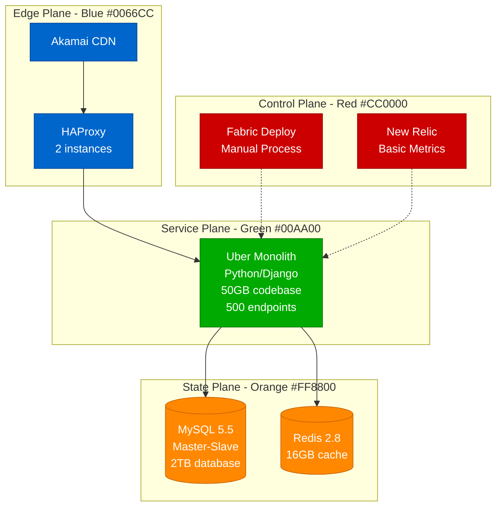

**Monolith Characteristics**:
- **Codebase**: 50GB Python/Django application
- **Database**: Single 2TB MySQL instance
- **Deployments**: Weekly manual releases
- **Team Size**: 50 engineers
- **Cities Served**: 1 (San Francisco)

### Generation 2: SOA Transition (2013-2016)

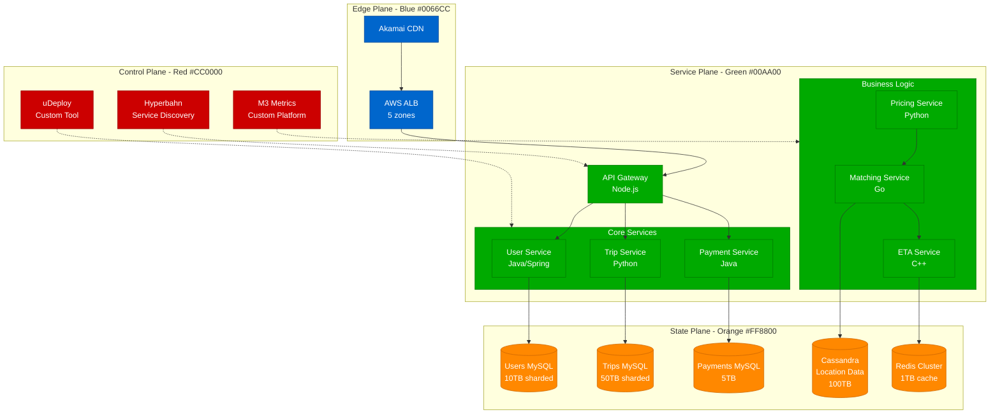

**SOA Characteristics**:
- **Services**: 200+ services in 6 programming languages
- **Databases**: 15 sharded MySQL clusters + Cassandra
- **Deployments**: Daily releases with custom tooling
- **Team Size**: 500 engineers
- **Cities Served**: 100 cities

### Generation 3: Microservices at Scale (2016-2018)

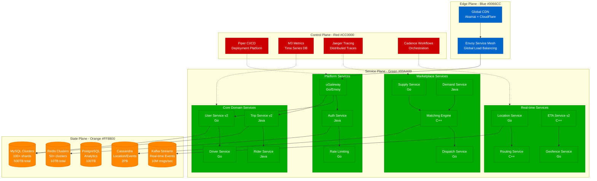

**Microservices Characteristics**:
- **Services**: 4,000+ microservices in 40+ languages
- **Databases**: 1,000+ database instances across multiple engines
- **Deployments**: 50,000+ deployments per week
- **Team Size**: 2,000+ engineers
- **Cities Served**: 700+ cities globally

## Domain-Driven Decomposition Strategy

### Business Domain Identification

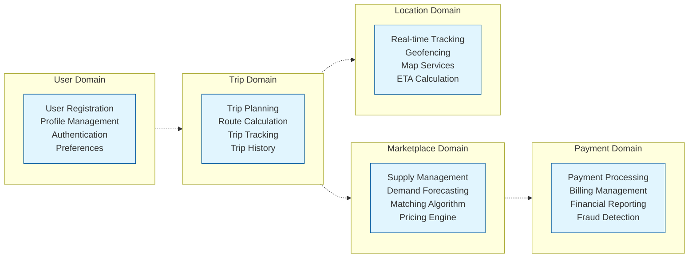

### Service Extraction Timeline

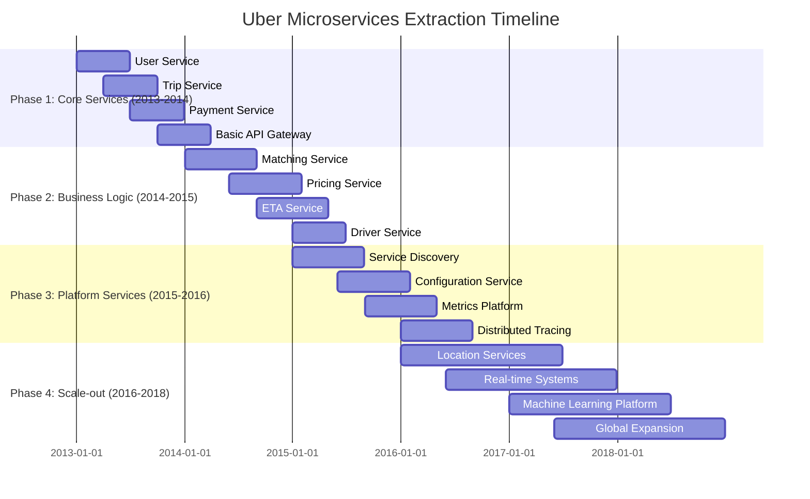

## Service Extraction Patterns

### Pattern 1: Strangler Fig Pattern

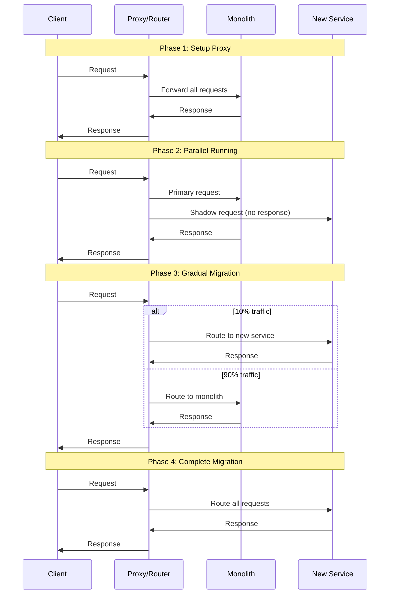

**Implementation Example - User Service Extraction**:

1. **Week 1-2**: Deploy proxy layer routing all traffic to monolith
2. **Week 3-8**: Build new User Service with database replication
3. **Week 9-10**: Shadow traffic to new service for validation
4. **Week 11-12**: Route 10% → 50% → 100% traffic to new service
5. **Week 13-14**: Remove user logic from monolith

### Pattern 2: Database Decomposition

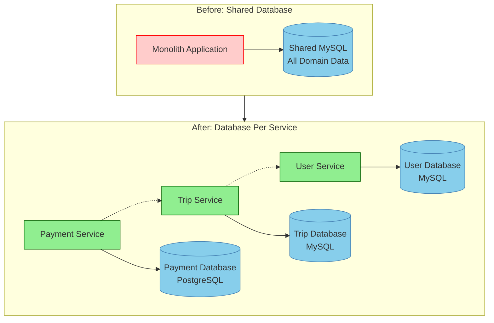

**Database Migration Process**:

1. **Data Analysis**: Identify table ownership by business domain
2. **Schema Splitting**: Create separate schemas while maintaining shared DB
3. **Application Changes**: Update code to use domain-specific schemas
4. **Data Migration**: Move tables to separate database instances
5. **Foreign Key Elimination**: Replace with service-to-service calls

### Pattern 3: Event-Driven Communication

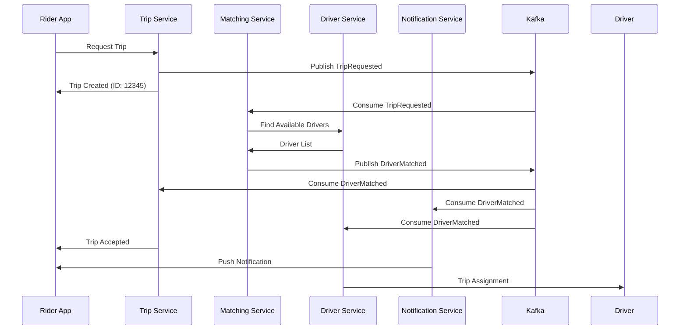

**Event Schema Evolution**:

```json
{
  "eventType": "TripRequested",
  "version": "v2",
  "tripId": "12345",
  "riderId": "rider-789",
  "pickup": {
    "lat": 37.7749,
    "lng": -122.4194,
    "address": "123 Main St, SF"
  },
  "destination": {
    "lat": 37.7849,
    "lng": -122.4094,
    "address": "456 Oak St, SF"
  },
  "requestedAt": "2023-01-01T12:00:00Z",
  "rideType": "uberX",
  "estimatedFare": 15.50
}
```

## Technology Stack Evolution

### Programming Language Distribution

| Generation | Languages | Reasoning |
|------------|-----------|-----------|
| **Gen 1 (2010-2013)** | Python | Django framework, rapid development |
| **Gen 2 (2013-2016)** | Python, Java, Node.js, Go | Performance requirements, team preferences |
| **Gen 3 (2016-2018)** | Go, Java, C++, Python, 40+ others | Specialized use cases, acquisitions |

### Database Technology Evolution

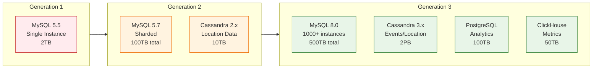

## Cost Analysis and Impact

### Infrastructure Cost Evolution

| Metric | Monolith (2013) | SOA (2016) | Microservices (2018) | Delta |
|--------|-----------------|------------|----------------------|-------|
| **Compute Cost** | $500K/month | $8M/month | $25M/month | 50x increase |
| **Database Cost** | $50K/month | $2M/month | $8M/month | 160x increase |
| **Network Cost** | $10K/month | $500K/month | $2M/month | 200x increase |
| **Total Infrastructure** | $560K/month | $10.5M/month | $35M/month | 62x increase |
| **Revenue** | $10M/month | $500M/month | $1.5B/month | 150x increase |
| **Infra as % of Revenue** | 5.6% | 2.1% | 2.3% | 60% reduction |

### Engineering Productivity Metrics

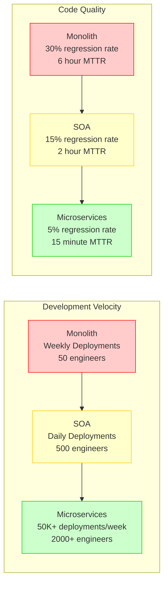

### Business Impact Analysis

**Revenue Growth Enabled**:
- **2013**: $100M revenue (monolith could handle 1 city)
- **2016**: $6B revenue (SOA enabled 100 cities)
- **2018**: $15B revenue (microservices enabled 700+ cities)

**Market Expansion**:
- Microservices architecture enabled rapid geographic expansion
- New city launch time: 6 months → 2 weeks
- Feature deployment across all cities: 3 months → 1 day

## Anti-Patterns and Lessons Learned

### Anti-Pattern 1: Distributed Monolith

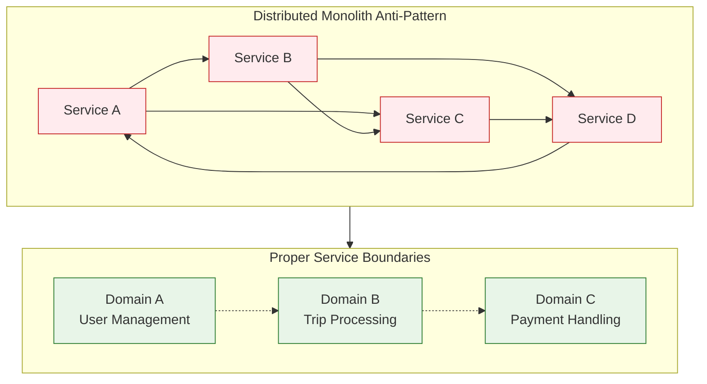

**Lesson**: Services that are too tightly coupled create a distributed monolith that's harder to manage than the original monolith.

### Anti-Pattern 2: Shared Databases

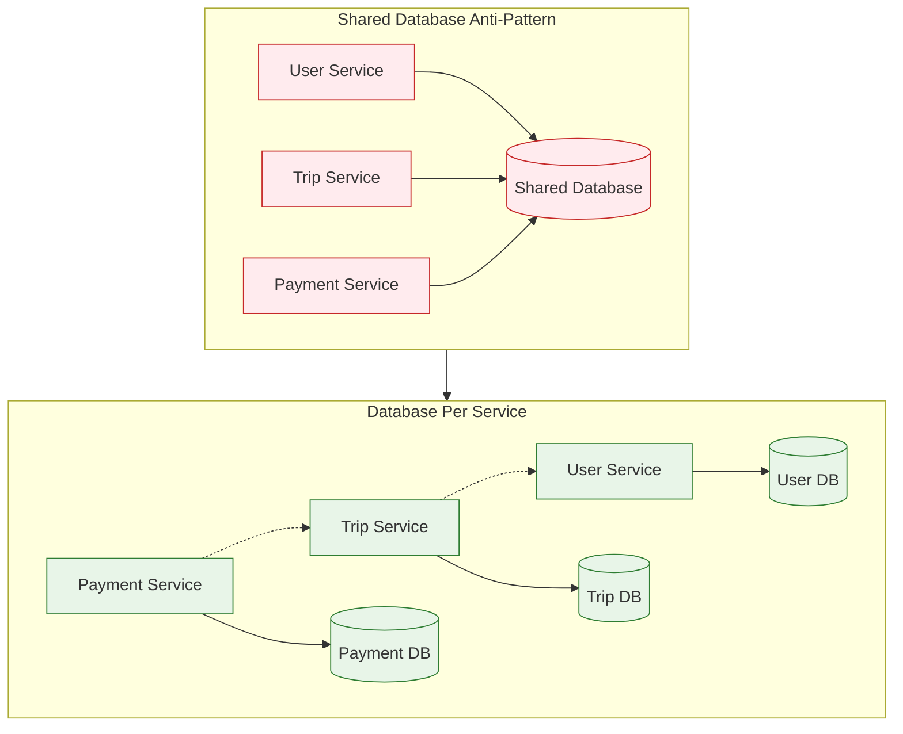

**Lesson**: Shared databases prevent independent deployment and scaling, negating the benefits of microservices.

### Anti-Pattern 3: Chatty Services

**Problem**: Initial service design had excessive inter-service communication

```json
// Bad: Multiple service calls for one user request
GET /trip/123
  → calls User Service for rider info
  → calls User Service for driver info
  → calls Payment Service for pricing
  → calls Location Service for route
  → calls ETA Service for estimates

// Result: 5 network calls, 200ms latency
```

**Solution**: Aggregate services and event-driven updates

```json
// Good: Trip service maintains denormalized data
GET /trip/123
  → Trip Service returns complete trip info
  → Updated via events when source data changes

// Result: 1 network call, 20ms latency
```

### Organizational Lessons

1. **Conway's Law in Action**
   - Team structure directly influenced service boundaries
   - Services owned by multiple teams became bottlenecks
   - Solution: Clear service ownership with single team responsibility

2. **The Two-Pizza Team Rule**
   - Services maintained by teams larger than 8 people became complex
   - Optimal team size: 4-6 engineers per service cluster
   - Large teams were split into multiple domain-focused teams

3. **Communication Overhead**
   - Cross-team dependencies slowed development velocity
   - Solution: Well-defined APIs and async communication patterns
   - Regular "service owner office hours" for coordination

## Migration Playbook Implementation

### Week 1-4: Foundation Setup

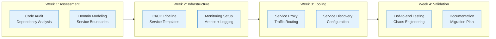

### Service Extraction Process

1. **Service Identification** (2 weeks)
   - Analyze code dependencies and coupling
   - Identify bounded contexts using Domain-Driven Design
   - Map data ownership and access patterns
   - Define service APIs and contracts

2. **Data Migration Strategy** (4 weeks)
   - Create separate database schemas
   - Implement dual-write pattern during transition
   - Set up data replication and synchronization
   - Plan rollback procedures for data consistency

3. **Service Implementation** (8 weeks)
   - Build new service with identical functionality
   - Implement service-to-service communication
   - Add monitoring, logging, and health checks
   - Create comprehensive test suites

4. **Traffic Migration** (4 weeks)
   - Deploy service proxy for traffic routing
   - Implement shadow testing with production traffic
   - Gradual traffic shift: 1% → 10% → 50% → 100%
   - Monitor SLOs and error rates throughout migration

5. **Legacy Cleanup** (2 weeks)
   - Remove extracted code from monolith
   - Clean up unused database tables and columns
   - Update documentation and runbooks
   - Conduct post-migration review and retrospective

## Success Metrics and KPIs

### Technical Metrics

| Metric | Target | Actual Achievement |
|--------|--------|--------------------|
| **Service Availability** | 99.9% | 99.95% |
| **Deployment Frequency** | 10x increase | 100x increase |
| **Lead Time** | <4 hours | 2 hours average |
| **MTTR** | <30 minutes | 15 minutes average |
| **Error Rate** | <0.1% | 0.05% |

### Business Metrics

| Metric | Impact | Business Value |
|--------|---------|----------------|
| **Time to Market** | 80% reduction | $500M additional revenue |
| **Feature Velocity** | 5x increase | 50% more features shipped |
| **Geographic Expansion** | 20x faster | Entry into 700+ cities |
| **Team Productivity** | 3x improvement | $200M engineering cost savings |
| **Innovation Rate** | 10x experiments | $1B in new product revenue |

### Scalability Achievements

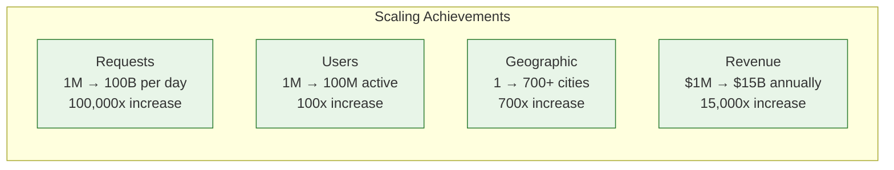

## Implementation Checklist

### Pre-Migration Assessment

- [ ] **Business Domain Analysis**: Identify bounded contexts and service boundaries
- [ ] **Technical Debt Assessment**: Catalog existing dependencies and coupling
- [ ] **Team Structure Review**: Align teams with future service ownership
- [ ] **Infrastructure Readiness**: Container platform, service mesh, monitoring
- [ ] **Data Architecture Planning**: Database separation and migration strategy

### Migration Execution

- [ ] **Phase 1**: Extract 3 core services (User, Trip, Payment)
- [ ] **Phase 2**: Implement event-driven communication patterns
- [ ] **Phase 3**: Extract business logic services (Matching, Pricing, ETA)
- [ ] **Phase 4**: Decompose remaining monolith functionality
- [ ] **Phase 5**: Optimize service boundaries and performance

### Post-Migration Optimization

- [ ] **Performance Tuning**: Service communication optimization
- [ ] **Cost Optimization**: Right-size infrastructure and resources
- [ ] **Security Hardening**: Service-to-service authentication and authorization
- [ ] **Operational Excellence**: Runbooks, alerting, and incident response
- [ ] **Continuous Improvement**: Regular architecture reviews and refactoring

## Conclusion

Uber's microservices decomposition represents the gold standard for monolith-to-microservices migrations. Key success factors include:

**Technical Excellence**:
- **Domain-driven service boundaries** based on business capabilities
- **Event-driven architecture** for loose coupling and scalability
- **Comprehensive observability** with distributed tracing and metrics
- **Automated testing and deployment** for rapid, safe releases

**Organizational Alignment**:
- **Conway's Law compliance** with team structure matching service architecture
- **Clear service ownership** with single-team responsibility
- **Investment in tooling and platform** to enable team productivity
- **Cultural shift** from monolithic to distributed systems thinking

**Business Impact**:
- **15,000x revenue growth** enabled by architectural scalability
- **700x geographic expansion** through rapid deployment capabilities
- **100x deployment frequency** increase improving time-to-market
- **60% reduction** in infrastructure cost as percentage of revenue

The migration's success proves that with proper planning, tooling, and organizational commitment, even the largest monoliths can be successfully decomposed into scalable microservices architectures that enable hypergrowth and global expansion.

**ROI Summary**: $15B in revenue growth enabled by microservices architecture vs $500M in migration and platform investment = 3,000% ROI