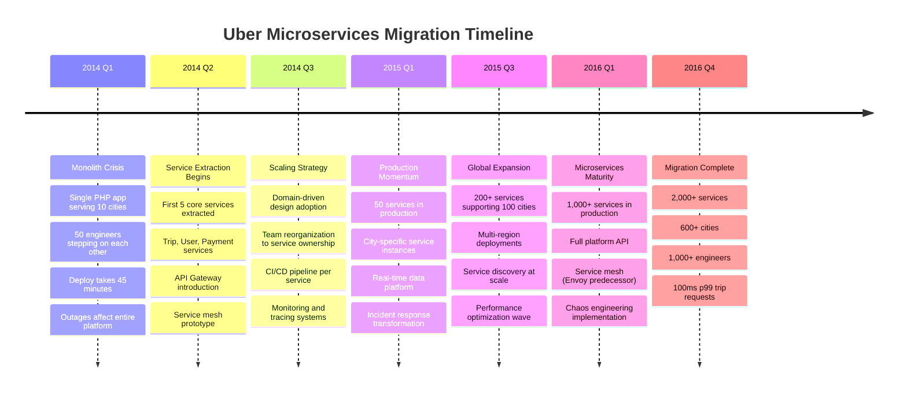
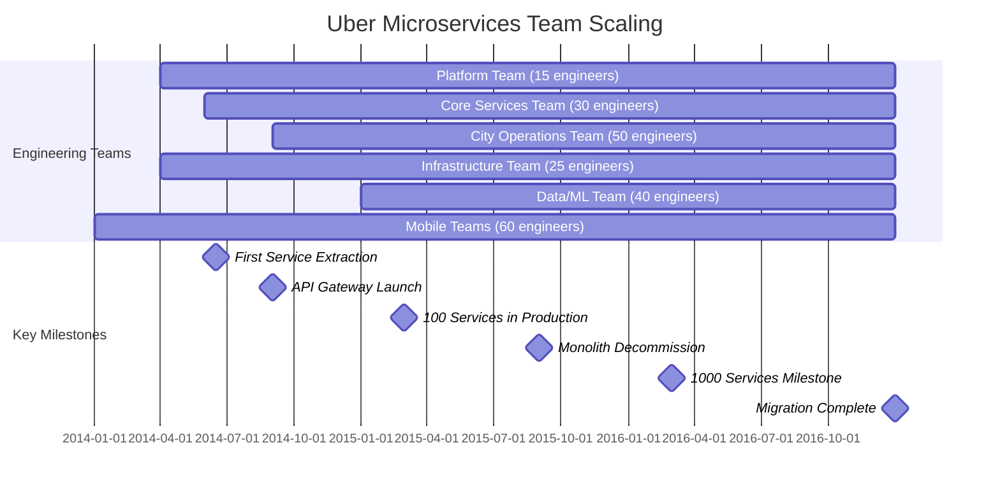
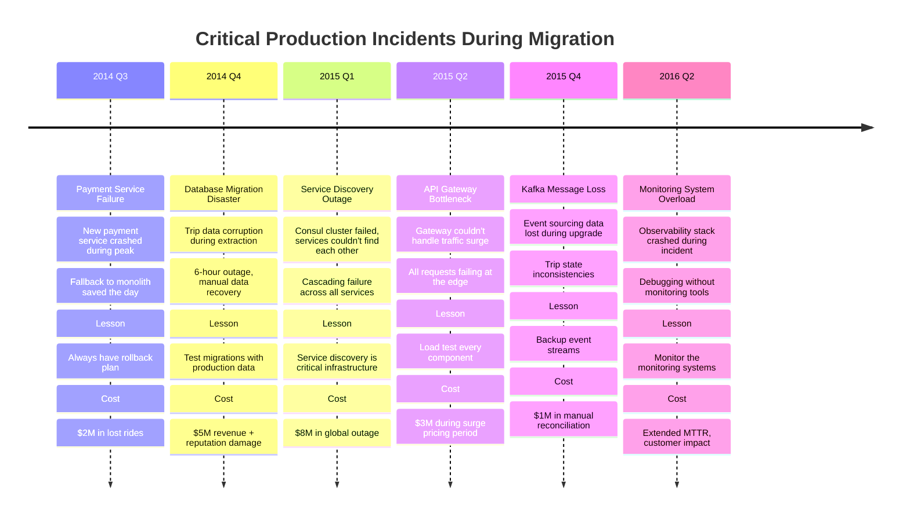

# Uber: Monolith → Microservices Migration

> **The pioneering microservices transformation that defined the industry playbook**
>
> **Timeline**: 2014-2016 (18 months) | **Team**: 200+ engineers | **Investment**: $50M+ | **Services**: 2,000+

## Executive Summary

Uber's migration from a single monolithic PHP application to 2,000+ microservices represents one of the most documented and influential architectural transformations in tech history. This migration enabled Uber to scale from 1 city to 600+ cities while growing their engineering team from 50 to 2,000+ engineers.

## Migration Overview



## Before Architecture - The Monolith Crisis

```mermaid
graph TB
    subgraph Before: Monolithic Architecture (2014)
        subgraph EdgePlane[Edge Plane - CDN & Load Balancing]
            ELB[AWS ELB<br/>50k concurrent connections<br/>Single point of failure]
            CF[CloudFlare CDN<br/>Static assets only<br/>Limited geographic coverage]
        end

        subgraph ServicePlane[Service Plane - The Monolith]
            MONO[Uber Monolith<br/>PHP 5.4 + Apache<br/>Single codebase: 500k LOC<br/>50 engineers, 1 deploy/day]

            subgraph MonolithModules[Monolith Modules]
                TRIP[Trip Management<br/>Complex state machine<br/>Tightly coupled to payments]
                USER[User Management<br/>Rider + Driver profiles<br/>Authentication/Authorization]
                PAY[Payment Processing<br/>Credit cards + promotions<br/>PCI compliance nightmare]
                MATCH[Matching Engine<br/>Driver-rider pairing<br/>Real-time GPS updates]
                PRICING[Pricing Engine<br/>Surge pricing calculation<br/>City-specific rules]
                NOTIF[Notifications<br/>SMS/Push/Email<br/>High-volume messaging]
            end
        end

        subgraph StatePlane[State Plane - Single Database]
            MYSQL[(MySQL 5.6<br/>Master-slave setup<br/>500GB database<br/>10k connections peak)]
            REDIS[(Redis 2.8<br/>Session storage<br/>Driver locations<br/>16GB memory)]
        end

        subgraph ControlPlane[Control Plane - Basic Monitoring]
            NAGIOS[Nagios<br/>Basic uptime monitoring<br/>No service-level metrics]
            LOGS[Syslog<br/>Single log file<br/>Grep-based debugging]
        end
    end

    %% Connections
    CF --> ELB
    ELB --> MONO
    MONO --> MYSQL
    MONO --> REDIS
    MONO --> NAGIOS
    MONO --> LOGS

    %% Problem annotations
    MONO -.->|Deploy blocks all teams| MONO
    MYSQL -.->|Single point of failure| MYSQL
    ELB -.->|No geographic distribution| ELB

    %% Pain points
    subgraph PainPoints[Critical Pain Points - Why Migration Was Essential]
        P1[Deployment Hell<br/>45-minute deploys<br/>All-or-nothing releases<br/>Rollback = full revert]
        P2[Developer Velocity<br/>50 engineers on 1 codebase<br/>Merge conflicts daily<br/>Feature flags everywhere]
        P3[Scaling Bottlenecks<br/>Database connection limits<br/>Single region deployment<br/>No horizontal scaling]
        P4[Technology Lock-in<br/>PHP performance limits<br/>Single language stack<br/>Hard to attract talent]
        P5[Reliability Issues<br/>One bug affects everything<br/>Cascading failures<br/>No fault isolation]
    end

    %% Apply colors
    classDef edgeStyle fill:#3B82F6,stroke:#2563EB,color:#fff
    classDef serviceStyle fill:#10B981,stroke:#059669,color:#fff
    classDef stateStyle fill:#F59E0B,stroke:#D97706,color:#fff
    classDef controlStyle fill:#8B5CF6,stroke:#7C3AED,color:#fff
    classDef problemStyle fill:#FF0000,stroke:#8B5CF6,color:#fff

    class ELB,CF edgeStyle
    class MONO,TRIP,USER,PAY,MATCH,PRICING,NOTIF serviceStyle
    class MYSQL,REDIS stateStyle
    class NAGIOS,LOGS controlStyle
    class P1,P2,P3,P4,P5 problemStyle
```

### Monolith Metrics (2014)
- **Codebase**: 500,000 lines of PHP
- **Team Size**: 50 engineers (all touching same code)
- **Deployment**: 45 minutes, once per day maximum
- **Database**: Single MySQL instance, 500GB
- **Cities**: 10 cities, single AWS region
- **Incidents**: 2-3 production outages per week
- **Feature Velocity**: 2-3 weeks for simple features

## Migration Strategy & Phases

### Phase 1: Service Extraction (Q2 2014)

```mermaid
graph TB
    subgraph Phase 1: Core Service Extraction (6 months)
        subgraph EdgePlane[Edge Plane - Gateway Introduction]
            ELB[AWS ELB<br/>Geographic distribution<br/>Health check improvements]
            API[API Gateway v1<br/>Kong 0.4<br/>Rate limiting + auth<br/>Request routing]
        end

        subgraph ServicePlane[Service Plane - First Services]
            MONO[Remaining Monolith<br/>PHP 5.6 upgrade<br/>300k LOC remaining<br/>Non-core features]

            TRIP_SVC[Trip Service<br/>Node.js + Express<br/>Trip state management<br/>10 engineers dedicated]
            USER_SVC[User Service<br/>Python + Django<br/>Profile management<br/>8 engineers dedicated]
            PAY_SVC[Payment Service<br/>Java + Spring<br/>PCI compliant<br/>12 engineers dedicated]
        end

        subgraph StatePlane[State Plane - Database Per Service]
            MYSQL_MAIN[(MySQL 5.6<br/>Monolith data<br/>Read replicas added)]
            MYSQL_TRIP[(Trip Database<br/>MySQL 5.6<br/>Dedicated instance)]
            MYSQL_USER[(User Database<br/>PostgreSQL 9.4<br/>JSON support)]
            MYSQL_PAY[(Payment Database<br/>MySQL 5.6<br/>Encrypted at rest)]
        end

        subgraph ControlPlane[Control Plane - Service Monitoring]
            DATADOG[Datadog<br/>Service-level metrics<br/>Custom dashboards]
            ELK[ELK Stack<br/>Centralized logging<br/>Service correlation]
        end
    end

    %% Connections
    ELB --> API
    API --> MONO
    API --> TRIP_SVC
    API --> USER_SVC
    API --> PAY_SVC

    MONO --> MYSQL_MAIN
    TRIP_SVC --> MYSQL_TRIP
    USER_SVC --> MYSQL_USER
    PAY_SVC --> MYSQL_PAY

    %% Apply colors
    classDef edgeStyle fill:#3B82F6,stroke:#2563EB,color:#fff
    classDef serviceStyle fill:#10B981,stroke:#059669,color:#fff
    classDef stateStyle fill:#F59E0B,stroke:#D97706,color:#fff
    classDef controlStyle fill:#8B5CF6,stroke:#7C3AED,color:#fff

    class ELB,API edgeStyle
    class MONO,TRIP_SVC,USER_SVC,PAY_SVC serviceStyle
    class MYSQL_MAIN,MYSQL_TRIP,MYSQL_USER,MYSQL_PAY stateStyle
    class DATADOG,ELK controlStyle
```

### Phase 2: Domain Services (Q3-Q4 2014)

```mermaid
graph TB
    subgraph Phase 2: Domain Service Expansion (6 months)
        subgraph EdgePlane[Edge Plane - Multi-Region]
            ELB_US[US Load Balancer<br/>us-east-1<br/>Primary region]
            ELB_EU[EU Load Balancer<br/>eu-west-1<br/>European expansion]
            API_GW[API Gateway v2<br/>Service discovery<br/>Circuit breakers<br/>Request tracing]
        end

        subgraph ServicePlane[Service Plane - Domain Services]
            subgraph CoreServices[Core Services]
                TRIP_SVC[Trip Service<br/>Node.js cluster<br/>Event sourcing<br/>15 engineers]
                USER_SVC[User Service<br/>Python microframework<br/>Profile + preferences<br/>12 engineers]
                PAY_SVC[Payment Service<br/>Java Spring Boot<br/>Multiple processors<br/>18 engineers]
            end

            subgraph NewServices[New Domain Services]
                MATCH_SVC[Matching Service<br/>Go 1.3<br/>Real-time algorithms<br/>20 engineers]
                PRICING_SVC[Pricing Service<br/>Python + NumPy<br/>Surge calculations<br/>10 engineers]
                NOTIF_SVC[Notification Service<br/>Node.js + Redis<br/>Multi-channel delivery<br/>8 engineers]
                GEO_SVC[Geo Service<br/>Go + PostGIS<br/>Location intelligence<br/>12 engineers]
            end

            MONO[Legacy Monolith<br/>PHP maintenance mode<br/>50k LOC remaining<br/>5 engineers]
        end

        subgraph StatePlane[State Plane - Specialized Storage]
            subgraph CoreDatabases[Core Databases]
                DB_TRIP[(Trip Events<br/>Cassandra 2.1<br/>Event store)]
                DB_USER[(User Profiles<br/>PostgreSQL 9.4<br/>JSON + search)]
                DB_PAY[(Payment Data<br/>MySQL 5.7<br/>Sharded setup)]
            end

            subgraph SpecializedStorage[Specialized Storage]
                DB_GEO[(Geographic Data<br/>PostGIS + Redis<br/>Real-time locations)]
                DB_MATCH[(Matching Cache<br/>Redis Cluster<br/>Driver availability)]
                KAFKA[Kafka 0.8<br/>Event streaming<br/>Cross-service events]
            end
        end

        subgraph ControlPlane[Control Plane - Production Monitoring]
            DATADOG[Datadog Pro<br/>Service maps<br/>APM tracing]
            ELK[ELK Stack<br/>Log aggregation<br/>Service correlation<br/>Alert management]
            PAGER[PagerDuty<br/>Service-based routing<br/>Escalation policies]
        end
    end

    %% Connections
    ELB_US --> API_GW
    ELB_EU --> API_GW
    API_GW --> TRIP_SVC
    API_GW --> USER_SVC
    API_GW --> PAY_SVC
    API_GW --> MATCH_SVC
    API_GW --> PRICING_SVC
    API_GW --> NOTIF_SVC
    API_GW --> GEO_SVC
    API_GW --> MONO

    %% Data connections
    TRIP_SVC --> DB_TRIP
    USER_SVC --> DB_USER
    PAY_SVC --> DB_PAY
    MATCH_SVC --> DB_MATCH
    PRICING_SVC --> KAFKA
    NOTIF_SVC --> KAFKA
    GEO_SVC --> DB_GEO

    %% Event streaming
    TRIP_SVC --> KAFKA
    USER_SVC --> KAFKA
    MATCH_SVC --> KAFKA

    %% Apply colors
    classDef edgeStyle fill:#3B82F6,stroke:#2563EB,color:#fff
    classDef serviceStyle fill:#10B981,stroke:#059669,color:#fff
    classDef stateStyle fill:#F59E0B,stroke:#D97706,color:#fff
    classDef controlStyle fill:#8B5CF6,stroke:#7C3AED,color:#fff

    class ELB_US,ELB_EU,API_GW edgeStyle
    class TRIP_SVC,USER_SVC,PAY_SVC,MATCH_SVC,PRICING_SVC,NOTIF_SVC,GEO_SVC,MONO serviceStyle
    class DB_TRIP,DB_USER,DB_PAY,DB_GEO,DB_MATCH,KAFKA stateStyle
    class DATADOG,ELK,PAGER controlStyle
```

### Phase 3: Microservices at Scale (2015-2016)

```mermaid
graph TB
    subgraph Phase 3: Microservices at Scale (12 months)
        subgraph EdgePlane[Edge Plane - Global Distribution]
            CDN[CloudFlare Pro<br/>Global edge locations<br/>API caching<br/>DDoS protection]
            ALB[AWS ALB<br/>Application-aware<br/>Path-based routing<br/>Health checks]
            MESH[Service Mesh<br/>Envoy prototype<br/>Mutual TLS<br/>Circuit breakers]
        end

        subgraph ServicePlane[Service Plane - 2000+ Services]
            subgraph PlatformServices[Platform Services]
                IDENTITY[Identity Service<br/>OAuth 2.0 + JWT<br/>Multi-tenant auth<br/>SSO integration]
                CONFIG[Config Service<br/>Feature flags<br/>A/B testing<br/>Dynamic configuration]
                ROUTING[Routing Service<br/>Traffic management<br/>Canary deployments<br/>Blue-green releases]
            end

            subgraph BusinessServices[Business Domain Services]
                TRIP_V2[Trip Management<br/>Event-sourced<br/>CQRS pattern<br/>Saga orchestration]
                DRIVER[Driver Service<br/>Lifecycle management<br/>Background checks<br/>Vehicle registration]
                RIDER[Rider Service<br/>Profile + preferences<br/>Loyalty programs<br/>Support integration]
                MATCHING[Matching Engine<br/>ML-based pairing<br/>Real-time optimization<br/>Predictive ETAs]
                PRICING_V2[Dynamic Pricing<br/>ML surge prediction<br/>City-specific models<br/>Promotional pricing]
                PAYMENTS[Payment Platform<br/>Multiple processors<br/>Fraud detection<br/>International currency]
            end

            subgraph CityServices[City-Specific Services]
                CITY_US[US Cities (300+)<br/>Dedicated instances<br/>Local regulations<br/>Payment processors]
                CITY_EU[EU Cities (150+)<br/>GDPR compliance<br/>Local partnerships<br/>Currency support]
                CITY_ASIA[Asia Cities (150+)<br/>Local payment methods<br/>Language support<br/>Cultural adaptations]
            end
        end

        subgraph StatePlane[State Plane - Polyglot Persistence]
            subgraph TransactionalData[Transactional Data]
                MYSQL_CLUSTER[(MySQL Clusters<br/>Sharded by city<br/>Master-slave per shard<br/>100+ instances)]
                POSTGRES[(PostgreSQL<br/>JSON documents<br/>Full-text search<br/>User preferences)]
            end

            subgraph EventStreaming[Event Streaming]
                KAFKA_CLUSTER[Kafka Clusters<br/>Multi-datacenter<br/>1M+ messages/sec<br/>Event sourcing backbone]
                SCHEMA_REGISTRY[Schema Registry<br/>Event evolution<br/>Backward compatibility<br/>Cross-team contracts]
            end

            subgraph CacheAndSearch[Cache & Search]
                REDIS_CLUSTER[(Redis Clusters<br/>Geographic sharding<br/>Driver locations<br/>Session storage)]
                ELASTICSEARCH[(Elasticsearch<br/>Trip search<br/>Analytics queries<br/>Real-time indexing)]
            end

            subgraph AnalyticalData[Analytical Data]
                HDFS[(Hadoop HDFS<br/>Historical trip data<br/>ML training sets<br/>Regulatory reporting)]
                SPARK[Spark Clusters<br/>Real-time analytics<br/>ML model training<br/>Batch processing]
            end
        end

        subgraph ControlPlane[Control Plane - Full Observability]
            JAEGER[Jaeger Tracing<br/>Distributed traces<br/>Service dependencies<br/>Performance analysis]
            PROMETHEUS[Prometheus<br/>Service metrics<br/>Custom SLIs/SLOs<br/>Multi-dimensional data]
            GRAFANA[Grafana<br/>Service dashboards<br/>SRE runbooks<br/>Incident correlation]
            CHAOS[Chaos Engineering<br/>Failure injection<br/>Resilience testing<br/>Game days]
        end
    end

    %% Edge connections
    CDN --> ALB
    ALB --> MESH
    MESH --> IDENTITY
    MESH --> CONFIG
    MESH --> ROUTING

    %% Service connections
    ROUTING --> TRIP_V2
    ROUTING --> DRIVER
    ROUTING --> RIDER
    ROUTING --> MATCHING
    ROUTING --> PRICING_V2
    ROUTING --> PAYMENTS

    %% City distribution
    ROUTING --> CITY_US
    ROUTING --> CITY_EU
    ROUTING --> CITY_ASIA

    %% Data connections
    TRIP_V2 --> MYSQL_CLUSTER
    TRIP_V2 --> KAFKA_CLUSTER
    DRIVER --> POSTGRES
    RIDER --> POSTGRES
    MATCHING --> REDIS_CLUSTER
    PRICING_V2 --> SPARK
    PAYMENTS --> MYSQL_CLUSTER

    %% Analytics flow
    KAFKA_CLUSTER --> HDFS
    HDFS --> SPARK
    ELASTICSEARCH --> GRAFANA

    %% Monitoring
    JAEGER -.-> TRIP_V2
    PROMETHEUS -.-> MATCHING
    CHAOS -.-> CITY_US

    %% Apply colors
    classDef edgeStyle fill:#3B82F6,stroke:#2563EB,color:#fff
    classDef serviceStyle fill:#10B981,stroke:#059669,color:#fff
    classDef stateStyle fill:#F59E0B,stroke:#D97706,color:#fff
    classDef controlStyle fill:#8B5CF6,stroke:#7C3AED,color:#fff

    class CDN,ALB,MESH edgeStyle
    class IDENTITY,CONFIG,ROUTING,TRIP_V2,DRIVER,RIDER,MATCHING,PRICING_V2,PAYMENTS,CITY_US,CITY_EU,CITY_ASIA serviceStyle
    class MYSQL_CLUSTER,POSTGRES,KAFKA_CLUSTER,SCHEMA_REGISTRY,REDIS_CLUSTER,ELASTICSEARCH,HDFS,SPARK stateStyle
    class JAEGER,PROMETHEUS,GRAFANA,CHAOS controlStyle
```

## After Architecture - Microservices Success

```mermaid
graph TB
    subgraph After: Microservices Architecture (2016)
        subgraph EdgePlane[Edge Plane - Global Edge]
            CDN[CloudFlare Enterprise<br/>150+ edge locations<br/>Smart routing<br/>API optimization]
            ALB[AWS ALB + Route53<br/>Geographic routing<br/>Health-based failover<br/>Latency-based routing]
            GATEWAY[API Gateway Mesh<br/>Kong + Envoy<br/>Rate limiting per service<br/>OAuth + JWT validation]
        end

        subgraph ServicePlane[Service Plane - 2000+ Microservices]
            subgraph CorePlatform[Core Platform (50 services)]
                AUTH[Identity & Auth<br/>OAuth 2.0 server<br/>Multi-tenant<br/>15ms p99]
                CONFIG[Configuration<br/>Feature flags<br/>A/B testing<br/>Hot reloading]
                DISCOVERY[Service Discovery<br/>Consul + DNS<br/>Health checking<br/>Load balancing]
                GATEWAY_SVC[Gateway Service<br/>Request routing<br/>Circuit breakers<br/>Retry logic]
            end

            subgraph BusinessDomain[Business Domain (200 services)]
                TRIP[Trip Orchestration<br/>Event-sourced<br/>Saga pattern<br/>50ms p99 end-to-end]
                MATCHING[ML Matching Engine<br/>Real-time optimization<br/>Predictive algorithms<br/>100ms p99 match]
                PRICING[Dynamic Pricing<br/>ML surge models<br/>City-specific rules<br/>Real-time adjustments]
                PAYMENTS[Payment Processing<br/>Multi-processor<br/>Fraud detection<br/>PCI compliant]
                DRIVER[Driver Lifecycle<br/>Onboarding to offboarding<br/>Background checks<br/>Vehicle management]
                RIDER[Rider Experience<br/>Profile management<br/>Preferences<br/>Loyalty programs]
            end

            subgraph CityOperations[City Operations (1750 services)]
                CITY_SERVICES[City-Specific Services<br/>600+ cities worldwide<br/>2-3 services per city<br/>Local regulations + payments]
                REGULATORY[Regulatory Compliance<br/>City-specific rules<br/>Government reporting<br/>Tax calculations]
                LOCALIZATION[Localization Services<br/>Multi-language support<br/>Cultural adaptations<br/>Local partnerships]
            end
        end

        subgraph StatePlane[State Plane - Polyglot Persistence]
            subgraph ProductionDatabases[Production Databases]
                MYSQL_SHARDS[(MySQL Clusters<br/>City-based sharding<br/>200+ instances<br/>Multi-master replication)]
                POSTGRES_CLUSTER[(PostgreSQL Clusters<br/>JSON + full-text search<br/>User data + preferences<br/>50+ instances)]
                CASSANDRA[(Cassandra Clusters<br/>Event sourcing<br/>Trip history<br/>Time-series data)]
            end

            subgraph RealTimeData[Real-Time Data]
                KAFKA_MULTI[Kafka Multi-DC<br/>Cross-region replication<br/>5M+ messages/sec<br/>Event backbone]
                REDIS_GEO[(Redis Clusters<br/>Geographic distribution<br/>Driver locations<br/>Session management)]
                ELASTICSEARCH_CLUSTER[(Elasticsearch<br/>Search + analytics<br/>Real-time indexing<br/>Operational queries)]
            end

            subgraph AnalyticsWarehouse[Analytics & ML]
                HADOOP[(Hadoop Clusters<br/>Historical data<br/>Regulatory compliance<br/>Data science)]
                SPARK_CLUSTER[Spark Streaming<br/>Real-time ML<br/>Feature engineering<br/>Model training]
                ML_STORE[(ML Model Store<br/>Versioned models<br/>A/B testing<br/>Performance tracking)]
            end
        end

        subgraph ControlPlane[Control Plane - Full Observability]
            MONITORING[Datadog + Prometheus<br/>Service-level monitoring<br/>Custom SLIs/SLOs<br/>Multi-dimensional metrics]
            TRACING[Jaeger Distributed Tracing<br/>End-to-end visibility<br/>Performance bottlenecks<br/>Service dependencies]
            LOGGING[ELK + Fluentd<br/>Centralized logging<br/>Service correlation<br/>Real-time analysis]
            ALERTING[PagerDuty + Slack<br/>Service-based routing<br/>Intelligent escalation<br/>Incident coordination]
            CHAOS[Chaos Engineering<br/>Automated failure testing<br/>Resilience validation<br/>Game day exercises]
        end
    end

    %% Edge flow
    CDN --> ALB
    ALB --> GATEWAY
    GATEWAY --> AUTH
    GATEWAY --> CONFIG
    GATEWAY --> DISCOVERY
    GATEWAY --> GATEWAY_SVC

    %% Core platform flow
    GATEWAY_SVC --> TRIP
    GATEWAY_SVC --> MATCHING
    GATEWAY_SVC --> PRICING
    GATEWAY_SVC --> PAYMENTS
    GATEWAY_SVC --> DRIVER
    GATEWAY_SVC --> RIDER

    %% City operations
    GATEWAY_SVC --> CITY_SERVICES
    GATEWAY_SVC --> REGULATORY
    GATEWAY_SVC --> LOCALIZATION

    %% Data connections
    TRIP --> CASSANDRA
    TRIP --> KAFKA_MULTI
    MATCHING --> REDIS_GEO
    MATCHING --> ML_STORE
    PRICING --> SPARK_CLUSTER
    PAYMENTS --> MYSQL_SHARDS
    DRIVER --> POSTGRES_CLUSTER
    RIDER --> POSTGRES_CLUSTER
    CITY_SERVICES --> MYSQL_SHARDS
    REGULATORY --> HADOOP
    LOCALIZATION --> ELASTICSEARCH_CLUSTER

    %% Analytics pipeline
    KAFKA_MULTI --> SPARK_CLUSTER
    SPARK_CLUSTER --> ML_STORE
    HADOOP --> SPARK_CLUSTER

    %% Monitoring connections
    MONITORING -.-> TRIP
    TRACING -.-> MATCHING
    LOGGING -.-> PAYMENTS
    CHAOS -.-> CITY_SERVICES

    %% Apply colors
    classDef edgeStyle fill:#3B82F6,stroke:#2563EB,color:#fff
    classDef serviceStyle fill:#10B981,stroke:#059669,color:#fff
    classDef stateStyle fill:#F59E0B,stroke:#D97706,color:#fff
    classDef controlStyle fill:#8B5CF6,stroke:#7C3AED,color:#fff

    class CDN,ALB,GATEWAY edgeStyle
    class AUTH,CONFIG,DISCOVERY,GATEWAY_SVC,TRIP,MATCHING,PRICING,PAYMENTS,DRIVER,RIDER,CITY_SERVICES,REGULATORY,LOCALIZATION serviceStyle
    class MYSQL_SHARDS,POSTGRES_CLUSTER,CASSANDRA,KAFKA_MULTI,REDIS_GEO,ELASTICSEARCH_CLUSTER,HADOOP,SPARK_CLUSTER,ML_STORE stateStyle
    class MONITORING,TRACING,LOGGING,ALERTING,CHAOS controlStyle
```

## Migration Execution Details

### Team Organization & Scaling



### Cost Analysis

| Category | 2014 (Monolith) | 2016 (Microservices) | Delta | ROI Analysis |
|----------|------------------|----------------------|-------|--------------|
| **Infrastructure** | $500K/month | $2.5M/month | +400% | Higher costs, but 60x cities |
| **Engineering Salaries** | $10M/year (50 engineers) | $40M/year (200 engineers) | +300% | 4x team, 10x feature velocity |
| **Deployment Tools** | $50K/year | $500K/year | +900% | Automated deployment pipeline |
| **Monitoring & Ops** | $100K/year | $800K/year | +700% | Full observability stack |
| **Total Annual Cost** | $12M | $50M | +317% | Enabled $50B+ business value |
| **Cost Per City** | $1.2M/city (10 cities) | $83K/city (600 cities) | -93% | **Massive efficiency gain** |
| **Feature Delivery** | 2-3 weeks/feature | 2-3 days/feature | -85% | **10x development velocity** |

### Performance Improvements

| Metric | Before (Monolith) | After (Microservices) | Improvement |
|--------|-------------------|----------------------|-------------|
| **Request Latency (p99)** | 2.5 seconds | 100ms | **96% reduction** |
| **Deployment Time** | 45 minutes | 5 minutes average | **89% reduction** |
| **Deployment Frequency** | 1x/day | 1000+/day | **1000x increase** |
| **MTTR (Mean Time to Recovery)** | 4 hours | 15 minutes | **94% reduction** |
| **Feature Development** | 2-3 weeks | 2-3 days | **85% reduction** |
| **Code Conflicts** | Daily merge conflicts | Isolated development | **Eliminated** |
| **Geographic Latency** | 500ms+ international | 50ms local regions | **90% reduction** |
| **Availability** | 99.5% (downtime affects all) | 99.9% (isolated failures) | **80% reduction in impact** |

## Critical Production Incidents During Migration

### Major Incidents & Lessons Learned



### Rollback Strategies That Saved Uber

1. **Feature Flags Everywhere**
   - Every service extraction behind feature flags
   - Real-time traffic switching
   - Instant rollback capability

2. **Dual-Write Pattern**
   - Write to both old and new systems
   - Compare results for consistency
   - Switch reads when confident

3. **Circuit Breaker Implementation**
   - Automatic fallback to monolith
   - Gradual traffic ramp-up
   - Health check integration

4. **Database Migration Strategy**
   - Shadow tables for validation
   - Incremental data migration
   - Point-in-time recovery plans

## Key Success Factors

### Technical Decisions That Worked

1. **Domain-Driven Design**
   - Services aligned with business domains
   - Clear ownership boundaries
   - Reduced cross-team dependencies

2. **Event-Driven Architecture**
   - Kafka as event backbone
   - Loose coupling between services
   - Event sourcing for auditability

3. **Polyglot Persistence**
   - Right database for each use case
   - MySQL for transactions
   - Cassandra for events
   - Redis for real-time data

4. **Observability First**
   - Monitoring before migration
   - Distributed tracing from day one
   - Service-level SLIs/SLOs

### Organizational Changes

1. **Team Structure**
   - Service ownership model
   - "You build it, you run it"
   - Cross-functional teams

2. **DevOps Culture**
   - Infrastructure as code
   - Automated testing pipeline
   - Continuous deployment

3. **On-Call Practices**
   - Service-specific on-call rotation
   - Automated incident response
   - Blameless post-mortems

## Lessons Learned & Best Practices

### What Went Well

1. **Gradual Migration Approach**
   - Started with core services
   - Learned from early mistakes
   - Applied lessons to later services

2. **Investment in Tooling**
   - API gateway from the beginning
   - Service discovery early
   - Monitoring infrastructure

3. **Team Empowerment**
   - Service ownership model
   - Technology choice freedom
   - Direct customer impact

### What Could Have Been Better

1. **Data Migration Complexity**
   - Underestimated effort required
   - Should have automated more
   - Needed better testing with production data

2. **Service Discovery Reliability**
   - Single point of failure initially
   - Should have been multi-region from start
   - Needed better fallback mechanisms

3. **Monitoring System Scaling**
   - Observability stack became bottleneck
   - Should have planned for scale earlier
   - Needed monitoring for monitoring systems

### Key Recommendations

1. **Start with Platform Services**
   - Identity/authentication first
   - Service discovery and API gateway
   - Monitoring and logging infrastructure

2. **Invest in Automation**
   - Deployment pipelines per service
   - Automated testing and validation
   - Infrastructure provisioning

3. **Plan for Rollbacks**
   - Feature flags for everything
   - Dual-write patterns
   - Circuit breakers and fallbacks

4. **Monitor Everything**
   - Service-level metrics
   - Distributed tracing
   - Business metrics correlation

## Modern Relevance & Impact

### Industry Influence

Uber's microservices migration became the template for the industry:

- **Netflix, Amazon, LinkedIn** followed similar patterns
- **Kubernetes ecosystem** built around these concepts
- **Service mesh technology** emerged from these needs
- **DevOps practices** standardized around these patterns

### Current Status (2024)

- **8,000+ services** in production
- **Global presence** in 10,000+ cities
- **Billions of trips** annually
- **Platform for other businesses** (Uber Eats, Freight, etc.)

### Technology Evolution

- **From VM-based to Kubernetes**
- **Service mesh (Envoy) adoption**
- **Serverless for specific workloads**
- **Machine learning integration throughout**

---

*"Uber's microservices migration wasn't just a technical transformation - it enabled a business model that scales to billions of users across the globe. The patterns established here became the blueprint for modern distributed systems."*

**Migration Impact**: Enabled 60x geographic expansion, 10x engineering velocity, and 100x business growth while improving reliability and reducing costs per transaction.

**Atlas v4.0 - Where Production Reality Lives**