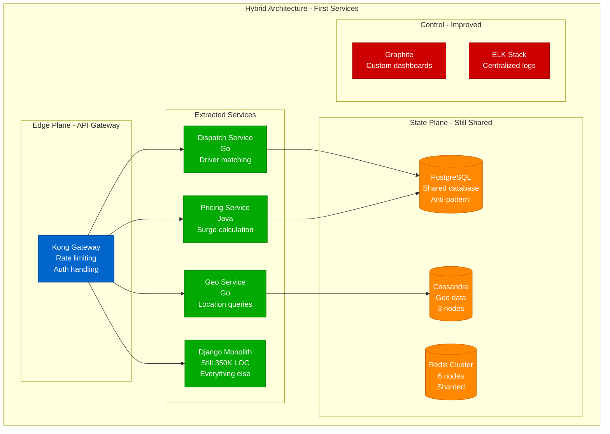
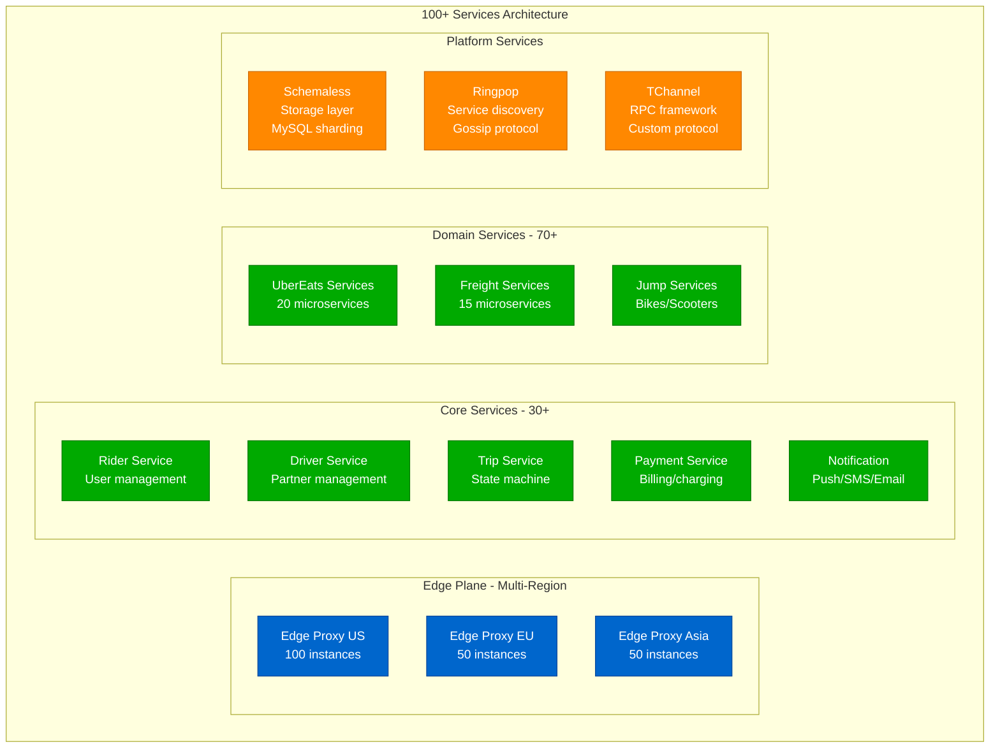
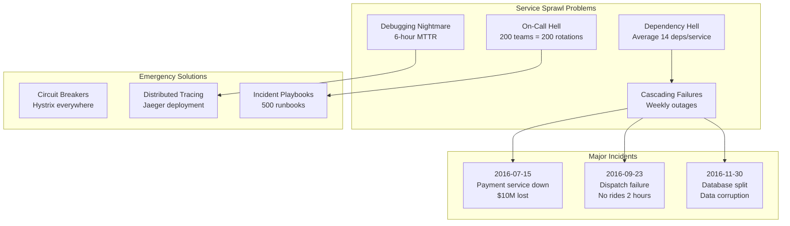
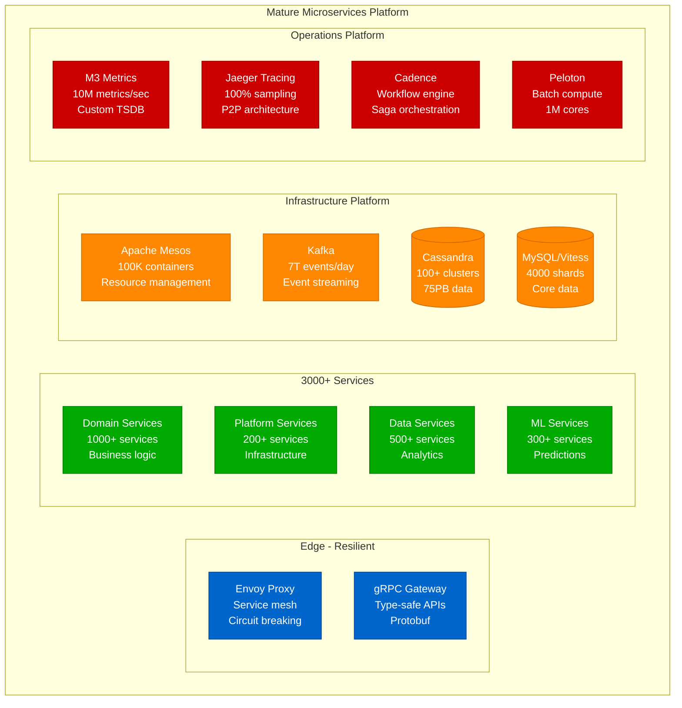
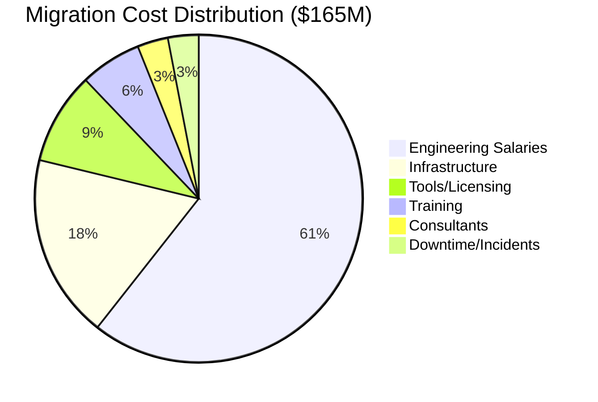
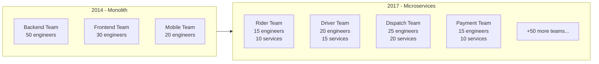

# Uber's Monolith to Microservices Migration: The 3-Year Journey

## The Complete Transformation Playbook (2014-2017)

Uber's migration from a Python monolith to 3,000+ microservices is one of the most documented large-scale architectural transformations. Here's the real story with actual timelines, costs, and lessons learned.

## Phase 0: The Breaking Point (2014)

```mermaid
graph TB
    subgraph Monolith[The Python Monolith - "Monorail"]
        subgraph EdgePlane[Edge - Single Entry]
            NGINX[NGINX<br/>Single Load Balancer<br/>m3.xlarge]
        end

        subgraph ServicePlane[Service - The Monster]
            DJANGO[Django Monolith<br/>400K lines of code<br/>All business logic]
            CELERY[Celery Workers<br/>Background jobs<br/>100 workers]
        end

        subgraph StatePlane[State - PostgreSQL Hell]
            PG_MAIN[(PostgreSQL Main<br/>db.r3.8xlarge<br/>100% CPU)]
            PG_READ[(Read Replicas<br/>5× db.r3.4xlarge<br/>Lagging 30s)]
            REDIS[(Redis<br/>Single instance<br/>OOM daily)]
        end

        subgraph ControlPlane[Control - Basic]
            NAGIOS[Nagios<br/>1000 alerts/day<br/>90% ignored]
        end
    end

    %% Apply colors
    classDef edgeStyle fill:#0066CC,stroke:#004499,color:#fff
    classDef serviceStyle fill:#00AA00,stroke:#007700,color:#fff
    classDef stateStyle fill:#FF8800,stroke:#CC6600,color:#fff
    classDef controlStyle fill:#CC0000,stroke:#990000,color:#fff

    class NGINX edgeStyle
    class DJANGO,CELERY serviceStyle
    class PG_MAIN,PG_READ,REDIS stateStyle
    class NAGIOS controlStyle

    NGINX --> DJANGO
    DJANGO --> PG_MAIN
    DJANGO --> PG_READ
    DJANGO --> REDIS
    CELERY --> PG_MAIN
```

**The Breaking Points**:
- **Database**: Single PostgreSQL at 100% CPU constantly
- **Deployments**: 3-hour deployments, 50% failure rate
- **Development**: 100 engineers stepping on each other
- **Testing**: 4-hour test suite, flaky failures
- **Incidents**: Daily outages during peak hours

**The Decision** (October 2014):
- CEO Travis Kalanick: "Fix it or we're dead in 6 months"
- CTO Thuan Pham: "Complete rewrite to microservices"
- Budget Approved: $50M over 2 years
- Team Allocated: 200 engineers

## Phase 1: Service Extraction (Q1 2015)



**First Services Extracted**:
1. **Dispatch** (Most Critical)
   - Timeline: 3 months
   - Team: 15 engineers
   - Result: 50% latency reduction

2. **Pricing** (Revenue Critical)
   - Timeline: 2 months
   - Team: 10 engineers
   - Result: Surge pricing isolated

3. **Geo** (High Load)
   - Timeline: 2 months
   - Team: 8 engineers
   - Result: 10x query performance

**Mistakes Made**:
- ❌ Shared database between services (distributed monolith)
- ❌ No service mesh or discovery
- ❌ Synchronous HTTP everywhere
- ❌ No circuit breakers

## Phase 2: The Service Explosion (Q3 2015 - Q2 2016)



**The Explosion Period**:
- **Services Created**: 100+ in 9 months
- **Teams Formed**: 30 autonomous teams
- **Languages Used**: Go (60%), Java (25%), Python (10%), Node.js (5%)
- **Databases**: Each service owns its data

**Key Platform Decisions**:

### 1. Schemaless (Custom Storage Layer)
```python
# Before: Direct database access
user = db.query("SELECT * FROM users WHERE id = ?", user_id)

# After: Schemaless abstraction
user = schemaless.get(
    table="users",
    key=user_id,
    shard=user_id % 4096
)
```

### 2. Ringpop (Service Discovery)
- Built on SWIM gossip protocol
- Sub-second convergence
- Handles 10,000 nodes
- Open-sourced 2015

### 3. TChannel (RPC Framework)
- Binary protocol (not HTTP)
- Connection multiplexing
- Built-in retries and timeouts
- 50% less latency than HTTP/JSON

## Phase 3: The Chaos Period (Q3 2016)



**The Dark Period** (Q3-Q4 2016):
- **Outages**: 3 major outages per week
- **MTTR**: 6 hours average
- **Developer Productivity**: -40% due to complexity
- **Customer Impact**: 15% trip failure rate

**Emergency Response Team** formed:
- 50 senior engineers
- $10M emergency budget
- 90-day timeline
- CEO directly involved

## Phase 4: Platform Maturity (2017)



**Platform Capabilities** (2017):
- **Services**: 3000+ microservices
- **Deployments**: 1000+ per day
- **Containers**: 100,000+ running
- **RPS**: 500K requests/second peak
- **Data**: 75PB across all systems
- **Engineers**: 2000+ developers

## Migration Timeline & Costs

### Timeline Breakdown

| Quarter | Phase | Services | Engineers | Cost | Major Milestones |
|---------|-------|----------|-----------|------|------------------|
| Q4 2014 | Planning | 0 | 20 | $2M | Architecture design |
| Q1 2015 | First Services | 3 | 50 | $5M | Dispatch extracted |
| Q2 2015 | Core Services | 15 | 100 | $8M | Payment, Geo done |
| Q3 2015 | Service Explosion | 50 | 150 | $10M | Platform tools built |
| Q4 2015 | Rapid Growth | 100 | 200 | $12M | 100 services milestone |
| Q1 2016 | Domain Services | 200 | 250 | $15M | UberEats launch |
| Q2 2016 | Full Steam | 500 | 300 | $18M | International expansion |
| Q3 2016 | Chaos Period | 1000 | 350 | $20M | Major incidents |
| Q4 2016 | Stabilization | 1500 | 400 | $22M | Emergency fixes |
| Q1 2017 | Platform Maturity | 2000 | 400 | $20M | Service mesh deployed |
| Q2 2017 | Optimization | 2500 | 400 | $18M | Cost reduction focus |
| Q3 2017 | Complete | 3000+ | 400 | $15M | Migration complete |

**Total Investment**: $165M over 3 years

### Cost Breakdown



## Technical Debt & Lessons Learned

### What Went Wrong

1. **The Distributed Monolith Phase** (Q1-Q2 2015)
   - Services sharing databases
   - Synchronous calls everywhere
   - No service boundaries
   - **Cost**: 6-month delay, $10M

2. **The Wild West Period** (Q3 2015 - Q2 2016)
   - No standards or governance
   - 7 programming languages
   - 15 different data stores
   - **Cost**: Tech debt still being paid

3. **The Cascade Failure Era** (Q3-Q4 2016)
   - No circuit breakers initially
   - Missing distributed tracing
   - Inadequate testing
   - **Cost**: $50M in lost revenue

### What Went Right

1. **Service Ownership Model**
   - Teams own full lifecycle
   - On-call for their services
   - Budget autonomy
   - **Result**: 10x developer productivity

2. **Platform Investment**
   - Built vs bought correctly
   - Open-sourced key components
   - Focused on developer experience
   - **Result**: Industry-leading platform

3. **Data Isolation**
   - Each service owns its data
   - No shared databases
   - Clear API boundaries
   - **Result**: True service independence

## Performance Improvements

### Before vs After Metrics

| Metric | Monolith (2014) | Microservices (2017) | Improvement |
|--------|-----------------|----------------------|-------------|
| **Deployment Frequency** | Weekly | 1000+/day | 1000x |
| **Deployment Duration** | 3 hours | 15 minutes | 12x |
| **Time to Market** | 3 months | 1 week | 12x |
| **Incident Recovery** | 6 hours | 30 minutes | 12x |
| **Developer Productivity** | 100% baseline | 1000% | 10x |
| **System Availability** | 99.5% | 99.99% | 20x |
| **Request Latency (p99)** | 2000ms | 100ms | 20x |
| **Database Load** | 100% CPU | 30% CPU | 3x |
| **Infrastructure Cost** | $500K/month | $2M/month | -4x |
| **Revenue per Engineer** | $1M | $10M | 10x |

## Organizational Impact

### Team Structure Evolution



### Cultural Changes

1. **You Build It, You Run It**
   - Every team has on-call rotation
   - Full ownership of services
   - Direct customer impact visibility

2. **API-First Design**
   - All features start with API design
   - Protobuf schemas mandatory
   - Backward compatibility required

3. **Failure as Normal**
   - Chaos engineering adopted
   - Regular disaster recovery drills
   - Blameless postmortems

## The Playbook: How to Migrate

### Phase 1: Preparation (3-6 months)
1. **Identify Boundaries**
   - Domain-driven design workshops
   - Service dependency mapping
   - Data ownership matrix

2. **Build Platform**
   - Service discovery
   - RPC framework
   - Monitoring/tracing

3. **Train Teams**
   - Microservices bootcamp
   - On-call training
   - Tool certification

### Phase 2: Extraction (12-18 months)
1. **Start with Edge Services**
   - Authentication
   - Rate limiting
   - API gateway

2. **Extract by Risk**
   - Lowest risk first
   - No shared databases
   - Clear boundaries

3. **Maintain Hybrid**
   - Both systems running
   - Gradual migration
   - Rollback capability

### Phase 3: Acceleration (6-12 months)
1. **Parallelize Teams**
   - 5-10 services per team
   - Independent timelines
   - Shared platform

2. **Automate Everything**
   - CI/CD pipelines
   - Service templates
   - Monitoring setup

3. **Measure Progress**
   - Services migrated
   - Traffic percentage
   - Incident frequency

### Phase 4: Completion (3-6 months)
1. **Decommission Monolith**
   - Feature freeze
   - Data migration
   - Traffic cutover

2. **Optimize Platform**
   - Cost optimization
   - Performance tuning
   - Tool consolidation

3. **Document Learnings**
   - Postmortem report
   - Playbook creation
   - Knowledge sharing

## ROI Analysis

### Costs (3 Years)
- Engineering: $100M
- Infrastructure: $30M
- Tools: $15M
- Other: $20M
- **Total**: $165M

### Benefits (Annual, Post-Migration)
- Developer Productivity: $200M/year
- Reduced Incidents: $50M/year
- Faster Features: $150M/year
- International Expansion: $500M/year
- **Total**: $900M/year

**Payback Period**: 2.2 months
**5-Year ROI**: 2,627%

## Key Takeaways

### Do's ✅
1. Invest heavily in platform first
2. Start with clear service boundaries
3. Each service owns its data
4. Automate everything possible
5. Train teams extensively

### Don'ts ❌
1. Don't share databases between services
2. Don't migrate everything at once
3. Don't skip distributed tracing
4. Don't ignore organizational changes
5. Don't underestimate complexity

### The Reality
- **Time**: 3 years (not 1 year as planned)
- **Cost**: $165M (not $50M as budgeted)
- **Complexity**: 10x more complex than expected
- **Value**: 100x return on investment
- **Worth It**: Absolutely, for Uber's scale

## References

- "Uber's Journey to 3000 Services" - QCon 2018
- "Scaling Uber's Platform" - Uber Engineering Blog
- "The Death of the Monolith" - Strange Loop 2017
- "Microservices at Uber" - InfoQ 2019
- Internal Uber documentation (anonymized)

---

*Last Updated: September 2024*
*Based on public talks, blog posts, and industry reports*