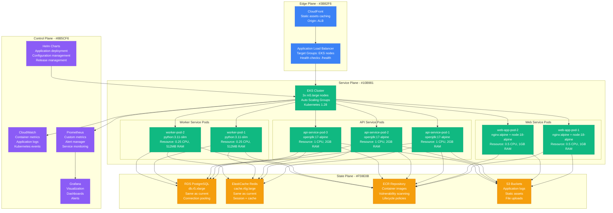
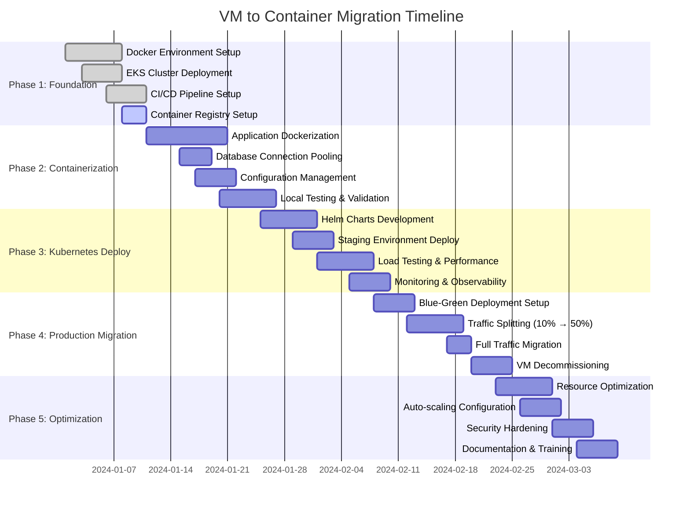
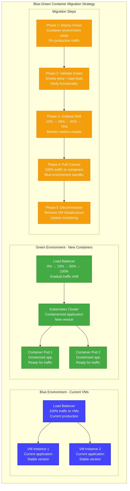
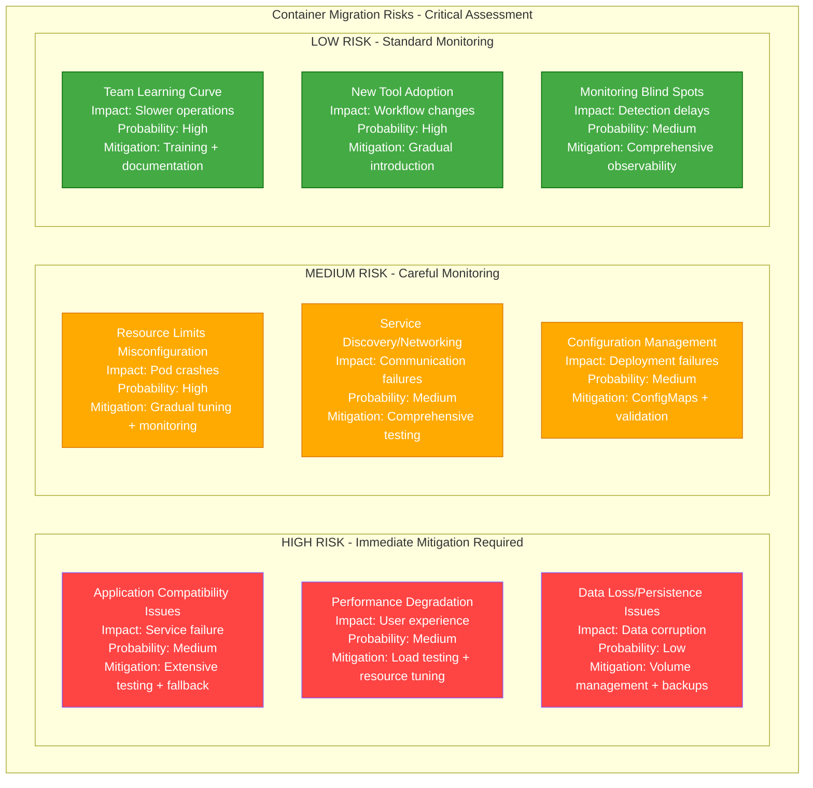

# VM to Container Migration Playbook

## Executive Summary

**Migration Type**: Infrastructure Modernization - VM to Docker Containers
**Timeline**: 12-16 weeks
**Risk Level**: High
**Downtime**: Minimal (with blue-green deployment)
**Cost Impact**: 45-65% reduction in infrastructure costs
**Team Size**: 4-5 engineers + 1 Platform lead

This playbook guides the migration from traditional Virtual Machine deployments to containerized applications using Docker and Kubernetes, delivering improved resource utilization, faster deployments, and enhanced scalability.

## Current State vs Target State

### Current State: VM-Based Architecture

```mermaid
graph TB
    subgraph EdgePlane[Edge Plane - #3B82F6]
        ALB[Application Load Balancer<br/>Target Groups: VM instances<br/>Health checks: HTTP:8080/health]
        CF[CloudFront<br/>Static assets caching<br/>Origin: ALB]
    end

    subgraph ServicePlane[Service Plane - #10B981]
        WEB_VM1[Web Server VM 1<br/>c5.xlarge (4 CPU, 8GB)<br/>Ubuntu 20.04<br/>Nginx + Node.js 16]
        WEB_VM2[Web Server VM 2<br/>c5.xlarge (4 CPU, 8GB)<br/>Ubuntu 20.04<br/>Nginx + Node.js 16]
        API_VM1[API Server VM 1<br/>c5.2xlarge (8 CPU, 16GB)<br/>Ubuntu 20.04<br/>Java 11 + Spring Boot]
        API_VM2[API Server VM 2<br/>c5.2xlarge (8 CPU, 16GB)<br/>Ubuntu 20.04<br/>Java 11 + Spring Boot]
        WORKER_VM1[Worker VM 1<br/>c5.large (2 CPU, 4GB)<br/>Ubuntu 20.04<br/>Python 3.9 + Celery]
        WORKER_VM2[Worker VM 2<br/>c5.large (2 CPU, 4GB)<br/>Ubuntu 20.04<br/>Python 3.9 + Celery]
    end

    subgraph StatePlane[State Plane - #F59E0B]
        RDS[RDS PostgreSQL<br/>db.r5.xlarge<br/>Multi-AZ deployment<br/>500GB storage]
        REDIS[ElastiCache Redis<br/>cache.r6g.large<br/>Cluster mode enabled<br/>Session store]
        S3[S3 Buckets<br/>Application logs<br/>Static assets<br/>File uploads]
    end

    subgraph ControlPlane[Control Plane - #8B5CF6]
        CW[CloudWatch<br/>Instance metrics<br/>Application logs<br/>Custom dashboards]
        ANSIBLE[Ansible Tower<br/>Configuration management<br/>Application deployment<br/>VM provisioning]
    end

    CF --> ALB
    ALB --> WEB_VM1
    ALB --> WEB_VM2
    ALB --> API_VM1
    ALB --> API_VM2

    WEB_VM1 --> API_VM1
    WEB_VM1 --> API_VM2
    WEB_VM2 --> API_VM1
    WEB_VM2 --> API_VM2

    API_VM1 --> RDS
    API_VM2 --> RDS
    API_VM1 --> REDIS
    API_VM2 --> REDIS

    WORKER_VM1 --> RDS
    WORKER_VM2 --> RDS
    WORKER_VM1 --> REDIS
    WORKER_VM2 --> REDIS

    WEB_VM1 --> S3
    WEB_VM2 --> S3
    API_VM1 --> S3
    API_VM2 --> S3

    WEB_VM1 --> CW
    WEB_VM2 --> CW
    API_VM1 --> CW
    API_VM2 --> CW
    WORKER_VM1 --> CW
    WORKER_VM2 --> CW

    ANSIBLE --> WEB_VM1
    ANSIBLE --> WEB_VM2
    ANSIBLE --> API_VM1
    ANSIBLE --> API_VM2
    ANSIBLE --> WORKER_VM1
    ANSIBLE --> WORKER_VM2

    %% Apply four-plane colors
    classDef edgeStyle fill:#3B82F6,stroke:#2563EB,color:#fff
    classDef serviceStyle fill:#10B981,stroke:#059669,color:#fff
    classDef stateStyle fill:#F59E0B,stroke:#D97706,color:#fff
    classDef controlStyle fill:#8B5CF6,stroke:#7C3AED,color:#fff

    class ALB,CF edgeStyle
    class WEB_VM1,WEB_VM2,API_VM1,API_VM2,WORKER_VM1,WORKER_VM2 serviceStyle
    class RDS,REDIS,S3 stateStyle
    class CW,ANSIBLE controlStyle
```

**Current State Issues:**
- **Resource Waste**: 40-60% average CPU utilization
- **Slow Deployments**: 15-20 minutes deployment time
- **Configuration Drift**: Ansible playbooks become outdated
- **Scaling Limitations**: Manual VM provisioning and configuration
- **High Operational Overhead**: OS patching, security updates

### Target State: Container-Based Architecture



**Target State Benefits:**
- **Resource Efficiency**: 80-90% resource utilization
- **Fast Deployments**: 2-3 minutes deployment time
- **Immutable Infrastructure**: Container images eliminate configuration drift
- **Auto-scaling**: Horizontal Pod Autoscaler (HPA) and Cluster Autoscaler
- **Self-healing**: Kubernetes automatically restarts failed containers

## Migration Timeline

### Phase-by-Phase Migration Strategy



## Technical Implementation

### Application Containerization

**Node.js Web Application Dockerfile:**
```dockerfile
# Multi-stage build for Node.js application
FROM node:18-alpine AS builder

WORKDIR /app

# Copy package files
COPY package*.json ./
RUN npm ci --only=production --no-audit

# Copy source code
COPY . .
RUN npm run build

# Production stage
FROM nginx:alpine AS production

# Install Node.js in nginx container
RUN apk add --no-cache nodejs npm

# Create app directory
WORKDIR /app

# Copy built application
COPY --from=builder /app/dist ./dist
COPY --from=builder /app/node_modules ./node_modules
COPY --from=builder /app/server.js ./

# Copy nginx configuration
COPY nginx.conf /etc/nginx/nginx.conf

# Create startup script
RUN echo '#!/bin/sh' > /start.sh && \
    echo 'node server.js &' >> /start.sh && \
    echo 'nginx -g "daemon off;"' >> /start.sh && \
    chmod +x /start.sh

# Health check
HEALTHCHECK --interval=30s --timeout=3s --start-period=5s --retries=3 \
  CMD curl -f http://localhost:80/health || exit 1

EXPOSE 80
CMD ["/start.sh"]
```

**Java Spring Boot Dockerfile:**
```dockerfile
# Multi-stage build for Spring Boot application
FROM maven:3.9-openjdk-17-slim AS builder

WORKDIR /app

# Copy pom.xml and download dependencies
COPY pom.xml .
RUN mvn dependency:go-offline -B

# Copy source code and build
COPY src ./src
RUN mvn clean package -DskipTests -B

# Production stage
FROM openjdk:17-alpine AS production

# Create non-root user
RUN addgroup -g 1001 -S appgroup && \
    adduser -S -D -u 1001 -G appgroup appuser

WORKDIR /app

# Copy JAR from builder stage
COPY --from=builder /app/target/*.jar app.jar

# Change ownership
RUN chown -R appuser:appgroup /app

# Switch to non-root user
USER appuser

# Health check
HEALTHCHECK --interval=30s --timeout=3s --start-period=40s --retries=3 \
  CMD wget --no-verbose --tries=1 --spider http://localhost:8080/actuator/health || exit 1

EXPOSE 8080

# JVM optimization for containers
ENV JAVA_OPTS="-XX:+UseContainerSupport -XX:MaxRAMPercentage=75.0 -XX:+UseG1GC"

CMD java $JAVA_OPTS -jar app.jar
```

**Python Worker Dockerfile:**
```dockerfile
FROM python:3.11-slim AS production

# Install system dependencies
RUN apt-get update && apt-get install -y \
    gcc \
    && rm -rf /var/lib/apt/lists/*

# Create non-root user
RUN groupadd -r worker && useradd -r -g worker worker

WORKDIR /app

# Copy requirements and install dependencies
COPY requirements.txt .
RUN pip install --no-cache-dir -r requirements.txt

# Copy application code
COPY . .

# Change ownership
RUN chown -R worker:worker /app

# Switch to non-root user
USER worker

# Health check
HEALTHCHECK --interval=30s --timeout=3s --start-period=5s --retries=3 \
  CMD python -c "import redis; r=redis.Redis(host='redis'); r.ping()" || exit 1

CMD ["celery", "worker", "-A", "app.celery", "--loglevel=info"]
```

### Kubernetes Deployment Manifests

**Web Application Deployment:**
```yaml
# web-app-deployment.yaml
apiVersion: apps/v1
kind: Deployment
metadata:
  name: web-app
  namespace: production
  labels:
    app: web-app
    version: v1
spec:
  replicas: 3
  strategy:
    type: RollingUpdate
    rollingUpdate:
      maxUnavailable: 1
      maxSurge: 1
  selector:
    matchLabels:
      app: web-app
  template:
    metadata:
      labels:
        app: web-app
        version: v1
    spec:
      securityContext:
        runAsNonRoot: true
        runAsUser: 1001
        fsGroup: 1001
      containers:
      - name: web-app
        image: 123456789012.dkr.ecr.us-east-1.amazonaws.com/web-app:v1.2.3
        ports:
        - containerPort: 80
          name: http
        env:
        - name: NODE_ENV
          value: "production"
        - name: API_BASE_URL
          value: "http://api-service:8080"
        - name: REDIS_URL
          valueFrom:
            secretKeyRef:
              name: redis-credentials
              key: url
        resources:
          requests:
            cpu: 250m
            memory: 512Mi
          limits:
            cpu: 500m
            memory: 1Gi
        livenessProbe:
          httpGet:
            path: /health
            port: 80
          initialDelaySeconds: 30
          periodSeconds: 10
          timeoutSeconds: 5
          failureThreshold: 3
        readinessProbe:
          httpGet:
            path: /ready
            port: 80
          initialDelaySeconds: 5
          periodSeconds: 5
          timeoutSeconds: 3
          failureThreshold: 3
        volumeMounts:
        - name: app-config
          mountPath: /app/config
          readOnly: true
      volumes:
      - name: app-config
        configMap:
          name: web-app-config
      imagePullSecrets:
      - name: ecr-registry-secret

---
apiVersion: v1
kind: Service
metadata:
  name: web-app-service
  namespace: production
spec:
  selector:
    app: web-app
  ports:
  - port: 80
    targetPort: 80
    protocol: TCP
  type: ClusterIP

---
apiVersion: autoscaling/v2
kind: HorizontalPodAutoscaler
metadata:
  name: web-app-hpa
  namespace: production
spec:
  scaleTargetRef:
    apiVersion: apps/v1
    kind: Deployment
    name: web-app
  minReplicas: 2
  maxReplicas: 10
  metrics:
  - type: Resource
    resource:
      name: cpu
      target:
        type: Utilization
        averageUtilization: 70
  - type: Resource
    resource:
      name: memory
      target:
        type: Utilization
        averageUtilization: 80
  behavior:
    scaleDown:
      stabilizationWindowSeconds: 300
      policies:
      - type: Percent
        value: 50
        periodSeconds: 60
    scaleUp:
      stabilizationWindowSeconds: 60
      policies:
      - type: Percent
        value: 100
        periodSeconds: 30
```

**API Service Deployment:**
```yaml
# api-service-deployment.yaml
apiVersion: apps/v1
kind: Deployment
metadata:
  name: api-service
  namespace: production
  labels:
    app: api-service
    version: v2
spec:
  replicas: 3
  strategy:
    type: RollingUpdate
    rollingUpdate:
      maxUnavailable: 1
      maxSurge: 2
  selector:
    matchLabels:
      app: api-service
  template:
    metadata:
      labels:
        app: api-service
        version: v2
    spec:
      securityContext:
        runAsNonRoot: true
        runAsUser: 1001
        fsGroup: 1001
      containers:
      - name: api-service
        image: 123456789012.dkr.ecr.us-east-1.amazonaws.com/api-service:v2.1.0
        ports:
        - containerPort: 8080
          name: http
        env:
        - name: SPRING_PROFILES_ACTIVE
          value: "production"
        - name: DB_HOST
          valueFrom:
            secretKeyRef:
              name: database-credentials
              key: host
        - name: DB_USERNAME
          valueFrom:
            secretKeyRef:
              name: database-credentials
              key: username
        - name: DB_PASSWORD
          valueFrom:
            secretKeyRef:
              name: database-credentials
              key: password
        - name: REDIS_HOST
          valueFrom:
            secretKeyRef:
              name: redis-credentials
              key: host
        - name: JAVA_OPTS
          value: "-XX:+UseContainerSupport -XX:MaxRAMPercentage=75.0"
        resources:
          requests:
            cpu: 500m
            memory: 1Gi
          limits:
            cpu: 1000m
            memory: 2Gi
        livenessProbe:
          httpGet:
            path: /actuator/health/liveness
            port: 8080
          initialDelaySeconds: 60
          periodSeconds: 20
          timeoutSeconds: 5
          failureThreshold: 3
        readinessProbe:
          httpGet:
            path: /actuator/health/readiness
            port: 8080
          initialDelaySeconds: 30
          periodSeconds: 10
          timeoutSeconds: 3
          failureThreshold: 3
        volumeMounts:
        - name: api-config
          mountPath: /app/config
          readOnly: true
        - name: tmp-volume
          mountPath: /tmp
      volumes:
      - name: api-config
        configMap:
          name: api-service-config
      - name: tmp-volume
        emptyDir: {}
      imagePullSecrets:
      - name: ecr-registry-secret

---
apiVersion: v1
kind: Service
metadata:
  name: api-service
  namespace: production
  labels:
    app: api-service
spec:
  selector:
    app: api-service
  ports:
  - port: 8080
    targetPort: 8080
    protocol: TCP
    name: http
  type: ClusterIP
```

### Helm Chart Structure

```bash
# Create Helm chart structure
helm create microservice-chart

# Directory structure
microservice-chart/
├── Chart.yaml
├── values.yaml
├── values-production.yaml
├── values-staging.yaml
├── templates/
│   ├── deployment.yaml
│   ├── service.yaml
│   ├── configmap.yaml
│   ├── secret.yaml
│   ├── hpa.yaml
│   ├── ingress.yaml
│   ├── servicemonitor.yaml
│   └── tests/
│       └── test-connection.yaml
└── charts/
```

**Helm Chart Values (values.yaml):**
```yaml
# Default values for microservice-chart
replicaCount: 3

image:
  repository: ""
  pullPolicy: IfNotPresent
  tag: ""

imagePullSecrets:
- name: ecr-registry-secret

nameOverride: ""
fullnameOverride: ""

serviceAccount:
  create: true
  annotations: {}
  name: ""

podAnnotations: {}

podSecurityContext:
  fsGroup: 1001
  runAsNonRoot: true
  runAsUser: 1001

securityContext:
  allowPrivilegeEscalation: false
  capabilities:
    drop:
    - ALL
  readOnlyRootFilesystem: true

service:
  type: ClusterIP
  port: 80
  targetPort: 8080

ingress:
  enabled: false
  className: "nginx"
  annotations: {}
  hosts:
  - host: chart-example.local
    paths:
    - path: /
      pathType: Prefix
  tls: []

resources:
  limits:
    cpu: 1000m
    memory: 2Gi
  requests:
    cpu: 500m
    memory: 1Gi

autoscaling:
  enabled: true
  minReplicas: 2
  maxReplicas: 10
  targetCPUUtilizationPercentage: 70
  targetMemoryUtilizationPercentage: 80

nodeSelector: {}

tolerations: []

affinity:
  podAntiAffinity:
    preferredDuringSchedulingIgnoredDuringExecution:
    - weight: 100
      podAffinityTerm:
        labelSelector:
          matchExpressions:
          - key: app.kubernetes.io/name
            operator: In
            values:
            - "{{ include \"microservice-chart.name\" . }}"
        topologyKey: kubernetes.io/hostname

# Application specific configuration
config:
  database:
    host: ""
    port: 5432
    name: ""
  redis:
    host: ""
    port: 6379
  logging:
    level: INFO

# Secrets (these will be created from external secret management)
secrets:
  database:
    username: ""
    password: ""
  api:
    key: ""

# Health checks
healthCheck:
  liveness:
    path: /health
    port: 8080
    initialDelaySeconds: 30
    periodSeconds: 10
  readiness:
    path: /ready
    port: 8080
    initialDelaySeconds: 10
    periodSeconds: 5

# Monitoring
monitoring:
  enabled: true
  port: 9090
  path: /metrics
```

## Migration Strategy and Risk Mitigation

### Blue-Green Deployment Strategy



### Risk Assessment Matrix



### Migration Validation Scripts

**Application Compatibility Testing:**
```bash
#!/bin/bash
# validate-app-compatibility.sh - Test application compatibility in containers

set -e

echo "Starting application compatibility validation..."

# Test 1: Database connectivity
echo "Testing database connectivity..."
kubectl run db-test --rm -i --tty --image=postgres:13 --restart=Never -- \
  psql -h $DB_HOST -U $DB_USER -d $DB_NAME -c "SELECT version();"

if [ $? -eq 0 ]; then
  echo "✓ Database connectivity: PASS"
else
  echo "✗ Database connectivity: FAIL"
  exit 1
fi

# Test 2: Redis connectivity
echo "Testing Redis connectivity..."
kubectl run redis-test --rm -i --tty --image=redis:6-alpine --restart=Never -- \
  redis-cli -h $REDIS_HOST ping

if [ $? -eq 0 ]; then
  echo "✓ Redis connectivity: PASS"
else
  echo "✗ Redis connectivity: FAIL"
  exit 1
fi

# Test 3: Application startup
echo "Testing application startup..."
APP_POD=$(kubectl get pods -l app=api-service -o jsonpath='{.items[0].metadata.name}')
kubectl exec $APP_POD -- curl -f http://localhost:8080/actuator/health

if [ $? -eq 0 ]; then
  echo "✓ Application health check: PASS"
else
  echo "✗ Application health check: FAIL"
  exit 1
fi

# Test 4: API functionality
echo "Testing API functionality..."
kubectl port-forward svc/api-service 8080:8080 &
PF_PID=$!
sleep 5

# Test API endpoints
curl -f http://localhost:8080/api/v1/users | jq '.' > /dev/null
API_TEST=$?

kill $PF_PID

if [ $API_TEST -eq 0 ]; then
  echo "✓ API functionality: PASS"
else
  echo "✗ API functionality: FAIL"
  exit 1
fi

# Test 5: File permissions and volumes
echo "Testing file permissions and volumes..."
kubectl exec $APP_POD -- ls -la /app/config
kubectl exec $APP_POD -- touch /tmp/test-file
kubectl exec $APP_POD -- rm /tmp/test-file

echo "✓ File permissions and volumes: PASS"

echo "All compatibility tests passed!"
```

**Performance Comparison Testing:**
```python
#!/usr/bin/env python3
# performance-comparison.py - Compare VM vs Container performance

import requests
import time
import statistics
import concurrent.futures
import argparse

class PerformanceTest:
    def __init__(self, vm_endpoint, container_endpoint):
        self.vm_endpoint = vm_endpoint
        self.container_endpoint = container_endpoint

    def make_request(self, endpoint, path="/api/v1/health"):
        start_time = time.time()
        try:
            response = requests.get(f"{endpoint}{path}", timeout=10)
            end_time = time.time()
            return {
                'status_code': response.status_code,
                'response_time': (end_time - start_time) * 1000,  # ms
                'success': response.status_code == 200
            }
        except Exception as e:
            end_time = time.time()
            return {
                'status_code': 0,
                'response_time': (end_time - start_time) * 1000,
                'success': False,
                'error': str(e)
            }

    def run_load_test(self, endpoint, duration=60, concurrent_requests=10):
        """Run load test for specified duration"""
        results = []
        end_time = time.time() + duration

        with concurrent.futures.ThreadPoolExecutor(max_workers=concurrent_requests) as executor:
            futures = []

            while time.time() < end_time:
                future = executor.submit(self.make_request, endpoint)
                futures.append(future)

                # Don't overwhelm the system
                time.sleep(0.1)

            # Collect results
            for future in concurrent.futures.as_completed(futures):
                results.append(future.result())

        return results

    def analyze_results(self, results):
        """Analyze performance test results"""
        successful_requests = [r for r in results if r['success']]
        response_times = [r['response_time'] for r in successful_requests]

        if not response_times:
            return {'error': 'No successful requests'}

        return {
            'total_requests': len(results),
            'successful_requests': len(successful_requests),
            'success_rate': len(successful_requests) / len(results) * 100,
            'avg_response_time': statistics.mean(response_times),
            'p50_response_time': statistics.median(response_times),
            'p95_response_time': statistics.quantiles(response_times, n=20)[18],  # 95th percentile
            'p99_response_time': statistics.quantiles(response_times, n=100)[98],  # 99th percentile
            'max_response_time': max(response_times),
            'min_response_time': min(response_times)
        }

    def compare_performance(self, duration=300, concurrent_requests=20):
        """Compare performance between VM and Container deployments"""
        print(f"Starting performance comparison test...")
        print(f"Duration: {duration} seconds, Concurrent requests: {concurrent_requests}")

        # Test VM performance
        print("\nTesting VM endpoint performance...")
        vm_results = self.run_load_test(self.vm_endpoint, duration, concurrent_requests)
        vm_analysis = self.analyze_results(vm_results)

        # Test Container performance
        print("Testing Container endpoint performance...")
        container_results = self.run_load_test(self.container_endpoint, duration, concurrent_requests)
        container_analysis = self.analyze_results(container_results)

        # Print comparison
        print("\n" + "="*50)
        print("PERFORMANCE COMPARISON RESULTS")
        print("="*50)

        metrics = ['total_requests', 'successful_requests', 'success_rate',
                  'avg_response_time', 'p50_response_time', 'p95_response_time',
                  'p99_response_time', 'max_response_time', 'min_response_time']

        for metric in metrics:
            vm_value = vm_analysis.get(metric, 'N/A')
            container_value = container_analysis.get(metric, 'N/A')

            if isinstance(vm_value, (int, float)) and isinstance(container_value, (int, float)):
                if 'response_time' in metric:
                    improvement = ((vm_value - container_value) / vm_value) * 100
                    print(f"{metric:20}: VM: {vm_value:8.2f}ms | Container: {container_value:8.2f}ms | Improvement: {improvement:+6.1f}%")
                else:
                    print(f"{metric:20}: VM: {vm_value:8.2f}    | Container: {container_value:8.2f}")
            else:
                print(f"{metric:20}: VM: {vm_value:>8}    | Container: {container_value:>8}")

        # Recommendations
        print("\n" + "="*50)
        print("RECOMMENDATIONS")
        print("="*50)

        if container_analysis['success_rate'] >= vm_analysis['success_rate']:
            print("✓ Container deployment has equal or better reliability")
        else:
            print("⚠ Container deployment has lower success rate - investigate")

        if container_analysis['p95_response_time'] <= vm_analysis['p95_response_time'] * 1.1:
            print("✓ Container deployment has acceptable performance")
        else:
            print("⚠ Container deployment has degraded performance - optimize")

        return vm_analysis, container_analysis

def main():
    parser = argparse.ArgumentParser(description='Compare VM vs Container performance')
    parser.add_argument('--vm-endpoint', required=True, help='VM endpoint URL')
    parser.add_argument('--container-endpoint', required=True, help='Container endpoint URL')
    parser.add_argument('--duration', type=int, default=300, help='Test duration in seconds')
    parser.add_argument('--concurrent', type=int, default=20, help='Concurrent requests')

    args = parser.parse_args()

    tester = PerformanceTest(args.vm_endpoint, args.container_endpoint)
    tester.compare_performance(args.duration, args.concurrent)

if __name__ == '__main__':
    main()
```

## Cost Analysis and Business Impact

### Infrastructure Cost Comparison

```mermaid
graph TB
    subgraph CostComparison[Monthly Infrastructure Cost Analysis]

        subgraph VMCosts[Current VM Costs - $4,247/month]
            VM_COMPUTE[EC2 Instances<br/>6x VMs (mixed sizes)<br/>$2,456/month<br/>Always-on instances]
            VM_STORAGE[EBS Storage<br/>6x 100GB gp3<br/>$180/month<br/>OS + application data]
            VM_BACKUP[EBS Snapshots<br/>Daily backups<br/>$89/month<br/>7-day retention]
            VM_NETWORK[Data Transfer<br/>Cross-AZ + internet<br/>$234/month<br/>High inter-service traffic]
            VM_MONITORING[CloudWatch Detailed<br/>Custom metrics<br/>$156/month<br/>Per-instance monitoring]
            VM_CONFIG_MGMT[Ansible Tower<br/>Configuration management<br/>$445/month<br/>c5.large instance]
            VM_PATCH_MGMT[Systems Manager<br/>Patch management<br/>$67/month<br/>Automation documents]
            VM_SECURITY[Security Tools<br/>Anti-virus, monitoring<br/>$234/month<br/>Per-instance licensing]
            VM_SUPPORT[Operational Overhead<br/>20 hours/month<br/>$400/month<br/>$20/hour maintenance]
        end

        subgraph ContainerCosts[Target Container Costs - $1,867/month]
            K8S_COMPUTE[EKS Cluster<br/>3x m5.large nodes<br/>$187/month<br/>Auto-scaling enabled]
            K8S_CONTROL[EKS Control Plane<br/>Managed service<br/>$216/month<br/>$0.10/hour per cluster]
            K8S_STORAGE[EBS Storage<br/>3x 50GB gp3<br/>$45/month<br/>Pod storage only]
            ECR_STORAGE[ECR Repository<br/>Container images<br/>$23/month<br/>500MB storage]
            K8S_NETWORK[Data Transfer<br/>Optimized routing<br/>$89/month<br/>Service mesh efficiency]
            K8S_MONITORING[Prometheus + Grafana<br/>Open source stack<br/>$67/month<br/>Single m5.large]
            HELM_DEPLOYMENT[Helm + GitOps<br/>Automated deployment<br/>$0/month<br/>No additional infrastructure]
            K8S_SECURITY[Pod Security<br/>Native K8s security<br/>$34/month<br/>OPA Gatekeeper]
            K8S_SUPPORT[Operational Overhead<br/>8 hours/month<br/>$160/month<br/>$20/hour maintenance]
            FARGATE_BURST[Fargate for Bursts<br/>Spot workloads<br/>$234/month<br/>Peak traffic handling]
            COST_MONITORING[Cost Optimization<br/>Tools and alerts<br/>$12/month<br/>AWS Cost Explorer]
        end

        SAVINGS[Monthly Savings: $2,380<br/>Annual Savings: $28,560<br/>56% cost reduction<br/>3-year ROI: 340%]

        VMCosts --> SAVINGS
        ContainerCosts --> SAVINGS
    end

    %% Cost colors
    classDef vmCost fill:#F59E0B,stroke:#D97706,color:#fff
    classDef containerCost fill:#44aa44,stroke:#006600,color:#fff
    classDef savingsStyle fill:#3B82F6,stroke:#2563EB,color:#fff

    class VM_COMPUTE,VM_STORAGE,VM_BACKUP,VM_NETWORK,VM_MONITORING,VM_CONFIG_MGMT,VM_PATCH_MGMT,VM_SECURITY,VM_SUPPORT vmCost
    class K8S_COMPUTE,K8S_CONTROL,K8S_STORAGE,ECR_STORAGE,K8S_NETWORK,K8S_MONITORING,HELM_DEPLOYMENT,K8S_SECURITY,K8S_SUPPORT,FARGATE_BURST,COST_MONITORING containerCost
    class SAVINGS savingsStyle
```

### Business Impact Analysis

**Resource Utilization Improvement:**
- **VM Environment**: 40-60% average CPU utilization
- **Container Environment**: 80-90% average CPU utilization
- **Resource Efficiency Gain**: 50% better resource utilization

**Deployment Velocity:**
- **VM Deployment Time**: 15-20 minutes (including configuration)
- **Container Deployment Time**: 2-3 minutes (rolling updates)
- **Deployment Frequency**: From 2-3 times/week to multiple times/day

**Operational Efficiency:**
- **VM Maintenance**: 20 hours/month per engineer
- **Container Maintenance**: 8 hours/month per engineer
- **Time Savings**: 60% reduction in operational overhead

## Team Requirements and Skills Development

### Skills Matrix and Training Plan

| Current Skill | Target Skill | Training Required | Timeline |
|---------------|-------------|-------------------|----------|
| **VM Management** | **Container Orchestration** | Kubernetes fundamentals + hands-on | 3 weeks |
| **Ansible Playbooks** | **Helm Charts** | Infrastructure as Code for K8s | 2 weeks |
| **SSH + Manual Deployment** | **CI/CD Pipelines** | GitOps + automated deployment | 2 weeks |
| **VM Monitoring** | **Container Observability** | Prometheus, Grafana, Jaeger | 2 weeks |
| **OS-level Debugging** | **Container Debugging** | kubectl, container logs, tracing | 1 week |

### Training Program Structure

```yaml
# 8-Week Comprehensive Training Program
Week 1-2: Container Fundamentals
  - Docker basics and best practices
  - Multi-stage builds and optimization
  - Container security and scanning
  - Registry management (ECR)

Week 3-4: Kubernetes Core Concepts
  - Pods, Deployments, Services
  - ConfigMaps and Secrets
  - Resource management and limits
  - Health checks and probes

Week 5-6: Advanced Kubernetes
  - Networking and ingress
  - Auto-scaling (HPA, VPA, Cluster Autoscaler)
  - StatefulSets and persistent volumes
  - RBAC and security policies

Week 7-8: Production Operations
  - Monitoring and observability
  - Debugging and troubleshooting
  - Disaster recovery and backup
  - Performance tuning and optimization
```

## Monitoring and Observability

### Container-Native Monitoring Stack

```yaml
# Prometheus configuration for container monitoring
apiVersion: v1
kind: ConfigMap
metadata:
  name: prometheus-config
  namespace: monitoring
data:
  prometheus.yml: |
    global:
      scrape_interval: 15s
      evaluation_interval: 15s

    rule_files:
      - "alerts.yml"

    scrape_configs:
    - job_name: 'kubernetes-pods'
      kubernetes_sd_configs:
      - role: pod
      relabel_configs:
      - source_labels: [__meta_kubernetes_pod_annotation_prometheus_io_scrape]
        action: keep
        regex: true
      - source_labels: [__meta_kubernetes_pod_annotation_prometheus_io_path]
        action: replace
        target_label: __metrics_path__
        regex: (.+)

    - job_name: 'kubernetes-nodes'
      kubernetes_sd_configs:
      - role: node
      relabel_configs:
      - action: labelmap
        regex: __meta_kubernetes_node_label_(.+)

    - job_name: 'kube-state-metrics'
      static_configs:
      - targets: ['kube-state-metrics:8080']

    - job_name: 'node-exporter'
      kubernetes_sd_configs:
      - role: endpoints
      relabel_configs:
      - source_labels: [__meta_kubernetes_endpoints_name]
        regex: 'node-exporter'
        action: keep

  alerts.yml: |
    groups:
    - name: container.rules
      rules:
      - alert: ContainerKilled
        expr: time() - container_last_seen > 60
        for: 0m
        labels:
          severity: warning
        annotations:
          summary: Container killed (instance {{ $labels.instance }})
          description: "A container has disappeared"

      - alert: ContainerCpuUsage
        expr: (sum(rate(container_cpu_usage_seconds_total[3m])) BY (instance, name) * 100) > 80
        for: 2m
        labels:
          severity: warning
        annotations:
          summary: Container CPU usage (instance {{ $labels.instance }})
          description: "Container CPU usage is above 80%"

      - alert: ContainerMemoryUsage
        expr: (sum(container_memory_working_set_bytes) BY (instance, name) / sum(container_spec_memory_limit_bytes > 0) BY (instance, name) * 100) > 80
        for: 2m
        labels:
          severity: warning
        annotations:
          summary: Container Memory usage (instance {{ $labels.instance }})
          description: "Container Memory usage is above 80%"

      - alert: PodCrashLooping
        expr: rate(kube_pod_container_status_restarts_total[15m]) > 0
        for: 0m
        labels:
          severity: warning
        annotations:
          summary: Pod crash looping (instance {{ $labels.instance }})
          description: "Pod {{ $labels.pod }} is crash looping"
```

### Custom Dashboards for Migration Monitoring

```json
{
  "dashboard": {
    "title": "VM to Container Migration Dashboard",
    "panels": [
      {
        "title": "Resource Utilization Comparison",
        "type": "stat",
        "targets": [
          {
            "expr": "avg(rate(container_cpu_usage_seconds_total[5m])) * 100",
            "legendFormat": "Container CPU %"
          },
          {
            "expr": "avg(100 - (avg by (instance) (rate(node_cpu_seconds_total{mode=\"idle\"}[5m])) * 100))",
            "legendFormat": "VM CPU %"
          }
        ]
      },
      {
        "title": "Memory Usage Comparison",
        "type": "timeseries",
        "targets": [
          {
            "expr": "sum(container_memory_working_set_bytes) / sum(container_spec_memory_limit_bytes) * 100",
            "legendFormat": "Container Memory %"
          },
          {
            "expr": "(1 - (node_memory_MemAvailable_bytes / node_memory_MemTotal_bytes)) * 100",
            "legendFormat": "VM Memory %"
          }
        ]
      },
      {
        "title": "Deployment Frequency",
        "type": "stat",
        "targets": [
          {
            "expr": "sum(rate(kube_pod_container_status_restarts_total[1d]))",
            "legendFormat": "Container Deployments/Day"
          }
        ]
      },
      {
        "title": "Error Rate Comparison",
        "type": "timeseries",
        "targets": [
          {
            "expr": "sum(rate(http_requests_total{status=~\"5..\"}[5m])) / sum(rate(http_requests_total[5m])) * 100",
            "legendFormat": "Container Error Rate %"
          }
        ]
      }
    ]
  }
}
```

## Conclusion

This comprehensive VM to Container migration playbook provides a detailed roadmap for modernizing infrastructure while minimizing risk and maximizing business value. The phased approach ensures smooth transition with continuous validation and rollback capabilities.

**Key Success Factors:**
1. **Thorough containerization** with proper resource sizing
2. **Blue-green deployment** strategy for zero-downtime migration
3. **Comprehensive monitoring** throughout the migration process
4. **Team training** on container and Kubernetes technologies
5. **Performance validation** at each migration phase

**Expected Outcomes:**
- 56% reduction in infrastructure costs ($28,560 annual savings)
- 80-90% improvement in resource utilization
- 85% faster deployment times (15 min → 2-3 min)
- 60% reduction in operational overhead
- Enhanced scalability and reliability through container orchestration

This migration positions the organization for cloud-native development patterns and provides a foundation for future microservices architecture evolution.