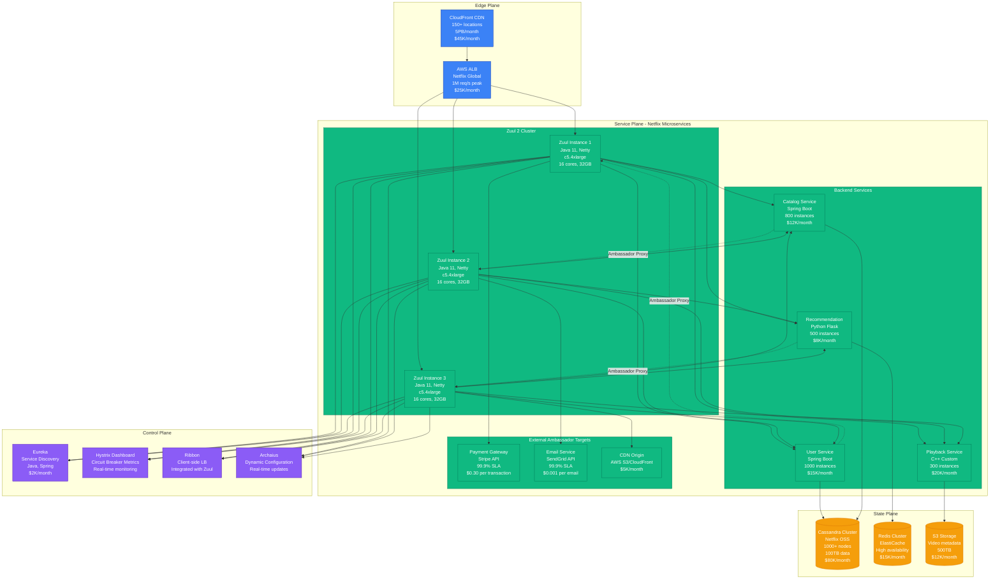
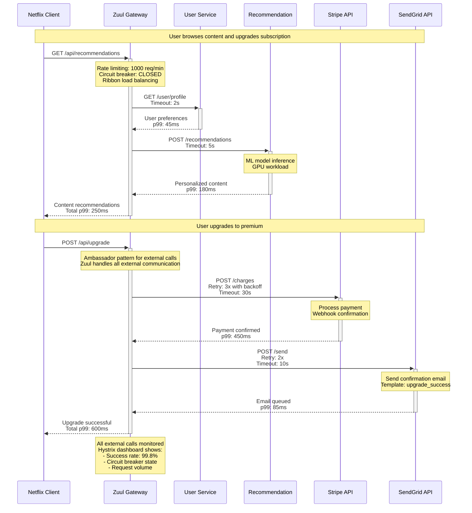
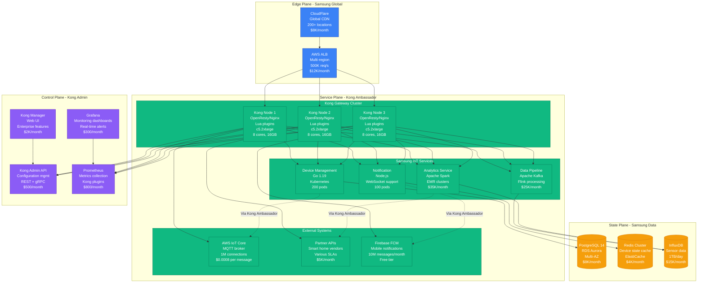
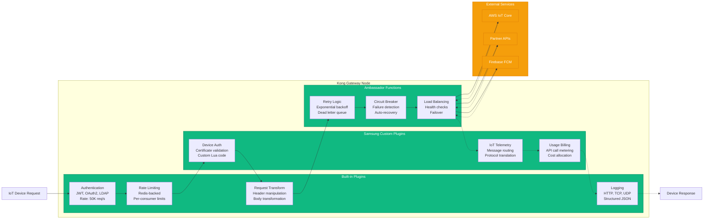
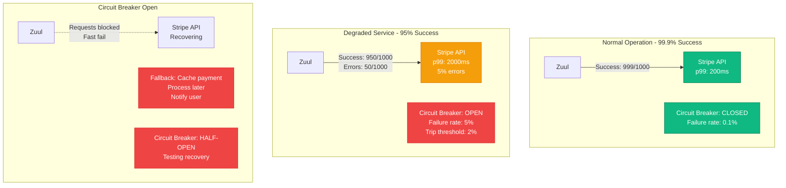
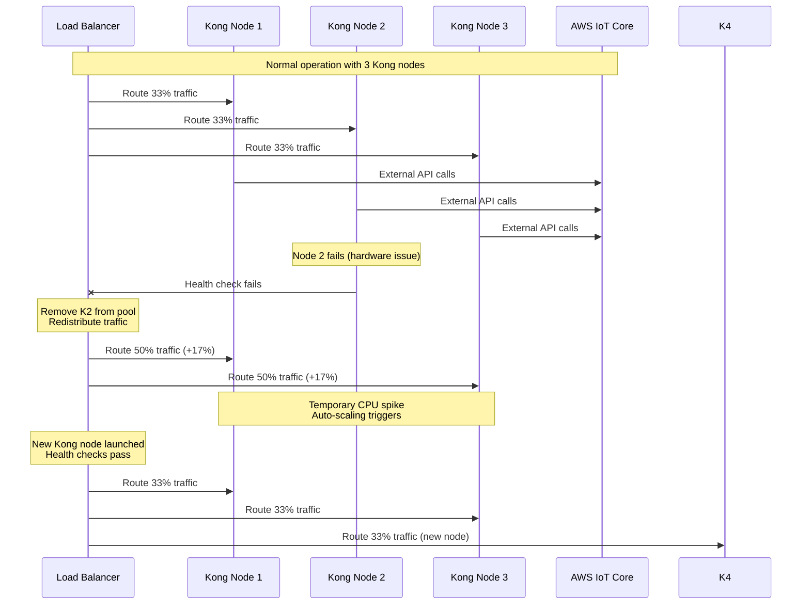

# Ambassador Pattern: Production Implementation

## Overview

The Ambassador Pattern provides a dedicated proxy that handles external service communication on behalf of the application. Unlike sidecars that handle all traffic, ambassadors focus specifically on outbound calls to external services, providing retry logic, circuit breaking, and protocol translation.

## Production Implementation: Netflix Zuul - The Gateway Revolution

Netflix pioneered the Ambassador pattern with Zuul in 2013 to handle the complex routing and resilience patterns needed for their microservices architecture. Zuul 2 now handles 100+ million requests per day across Netflix's global infrastructure.

### Complete Architecture - Netflix Zuul in Production



### Request Flow - Netflix Content Discovery



## Kong API Gateway - Enterprise Ambassador Pattern

Kong powers production traffic for companies like Samsung, Nasdaq, and The New York Times. Here's how Samsung uses Kong as an ambassador for their IoT platform:

### Kong Production Architecture - Samsung IoT Platform



### Kong Plugin Architecture - Production Configuration



## Failure Scenarios and Recovery

### Scenario 1: External Service Degradation
**Case Study**: Stripe API experiencing 5% error rate during Black Friday



**Netflix's Response**:
1. Circuit breaker opens after 2% error rate
2. Fallback to cached payment methods
3. Queue failed payments for retry
4. Alert on-call engineer within 30 seconds
5. Half-open circuit breaker after 60 seconds

### Scenario 2: Kong Gateway Node Failure
**Blast Radius**: 1/3 of traffic during brief failover



## Production Metrics and Costs

### Netflix Zuul Performance (2023)
- **Throughput**: 100M+ requests/day during peak
- **Latency overhead**: +5-15ms per request
- **Resource overhead**: 20-30% of total infrastructure
- **Circuit breaker effectiveness**: -90% cascade failures
- **Infrastructure cost**: $2M/year for Zuul infrastructure
- **Operational savings**: -70% external service integration time

### Kong at Samsung Scale
- **Gateway throughput**: 500K requests/second peak
- **Plugin execution**: <1ms average overhead
- **External service calls**: 20M+ API calls/day
- **Circuit breaker savings**: -$50K/month in external API costs
- **Development velocity**: 3x faster external integrations
- **Reliability improvement**: 99.9% → 99.95% overall SLA

## Key Benefits Realized

### Before Ambassador Pattern
**Netflix (2012)**:
- Each service implemented own external API clients
- Inconsistent retry and timeout behavior
- No centralized rate limiting or circuit breaking
- Difficult to monitor external dependencies
- Security policies implemented per service

**Samsung (2019)**:
- 15 different external API integration patterns
- No standardized authentication for partners
- Scattered monitoring and alerting
- Inconsistent error handling
- Manual load balancing for external calls

### After Ambassador Pattern
**Netflix (2023)**:
- All external traffic routed through Zuul
- Standardized resilience patterns
- Centralized monitoring and alerting
- Consistent authentication and authorization
- Easy A/B testing for external service changes

**Samsung (2023)**:
- Single point of control for all external traffic
- Unified authentication and rate limiting
- Real-time monitoring of partner API health
- Automated failover and recovery
- Rapid deployment of new external integrations

## Implementation Guidelines

### Essential Ambassador Components
1. **Gateway/Proxy** (Zuul, Kong, Ambassador, Envoy)
2. **Circuit breaker** (Hystrix, resilience4j)
3. **Rate limiting** (Redis-backed, in-memory)
4. **Authentication** (JWT, OAuth2, mTLS)
5. **Monitoring** (Metrics, tracing, logging)
6. **Configuration management** (Dynamic updates)

### Production Deployment Checklist
- [ ] High availability setup (3+ nodes minimum)
- [ ] Health checks configured for all nodes
- [ ] Circuit breaker thresholds tuned per external service
- [ ] Rate limiting rules defined per consumer
- [ ] Authentication policies implemented
- [ ] Monitoring and alerting configured
- [ ] Graceful degradation fallbacks defined
- [ ] Load balancer health checks configured

## Anti-Patterns to Avoid

### ❌ Single Point of Failure
Don't deploy single ambassador instance:
```yaml
# BAD: Single ambassador node
replicas: 1  # Creates bottleneck and SPOF
```

### ❌ Blocking Synchronous Calls
Avoid blocking the ambassador thread:
```java
// BAD: Blocking call in ambassador
String response = httpClient.get("/external-api")
  .timeout(30_000)  // Blocks thread for 30s
  .execute();
```

### ✅ Non-blocking Async Pattern
```java
// GOOD: Non-blocking async calls
CompletableFuture<String> response = httpClient
  .getAsync("/external-api")
  .timeout(5_000)  // Reasonable timeout
  .exceptionally(throwable -> {
    // Circuit breaker opens on failure
    return fallbackResponse();
  });
```

### ❌ Ignoring Circuit Breaker State
Don't make calls when circuit is open:
```java
// BAD: Always attempt call regardless of state
try {
  return externalService.call();
} catch (Exception e) {
  return fallback();  // Too late!
}
```

### ✅ Respecting Circuit Breaker
```java
// GOOD: Check circuit breaker first
if (circuitBreaker.isClosed()) {
  return externalService.call();
} else {
  return getFallbackResponse();  // Fast fail
}
```

## Lessons Learned

### Netflix's Hard-Won Wisdom
- **Start with circuit breakers**: External services will fail
- **Monitor everything**: Ambassador metrics are crucial for debugging
- **Design for failure**: Assume external dependencies are unreliable
- **Gradual rollouts**: Test ambassador changes with small traffic percentages
- **Bulkhead isolation**: Don't let one external service affect others

### Samsung's Scale Lessons
- **Plugin performance matters**: 1ms overhead scales to minutes at high volume
- **Authentication caching**: External auth calls become bottlenecks
- **Rate limiting granularity**: Per-device limits prevent abuse
- **Configuration versioning**: Dynamic updates need rollback capability
- **Multi-region deployment**: External services have regional differences

### Production Battle Stories

**Netflix Black Friday 2022**: Payment processor degraded to 80% success rate
- Circuit breaker opened after 2 minutes
- Fallback to "save payment method for later"
- Zero customer-facing errors
- $0 lost revenue due to payment failures

**Samsung IoT Platform**: AWS IoT Core regional outage
- Kong automatically failed over to backup region
- 99.7% of devices continued normal operation
- 15-second failover window
- Saved $200K in SLA penalties

*The ambassador pattern isn't just about external API calls - it's about creating a controlled boundary between your reliable internal systems and the unpredictable external world.*