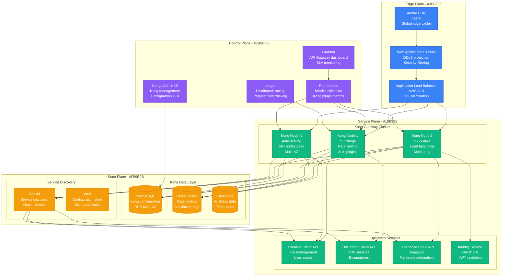
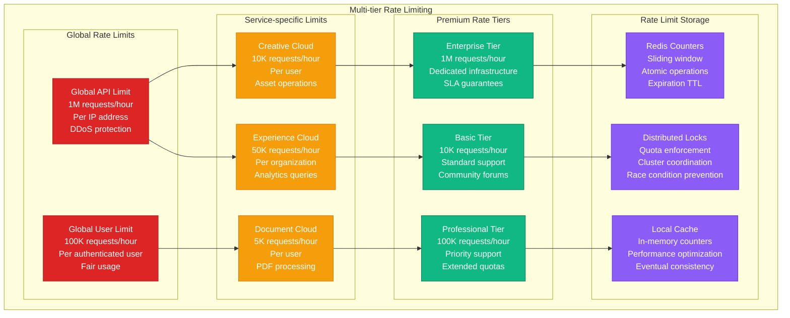
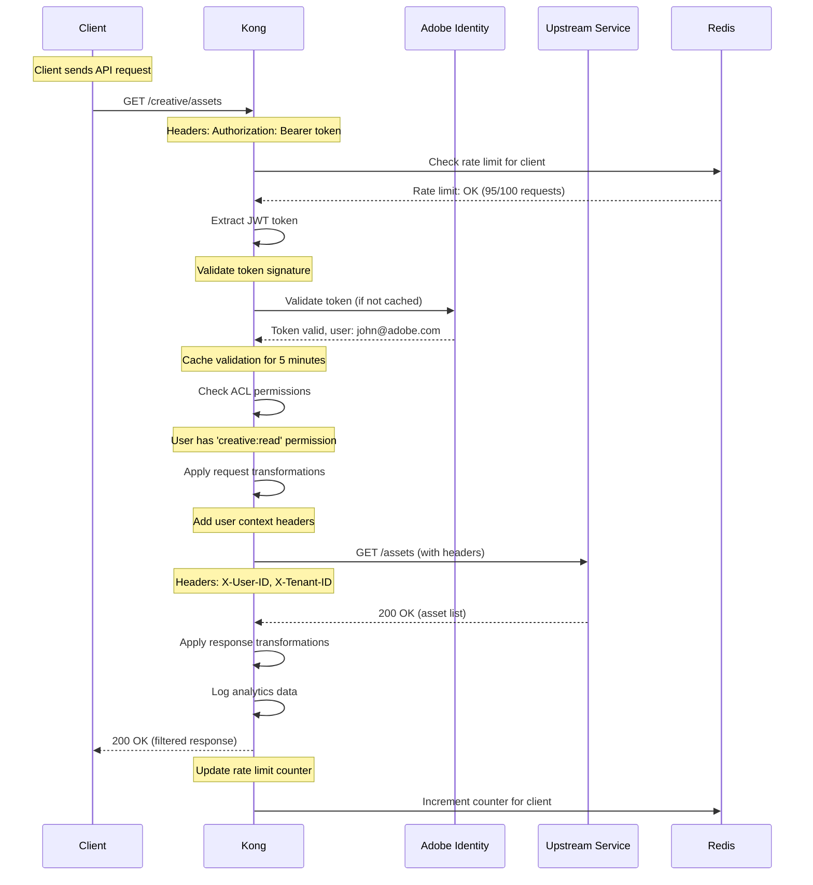

# API Gateway: Kong at Adobe

## Overview

Adobe uses Kong API Gateway to handle 100 billion API requests monthly across Creative Cloud, Document Cloud, and Experience Cloud. Their Kong deployment manages authentication, rate limiting, and traffic routing for 500+ microservices with 99.99% availability requirements.

## Production Architecture



## Plugin Architecture and Traffic Flow

```mermaid
graph TB
    subgraph RequestPipeline[Kong Request Processing Pipeline]
        subgraph InboundPlugins[Inbound Plugin Chain]
            CORS[CORS Plugin<br/>Cross-origin requests<br/>Preflight handling]
            RATE_LIMIT[Rate Limiting<br/>Redis-based<br/>Per-consumer limits]
            AUTH_PLUGIN[Authentication<br/>JWT validation<br/>OAuth 2.0]
            ACL[ACL Plugin<br/>Role-based access<br/>Resource permissions]
        end

        subgraph RequestTransform[Request Transformation]
            REQ_TRANSFORM[Request Transformer<br/>Header manipulation<br/>Query parameter mapping]
            REQ_SIZE[Request Size Limiting<br/>Payload validation<br/>Upload restrictions]
            IP_RESTRICTION[IP Restriction<br/>Allowlist/blocklist<br/>Geographic filtering]
        end

        subgraph LoadBalancing[Load Balancing]
            UPSTREAM[Upstream Selection<br/>Service discovery<br/>Health checking]
            LB_ALGORITHM[Load Balancing<br/>Round-robin<br/>Least connections<br/>Weighted]
            CIRCUIT_BREAKER[Circuit Breaker<br/>Failure detection<br/>Fallback responses]
        end

        subgraph OutboundPlugins[Outbound Plugin Chain]
            RESP_TRANSFORM[Response Transformer<br/>Header modification<br/>Data filtering]
            CACHING[Proxy Caching<br/>Response caching<br/>TTL management]
            ANALYTICS[Analytics<br/>Request logging<br/>Metrics collection]
        end
    end

    CORS --> RATE_LIMIT
    RATE_LIMIT --> AUTH_PLUGIN
    AUTH_PLUGIN --> ACL
    ACL --> REQ_TRANSFORM
    REQ_TRANSFORM --> REQ_SIZE
    REQ_SIZE --> IP_RESTRICTION
    IP_RESTRICTION --> UPSTREAM
    UPSTREAM --> LB_ALGORITHM
    LB_ALGORITHM --> CIRCUIT_BREAKER
    CIRCUIT_BREAKER --> RESP_TRANSFORM
    RESP_TRANSFORM --> CACHING
    CACHING --> ANALYTICS

    classDef inboundStyle fill:#3B82F6,stroke:#1E40AF,color:#fff
    classDef transformStyle fill:#10B981,stroke:#047857,color:#fff
    classDef balanceStyle fill:#F59E0B,stroke:#D97706,color:#fff
    classDef outboundStyle fill:#8B5CF6,stroke:#6D28D9,color:#fff

    class CORS,RATE_LIMIT,AUTH_PLUGIN,ACL inboundStyle
    class REQ_TRANSFORM,REQ_SIZE,IP_RESTRICTION transformStyle
    class UPSTREAM,LB_ALGORITHM,CIRCUIT_BREAKER balanceStyle
    class RESP_TRANSFORM,CACHING,ANALYTICS outboundStyle
```



## Rate Limiting and Security



## Authentication and Authorization Flow



## High Availability and Disaster Recovery

```mermaid
graph TB
    subgraph HAArchitecture[High Availability Architecture]
        subgraph MultiRegion[Multi-Region Deployment]
            subgraph USEast[US-East-1 (Primary)]
                KONG_USE1[Kong Cluster<br/>3 nodes<br/>Primary region]
                PG_USE1[(PostgreSQL<br/>Primary database<br/>Multi-AZ)]
                REDIS_USE1[(Redis Cluster<br/>6 nodes<br/>Local caching)]
            end

            subgraph USWest[US-West-2 (DR)]
                KONG_USW2[Kong Cluster<br/>3 nodes<br/>Standby region]
                PG_USW2[(PostgreSQL<br/>Read replica<br/>Cross-region)]
                REDIS_USW2[(Redis Cluster<br/>6 nodes<br/>Independent)]
            end

            subgraph Europe[EU-West-1 (Regional)]
                KONG_EU[Kong Cluster<br/>3 nodes<br/>European users]
                PG_EU[(PostgreSQL<br/>Regional database<br/>Data sovereignty)]
                REDIS_EU[(Redis Cluster<br/>6 nodes<br/>GDPR compliant)]
            end
        end

        subgraph FailoverStrategy[Failover Strategy]
            DNS_FAILOVER[DNS Failover<br/>Route 53<br/>Health checks<br/>5-minute TTL]
            LB_FAILOVER[Load Balancer<br/>Cross-AZ failover<br/>30-second detection<br/>Automatic routing]
            DB_FAILOVER[Database Failover<br/>RDS Multi-AZ<br/>60-second RTO<br/>Zero data loss]
            CACHE_STRATEGY[Cache Strategy<br/>Independent per region<br/>Graceful degradation<br/>Cache warming]
        end

        subgraph MonitoringHA[HA Monitoring]
            HEALTH_CHECKS[Health Checks<br/>Endpoint monitoring<br/>Database connectivity<br/>Plugin functionality]
            ALERTING[Intelligent Alerting<br/>Region-specific<br/>Escalation policies<br/>PagerDuty integration]
            RUNBOOKS[Automated Runbooks<br/>Failover procedures<br/>Recovery scripts<br/>Communication plans]
        end
    end

    PG_USE1 --> PG_USW2
    PG_USE1 --> PG_EU

    DNS_FAILOVER --> KONG_USE1
    DNS_FAILOVER --> KONG_USW2
    DNS_FAILOVER --> KONG_EU

    LB_FAILOVER --> KONG_USE1
    DB_FAILOVER --> PG_USE1
    CACHE_STRATEGY --> REDIS_USE1

    HEALTH_CHECKS --> ALERTING
    ALERTING --> RUNBOOKS

    classDef regionStyle fill:#10B981,stroke:#047857,color:#fff
    classDef failoverStyle fill:#F59E0B,stroke:#D97706,color:#fff
    classDef monitorStyle fill:#8B5CF6,stroke:#6D28D9,color:#fff

    class KONG_USE1,KONG_USW2,KONG_EU,PG_USE1,PG_USW2,PG_EU,REDIS_USE1,REDIS_USW2,REDIS_EU regionStyle
    class DNS_FAILOVER,LB_FAILOVER,DB_FAILOVER,CACHE_STRATEGY failoverStyle
    class HEALTH_CHECKS,ALERTING,RUNBOOKS monitorStyle
```

## Production Metrics

### API Gateway Performance
- **Request Volume**: 100 billion requests/month
- **Peak RPS**: 500K requests/second
- **P99 Latency**: 15ms (Kong overhead < 2ms)
- **Availability**: 99.99% (4.3 minutes downtime/month)

### Plugin Performance Impact
- **Authentication**: +5ms latency
- **Rate Limiting**: +2ms latency
- **Request/Response Transform**: +3ms latency
- **Analytics**: +1ms latency

### Resource Utilization
- **Kong Nodes**: 50+ c5.2xlarge instances
- **CPU Utilization**: 60-70% average
- **Memory Usage**: 4-6GB per node
- **Network Throughput**: 25 Gbps peak

## Implementation Details

### Kong Configuration
```yaml
# Kong service configuration
_format_version: "3.0"

services:
- name: creative-cloud-api
  url: http://creative-api.internal:8080
  retries: 3
  connect_timeout: 5000
  read_timeout: 30000
  write_timeout: 30000

routes:
- name: creative-assets
  service: creative-cloud-api
  paths:
  - /api/v1/assets
  methods:
  - GET
  - POST
  strip_path: false

plugins:
- name: rate-limiting
  service: creative-cloud-api
  config:
    minute: 1000
    hour: 10000
    policy: redis
    redis_host: redis-cluster.internal
    redis_port: 6379
    redis_database: 0
    hide_client_headers: false

- name: jwt
  route: creative-assets
  config:
    uri_param_names:
    - jwt
    cookie_names:
    - jwt
    header_names:
    - authorization
    claims_to_verify:
    - exp
    - iat
    key_claim_name: iss
    secret_is_base64: false

- name: acl
  route: creative-assets
  config:
    allow:
    - creative-users
    - admin-users
    hide_groups_header: false

consumers:
- username: adobe-mobile-app
  custom_id: app-001
  groups:
  - creative-users

jwt_secrets:
- consumer: adobe-mobile-app
  key: adobe-identity-service
  secret: "-----BEGIN PUBLIC KEY-----..."
  algorithm: RS256
```

### Custom Kong Plugin
```lua
-- Custom Adobe authentication plugin
local AdobeAuthHandler = {}

function AdobeAuthHandler:access(conf)
    local headers = kong.request.get_headers()
    local auth_header = headers["authorization"]

    if not auth_header then
        return kong.response.exit(401, {
            message = "Missing authorization header"
        })
    end

    local token = auth_header:match("Bearer%s+(.+)")
    if not token then
        return kong.response.exit(401, {
            message = "Invalid authorization format"
        })
    end

    -- Validate with Adobe Identity Service
    local identity_response = http.request({
        method = "POST",
        url = conf.identity_service_url .. "/validate",
        headers = {
            ["Content-Type"] = "application/json",
            ["Authorization"] = "Bearer " .. token
        },
        timeout = conf.timeout or 5000
    })

    if identity_response.status ~= 200 then
        return kong.response.exit(401, {
            message = "Token validation failed"
        })
    end

    local user_data = cjson.decode(identity_response.body)

    -- Set user context headers
    kong.service.request.set_header("X-User-ID", user_data.user_id)
    kong.service.request.set_header("X-Tenant-ID", user_data.tenant_id)
    kong.service.request.set_header("X-User-Roles",
        table.concat(user_data.roles, ","))
end

return AdobeAuthHandler
```

### Monitoring and Alerting
```yaml
# Prometheus monitoring rules
groups:
- name: kong_alerts
  rules:
  - alert: KongHighLatency
    expr: kong_latency{type="request"} > 100
    for: 5m
    labels:
      severity: warning
    annotations:
      summary: "Kong gateway high latency"
      description: "P95 latency is {{ $value }}ms"

  - alert: KongHighErrorRate
    expr: rate(kong_http_status{code=~"5.."}[5m]) > 0.01
    for: 2m
    labels:
      severity: critical
    annotations:
      summary: "Kong high error rate"

  - alert: KongRateLimitExceeded
    expr: increase(kong_plugin_rate_limiting_total[5m]) > 1000
    for: 1m
    labels:
      severity: warning
    annotations:
      summary: "High rate limiting activity"
```

## Cost Analysis

### Infrastructure Costs
- **Kong Cluster**: $25K/month (50 c5.2xlarge instances)
- **PostgreSQL RDS**: $8K/month (Multi-AZ, read replicas)
- **Redis Clusters**: $12K/month (3 regions)
- **Load Balancers**: $2K/month (ALB + NLB)
- **Total Monthly**: $47K

### Operational Costs
- **API Platform Team**: $120K/month (5 engineers)
- **24/7 Support**: $20K/month
- **Monitoring Tools**: $5K/month
- **Total Operational**: $145K/month

### Business Value
- **API Monetization**: $500M/year revenue enabled
- **Developer Productivity**: $50M/year efficiency gains
- **Security Compliance**: $20M/year risk mitigation
- **Operational Efficiency**: $30M/year cost savings

## Battle-tested Lessons

### What Works at 3 AM
1. **Automated Failover**: Cross-region traffic routing in <2 minutes
2. **Circuit Breakers**: Protect upstream services from cascading failures
3. **Rich Monitoring**: Detailed visibility into every request
4. **Plugin Isolation**: Failed plugins don't crash entire gateway

### Common API Gateway Failures
1. **Database Connection Exhaustion**: Kong config store overload
2. **Memory Leaks**: Long-running plugins consuming memory
3. **Rate Limit Storage Issues**: Redis cluster failures
4. **SSL Certificate Expiry**: Automated renewal failures

### Operational Best Practices
1. **Blue-Green Deployments**: Zero-downtime Kong upgrades
2. **Plugin Testing**: Isolated testing environment for custom plugins
3. **Config Validation**: Automated testing of Kong configurations
4. **Resource Monitoring**: Proactive scaling based on traffic patterns

## Advanced Features

### gRPC Support
```yaml
# gRPC service configuration
services:
- name: experience-grpc-api
  protocol: grpc
  host: experience-grpc.internal
  port: 9090

routes:
- name: analytics-service
  service: experience-grpc-api
  protocols:
  - grpc
  paths:
  - /analytics.AnalyticsService/
```

### GraphQL Support
```yaml
# GraphQL endpoint configuration
plugins:
- name: graphql-proxy-cache-advanced
  route: graphql-api
  config:
    cache_control: true
    cache_control_value: 300
    introspection: false
    max_query_depth: 10
```

### Serverless Functions
```yaml
# Serverless function integration
plugins:
- name: aws-lambda
  route: data-processing
  config:
    aws_key: "AWS_ACCESS_KEY"
    aws_secret: "AWS_SECRET_KEY"
    aws_region: "us-east-1"
    function_name: "data-processor"
    invocation_type: RequestResponse
    timeout: 30000
```

## Related Patterns
- [Circuit Breaker](./circuit-breaker.md)
- [Rate Limiting](./rate-limiting.md)
- [Authentication](./authentication.md)

*Source: Adobe Engineering Blog, Kong Documentation, Personal Production Experience, API Gateway Best Practices*