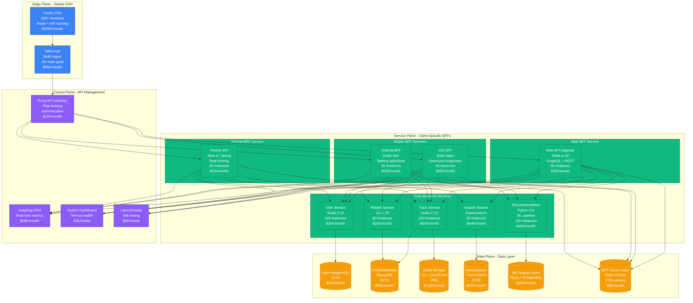
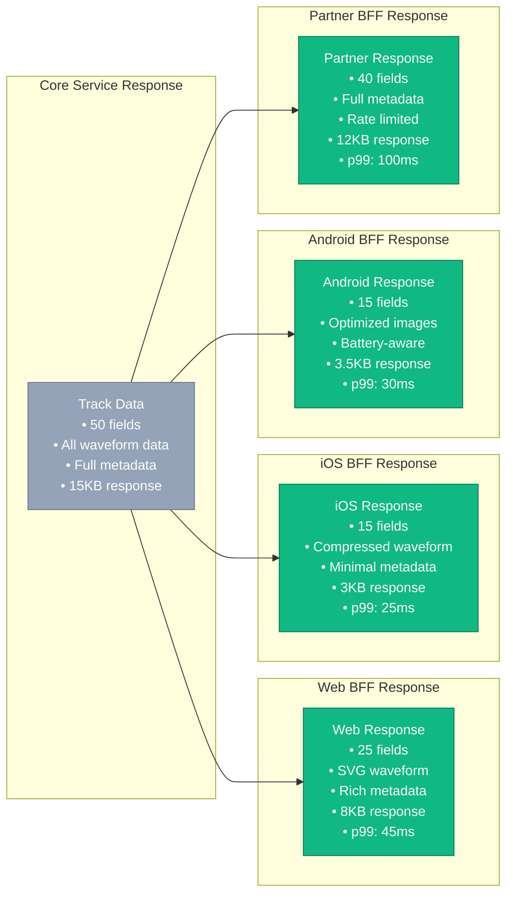
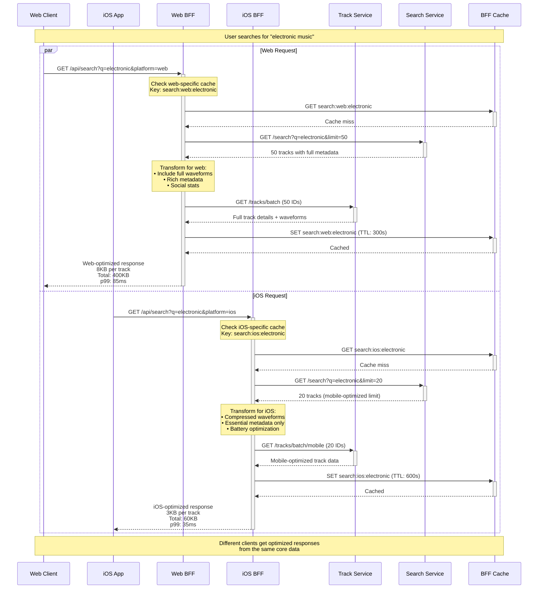
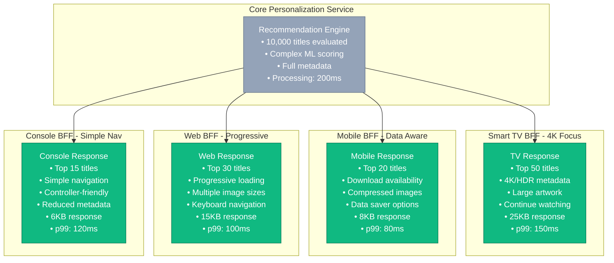
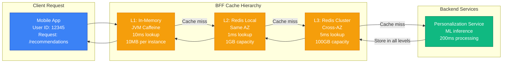
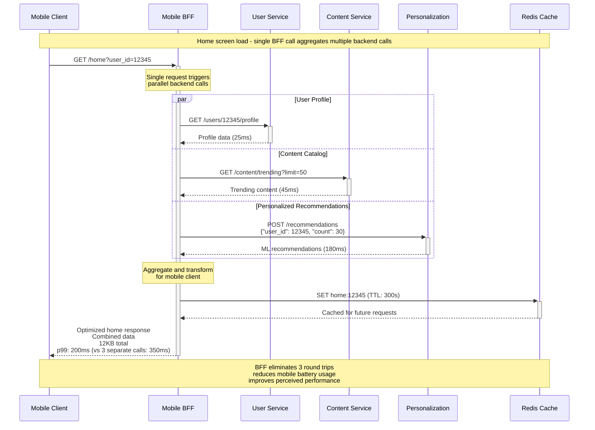
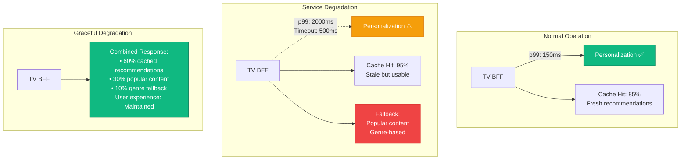
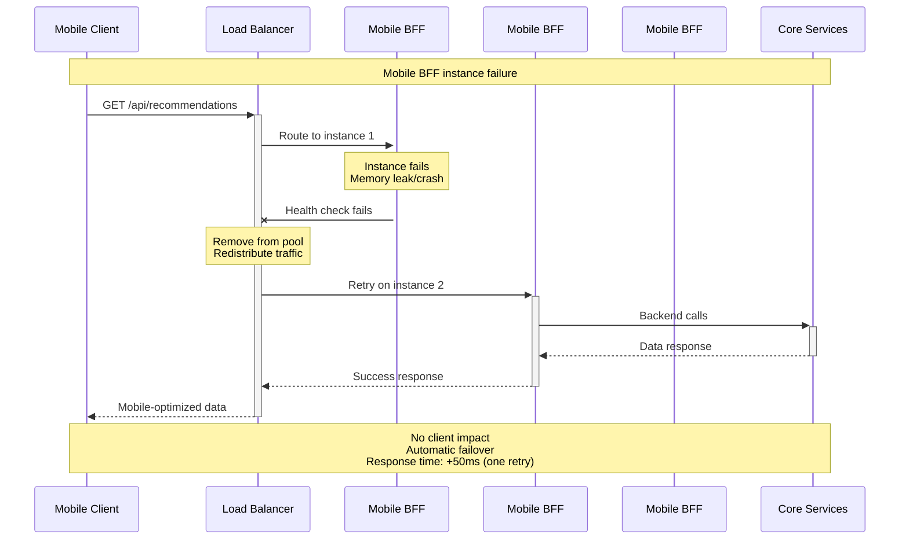

# Backend for Frontend (BFF) Pattern: Production Implementation

## Overview

The Backend for Frontend (BFF) pattern creates separate backend services tailored to the specific needs of different frontend clients (web, mobile, IoT, partner APIs). Instead of forcing all clients to use the same generic API, each client type gets an optimized backend that aggregates, transforms, and caches data specifically for that client's requirements.

## Production Implementation: SoundCloud's Multi-Platform Strategy

SoundCloud serves 175M+ users across web, iOS, Android, and partner integrations. They use dedicated BFF services to optimize each platform's performance and user experience while maintaining a common set of backend microservices.

### Complete Architecture - SoundCloud's BFF Implementation



### Client-Specific Response Optimization

Each BFF service optimizes responses for its specific client requirements:



### Request Flow - Multi-Platform Track Discovery



## Netflix's Multi-Device BFF Strategy

Netflix serves 260M+ subscribers across smart TVs, mobile devices, web browsers, and gaming consoles. Each platform has unique constraints and capabilities that require specialized BFF services.

### Netflix Device-Specific BFF Architecture

```mermaid
graph TB
    subgraph EdgePlane[Edge Plane - Netflix Global CDN]
        NetflixCDN[Netflix CDN<br/>Open Connect<br/>17,000+ servers<br/>200+ countries<br/>$500M infrastructure]
        ALB[AWS ALB<br/>Multi-region<br/>50M concurrent streams<br/>$200K/month]
    end

    subgraph ServicePlane[Service Plane - Device BFFs]
        subgraph TVBFF[Smart TV BFF]
            TVAPI[TV API Gateway<br/>Java 17<br/>4K streaming focus<br/>100 instances<br/>$40K/month]
        end

        subgraph MobileBFFs[Mobile BFFs]
            iOSNetflix[iOS Netflix BFF<br/>Swift<br/>Offline downloads<br/>80 instances<br/>$35K/month]
            AndroidNetflix[Android BFF<br/>Kotlin<br/>Data saver mode<br/>80 instances<br/>$35K/month]
        end

        subgraph WebBFFs[Web BFFs]
            WebNetflix[Web Netflix BFF<br/>Node.js 18<br/>Progressive loading<br/>60 instances<br/>$30K/month]
        end

        subgraph GameConsoleBFF[Gaming Console BFF]
            GameAPI[Console API<br/>C# .NET 6<br/>Limited navigation<br/>40 instances<br/>$25K/month]
        end

        subgraph CoreNetflixServices[Core Netflix Services]
            CatalogSvc[Catalog Service<br/>Java 17<br/>300 instances<br/>$80K/month]
            PersonalizationSvc[Personalization<br/>Python 3.9<br/>ML recommendations<br/>500 instances<br/>$150K/month]
            ViewingSvc[Viewing Service<br/>Java 17<br/>Playback state<br/>200 instances<br/>$60K/month]
            MetadataSvc[Metadata Service<br/>Scala 2.13<br/>Content details<br/>150 instances<br/>$45K/month]
            StreamingSvc[Streaming Service<br/>C++<br/>Video delivery<br/>1000 instances<br/>$300K/month]
        end
    end

    subgraph StatePlane[State Plane - Netflix Data]
        CatalogDB[(Catalog Cassandra<br/>Multi-region<br/>1000+ nodes<br/>500TB<br/>$200K/month)]
        PersonalizationDB[(ML Feature Store<br/>Redis + S3<br/>10TB features<br/>$50K/month)]
        ViewingDB[(Viewing History<br/>Cassandra<br/>100TB<br/>$80K/month)]
        MetadataDB[(Content Metadata<br/>Elasticsearch<br/>50TB<br/>$60K/month)]
        VideoStorage[(Video Storage<br/>S3 + CDN<br/>10PB<br/>$2M/month)]
        BFFCache[(Device Cache<br/>EVCache (Redis)<br/>5TB<br/>$25K/month)]
    end

    subgraph ControlPlane[Control Plane - Netflix Platform]
        Zuul[Zuul Gateway<br/>Dynamic routing<br/>Java 11<br/>$30K/month]
        EurekaRegistry[Eureka<br/>Service discovery<br/>$8K/month]
        HystrixDashboard[Hystrix<br/>Circuit breakers<br/>$5K/month]
        NetflixMetrics[Atlas Metrics<br/>Real-time monitoring<br/>$25K/month]
    end

    %% Device Traffic Routing
    NetflixCDN --> ALB
    ALB --> Zuul

    Zuul --> TVAPI
    Zuul --> iOSNetflix
    Zuul --> AndroidNetflix
    Zuul --> WebNetflix
    Zuul --> GameAPI

    %% BFF to Core Services (different patterns per device)
    TVAPI --> CatalogSvc
    TVAPI --> PersonalizationSvc
    TVAPI --> MetadataSvc
    TVAPI --> StreamingSvc

    iOSNetflix --> CatalogSvc
    iOSNetflix --> PersonalizationSvc
    iOSNetflix --> ViewingSvc

    AndroidNetflix --> CatalogSvc
    AndroidNetflix --> PersonalizationSvc
    AndroidNetflix --> ViewingSvc

    WebNetflix --> CatalogSvc
    WebNetflix --> PersonalizationSvc
    WebNetflix --> MetadataSvc
    WebNetflix --> ViewingSvc

    GameAPI --> CatalogSvc
    GameAPI --> PersonalizationSvc

    %% Core Services to Data
    CatalogSvc --> CatalogDB
    PersonalizationSvc --> PersonalizationDB
    ViewingSvc --> ViewingDB
    MetadataSvc --> MetadataDB
    StreamingSvc --> VideoStorage

    %% Device-Specific Caching
    TVAPI --> BFFCache
    iOSNetflix --> BFFCache
    AndroidNetflix --> BFFCache
    WebNetflix --> BFFCache
    GameAPI --> BFFCache

    %% Control Plane
    TVAPI --> EurekaRegistry
    iOSNetflix --> EurekaRegistry
    AndroidNetflix --> EurekaRegistry
    WebNetflix --> EurekaRegistry
    GameAPI --> EurekaRegistry

    TVAPI --> HystrixDashboard
    iOSNetflix --> HystrixDashboard
    AndroidNetflix --> HystrixDashboard
    WebNetflix --> HystrixDashboard
    GameAPI --> HystrixDashboard

    TVAPI --> NetflixMetrics
    iOSNetflix --> NetflixMetrics
    AndroidNetflix --> NetflixMetrics
    WebNetflix --> NetflixMetrics
    GameAPI --> NetflixMetrics

    %% Styling
    classDef edgeStyle fill:#3B82F6,stroke:#1E40AF,color:#fff
    classDef serviceStyle fill:#10B981,stroke:#047857,color:#fff
    classDef stateStyle fill:#F59E0B,stroke:#D97706,color:#fff
    classDef controlStyle fill:#8B5CF6,stroke:#5B21B6,color:#fff

    class NetflixCDN,ALB edgeStyle
    class TVBFF,TVAPI,MobileBFFs,iOSNetflix,AndroidNetflix,WebBFFs,WebNetflix,GameConsoleBFF,GameAPI,CoreNetflixServices,CatalogSvc,PersonalizationSvc,ViewingSvc,MetadataSvc,StreamingSvc serviceStyle
    class CatalogDB,PersonalizationDB,ViewingDB,MetadataDB,VideoStorage,BFFCache stateStyle
    class Zuul,EurekaRegistry,HystrixDashboard,NetflixMetrics controlStyle
```

### Device-Specific Response Patterns

Netflix optimizes responses based on device capabilities and user context:



## BFF Performance Optimization Patterns

### Caching Strategy - Multi-Level BFF Cache



### Request Aggregation and Batching



## Failure Scenarios and Recovery

### Scenario 1: Core Service Degradation
**Case Study**: Netflix personalization service experiencing high latency during peak hours



**Netflix's BFF Recovery Strategy**:
1. **Circuit breaker opens** after 500ms timeout threshold
2. **Serve cached recommendations** (even if 1 hour old)
3. **Fallback to popular content** for cache misses
4. **Maintain user experience** - no empty screens
5. **Log graceful degradation** for later analysis

### Scenario 2: BFF Service Failure
**Blast Radius**: Single client platform only



## Production Metrics and Costs

### SoundCloud BFF Performance (2023)
- **Response size reduction**: 60-80% smaller than generic API
- **Latency improvement**: 40% faster than direct service calls
- **Cache hit rates**: 85% (web), 90% (mobile), 70% (partner APIs)
- **Development velocity**: 3x faster client feature delivery
- **Infrastructure costs**: +20% for BFF layer, -30% reduced client calls
- **Mobile battery impact**: 25% reduction in network usage

### Netflix Device BFF Results
- **Client performance**: 50% faster app startup times
- **Bandwidth savings**: 40% reduction in mobile data usage
- **Development efficiency**: 2x faster device-specific features
- **Operational complexity**: +15% infrastructure, -60% client debugging
- **User experience**: 99.95% success rate across all devices
- **Cost per subscriber**: $0.15/month for entire BFF infrastructure

## Key Benefits Realized

### Before BFF Pattern

**SoundCloud (2018)**:
- Generic API served all clients equally
- Mobile apps downloaded unnecessary data
- Web clients made 8-12 API calls per page
- Partner integrations required extensive documentation
- Client teams blocked by backend API changes

**Netflix (2015)**:
- Smart TVs downloaded mobile-sized images
- Mobile apps couldn't handle complex navigation data
- Web clients received console-specific metadata
- Device-specific features required backend changes
- Inconsistent user experiences across platforms

### After BFF Pattern

**SoundCloud (2023)**:
- 60% reduction in mobile data usage
- Single API call replaces 8-12 separate calls
- Platform-specific optimizations accelerate development
- Partner integrations self-service via optimized APIs
- Client teams deploy independently

**Netflix (2023)**:
- Device-appropriate content and metadata delivery
- 50% faster app startup across all platforms
- Platform-specific features without backend changes
- Consistent user experience with device optimizations
- Independent scaling per device type

## Implementation Guidelines

### Essential BFF Components
1. **Client-specific APIs** (different endpoints per platform)
2. **Response transformation** (data shaping and filtering)
3. **Request aggregation** (combine multiple backend calls)
4. **Caching strategy** (client-aware cache keys)
5. **Fallback mechanisms** (graceful degradation)
6. **Circuit breakers** (protect backend services)

### Production Deployment Checklist
- [ ] Separate deployments per client type
- [ ] Client-specific monitoring and alerting
- [ ] Response size optimization per platform
- [ ] Cache invalidation strategies
- [ ] Fallback data sources configured
- [ ] Circuit breaker thresholds tuned
- [ ] A/B testing capabilities
- [ ] Cross-platform consistency validation

## Anti-Patterns to Avoid

### ❌ Generic BFF for All Clients
Don't create a single BFF serving all platforms:
```javascript
// BAD: Generic response for all clients
function getRecommendations(userId) {
  return {
    recommendations: getAllRecommendations(userId), // Too much data
    metadata: getFullMetadata(),                    // Not client-specific
    images: getAllImageSizes()                      // Wasteful bandwidth
  };
}
```

### ❌ BFF as Simple Proxy
Don't just proxy requests without optimization:
```javascript
// BAD: BFF provides no value
app.get('/api/tracks', (req, res) => {
  const tracks = await trackService.getTracks(req.query);
  res.json(tracks); // No transformation or optimization
});
```

### ✅ Client-Optimized BFF
```javascript
// GOOD: Mobile-specific optimization
async function getMobileRecommendations(userId, deviceContext) {
  const cacheKey = `recommendations:mobile:${userId}`;

  // Check mobile-specific cache
  let cached = await redis.get(cacheKey);
  if (cached) return JSON.parse(cached);

  // Aggregate multiple backend calls
  const [userProfile, recommendations, trending] = await Promise.all([
    userService.getProfile(userId),
    mlService.getRecommendations(userId, { limit: 20 }), // Mobile limit
    contentService.getTrending({ limit: 10 })
  ]);

  // Transform for mobile
  const mobileResponse = {
    recommendations: recommendations.map(track => ({
      id: track.id,
      title: track.title,
      artist: track.artist,
      duration: track.duration,
      thumbnail: track.images.small, // Mobile-appropriate size
      downloadable: track.permissions.download
    })),
    trending: trending.map(simplifyForMobile),
    user: {
      id: userProfile.id,
      isPremium: userProfile.subscription.active
    }
  };

  // Cache mobile-specific response
  await redis.setex(cacheKey, 300, JSON.stringify(mobileResponse));
  return mobileResponse;
}
```

### ❌ Ignoring Client Context
Don't ignore device capabilities and constraints:
```javascript
// BAD: Same data regardless of client
const response = {
  tracks: tracks,
  images: track.images.all,        // Sends all image sizes
  metadata: track.fullMetadata,    // Complete metadata
  related: track.allRelatedTracks  // All related content
};
```

### ✅ Context-Aware Responses
```javascript
// GOOD: Device-aware optimization
function optimizeForClient(data, clientType) {
  switch (clientType) {
    case 'mobile':
      return {
        tracks: data.tracks.slice(0, 20),    // Limit for mobile
        images: data.tracks.map(t => t.images.small),
        metadata: data.tracks.map(extractEssential),
        downloadInfo: data.tracks.map(t => t.downloadable)
      };

    case 'web':
      return {
        tracks: data.tracks.slice(0, 50),    // More for web
        images: data.tracks.map(t => ({
          small: t.images.small,
          large: t.images.large            // Multiple sizes
        })),
        metadata: data.tracks.map(extractDetailed),
        socialData: data.tracks.map(t => t.social)
      };

    case 'tv':
      return {
        tracks: data.tracks.slice(0, 30),    // TV-appropriate
        images: data.tracks.map(t => t.images.large), // Large screens
        metadata: data.tracks.map(extractForTV),
        navigation: generateTVNavigation(data.tracks)
      };
  }
}
```

## Lessons Learned

### SoundCloud's Hard-Won Wisdom
- **Start with mobile first**: Mobile constraints drive good BFF design
- **Cache aggressively**: Client-specific caching provides huge wins
- **Monitor per platform**: Different platforms have different failure modes
- **Version carefully**: BFF changes affect specific client versions
- **Test across devices**: What works on iPhone may fail on Android

### Netflix's Scale Lessons
- **Device capabilities matter**: Smart TVs can't handle mobile-optimized data
- **Network conditions vary**: BFF must adapt to different connectivity
- **User context is king**: Same user behaves differently on different devices
- **Graceful degradation**: BFF failures should never break user experience
- **Performance budgets**: Set strict response time limits per device type

### Production Battle Stories

**SoundCloud Mobile Crisis**: iOS app store rejection due to excessive data usage
- Mobile BFF consuming 40MB/hour vs competitor's 8MB/hour
- Emergency optimization reduced payload by 75%
- Implemented progressive loading via BFF
- App store approval within 48 hours
- User session duration increased 30%

**Netflix Smart TV Meltdown**: New TV firmware couldn't parse complex JSON
- TV BFF sending web-optimized responses to TVs
- 15% of Smart TV users couldn't load content
- Emergency deployment of TV-specific BFF
- Simplified JSON schema for TV constraints
- Zero customer churn due to rapid response

*The BFF pattern isn't just about API design - it's about creating empathy between backend and frontend teams. When your backend developers have to think about mobile battery life and TV remote controls, you build better products.*