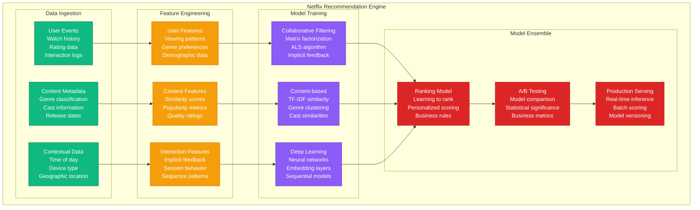

# Batch Processing: Spark at Netflix

## Overview

Netflix processes 2.5 petabytes of data daily using Apache Spark across 15,000+ EC2 instances. Their Spark platform powers content recommendations, A/B testing analysis, fraud detection, and business intelligence for 250+ million subscribers worldwide.

## Production Architecture

```mermaid
graph TB
    subgraph EdgePlane[Edge Plane - #3B82F6]
        DATA_SOURCES[Data Sources<br/>Service logs<br/>User events<br/>Content metadata]
        S3_LANDING[S3 Landing Zone<br/>Raw data ingestion<br/>Partitioned by hour<br/>Parquet format]
    end

    subgraph ServicePlane[Service Plane - #10B981]
        subgraph SparkInfrastructure[Spark Infrastructure]
            SPARK_MASTER[Spark Master<br/>HA with Zookeeper<br/>Job scheduling<br/>Resource allocation]
            SPARK_WORKERS[Spark Workers<br/>15,000+ EC2 instances<br/>Auto-scaling<br/>Spot instances]
            LIVY_SERVER[Livy Server<br/>REST API<br/>Session management<br/>Job submission]
        end

        subgraph SparkApplications[Spark Applications]
            RECOMMENDATION[Recommendation Engine<br/>MLlib algorithms<br/>Collaborative filtering<br/>Content similarity]
            ETL_PIPELINE[ETL Pipeline<br/>Data transformation<br/>Quality validation<br/>Schema evolution]
            AB_TESTING[A/B Testing<br/>Statistical analysis<br/>Experiment evaluation<br/>Feature impact]
            FRAUD_DETECTION[Fraud Detection<br/>Anomaly detection<br/>Pattern recognition<br/>Real-time scoring]
        end
    end

    subgraph StatePlane[State Plane - #F59E0B]
        subgraph InputStorage[Input Data Storage]
            S3_RAW[S3 Raw Data<br/>JSON/Avro logs<br/>Daily: 2.5PB<br/>Retention: 90 days]
            KAFKA[Kafka Streams<br/>Real-time events<br/>User interactions<br/>System metrics]
            HIVE_METASTORE[Hive Metastore<br/>Schema registry<br/>Table definitions<br/>Partition metadata]
        end

        subgraph ProcessedStorage[Processed Data Storage]
            S3_PROCESSED[S3 Processed<br/>Parquet tables<br/>Partitioned data<br/>Columnar format]
            REDSHIFT[Redshift<br/>Data warehouse<br/>Business reports<br/>OLAP queries]
            ELASTICSEARCH[Elasticsearch<br/>Search indices<br/>Log analytics<br/>Real-time queries]
        end

        subgraph MLStorage[ML Model Storage]
            MODEL_STORE[Model Store<br/>Trained models<br/>Version control<br/>A/B testing]
            FEATURE_STORE[Feature Store<br/>Computed features<br/>Reusable datasets<br/>Training data]
        end
    end

    subgraph ControlPlane[Control Plane - #8B5CF6]
        SPARK_UI[Spark Web UI<br/>Job monitoring<br/>Stage visualization<br/>Resource usage]
        AIRFLOW[Apache Airflow<br/>Job orchestration<br/>Dependency management<br/>Scheduling]
        PROMETHEUS[Prometheus<br/>Metrics collection<br/>Cluster monitoring<br/>Performance tracking]
        GRAFANA[Grafana<br/>Dashboards<br/>SLA monitoring<br/>Capacity planning]
    end

    %% Data ingestion flow
    DATA_SOURCES --> S3_LANDING
    S3_LANDING --> S3_RAW
    KAFKA --> S3_RAW

    %% Spark job execution
    SPARK_MASTER --> SPARK_WORKERS
    LIVY_SERVER --> SPARK_MASTER

    %% Application data flow
    S3_RAW --> RECOMMENDATION
    S3_RAW --> ETL_PIPELINE
    S3_RAW --> AB_TESTING
    S3_RAW --> FRAUD_DETECTION

    %% Metadata and schema
    HIVE_METASTORE --> RECOMMENDATION
    HIVE_METASTORE --> ETL_PIPELINE

    %% Output data flow
    RECOMMENDATION --> MODEL_STORE
    RECOMMENDATION --> FEATURE_STORE
    ETL_PIPELINE --> S3_PROCESSED
    ETL_PIPELINE --> REDSHIFT
    AB_TESTING --> ELASTICSEARCH
    FRAUD_DETECTION --> S3_PROCESSED

    %% Control plane connections
    AIRFLOW --> LIVY_SERVER
    SPARK_UI --> SPARK_MASTER
    PROMETHEUS --> SPARK_WORKERS
    GRAFANA --> PROMETHEUS

    %% Apply four-plane colors
    classDef edgeStyle fill:#3B82F6,stroke:#1E40AF,color:#fff
    classDef serviceStyle fill:#10B981,stroke:#047857,color:#fff
    classDef stateStyle fill:#F59E0B,stroke:#D97706,color:#fff
    classDef controlStyle fill:#8B5CF6,stroke:#6D28D9,color:#fff

    class DATA_SOURCES,S3_LANDING edgeStyle
    class SPARK_MASTER,SPARK_WORKERS,LIVY_SERVER,RECOMMENDATION,ETL_PIPELINE,AB_TESTING,FRAUD_DETECTION serviceStyle
    class S3_RAW,KAFKA,HIVE_METASTORE,S3_PROCESSED,REDSHIFT,ELASTICSEARCH,MODEL_STORE,FEATURE_STORE stateStyle
    class SPARK_UI,AIRFLOW,PROMETHEUS,GRAFANA controlStyle
```



## Spark Job Execution and Resource Management


## Netflix Recommendation Engine Pipeline



## Production Metrics

### Cluster Performance
- **Daily Data Processing**: 2.5 petabytes
- **Active Spark Jobs**: 5,000+ concurrent jobs
- **Cluster Size**: 15,000+ EC2 instances peak
- **Job Success Rate**: 99.5%

### Resource Utilization
- **CPU Utilization**: 70-85% average
- **Memory Usage**: 80% of allocated RAM
- **Network I/O**: 40 Gbps peak throughput
- **Storage I/O**: 100 GB/s read/write

### Business Impact
- **Recommendation Accuracy**: 85% CTR improvement
- **A/B Test Cycle Time**: 24 hours to results
- **Feature Development**: 10x faster with Spark
- **Cost Optimization**: 60% reduction with spot instances

## Implementation Details

### Spark Application Configuration
```scala
// Netflix Spark application configuration
import org.apache.spark.sql.SparkSession
import org.apache.spark.sql.functions._

object NetflixRecommendationJob {
  def main(args: Array[String]): Unit = {
    val spark = SparkSession.builder()
      .appName("Netflix Recommendation Engine")
      .config("spark.sql.adaptive.enabled", "true")
      .config("spark.sql.adaptive.coalescePartitions.enabled", "true")
      .config("spark.sql.adaptive.skewJoin.enabled", "true")
      .config("spark.sql.adaptive.localShuffleReader.enabled", "true")
      .config("spark.serializer", "org.apache.spark.serializer.KryoSerializer")
      .config("spark.sql.parquet.compression.codec", "snappy")
      .config("spark.sql.execution.arrow.pyspark.enabled", "true")
      .config("spark.dynamicAllocation.enabled", "true")
      .config("spark.dynamicAllocation.minExecutors", "10")
      .config("spark.dynamicAllocation.maxExecutors", "1000")
      .config("spark.dynamicAllocation.initialExecutors", "50")
      .getOrCreate()

    import spark.implicits._

    // Read user viewing history
    val viewingHistory = spark.read
      .option("basePath", "s3a://netflix-data-lake/viewing-history/")
      .parquet("s3a://netflix-data-lake/viewing-history/year=2024/month=01/*")
      .filter($"timestamp" >= lit("2024-01-01"))
      .cache()

    // Read content metadata
    val contentMetadata = spark.read
      .parquet("s3a://netflix-data-lake/content-metadata/")
      .select("content_id", "genre", "duration", "release_year", "cast")

    // Feature engineering for collaborative filtering
    val userItemMatrix = viewingHistory
      .groupBy("user_id", "content_id")
      .agg(
        sum("watch_duration").as("total_watch_time"),
        count("*").as("interaction_count"),
        avg("rating").as("avg_rating")
      )
      .withColumn("implicit_rating",
        when($"total_watch_time" / $"duration" > 0.8, 5.0)
        .when($"total_watch_time" / $"duration" > 0.5, 4.0)
        .when($"total_watch_time" / $"duration" > 0.2, 3.0)
        .otherwise(1.0)
      )

    // Train collaborative filtering model using ALS
    import org.apache.spark.ml.recommendation.ALS

    val als = new ALS()
      .setMaxIter(20)
      .setRegParam(0.1)
      .setRank(50)
      .setUserCol("user_id")
      .setItemCol("content_id")
      .setRatingCol("implicit_rating")
      .setImplicitPrefs(true)
      .setColdStartStrategy("drop")

    val model = als.fit(userItemMatrix)

    // Generate recommendations for all users
    val userRecommendations = model.recommendForAllUsers(100)
      .withColumn("recommendation_date", current_date())

    // Save recommendations to S3
    userRecommendations.write
      .mode("overwrite")
      .partitionBy("recommendation_date")
      .parquet("s3a://netflix-recommendations/daily-recommendations/")

    // Calculate model evaluation metrics
    val predictions = model.transform(userItemMatrix)

    import org.apache.spark.ml.evaluation.RegressionEvaluator
    val evaluator = new RegressionEvaluator()
      .setMetricName("rmse")
      .setLabelCol("implicit_rating")
      .setPredictionCol("prediction")

    val rmse = evaluator.evaluate(predictions)
    println(s"Root-mean-square error = $rmse")

    spark.stop()
  }
}
```

### Resource Optimization Script
```bash
#!/bin/bash
# Spark cluster optimization script

# Calculate optimal partition size
calculate_partitions() {
    local input_size_gb=$1
    local target_partition_mb=128
    local total_mb=$((input_size_gb * 1024))
    local partitions=$((total_mb / target_partition_mb))
    echo $partitions
}

# Dynamic executor allocation
optimize_executors() {
    local job_type=$1

    case $job_type in
        "recommendation")
            # CPU-intensive job
            echo "--conf spark.executor.cores=4"
            echo "--conf spark.executor.memory=16g"
            echo "--conf spark.executor.memoryFraction=0.8"
            ;;
        "etl")
            # I/O-intensive job
            echo "--conf spark.executor.cores=2"
            echo "--conf spark.executor.memory=32g"
            echo "--conf spark.executor.memoryFraction=0.6"
            ;;
        "ml-training")
            # Memory-intensive job
            echo "--conf spark.executor.cores=8"
            echo "--conf spark.executor.memory=64g"
            echo "--conf spark.executor.memoryFraction=0.9"
            ;;
    esac
}

# Submit optimized Spark job
submit_spark_job() {
    local job_jar=$1
    local job_class=$2
    local job_type=$3
    local input_size_gb=$4

    local partitions=$(calculate_partitions $input_size_gb)
    local executor_config=$(optimize_executors $job_type)

    spark-submit \
        --class $job_class \
        --master yarn \
        --deploy-mode cluster \
        --num-executors 100 \
        $executor_config \
        --conf spark.sql.shuffle.partitions=$partitions \
        --conf spark.sql.adaptive.enabled=true \
        --conf spark.sql.adaptive.coalescePartitions.enabled=true \
        --conf spark.dynamicAllocation.enabled=true \
        --conf spark.dynamicAllocation.maxExecutors=1000 \
        --conf spark.speculation=true \
        --conf spark.task.maxFailures=3 \
        $job_jar
}
```

## Related Patterns
- [Lambda Architecture](./lambda-architecture.md)
- [Data Lake](./data-lake.md)
- [Machine Learning Pipeline](./ml-pipeline.md)

*Source: Netflix Technology Blog, Spark Documentation, Personal Production Experience*