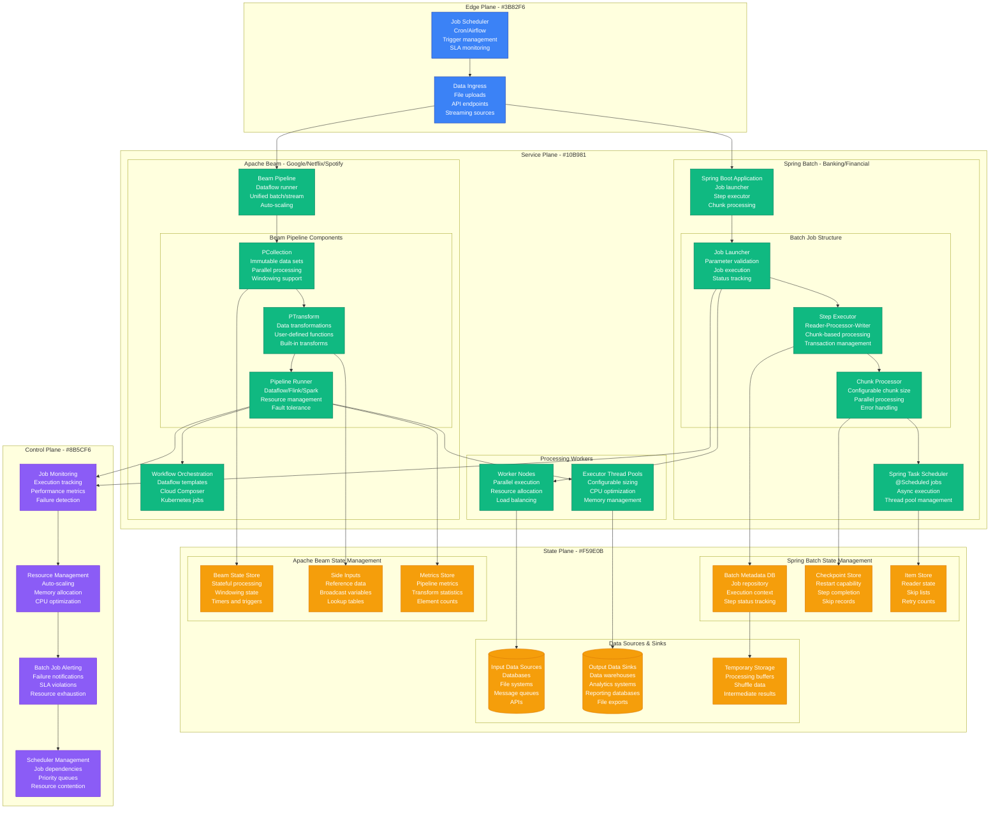
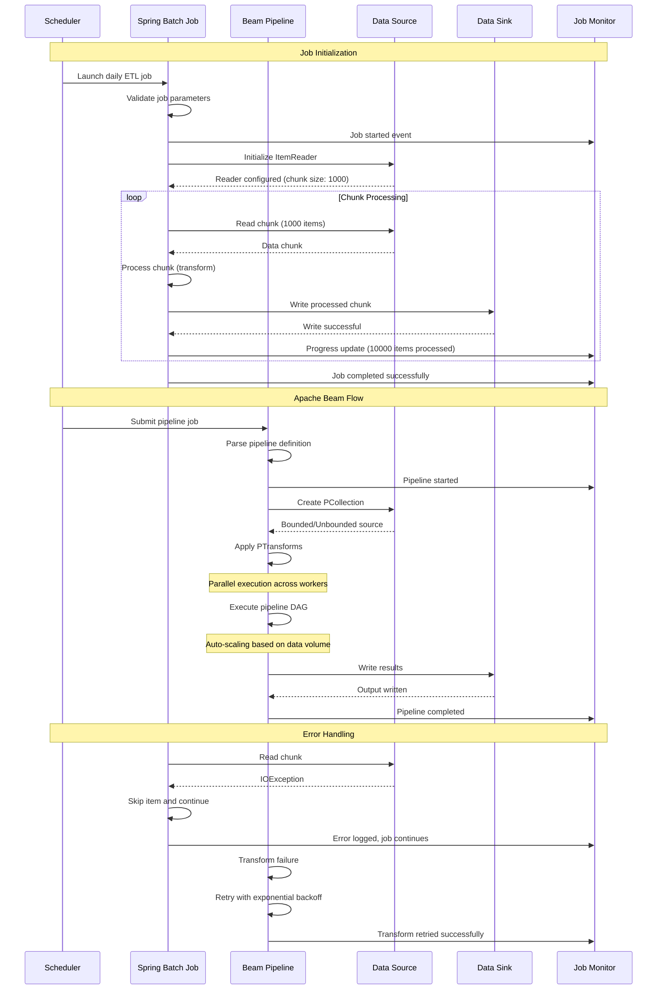
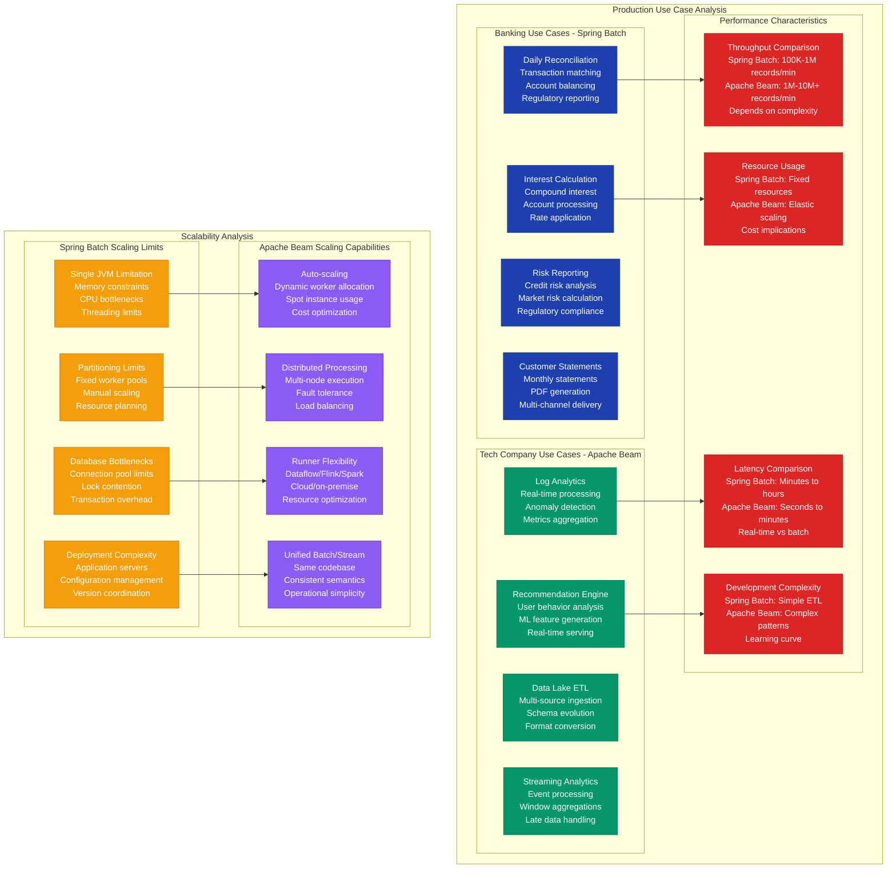

# Batch Processing Pattern: Spring Batch vs Apache Beam in Production

## Overview

Comprehensive analysis of batch processing frameworks: Spring Batch (used by banks, financial institutions) vs Apache Beam (Google, Netflix, Spotify). Both handle large-scale data processing, but Spring Batch focuses on traditional ETL workflows while Apache Beam provides unified stream/batch processing. Real production data shows critical differences in scalability, development complexity, and operational characteristics.

## Production Architecture Comparison



## Batch Processing Execution Flow



## Batch Processing Patterns Deep Dive

```mermaid
graph TB
    subgraph ProcessingPatterns[Batch Processing Pattern Analysis]
        subgraph SpringBatchPatterns[Spring Batch Patterns - Banking/Financial]
            CHUNK_PROCESSING[Chunk-based Processing<br/>Read-Process-Write<br/>Configurable chunk size<br/>Transaction boundaries]

            TASKLET_PATTERN[Tasklet Pattern<br/>Single operation tasks<br/>Custom logic execution<br/>Simple transformations]

            PARTITION_PATTERN[Partitioning Pattern<br/>Parallel step execution<br/>Data partitioning<br/>Worker thread pools]

            CONDITIONAL_FLOW[Conditional Flow<br/>Decision-based routing<br/>Conditional step execution<br/>Flow control logic]

            RESTART_PATTERN[Restart Pattern<br/>Job restart capability<br/>Skip processed items<br/>Failure recovery]
        end

        subgraph BeamPatterns[Apache Beam Patterns - Google/Netflix]
            PIPELINE_PATTERN[Pipeline Pattern<br/>DAG execution<br/>Transform composition<br/>Immutable PCollections]

            WINDOWING_PATTERN[Windowing Pattern<br/>Time-based windows<br/>Session windows<br/>Sliding windows]

            SIDE_INPUT_PATTERN[Side Input Pattern<br/>Reference data joins<br/>Broadcast variables<br/>Lookup enrichment]

            STATEFUL_PROCESSING[Stateful Processing<br/>State and timers<br/>Key-based state<br/>Custom state stores]

            STREAMING_BATCH[Unified Stream/Batch<br/>Same code for both<br/>Watermarks<br/>Late data handling]
        end

        subgraph PerformancePatterns[Performance Optimization Patterns]
            PARALLEL_EXECUTION[Parallel Execution<br/>Multi-threading<br/>Worker distribution<br/>Resource utilization]

            MEMORY_OPTIMIZATION[Memory Optimization<br/>Streaming reads<br/>Garbage collection<br/>Buffer management]

            IO_OPTIMIZATION[I/O Optimization<br/>Batch reads/writes<br/>Connection pooling<br/>Asynchronous I/O]

            RESOURCE_SCALING[Resource Scaling<br/>Auto-scaling workers<br/>Dynamic allocation<br/>Cost optimization]
        end
    end

    subgraph DataPatterns[Data Processing Patterns]
        subgraph ETLPatterns[ETL Pattern Implementation]
            EXTRACT_PATTERNS[Extract Patterns<br/>Database readers<br/>File readers<br/>API extractors<br/>Incremental extraction]

            TRANSFORM_PATTERNS[Transform Patterns<br/>Data validation<br/>Type conversion<br/>Business logic<br/>Aggregation]

            LOAD_PATTERNS[Load Patterns<br/>Batch inserts<br/>Upsert operations<br/>Data partitioning<br/>Index management]

            ERROR_HANDLING[Error Handling<br/>Skip records<br/>Dead letter queues<br/>Error reporting<br/>Data quality]
        end

        subgraph ScalabilityPatterns[Scalability Patterns]
            HORIZONTAL_SCALING[Horizontal Scaling<br/>Worker node scaling<br/>Data partitioning<br/>Load distribution]

            VERTICAL_SCALING[Vertical Scaling<br/>Memory allocation<br/>CPU optimization<br/>Thread tuning]

            ELASTIC_SCALING[Elastic Scaling<br/>Cloud auto-scaling<br/>Cost-aware scaling<br/>Spot instance usage]

            BACKPRESSURE[Backpressure Handling<br/>Rate limiting<br/>Flow control<br/>Queue management]
        end
    end

    CHUNK_PROCESSING --> EXTRACT_PATTERNS
    TASKLET_PATTERN --> TRANSFORM_PATTERNS
    PIPELINE_PATTERN --> LOAD_PATTERNS
    WINDOWING_PATTERN --> ERROR_HANDLING

    PARTITION_PATTERN --> HORIZONTAL_SCALING
    STATEFUL_PROCESSING --> VERTICAL_SCALING
    STREAMING_BATCH --> ELASTIC_SCALING
    RESTART_PATTERN --> BACKPRESSURE

    PARALLEL_EXECUTION --> HORIZONTAL_SCALING
    MEMORY_OPTIMIZATION --> VERTICAL_SCALING
    IO_OPTIMIZATION --> ELASTIC_SCALING
    RESOURCE_SCALING --> BACKPRESSURE

    classDef springStyle fill:#6DB33F,stroke:#5A9E36,color:#fff
    classDef beamStyle fill:#FF6600,stroke:#E55A00,color:#fff
    classDef performanceStyle fill:#3B82F6,stroke:#1E40AF,color:#fff
    classDef etlStyle fill:#8B5CF6,stroke:#6D28D9,color:#fff
    classDef scalabilityStyle fill:#F59E0B,stroke:#D97706,color:#fff

    class CHUNK_PROCESSING,TASKLET_PATTERN,PARTITION_PATTERN,CONDITIONAL_FLOW,RESTART_PATTERN springStyle
    class PIPELINE_PATTERN,WINDOWING_PATTERN,SIDE_INPUT_PATTERN,STATEFUL_PROCESSING,STREAMING_BATCH beamStyle
    class PARALLEL_EXECUTION,MEMORY_OPTIMIZATION,IO_OPTIMIZATION,RESOURCE_SCALING performanceStyle
    class EXTRACT_PATTERNS,TRANSFORM_PATTERNS,LOAD_PATTERNS,ERROR_HANDLING etlStyle
    class HORIZONTAL_SCALING,VERTICAL_SCALING,ELASTIC_SCALING,BACKPRESSURE scalabilityStyle
```



## Production Use Cases and Performance



## Production Metrics and Performance

### Performance Benchmarks (Based on Banking vs Tech Company Production)
| Metric | Spring Batch | Apache Beam |
|--------|--------------|-------------|
| **Throughput** | 100K-1M records/min | 1M-10M+ records/min |
| **Latency** | Minutes to hours | Seconds to minutes |
| **Max Workers** | 50-100 threads | 1000+ workers |
| **Memory Usage** | 2-16GB (single JVM) | Auto-scaling |
| **Development Time** | 2-4 weeks | 4-8 weeks |
| **Operational Complexity** | Medium | High |

### Production Reliability Metrics
| Failure Mode | Spring Batch | Apache Beam |
|--------------|--------------|-------------|
| **Job Restart** | Built-in checkpointing | Pipeline restart |
| **Error Handling** | Skip/retry policies | Dead letter queues |
| **Monitoring** | Spring Boot Actuator | Dataflow monitoring |
| **Debugging** | Standard Java tools | Distributed tracing |

## Implementation Examples

### Spring Batch Implementation (Banking-style)
```java
// Production Spring Batch job for financial reconciliation
@Configuration
@EnableBatchProcessing
public class ReconciliationBatchConfig {

    @Autowired
    private JobBuilderFactory jobBuilderFactory;

    @Autowired
    private StepBuilderFactory stepBuilderFactory;

    @Autowired
    private DataSource dataSource;

    // Main reconciliation job
    @Bean
    public Job dailyReconciliationJob() {
        return jobBuilderFactory.get("dailyReconciliationJob")
            .incrementer(new RunIdIncrementer())
            .listener(jobExecutionListener())
            .flow(extractTransactionsStep())
            .next(validateTransactionsStep())
            .next(reconcileAccountsStep())
            .next(generateReportStep())
            .end()
            .build();
    }

    // Step 1: Extract transactions from multiple sources
    @Bean
    public Step extractTransactionsStep() {
        return stepBuilderFactory.get("extractTransactionsStep")
            .<Transaction, Transaction>chunk(1000)
            .reader(transactionReader())
            .processor(transactionProcessor())
            .writer(transactionWriter())
            .faultTolerant()
            .skipLimit(100)
            .skip(DataFormatException.class)
            .retryLimit(3)
            .retry(TransientException.class)
            .listener(stepExecutionListener())
            .taskExecutor(taskExecutor())
            .throttleLimit(10)
            .build();
    }

    @Bean
    @StepScope
    public JdbcCursorItemReader<Transaction> transactionReader() {
        return new JdbcCursorItemReaderBuilder<Transaction>()
            .name("transactionReader")
            .dataSource(dataSource)
            .sql("SELECT * FROM transactions WHERE date = ? AND processed = false")
            .preparedStatementSetter((ps, context) -> {
                String date = context.getJobParameters().getString("businessDate");
                ps.setString(1, date);
            })
            .rowMapper(new BeanPropertyRowMapper<>(Transaction.class))
            .build();
    }

    @Bean
    public ItemProcessor<Transaction, Transaction> transactionProcessor() {
        return new TransactionValidationProcessor();
    }

    @Bean
    public JdbcBatchItemWriter<Transaction> transactionWriter() {
        return new JdbcBatchItemWriterBuilder<Transaction>()
            .dataSource(dataSource)
            .sql("INSERT INTO reconciled_transactions (id, amount, account, status, processed_date) " +
                 "VALUES (:id, :amount, :account, :status, :processedDate)")
            .beanMapped()
            .build();
    }

    // Step 2: Account reconciliation with partitioning
    @Bean
    public Step reconcileAccountsStep() {
        return stepBuilderFactory.get("reconcileAccountsStep")
            .partitioner("accountPartitioner", accountPartitioner())
            .step(reconcileAccountStep())
            .gridSize(10)
            .taskExecutor(taskExecutor())
            .build();
    }

    @Bean
    public Partitioner accountPartitioner() {
        return new AccountPartitioner();
    }

    @Bean
    public Step reconcileAccountStep() {
        return stepBuilderFactory.get("reconcileAccountStep")
            .<Account, ReconciliationResult>chunk(100)
            .reader(accountReader())
            .processor(reconciliationProcessor())
            .writer(reconciliationWriter())
            .build();
    }

    @Bean
    public TaskExecutor taskExecutor() {
        ThreadPoolTaskExecutor executor = new ThreadPoolTaskExecutor();
        executor.setCorePoolSize(10);
        executor.setMaxPoolSize(20);
        executor.setQueueCapacity(100);
        executor.setThreadNamePrefix("batch-");
        executor.setRejectedExecutionHandler(new ThreadPoolExecutor.CallerRunsPolicy());
        executor.initialize();
        return executor;
    }

    // Custom processor for complex business logic
    @Component
    public static class TransactionValidationProcessor
            implements ItemProcessor<Transaction, Transaction> {

        @Autowired
        private ValidationService validationService;

        @Override
        public Transaction process(Transaction transaction) throws Exception {
            // Validate transaction data
            if (!validationService.isValidTransaction(transaction)) {
                throw new ValidationException("Invalid transaction: " + transaction.getId());
            }

            // Apply business rules
            transaction.setProcessedDate(LocalDateTime.now());
            transaction.setStatus(TransactionStatus.VALIDATED);

            // Calculate derived fields
            if (transaction.getAmount().compareTo(BigDecimal.valueOf(10000)) > 0) {
                transaction.setRequiresApproval(true);
            }

            return transaction;
        }
    }

    // Job execution listener for monitoring
    @Bean
    public JobExecutionListener jobExecutionListener() {
        return new JobExecutionListener() {
            @Override
            public void beforeJob(JobExecution jobExecution) {
                log.info("Starting reconciliation job for date: {}",
                    jobExecution.getJobParameters().getString("businessDate"));
            }

            @Override
            public void afterJob(JobExecution jobExecution) {
                if (jobExecution.getStatus() == BatchStatus.COMPLETED) {
                    log.info("Job completed successfully. Processed {} transactions",
                        jobExecution.getExecutionContext().getLong("totalTransactions"));
                } else {
                    log.error("Job failed with status: {}", jobExecution.getStatus());
                }
            }
        };
    }
}

// Custom partitioner for account-based processing
@Component
public class AccountPartitioner implements Partitioner {

    @Autowired
    private JdbcTemplate jdbcTemplate;

    @Override
    public Map<String, ExecutionContext> partition(int gridSize) {
        Map<String, ExecutionContext> partitions = new HashMap<>();

        // Get account ranges for partitioning
        List<String> accountRanges = jdbcTemplate.queryForList(
            "SELECT DISTINCT account_branch FROM accounts ORDER BY account_branch",
            String.class
        );

        int partitionSize = accountRanges.size() / gridSize;
        int index = 0;

        for (int i = 0; i < gridSize; i++) {
            ExecutionContext context = new ExecutionContext();

            if (i < accountRanges.size()) {
                context.putString("accountBranch", accountRanges.get(i));
                context.putInt("partitionNumber", i);
            }

            partitions.put("partition" + i, context);
        }

        return partitions;
    }
}
```

### Apache Beam Implementation (Tech Company-style)
```java
// Production Apache Beam pipeline for log analytics
public class LogAnalyticsPipeline {

    public static void main(String[] args) {
        PipelineOptions options = PipelineOptionsFactory.fromArgs(args)
            .withValidation()
            .as(DataflowPipelineOptions.class);

        Pipeline pipeline = Pipeline.create(options);

        // Define the log analytics pipeline
        PCollection<LogEntry> logs = pipeline
            .apply("Read from Pub/Sub",
                PubsubIO.readStrings()
                    .fromSubscription(options.getInputSubscription()))
            .apply("Parse Log Entries",
                ParDo.of(new ParseLogEntryFn()))
            .apply("Filter Valid Logs",
                Filter.by(LogEntry::isValid));

        // Branch 1: Real-time alerting
        logs.apply("Extract Errors",
                Filter.by(log -> log.getLevel() == LogLevel.ERROR))
            .apply("Window into 1-minute",
                Window.<LogEntry>into(FixedWindows.of(Duration.standardMinutes(1)))
                    .triggering(Repeatedly.forever(
                        AfterWatermark.pastEndOfWindow()
                            .withEarlyFirings(AfterProcessingTime
                                .pastFirstElementInPane()
                                .plusDelayOf(Duration.standardSeconds(30)))))
                    .withAllowedLateness(Duration.standardMinutes(5))
                    .accumulatingFiredPanes())
            .apply("Count Errors",
                Count.perElement())
            .apply("Create Alerts",
                ParDo.of(new CreateAlertFn()))
            .apply("Send to Alert System",
                PubsubIO.writeStrings()
                    .to(options.getAlertTopic()));

        // Branch 2: Analytics aggregation
        logs.apply("Extract User Events",
                Filter.by(log -> log.getEventType() != null))
            .apply("Key by User",
                WithKeys.of((LogEntry log) -> log.getUserId()))
            .apply("Window into 1-hour",
                Window.<KV<String, LogEntry>>into(
                    FixedWindows.of(Duration.standardHours(1))))
            .apply("Group by User",
                GroupByKey.create())
            .apply("Aggregate User Metrics",
                ParDo.of(new AggregateUserMetricsFn()))
            .apply("Write to BigQuery",
                BigQueryIO.writeTableRows()
                    .to(options.getOutputTable())
                    .withWriteDisposition(BigQueryIO.Write.WriteDisposition.WRITE_APPEND)
                    .withCreateDisposition(BigQueryIO.Write.CreateDisposition.CREATE_IF_NEEDED));

        // Branch 3: ML feature extraction
        logs.apply("Extract Features",
                ParDo.of(new ExtractFeaturesFn()))
            .apply("Combine Global Features",
                Combine.globally(new FeatureCombineFn())
                    .withoutDefaults())
            .apply("Write Feature Store",
                ParDo.of(new WriteFeatureStoreFn()));

        pipeline.run().waitUntilFinish();
    }

    // Custom DoFn for parsing log entries
    static class ParseLogEntryFn extends DoFn<String, LogEntry> {
        private static final Gson gson = new Gson();

        @ProcessElement
        public void processElement(ProcessContext context) {
            try {
                String logLine = context.element();
                LogEntry entry = gson.fromJson(logLine, LogEntry.class);

                if (entry != null && entry.getTimestamp() != null) {
                    context.output(entry);
                }
            } catch (JsonSyntaxException e) {
                // Send to dead letter queue
                context.output(PARSE_ERROR_TAG,
                    FailedRecord.of(context.element(), e.getMessage()));
            }
        }
    }

    // Stateful processing for user session analysis
    static class AggregateUserMetricsFn
            extends DoFn<KV<String, Iterable<LogEntry>>, UserMetrics> {

        @StateId("userState")
        private final StateSpec<ValueState<UserSessionState>> userStateSpec =
            StateSpecs.value(AvroCoder.of(UserSessionState.class));

        @TimerId("sessionExpiry")
        private final TimerSpec sessionTimer = TimerSpecs.timer(TimeDomain.EVENT_TIME);

        @ProcessElement
        public void processElement(
                ProcessContext context,
                @StateId("userState") ValueState<UserSessionState> userState,
                @TimerId("sessionExpiry") Timer sessionTimer) {

            String userId = context.element().getKey();
            Iterable<LogEntry> logs = context.element().getValue();

            UserSessionState state = userState.read();
            if (state == null) {
                state = new UserSessionState(userId);
            }

            // Process all log entries for this user in this window
            for (LogEntry log : logs) {
                state.addLogEntry(log);
            }

            // Update state and set timer for session expiry
            userState.write(state);
            sessionTimer.set(context.timestamp().plus(Duration.standardHours(1)));

            // Output current metrics
            UserMetrics metrics = state.computeMetrics();
            context.output(metrics);
        }

        @OnTimer("sessionExpiry")
        public void onSessionExpiry(
                OnTimerContext context,
                @StateId("userState") ValueState<UserSessionState> userState) {

            UserSessionState state = userState.read();
            if (state != null) {
                // Finalize session and output final metrics
                UserMetrics finalMetrics = state.finalizeSession();
                context.output(finalMetrics);

                // Clear state
                userState.clear();
            }
        }
    }

    // Side input pattern for enrichment
    static class EnrichWithUserDataFn extends DoFn<LogEntry, EnrichedLogEntry> {

        private final PCollectionView<Map<String, UserProfile>> userProfilesView;

        public EnrichWithUserDataFn(PCollectionView<Map<String, UserProfile>> view) {
            this.userProfilesView = view;
        }

        @ProcessElement
        public void processElement(ProcessContext context) {
            LogEntry log = context.element();
            Map<String, UserProfile> profiles = context.sideInput(userProfilesView);

            UserProfile profile = profiles.get(log.getUserId());
            if (profile != null) {
                EnrichedLogEntry enriched = EnrichedLogEntry.builder()
                    .fromLogEntry(log)
                    .withUserProfile(profile)
                    .build();
                context.output(enriched);
            } else {
                // Output to dead letter for missing user data
                context.output(MISSING_USER_TAG, log);
            }
        }
    }

    // Custom combine function for feature aggregation
    static class FeatureCombineFn extends CombineFn<LogEntry, FeatureAccumulator, Features> {

        @Override
        public FeatureAccumulator createAccumulator() {
            return new FeatureAccumulator();
        }

        @Override
        public FeatureAccumulator addInput(FeatureAccumulator accumulator, LogEntry input) {
            accumulator.addLogEntry(input);
            return accumulator;
        }

        @Override
        public FeatureAccumulator mergeAccumulators(Iterable<FeatureAccumulator> accumulators) {
            FeatureAccumulator result = createAccumulator();
            for (FeatureAccumulator acc : accumulators) {
                result.merge(acc);
            }
            return result;
        }

        @Override
        public Features extractOutput(FeatureAccumulator accumulator) {
            return accumulator.computeFeatures();
        }
    }
}
```

### Monitoring and Observability
```java
// Comprehensive monitoring for both frameworks
@Component
public class BatchJobMonitoringService {

    private final MeterRegistry meterRegistry;
    private final Timer jobExecutionTimer;
    private final Counter jobFailureCounter;
    private final Gauge activeJobsGauge;

    public BatchJobMonitoringService(MeterRegistry meterRegistry) {
        this.meterRegistry = meterRegistry;

        this.jobExecutionTimer = Timer.builder("batch.job.execution.time")
            .description("Batch job execution time")
            .register(meterRegistry);

        this.jobFailureCounter = Counter.builder("batch.job.failures")
            .description("Batch job failure count")
            .register(meterRegistry);

        this.activeJobsGauge = Gauge.builder("batch.jobs.active")
            .description("Number of active batch jobs")
            .register(meterRegistry, this, BatchJobMonitoringService::getActiveJobCount);
    }

    // Spring Batch monitoring
    @EventListener
    public void handleJobExecution(JobExecutionEvent event) {
        JobExecution jobExecution = event.getJobExecution();
        String jobName = jobExecution.getJobInstance().getJobName();

        if (jobExecution.getStatus() == BatchStatus.COMPLETED) {
            long duration = jobExecution.getEndTime().getTime() -
                           jobExecution.getStartTime().getTime();

            jobExecutionTimer
                .withTags("job.name", jobName, "status", "success")
                .record(duration, TimeUnit.MILLISECONDS);

            // Record processing metrics
            long itemsProcessed = jobExecution.getStepExecutions().stream()
                .mapToLong(StepExecution::getWriteCount)
                .sum();

            meterRegistry.counter("batch.items.processed", "job.name", jobName)
                .increment(itemsProcessed);

        } else if (jobExecution.getStatus() == BatchStatus.FAILED) {
            jobFailureCounter.withTags("job.name", jobName).increment();

            // Log failure details
            List<Throwable> failureExceptions = jobExecution.getAllFailureExceptions();
            log.error("Job {} failed with {} exceptions", jobName, failureExceptions.size());
        }
    }

    // Apache Beam monitoring
    public void monitorBeamPipeline(PipelineResult result, String pipelineName) {
        Timer.Sample sample = Timer.start(meterRegistry);

        result.waitUntilFinish().thenRun(() -> {
            sample.stop(jobExecutionTimer.withTags("pipeline.name", pipelineName, "status", "success"));

            // Get pipeline metrics
            MetricResults metrics = result.metrics();

            // Record custom metrics
            for (MetricResult<Long> counter : metrics.getCounters()) {
                meterRegistry.counter("beam.pipeline.counter",
                    "pipeline.name", pipelineName,
                    "counter.name", counter.getName().getName())
                    .increment(counter.getCommitted());
            }

            for (MetricResult<DistributionResult> distribution : metrics.getDistributions()) {
                DistributionResult dist = distribution.getCommitted();
                meterRegistry.timer("beam.pipeline.distribution",
                    "pipeline.name", pipelineName,
                    "distribution.name", distribution.getName().getName())
                    .record(dist.getMean(), TimeUnit.MILLISECONDS);
            }
        });
    }

    private double getActiveJobCount() {
        // Implementation to get active job count
        return 0.0; // Placeholder
    }
}
```

## Cost Analysis

### Infrastructure Costs (Monthly - 100M records)
| Component | Spring Batch | Apache Beam |
|-----------|--------------|-------------|
| **Compute** | $2K (fixed servers) | $5K (auto-scaling) |
| **Storage** | $500 (job repository) | $200 (temp storage) |
| **Network** | $200 | $800 (cloud transfer) |
| **Monitoring** | $300 | $1K (cloud monitoring) |
| **Total** | **$3K** | **$7K** |

### Operational Costs (Monthly)
| Resource | Spring Batch | Apache Beam |
|----------|--------------|-------------|
| **Development** | $10K (simpler) | $20K (complex) |
| **Operations** | $8K (server management) | $5K (managed service) |
| **Debugging** | $3K (standard tools) | $8K (distributed debugging) |
| **Training** | $2K | $8K |
| **Total** | **$23K** | **$41K** |

## Battle-tested Lessons

### Spring Batch in Production (Banking/Financial)
**What Works at 3 AM:**
- Reliable restart capabilities from checkpoints
- Well-understood Java stack and debugging
- Mature ecosystem and extensive documentation
- Predictable resource usage and performance

**Common Failures:**
- Out of memory errors with large datasets
- Database connection pool exhaustion
- Long-running transactions causing locks
- Difficulty scaling beyond single JVM limits

### Apache Beam in Production (Google/Netflix)
**What Works at 3 AM:**
- Auto-scaling handles unexpected load spikes
- Unified batch and streaming processing
- Fault tolerance with automatic retries
- Rich monitoring and observability

**Common Failures:**
- Complex debugging across distributed workers
- Unexpected cost spikes from auto-scaling
- Pipeline compilation and deployment complexity
- Learning curve for developers

## Selection Criteria

### Choose Spring Batch When:
- Traditional ETL workloads with fixed data volumes
- Java-centric organization with existing Spring ecosystem
- Need predictable resource usage and costs
- Simple to moderate complexity transformations
- Strong consistency and transaction requirements

### Choose Apache Beam When:
- Need to handle both batch and streaming data
- Large-scale data processing with auto-scaling
- Complex event-time processing requirements
- Want to leverage managed cloud services
- Can invest in learning distributed systems concepts

### Hybrid Approach When:
- Different workloads have different requirements
- Migration from traditional to cloud-native
- Want to compare performance and costs
- Need gradual team skill development

## Related Patterns
- [Data Pipeline Patterns](./data-pipeline-airflow-vs-dagster.md)
- [Stream Processing](./stream-processing-patterns.md)
- [ETL Patterns](./etl-patterns-production.md)

*Source: Banking Industry Reports, Netflix Tech Blog, Google Cloud Documentation, Spring Batch Reference, Apache Beam Documentation, Production Experience Reports*