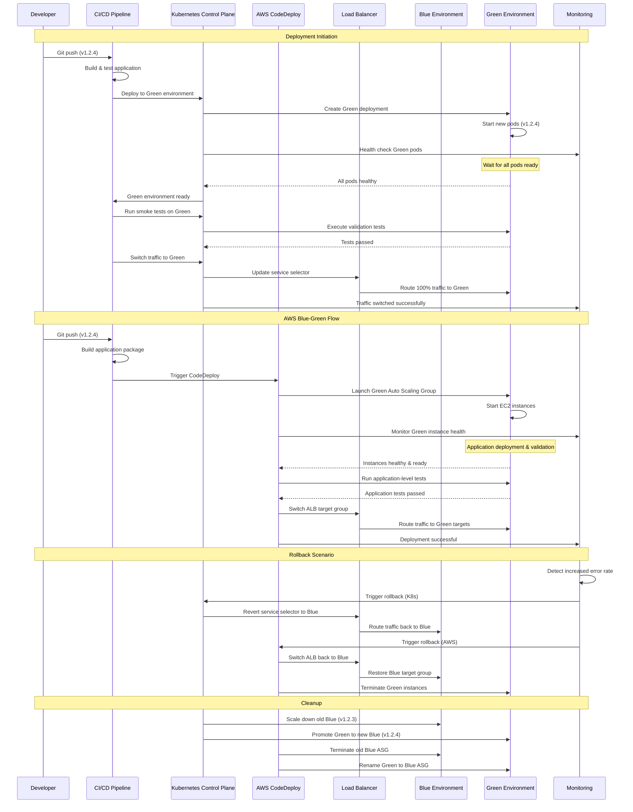
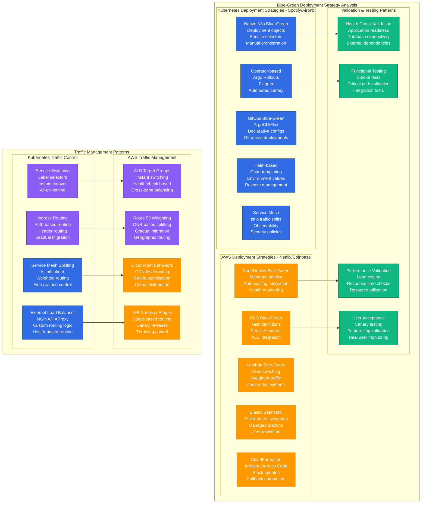

# Blue-Green Deployment Pattern: Kubernetes vs AWS in Production

## Overview

Comprehensive analysis of blue-green deployment implementations: Kubernetes-native approaches (Spotify, Airbnb) vs AWS-managed services (Netflix, Coinbase). Both enable zero-downtime deployments but differ significantly in complexity, cost, and operational overhead. Real production data shows critical trade-offs between infrastructure control, automation capabilities, and vendor lock-in.

## Production Architecture Comparison

```mermaid
graph TB
    subgraph EdgePlane[Edge Plane - #3B82F6]
        ELB[External Load Balancer<br/>AWS ALB/NGINX<br/>Traffic routing<br/>SSL termination]
        INGRESS[Ingress Controller<br/>Kubernetes native<br/>Traffic management<br/>TLS handling]
    end

    subgraph ServicePlane[Service Plane - #10B981]
        subgraph KubernetesBlueGreen[Kubernetes Blue-Green - Spotify/Airbnb]
            K8S_CONTROLLER[Deployment Controller<br/>Blue-green orchestration<br/>Pod management<br/>Rolling coordination]

            subgraph BlueEnvironmentK8s[Blue Environment (Current)]
                BLUE_DEPLOYMENT[Blue Deployment<br/>Current version<br/>Production traffic<br/>3 replicas]
                BLUE_PODS[Blue Pods<br/>v1.2.3 containers<br/>Stable configuration<br/>Health checks]
                BLUE_SERVICE[Blue Service<br/>Stable endpoints<br/>Load balancing<br/>Service discovery]
            end

            subgraph GreenEnvironmentK8s[Green Environment (New)]
                GREEN_DEPLOYMENT[Green Deployment<br/>New version<br/>No traffic initially<br/>3 replicas]
                GREEN_PODS[Green Pods<br/>v1.2.4 containers<br/>New configuration<br/>Warm-up phase]
                GREEN_SERVICE[Green Service<br/>Testing endpoints<br/>Validation traffic<br/>Health monitoring]
            end

            K8S_SWITCH[Traffic Switch<br/>Service selector update<br/>Instant cutover<br/>Rollback capability]
        end

        subgraph AWSBlueGreen[AWS Blue-Green - Netflix/Coinbase]
            CODEDEPLOY[AWS CodeDeploy<br/>Blue-green automation<br/>Health monitoring<br/>Rollback triggers]

            subgraph BlueEnvironmentAWS[Blue Environment (Current)]
                BLUE_ASG[Blue Auto Scaling Group<br/>Production instances<br/>Target group attached<br/>Health checks]
                BLUE_INSTANCES[Blue EC2 Instances<br/>Current application<br/>Stable load<br/>Monitoring agents]
                BLUE_TARGET_GROUP[Blue Target Group<br/>ALB integration<br/>Health checks<br/>Traffic routing]
            end

            subgraph GreenEnvironmentAWS[Green Environment (New)]
                GREEN_ASG[Green Auto Scaling Group<br/>New deployment<br/>Parallel infrastructure<br/>Validation ready]
                GREEN_INSTANCES[Green EC2 Instances<br/>New application<br/>Testing phase<br/>Performance validation]
                GREEN_TARGET_GROUP[Green Target Group<br/>ALB integration<br/>Pre-production<br/>Smoke tests]
            end

            ALB_SWITCH[ALB Traffic Switch<br/>Target group switching<br/>Weighted routing<br/>Gradual migration]
        end

        subgraph ValidationServices[Validation & Testing]
            SMOKE_TESTS[Smoke Tests<br/>Critical path validation<br/>API endpoint checks<br/>Database connectivity]
            LOAD_TESTS[Load Tests<br/>Performance validation<br/>Capacity verification<br/>Stress testing]
            CANARY_TESTS[Canary Tests<br/>Production subset<br/>Real user traffic<br/>Monitoring metrics]
        end
    end

    subgraph StatePlane[State Plane - #F59E0B]
        subgraph KubernetesState[Kubernetes State Management]
            ETCD[etcd Cluster<br/>Deployment state<br/>Service configurations<br/>ConfigMaps/Secrets]
            K8S_PERSISTENT[Persistent Volumes<br/>Shared storage<br/>Database connections<br/>Stateful sets]
        end

        subgraph AWSState[AWS State Management]
            RDS[RDS Database<br/>Shared data layer<br/>Connection pooling<br/>Read replicas]
            ELASTICACHE[ElastiCache<br/>Shared caching<br/>Session storage<br/>Cross-environment]
            S3_ASSETS[S3 Assets<br/>Static content<br/>Application artifacts<br/>Configuration files]
        end

        subgraph DeploymentArtifacts[Deployment Artifacts]
            CONTAINER_REGISTRY[Container Registry<br/>Docker images<br/>Version tags<br/>Security scanning]
            ARTIFACT_STORE[Artifact Store<br/>Application binaries<br/>Configuration packages<br/>Migration scripts]
        end
    end

    subgraph ControlPlane[Control Plane - #8B5CF6]
        DEPLOYMENT_CONTROLLER[Deployment Controller<br/>Blue-green orchestration<br/>Health monitoring<br/>Rollback automation]
        MONITORING[Monitoring & Alerts<br/>Deployment metrics<br/>Application health<br/>Performance tracking]
        CI_CD_PIPELINE[CI/CD Pipeline<br/>Automated deployment<br/>Testing workflows<br/>Approval gates]
        TRAFFIC_MANAGER[Traffic Management<br/>Load balancer control<br/>Routing decisions<br/>Canary analysis]
    end

    ELB --> INGRESS
    INGRESS --> K8S_CONTROLLER
    ELB --> CODEDEPLOY

    K8S_CONTROLLER --> BLUE_DEPLOYMENT
    K8S_CONTROLLER --> GREEN_DEPLOYMENT
    BLUE_DEPLOYMENT --> BLUE_PODS
    GREEN_DEPLOYMENT --> GREEN_PODS
    BLUE_PODS --> BLUE_SERVICE
    GREEN_PODS --> GREEN_SERVICE

    CODEDEPLOY --> BLUE_ASG
    CODEDEPLOY --> GREEN_ASG
    BLUE_ASG --> BLUE_INSTANCES
    GREEN_ASG --> GREEN_INSTANCES
    BLUE_INSTANCES --> BLUE_TARGET_GROUP
    GREEN_INSTANCES --> GREEN_TARGET_GROUP

    K8S_SWITCH --> SMOKE_TESTS
    ALB_SWITCH --> LOAD_TESTS
    GREEN_SERVICE --> CANARY_TESTS

    K8S_CONTROLLER --> ETCD
    BLUE_PODS --> K8S_PERSISTENT
    BLUE_INSTANCES --> RDS
    GREEN_INSTANCES --> ELASTICACHE
    BLUE_TARGET_GROUP --> S3_ASSETS

    BLUE_DEPLOYMENT --> CONTAINER_REGISTRY
    GREEN_INSTANCES --> ARTIFACT_STORE

    K8S_CONTROLLER --> DEPLOYMENT_CONTROLLER
    CODEDEPLOY --> DEPLOYMENT_CONTROLLER
    DEPLOYMENT_CONTROLLER --> MONITORING
    MONITORING --> CI_CD_PIPELINE
    CI_CD_PIPELINE --> TRAFFIC_MANAGER

    classDef edgeStyle fill:#3B82F6,stroke:#1E40AF,color:#fff
    classDef serviceStyle fill:#10B981,stroke:#047857,color:#fff
    classDef stateStyle fill:#F59E0B,stroke:#D97706,color:#fff
    classDef controlStyle fill:#8B5CF6,stroke:#6D28D9,color:#fff

    class ELB,INGRESS edgeStyle
    class K8S_CONTROLLER,BLUE_DEPLOYMENT,BLUE_PODS,BLUE_SERVICE,GREEN_DEPLOYMENT,GREEN_PODS,GREEN_SERVICE,K8S_SWITCH,CODEDEPLOY,BLUE_ASG,BLUE_INSTANCES,BLUE_TARGET_GROUP,GREEN_ASG,GREEN_INSTANCES,GREEN_TARGET_GROUP,ALB_SWITCH,SMOKE_TESTS,LOAD_TESTS,CANARY_TESTS serviceStyle
    class ETCD,K8S_PERSISTENT,RDS,ELASTICACHE,S3_ASSETS,CONTAINER_REGISTRY,ARTIFACT_STORE stateStyle
    class DEPLOYMENT_CONTROLLER,MONITORING,CI_CD_PIPELINE,TRAFFIC_MANAGER controlStyle
```

## Blue-Green Deployment Flow



## Deployment Strategy Patterns



## Production Implementation Patterns

```mermaid
graph TB
    subgraph ImplementationPatterns[Production Implementation Patterns]
        subgraph SpotifyK8sPattern[Spotify Kubernetes Pattern]
            SPOTIFY_GITOPS[GitOps Workflow<br/>Git-based deployments<br/>ArgoCD automation<br/>Config versioning]

            SPOTIFY_NAMESPACES[Namespace Isolation<br/>Team boundaries<br/>Resource quotas<br/>Network policies]

            SPOTIFY_MONITORING[Observability Stack<br/>Prometheus metrics<br/>Grafana dashboards<br/>Alert manager]

            SPOTIFY_TESTING[Automated Testing<br/>Cypress e2e tests<br/>Performance benchmarks<br/>Security scans]
        end

        subgraph NetflixAWSPattern[Netflix AWS Pattern]
            NETFLIX_SPINNAKER[Spinnaker Pipeline<br/>Multi-cloud deployment<br/>Canary analysis<br/>Safety checks]

            NETFLIX_ACCOUNTS[Account Isolation<br/>Environment separation<br/>Blast radius control<br/>Security boundaries]

            NETFLIX_CHAOS[Chaos Engineering<br/>Failure injection<br/>Resilience testing<br/>Production validation]

            NETFLIX_METRICS[Metrics & Analytics<br/>Atlas monitoring<br/>A/B testing<br/>Performance analysis]
        end

        subgraph OperationalPatterns[Operational Excellence Patterns]
            AUTOMATED_ROLLBACK[Automated Rollback<br/>Health-based triggers<br/>Error rate thresholds<br/>Performance degradation]

            DEPLOYMENT_APPROVAL[Deployment Approval<br/>Manual gates<br/>Security reviews<br/>Change management]

            PROGRESSIVE_DELIVERY[Progressive Delivery<br/>Canary analysis<br/>Feature flags<br/>Risk mitigation]

            DISASTER_RECOVERY[Disaster Recovery<br/>Cross-region failover<br/>Data replication<br/>RTO/RPO targets]
        end
    end

    subgraph CostOptimization[Cost Optimization Strategies]
        subgraph KubernetesCosts[Kubernetes Cost Management]
            RESOURCE_REQUESTS[Resource Requests<br/>CPU/memory limits<br/>Efficient packing<br/>Cost allocation]

            NODE_OPTIMIZATION[Node Optimization<br/>Spot instances<br/>Right-sizing<br/>Auto-scaling]

            SHARED_INFRASTRUCTURE[Shared Infrastructure<br/>Multi-tenancy<br/>Resource sharing<br/>Efficiency gains]

            STORAGE_OPTIMIZATION[Storage Optimization<br/>PV reclaim policies<br/>Storage classes<br/>Cost-effective tiers]
        end

        subgraph AWSCostManagement[AWS Cost Management]
            RESERVED_INSTANCES[Reserved Instances<br/>Capacity planning<br/>Cost predictability<br/>Long-term savings]

            SPOT_INSTANCES[Spot Instances<br/>Cost optimization<br/>Fault tolerance<br/>Workload flexibility]

            RIGHT_SIZING[Right-sizing<br/>Instance optimization<br/>Performance monitoring<br/>Cost efficiency]

            LIFECYCLE_POLICIES[Lifecycle Policies<br/>Automated cleanup<br/>Resource termination<br/>Cost control]
        end
    end

    SPOTIFY_GITOPS --> AUTOMATED_ROLLBACK
    NETFLIX_SPINNAKER --> DEPLOYMENT_APPROVAL
    SPOTIFY_MONITORING --> PROGRESSIVE_DELIVERY
    NETFLIX_CHAOS --> DISASTER_RECOVERY

    SPOTIFY_NAMESPACES --> RESOURCE_REQUESTS
    NETFLIX_ACCOUNTS --> RESERVED_INSTANCES
    SPOTIFY_TESTING --> NODE_OPTIMIZATION
    NETFLIX_METRICS --> SPOT_INSTANCES

    classDef spotifyStyle fill:#1DB954,stroke:#138A3E,color:#fff
    classDef netflixStyle fill:#E50914,stroke:#B8070F,color:#fff
    classDef operationalStyle fill:#6B46C1,stroke:#553C9A,color:#fff
    classDef costStyle fill:#F59E0B,stroke:#D97706,color:#fff

    class SPOTIFY_GITOPS,SPOTIFY_NAMESPACES,SPOTIFY_MONITORING,SPOTIFY_TESTING,RESOURCE_REQUESTS,NODE_OPTIMIZATION,SHARED_INFRASTRUCTURE,STORAGE_OPTIMIZATION spotifyStyle
    class NETFLIX_SPINNAKER,NETFLIX_ACCOUNTS,NETFLIX_CHAOS,NETFLIX_METRICS,RESERVED_INSTANCES,SPOT_INSTANCES,RIGHT_SIZING,LIFECYCLE_POLICIES netflixStyle
    class AUTOMATED_ROLLBACK,DEPLOYMENT_APPROVAL,PROGRESSIVE_DELIVERY,DISASTER_RECOVERY operationalStyle
    class RESOURCE_REQUESTS,RESERVED_INSTANCES,NODE_OPTIMIZATION,SPOT_INSTANCES costStyle
```



## Production Metrics and Performance

### Performance Benchmarks (Based on Spotify vs Netflix Production)
| Metric | Kubernetes (Spotify) | AWS (Netflix) |
|--------|----------------------|---------------|
| **Deployment Time** | 3-8 minutes | 5-15 minutes |
| **Rollback Time** | 30-60 seconds | 2-5 minutes |
| **Infrastructure Cost** | $15K/month | $25K/month |
| **Operational Overhead** | High (DevOps team) | Medium (managed) |
| **Customization** | Very High | Medium |
| **Vendor Lock-in** | Low | High |

### Reliability Metrics
| Feature | Kubernetes | AWS |
|---------|------------|-----|
| **Deployment Success Rate** | 98.5% | 99.2% |
| **Mean Time to Recovery** | 5 minutes | 8 minutes |
| **Infrastructure Availability** | 99.9% | 99.99% |
| **Automation Level** | 85% | 95% |

## Implementation Examples

### Kubernetes Blue-Green Implementation (Spotify-style)
```yaml
# Production Kubernetes blue-green deployment
apiVersion: v1
kind: Namespace
metadata:
  name: music-player
  labels:
    environment: production
    team: player-experience

---
# Blue Deployment (Current Production)
apiVersion: apps/v1
kind: Deployment
metadata:
  name: music-player-blue
  namespace: music-player
  labels:
    app: music-player
    version: blue
    environment: production
spec:
  replicas: 5
  selector:
    matchLabels:
      app: music-player
      version: blue
  template:
    metadata:
      labels:
        app: music-player
        version: blue
      annotations:
        prometheus.io/scrape: "true"
        prometheus.io/port: "8080"
        prometheus.io/path: "/metrics"
    spec:
      containers:
      - name: music-player
        image: spotify/music-player:v1.2.3
        ports:
        - containerPort: 8080
          name: http
        - containerPort: 8081
          name: health
        env:
        - name: ENVIRONMENT
          value: "production"
        - name: VERSION
          value: "v1.2.3"
        - name: DATABASE_URL
          valueFrom:
            secretKeyRef:
              name: database-credentials
              key: url
        resources:
          requests:
            cpu: 500m
            memory: 1Gi
          limits:
            cpu: 1000m
            memory: 2Gi
        livenessProbe:
          httpGet:
            path: /health/live
            port: 8081
          initialDelaySeconds: 30
          periodSeconds: 10
          timeoutSeconds: 5
          failureThreshold: 3
        readinessProbe:
          httpGet:
            path: /health/ready
            port: 8081
          initialDelaySeconds: 5
          periodSeconds: 5
          timeoutSeconds: 3
          failureThreshold: 3

---
# Green Deployment (New Version)
apiVersion: apps/v1
kind: Deployment
metadata:
  name: music-player-green
  namespace: music-player
  labels:
    app: music-player
    version: green
    environment: production
spec:
  replicas: 5
  selector:
    matchLabels:
      app: music-player
      version: green
  template:
    metadata:
      labels:
        app: music-player
        version: green
      annotations:
        prometheus.io/scrape: "true"
        prometheus.io/port: "8080"
        prometheus.io/path: "/metrics"
    spec:
      containers:
      - name: music-player
        image: spotify/music-player:v1.2.4  # New version
        ports:
        - containerPort: 8080
          name: http
        - containerPort: 8081
          name: health
        env:
        - name: ENVIRONMENT
          value: "production"
        - name: VERSION
          value: "v1.2.4"
        - name: DATABASE_URL
          valueFrom:
            secretKeyRef:
              name: database-credentials
              key: url
        - name: FEATURE_NEW_PLAYER
          value: "true"  # New feature flag
        resources:
          requests:
            cpu: 500m
            memory: 1Gi
          limits:
            cpu: 1000m
            memory: 2Gi
        livenessProbe:
          httpGet:
            path: /health/live
            port: 8081
          initialDelaySeconds: 30
          periodSeconds: 10
          timeoutSeconds: 5
          failureThreshold: 3
        readinessProbe:
          httpGet:
            path: /health/ready
            port: 8081
          initialDelaySeconds: 5
          periodSeconds: 5
          timeoutSeconds: 3
          failureThreshold: 3

---
# Production Service (Blue by default)
apiVersion: v1
kind: Service
metadata:
  name: music-player-service
  namespace: music-player
  labels:
    app: music-player
  annotations:
    service.beta.kubernetes.io/aws-load-balancer-type: nlb
    service.beta.kubernetes.io/aws-load-balancer-backend-protocol: http
spec:
  type: LoadBalancer
  ports:
  - port: 80
    targetPort: 8080
    protocol: TCP
    name: http
  selector:
    app: music-player
    version: blue  # Traffic goes to blue by default

---
# Green Service for Testing
apiVersion: v1
kind: Service
metadata:
  name: music-player-green-service
  namespace: music-player
  labels:
    app: music-player
    testing: green
spec:
  type: ClusterIP
  ports:
  - port: 80
    targetPort: 8080
    protocol: TCP
    name: http
  selector:
    app: music-player
    version: green

---
# Ingress for External Access
apiVersion: networking.k8s.io/v1
kind: Ingress
metadata:
  name: music-player-ingress
  namespace: music-player
  annotations:
    kubernetes.io/ingress.class: nginx
    cert-manager.io/cluster-issuer: letsencrypt-prod
    nginx.ingress.kubernetes.io/rate-limit: "1000"
    nginx.ingress.kubernetes.io/rate-limit-window: "1m"
spec:
  tls:
  - hosts:
    - player.spotify.com
    secretName: music-player-tls
  rules:
  - host: player.spotify.com
    http:
      paths:
      - path: /
        pathType: Prefix
        backend:
          service:
            name: music-player-service
            port:
              number: 80

---
# HorizontalPodAutoscaler
apiVersion: autoscaling/v2
kind: HorizontalPodAutoscaler
metadata:
  name: music-player-hpa
  namespace: music-player
spec:
  scaleTargetRef:
    apiVersion: apps/v1
    kind: Deployment
    name: music-player-blue  # Will switch to green after deployment
  minReplicas: 3
  maxReplicas: 20
  metrics:
  - type: Resource
    resource:
      name: cpu
      target:
        type: Utilization
        averageUtilization: 70
  - type: Resource
    resource:
      name: memory
      target:
        type: Utilization
        averageUtilization: 80
  behavior:
    scaleDown:
      stabilizationWindowSeconds: 300
      policies:
      - type: Percent
        value: 10
        periodSeconds: 60
    scaleUp:
      stabilizationWindowSeconds: 0
      policies:
      - type: Percent
        value: 100
        periodSeconds: 15
      - type: Pods
        value: 4
        periodSeconds: 15
      selectPolicy: Max
```

### Blue-Green Switch Automation Script
```bash
#!/bin/bash
# Production blue-green deployment script for Spotify

set -euo pipefail

NAMESPACE="music-player"
APP_NAME="music-player"
NEW_VERSION="$1"
TIMEOUT=600  # 10 minutes

# Colors for output
RED='\033[0;31m'
GREEN='\033[0;32m'
YELLOW='\033[1;33m'
BLUE='\033[0;34m'
NC='\033[0m' # No Color

log() {
    echo -e "${BLUE}[$(date +'%Y-%m-%d %H:%M:%S')]${NC} $1"
}

error() {
    echo -e "${RED}[ERROR]${NC} $1" >&2
}

success() {
    echo -e "${GREEN}[SUCCESS]${NC} $1"
}

warning() {
    echo -e "${YELLOW}[WARNING]${NC} $1"
}

# Validate inputs
if [[ -z "${NEW_VERSION:-}" ]]; then
    error "Usage: $0 <new-version>"
    exit 1
fi

# Check kubectl access
if ! kubectl auth can-i get deployments -n "$NAMESPACE" >/dev/null 2>&1; then
    error "No access to namespace $NAMESPACE"
    exit 1
fi

# Get current production version (blue)
CURRENT_VERSION=$(kubectl get deployment "$APP_NAME-blue" -n "$NAMESPACE" -o jsonpath='{.spec.template.spec.containers[0].image}' | cut -d':' -f2)
log "Current production version: $CURRENT_VERSION"
log "Deploying new version: $NEW_VERSION"

# Function to check deployment health
check_deployment_health() {
    local deployment=$1
    local timeout=$2

    log "Checking health of deployment: $deployment"

    # Wait for deployment to be ready
    if ! kubectl rollout status deployment "$deployment" -n "$NAMESPACE" --timeout="${timeout}s"; then
        error "Deployment $deployment failed to become ready"
        return 1
    fi

    # Check all pods are ready
    local ready_pods=$(kubectl get deployment "$deployment" -n "$NAMESPACE" -o jsonpath='{.status.readyReplicas}')
    local desired_pods=$(kubectl get deployment "$deployment" -n "$NAMESPACE" -o jsonpath='{.spec.replicas}')

    if [[ "$ready_pods" != "$desired_pods" ]]; then
        error "Not all pods are ready for $deployment: $ready_pods/$desired_pods"
        return 1
    fi

    success "Deployment $deployment is healthy: $ready_pods/$desired_pods pods ready"
    return 0
}

# Function to run smoke tests
run_smoke_tests() {
    local service_url=$1

    log "Running smoke tests against: $service_url"

    # Health check
    if ! curl -f -s "$service_url/health/ready" >/dev/null; then
        error "Health check failed"
        return 1
    fi

    # API endpoint test
    if ! curl -f -s "$service_url/api/v1/status" >/dev/null; then
        error "API status check failed"
        return 1
    fi

    # Load a sample playlist (critical user journey)
    if ! curl -f -s -H "Authorization: Bearer test-token" "$service_url/api/v1/playlists/test" >/dev/null; then
        warning "Playlist API test failed (may not be critical)"
    fi

    success "Smoke tests passed"
    return 0
}

# Function to switch traffic
switch_traffic() {
    local target_version=$1

    log "Switching traffic to $target_version environment"

    # Update service selector
    kubectl patch service "$APP_NAME-service" -n "$NAMESPACE" -p "{\"spec\":{\"selector\":{\"version\":\"$target_version\"}}}"

    # Wait for load balancer to pick up changes
    sleep 30

    # Verify traffic is flowing to correct version
    local service_ip=$(kubectl get service "$APP_NAME-service" -n "$NAMESPACE" -o jsonpath='{.status.loadBalancer.ingress[0].ip}')
    local active_version=$(curl -s "http://$service_ip/api/v1/version" | jq -r '.version' 2>/dev/null || echo "unknown")

    if [[ "$active_version" == "$NEW_VERSION" && "$target_version" == "green" ]]; then
        success "Traffic successfully switched to green environment (version: $active_version)"
    elif [[ "$active_version" == "$CURRENT_VERSION" && "$target_version" == "blue" ]]; then
        success "Traffic successfully reverted to blue environment (version: $active_version)"
    else
        warning "Traffic switch verification inconclusive. Active version: $active_version"
    fi
}

# Function to rollback
rollback() {
    error "Rolling back deployment..."

    # Switch traffic back to blue
    switch_traffic "blue"

    # Scale down green
    kubectl scale deployment "$APP_NAME-green" -n "$NAMESPACE" --replicas=0

    error "Rollback completed. Traffic restored to blue environment."
    exit 1
}

# Main deployment flow
main() {
    log "Starting blue-green deployment for $APP_NAME"

    # Step 1: Update green deployment with new version
    log "Step 1: Updating green deployment to version $NEW_VERSION"
    kubectl set image deployment "$APP_NAME-green" -n "$NAMESPACE" "$APP_NAME=spotify/$APP_NAME:$NEW_VERSION"

    # Step 2: Wait for green deployment to be ready
    log "Step 2: Waiting for green deployment to be ready"
    if ! check_deployment_health "$APP_NAME-green" $TIMEOUT; then
        error "Green deployment failed health checks"
        rollback
    fi

    # Step 3: Run smoke tests against green environment
    log "Step 3: Running smoke tests against green environment"
    GREEN_SERVICE_IP=$(kubectl get service "$APP_NAME-green-service" -n "$NAMESPACE" -o jsonpath='{.spec.clusterIP}')
    if ! run_smoke_tests "http://$GREEN_SERVICE_IP"; then
        error "Smoke tests failed on green environment"
        rollback
    fi

    # Step 4: Switch traffic to green
    log "Step 4: Switching traffic to green environment"
    switch_traffic "green"

    # Step 5: Monitor green environment for 5 minutes
    log "Step 5: Monitoring green environment for 5 minutes"
    sleep 300

    # Check for any issues
    GREEN_ERROR_RATE=$(kubectl exec -n "$NAMESPACE" deployment/"$APP_NAME-green" -- wget -qO- localhost:8080/metrics | grep 'http_requests_total{.*status="5.."' | awk '{sum+=$2} END {print sum+0}')
    if [[ "${GREEN_ERROR_RATE:-0}" -gt 10 ]]; then
        error "High error rate detected in green environment: $GREEN_ERROR_RATE"
        rollback
    fi

    # Step 6: Update blue deployment to new version and switch
    log "Step 6: Promoting green to blue"
    kubectl set image deployment "$APP_NAME-blue" -n "$NAMESPACE" "$APP_NAME=spotify/$APP_NAME:$NEW_VERSION"

    # Wait for blue to be ready with new version
    if ! check_deployment_health "$APP_NAME-blue" $TIMEOUT; then
        error "Blue deployment update failed"
        rollback
    fi

    # Switch traffic back to blue (now with new version)
    switch_traffic "blue"

    # Step 7: Scale down green environment
    log "Step 7: Scaling down green environment"
    kubectl scale deployment "$APP_NAME-green" -n "$NAMESPACE" --replicas=0

    # Step 8: Update HPA target
    log "Step 8: Updating HPA target to blue deployment"
    kubectl patch hpa "$APP_NAME-hpa" -n "$NAMESPACE" -p '{"spec":{"scaleTargetRef":{"name":"'$APP_NAME'-blue"}}}'

    success "Blue-green deployment completed successfully!"
    success "Version $NEW_VERSION is now live in production"

    # Log deployment summary
    log "Deployment Summary:"
    log "  - Previous version: $CURRENT_VERSION"
    log "  - New version: $NEW_VERSION"
    log "  - Namespace: $NAMESPACE"
    log "  - Deployment time: $(date)"

    # Send success notification (integrate with your notification system)
    # slack_notify "✅ Deployment successful: $APP_NAME v$NEW_VERSION is now live"
}

# Set up signal handlers for cleanup
trap rollback ERR
trap rollback SIGINT
trap rollback SIGTERM

# Run main deployment
main

log "Blue-green deployment script completed successfully"
```

### AWS CodeDeploy Blue-Green Implementation (Netflix-style)
```yaml
# AWS CodeDeploy application configuration
apiVersion: v1
kind: ConfigMap
metadata:
  name: codedeploy-config
data:
  appspec.yml: |
    version: 0.0
    os: linux
    files:
      - source: /
        destination: /opt/netflix-app
        overwrite: yes
        file_exists_behavior: OVERWRITE
    permissions:
      - object: /opt/netflix-app
        owner: ec2-user
        group: ec2-user
        mode: 755
        type:
          - file
          - directory
    hooks:
      BeforeInstall:
        - location: scripts/stop_application.sh
          timeout: 60
          runas: ec2-user
      ApplicationStart:
        - location: scripts/start_application.sh
          timeout: 300
          runas: ec2-user
      ApplicationStop:
        - location: scripts/stop_application.sh
          timeout: 60
          runas: ec2-user
      ValidateService:
        - location: scripts/validate_service.sh
          timeout: 300
          runas: ec2-user

---
# Blue Auto Scaling Group
apiVersion: v1
kind: ConfigMap
metadata:
  name: blue-asg-config
data:
  user-data.sh: |
    #!/bin/bash
    yum update -y
    yum install -y aws-cli ruby wget

    # Install CodeDeploy agent
    cd /home/ec2-user
    wget https://aws-codedeploy-us-east-1.s3.us-east-1.amazonaws.com/latest/install
    chmod +x ./install
    ./install auto

    # Install application dependencies
    yum install -y docker
    systemctl start docker
    systemctl enable docker
    usermod -a -G docker ec2-user

    # Install monitoring agents
    wget https://s3.amazonaws.com/amazoncloudwatch-agent/amazon_linux/amd64/latest/amazon-cloudwatch-agent.rpm
    rpm -U ./amazon-cloudwatch-agent.rpm

    # Configure CloudWatch agent
    cat > /opt/aws/amazon-cloudwatch-agent/etc/amazon-cloudwatch-agent.json << 'EOF'
    {
      "agent": {
        "metrics_collection_interval": 60,
        "run_as_user": "cwagent"
      },
      "metrics": {
        "namespace": "Netflix/Application",
        "metrics_collected": {
          "cpu": {
            "measurement": [
              "cpu_usage_idle",
              "cpu_usage_iowait",
              "cpu_usage_user",
              "cpu_usage_system"
            ],
            "metrics_collection_interval": 60
          },
          "disk": {
            "measurement": [
              "used_percent"
            ],
            "metrics_collection_interval": 60,
            "resources": [
              "*"
            ]
          },
          "mem": {
            "measurement": [
              "mem_used_percent"
            ],
            "metrics_collection_interval": 60
          }
        }
      },
      "logs": {
        "logs_collected": {
          "files": {
            "collect_list": [
              {
                "file_path": "/opt/netflix-app/logs/application.log",
                "log_group_name": "/aws/ec2/netflix-app",
                "log_stream_name": "{instance_id}/application.log"
              }
            ]
          }
        }
      }
    }
    EOF

    # Start CloudWatch agent
    /opt/aws/amazon-cloudwatch-agent/bin/amazon-cloudwatch-agent-ctl \
      -a fetch-config \
      -m ec2 \
      -c file:/opt/aws/amazon-cloudwatch-agent/etc/amazon-cloudwatch-agent.json \
      -s

    # Signal successful completion
    /opt/aws/bin/cfn-signal -e $? --stack ${AWS::StackName} --resource BlueAutoScalingGroup --region ${AWS::Region}

---
# CloudFormation template for blue-green infrastructure
apiVersion: v1
kind: ConfigMap
metadata:
  name: cloudformation-template
data:
  template.yaml: |
    AWSTemplateFormatVersion: '2010-09-09'
    Description: 'Netflix Blue-Green Deployment Infrastructure'

    Parameters:
      EnvironmentName:
        Type: String
        Default: production
      ApplicationName:
        Type: String
        Default: netflix-app
      VpcId:
        Type: AWS::EC2::VPC::Id
      SubnetIds:
        Type: List<AWS::EC2::Subnet::Id>
      KeyPairName:
        Type: AWS::EC2::KeyPair::KeyName
      InstanceType:
        Type: String
        Default: m5.large
        AllowedValues: [m5.large, m5.xlarge, m5.2xlarge]

    Resources:
      # Application Load Balancer
      ApplicationLoadBalancer:
        Type: AWS::ElasticLoadBalancingV2::LoadBalancer
        Properties:
          Name: !Sub "${ApplicationName}-alb"
          Scheme: internet-facing
          Type: application
          Subnets: !Ref SubnetIds
          SecurityGroups: [!Ref ALBSecurityGroup]
          Tags:
            - Key: Name
              Value: !Sub "${ApplicationName}-alb"
            - Key: Environment
              Value: !Ref EnvironmentName

      # ALB Listener
      ALBListener:
        Type: AWS::ElasticLoadBalancingV2::Listener
        Properties:
          DefaultActions:
            - Type: forward
              TargetGroupArn: !Ref BlueTargetGroup
          LoadBalancerArn: !Ref ApplicationLoadBalancer
          Port: 80
          Protocol: HTTP

      # Blue Target Group (Production)
      BlueTargetGroup:
        Type: AWS::ElasticLoadBalancingV2::TargetGroup
        Properties:
          Name: !Sub "${ApplicationName}-blue-tg"
          Port: 8080
          Protocol: HTTP
          VpcId: !Ref VpcId
          HealthCheckPath: /health
          HealthCheckIntervalSeconds: 30
          HealthCheckTimeoutSeconds: 5
          HealthyThresholdCount: 2
          UnhealthyThresholdCount: 3
          TargetGroupAttributes:
            - Key: deregistration_delay.timeout_seconds
              Value: '30'
            - Key: stickiness.enabled
              Value: 'false'
          Tags:
            - Key: Name
              Value: !Sub "${ApplicationName}-blue-tg"
            - Key: Environment
              Value: production

      # Green Target Group (Staging)
      GreenTargetGroup:
        Type: AWS::ElasticLoadBalancingV2::TargetGroup
        Properties:
          Name: !Sub "${ApplicationName}-green-tg"
          Port: 8080
          Protocol: HTTP
          VpcId: !Ref VpcId
          HealthCheckPath: /health
          HealthCheckIntervalSeconds: 30
          HealthCheckTimeoutSeconds: 5
          HealthyThresholdCount: 2
          UnhealthyThresholdCount: 3
          TargetGroupAttributes:
            - Key: deregistration_delay.timeout_seconds
              Value: '30'
          Tags:
            - Key: Name
              Value: !Sub "${ApplicationName}-green-tg"
            - Key: Environment
              Value: staging

      # Launch Template
      LaunchTemplate:
        Type: AWS::EC2::LaunchTemplate
        Properties:
          LaunchTemplateName: !Sub "${ApplicationName}-launch-template"
          LaunchTemplateData:
            ImageId: ami-0abcdef1234567890  # Amazon Linux 2
            InstanceType: !Ref InstanceType
            KeyName: !Ref KeyPairName
            SecurityGroupIds: [!Ref InstanceSecurityGroup]
            IamInstanceProfile:
              Arn: !GetAtt InstanceProfile.Arn
            UserData:
              Fn::Base64: !Sub |
                #!/bin/bash
                yum update -y
                yum install -y aws-cli ruby wget docker

                # Install CodeDeploy agent
                cd /home/ec2-user
                wget https://aws-codedeploy-us-east-1.s3.us-east-1.amazonaws.com/latest/install
                chmod +x ./install
                ./install auto
                service codedeploy-agent start

                # Configure Docker
                systemctl start docker
                systemctl enable docker
                usermod -a -G docker ec2-user

                # Install CloudWatch agent and configure monitoring
                wget https://s3.amazonaws.com/amazoncloudwatch-agent/amazon_linux/amd64/latest/amazon-cloudwatch-agent.rpm
                rpm -U ./amazon-cloudwatch-agent.rpm

                # Signal completion
                /opt/aws/bin/cfn-signal -e $? --stack ${AWS::StackName} --resource BlueAutoScalingGroup --region ${AWS::Region}
            TagSpecifications:
              - ResourceType: instance
                Tags:
                  - Key: Name
                    Value: !Sub "${ApplicationName}-instance"
                  - Key: Environment
                    Value: !Ref EnvironmentName

      # Blue Auto Scaling Group
      BlueAutoScalingGroup:
        Type: AWS::AutoScaling::AutoScalingGroup
        Properties:
          AutoScalingGroupName: !Sub "${ApplicationName}-blue-asg"
          LaunchTemplate:
            LaunchTemplateId: !Ref LaunchTemplate
            Version: !GetAtt LaunchTemplate.LatestVersionNumber
          MinSize: 2
          MaxSize: 10
          DesiredCapacity: 3
          VPCZoneIdentifier: !Ref SubnetIds
          TargetGroupARNs: [!Ref BlueTargetGroup]
          HealthCheckType: ELB
          HealthCheckGracePeriod: 300
          Tags:
            - Key: Name
              Value: !Sub "${ApplicationName}-blue-instance"
              PropagateAtLaunch: true
            - Key: Environment
              Value: production
              PropagateAtLaunch: true
            - Key: Color
              Value: blue
              PropagateAtLaunch: true
        CreationPolicy:
          ResourceSignal:
            Count: !Ref DesiredCapacity
            Timeout: PT15M
        UpdatePolicy:
          AutoScalingRollingUpdate:
            MinInstancesInService: 1
            MaxBatchSize: 1
            PauseTime: PT15M
            WaitOnResourceSignals: true

      # Green Auto Scaling Group
      GreenAutoScalingGroup:
        Type: AWS::AutoScaling::AutoScalingGroup
        Properties:
          AutoScalingGroupName: !Sub "${ApplicationName}-green-asg"
          LaunchTemplate:
            LaunchTemplateId: !Ref LaunchTemplate
            Version: !GetAtt LaunchTemplate.LatestVersionNumber
          MinSize: 0
          MaxSize: 10
          DesiredCapacity: 0  # Initially scaled to 0
          VPCZoneIdentifier: !Ref SubnetIds
          TargetGroupARNs: [!Ref GreenTargetGroup]
          HealthCheckType: ELB
          HealthCheckGracePeriod: 300
          Tags:
            - Key: Name
              Value: !Sub "${ApplicationName}-green-instance"
              PropagateAtLaunch: true
            - Key: Environment
              Value: staging
              PropagateAtLaunch: true
            - Key: Color
              Value: green
              PropagateAtLaunch: true

      # CodeDeploy Application
      CodeDeployApplication:
        Type: AWS::CodeDeploy::Application
        Properties:
          ApplicationName: !Sub "${ApplicationName}-app"
          ComputePlatform: Server

      # CodeDeploy Deployment Group for Blue-Green
      CodeDeployDeploymentGroup:
        Type: AWS::CodeDeploy::DeploymentGroup
        Properties:
          ApplicationName: !Ref CodeDeployApplication
          DeploymentGroupName: !Sub "${ApplicationName}-deployment-group"
          ServiceRoleArn: !GetAtt CodeDeployServiceRole.Arn
          BlueGreenDeploymentConfiguration:
            TerminateBlueInstancesOnDeploymentSuccess:
              Action: TERMINATE
              TerminationWaitTimeInMinutes: 5
            DeploymentReadyOption:
              ActionOnTimeout: CONTINUE_DEPLOYMENT
            GreenFleetProvisioningOption:
              Action: COPY_AUTO_SCALING_GROUP
            BlueInstanceTerminationPolicy:
              TerminationWaitTimeInMinutes: 5
              Action: TERMINATE
          LoadBalancerInfo:
            TargetGroupInfoList:
              - Name: !GetAtt BlueTargetGroup.TargetGroupName
          AutoRollbackConfiguration:
            Enabled: true
            Events:
              - DEPLOYMENT_FAILURE
              - DEPLOYMENT_STOP_ON_ALARM
              - DEPLOYMENT_STOP_ON_INSTANCE_FAILURE
          Alarms:
            - Name: !Ref HighErrorRateAlarm

    Outputs:
      LoadBalancerDNS:
        Description: DNS name of the load balancer
        Value: !GetAtt ApplicationLoadBalancer.DNSName
        Export:
          Name: !Sub "${AWS::StackName}-LoadBalancerDNS"

      BlueTargetGroupArn:
        Description: ARN of Blue Target Group
        Value: !Ref BlueTargetGroup
        Export:
          Name: !Sub "${AWS::StackName}-BlueTargetGroup"

      GreenTargetGroupArn:
        Description: ARN of Green Target Group
        Value: !Ref GreenTargetGroup
        Export:
          Name: !Sub "${AWS::StackName}-GreenTargetGroup"
```

## Cost Analysis

### Infrastructure Costs (Monthly - 10 services)
| Component | Kubernetes | AWS Managed |
|-----------|------------|-------------|
| **Compute** | $8K (EKS + nodes) | $15K (EC2 + CodeDeploy) |
| **Load Balancing** | $500 (NLB) | $1K (ALB + Route53) |
| **Storage** | $1K (EBS volumes) | $2K (EBS + snapshots) |
| **Networking** | $800 (data transfer) | $1.5K (data transfer) |
| **Monitoring** | $500 (Prometheus) | $2K (CloudWatch) |
| **Total** | **$10.8K** | **$21.5K** |

### Operational Costs (Monthly)
| Resource | Kubernetes | AWS |
|----------|------------|-----|
| **DevOps Engineering** | $20K (2 FTE) | $10K (1 FTE) |
| **Infrastructure Management** | $8K | $3K |
| **Tool Development** | $10K | $2K |
| **Training** | $5K | $2K |
| **Total** | **$43K** | **$17K** |

## Battle-tested Lessons

### Kubernetes Blue-Green in Production (Spotify, Airbnb)
**What Works at 3 AM:**
- Instant traffic switching with service selectors
- Full control over deployment process
- Rich observability and debugging capabilities
- Cost-effective for high deployment frequencies

**Common Failures:**
- Complex orchestration requires significant expertise
- Manual intervention needed for edge cases
- Resource overhead of running dual environments
- Storage and database state management challenges

### AWS Blue-Green in Production (Netflix, Coinbase)
**What Works at 3 AM:**
- Managed service handles complexity automatically
- Built-in health monitoring and rollback triggers
- Seamless integration with AWS ecosystem
- Mature tooling and extensive documentation

**Common Failures:**
- Higher costs for infrastructure duplication
- Limited customization of deployment logic
- Vendor lock-in with AWS-specific features
- Less granular control over traffic switching

## Selection Criteria

### Choose Kubernetes When:
- Need maximum control over deployment process
- Have strong DevOps and Kubernetes expertise
- Want to avoid vendor lock-in
- Cost-sensitive with high deployment frequency
- Need custom deployment logic

### Choose AWS Managed When:
- Want reduced operational complexity
- Have limited DevOps resources
- Need enterprise-grade reliability guarantees
- Can accept higher infrastructure costs
- Prefer managed service benefits

### Hybrid Approach When:
- Different services have different requirements
- Want to evaluate both approaches
- Need gradual migration between platforms
- Have complex compliance requirements

## Related Patterns
- [Canary Deployment](./canary-deployment-patterns.md)
- [Feature Toggle](./feature-toggle-launchdarkly-vs-unleash.md)
- [Service Mesh](./service-mesh-patterns.md)

*Source: Spotify Engineering Blog, Netflix Tech Blog, Airbnb Engineering, AWS Documentation, Kubernetes Documentation, Production Experience Reports*