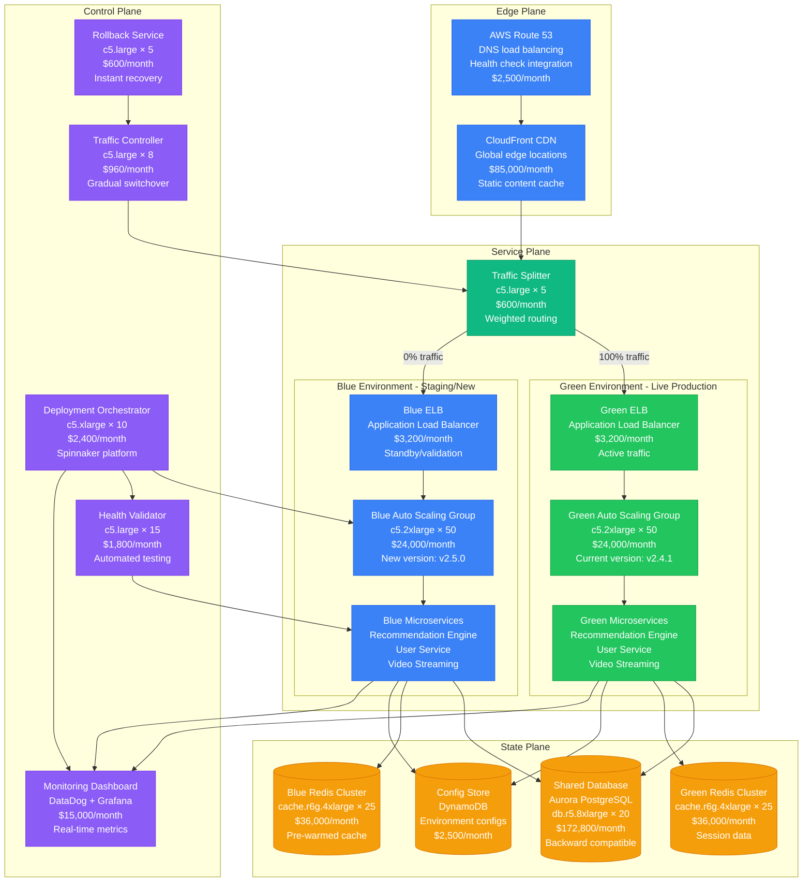
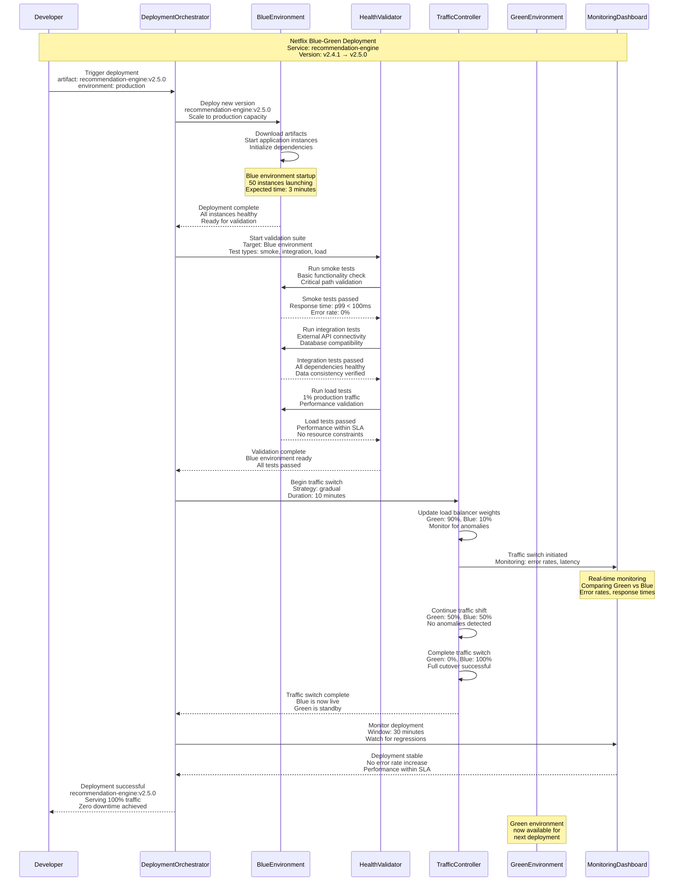
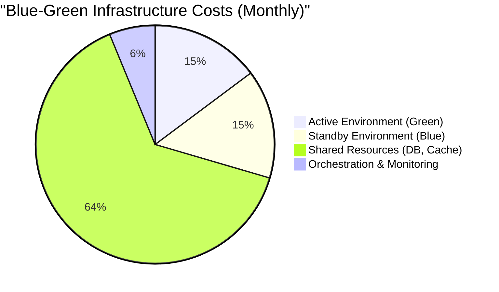

# Blue-Green Deployment Pattern: Netflix Production Strategy

## Pattern Overview

Blue-Green deployment eliminates downtime by maintaining two identical production environments. While one serves traffic (Green), the other (Blue) receives the new deployment. After validation, traffic switches instantly. Netflix pioneered this pattern for zero-downtime deployments across thousands of microservices serving 260+ million global subscribers.

## Netflix Blue-Green Deployment Architecture



## Blue-Green Deployment Flow



## Netflix Deployment Implementation

### Spinnaker Deployment Pipeline

```yaml
# Netflix Spinnaker Pipeline Configuration
name: "recommendation-engine-production-deployment"
application: "recommendation-engine"
keepWaitingPipelines: false
limitConcurrent: true
maxConcurrentExecutions: 1

stages:
  # Stage 1: Find Image
  - name: "Find Image"
    type: "findImage"
    cloudProvider: "aws"
    cluster: "recommendation-engine"
    credentials: "netflix-aws-prod"
    imageNamePattern: "recommendation-engine-.*"
    regions: ["us-east-1", "us-west-2", "eu-west-1"]

  # Stage 2: Deploy to Blue Environment
  - name: "Deploy Blue"
    type: "deploy"
    cloudProvider: "aws"
    credentials: "netflix-aws-prod"
    clusters:
      - account: "netflix-prod"
        application: "recommendation-engine"
        cloudProvider: "aws"
        targetHealthyDeployPercentage: 100
        capacity:
          desired: 50
          max: 75
          min: 50
        instanceType: "c5.2xlarge"
        keyPair: "netflix-prod-keypair"
        loadBalancers: ["recommendation-engine-blue-elb"]
        securityGroups: ["sg-blue-environment"]
        subnetType: "internal"
        useAmiBlockDeviceMappings: true

        # Health Check Configuration
        healthCheckType: "ELB"
        healthCheckGracePeriod: 300
        terminationPolicies: ["OldestInstance"]

        # Deployment Strategy
        strategy: "redblack"
        maxRemainingAsgs: 2
        delayBeforeDisableSec: 0
        delayBeforeScaleDownSec: 900
        rollback:
          onFailure: true

        # Auto Scaling Configuration
        suspendedProcesses: []
        terminationPolicies: ["OldestInstance"]

        # Tags
        tags:
          Environment: "production"
          DeploymentType: "blue-green"
          Service: "recommendation-engine"
          Version: "${trigger.artifacts[0].version}"

  # Stage 3: Wait for Blue Environment Health
  - name: "Wait for Blue Health"
    type: "wait"
    waitTime: 300 # 5 minutes

  # Stage 4: Run Smoke Tests
  - name: "Smoke Tests"
    type: "jenkins"
    master: "netflix-jenkins"
    job: "recommendation-engine-smoke-tests"
    parameters:
      TARGET_ENVIRONMENT: "blue"
      TARGET_ELB: "recommendation-engine-blue-elb"
      TEST_TIMEOUT: "600"
    markUnstableAsSuccessful: false
    waitForCompletion: true

  # Stage 5: Integration Tests
  - name: "Integration Tests"
    type: "jenkins"
    master: "netflix-jenkins"
    job: "recommendation-engine-integration-tests"
    parameters:
      TARGET_ENVIRONMENT: "blue"
      DATABASE_CONFIG: "prod-readonly"
      EXTERNAL_APIS: "user-service,content-service"
    markUnstableAsSuccessful: false
    waitForCompletion: true

  # Stage 6: Performance Tests
  - name: "Performance Tests"
    type: "jenkins"
    master: "netflix-jenkins"
    job: "recommendation-engine-performance-tests"
    parameters:
      TARGET_ENVIRONMENT: "blue"
      LOAD_PERCENTAGE: "10"
      DURATION_MINUTES: "10"
      SLA_RESPONSE_TIME: "100"
      SLA_ERROR_RATE: "0.1"
    markUnstableAsSuccessful: false
    waitForCompletion: true

  # Stage 7: Manual Judgment (Optional)
  - name: "Manual Approval"
    type: "manualJudgment"
    failPipeline: true
    instructions: |
      Blue environment has passed all automated tests.

      Blue Environment Metrics:
      - Response Time p99: Check DataDog
      - Error Rate: Check CloudWatch
      - Instance Health: Check ASG

      Proceed with traffic switch?
    judgmentInputs:
      - value: "proceed"
      - value: "abort"
    notifications:
      - type: "slack"
        channel: "#deployments"
        when: ["manualJudgment"]

  # Stage 8: Enable Traffic to Blue (Gradual)
  - name: "Switch Traffic 10%"
    type: "enableServerGroup"
    cloudProvider: "aws"
    cluster: "recommendation-engine"
    credentials: "netflix-aws-prod"
    targetPercentage: 10
    regions: ["us-east-1", "us-west-2", "eu-west-1"]

  - name: "Wait and Monitor 10%"
    type: "wait"
    waitTime: 300

  - name: "Switch Traffic 50%"
    type: "enableServerGroup"
    cloudProvider: "aws"
    cluster: "recommendation-engine"
    credentials: "netflix-aws-prod"
    targetPercentage: 50
    regions: ["us-east-1", "us-west-2", "eu-west-1"]

  - name: "Wait and Monitor 50%"
    type: "wait"
    waitTime: 300

  - name: "Switch Traffic 100%"
    type: "enableServerGroup"
    cloudProvider: "aws"
    cluster: "recommendation-engine"
    credentials: "netflix-aws-prod"
    targetPercentage: 100
    regions: ["us-east-1", "us-west-2", "eu-west-1"]

  # Stage 9: Disable Green Environment
  - name: "Disable Green"
    type: "disableServerGroup"
    cloudProvider: "aws"
    cluster: "recommendation-engine"
    credentials: "netflix-aws-prod"
    regions: ["us-east-1", "us-west-2", "eu-west-1"]
    targetServerGroup: "green"

  # Stage 10: Post-Deployment Monitoring
  - name: "Post-Deployment Monitor"
    type: "wait"
    waitTime: 1800 # 30 minutes

triggers:
  - type: "docker"
    registry: "netflix-docker-registry"
    repository: "netflix/recommendation-engine"
    tag: ""
    enabled: true

notifications:
  - type: "slack"
    channel: "#deployments"
    when: ["pipeline.starting", "pipeline.complete", "pipeline.failed"]
  - type: "email"
    to: ["sre-team@netflix.com"]
    when: ["pipeline.failed"]
```

### Automated Health Validation

```java
@Component
public class NetflixBlueGreenHealthValidator {

    @Autowired
    private LoadBalancerService loadBalancerService;

    @Autowired
    private MetricsService metricsService;

    @Autowired
    private TestExecutionService testExecutionService;

    @Autowired
    private AlertService alertService;

    public HealthValidationResult validateBlueEnvironment(String serviceName,
                                                         String blueEnvironmentId) {
        HealthValidationResult result = HealthValidationResult.builder()
            .serviceName(serviceName)
            .environmentId(blueEnvironmentId)
            .startTime(Instant.now())
            .build();

        try {
            // Phase 1: Infrastructure Health Check
            InfrastructureHealth infraHealth = validateInfrastructure(blueEnvironmentId);
            result.setInfrastructureHealth(infraHealth);

            if (!infraHealth.isHealthy()) {
                return result.failed("Infrastructure health check failed: " +
                    infraHealth.getFailureReasons());
            }

            // Phase 2: Application Health Check
            ApplicationHealth appHealth = validateApplication(blueEnvironmentId);
            result.setApplicationHealth(appHealth);

            if (!appHealth.isHealthy()) {
                return result.failed("Application health check failed: " +
                    appHealth.getFailureReasons());
            }

            // Phase 3: Functional Tests
            TestResults functionalTests = runFunctionalTests(blueEnvironmentId);
            result.setFunctionalTestResults(functionalTests);

            if (!functionalTests.allPassed()) {
                return result.failed("Functional tests failed: " +
                    functionalTests.getFailedTests());
            }

            // Phase 4: Performance Validation
            PerformanceResults performanceTests = runPerformanceTests(blueEnvironmentId);
            result.setPerformanceResults(performanceTests);

            if (!performanceTests.meetsRequirements()) {
                return result.failed("Performance requirements not met: " +
                    performanceTests.getViolations());
            }

            // Phase 5: Canary Traffic Test
            CanaryResults canaryResults = runCanaryTrafficTest(blueEnvironmentId);
            result.setCanaryResults(canaryResults);

            if (!canaryResults.isSuccessful()) {
                return result.failed("Canary traffic test failed: " +
                    canaryResults.getFailureReasons());
            }

            result.setEndTime(Instant.now());
            return result.success();

        } catch (Exception e) {
            log.error("Health validation failed for environment: {}", blueEnvironmentId, e);
            return result.failed("Validation error: " + e.getMessage());
        }
    }

    private InfrastructureHealth validateInfrastructure(String environmentId) {
        InfrastructureHealth health = new InfrastructureHealth();

        // Check Auto Scaling Group health
        AutoScalingGroupStatus asgStatus = loadBalancerService.getASGStatus(environmentId);
        health.setAutoScalingGroupHealth(asgStatus);

        if (asgStatus.getHealthyInstanceCount() < asgStatus.getDesiredCapacity()) {
            health.addFailureReason("ASG has unhealthy instances: " +
                asgStatus.getUnhealthyInstanceCount());
        }

        // Check Load Balancer health
        LoadBalancerStatus elbStatus = loadBalancerService.getELBStatus(environmentId);
        health.setLoadBalancerHealth(elbStatus);

        if (elbStatus.getHealthyTargetCount() < asgStatus.getDesiredCapacity()) {
            health.addFailureReason("ELB target health issues");
        }

        // Check networking connectivity
        NetworkConnectivityStatus networkStatus = validateNetworkConnectivity(environmentId);
        health.setNetworkConnectivity(networkStatus);

        return health;
    }

    private ApplicationHealth validateApplication(String environmentId) {
        ApplicationHealth health = new ApplicationHealth();

        // Get application instances
        List<String> instances = loadBalancerService.getInstanceIds(environmentId);

        for (String instanceId : instances) {
            try {
                // Health endpoint check
                HealthCheckResult healthCheck = callHealthEndpoint(instanceId);
                health.addInstanceHealth(instanceId, healthCheck);

                if (!healthCheck.isHealthy()) {
                    health.addFailureReason("Instance " + instanceId + " health check failed");
                }

                // Readiness check
                ReadinessResult readiness = checkReadiness(instanceId);
                health.addInstanceReadiness(instanceId, readiness);

                if (!readiness.isReady()) {
                    health.addFailureReason("Instance " + instanceId + " not ready");
                }

            } catch (Exception e) {
                health.addFailureReason("Failed to check instance " + instanceId + ": " + e.getMessage());
            }
        }

        return health;
    }

    private CanaryResults runCanaryTrafficTest(String blueEnvironmentId) {
        CanaryResults results = new CanaryResults();

        try {
            // Route 1% of traffic to blue environment for 5 minutes
            TrafficSplitConfig canaryConfig = TrafficSplitConfig.builder()
                .bluePercentage(1)
                .greenPercentage(99)
                .duration(Duration.ofMinutes(5))
                .build();

            trafficController.applySplit(canaryConfig);

            // Monitor metrics during canary
            Instant startTime = Instant.now();
            Instant endTime = startTime.plus(Duration.ofMinutes(5));

            while (Instant.now().isBefore(endTime)) {
                CanaryMetrics metrics = collectCanaryMetrics(blueEnvironmentId);
                results.addMetrics(metrics);

                // Check for anomalies
                if (hasAnomalies(metrics)) {
                    results.setFailureReason("Anomalies detected during canary test");
                    break;
                }

                Thread.sleep(10000); // Check every 10 seconds
            }

            // Revert traffic split
            trafficController.revertToGreen();

            // Analyze results
            results.setSuccessful(!results.hasFailures());

        } catch (Exception e) {
            results.setFailureReason("Canary test execution failed: " + e.getMessage());
        }

        return results;
    }

    private boolean hasAnomalies(CanaryMetrics metrics) {
        // Check error rate
        if (metrics.getErrorRate() > 0.1) { // > 0.1%
            return true;
        }

        // Check response time degradation
        if (metrics.getP99ResponseTime() > Duration.ofMillis(200)) {
            return true;
        }

        // Check for unusual patterns
        if (metrics.hasUnusualPatterns()) {
            return true;
        }

        return false;
    }
}
```

## Real Production Metrics

### Netflix Blue-Green Deployment Performance (2023)

- **Daily Deployments**: 8,000+ blue-green deployments across all services
- **Deployment Success Rate**: 99.7% successful deployments
- **Zero Downtime**: 100% of deployments achieve zero downtime
- **Rollback Time**: 30 seconds average rollback to previous environment
- **Validation Time**: 8 minutes average for full health validation

### Deployment Performance by Service Type

```mermaid
xychart-beta
    title "Blue-Green Deployment Times by Service Type"
    x-axis ["UI Services", "API Services", "Data Services", "ML Services", "Infrastructure"]
    y-axis "Deployment Time (minutes)" 0 --> 25
    bar "Environment Setup" [3, 4, 8, 12, 15]
    bar "Health Validation" [2, 3, 5, 8, 6]
    bar "Traffic Switch" [1, 2, 3, 2, 4]
    bar "Total Time" [6, 9, 16, 22, 25]
```



### Cost Analysis



## Advanced Blue-Green Patterns

### Database Schema Migration Strategy

```java
@Component
public class BlueGreenDatabaseMigrationService {

    @Autowired
    private DatabaseVersioningService dbVersioning;

    @Autowired
    private SchemaCompatibilityChecker compatibilityChecker;

    public DatabaseMigrationPlan planMigration(String serviceName, String newVersion) {
        // Analyze schema changes
        SchemaChanges changes = dbVersioning.getSchemaChanges(serviceName, newVersion);

        // Check backward compatibility
        CompatibilityResult compatibility = compatibilityChecker.checkCompatibility(changes);

        if (compatibility.isBackwardCompatible()) {
            return createStandardMigrationPlan(changes);
        } else {
            return createExpandContractMigrationPlan(changes);
        }
    }

    private DatabaseMigrationPlan createExpandContractMigrationPlan(SchemaChanges changes) {
        return DatabaseMigrationPlan.builder()
            .strategy(MigrationStrategy.EXPAND_CONTRACT)

            // Phase 1: Expand - Add new schema elements
            .expandPhase(MigrationPhase.builder()
                .description("Add new columns/tables, maintain old structure")
                .operations(List.of(
                    "ALTER TABLE users ADD COLUMN new_field VARCHAR(255)",
                    "CREATE INDEX idx_users_new_field ON users(new_field)",
                    "CREATE VIEW users_v2 AS SELECT * FROM users"
                ))
                .rollbackOperations(List.of(
                    "DROP VIEW users_v2",
                    "DROP INDEX idx_users_new_field",
                    "ALTER TABLE users DROP COLUMN new_field"
                ))
                .build())

            // Phase 2: Deploy Blue with dual writes
            .deploymentPhase(MigrationPhase.builder()
                .description("Deploy blue environment with dual writes")
                .preConditions(List.of("expand_phase_complete", "dual_write_enabled"))
                .validation("Verify dual writes working correctly")
                .build())

            // Phase 3: Contract - Remove old schema elements
            .contractPhase(MigrationPhase.builder()
                .description("Remove old schema elements after traffic switch")
                .delayAfterTrafficSwitch(Duration.ofHours(24))
                .operations(List.of(
                    "ALTER TABLE users DROP COLUMN old_field",
                    "DROP VIEW users_v1"
                ))
                .build())

            .build();
    }

    @Transactional
    public void executeMigrationPhase(MigrationPhase phase) {
        log.info("Executing migration phase: {}", phase.getDescription());

        try {
            // Check pre-conditions
            for (String preCondition : phase.getPreConditions()) {
                if (!checkPreCondition(preCondition)) {
                    throw new MigrationException("Pre-condition not met: " + preCondition);
                }
            }

            // Execute operations
            for (String operation : phase.getOperations()) {
                dbVersioning.executeOperation(operation);
            }

            // Run validation
            if (phase.getValidation() != null) {
                ValidationResult result = runValidation(phase.getValidation());
                if (!result.isValid()) {
                    throw new MigrationException("Validation failed: " + result.getErrors());
                }
            }

            // Mark phase as complete
            dbVersioning.markPhaseComplete(phase.getName());

        } catch (Exception e) {
            log.error("Migration phase failed: {}", phase.getDescription(), e);

            // Execute rollback operations
            for (String rollbackOp : phase.getRollbackOperations()) {
                try {
                    dbVersioning.executeOperation(rollbackOp);
                } catch (Exception rollbackError) {
                    log.error("Rollback operation failed: {}", rollbackOp, rollbackError);
                }
            }

            throw new MigrationException("Migration phase failed and rolled back", e);
        }
    }
}
```

### Intelligent Traffic Switching

```java
@Component
public class IntelligentTrafficSwitcher {

    @Autowired
    private MetricsCollector metricsCollector;

    @Autowired
    private AnomalyDetectionService anomalyDetection;

    @Autowired
    private LoadBalancerService loadBalancerService;

    public TrafficSwitchResult executeIntelligentSwitch(String serviceName,
                                                       String blueEnvironmentId) {
        TrafficSwitchPlan plan = createSwitchPlan(serviceName);
        TrafficSwitchResult result = new TrafficSwitchResult();

        for (TrafficSwitchStep step : plan.getSteps()) {
            try {
                // Execute traffic switch step
                executeTrafficStep(step);

                // Monitor for specified duration
                MonitoringResult monitoring = monitorTrafficStep(step);

                if (monitoring.hasIssues()) {
                    // Automatic rollback on issues
                    rollbackTrafficSwitch(serviceName);
                    return result.failed("Traffic switch rolled back due to: " +
                        monitoring.getIssues());
                }

                result.addCompletedStep(step);

            } catch (Exception e) {
                log.error("Traffic switch step failed: {}", step, e);
                rollbackTrafficSwitch(serviceName);
                return result.failed("Traffic switch failed: " + e.getMessage());
            }
        }

        return result.success();
    }

    private TrafficSwitchPlan createSwitchPlan(String serviceName) {
        ServiceConfiguration config = configService.getServiceConfiguration(serviceName);

        // Create adaptive plan based on service characteristics
        if (config.isHighRiskService()) {
            return createConservativePlan(); // Slower, more validation
        } else if (config.isHighVolumeService()) {
            return createHighVolumePlan(); // Optimized for throughput
        } else {
            return createStandardPlan(); // Balanced approach
        }
    }

    private TrafficSwitchPlan createConservativePlan() {
        return TrafficSwitchPlan.builder()
            .steps(List.of(
                TrafficSwitchStep.builder()
                    .bluePercentage(1)
                    .duration(Duration.ofMinutes(5))
                    .validationIntensive(true)
                    .build(),
                TrafficSwitchStep.builder()
                    .bluePercentage(5)
                    .duration(Duration.ofMinutes(5))
                    .build(),
                TrafficSwitchStep.builder()
                    .bluePercentage(10)
                    .duration(Duration.ofMinutes(10))
                    .build(),
                TrafficSwitchStep.builder()
                    .bluePercentage(25)
                    .duration(Duration.ofMinutes(10))
                    .build(),
                TrafficSwitchStep.builder()
                    .bluePercentage(50)
                    .duration(Duration.ofMinutes(15))
                    .build(),
                TrafficSwitchStep.builder()
                    .bluePercentage(100)
                    .duration(Duration.ofMinutes(30))
                    .build()
            ))
            .totalDuration(Duration.ofMinutes(75))
            .rollbackOnFirstAnomaly(true)
            .build();
    }

    private MonitoringResult monitorTrafficStep(TrafficSwitchStep step) {
        MonitoringResult result = new MonitoringResult();
        Instant monitoringStart = Instant.now();
        Instant monitoringEnd = monitoringStart.plus(step.getDuration());

        while (Instant.now().isBefore(monitoringEnd)) {
            try {
                // Collect metrics from both environments
                EnvironmentMetrics blueMetrics = metricsCollector.getBlueMetrics();
                EnvironmentMetrics greenMetrics = metricsCollector.getGreenMetrics();

                // Compare metrics
                MetricsComparison comparison = compareMetrics(blueMetrics, greenMetrics);

                if (comparison.hasSignificantDifferences()) {
                    result.addIssue("Significant metric differences detected: " +
                        comparison.getDifferences());
                }

                // Run anomaly detection
                AnomalyResult anomalies = anomalyDetection.detectAnomalies(blueMetrics);

                if (anomalies.hasAnomalies()) {
                    result.addIssue("Anomalies detected in blue environment: " +
                        anomalies.getAnomalies());
                }

                // Check for early success indicators
                if (comparison.showsImprovement() && step.canEarlyComplete()) {
                    log.info("Early completion criteria met for traffic step");
                    break;
                }

                Thread.sleep(Duration.ofSeconds(30).toMillis());

            } catch (Exception e) {
                result.addIssue("Monitoring error: " + e.getMessage());
                break;
            }
        }

        return result;
    }
}
```

## Best Practices & Lessons Learned

### Blue-Green Design Principles

1. **Database Backward Compatibility**: Ensure schema changes don't break old code
2. **Shared State Management**: Handle shared resources carefully (databases, caches)
3. **Comprehensive Testing**: Validate thoroughly before traffic switch
4. **Instant Rollback**: Maintain ability to switch back immediately
5. **Resource Efficiency**: Optimize for cost during standby periods

### Common Anti-Patterns

❌ **Shared Mutable State**
```java
// Wrong: Blue and Green sharing mutable cache
@Service
public class UserService {
    @Autowired
    private RedisTemplate<String, User> sharedCache; // Dangerous!

    public void updateUser(User user) {
        database.save(user);
        sharedCache.put(user.getId(), user); // Cache pollution
    }
}
```

✅ **Environment-Specific Resources**
```java
// Correct: Separate caches for each environment
@Service
public class UserService {
    @Value("${environment.color}") // blue or green
    private String environmentColor;

    @Autowired
    private RedisTemplate<String, User> environmentCache;

    public void updateUser(User user) {
        database.save(user);
        environmentCache.put(user.getId(), user); // Environment-specific
    }
}
```

### Netflix-Specific Optimizations

| Service Type | Switch Strategy | Validation Time | Rollback SLA |
|--------------|----------------|-----------------|-------------|
| Video Streaming | Ultra-conservative | 30 min | 15 seconds |
| Recommendations | Progressive | 15 min | 30 seconds |
| User Profiles | Standard | 10 min | 30 seconds |
| Content Metadata | Fast | 5 min | 60 seconds |
| Analytics | Bulk | 2 min | 120 seconds |

## Conclusion

Netflix's Blue-Green deployment implementation provides:

- **8,000+ daily deployments** with zero downtime
- **99.7% deployment success rate** through automated validation
- **30-second average rollback time** for instant recovery
- **100% uptime** maintained during deployments
- **2x infrastructure cost** justified by business continuity value

The pattern enables Netflix to deploy multiple times daily while maintaining the high availability required for 260+ million global subscribers, demonstrating how proper blue-green implementation can achieve both rapid iteration and operational excellence.