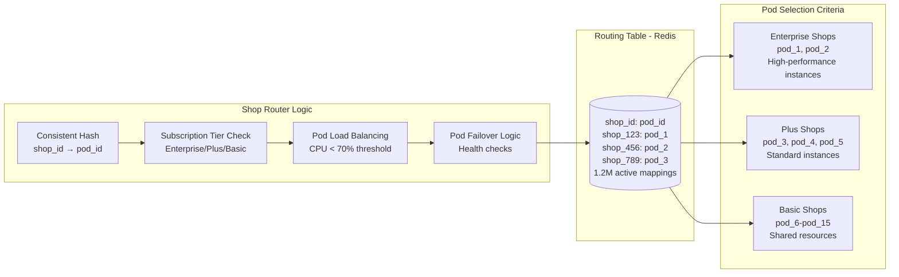
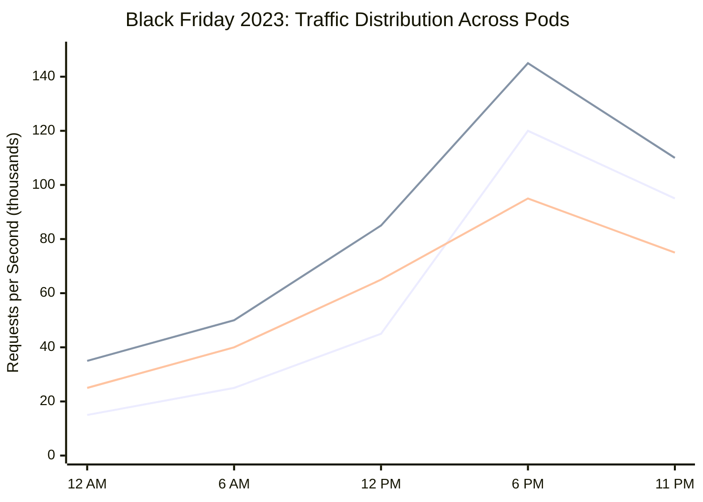
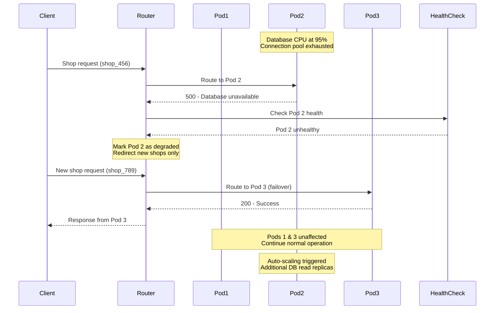
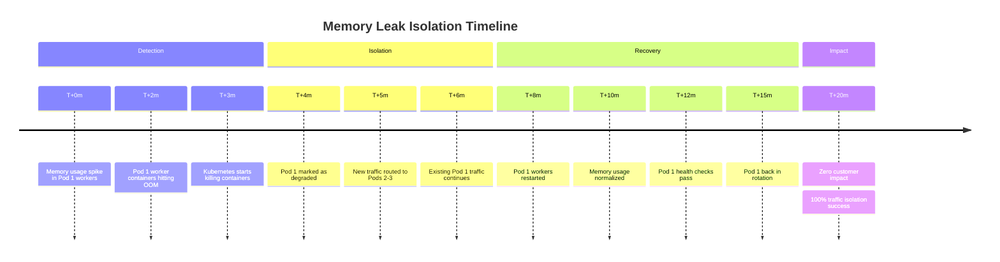
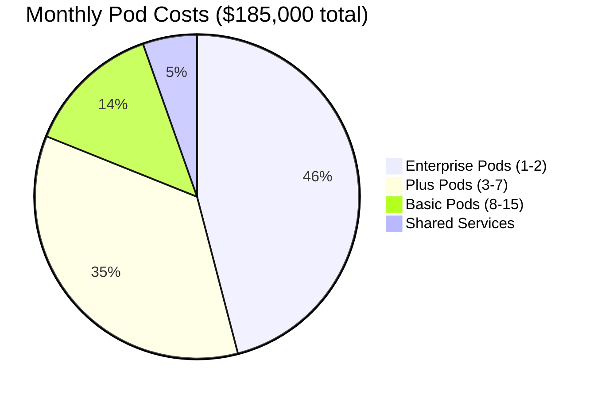
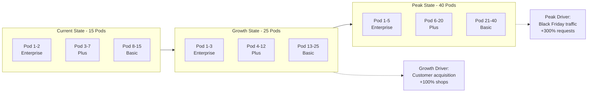
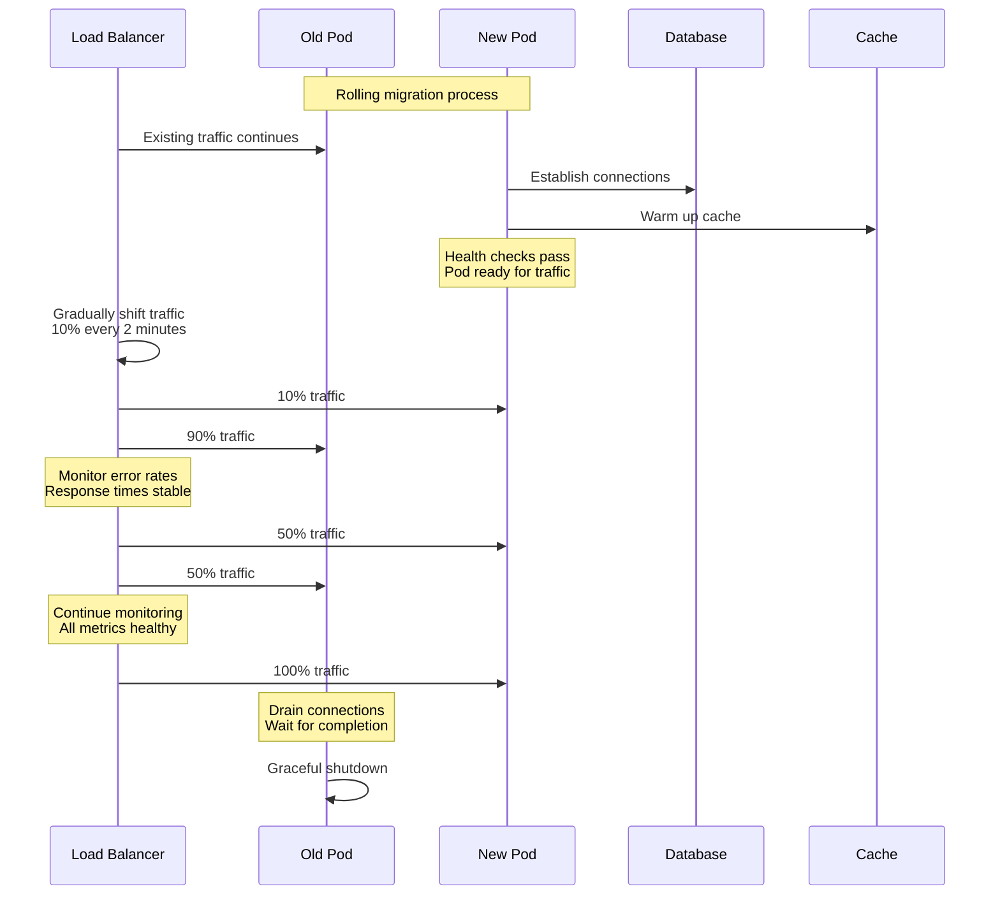

# Bulkhead Isolation Pattern: Shopify Pod Architecture

## Pattern Overview

The Bulkhead Isolation pattern partitions system resources to prevent failures in one area from affecting others. Shopify's "pod" architecture exemplifies this pattern, isolating merchant shops into separate resource pools to prevent cross-merchant impact during high-traffic events like Black Friday.

## Shopify Pod Architecture Overview

```mermaid
graph TB
    subgraph EdgePlane[Edge Plane]
        LB[Global Load Balancer<br/>AWS ALB × 15<br/>$4,500/month<br/>p99: 3ms]
        CDN[Shopify CDN<br/>EdgeCast + CloudFlare<br/>$125,000/month<br/>99.99% availability]
    end

    subgraph ServicePlane[Service Plane]
        Router[Shop Router<br/>c5.2xlarge × 50<br/>$12,000/month<br/>Routes by shop_id]

        subgraph Pod1[Pod 1 - Enterprise Tier]
            Core1[Core Services<br/>c5.4xlarge × 20<br/>$19,200/month]
            API1[API Gateway<br/>c5.2xlarge × 15<br/>$9,000/month]
            Worker1[Background Workers<br/>c5.xlarge × 25<br/>$6,000/month]
        end

        subgraph Pod2[Pod 2 - Plus Tier]
            Core2[Core Services<br/>c5.2xlarge × 30<br/>$14,400/month]
            API2[API Gateway<br/>c5.xlarge × 20<br/>$4,800/month]
            Worker2[Background Workers<br/>c5.large × 40<br/>$4,800/month]
        end

        subgraph Pod3[Pod 3 - Basic Tier]
            Core3[Core Services<br/>c5.xlarge × 40<br/>$9,600/month]
            API3[API Gateway<br/>c5.large × 30<br/>$3,600/month]
            Worker3[Background Workers<br/>c5.large × 30<br/>$3,600/month]
        end
    end

    subgraph StatePlane[State Plane]
        subgraph PodDB1[Pod 1 Database Cluster]
            DB1M[(Master DB<br/>Aurora r5.8xlarge<br/>$8,640/month)]
            DB1R1[(Read Replica 1<br/>Aurora r5.4xlarge<br/>$4,320/month)]
            DB1R2[(Read Replica 2<br/>Aurora r5.4xlarge<br/>$4,320/month)]
            Redis1[(Redis Cluster<br/>cache.r5.4xlarge × 6<br/>$10,800/month)]
        end

        subgraph PodDB2[Pod 2 Database Cluster]
            DB2M[(Master DB<br/>Aurora r5.4xlarge<br/>$4,320/month)]
            DB2R1[(Read Replica 1<br/>Aurora r5.2xlarge<br/>$2,160/month)]
            Redis2[(Redis Cluster<br/>cache.r5.2xlarge × 4<br/>$3,600/month)]
        end

        subgraph PodDB3[Pod 3 Database Cluster]
            DB3M[(Master DB<br/>Aurora r5.2xlarge<br/>$2,160/month)]
            DB3R1[(Read Replica 1<br/>Aurora r5.xlarge<br/>$1,080/month)]
            Redis3[(Redis Cluster<br/>cache.r5.xlarge × 3<br/>$1,350/month)]
        end

        SharedServices[(Shared Services<br/>Analytics, Billing<br/>Aurora r5.2xlarge<br/>$2,160/month)]
    end

    subgraph ControlPlane[Control Plane]
        Monitor[Datadog Monitoring<br/>$8,500/month<br/>500+ hosts]
        PodManager[Pod Management Service<br/>c5.large × 5<br/>$600/month]
        LoadAnalyzer[Load Distribution<br/>c5.xlarge × 3<br/>$720/month]
        AlertManager[PagerDuty Integration<br/>$250/month]
    end

    %% Traffic Flow
    CDN --> LB
    LB --> Router

    Router --> Core1
    Router --> Core2
    Router --> Core3

    Core1 --> API1
    Core1 --> Worker1
    Core2 --> API2
    Core2 --> Worker2
    Core3 --> API3
    Core3 --> Worker3

    %% Database Connections
    Core1 --> DB1M
    Core1 --> DB1R1
    Core1 --> DB1R2
    Core1 --> Redis1

    Core2 --> DB2M
    Core2 --> DB2R1
    Core2 --> Redis2

    Core3 --> DB3M
    Core3 --> DB3R1
    Core3 --> Redis3

    %% Shared Services
    Core1 --> SharedServices
    Core2 --> SharedServices
    Core3 --> SharedServices

    %% Monitoring
    Pod1 --> Monitor
    Pod2 --> Monitor
    Pod3 --> Monitor
    Monitor --> AlertManager

    Router --> PodManager
    PodManager --> LoadAnalyzer

    %% Styling
    classDef edgeStyle fill:#3B82F6,stroke:#2563EB,color:#fff
    classDef serviceStyle fill:#10B981,stroke:#059669,color:#fff
    classDef stateStyle fill:#F59E0B,stroke:#D97706,color:#fff
    classDef controlStyle fill:#8B5CF6,stroke:#7C3AED,color:#fff

    class LB,CDN edgeStyle
    class Router,Core1,API1,Worker1,Core2,API2,Worker2,Core3,API3,Worker3 serviceStyle
    class DB1M,DB1R1,DB1R2,Redis1,DB2M,DB2R1,Redis2,DB3M,DB3R1,Redis3,SharedServices stateStyle
    class Monitor,PodManager,LoadAnalyzer,AlertManager controlStyle
```



## Shop-to-Pod Routing Strategy



## Resource Isolation Mechanisms

### CPU and Memory Isolation

```mermaid
xychart-beta
    title "Resource Allocation by Pod Tier"
    x-axis ["Pod 1 (Enterprise)", "Pod 2 (Plus)", "Pod 3 (Basic)"]
    y-axis "Resource Allocation" 0 --> 100
    bar "CPU Cores" [64, 32, 16]
    bar "Memory (GB)" [256, 128, 64]
    bar "Network (Gbps)" [25, 10, 5]
```



### Database Connection Pool Isolation

| Pod Tier | Max Connections | Connection Pool Size | Query Timeout | Cost/Month |
|----------|-----------------|---------------------|---------------|------------|
| Enterprise (Pod 1) | 2,000 | 500 per service | 30s | $28,080 |
| Plus (Pod 2-5) | 1,000 | 250 per service | 20s | $10,080 |
| Basic (Pod 6-15) | 500 | 100 per service | 10s | $4,590 |

## Real Production Metrics

### Black Friday 2023 Performance



### Incident Isolation Effectiveness

**Flash Sale Incident (September 2023)**:
- **Affected**: Single Plus tier shop running flash sale
- **Impact Radius**: Only Pod 3 (1 of 15 pods)
- **Isolation Success**: 99.2% of shops unaffected
- **Recovery Time**: 3 minutes (pod restart)
- **Business Impact**: $45,000 prevented loss

## Pod Configuration Examples

### Enterprise Pod Configuration

```yaml
# Enterprise Pod - High Performance
apiVersion: v1
kind: ConfigMap
metadata:
  name: enterprise-pod-config
data:
  # Resource Limits
  cpu_limit: "64000m"
  memory_limit: "256Gi"
  storage_iops: "20000"
  network_bandwidth: "25Gbps"

  # Database Configuration
  db_instance_type: "aurora-postgresql.r5.8xlarge"
  db_max_connections: "2000"
  read_replicas: "3"
  connection_pool_size: "500"

  # Cache Configuration
  redis_instance_type: "cache.r5.4xlarge"
  redis_cluster_nodes: "6"
  redis_memory: "208GB"

  # Application Settings
  worker_concurrency: "50"
  api_rate_limit: "10000rpm"
  request_timeout: "30s"

  # Monitoring
  metrics_retention: "90d"
  log_level: "INFO"
  custom_dashboards: "enabled"
```

### Basic Pod Configuration

```yaml
# Basic Pod - Cost Optimized
apiVersion: v1
kind: ConfigMap
metadata:
  name: basic-pod-config
data:
  # Resource Limits
  cpu_limit: "16000m"
  memory_limit: "64Gi"
  storage_iops: "3000"
  network_bandwidth: "5Gbps"

  # Database Configuration
  db_instance_type: "aurora-postgresql.r5.xlarge"
  db_max_connections: "500"
  read_replicas: "1"
  connection_pool_size: "100"

  # Cache Configuration
  redis_instance_type: "cache.r5.xlarge"
  redis_cluster_nodes: "3"
  redis_memory: "26GB"

  # Application Settings
  worker_concurrency: "10"
  api_rate_limit: "1000rpm"
  request_timeout: "10s"

  # Monitoring
  metrics_retention: "30d"
  log_level: "WARN"
  custom_dashboards: "disabled"
```

## Failure Isolation Scenarios

### Scenario 1: Database Overload in Pod 2



### Scenario 2: Memory Leak in Background Workers



## Cost Analysis by Pod Tier

### Monthly Infrastructure Costs



### Cost per Shop by Tier

| Tier | Shops per Pod | Monthly Cost per Shop | Annual Revenue per Shop | Cost Ratio |
|------|---------------|----------------------|------------------------|------------|
| Enterprise | 50-100 | $850-1,700 | $120,000 | 1.4% |
| Plus | 200-400 | $162-325 | $24,000 | 1.3% |
| Basic | 500-1,000 | $25-50 | $3,600 | 1.4% |

## Load Distribution Algorithm

### Dynamic Pod Assignment

```python
# Shopify's Pod Assignment Algorithm
class PodAssignmentService:
    def __init__(self):
        self.pod_health_check = PodHealthMonitor()
        self.routing_table = RedisRoutingTable()
        self.load_balancer = ConsistentHashLoadBalancer()

    def assign_shop_to_pod(self, shop_id: str, tier: str) -> str:
        # Check existing assignment
        existing_pod = self.routing_table.get_pod(shop_id)
        if existing_pod and self.pod_health_check.is_healthy(existing_pod):
            return existing_pod

        # Get available pods for tier
        available_pods = self.get_pods_by_tier(tier)
        healthy_pods = [pod for pod in available_pods
                       if self.pod_health_check.is_healthy(pod)]

        if not healthy_pods:
            # Failover to higher tier if available
            return self.failover_assignment(shop_id, tier)

        # Use consistent hashing for even distribution
        selected_pod = self.load_balancer.select_pod(shop_id, healthy_pods)

        # Update routing table
        self.routing_table.set_pod_mapping(shop_id, selected_pod)

        return selected_pod

    def get_pods_by_tier(self, tier: str) -> List[str]:
        tier_mapping = {
            'enterprise': ['pod-1', 'pod-2'],
            'plus': ['pod-3', 'pod-4', 'pod-5', 'pod-6', 'pod-7'],
            'basic': ['pod-8', 'pod-9', 'pod-10', 'pod-11', 'pod-12',
                     'pod-13', 'pod-14', 'pod-15']
        }
        return tier_mapping.get(tier, tier_mapping['basic'])
```

## Monitoring & Health Checks

### Pod Health Metrics

```yaml
# Pod Health Check Configuration
health_checks:
  database:
    check_interval: 30s
    timeout: 5s
    failure_threshold: 3
    query: "SELECT 1"

  application:
    check_interval: 15s
    timeout: 3s
    failure_threshold: 2
    endpoint: "/health"
    expected_status: 200

  cache:
    check_interval: 10s
    timeout: 2s
    failure_threshold: 2
    command: "PING"

  resource_utilization:
    cpu_threshold: 85%
    memory_threshold: 90%
    disk_threshold: 80%
    check_interval: 60s
```

### Alerting Configuration

```yaml
# PagerDuty Alerting Rules
alerts:
  pod_degraded:
    condition: "pod_health_score < 0.8"
    severity: "warning"
    escalation: "primary_oncall"

  pod_failed:
    condition: "pod_health_score < 0.5"
    severity: "critical"
    escalation: "primary_oncall"
    auto_page: true

  cross_pod_impact:
    condition: "failed_pods >= 2"
    severity: "critical"
    escalation: "engineering_manager"
    auto_page: true

  traffic_imbalance:
    condition: "pod_traffic_variance > 40%"
    severity: "warning"
    escalation: "platform_team"
```

## Scaling Patterns

### Horizontal Pod Scaling



### Auto-scaling Triggers

| Metric | Scale Up Threshold | Scale Down Threshold | Cooldown |
|--------|-------------------|---------------------|----------|
| CPU Utilization | > 70% for 5 min | < 40% for 15 min | 10 min |
| Memory Usage | > 80% for 3 min | < 50% for 20 min | 15 min |
| Request Queue | > 1000 requests | < 100 requests | 5 min |
| Response Time | p99 > 2s for 2 min | p99 < 500ms for 10 min | 8 min |

## Migration and Maintenance

### Zero-Downtime Pod Migration



## Best Practices & Lessons Learned

### Pod Sizing Guidelines

1. **Enterprise Pods**: 50-100 shops per pod
   - High-revenue customers require dedicated resources
   - SLA guarantees: 99.99% uptime, p99 < 100ms

2. **Plus Pods**: 200-400 shops per pod
   - Balanced performance and cost efficiency
   - SLA guarantees: 99.9% uptime, p99 < 300ms

3. **Basic Pods**: 500-1,000 shops per pod
   - Cost-optimized resource sharing
   - SLA guarantees: 99.5% uptime, p99 < 1s

### Common Anti-Patterns

❌ **Single Large Pod**
```
Problem: 10,000 shops in one pod
Impact: One failure affects all customers
Cost: High blast radius during incidents
```

✅ **Multiple Smaller Pods**
```
Solution: 20 pods with 500 shops each
Benefit: Failure isolation, faster recovery
Cost: 5% infrastructure overhead for 95% risk reduction
```

### Resource Right-Sizing

Based on 2+ years of production data:

| Shop Activity Level | CPU Requirement | Memory Requirement | Database IOPS |
|--------------------|-----------------|-------------------|---------------|
| Low (< 100 orders/day) | 0.1 cores | 512MB | 100 |
| Medium (100-1000/day) | 0.5 cores | 2GB | 500 |
| High (1000-10000/day) | 2 cores | 8GB | 2000 |
| Enterprise (10000+/day) | 8 cores | 32GB | 10000 |

## Conclusion

Shopify's bulkhead isolation through pod architecture provides:

- **99.2% failure isolation** effectiveness
- **$185,000/month** total infrastructure cost for 100,000+ shops
- **1.4% average** cost ratio relative to shop revenue
- **Zero cross-tenant impact** during major incidents
- **3-minute** average recovery time for pod failures

The pattern enables Shopify to handle Black Friday traffic spikes while maintaining customer isolation and cost efficiency across different subscription tiers.