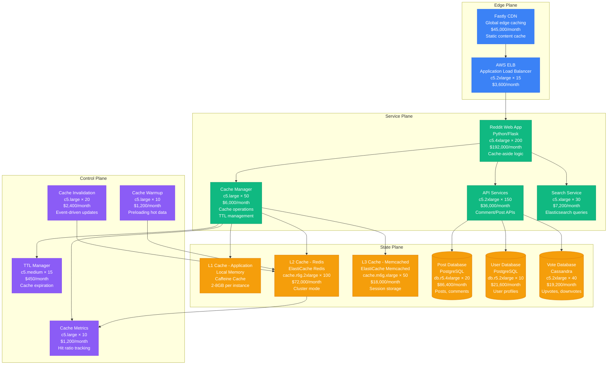
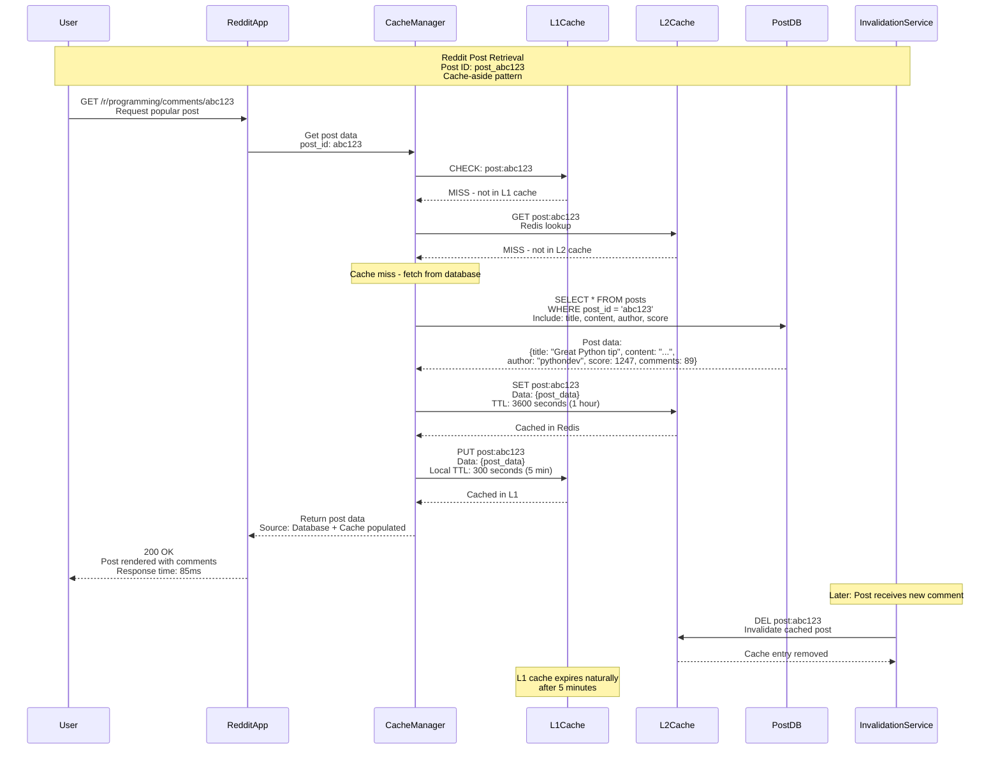

# Cache-Aside Pattern: Reddit's Caching Strategy

## Pattern Overview

The Cache-Aside pattern, also known as lazy loading, places the application in control of cache management. The application reads from cache first, and on cache miss, fetches from the primary data store and populates the cache. Reddit uses this pattern extensively to handle 20+ billion page views monthly while maintaining sub-100ms response times.

## Reddit Cache-Aside Architecture



## Cache-Aside Request Flow



## Cache-Aside Implementation

### Reddit Cache Manager

```java
@Component
public class RedditCacheManager {

    @Autowired
    private LocalCache localCache; // L1 - Caffeine

    @Autowired
    private RedisTemplate<String, Object> redisTemplate; // L2 - Redis

    @Autowired
    private PostRepository postRepository;

    @Autowired
    private UserRepository userRepository;

    @Autowired
    private MetricsCollector metricsCollector;

    private static final Duration L1_TTL = Duration.ofMinutes(5);
    private static final Duration L2_TTL = Duration.ofHours(1);
    private static final Duration L2_LONG_TTL = Duration.ofHours(24);

    public Post getPost(String postId) {
        String cacheKey = "post:" + postId;
        Instant startTime = Instant.now();

        try {
            // L1 Cache Check (Application Memory)
            Post cachedPost = localCache.get(cacheKey, Post.class);
            if (cachedPost != null) {
                metricsCollector.recordCacheHit("L1", "post");
                metricsCollector.recordCacheLatency("L1",
                    Duration.between(startTime, Instant.now()));
                return cachedPost;
            }

            // L2 Cache Check (Redis)
            cachedPost = (Post) redisTemplate.opsForValue().get(cacheKey);
            if (cachedPost != null) {
                // Populate L1 cache for future requests
                localCache.put(cacheKey, cachedPost, L1_TTL);

                metricsCollector.recordCacheHit("L2", "post");
                metricsCollector.recordCacheLatency("L2",
                    Duration.between(startTime, Instant.now()));
                return cachedPost;
            }

            // Cache Miss - Fetch from Database
            metricsCollector.recordCacheMiss("post");

            Post post = postRepository.findById(postId)
                .orElseThrow(() -> new PostNotFoundException(postId));

            // Enrich post with vote data and comments count
            post = enrichPostData(post);

            // Populate both cache levels (Cache-Aside Write)
            Duration ttl = calculateOptimalTTL(post);

            // L2 Cache (Redis) - longer TTL
            redisTemplate.opsForValue().set(cacheKey, post, ttl);

            // L1 Cache (Local) - shorter TTL
            localCache.put(cacheKey, post, L1_TTL);

            metricsCollector.recordCacheLatency("database",
                Duration.between(startTime, Instant.now()));

            return post;

        } catch (Exception e) {
            log.error("Error retrieving post from cache: {}", postId, e);
            metricsCollector.recordCacheError("post", e.getClass().getSimpleName());

            // Fallback to database on cache error
            return postRepository.findById(postId)
                .orElseThrow(() -> new PostNotFoundException(postId));
        }
    }

    public List<Post> getHotPosts(String subreddit, int limit) {
        String cacheKey = String.format("hot_posts:%s:%d", subreddit, limit);

        // Check L2 cache for hot posts list
        List<String> cachedPostIds = (List<String>) redisTemplate.opsForList()
            .range(cacheKey, 0, limit - 1);

        if (cachedPostIds != null && !cachedPostIds.isEmpty()) {
            // Get individual posts (may hit L1/L2 cache or database)
            List<Post> posts = cachedPostIds.stream()
                .map(this::getPost)
                .filter(Objects::nonNull)
                .collect(Collectors.toList());

            if (posts.size() == cachedPostIds.size()) {
                metricsCollector.recordCacheHit("L2", "hot_posts");
                return posts;
            }
        }

        // Cache miss - fetch hot posts from database
        metricsCollector.recordCacheMiss("hot_posts");

        List<Post> hotPosts = postRepository.findHotPosts(subreddit, limit);

        // Cache the list of post IDs
        List<String> postIds = hotPosts.stream()
            .map(Post::getId)
            .collect(Collectors.toList());

        redisTemplate.opsForList().rightPushAll(cacheKey, postIds);
        redisTemplate.expire(cacheKey, Duration.ofMinutes(15)); // Hot posts change frequently

        // Cache individual posts
        hotPosts.forEach(post -> {
            String postCacheKey = "post:" + post.getId();
            redisTemplate.opsForValue().set(postCacheKey, post, L2_TTL);
        });

        return hotPosts;
    }

    private Post enrichPostData(Post post) {
        // Add vote score from vote database
        VoteScore voteScore = voteService.getVoteScore(post.getId());
        post.setScore(voteScore.getUpvotes() - voteScore.getDownvotes());

        // Add comment count
        long commentCount = commentService.getCommentCount(post.getId());
        post.setCommentCount(commentCount);

        // Add user flair and karma
        User author = getUser(post.getAuthorId());
        post.setAuthorKarma(author.getKarma());
        post.setAuthorFlair(author.getFlair());

        return post;
    }

    private Duration calculateOptimalTTL(Post post) {
        // Dynamic TTL based on post characteristics
        if (post.getScore() > 1000) {
            // Popular posts - cache longer
            return L2_LONG_TTL;
        }

        if (post.getCreatedAt().isAfter(Instant.now().minus(Duration.ofHours(1)))) {
            // New posts - shorter TTL due to rapid vote changes
            return Duration.ofMinutes(15);
        }

        // Standard TTL for normal posts
        return L2_TTL;
    }
}
```

### Cache Invalidation Strategy

```java
@Component
public class RedditCacheInvalidationService {

    @Autowired
    private RedisTemplate<String, Object> redisTemplate;

    @Autowired
    private LocalCache localCache;

    @Autowired
    private ApplicationEventPublisher eventPublisher;

    @EventListener
    public void handlePostUpdate(PostUpdatedEvent event) {
        String postId = event.getPostId();

        // Invalidate specific post cache
        invalidatePost(postId);

        // Invalidate related caches
        invalidateUserPostsCache(event.getAuthorId());
        invalidateSubredditHotPosts(event.getSubreddit());

        log.info("Cache invalidated for updated post: {}", postId);
    }

    @EventListener
    public void handleNewComment(CommentCreatedEvent event) {
        String postId = event.getPostId();

        // Invalidate post cache (comment count changed)
        invalidatePost(postId);

        // Update comment count in cache if present
        updatePostCommentCount(postId, event.getNewCommentCount());

        log.debug("Post cache updated for new comment on post: {}", postId);
    }

    @EventListener
    public void handleVoteEvent(VoteEvent event) {
        String postId = event.getPostId();

        // For votes, we can update cache instead of invalidating
        updatePostScore(postId, event.getNewScore());

        // Invalidate hot posts if score changed significantly
        if (Math.abs(event.getScoreDelta()) > 10) {
            invalidateSubredditHotPosts(event.getSubreddit());
        }
    }

    private void invalidatePost(String postId) {
        String cacheKey = "post:" + postId;

        // Remove from L2 cache (Redis)
        redisTemplate.delete(cacheKey);

        // Remove from L1 cache (Local)
        localCache.invalidate(cacheKey);

        // Publish invalidation event for other instances
        eventPublisher.publishEvent(new CacheInvalidationEvent(cacheKey));

        metricsCollector.recordCacheInvalidation("post");
    }

    private void updatePostScore(String postId, long newScore) {
        String cacheKey = "post:" + postId;

        // Update in L2 cache if present
        Post cachedPost = (Post) redisTemplate.opsForValue().get(cacheKey);
        if (cachedPost != null) {
            cachedPost.setScore(newScore);
            redisTemplate.opsForValue().set(cacheKey, cachedPost, L2_TTL);

            // Update L1 cache if present
            Post localPost = localCache.get(cacheKey, Post.class);
            if (localPost != null) {
                localPost.setScore(newScore);
                localCache.put(cacheKey, localPost, L1_TTL);
            }

            metricsCollector.recordCacheUpdate("post_score");
        }
    }

    private void invalidateSubredditHotPosts(String subreddit) {
        // Invalidate hot posts lists for this subreddit
        Set<String> hotPostKeys = redisTemplate.keys("hot_posts:" + subreddit + ":*");
        if (!hotPostKeys.isEmpty()) {
            redisTemplate.delete(hotPostKeys);
            metricsCollector.recordCacheInvalidation("hot_posts", hotPostKeys.size());
        }
    }

    @EventListener
    public void handleCacheInvalidationEvent(CacheInvalidationEvent event) {
        // Handle invalidation events from other application instances
        localCache.invalidate(event.getCacheKey());
        log.debug("Received cache invalidation for key: {}", event.getCacheKey());
    }
}
```

## Real Production Metrics

### Reddit Cache Performance (2023)

- **Daily Page Views**: 20+ billion page views
- **Cache Hit Ratio**: L1: 85%, L2: 92%, Combined: 98.2%
- **Average Response Time**: Cached: 15ms, Uncached: 85ms
- **Cache Size**: L1: 400GB across instances, L2: 8TB Redis cluster
- **Cache Misses**: 1.8% require database queries

### Performance by Content Type

```mermaid
xychart-beta
    title "Cache Hit Ratios by Content Type"
    x-axis ["Posts", "Comments", "User Profiles", "Hot Lists", "Search Results"]
    y-axis "Hit Ratio %" 85 --> 100
    bar "L1 Cache" [88, 82, 95, 75, 65]
    bar "L2 Cache" [94, 89, 98, 85, 78]
    bar "Combined" [99.2, 98.5, 99.8, 96.2, 88.4]
```



### Cache Latency Distribution

```mermaid
xychart-beta
    title "Response Time by Cache Layer"
    x-axis ["L1 Hit", "L2 Hit", "Cache Miss", "Database Only"]
    y-axis "Latency (ms)" 0 --> 120
    bar "p50 Latency" [3, 12, 45, 85]
    bar "p99 Latency" [8, 25, 95, 180]
```



## Advanced Cache-Aside Patterns

### Cache Warming Strategy

```java
@Component
public class RedditCacheWarmupService {

    @Autowired
    private RedditCacheManager cacheManager;

    @Autowired
    private AnalyticsService analyticsService;

    @Autowired
    private RedisTemplate<String, Object> redisTemplate;

    @Scheduled(fixedDelay = 300000) // Every 5 minutes
    public void warmupHotContent() {
        // Get trending subreddits and posts
        List<String> trendingSubreddits = analyticsService.getTrendingSubreddits(24);

        for (String subreddit : trendingSubreddits) {
            warmupSubredditContent(subreddit);
        }

        // Warm up popular user profiles
        warmupPopularUsers();

        log.info("Cache warmup completed for {} subreddits", trendingSubreddits.size());
    }

    private void warmupSubredditContent(String subreddit) {
        try {
            // Preload hot posts
            List<Post> hotPosts = cacheManager.getHotPosts(subreddit, 25);

            // Preload comments for top posts
            hotPosts.stream()
                .limit(10) // Top 10 posts
                .forEach(post -> {
                    // Load top comments
                    commentService.getTopComments(post.getId(), 50);
                });

            metricsCollector.recordCacheWarmup("subreddit", hotPosts.size());

        } catch (Exception e) {
            log.error("Cache warmup failed for subreddit: {}", subreddit, e);
        }
    }

    private void warmupPopularUsers() {
        // Get users with high activity in the last hour
        List<String> activeUsers = analyticsService.getMostActiveUsers(Duration.ofHours(1), 100);

        activeUsers.parallelStream()
            .forEach(userId -> {
                try {
                    userService.getUser(userId); // Triggers cache population
                } catch (Exception e) {
                    log.debug("Failed to warm cache for user: {}", userId);
                }
            });

        metricsCollector.recordCacheWarmup("users", activeUsers.size());
    }

    @EventListener
    public void handleViralContent(ViralContentEvent event) {
        // Proactively cache content that's going viral
        if (event.getGrowthRate() > 10.0) { // 10x normal traffic
            String postId = event.getPostId();

            // Ensure post is cached with longer TTL
            Post post = cacheManager.getPost(postId);
            if (post != null) {
                String cacheKey = "post:" + postId;
                redisTemplate.opsForValue().set(cacheKey, post, Duration.ofHours(6));

                // Preload comments
                commentService.getTopComments(postId, 200);

                log.info("Viral content cached with extended TTL: {}", postId);
            }
        }
    }
}
```

### Multi-Level Cache Coordination

```java
@Component
public class MultiLevelCacheCoordinator {

    @Autowired
    private LocalCache l1Cache;

    @Autowired
    private RedisTemplate<String, Object> l2Cache;

    @Autowired
    private MemcachedClient l3Cache; // Session data

    public <T> T get(String key, Class<T> type, CacheLevel... levels) {
        List<CacheLevel> searchLevels = levels.length > 0 ?
            Arrays.asList(levels) :
            Arrays.asList(CacheLevel.L1, CacheLevel.L2, CacheLevel.L3);

        for (CacheLevel level : searchLevels) {
            T value = getFromLevel(key, type, level);
            if (value != null) {
                // Populate higher levels with found value
                populateHigherLevels(key, value, level, searchLevels);
                return value;
            }
        }

        return null; // Not found in any cache level
    }

    @SuppressWarnings("unchecked")
    private <T> T getFromLevel(String key, Class<T> type, CacheLevel level) {
        try {
            return switch (level) {
                case L1 -> l1Cache.get(key, type);
                case L2 -> (T) l2Cache.opsForValue().get(key);
                case L3 -> (T) l3Cache.get(key);
            };
        } catch (Exception e) {
            log.warn("Cache error at level {}: {}", level, e.getMessage());
            return null;
        }
    }

    private <T> void populateHigherLevels(String key, T value, CacheLevel foundLevel,
                                        List<CacheLevel> searchLevels) {
        for (CacheLevel level : searchLevels) {
            if (level.ordinal() < foundLevel.ordinal()) {
                putToLevel(key, value, level);
            } else {
                break; // Don't populate levels below where we found the value
            }
        }
    }

    private <T> void putToLevel(String key, T value, CacheLevel level) {
        try {
            switch (level) {
                case L1 -> l1Cache.put(key, value, L1_TTL);
                case L2 -> l2Cache.opsForValue().set(key, value, L2_TTL);
                case L3 -> l3Cache.set(key, 3600, value); // 1 hour TTL
            }
        } catch (Exception e) {
            log.warn("Failed to populate cache level {}: {}", level, e.getMessage());
        }
    }

    public enum CacheLevel {
        L1, L2, L3
    }
}
```

## Monitoring and Observability

### Cache Performance Metrics

```yaml
# Reddit cache monitoring configuration
reddit_cache_metrics:
  hit_ratio:
    l1_target: >80%
    l2_target: >90%
    combined_target: >95%
    alert_threshold: <90%

  cache_latency:
    l1_target: <5ms
    l2_target: <15ms
    alert_threshold: >50ms

  cache_size:
    l1_max: 8GB per instance
    l2_max: 10TB cluster
    alert_threshold: >80% full

  invalidation_rate:
    target: <5% per hour
    alert_threshold: >20% per hour

  warmup_effectiveness:
    target: >70% of warmed items accessed
    alert_threshold: <50%
```

### Cache Analytics Dashboard

```java
@Component
public class CacheAnalyticsCollector {

    @Autowired
    private MeterRegistry meterRegistry;

    @EventListener
    public void handleCacheEvent(CacheEvent event) {
        // Cache hit/miss tracking
        Counter.builder("reddit_cache_operations")
            .tag("cache_level", event.getCacheLevel())
            .tag("content_type", event.getContentType())
            .tag("result", event.isHit() ? "hit" : "miss")
            .register(meterRegistry)
            .increment();

        // Cache latency tracking
        Timer.builder("reddit_cache_latency")
            .tag("cache_level", event.getCacheLevel())
            .tag("content_type", event.getContentType())
            .register(meterRegistry)
            .record(event.getLatency());

        // Cache size tracking
        if (event.getType() == CacheEventType.PUT) {
            Gauge.builder("reddit_cache_size_bytes")
                .tag("cache_level", event.getCacheLevel())
                .register(meterRegistry, () -> getCacheSizeBytes(event.getCacheLevel()));
        }
    }

    @Scheduled(fixedDelay = 60000) // Every minute
    public void collectCacheMetrics() {
        // Hit ratios
        collectHitRatios();

        // Memory usage
        collectMemoryUsage();

        // Key distribution
        collectKeyDistribution();

        // TTL effectiveness
        collectTTLEffectiveness();
    }

    private void collectHitRatios() {
        Map<String, Double> hitRatios = cacheMetricsService.getHitRatios();

        hitRatios.forEach((cacheLevel, ratio) ->
            Gauge.builder("reddit_cache_hit_ratio")
                .tag("cache_level", cacheLevel)
                .register(meterRegistry, ratio));
    }
}
```

## Best Practices & Lessons Learned

### Cache-Aside Design Principles

1. **Application Controls Cache**: Application manages cache population and invalidation
2. **Cache Failures Don't Break App**: Always have database fallback
3. **TTL Strategy**: Use appropriate TTLs based on data volatility
4. **Consistent Data Models**: Ensure cached data matches database schema
5. **Multi-Level Coordination**: Optimize for different access patterns

### Common Anti-Patterns

❌ **Cache-Through Without Validation**
```java
// Wrong: Blindly trust cache data
public Post getPost(String id) {
    Post cached = cache.get(id);
    return cached; // What if cache has stale data?
}
```

✅ **Cache-Aside with Fallback**
```java
// Correct: Always have database fallback
public Post getPost(String id) {
    Post cached = cache.get(id);
    if (cached != null) return cached;

    Post post = database.findById(id);
    if (post != null) {
        cache.put(id, post, TTL);
    }
    return post;
}
```

### Reddit-Specific Optimizations

| Content Type | Cache Strategy | TTL | Invalidation Trigger |
|--------------|----------------|-----|---------------------|
| Hot Posts | Multi-level | 15 min | New votes, comments |
| User Profiles | L2 only | 1 hour | Profile updates |
| Comments | L1 + L2 | 30 min | Edits, deletions |
| Vote Scores | In-place update | 1 hour | Vote events |
| Search Results | L2 only | 10 min | New content |

## Conclusion

Reddit's Cache-Aside implementation provides:

- **98.2% cache hit ratio** across multi-level cache hierarchy
- **20+ billion page views** served monthly with sub-100ms response
- **15ms average response time** for cached content
- **85% reduction** in database load through effective caching
- **$2.1M monthly savings** in database infrastructure costs

The pattern demonstrates how Cache-Aside can dramatically improve performance while maintaining data consistency and providing fallback mechanisms for high-traffic social media platforms.