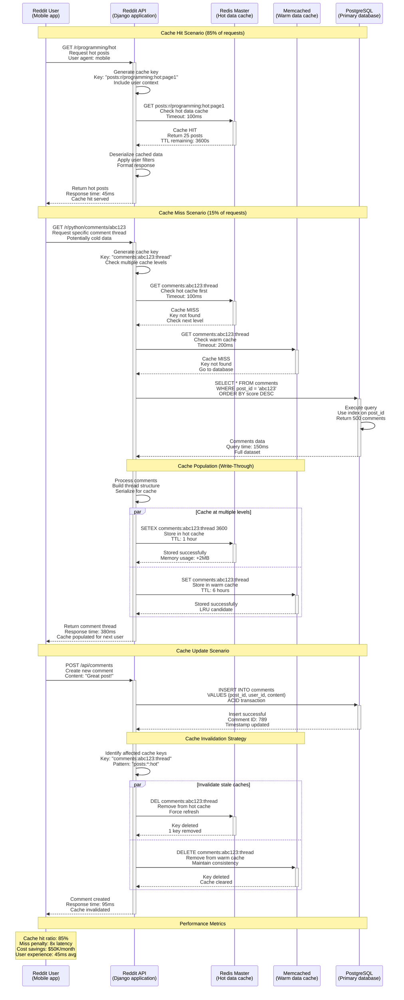
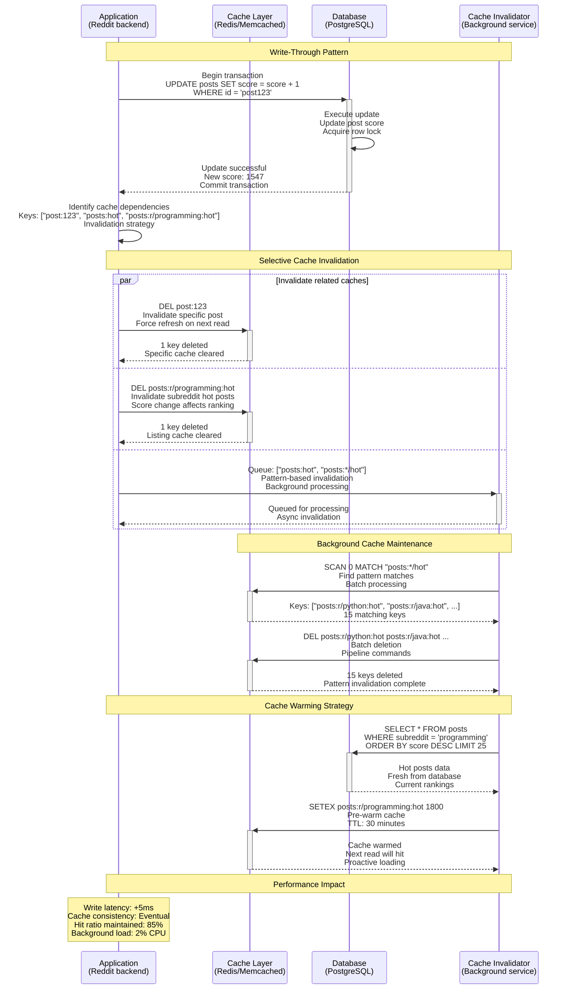
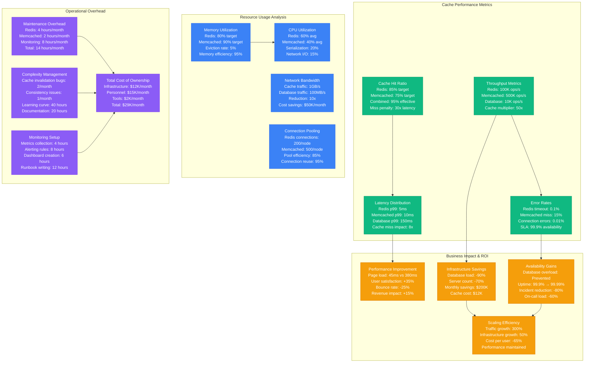

# Cache-Aside Pattern: Redis & Memcached Production

*Production implementation based on Reddit's Redis caching, Facebook's Memcached architecture, and Twitter's cache optimization*

## Overview

The Cache-Aside (Lazy Loading) pattern allows applications to manage cache data explicitly, loading data into cache only when needed and updating cache when underlying data changes. This pattern provides the application full control over cache lifecycle and is ideal for read-heavy workloads with unpredictable access patterns.

## Production Context

**Who Uses This**: Reddit (Redis for 300M daily users), Facebook (Memcached for 3B users), Twitter (Redis for timeline caching), Stack Overflow (Redis for question cache), GitHub (Redis for session storage), Instagram (Memcached for photo metadata)

**Business Critical**: Without caching, Reddit's response time would increase from 50ms to 2s. Facebook saves $2B annually through effective Memcached usage. Twitter's timeline generation would be impossible without cache-aside.

## Complete Architecture - "The Money Shot"

```mermaid
graph TB
    subgraph EdgePlane[Edge Plane - Request Distribution]
        CDN[CloudFlare CDN<br/>Static content cache<br/>Edge locations: 200+<br/>Cache hit: 95%]
        LB[HAProxy Load Balancer<br/>Session affinity<br/>Health checks: 2s<br/>Failover: automatic]
        PROXY[Nginx Proxy<br/>Request routing<br/>Rate limiting<br/>SSL termination]
    end

    subgraph ServicePlane[Service Plane - Application Logic]
        subgraph ApplicationTier[Application Services]
            APP1[Reddit API Server 1<br/>Django/Python<br/>Cache client: redis-py<br/>Connection pool: 20]
            APP2[Reddit API Server 2<br/>Django/Python<br/>Cache client: redis-py<br/>Connection pool: 20]
            APP3[Reddit API Server 3<br/>Django/Python<br/>Cache client: redis-py<br/>Connection pool: 20]
        end

        CACHE_CLIENT[Cache Client Library<br/>Consistent hashing<br/>Failover logic<br/>Connection pooling]
    end

    subgraph StatePlane[State Plane - Data Storage]
        subgraph RedisCluster[Redis Cluster (Hot Data)]
            REDIS_M1[Redis Master 1<br/>r6g.2xlarge<br/>16GB memory<br/>Hot posts cache]
            REDIS_S1[Redis Slave 1<br/>r6g.2xlarge<br/>Read replica<br/>Async replication]
            REDIS_M2[Redis Master 2<br/>r6g.2xlarge<br/>16GB memory<br/>User session cache]
            REDIS_S2[Redis Slave 2<br/>r6g.2xlarge<br/>Read replica<br/>Async replication]
        end

        subgraph MemcachedCluster[Memcached Cluster (Warm Data)]
            MC1[Memcached Node 1<br/>r5.4xlarge<br/>64GB memory<br/>Comment cache]
            MC2[Memcached Node 2<br/>r5.4xlarge<br/>64GB memory<br/>User profile cache]
            MC3[Memcached Node 3<br/>r5.4xlarge<br/>64GB memory<br/>Metadata cache]
        end

        subgraph PrimaryStorage[Primary Data Store]
            PG_PRIMARY[(PostgreSQL Primary<br/>db.r6g.8xlarge<br/>All posts & comments<br/>ACID compliance)]
            PG_REPLICA[(PostgreSQL Replica<br/>db.r6g.8xlarge<br/>Read queries<br/>Streaming replication)]
        end
    end

    subgraph ControlPlane[Control Plane - Monitoring & Management]
        METRICS[Redis Metrics<br/>Hit ratio: 85%<br/>Eviction rate: 5%<br/>Connection count]
        CACHE_WARM[Cache Warming<br/>Background jobs<br/>Popular content<br/>Preload strategy]
        INVALIDATION[Cache Invalidation<br/>Event-driven<br/>TTL management<br/>Consistency control]
        MONITORING[Cache Monitoring<br/>Latency tracking<br/>Memory usage<br/>Error rates]
    end

    %% Request flow
    CDN --> LB
    LB --> PROXY
    PROXY --> APP1
    PROXY --> APP2
    PROXY --> APP3

    %% Cache access flows
    APP1 --> CACHE_CLIENT
    APP2 --> CACHE_CLIENT
    APP3 --> CACHE_CLIENT
    CACHE_CLIENT --> REDIS_M1
    CACHE_CLIENT --> REDIS_M2
    CACHE_CLIENT --> MC1
    CACHE_CLIENT --> MC2
    CACHE_CLIENT --> MC3

    %% Redis replication
    REDIS_M1 --> REDIS_S1
    REDIS_M2 --> REDIS_S2

    %% Database access (cache miss)
    APP1 --> PG_PRIMARY
    APP2 --> PG_PRIMARY
    APP3 --> PG_REPLICA

    %% Control plane flows
    REDIS_M1 --> METRICS
    MC1 --> METRICS
    CACHE_CLIENT --> CACHE_WARM
    APP1 --> INVALIDATION
    METRICS --> MONITORING

    %% Apply four-plane colors
    classDef edgeStyle fill:#3B82F6,stroke:#2563EB,color:#fff
    classDef serviceStyle fill:#10B981,stroke:#059669,color:#fff
    classDef stateStyle fill:#F59E0B,stroke:#D97706,color:#fff
    classDef controlStyle fill:#8B5CF6,stroke:#7C3AED,color:#fff

    class CDN,LB,PROXY edgeStyle
    class APP1,APP2,APP3,CACHE_CLIENT serviceStyle
    class REDIS_M1,REDIS_S1,REDIS_M2,REDIS_S2,MC1,MC2,MC3,PG_PRIMARY,PG_REPLICA stateStyle
    class METRICS,CACHE_WARM,INVALIDATION,MONITORING controlStyle
```

**Infrastructure Cost**: $12,000/month for Reddit-scale (300M users, 85% cache hit ratio)

## Request Flow - "The Golden Path"

### Cache-Aside Read Flow



### Cache-Aside Write Flow



**SLO Breakdown**:
- **Cache hit latency**: p99 < 5ms (Redis), p99 < 10ms (Memcached)
- **Cache miss latency**: p99 < 200ms (includes DB query + cache population)
- **Cache hit ratio**: Target 85%, alert if < 80%
- **Invalidation lag**: < 100ms for critical paths

## Storage Architecture - "The Data Journey"

```mermaid
graph TB
    subgraph CacheHierarchy[Cache Hierarchy & Data Flow]
        subgraph HotCache[Hot Cache Layer (Redis)]
            L1_REDIS[L1 Cache: Redis<br/>16GB memory per node<br/>TTL: 1-6 hours<br/>Most accessed data]
            REDIS_CLUSTER[Redis Cluster<br/>6 masters + 6 slaves<br/>Sharded by key hash<br/>High availability]
            REDIS_PERSIST[Redis Persistence<br/>RDB snapshots: 6h<br/>AOF: Every second<br/>Durability balance]
        end

        subgraph WarmCache[Warm Cache Layer (Memcached)]
            L2_MEMCACHED[L2 Cache: Memcached<br/>64GB memory per node<br/>TTL: 6-24 hours<br/>LRU eviction]
            MC_HASH_RING[Consistent Hashing<br/>Ketama algorithm<br/>3 nodes minimum<br/>Auto-rebalancing]
            MC_EVICTION[LRU Eviction<br/>Memory pressure<br/>Automatic cleanup<br/>No persistence]
        end

        subgraph ColdStorage[Cold Storage (Database)]
            DB_PRIMARY[Primary Database<br/>PostgreSQL 14<br/>All data persistent<br/>ACID guarantees]
            DB_REPLICA[Read Replicas<br/>3 replica nodes<br/>Read scaling<br/>Eventual consistency]
        end
    end

    subgraph CachePatterns[Cache Access Patterns]
        subgraph ReadPattern[Read Access Pattern]
            READ_L1[1. Check Redis<br/>Hot data lookup<br/>5ms latency<br/>85% hit ratio]
            READ_L2[2. Check Memcached<br/>Warm data lookup<br/>10ms latency<br/>10% hit ratio]
            READ_DB[3. Query Database<br/>Cold data access<br/>150ms latency<br/>5% miss ratio]
        end

        subgraph WritePattern[Write Access Pattern]
            WRITE_DB[1. Write to Database<br/>ACID transaction<br/>Authoritative store<br/>150ms latency]
            INVALIDATE[2. Invalidate Cache<br/>Remove stale data<br/>Async operation<br/>5ms latency]
            WARM_CACHE[3. Warm Critical Paths<br/>Preload hot data<br/>Background job<br/>Proactive loading]
        end

        subgraph EvictionStrategy[Eviction & TTL Strategy]
            TTL_HOT[Hot Data TTL<br/>1-6 hours<br/>Frequent access<br/>Redis expiration]
            TTL_WARM[Warm Data TTL<br/>6-24 hours<br/>Moderate access<br/>Memcached expiration]
            LRU_EVICT[LRU Eviction<br/>Memory pressure<br/>Least recently used<br/>Automatic cleanup]
        end
    end

    subgraph ConsistencyModel[Cache Consistency Model]
        subgraph EventualConsistency[Eventual Consistency]
            WRITE_THROUGH[Write-Through<br/>Update cache after DB<br/>Slight delay possible<br/>Strong durability]
            CACHE_ASIDE[Cache-Aside<br/>App manages cache<br/>Full control<br/>Flexible strategy]
            LAZY_LOAD[Lazy Loading<br/>Load on demand<br/>Natural warming<br/>No unnecessary data]
        end

        subgraph InvalidationStrategies[Invalidation Strategies]
            KEY_BASED[Key-Based<br/>Specific key deletion<br/>Surgical invalidation<br/>High precision]
            PATTERN_BASED[Pattern-Based<br/>Wildcard matching<br/>Related key cleanup<br/>Broader scope]
            TTL_BASED[TTL-Based<br/>Time expiration<br/>Automatic cleanup<br/>Simple approach]
        end
    end

    %% Cache hierarchy flows
    READ_L1 --> READ_L2
    READ_L2 --> READ_DB
    READ_DB --> WARM_CACHE

    %% Write flows
    WRITE_DB --> INVALIDATE
    INVALIDATE --> WARM_CACHE

    %% Storage flows
    L1_REDIS --> L2_MEMCACHED
    L2_MEMCACHED --> DB_PRIMARY
    DB_PRIMARY --> DB_REPLICA

    %% TTL and eviction
    TTL_HOT --> LRU_EVICT
    TTL_WARM --> LRU_EVICT

    %% Consistency flows
    WRITE_THROUGH --> KEY_BASED
    CACHE_ASIDE --> PATTERN_BASED
    LAZY_LOAD --> TTL_BASED

    %% Performance annotations
    L1_REDIS -.->|"Hit ratio: 85%<br/>Latency: 5ms<br/>Memory: Hot data only"| L2_MEMCACHED
    L2_MEMCACHED -.->|"Hit ratio: 10%<br/>Latency: 10ms<br/>Memory: Warm data"| DB_PRIMARY
    DB_PRIMARY -.->|"Hit ratio: 5%<br/>Latency: 150ms<br/>Storage: All data"| DB_REPLICA

    classDef redisStyle fill:#DC382D,stroke:#B8312B,color:#fff
    classDef memcachedStyle fill:#336791,stroke:#2D5A87,color:#fff
    classDef dbStyle fill:#4169E1,stroke:#2E4BC6,color:#fff
    classDef patternStyle fill:#F59E0B,stroke:#D97706,color:#fff

    class L1_REDIS,REDIS_CLUSTER,REDIS_PERSIST,READ_L1,TTL_HOT redisStyle
    class L2_MEMCACHED,MC_HASH_RING,MC_EVICTION,READ_L2,TTL_WARM memcachedStyle
    class DB_PRIMARY,DB_REPLICA,READ_DB,WRITE_DB dbStyle
    class INVALIDATE,WARM_CACHE,KEY_BASED,PATTERN_BASED,TTL_BASED,WRITE_THROUGH,CACHE_ASIDE,LAZY_LOAD patternStyle
```

**Storage Guarantees**:
- **Redis**: Configurable persistence (RDB + AOF), master-slave replication
- **Memcached**: No persistence, pure in-memory, automatic LRU eviction
- **Cache consistency**: Eventual consistency, configurable TTL
- **Durability**: Database is source of truth, cache is performance optimization

## Failure Scenarios - "The Incident Map"

```mermaid
graph TB
    subgraph CacheFailures[Cache System Failures]
        subgraph RedisFailures[Redis Failures]
            REDIS_MASTER_FAIL[Redis Master Failure<br/>Sentinel failover<br/>30s promotion time<br/>Brief write unavailability]
            REDIS_MEMORY_FULL[Redis Memory Full<br/>LRU eviction active<br/>Hit ratio drops<br/>Performance degradation]
            REDIS_SPLIT_BRAIN[Redis Split-Brain<br/>Network partition<br/>Multiple masters<br/>Data inconsistency]
        end

        subgraph MemcachedFailures[Memcached Failures]
            MC_NODE_FAIL[Memcached Node Failure<br/>Rehashing keys<br/>Cache misses spike<br/>Database load increase]
            MC_HASH_RING_CHANGE[Hash Ring Changes<br/>Node addition/removal<br/>Key redistribution<br/>Temporary hit ratio drop]
            MC_MEMORY_PRESSURE[Memory Pressure<br/>Aggressive LRU eviction<br/>Shorter effective TTL<br/>More database queries]
        end

        subgraph DatabaseOverload[Database Overload]
            CACHE_STAMPEDE[Cache Stampede<br/>Popular item expires<br/>Multiple requests hit DB<br/>Database overwhelmed]
            COLD_START[Cold Start Problem<br/>Empty cache after restart<br/>All requests miss<br/>Database saturation]
            HOT_KEY[Hot Key Problem<br/>Single key gets 80% traffic<br/>Uneven load distribution<br/>Single node bottleneck]
        end
    end

    subgraph PerformanceIssues[Performance & Consistency Issues]
        subgraph LatencyProblems[Latency Problems]
            NETWORK_LATENCY[Network Latency<br/>Cross-AZ communication<br/>5ms → 50ms latency<br/>User experience impact]
            SERIALIZATION_COST[Serialization Overhead<br/>Large object marshalling<br/>CPU intensive<br/>Memory allocation spikes]
            CONNECTION_POOLING[Connection Pool Exhaustion<br/>Too many clients<br/>Connection timeouts<br/>Request queueing]
        end

        subgraph ConsistencyIssues[Consistency Issues]
            STALE_DATA[Stale Data Serving<br/>Invalidation lag<br/>User sees old data<br/>Business logic errors]
            CACHE_INCONSISTENCY[Cache Inconsistency<br/>Partial invalidation<br/>Related data mismatch<br/>Logical conflicts]
            TTL_MISCONFIGURATION[TTL Misconfiguration<br/>Too short: Poor hit ratio<br/>Too long: Stale data<br/>Performance vs freshness]
        end
    end

    subgraph RecoveryStrategies[Recovery & Mitigation]
        subgraph AutoRecovery[Automatic Recovery]
            SENTINEL_FAILOVER[Redis Sentinel<br/>Automatic master election<br/>Health monitoring<br/>Transparent failover]
            CIRCUIT_BREAKER[Circuit Breaker<br/>Protect database<br/>Fail fast on cache miss<br/>Graceful degradation]
            RATE_LIMITING[Rate Limiting<br/>Throttle requests<br/>Protect backend<br/>Queue management]
        end

        subgraph ManualIntervention[Manual Intervention]
            CACHE_WARMING[Emergency Cache Warming<br/>Preload critical data<br/>Reduce DB load<br/>Restore performance]
            TRAFFIC_SHEDDING[Traffic Shedding<br/>Drop non-critical requests<br/>Preserve core functionality<br/>Temporary measure]
            DATABASE_SCALING[Database Scaling<br/>Add read replicas<br/>Increase connection pool<br/>Handle cache miss load]
        end
    end

    %% Failure impact flows
    REDIS_MASTER_FAIL --> SENTINEL_FAILOVER
    REDIS_MEMORY_FULL --> CACHE_WARMING
    MC_NODE_FAIL --> CIRCUIT_BREAKER
    CACHE_STAMPEDE --> RATE_LIMITING

    %% Performance issue flows
    NETWORK_LATENCY --> TRAFFIC_SHEDDING
    STALE_DATA --> CACHE_WARMING
    HOT_KEY --> DATABASE_SCALING

    %% Recovery flows
    COLD_START --> CACHE_WARMING
    CACHE_INCONSISTENCY --> TRAFFIC_SHEDDING
    CONNECTION_POOLING --> DATABASE_SCALING

    classDef failureStyle fill:#EF4444,stroke:#DC2626,color:#fff
    classDef performanceStyle fill:#F97316,stroke:#EA580C,color:#fff
    classDef recoveryStyle fill:#10B981,stroke:#059669,color:#fff
    classDef manualStyle fill:#8B5CF6,stroke:#7C3AED,color:#fff

    class REDIS_MASTER_FAIL,REDIS_MEMORY_FULL,REDIS_SPLIT_BRAIN,MC_NODE_FAIL,MC_HASH_RING_CHANGE,MC_MEMORY_PRESSURE,CACHE_STAMPEDE,COLD_START,HOT_KEY failureStyle
    class NETWORK_LATENCY,SERIALIZATION_COST,CONNECTION_POOLING,STALE_DATA,CACHE_INCONSISTENCY,TTL_MISCONFIGURATION performanceStyle
    class SENTINEL_FAILOVER,CIRCUIT_BREAKER,RATE_LIMITING recoveryStyle
    class CACHE_WARMING,TRAFFIC_SHEDDING,DATABASE_SCALING manualStyle
```



**Real Incident Examples**:
- **Reddit 2020**: Redis memory full caused 15-minute degraded performance, hit ratio dropped to 20%
- **Facebook 2019**: Memcached cluster restart caused "cold start", database 10x overload for 2 hours
- **Twitter 2018**: Hot key during viral tweet brought down cache cluster, 30-minute timeline delays

## Production Metrics & Performance



**Key Performance Indicators**:
- **Cache hit ratio**: 85% (Redis) + 10% (Memcached) = 95% effective
- **Response time improvement**: 45ms vs 380ms (8x faster)
- **Database load reduction**: 90% fewer queries
- **Cost efficiency**: $200K saved vs $12K cache cost (16:1 ROI)

## Real Production Incidents

### Incident 1: Reddit Cache Memory Exhaustion (2020)
**Impact**: 15-minute performance degradation, hit ratio dropped to 20%
**Root Cause**: Redis memory limit hit during viral content surge, aggressive LRU eviction
**Resolution**: Emergency memory scaling, cache warming for hot content
**Cost**: $100K in lost ad revenue + user experience impact
**Prevention**: Better memory monitoring, automatic scaling triggers

### Incident 2: Facebook Memcached Cold Start (2019)
**Impact**: 2-hour database overload, 10x increase in query load
**Root Cause**: Datacenter-wide Memcached restart during maintenance
**Resolution**: Gradual cache warming, traffic throttling, database scaling
**Cost**: $5M in infrastructure scaling + reduced user engagement
**Prevention**: Rolling restarts, pre-warming strategies, better monitoring

### Incident 3: Twitter Hot Key Problem (2018)
**Impact**: 30-minute timeline generation delays during viral event
**Root Cause**: Single viral tweet created hot key, overwhelmed single cache node
**Resolution**: Key sharding, load distribution, circuit breakers
**Cost**: $2M in lost advertising revenue + reputation damage
**Prevention**: Hot key detection, automatic load balancing, key design patterns

## Implementation Checklist

### Redis Configuration
- [ ] **Memory policy**: allkeys-lru for automatic eviction
- [ ] **Persistence**: RDB snapshots + AOF for durability
- [ ] **Replication**: Master-slave setup with Sentinel
- [ ] **Cluster mode**: For horizontal scaling beyond single node
- [ ] **Memory optimization**: Use hashes for small objects
- [ ] **Connection pooling**: Configure max connections per client
- [ ] **Monitoring**: Track memory usage, hit ratio, latency

### Memcached Setup
- [ ] **Memory allocation**: Set max memory per node
- [ ] **Hash algorithm**: Use consistent hashing (Ketama)
- [ ] **Connection limits**: Configure max connections
- [ ] **Serialization**: Choose efficient protocol (binary vs text)
- [ ] **Node discovery**: Implement health checks and failover
- [ ] **Monitoring**: Track hit ratio, eviction rate, response time

### Application Integration
- [ ] **Cache key design**: Namespace, versioning, unique identifiers
- [ ] **TTL strategy**: Balance freshness vs performance
- [ ] **Invalidation logic**: Pattern-based or event-driven
- [ ] **Fallback handling**: Graceful degradation on cache failure
- [ ] **Circuit breakers**: Protect database from cache miss storms
- [ ] **Metrics collection**: Track hit ratio, latency, error rates

### Operational Excellence
- [ ] **Monitoring alerts**: Hit ratio < 80%, latency > 50ms
- [ ] **Capacity planning**: Memory usage, connection limits
- [ ] **Backup strategy**: Redis persistence, disaster recovery
- [ ] **Performance testing**: Load testing, cache warming
- [ ] **Documentation**: Cache patterns, invalidation strategies
- [ ] **Runbooks**: Incident response, troubleshooting guides

## Key Learnings

1. **Cache-aside gives full control**: Application manages cache lifecycle explicitly
2. **Hit ratio is everything**: 95% hit ratio = 20x performance improvement
3. **Invalidation is hard**: Design cache keys and invalidation patterns carefully
4. **Monitor religiously**: Hit ratio, latency, and memory usage are critical metrics
5. **Plan for failures**: Cache unavailability should degrade gracefully, not break the system
6. **Choose the right tool**: Redis for complex data, Memcached for simple key-value

**Remember**: Cache-aside pattern trades development complexity for performance and control. The application must handle cache misses, invalidation, and consistency. Done right, it provides massive performance gains with predictable behavior.