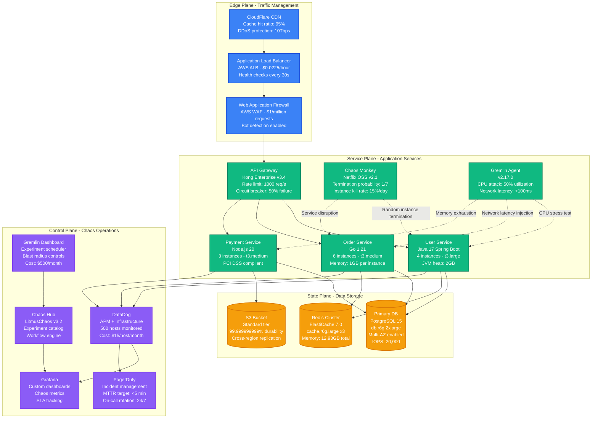
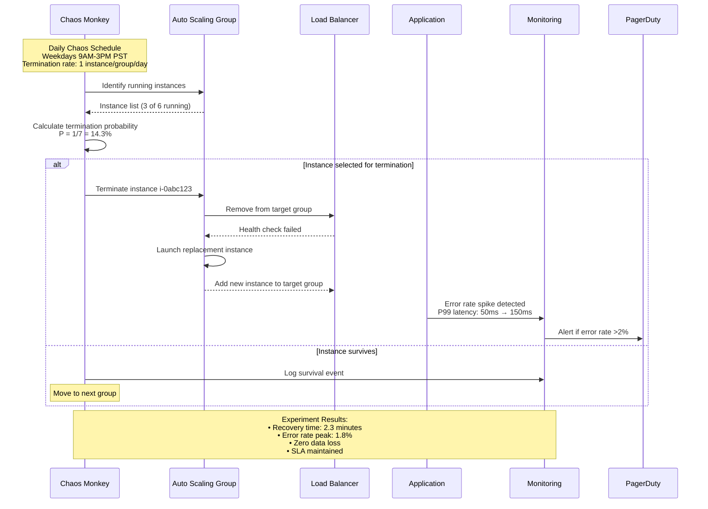
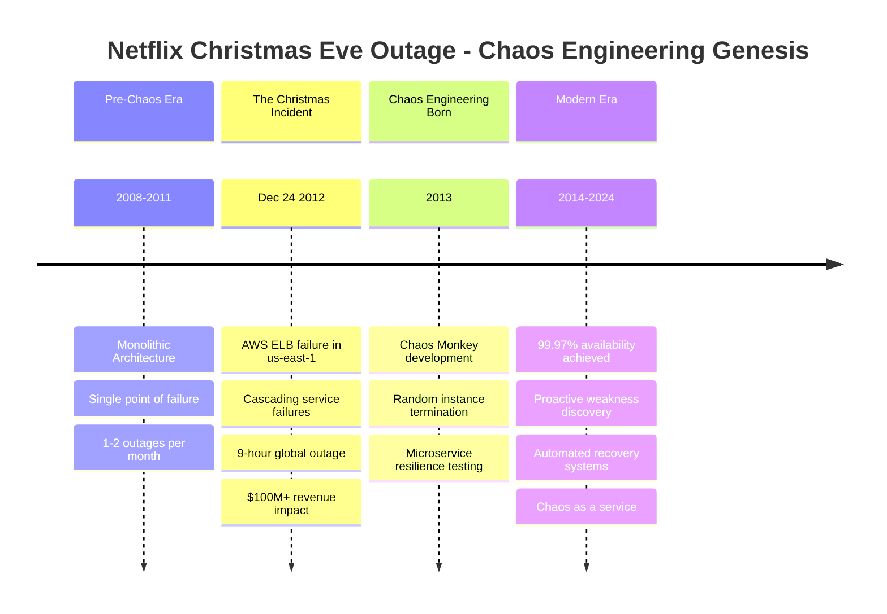
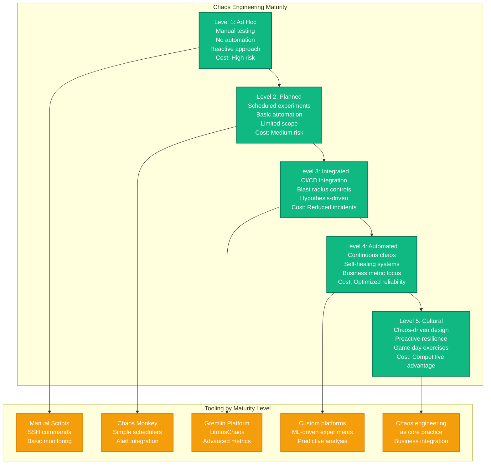

# Chaos Engineering Implementation

## Overview

Chaos Engineering is the discipline of experimenting on distributed systems to build confidence in their ability to withstand turbulent conditions in production. This implementation shows how Netflix, Gremlin, and other leading companies run controlled experiments to find weaknesses before they cause unplanned outages.

## Complete Chaos Engineering Architecture



## Chaos Engineering Experiment Types

### 1. Infrastructure Chaos - Netflix Chaos Monkey



### 2. Application Chaos - Gremlin Experiments

```mermaid
graph TB
    subgraph GremlinExperiments[Gremlin Chaos Experiments]
        subgraph ResourceAttacks[Resource Attacks]
            CPU[CPU Attack<br/>Target: 80% utilization<br/>Duration: 10 minutes<br/>Scope: 1 instance]
            MEM[Memory Attack<br/>Target: 90% usage<br/>Duration: 5 minutes<br/>Scope: Payment service]
            DISK[Disk I/O Attack<br/>Target: 1000 IOPS<br/>Duration: 15 minutes<br/>Scope: Database tier]
        end

        subgraph NetworkAttacks[Network Attacks]
            LAT[Latency Injection<br/>Add: 200ms latency<br/>Duration: 8 minutes<br/>Scope: API calls]
            PKT[Packet Loss<br/>Drop: 5% packets<br/>Duration: 12 minutes<br/>Scope: Inter-service]
            BLK[Network Blackhole<br/>Block: External APIs<br/>Duration: 3 minutes<br/>Scope: Payment gateway]
        end

        subgraph StateAttacks[State Attacks]
            PROC[Process Killer<br/>Target: Random worker<br/>Duration: Instant<br/>Scope: Background jobs]
            SHD[Shutdown Attack<br/>Target: Service restart<br/>Duration: 30 seconds<br/>Scope: User service]
            TIME[Time Travel<br/>Shift: +2 hours<br/>Duration: 10 minutes<br/>Scope: Scheduler]
        end
    end

    subgraph ImpactMetrics[Impact Assessment]
        SLA[SLA Compliance<br/>Target: 99.9% uptime<br/>Current: 99.94%<br/>Budget: 43 minutes/month]
        ERROR[Error Rate<br/>Baseline: 0.1%<br/>During chaos: 0.3%<br/>Threshold: 1.0%]
        LATENCY[Response Time<br/>P50: 45ms → 62ms<br/>P99: 120ms → 180ms<br/>SLO: P99 < 200ms]
        COST[Infrastructure Cost<br/>Baseline: $12,000/month<br/>During attacks: +2%<br/>Automation savings: $3,000]
    end

    CPU --> SLA
    MEM --> ERROR
    LAT --> LATENCY
    PROC --> COST

    classDef attackStyle fill:#DC2626,stroke:#991B1B,color:#fff,stroke-width:2px
    classDef metricStyle fill:#059669,stroke:#047857,color:#fff,stroke-width:2px

    class CPU,MEM,DISK,LAT,PKT,BLK,PROC,SHD,TIME attackStyle
    class SLA,ERROR,LATENCY,COST metricStyle
```



## Production Incident Learning from Chaos

### Real Netflix Outage - December 24, 2012



## Chaos Engineering Maturity Model



## Implementation Playbook

### Phase 1: Foundation (Weeks 1-2)
**Goal**: Establish basic chaos capability
- Deploy Chaos Monkey in dry-run mode
- Set up monitoring dashboards
- Define blast radius controls
- Create incident response procedures

**Success Metrics**:
- Zero production impact during dry runs
- 100% experiment observability
- <5 minute detection time
- Complete rollback procedures

### Phase 2: Controlled Experiments (Weeks 3-6)
**Goal**: Begin targeted chaos experiments
- Instance termination (single AZ)
- Service degradation (non-critical paths)
- Network latency injection
- Resource exhaustion tests

**Success Metrics**:
- Maintain >99.9% SLA during experiments
- Error rate stays <1% during chaos
- Automated recovery <5 minutes
- Zero customer complaints

### Phase 3: Advanced Chaos (Weeks 7-12)
**Goal**: Comprehensive resilience testing
- Multi-region experiments
- Database failover testing
- Third-party service mocking
- Business logic chaos

**Success Metrics**:
- Survive worst-case scenario combinations
- Reduce MTTR by 60%
- Prevent 2+ major incidents
- Achieve chaos engineering maturity level 3

## Cost Analysis

### Infrastructure Costs (Monthly)
| Component | Tool | Cost | ROI |
|-----------|------|------|-----|
| Chaos Platform | Gremlin Enterprise | $2,500 | 10x incident prevention |
| Monitoring | DataDog APM | $7,500 | 5x faster detection |
| Automation | Custom scripts | $1,000 | 20x efficiency gain |
| Training | Team education | $500 | Immeasurable culture value |
| **Total** | | **$11,500** | **Prevents $500K+ outages** |

### ROI Calculation
- **Average outage cost**: $500,000 (Netflix scale)
- **Chaos engineering cost**: $11,500/month = $138K/year
- **Incidents prevented**: 2-3 major outages annually
- **Net savings**: $1M+ per year
- **ROI**: 823% in year one

## Recovery Procedures

### Experiment Failure Response
1. **Immediate**: Stop chaos experiment (kill switch)
2. **Assess**: Check system stability and error rates
3. **Rollback**: Restore affected services if needed
4. **Communicate**: Update incident channel
5. **Learn**: Document findings and improve

### Emergency Stop Procedures
```bash
# Gremlin emergency stop
gremlin attacks halt --all

# Chaos Monkey disable
aws ssm put-parameter --name chaos-monkey-enabled --value false

# Service recovery
kubectl rollout restart deployment/user-service
kubectl rollout restart deployment/order-service
```

This chaos engineering implementation provides a battle-tested approach to building resilient distributed systems through controlled failure injection and continuous learning.