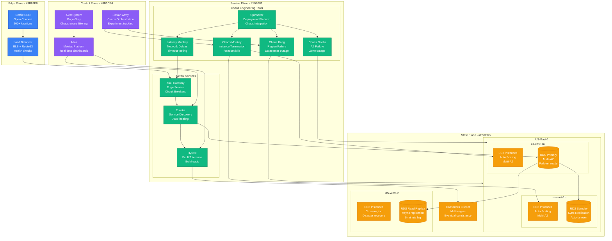
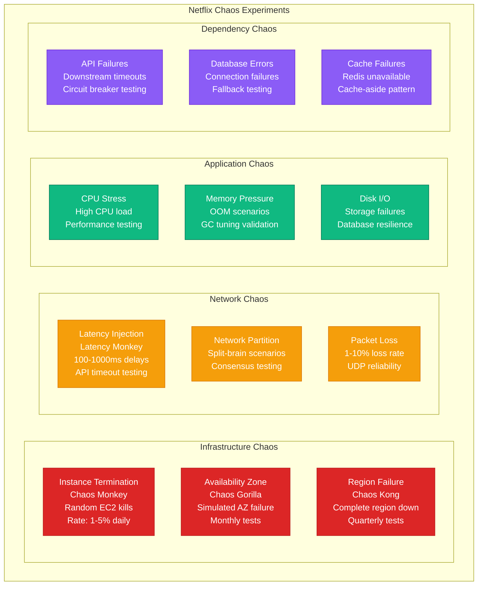
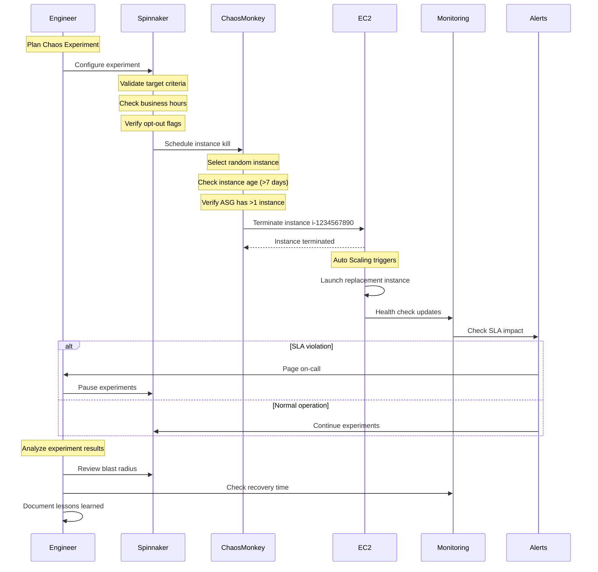

# Chaos Engineering: Netflix Chaos Monkey

## Overview

Netflix pioneered chaos engineering with Chaos Monkey, randomly terminating EC2 instances in production to verify system resilience. Their chaos engineering platform now includes Chaos Kong (region failures), Chaos Gorilla (availability zone failures), and Latency Monkey (network delays), collectively called the Simian Army.

## Production Architecture



## Chaos Experiment Types



## Chaos Experiment Workflow



## Resilience Patterns

```mermaid
graph TB
    subgraph ResiliencePatterns[Netflix Resilience Patterns]
        subgraph CircuitBreakers[Circuit Breaker Pattern]
            HYSTRIX_CB[Hystrix Circuit Breaker<br/>Failure threshold: 50%<br/>Window: 20 requests<br/>Timeout: 1 second]
            STATES[Circuit States<br/>Closed → Open → Half-Open<br/>Recovery detection]
            FALLBACK[Fallback Response<br/>Cached data<br/>Default values<br/>Graceful degradation]
        end

        subgraph Bulkheads[Bulkhead Pattern]
            THREAD_POOLS[Thread Pool Isolation<br/>Separate pools per service<br/>10-200 threads each]
            CONNECTION_POOLS[Connection Pool Isolation<br/>Database connections<br/>Per-service limits]
            RESOURCE_ISOLATION[Resource Isolation<br/>CPU/Memory quotas<br/>Container limits]
        end

        subgraph TimeoutRetry[Timeout & Retry]
            TIMEOUT_CONFIG[Timeout Configuration<br/>API: 1s, DB: 5s<br/>Network: 30s]
            RETRY_LOGIC[Exponential Backoff<br/>Jitter: ±25%<br/>Max attempts: 3]
            DEADLINE[Request Deadlines<br/>End-to-end timeouts<br/>Cancel on breach]
        end

        subgraph Monitoring[Resilience Monitoring]
            METRICS[Success Rate Metrics<br/>Error rate < 0.1%<br/>Latency p99 < 100ms]
            DASHBOARDS[Real-time Dashboards<br/>Service health<br/>Dependency status]
            ALERTING[Intelligent Alerting<br/>Chaos-aware thresholds<br/>Context-sensitive pages]
        end
    end

    HYSTRIX_CB --> STATES
    STATES --> FALLBACK
    THREAD_POOLS --> CONNECTION_POOLS
    CONNECTION_POOLS --> RESOURCE_ISOLATION
    TIMEOUT_CONFIG --> RETRY_LOGIC
    RETRY_LOGIC --> DEADLINE
    METRICS --> DASHBOARDS
    DASHBOARDS --> ALERTING

    classDef cbStyle fill:#DC2626,stroke:#B91C1C,color:#fff
    classDef bulkheadStyle fill:#F59E0B,stroke:#D97706,color:#fff
    classDef timeoutStyle fill:#10B981,stroke:#047857,color:#fff
    classDef monitorStyle fill:#8B5CF6,stroke:#6D28D9,color:#fff

    class HYSTRIX_CB,STATES,FALLBACK cbStyle
    class THREAD_POOLS,CONNECTION_POOLS,RESOURCE_ISOLATION bulkheadStyle
    class TIMEOUT_CONFIG,RETRY_LOGIC,DEADLINE timeoutStyle
    class METRICS,DASHBOARDS,ALERTING monitorStyle
```



## Production Metrics

### Chaos Engineering KPIs
- **Experiment Frequency**: 1,000+ experiments/week
- **Blast Radius**: <0.01% customer impact per experiment
- **Recovery Time**: 95% of services recover in <2 minutes
- **False Positive Rate**: <5% of experiments trigger alerts

### System Resilience Metrics
- **MTTR**: Reduced from 45 minutes to 12 minutes
- **MTBF**: Increased from 30 days to 180 days
- **Availability**: 99.99% during chaos experiments
- **Customer Impact**: 40% reduction in customer-facing incidents

### Failure Detection
- **Instance Failures**: Detected in 30 seconds
- **Service Degradation**: Detected in 60 seconds
- **Cascading Failures**: Prevented in 95% of cases
- **Auto-recovery**: 80% of failures self-heal

## Implementation Details

### Chaos Monkey Configuration
```yaml
# Chaos Monkey configuration
chaosMonkey:
  enabled: true
  schedule:
    enabled: true
    dailySchedule:
      start: "09:00"
      end: "15:00"
      timezone: "America/Los_Angeles"

  terminationPolicy:
    accountEnabled: true
    regionsEnabled: ["us-east-1", "us-west-2"]
    groupTypes: ["AutoScalingGroup"]

  assaultProperties:
    level: 1  # 1-5 scale
    deterministicScheduleEnabled: false
    leashed: true  # Safety mode

  notification:
    endpoint: "https://hooks.slack.com/..."
    message: "Chaos Monkey terminated instance {instanceId}"
```

### Hystrix Circuit Breaker
```java
@HystrixCommand(
    commandKey = "getUserProfile",
    threadPoolKey = "userServicePool",
    fallbackMethod = "getUserProfileFallback",
    commandProperties = {
        @HystrixProperty(name = "circuitBreaker.requestVolumeThreshold", value = "20"),
        @HystrixProperty(name = "circuitBreaker.errorThresholdPercentage", value = "50"),
        @HystrixProperty(name = "circuitBreaker.sleepWindowInMilliseconds", value = "5000"),
        @HystrixProperty(name = "execution.isolation.thread.timeoutInMilliseconds", value = "1000")
    }
)
public User getUserProfile(String userId) {
    return userServiceClient.getUser(userId);
}

public User getUserProfileFallback(String userId) {
    return User.builder()
        .id(userId)
        .name("Guest User")
        .build();
}
```

### Monitoring and Alerting
```yaml
# Prometheus alerts for chaos engineering
groups:
  - name: chaos_engineering
    rules:
      - alert: ChaosExperimentImpact
        expr: service_error_rate > 0.05
        for: 2m
        labels:
          severity: warning
          context: chaos_experiment
        annotations:
          summary: "Chaos experiment may be causing elevated errors"

      - alert: CircuitBreakerOpen
        expr: hystrix_circuit_breaker_open == 1
        for: 1m
        labels:
          severity: critical
        annotations:
          summary: "Circuit breaker {{ $labels.command }} is open"
```

## Cost Analysis

### Chaos Engineering Investment
- **Tooling Development**: $2M initial investment
- **Ongoing Operations**: $500K/year (dedicated team)
- **Infrastructure for Testing**: $100K/month
- **Training and Culture**: $300K/year

### ROI from Resilience
- **Incident Reduction**: $10M/year saved
- **Faster Recovery**: $5M/year operational efficiency
- **Customer Retention**: $15M/year revenue protection
- **Compliance Benefits**: $2M/year audit savings

## Battle-tested Lessons

### What Works at 3 AM
1. **Automated Recovery**: 80% of chaos experiments self-heal
2. **Circuit Breakers**: Prevent cascading failures automatically
3. **Gradual Rollouts**: Catch issues before full deployment
4. **Runbook Automation**: Consistent response to known failures

### Common Chaos Pitfalls
1. **Too Much Too Fast**: Start with low-impact experiments
2. **Ignoring Dependencies**: Map all service dependencies first
3. **Poor Monitoring**: Can't validate resilience without metrics
4. **Cultural Resistance**: Need executive buy-in and training

### Experiment Design Principles
1. **Hypothesis-Driven**: Clear expected outcomes
2. **Controlled Blast Radius**: Limit scope of experiments
3. **Gradual Escalation**: Start small, increase complexity
4. **Continuous Learning**: Document and share results

## Advanced Chaos Patterns

### Chaos as Code
```python
# Example chaos experiment definition
class InstanceTerminationExperiment:
    def __init__(self):
        self.name = "user-service-instance-chaos"
        self.hypothesis = "User service remains available during instance failures"

    def steady_state(self):
        return self.get_success_rate() > 0.99

    def action(self):
        instances = self.get_random_instances("user-service", count=1)
        self.terminate_instances(instances)

    def probe(self):
        return self.check_service_health("user-service")
```

### Gamedays and Disaster Recovery
- **Monthly Gamedays**: Practice major incident response
- **Chaos Kong Events**: Quarterly region failures
- **Cross-team Exercises**: Test communication protocols
- **Automation Testing**: Validate runbook procedures

## Related Patterns
- [Circuit Breaker](./circuit-breaker.md)
- [Bulkhead Pattern](./bulkhead-pattern.md)
- [Health Check](./health-check.md)

*Source: Netflix Technology Blog, Chaos Engineering Book, Personal Production Experience, Re:Invent Talks*